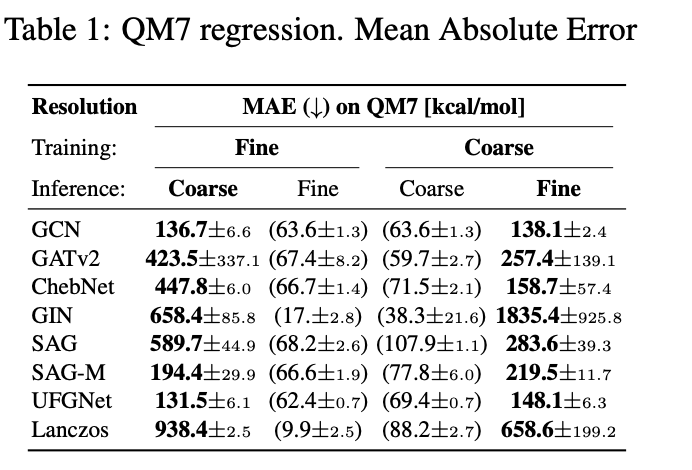
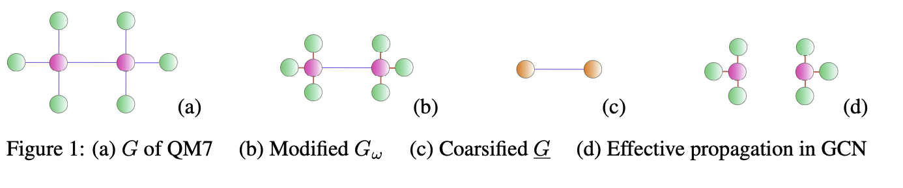
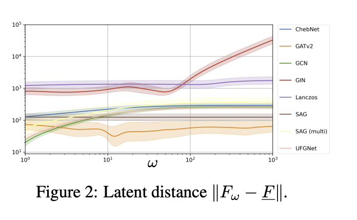
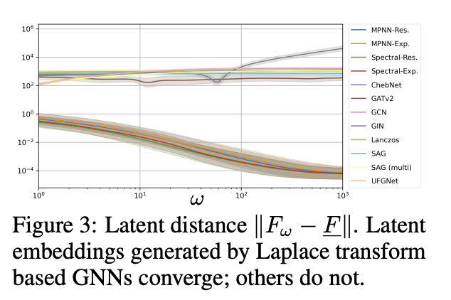
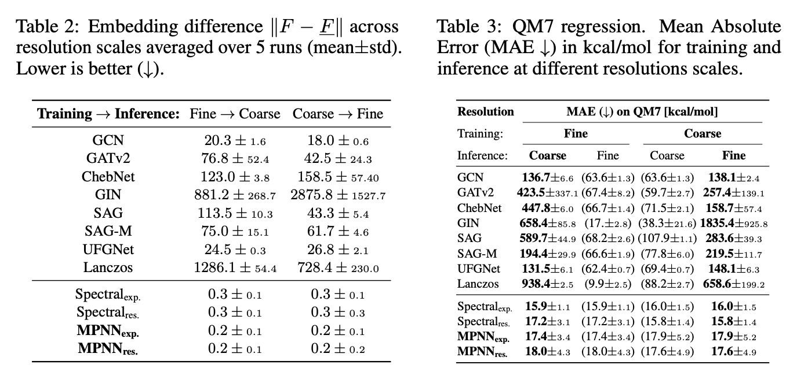

<https://openreview.net/pdf?id=RYl2VWfIRI>

### 초록

표준적인 메시지 패싱 그래프 신경망(Message Passing Graph Neural Networks, MPNNs)은 서로 다른 해상도(resolution)에서 동일한 기저 객체를 기술하는 그래프들에 대해 매우 서로 다른 잠재 임베딩(latent embedding)을 할당하는 경향이 있다. 그 결과, 메시지 패싱 그래프 신경망은 일반적으로 서로 다른 해상도 스케일 사이에서의 일반화에 실패한다. 기존 연구에서는 이러한 문제를 해결하기 위해 MPNN 대신 특정한 형태의 스펙트럴 그래프 신경망(spectral graph neural networks)을 사용하면 이를 극복할 수 있음을 보였다. 본 논문에서는 스케일 연속성(scale continuity)을 달성하는 데 스펙트럴 방법이 반드시 필요한 것은 아님을 보인다. 우리는 메시지 패싱 네트워크가 적절히 수정된다면 동일하게 스케일 연속성을 갖도록 만들 수 있음을 입증한다. 이를 위해 연속성을 보장하기 위한 구조적 요구조건을 규명하고, 해상도 스케일이 달라지더라도 임베딩을 안정적으로 보존할 가능성이 높은 메시지 패싱 아키텍처의 한 계열을 도출한다. 또한 실험적으로 이러한 모델들이 로컬 메시지 패싱 방법의 유연성과 확장성을 유지하면서도 스펙트럴 접근법과 유사한 수준의 **스케일 간 일반화 성능(cross-scale generalization)**을 달성함을 보인다.

## 1 INTRODUCTION

그래프 신경망의 광범위한 채택을 뒷받침하는 핵심 이론적 기둥 중 하나는 그래프 신경망(Graph Neural Networks, GNNs)이 안정적이고 연속적인 사상(stable and continuous mappings)을 정의한다는 널리 공유된 믿음이다: 입력 그래프에서의 작은 변화는 학습된 표현에서도 그에 상응하는 작은 변화를 유도할 것으로 기대된다 (Ruiz et al., 2020; Maskey et al., 2021; Roddenberry et al., 2022; Le & Jegelka, 2023).  
최근 이러한 관점은 그래프 해상도 스케일 변화 하에서의 안정성 문제라는 맥락에서 도전받고 있다: Koke et al. (2024; 2025)에서는 메시지 패싱 층에 기반한 일반적인 그래프 신경망이 그래프 코어스닝(graph coarsening) 연산 하에서 연속적이지 않다는 것이 밝혀졌다. 그래프 $G$와 그 코어스닝된 버전 $\bar{G}$에 대해 MPNN이 생성한 잠재 임베딩 $F, \bar{F}$는 매우 크게 다르다. 이러한 스케일 간 불연속성의 근본 원인은 표준 메시지 패싱 신경망의 근본적인 한계에 존재하는 것으로 확인되었다. 이러한 한계를 극복하고 스케일 간 일반화가 가능한 모델을 구축하기 위해 Koke et al. (2024; 2025)은 스펙트럴 접근을 취하였으며, spectral GNN 내부에서 노드 특징 행렬 $X$의 층별 업데이트 규칙이 다음과 같이 구현될 경우

$$
X \mapsto \sum_{k=1}^{K} \psi_k(L) X W_k, \tag{1}
$$

그 결과 네트워크는 스케일 연속성을 가지게 된다는 것을 보였다; 즉 서로 다른 해상도에서 동일한 객체를 설명하는 그래프 $G, \bar{G}$에 대해 유사한 잠재 임베딩 $(F \approx \bar{F})$을 할당한다. (1)  여기서 $L$은 자연스러운("비정규화된") 그래프 라플라시안(graph Laplacian)이며 (cf. 또한 Appendix A.1 참조), $L$에 적용되는 함수 $\psi_k$는 특정한 형태를 가진다 (라플라스 변환에서 유도됨; cf. 아래 Section 3 참조).

이러한 연구들 또한 (cf. 예: Koke et al. (2025, Appendix B.1)) 표준 MPNN은 결코 스케일 연속적이지 않으며, 서로 다른 해상도에서 동일한 객체를 설명하는 유사한 그래프 $G, \bar{G}$에 대해 매우 서로 다른 잠재 임베딩 $F, \bar{F}$을 생성한다는 것을 보여주었다. 이러한 결과는 층별 업데이트가 (1)에서 정의된 형태를 따르는 스펙트럴 그래프 신경망만이 스케일 연속적일 수 있다고 가정하게 만들 수 있다. 그러나 여기서 우리는 이것이 사실이 아님을 보인다: 메시지 패싱이 적절하게 구현된다면 MPNN 또한 스케일 연속적으로 만들 수 있다. 구체적으로 우리는 다음과 같은 층별 업데이트를 갖는 MPNN이

$$
h_u^{(\ell+1)} = \sum_{v \in G} m_{uv}, \qquad
m_{uv} = [\psi(L)]_{vu} \cdot \phi(h_u^{(\ell)}, h_v^{(\ell)}), \qquad
h_0 = \psi(L) X,
\tag{2}
$$

실제로 스케일 연속적임을 보인다. 여기서 $h_u^{(\ell)}$는 층 $\ell$에서 노드 $u$의 잠재 표현이며, $\phi(\cdot,\cdot)$는 학습 가능한 메시지 함수이고 $\psi(L)$은 $L$에 적용되는 특정한 (종류의; cf. Section 3) 함수이다.

## 2 RECAP: DISCONTINUITY OF STANDARD MPNNS ACROSS SCALES

서로 다른 해상도에서의 데이터를 일관되게 처리하는 데 기존 GNN 아키텍처가 어려움을 겪는다는 것을 보이기 위해, 우리는 (Koke et al., 2024; 2025)의 실험 설정을 채택하고 QM7 벤치마크 데이터셋(Rupp et al., 2012)을 사용한다. 이 데이터셋은 수소와 더 무거운 원소들로 구성된 작은 유기 분자들로 이루어져 있으며, 이들의 원자화 에너지를 예측하는 과제를 가진다. 각 분자는 가중 그래프로 인코딩되며, 그 인접 행렬은 다음과 같이 정의된다
$$
A_{ij} = Z_i Z_j |\vec{x}_i - \vec{x}_j|^{-1},
$$
이는 원자 $i$와 $j$ 사이의 쿨롱 상호작용 에너지를 나타낸다.

물리적 관점에서 보면, 상호작용하는 원자 수준에서 분자를 기술하는 것은 특정한 해상도 스케일을 선택하는 것에 해당하며, 이때 개별 원자 내부에 존재하는 개별 양성자와 중성자 사이의 상호작용은 무시된다. GNN의 스케일 연속성을 시험하기 위해 우리는 해상도 스케일을 더 낮춘 QM7의 한 변형도 고려한다: 여기에서는 각 무거운 원자 핵을 그 주변의 (단일 양성자를 가진) 수소 원자들과 함께 하나의 슈퍼노드로 집계한다.

GNN이 여러 스케일을 일관되게 통합하는 데 실패한다는 것을 보여주기 위해, 우리는 추론 단계에서 모델이 학습된 스케일과 다른 스케일의 QM7 버전을 사용하여 모델을 평가한다. Table 1에 요약된 것처럼, 모델을 동일 해상도 설정에서 교차 해상도 설정으로 옮기면 평균 절대 오차(mean absolute error)가 급격히 증가한다. 

풀링 기반 또는 멀티스케일 변형(SAG-M부터 PushNet까지)을 포함한 어떤 아키텍처도 여러 스케일을 신뢰성 있게 처리하지 못한다. 이는 원래 그래프 $\{G\}$와 코어스닝된 그래프 $\{\bar{G}\}$에 대해 생성되는 잠재 임베딩 $\{F\}$와 $\{\bar{F}\}$로 거슬러 올라가 설명할 수 있다: Table 1의 모델들에 대해 평균적으로
$$
10 \lesssim \|F - \bar{F}\| \lesssim 10^3
$$
이다 (cf. 또한 아래 Table 2 참조): 서로 다른 해상도에서 동일한 객체를 설명하는 그래프들의 잠재 표현은 상당히 크게 다르다.

(Koke et al., 2024; 2025)에서 주장된 바와 같이 이러한 잠재 임베딩 차이의 근본적인 이유는 표준 GNN이 연속적이지 않기 때문이다. 이를 보기 위해 우리는 fine 해상도와 coarse 해상도 사이를 보간(interpolate)한다: QM7의 원래 그래프 $\{G\}$는 수소 원자들을 대응되는 무거운 원자 쪽으로 $\omega \ge 1$의 비율만큼 이동시켜 수정된 그래프 $\{G_\omega\}$로 변형된다 (즉 $\mathrm{dist}_{new} = \mathrm{dist}_{equilib.}/\omega$). $\omega \to \infty$이면 이들은 각각의 무거운 원자에 도달하게 된다 ($\{\bar{G}\}$). Fig. 2에서는 우리는 coarse 임베딩 $\bar{F}$와 중간 그래프의 임베딩 $F_\omega$ 사이의 잠재 거리(latent distance)를 비교한다. 임베딩 $F_\omega$는 coarse 임베딩 $\bar{F}$로 수렴하지 않는다. 그래프 열(sequence) $G_\omega$가 극한 그래프 $\bar{G}$로 수렴함에도 불구하고 잠재 임베딩이 $F_\omega \not\to \bar{F}$이므로 우리는 다음과 같이 결론 내린다: 이 설정에서 GNN은 연속적이지 않다. 이러한 불연속성은 왜 GNN이 유사한 그래프들(서로 다른 해상도에서 동일한 객체를 설명하는)을 서로 다른 잠재 표현으로 사상할 수 있는지를 설명한다.

이러한 불연속성을 이해하기 위해, 예시적으로 GCN (Kipf & Welling, 2017)을 살펴볼 수 있다. 여기서 층별 업데이트는 $X \mapsto \hat{A}XW$로 작용하며, 특징 행렬 $X \in \mathbb{R}^{N \times F}$ (노드 수 $N$; 잠재 차원 $F$), 가중치 행렬 $W \in \mathbb{R}^{F \times F}$, 그리고 재정규화된 인접 행렬 $\hat{A} \in \mathbb{R}^{N \times N}$을 사용한다. 수소 원자들이 무거운 원자들에 더 가까이 이동함에 따라 $\hat{A}_{ij} \sim A_{ij}/\sqrt{d_i d_j}$에서 $\hat{A}_{\text{heavy},\text{heavy}}$ 항은 0으로 수렴한다 (차수 $d_{\text{heavy}}$는 무한대로 발산한다). 이는 그래프 전체에서의 정보 흐름을 방해하게 된다 (Fig 1 (d)).

## 3 GLOBAL LAPLACE PROPAGATION IN GNNS

Fig. 1 (d)와 같은 분리된(disconnected) 극한 전파를 피하기 위해, GCN의 전파 방식은 다음과 같이 수정된다:

### 3.1 SPECTRAL NETWORKS

$G_\omega$와 $\bar{G}$에서의 정보 흐름을 연결하기 위해, $G_\omega$에서의 특징(feature)은 큰 엣지 가중치로 연결된 노드들 사이에서 더 빠르게 같아져야 한다는 점을 주목할 수 있다. 이러한 큰 가중치가 무한대로 수렴하면, 강하게 연결된 노드들 사이의 특징은 즉시 동일해지며, 그 결과 전체 강연결 클러스터는 $\bar{G}$에서의 단일 노드처럼 정확히 동작하게 된다. 이는 그래프 위에서 열이 확산되는 현상과 동일한 거동이다. 따라서 우리는 그래프 위의 열 확산 방정식
$$
\frac{dX(t)}{dt} = -L \cdot X(t)
$$
(그래프 라플라시안 $L$과 시간 $t$를 사용)과 그 해의 구조
$$
X(t) = e^{-Lt} \cdot X(0)
$$
를 활용하여 스케일 연속적인 그래프 네트워크를 설계할 수 있다: $\hat{\psi}$를 $[0,\infty)$ 위에서 정의된 유계(일반화된) 함수라고 하자. Global Laplacian Propagation Matrix $\psi(L)$은 다음과 같이 정의되는 모든 행렬이다
$$
\psi(L) := \int_0^{\infty} e^{-tL} \hat{\psi}(t)\,dt .
$$
따라서 $\psi(L)$은 서로 다른 시간 동안 진행된 확산 흐름들의 가중 합을 나타낸다. 구체적으로 가중 함수 $\hat{\psi}_{\delta_{t_k}}(t) := \delta(t - t_k)$로 디랙 분포를 선택하면 우리는 지수 행렬
$$
\psi_k(L) = \int_0^{\infty} \delta(t - t_k)e^{-tL}dt = e^{-t_k L}
$$
을 얻고, 또한 $\hat{\psi}_k := (-t)^{k-1} e^{-\lambda t}$를 선택하면 resolvent의 거듭제곱
$$
\psi_k(L) = [(z Id + L)^{-1}]^k
$$
을 얻게 된다.

(Koke et al., 2024; 2025)에서는 GCN의 업데이트 규칙 $X \mapsto \hat{A}XW$를 $X \mapsto \psi(L)XW$ (여기서 $\psi(L)$은 Laplacian 전파 행렬)로 대체하면, 그 결과 네트워크가 스케일 연속적이 된다는 것이 증명되었다 (예: Fig. 2의 설정에서 $\|F_\omega - \bar{F}\| \to 0$). 또한 GCN은 가장 단순한 형태의 spectral network로 볼 수 있으며, 이를 통해 스케일 연속성 결과를 보다 일반적인 spectral network로 확장할 수 있음이 지적되었다. 이때 층별 업데이트 규칙은
$$
X \mapsto \sum_{k=1}^{K} \psi_k(L) X W_k
$$
의 형태를 갖는다.

### 3.2 MESSAGE PASSING NETWORKS:

여기서 우리는 GCN이 가장 단순한 spectral GNN일 뿐만 아니라 가장 단순한 message-passing 기반 GNN이기도 하다는 점을 주목한다. 따라서 우리는 spectral GNN을 scale continuous하게 만드는 이전 결과들을 message passing 네트워크 영역으로도 확장하는 것을 목표로 한다.

message passing 기반 네트워크를 scale continuous하게 만들기 위해 정확히 어떤 수정이 필요한지를 파악하기 위해, 우리는 binary edge 설정(인접 행렬 항목 $A_{uv} \in \{0,1\}$)에서 직관을 얻는다: sum aggregation을 사용하는 네트워크의 경우 MPNN의 층별 업데이트는 다음과 같이 쓸 수 있다
$$
h_u^{(\ell+1)} = \sum_{v \in G} m_{uv},
$$
메시지 함수는
$$
m_{uv} = A_{uv} \cdot \phi(h_v^{(\ell)}, h_u^{(\ell)}).
$$
Section 2에서 보았듯이, 이러한 adjacency 중심 전파 방식은 스케일에 대해 연속적이지 않은 네트워크를 만든다. 따라서 우리는 전파 구조에서 $A \mapsto \psi(L)$ 치환을 사용한다:
$$
h_u^{(\ell+1)} = \sum_{v \in G} m_{vu}, \qquad
m_{uv} = [\psi(L)]_{uv} \cdot \phi(h_u^{(\ell)}, h_v^{(\ell)}), \qquad
h_0 = \Psi(L)X,
\tag{3}
$$

$\phi(h_u^{(\ell)}, h_v^{(\ell)}) = W \cdot h_v^{(\ell)}$로 선택하면 이는 Section 3.1의 수정된 GCN 버전으로 환원된다.

**Scalability**: 겉보기에는 Laplace 변환 행렬 $\psi(L)$을 따라 전파하는 것은 확장성이 어려워 보일 수 있다. 왜냐하면 $\psi(L)=e^{-tL}$과 같은 행렬은 보통 dense이기 때문이다. 따라서 단순 구현을 하면 $N$개의 노드를 가진 그래프에서 $N^2$개의 메시지를 전달해야 할 수도 있다. 그러나 실제로 이는 실용적인 병목이 되지 않는다: 대부분의 항들은 매우 작아 사실상 0에 가깝기 때문이다 (Bauer et al., 2017). 따라서 전파는 실제로는 효과적으로 sparse하게 유지되며, 매우 작은 값의 간선들은 실제 구현에서 안전하게 제거할 수 있다.

Theoretical Guarantees: (3)에서 개요적으로 제시된 것과 정확히 동일한 방식으로 message-passing 기반 그래프 신경망을 수정하면 실제로 scale continuous한 네트워크가 얻어짐을 우리는 다음에서 보인다. 우리의 주요 Theorem(부록 Appendix C.2에서 증명됨)은 수정된 MPNN의 scale-continuity를 확립한다:

Theorem 3.1. In the setting of Figure 2 let $F_\omega$ and $\bar{F}$ be the latent embeddings generated for graphs $G_\omega$ and $\bar{G}$ by a modified message passing network. For such latent embeddings we have $\|F_\omega - \bar{F}\| \to 0$ as $\omega$ increases.

따라서 (3)에서의 수정된 MPNN은 Section 2의 설정에서 실제로 연속적이며, 그 결과 서로 다른 해상도에서 동일한 객체를 설명하는 그래프 $G$, $\bar{G}$에 대해 유사한 잠재 임베딩 $F \approx \bar{F}$을 할당한다.

## 4 NUMERICAL INVESTIGATION OF SCALE CONTINUITY FOR MPNNS

스케일 간 연속성: Theorem 3.1은 (3)과 같은 Laplace 변환 기반 전파 방식을 사용하는 MPNN이 그래프 공간에서 그 잠재 공간으로 가는 사상으로서 연속적임을 의미한다. 이를 수치적으로 검증하기 위해, 우리는 이 범주에 속하는 모델들에 대해 Figure 2의 실험을 반복한다 (resolvent 행렬과 exponential 행렬을 사용; cf. Section 3의 spectral 설정과 spatial 설정). Fig. 3에서 분명히 보이듯이, Laplace 변환 전파를 사용하는 모델들—수정된 MPNN 기반 방법을 포함하여—이 생성한 잠재 임베딩은 실제로 수렴한다 ($\|F_\omega - \bar{F}\| \to 0$). 

> 규빈: 아래쪽 곡선이 (좋은거) MPNN-Res, MPNN-Exp, Spectral-Res, Spectral-Exp 

따라서 Section 3.2에서 구성한 message passing 모델들에 대해 우리는 원하는 스케일 간 연속성을 실제로 확인하였다.

Resulting Generalization Ability: Section 2에서 우리는 스케일 간 일반화를 가로막는 원인이 연속성의 결여임을 확인하였다. 위에서 확인했듯이 Laplace 변환 기반 전파를 사용하는 MPNN은 연속적이다. 따라서 이러한 모델들은 유사한 그래프를 유사한 잠재 임베딩으로 사상할 것으로 기대된다. 이를 검증하기 위해 우리는 여기서 Section 2의 Table 1에서 수행한 일반화 실험을 다시 수행한다.

Table 2의 표준 GNN들과 비교하면, 서로 다른 해상도(cross-resolution) 설정에서 global Laplacian 전파 방식을 사용하는 방법들이 생성한 잠재 임베딩의 차이 $\|F - \bar{F}\|$는 표준 그래프 학습 방법들에 비해 약 $10^2$에서 $10^4$ 배 정도 더 작다는 것을 확인할 수 있다. 또한 spectral 방법들뿐만 아니라 Laplace 변환 기반 전파를 사용하는 MPNN이 생성한 임베딩 역시 안정적임을 확인할 수 있다 ($\|F - \bar{F}\| \approx 0$).

잠재 표현에서의 매우 작거나 무시할 수 있는 수준의 변화는 예측 성능에서도 매우 작거나 무시할 수 있는 수준의 변화로 이어진다: 아래 Table 3에서 확인할 수 있듯이, 서로 다른 해상도(cross-resolution) 설정에서 Laplace 변환 기반 GNN이 생성한 MAE는 동일 해상도 설정(same-resolution)에서의 값과 본질적으로 동일하다. Laplace 변환 전파 방식을 사용하는 GNN은 스케일 간 일반화(generalize across scales)가 가능하다. 이는 spectral 방법에만 국한되지 않는다: 수정된 MPNN 기반 방법 또한 스케일 간 일반화가 가능하다.

### 5 DISCUSSION

우리는 스케일 연속성이 spectral graph neural networks에만 국한되지 않으며 message passing 모델에서도 달성될 수 있음을 보였다. adjacency 기반 전파를 Laplace 변환 기반 정보 흐름으로 대체함으로써 MPNN은 그래프 해상도 전반에 걸쳐 연속적임이 이론적으로 보장되도록 만들 수 있다. 이는 spectral 접근과 spatial 접근을 하나의 공통 원리 아래에서 통합한다: 연속성은 네트워크 계열이 아니라 전파 연산자(propagation operator)에 의해 결정된다. 실험적으로도 새롭게 제안된 message passing 기반 모델들은 spectral 방법과 동일한 수준의 스케일 간 일반화 능력을 보인다.
