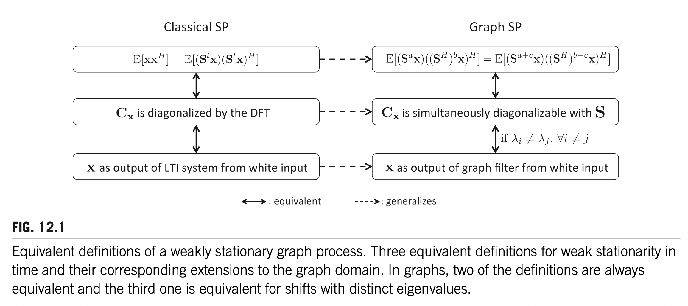

# 12. STATISTICAL GRAPH SIGNAL PROCESSING: STATIONARITY AND SPECTRAL ESTIMATION

Santiago Segarra*, Sundeep Prabhakar Chepuri†, Antonio G. Marques‡, Geert Leus†

Massachusetts Institute of Technology, Cambridge, MA, United States* Delft University of Technology, Delft, The Netherlands† Department of Signal Theory and Communications, King Juan Carlos University, Madrid, Spain‡

## 12.1 RANDOM GRAPH PROCESSES
### 12.1.1 INTRODUCTION

그래프 신호처리의 대부분의 도구는 본질적으로 결정론적(deterministic)이다. 예를 들어, 확산(diffusion)을 이용한 그래프 신호 디노이징 [1], 그래프 신호의 샘플링 및 복원 [2–7], 그래프 필터 설계 [8–11] 등이 있다. 최근에야 비로소 그래프 신호에 맞춤화된 통계적 신호처리 방법이 도입되기 시작했다. 시공간(spatiotemporal) 신호에 초점을 맞춘 고전적 신호처리에서 알 수 있듯이, 통계적 방법은 최적의 샘플링 및 복원 기법을 설계할 때 통계적 정보를 고려할 수 있게 해준다. 예를 들어, 디노이징, 보간(interpolation), 예측(prediction) 등을 위한 비너(Wiener) 필터링이 그러하다 [12]. 이는 일반적으로 결정론적 방법에 비해 더 나은 평균 성능을 제공한다. 대부분의 통계적 방법의 핵심은 약정상성(weak stationarity)의 개념으로, 이는 확률 과정의 1차 및 2차 통계량이 공간 및/또는 시간에 걸쳐 변하지 않는다는 것을 의미한다. 이 개념을 그래프 신호로 확장하는 것은 자명하지 않은데, 이는 그래프 신호가 비정규적(irregular) 구조를 가지며, 이 구조가 일반적으로 소위 그래프 시프트(graph shift, 시간 및/또는 공간에서의 시프트의 일반화)로 특성화되기 때문이다. 이것이 본 장에서 다룰 내용이다.

정상 그래프 과정(stationary graph processes)을 논의한 최초의 연구들은 시간 및/또는 공간에서의 시프트와 달리 그래프 시프트는 에너지를 보존하지 않는다는 점을 관찰하였다 [13,14].

::: {.callout-note collapse="true" title="에너지 보존이 깨지는 이유"}
고전적 시간 시프트 연산자는 직교 행렬이므로 $\|\mathbf{Sx}\| = \|\mathbf{x}\|$이 성립하지만, 그래프 시프트 연산자(인접 행렬 $\mathbf{A}$)는 일반적으로 직교/유니터리가 아니므로 $\|\mathbf{Ax}\| \neq \|\mathbf{x}\|$이다. 여기서 $\mathbf{S}$는 순환 시프트 행렬(circular shift matrix)로, 각 행과 열에 정확히 하나의 1만 가지는 순열 행렬(permutation matrix)이므로 $\mathbf{S}^T\mathbf{S} = \mathbf{I}$, 즉 직교 행렬이다. 레귤러 그래프여도 에너지 보존이 성립하지 않는데, 예를 들어 비방향 사이클 그래프의 인접 행렬은 $\mathbf{A} = \mathbf{S} + \mathbf{S}^{-1}$로서 고유값이 $[-2, 2]$ 범위에 분포하므로 직교가 아니다.
:::

::: {.callout-note collapse="true" title="에너지 보존이 왜 필요한가?"}
고전적 약정상성의 핵심 조건은 "자기상관이 시프트에 불변"이라는 것이다. 자기상관 행렬을

$$\mathbf{C}_{xx} = \mathbb{E}[\mathbf{x}\mathbf{x}^H]$$

로 정의하면, 정상성 조건은 시프트된 신호 $\mathbf{S}\mathbf{x}$의 자기상관도 동일하다는 것이다:

$$\mathbb{E}[(\mathbf{S}\mathbf{x})(\mathbf{S}\mathbf{x})^H] = \mathbf{C}_{xx}$$

좌변을 전개하면:

$$\mathbf{S}\,\mathbb{E}[\mathbf{x}\mathbf{x}^H]\,\mathbf{S}^H = \mathbf{S}\mathbf{C}_{xx}\mathbf{S}^H$$

따라서 정상성 조건은:

$$\mathbf{S}\mathbf{C}_{xx}\mathbf{S}^H = \mathbf{C}_{xx}$$

여기서 $\mathbf{S}$가 유니터리이면 $\mathbf{S}^H = \mathbf{S}^{-1}$이므로:

$$\mathbf{S}\mathbf{C}_{xx}\mathbf{S}^{-1} = \mathbf{C}_{xx}$$

양변에 오른쪽에서 $\mathbf{S}$를 곱하면:

$$\mathbf{S}\mathbf{C}_{xx} = \mathbf{C}_{xx}\mathbf{S}$$

즉 $\mathbf{C}_{xx}$와 $\mathbf{S}$가 교환(commute)한다. 이제 $\mathbf{S}$의 고유분해를 $\mathbf{S} = \mathbf{V}\boldsymbol{\Lambda}\mathbf{V}^{-1}$이라 하자. 교환 조건에 대입하면:

$$\mathbf{V}\boldsymbol{\Lambda}\mathbf{V}^{-1}\mathbf{C}_{xx} = \mathbf{C}_{xx}\mathbf{V}\boldsymbol{\Lambda}\mathbf{V}^{-1}$$

양변에 왼쪽에서 $\mathbf{V}^{-1}$, 오른쪽에서 $\mathbf{V}$를 곱하면:

$$\boldsymbol{\Lambda}(\mathbf{V}^{-1}\mathbf{C}_{xx}\mathbf{V}) = (\mathbf{V}^{-1}\mathbf{C}_{xx}\mathbf{V})\boldsymbol{\Lambda}$$

$\boldsymbol{\Lambda}$는 대각 행렬이므로, $\boldsymbol{\Lambda}$와 교환하는 행렬 $\mathbf{V}^{-1}\mathbf{C}_{xx}\mathbf{V}$도 대각 행렬이어야 한다. (대각 행렬과 교환하는 행렬은 대각 행렬뿐이다. 단, 고유값이 모두 서로 다를 때.) 이를 $\operatorname{diag}(p_1, \ldots, p_N)$이라 쓰면:

$$\mathbf{V}^{-1}\mathbf{C}_{xx}\mathbf{V} = \operatorname{diag}(p_1, \ldots, p_N)$$

$$\therefore \quad \mathbf{C}_{xx} = \mathbf{V}\operatorname{diag}(p_1, \ldots, p_N)\mathbf{V}^{-1}$$

즉 $\mathbf{S}$의 고유벡터(= 푸리에 기저)가 $\mathbf{C}_{xx}$도 대각화한다. 이 대각 성분 $p_k$가 바로 파워 스펙트럼 밀도(PSD)이다. 만약 $\mathbf{S}$가 유니터리가 아니면 $\mathbf{S}^H \neq \mathbf{S}^{-1}$이므로 교환 조건이 도출되지 않고, 이 연쇄 전체가 깨진다.
:::

따라서 이 논문들은 약정상 그래프 과정의 정의를 새로운 등거리(isometric) 그래프 시프트에 기반하여 세웠다.

::: {.callout-note collapse="true" title="등거리 그래프 시프트의 예"}
$\mathbf{A} = \mathbf{V}\boldsymbol{\Lambda}\mathbf{V}^T$가 인접 행렬의 고유분해일 때, 등거리 시프트를 $\mathbf{S}_{\text{iso}} = \mathbf{V} \operatorname{diag}(e^{j\theta_1}, \ldots, e^{j\theta_N}) \mathbf{V}^T$로 정의한다. 대각 성분이 모두 단위 복소수이므로 $\mathbf{S}_{\text{iso}}$는 유니터리, 즉 $\|\mathbf{S}_{\text{iso}}\mathbf{x}\| = \|\mathbf{x}\|$이 보장된다. 
:::

그러나 이 새로운 시프트는 국소 연산(local operations)으로 수행할 수 없으며, 따라서 정상성과 국소성 사이의 연결이 상실된다.

::: {.callout-note collapse="true" title="국소성이 왜 중요한가?"}

그래프 필터는 시계열 필터와의 대응으로 이해하면 쉽다.

| 시계열 | 그래프 |
|---|---|
| 시프트 $z^{-1}$: $x(n) \to x(n-1)$ | 시프트 $\mathbf{A}$: $\mathbf{x} \to \mathbf{Ax}$ |
| MA/FIR: $y(n) = \sum_{k=0}^K h_k x(n-k)$ | FIR 그래프 필터: $\mathbf{y} = \sum_{k=0}^K h_k \mathbf{A}^k \mathbf{x}$ |
| AR: $y(n) = \sum_{k=1}^p a_k y(n-k) + x(n)$ | AR 그래프 필터: $\mathbf{y} = (\mathbf{I} - \sum a_k \mathbf{A}^k)^{-1}\mathbf{x}$ |
| ARMA: $y(n) = \sum_{k=1}^p a_k y(n-k) + \sum_{k=0}^q b_k x(n-k)$ | ARMA 그래프 필터: $(\mathbf{I} - \sum a_k \mathbf{A}^k)\mathbf{y} = (\sum b_k \mathbf{A}^k)\mathbf{x}$ |

시계열의 MA/FIR에서 $x(n-k)$는 현재로부터 $k$-스텝 이전 값이다. 그래프에서 $\mathbf{A}^k\mathbf{x}$는 $k$-홉 이웃까지의 정보를 집약한 값이다. 즉 $\mathbf{A}$를 한 번 곱할 때마다 정보가 이웃으로 한 홉씩 전파된다.

구체적으로 $\mathbf{y} = h_0\mathbf{x} + h_1\mathbf{Ax} + h_2\mathbf{A}^2\mathbf{x}$의 계산 절차는:

- 라운드 1: 각 노드가 자기 값 $x_i$를 이웃에게 보냄 → $(\mathbf{Ax})_i$ 계산 (1-홉 정보)
- 라운드 2: 각 노드가 $(\mathbf{Ax})_i$를 이웃에게 보냄 → $(\mathbf{A}^2\mathbf{x})_i$ 계산 (2-홉 정보)
- 최종: $y_i = h_0 x_i + h_1(\mathbf{Ax})_i + h_2(\mathbf{A}^2\mathbf{x})_i$

고유분해 $\mathbf{V}$를 구할 필요 없이, $K$번의 이웃 간 통신(message passing)만으로 필터링이 완료된다. GNN도 이 원리이다. 또한 시계열에서 유한 AR(p)가 MA($\infty$)로 전개되듯이, ARMA 그래프 필터도 유한 파라미터로 무한-홉 효과를 표현할 수 있다.

반면, 등거리 시프트 $\mathbf{S}_{\text{iso}} = \mathbf{V}\operatorname{diag}(e^{j\theta_k})\mathbf{V}^T$는 밀집(dense) 행렬이다. $(\mathbf{S}_{\text{iso}}\mathbf{x})_i$를 계산하려면 모든 노드의 값이 필요하므로, 이웃 간 통신만으로는 계산이 불가능하다. 즉, 에너지 보존을 얻는 대가로 국소 계산이라는 핵심 장점을 포기하게 된다.
::: 

그러므로 본 장에서는 원래의 그래프 시프트에 기반한 정의를 제시하여, 국소 정보에 기반한 정상성 검정 및 추정 기법을 가능하게 한다. 정상 그래프 과정은 또한 파워 스펙트럼 밀도(PSD)로 특성화되며, 본 장에서는 비모수적(nonparametric) 및 모수적(parametric) 방법을 포함한 다양한 PSD 추정기에 대한 엄밀한 처리를 제공한다. 정상 그래프 과정에 대한 우리의 논의는 [15]에서 제시된 포괄적 연구에 기반한다. 그래프 정상성은 [16]에서도 연구되었으며, 여기서는 라플라시안 행렬을 그래프 시프트 연산자로 사용하여 분석이 수행되었다. 본 장에서는 제안된 프레임워크를 시간 및 꼭짓점 영역에서 결합 정상(jointly stationary)인 확률 과정으로도 확장한다 [17]. 이는 두 영역 — 정규적인 시간 영역과 비정규적인 그래프 영역 — 에 걸친 확률 과정을 위한 통계적 도구의 길을 열어준다.

압축 센싱(compressive sensing) 분야는 최근 압축 공분산 센싱(compressive covariance sensing)으로 확장되었다 [18]. 이는 시공간 과정의 공분산 행렬 또는 PSD를 희소성(sparsity)이나 매끄러움(smoothness)에 대한 사전 가정 없이 압축된 측정값으로부터 추정할 수 있다는 아이디어에 기반한다. 압축 공분산 센싱의 특수한 경우는 압축이 서브샘플링(나이퀴스트 레이트 이하)으로 실현될 때 발생하며, 이를 희소 공분산 센싱(sparse covariance sensing)이라고도 한다. 이를 통해 측정값의 부분집합만으로 통계적 신호처리 도구를 설계할 수 있다. 본 장의 마지막 부분에서는 이러한 아이디어가 랜덤 그래프 과정으로 어떻게 확장될 수 있는지를 설명한다. 랜덤 그래프 과정에서는 시공간 과정과 달리 공분산 행렬이 뚜렷한 구조를 갖지 않는다 [19].

::: {.callout-note collapse="true" title="공분산 행렬의 구조란?"}
정상 시계열에서 공분산 행렬은 토플리츠(Toeplitz) 구조를 갖는다. 즉 $[\mathbf{C}_{xx}]_{ij}$가 $|i-j|$에만 의존하므로:

$$\mathbf{C}_{xx} = \begin{pmatrix} c_0 & c_1 & c_2 & \cdots \\ c_1 & c_0 & c_1 & \cdots \\ c_2 & c_1 & c_0 & \cdots \\ \vdots & \vdots & \vdots & \ddots \end{pmatrix}$$

$N \times N$ 행렬이지만 독립 파라미터는 $N$개뿐이다. 이 구조 덕분에 일부 측정값(서브샘플링)만으로도 전체 공분산을 복원할 수 있다. 그래프 과정에서는 노드 간에 시간처럼 자연스러운 순서가 없고 그래프 구조가 비정규적이므로, 공분산 행렬이 토플리츠(Toeplitz) 같은 패턴 없이 일반적인 $N \times N$ 행렬이 된다. 그럼에도 불구하고 노드의 부분집합만으로 공분산/PSD를 추정할 수 있다는 것이 이 장의 요지이다.
::: 

우리는 그래프 과정의 공분산 행렬 — 그리고 따라서 PSD — 을 사전 정보(prior) 없이 노드의 부분집합으로부터 추정할 수 있음을 보인다. 여기서도 비모수적 방법과 모수적 방법을 모두 고려하며, 추가로 탐욕적(greedy) 방식으로 노드를 선택하는 방법도 제시한다.

### 12.1.2 CHAPTER ORGANIZATION

약정상 그래프 과정의 정의는 Section 12.2에서 제시되며, 시간에서의 고전적 정의와의 관계에 대한 논의도 함께 다룬다. Section 12.2.1에서는 파워 스펙트럼 밀도(PSD)의 개념을 도입하고, 관련 예제와 유용한 성질들을 정리한다. 시간에 따라서도 변하는 그래프 과정에 대한 정상성 특성화는 Section 12.2.2에서 제시된다. 정상 과정은 주파수 영역에서 이해하기가 더 쉬우므로, Section 12.3에서는 스펙트럼 추정(spectral estimation)을 위한 다양한 방법을 다룬다. 이 방법들은 공분산 행렬 자체의 추정을 개선하는 데에도 사용될 수 있다. 여기에는 비모수적 접근법과 모수적 접근법이 모두 포함된다. 마지막으로 Section 12.4에서는 노드의 부분집합에서의 관측값만을 사용하여 랜덤 그래프 과정의 PSD와 공분산을 추정하는 방법을 논의한다. 또한 탐욕적(greedy) 방식으로 노드를 선택하기 위한 저복잡도의 근최적(near-optimal) 방법도 개발한다.

### 12.1.3 NOTATION

$\mathcal{G} = (\mathcal{N}, \mathcal{E})$를 $N$개의 노드 $\mathcal{N}$과 방향 간선(directed edges) $\mathcal{E}$를 가진 방향 그래프 또는 네트워크라 하자. 노드 $i$에서 노드 $j$로의 간선이 존재하면 $(i,j) \in \mathcal{E}$이다. $\mathcal{G}$에 그래프 시프트 연산자(graph shift operator, GSO) $\mathbf{S}$를 대응시키며, 이는 $N \times N$ 행렬로서 $i = j$이거나 $(i,j) \in \mathcal{E}$인 경우에만 성분 $S_{j,i} \neq 0$이다 [9,20]. $\mathbf{S}$의 희소 패턴은 $\mathcal{G}$의 국소 구조를 포착하지만, $\mathbf{S}$의 비영(nonzero) 성분의 값에 대해서는 특정한 가정을 두지 않는다. 따라서 GSO는 인접 행렬, 라플라시안, 또는 기타 그래프 관련 행렬을 나타낼 수 있다. 본 장에서는 $\mathbf{S}$가 정규(normal) 행렬이라고 가정하여, 유니터리 행렬 $\mathbf{V} = [\mathbf{v}_1, \mathbf{v}_2, \ldots, \mathbf{v}_N]$과 대각 행렬 $\boldsymbol{\Lambda}$가 존재하여 $\mathbf{S} = \mathbf{V}\boldsymbol{\Lambda}\mathbf{V}^H$가 성립하도록 한다.

::: {.callout-note collapse="true" title="왜 정규 행렬을 가정하는가?"}
정규 행렬은 $\mathbf{S}^H\mathbf{S} = \mathbf{S}\mathbf{S}^H$를 만족하는 행렬로, 유니터리 대각화 $\mathbf{S} = \mathbf{V}\boldsymbol{\Lambda}\mathbf{V}^H$가 가능하다. 이 가정의 핵심적 이점은 고유벡터 행렬 $\mathbf{V}$가 유니터리이므로 $\mathbf{V}^{-1} = \mathbf{V}^H$가 되어, GFT를 $\tilde{\mathbf{x}} = \mathbf{V}^H\mathbf{x}$로 깔끔하게 정의할 수 있다는 것이다. 특히 파르세발 정리 $\|\mathbf{x}\| = \|\tilde{\mathbf{x}}\|$가 성립하여, 신호 영역과 주파수 영역 사이의 에너지가 보존된다. 일반 행렬의 고유분해 $\mathbf{S} = \mathbf{V}\boldsymbol{\Lambda}\mathbf{V}^{-1}$에서는 $\mathbf{V}^{-1} \neq \mathbf{V}^H$이므로 이런 성질이 성립하지 않는다. 정규 행렬의 대표적 예로는 대칭 행렬(비방향 그래프의 인접 행렬, 라플라시안), 유니터리 행렬, 반대칭 행렬 등이 있다. 한편, 앞서 논의한 시프트 연산의 에너지 보존($\|\mathbf{S}\mathbf{x}\| = \|\mathbf{x}\|$)과는 별개의 문제이다. 시프트 에너지 보존은 $\mathbf{S}$ 자체가 유니터리($|\lambda_k| = 1$)일 때만 성립하며, 정규 행렬은 고유값의 절대값에 제한이 없으므로 일반적으로 성립하지 않는다.
::: 

일반적인 그래프 신호를 $\mathbf{x} = [x_1, \ldots, x_N]^T \in \mathbb{R}^N$으로 표기하고, 그 주파수 표현을 $\tilde{\mathbf{x}} := \mathbf{V}^H\mathbf{x}$로 표기하며, $\mathbf{V}^H$가 그래프 푸리에 변환(GFT)이다 [9]. 마지막으로, 다음 형태의 선형 시프트-불변 그래프 필터를 $\mathbf{H} : \mathbb{R}^N \to \mathbb{R}^N$으로 표기한다:

$$\mathbf{H} = \sum_{l=0}^{L-1} h_l \mathbf{S}^l = \mathbf{V}\operatorname{diag}(\tilde{\mathbf{h}})\mathbf{V}^H = \mathbf{V}\operatorname{diag}(\boldsymbol{\Psi}_L \mathbf{h})\mathbf{V}^H \tag{12.1}$$

여기서 $\tilde{\mathbf{h}}$는 필터 $\mathbf{H}$의 주파수 응답(frequency response)을 나타내고, $\boldsymbol{\Psi}_L$은 성분이 $\Psi_{k,l} = \lambda_k^{l-1}$인 $N \times L$ 반데르몽드(Vandermonde) 행렬이며, $\mathbf{h}$는 다항식 계수를 모은 벡터이다.

::: {.callout-note collapse="true" title="식 (12.1)을 DFT 버전으로 이해하기"}

**필터링** = 신호 $\mathbf{x}$에 필터를 적용하는 것. 식 (12.1)의 세 등호는 같은 필터링에 대한 세 가지 수학적 해석이다. 편의상 

1. **첫째 등호** ($\sum h_l \mathbf{S}^l$): 필터링 = 원신호에 필터 계수 $\mathbf{h}$를 **컨볼루션**하는 것. 시간(꼭짓점) 영역에서의 해석이다. (이동평균을 연상하라.)
2. **둘째·셋째 등호** ($\mathbf{V}\operatorname{diag}(\tilde{\mathbf{h}})\mathbf{V}^H = \mathbf{V}\operatorname{diag}(\boldsymbol{\Psi}_L\mathbf{h})\mathbf{V}^H$): 필터링을 다음 과정으로 해석한다: (i) 원신호를 푸리에 변환 (ii) 필터 계수를 푸리에 변환한 $\tilde{\mathbf{h}} := \boldsymbol{\Psi}_L\mathbf{h}$와 (i)의 결과를 주파수별로 곱셈 (iii) 결과를 푸리에 역변환. 즉 필터링 = 주파수 영역에서의 곱셈이다. 

여기서 $\boldsymbol{\Psi}_L\mathbf{h}$를 좀 더 살펴보자. 의미를 좀 더 살펴보기 위해 편의상 $\mathbf{V}^H = \mathbf{F}$ (DFT 행렬)이라 가정하면:

$$\Psi_{k,l} = \lambda_k^l = e^{-j2\pi kl/N}$$

순환 시프트의 경우 $\mathbf{V}^H = \mathbf{F}$ (DFT 행렬)이고, $F_{k,t} = \frac{1}{\sqrt{N}}e^{-j2\pi kt/N}$이므로 $(\sqrt{N}\,\mathbf{F})_{k,l} = e^{-j2\pi kl/N} = \Psi_{k,l}$이다. 즉 $\boldsymbol{\Psi}_L$은 $\sqrt{N}\,\mathbf{F}$의 처음 $L$개 열이다 ($L = N$이면 $\boldsymbol{\Psi}_N = \sqrt{N}\,\mathbf{F}$). 일반 그래프에서는 $\mathbf{V}^H \neq \mathbf{F}$이므로 이 관계는 성립하지 않고, $\boldsymbol{\Psi}_L$은 고유값의 거듭제곱으로 구성되는 반데르몽드 행렬이 된다. 어느 경우든 $\boldsymbol{\Psi}_L \mathbf{h}$는 필터 계수 $\mathbf{h}$에 대한 **DFT의 일반화**이다:

- 순환 시프트: $(\boldsymbol{\Psi}_L \mathbf{h})_k = \sum_l h_l\, e^{-j2\pi kl/N}$ → $\mathbf{h}$의 DFT
- 일반 그래프: $(\boldsymbol{\Psi}_L \mathbf{h})_k = \sum_l h_l\, \lambda_k^l$ → $e^{-j2\pi k/N}$을 $\lambda_k$로 대체한 GFT

즉 $\tilde{\mathbf{h}} = \boldsymbol{\Psi}_L \mathbf{h}$는 $L$개의 필터 계수를 $N$개의 주파수 응답으로 변환하는 것이며, 이것은 필터 계수의 (그래프) 푸리에 변환이다.

구체적으로, $N=10$, $\mathbf{h} = (1, 0.5, 0.2)^T$ ($L=3$)이면:

$$\underbrace{\mathbf{H}}_{\text{vertex}} \mathbf{x} = \underbrace{\mathbf{F}^H}_{\text{IDFT}} \underbrace{\begin{pmatrix} \tilde{h}_0 & & & \\ & \tilde{h}_1 & & \\ & & \ddots & \\ & & & \tilde{h}_9 \end{pmatrix}}_{\text{주파수별 곱셈}} \underbrace{\mathbf{F}\mathbf{x}}_{\text{DFT}}$$

여기서 $\tilde{h}_k = 1 + 0.5\,e^{-j2\pi k/10} + 0.2\,e^{-j4\pi k/10}$이다. 이를 행렬로 쓰면 ($\omega_k = 2\pi k/10$):

$$\tilde{\mathbf{h}} = \boldsymbol{\Psi}_3 \mathbf{h} = \begin{pmatrix} 1 & 1 & 1 \\ 1 & e^{-j\omega_1} & e^{-j2\omega_1} \\ 1 & e^{-j\omega_2} & e^{-j2\omega_2} \\ \vdots & \vdots & \vdots \\ 1 & e^{-j\omega_9} & e^{-j2\omega_9} \end{pmatrix} \begin{pmatrix} 1 \\ 0.5 \\ 0.2 \end{pmatrix}$$

$\boldsymbol{\Psi}_3$은 $10 \times 3$ 행렬이다. $L=3$개의 필터 계수로 $N=10$개의 주파수 응답이 결정된다.

:::

::: {.callout-note collapse="true" title="식 (12.1)의 유도"}

**Step 1.** $\mathbf{S}^l$을 고유분해로 표현한다. $\mathbf{S} = \mathbf{V}\boldsymbol{\Lambda}\mathbf{V}^H$이므로:

$$\mathbf{S}^2 = (\mathbf{V}\boldsymbol{\Lambda}\mathbf{V}^H)(\mathbf{V}\boldsymbol{\Lambda}\mathbf{V}^H) = \mathbf{V}\boldsymbol{\Lambda}(\mathbf{V}^H\mathbf{V})\boldsymbol{\Lambda}\mathbf{V}^H = \mathbf{V}\boldsymbol{\Lambda}^2\mathbf{V}^H$$

$\mathbf{V}$가 유니터리이므로 $\mathbf{V}^H\mathbf{V} = \mathbf{I}$이다. 일반적으로 $\mathbf{S}^l = \mathbf{V}\boldsymbol{\Lambda}^l\mathbf{V}^H$.

**Step 2.** $\boldsymbol{\Lambda}^l$이 뭔지 확인한다. $\boldsymbol{\Lambda} = \operatorname{diag}(\lambda_1, \lambda_2, \lambda_3)$이면:

$$\boldsymbol{\Lambda}^l = \operatorname{diag}(\lambda_1^l, \lambda_2^l, \lambda_3^l)$$

대각 행렬의 거듭제곱은 각 대각 성분을 거듭제곱하면 된다.

**Step 3.** 필터 $\mathbf{H} = \sum_{l=0}^{L-1} h_l \mathbf{S}^l$에 대입한다. $N = 3$ (노드 수), $L = 3$ (필터 차수)인 구체적 예 (일반적으로 $N$과 $L$은 독립적이며, 여기서는 설명을 위해 같게 둔 것이다):

$$\mathbf{H} = h_0\mathbf{I} + h_1\mathbf{S} + h_2\mathbf{S}^2 = h_0\mathbf{V}\mathbf{I}\mathbf{V}^H + h_1\mathbf{V}\boldsymbol{\Lambda}\mathbf{V}^H + h_2\mathbf{V}\boldsymbol{\Lambda}^2\mathbf{V}^H$$

$\mathbf{V}$와 $\mathbf{V}^H$를 밖으로 빼면:

$$= \mathbf{V}(h_0\mathbf{I} + h_1\boldsymbol{\Lambda} + h_2\boldsymbol{\Lambda}^2)\mathbf{V}^H$$

괄호 안을 계산하면 (대각 행렬끼리의 합이므로 각 대각 성분끼리 더하면 된다):

$$h_0\begin{pmatrix}1&&\\&1&\\&&1\end{pmatrix} + h_1\begin{pmatrix}\lambda_1&&\\&\lambda_2&\\&&\lambda_3\end{pmatrix} + h_2\begin{pmatrix}\lambda_1^2&&\\&\lambda_2^2&\\&&\lambda_3^2\end{pmatrix}$$

$$= \begin{pmatrix}h_0+h_1\lambda_1+h_2\lambda_1^2&&\\&h_0+h_1\lambda_2+h_2\lambda_2^2&\\&&h_0+h_1\lambda_3+h_2\lambda_3^2\end{pmatrix}$$

**Step 4.** 대각 성분을 정리한다. $k$-번째 대각 성분은:

$$\tilde{h}_k = h_0 + h_1\lambda_k + h_2\lambda_k^2 = \sum_{l=0}^{L-1} h_l \lambda_k^l$$

이것이 다항식 $h(\lambda) = h_0 + h_1\lambda + h_2\lambda^2$를 $\lambda = \lambda_k$에서 평가한 값이다. 왜 이것을 "주파수 응답"이라 부르는가? 필터의 출력 $\mathbf{y} = \mathbf{H}\mathbf{x}$를 주파수 영역에서 보면:

$$\tilde{\mathbf{y}} = \mathbf{V}^H\mathbf{y} = \mathbf{V}^H\mathbf{H}\mathbf{x} = \mathbf{V}^H(\mathbf{V}\operatorname{diag}(\tilde{\mathbf{h}})\mathbf{V}^H)\mathbf{x} = \operatorname{diag}(\tilde{\mathbf{h}})\tilde{\mathbf{x}}$$

즉 각 주파수 성분별로:

$$\tilde{y}_k = \tilde{h}_k \cdot \tilde{x}_k$$

시계열에서 컨볼루션이 주파수 영역에서 곱셈이 되는 것과 동일하다. $\tilde{h}_k$는 $k$-번째 주파수 성분을 얼마나 증폭/감쇠할지를 결정하는 값이며, 이 값이 곧 다항식 $h(\lambda)$를 $\lambda_k$에서 평가한 것이다.

따라서:

$$\mathbf{H} = \mathbf{V}\operatorname{diag}(\tilde{h}_1, \tilde{h}_2, \tilde{h}_3)\mathbf{V}^H = \mathbf{V}\operatorname{diag}(\tilde{\mathbf{h}})\mathbf{V}^H$$

**Step 5.** $\tilde{\mathbf{h}} = \boldsymbol{\Psi}_L \mathbf{h}$로 쓸 수 있다. 위의 $\tilde{h}_k = h_0 + h_1\lambda_k + h_2\lambda_k^2$를 행렬-벡터 곱으로 표현하면:

$$\begin{pmatrix}\tilde{h}_1\\\tilde{h}_2\\\tilde{h}_3\end{pmatrix} = \begin{pmatrix}1 & \lambda_1 & \lambda_1^2 \\ 1 & \lambda_2 & \lambda_2^2 \\ 1 & \lambda_3 & \lambda_3^2\end{pmatrix}\begin{pmatrix}h_0\\h_1\\h_2\end{pmatrix}$$

왼쪽 행렬이 반데르몽드(Vandermonde) 행렬 $\boldsymbol{\Psi}_L$이다. 각 행이 $\lambda_k$의 거듭제곱 $(1, \lambda_k, \lambda_k^2, \ldots)$으로 이루어져 있으며, $\boldsymbol{\Psi}_L \mathbf{h}$는 "다항식 계수 $\mathbf{h}$ → 각 주파수에서의 함수값 $\tilde{\mathbf{h}}$" 변환이다. 시계열 FIR 필터의 주파수 응답 $H(\omega) = \sum_l h_l e^{-j\omega l}$에서 $e^{-j\omega}$를 $\lambda_k$로 바꾼 것과 같다.
:::

::: {.callout-note collapse="true" title="AR(2) 모형"}

**구체적 예.** $\epsilon_t \overset{\text{iid}}{\sim} N(0, \sigma^2)$일 때 다음 AR(2) 과정을 생각하자.

$$y_t = 1.3\,y_{t-1} - 0.8\,y_{t-2} + \epsilon_t$$

**변환 1: z-변환.** 양변을 z-변환한다 ($y_{t-l} \leftrightarrow z^{-l}Y(z)$):

$$Y(z) = 1.3\,z^{-1}Y(z) - 0.8\,z^{-2}Y(z) + E(z)$$

$$\Rightarrow \quad H(z) = \frac{Y(z)}{E(z)} = \frac{1}{1 - 1.3\,z^{-1} + 0.8\,z^{-2}}$$

**변환 2: DTFT.** DTFT의 시간 이동 성질: $y_{t-l}$의 DTFT는 $e^{-j\omega l}Y(\omega)$이다.

$$\sum_t y_{t-l}\,e^{-j\omega t} = \sum_t y_{t-l}\,e^{-j\omega(t-l)}\,e^{-j\omega l} \overset{s=t-l}{=} e^{-j\omega l}\sum_s y_s\,e^{-j\omega s} = e^{-j\omega l}\,Y(\omega)$$

이를 이용하여 양변을 DTFT하면:

$$Y(\omega) = 1.3\,e^{-j\omega}Y(\omega) - 0.8\,e^{-2j\omega}Y(\omega) + E(\omega)$$

$$\Rightarrow \quad H(\omega) = \frac{Y(\omega)}{E(\omega)} = \frac{1}{1 - 1.3\,e^{-j\omega} + 0.8\,e^{-2j\omega}}, \quad \omega \in [0, 2\pi)$$

$\omega \in [0,2\pi)$인 이유: $t \in \mathbb{Z}$이므로 $e^{-j(\omega+2\pi)t} = e^{-j\omega t}$이다. 따라서 DTFT는 $\omega$에 대해 $2\pi$-주기 함수이고, 한 주기만 보면 충분하다.

**변환 2′: DFT (행렬 표현).** 신호 길이가 $N$이면 $\omega$를 $\omega_k = 2\pi k/N$ ($k=0,\dots,N-1$)에서 샘플링한 것이 DFT이다. DFT 행렬 $\mathbf{F}$는 $F_{kt} = \frac{1}{\sqrt{N}}e^{-j2\pi kt/N}$이고, $\tilde{\mathbf{y}} = \mathbf{F}\mathbf{y}$이다.

시간 이동을 행렬로 쓰면: $N$-순환 시프트 행렬 $\mathbf{S}$는 고유분해 $\mathbf{S} = \mathbf{F}^H\boldsymbol{\Lambda}\mathbf{F}$를 가지며, $\lambda_k = e^{-j2\pi k/N}$이다. 따라서:

$$\mathbf{F}\,\mathbf{S}^l\,\mathbf{y} = \boldsymbol{\Lambda}^l\,\tilde{\mathbf{y}} \quad \Rightarrow \quad (\mathbf{F}\,\mathbf{S}^l\,\mathbf{y})_k = e^{-j2\pi kl/N}\,\tilde{y}_k = e^{-j\omega_k l}\,\tilde{y}_k$$

이는 변환 2의 $e^{-j\omega l}Y(\omega)$를 $\omega = \omega_k$에서 평가한 것과 같다. 변환 3은 이 구조를 일반 그래프로 확장한 것이다: 순환 시프트를 임의의 GSO로, DFT 행렬 $\mathbf{F}$를 GFT 행렬 $\mathbf{V}^H$로 대체한다.

**변환 3: GFT.** 같은 계수로 그래프 AR 모델을 세운다:

$$\mathbf{y} = 1.3\,\mathbf{S}\mathbf{y} - 0.8\,\mathbf{S}^2\mathbf{y} + \boldsymbol{\epsilon}$$

$\mathbf{S}$가 정규행렬이면 고유분해 $\mathbf{S} = \mathbf{V}\boldsymbol{\Lambda}\mathbf{V}^H$가 존재한다. 여기서 $\boldsymbol{\Lambda} = \text{diag}(\lambda_0, \dots, \lambda_{N-1})$이고 $\mathbf{V}$의 열이 고유벡터이다. GFT는 $\tilde{\mathbf{y}} = \mathbf{V}^H\mathbf{y}$로 정의된다.

$\mathbf{S}^l\mathbf{y}$를 GFT하면 어떻게 될까? $\mathbf{S}^l = \mathbf{V}\boldsymbol{\Lambda}^l\mathbf{V}^H$이므로:

$$\underbrace{\mathbf{V}^H}_{\text{GFT}}\mathbf{S}^l\mathbf{y} = \mathbf{V}^H\mathbf{V}\boldsymbol{\Lambda}^l\underbrace{\mathbf{V}^H\mathbf{y}}_{\tilde{\mathbf{y}}} = \boldsymbol{\Lambda}^l\,\tilde{\mathbf{y}}$$

$k$번째 성분만 보면: $(\mathbf{V}^H\mathbf{S}^l\mathbf{y})_k = \lambda_k^{\,l}\,\tilde{y}_k$. 즉 **그래프 시프트 $\mathbf{S}$를 $l$번 적용하면, GFT 도메인에서 $k$번째 주파수 성분에 $\lambda_k^{\,l}$이 곱해진다.** 이는 변환 2에서 시간 지연 $y_{t-l}$이 DTFT 도메인에서 $e^{-j\omega l}Y(\omega)$가 되는 것과 같은 구조이다:

| | 시프트 $l$번 적용 | 변환 도메인에서 |
|---|---|---|
| 시계열 | $y_{t-l}$ | $e^{-j\omega l}\,Y(\omega)$ |
| 그래프 | $\mathbf{S}^l\mathbf{y}$ | $\lambda_k^{\,l}\,\tilde{y}_k$ |

이제 원래 모델 $\mathbf{y} = 1.3\,\mathbf{S}^{\color{red}1}\mathbf{y} - 0.8\,\mathbf{S}^{\color{red}2}\mathbf{y} + \boldsymbol{\epsilon}$의 양변을 GFT하면, $l=1$과 $l=2$에 해당하므로:

$$\tilde{y}_k = 1.3\,\lambda_k^{\,1}\,\tilde{y}_k - 0.8\,\lambda_k^{\,2}\,\tilde{y}_k + \tilde{\epsilon}_k$$

$$\Rightarrow \quad \tilde{h}_k = \frac{\tilde{y}_k}{\tilde{\epsilon}_k} = \frac{1}{1 - 1.3\,\lambda_k + 0.8\,\lambda_k^2}$$

실제로 $\mathbf{S}$를 $N$-순환 그래프의 인접행렬로 잡으면 $\mathbf{V} = \mathbf{F}$ (DFT 행렬), $\lambda_k = 2\cos(2\pi k/N)$이 되어 GFT가 DFT와 일치하고, 변환 2의 DTFT를 $N$개 점에서 샘플링한 것이 변환 3이 된다.

**정리.** 세 변환의 결과를 되돌아보면, 모두 동일한 함수 $h(x) = \frac{1}{1-1.3\,x+0.8\,x^2}$를 서로 다른 점에서 평가한 것이다:

$$h(x) \;\xrightarrow{x\,=}\; \begin{cases} z^{-1} & \Rightarrow H(z) = h(z^{-1}) \\[6pt] e^{-j\omega} & \Rightarrow H(\omega) = h(e^{-j\omega}) \\[6pt] \lambda_k & \Rightarrow \tilde{h}_k = h(\lambda_k) \end{cases}$$

---

**$N=8$ 순환 그래프에서의 구체적 계산.** 신호 $\mathbf{y} = (y_0, y_1, \dots, y_7)^T$에 대해 그래프 AR(2) 모델은:

$$\mathbf{y} = 1.3\,\mathbf{S}\mathbf{y} - 0.8\,\mathbf{S}^2\mathbf{y} + \boldsymbol{\epsilon}$$

시프트 행렬:

$$\mathbf{S} = \begin{pmatrix} 0&1&0&0&0&0&0&0\\ 0&0&1&0&0&0&0&0\\ 0&0&0&1&0&0&0&0\\ 0&0&0&0&1&0&0&0\\ 0&0&0&0&0&1&0&0\\ 0&0&0&0&0&0&1&0\\ 0&0&0&0&0&0&0&1\\ 1&0&0&0&0&0&0&0 \end{pmatrix}$$

$\mathbf{S}$는 단방향 순환 시프트이다. 고유분해 $\mathbf{S} = \mathbf{F}^H\boldsymbol{\Lambda}\mathbf{F}$에서 $\lambda_k = e^{-j2\pi k/8}$ (단위원 위).

$k=0,\dots,7$에 대한 고유값:

| $k$ | 0 | 1 | 2 | 3 | 4 | 5 | 6 | 7 |
|---|---|---|---|---|---|---|---|---|
| $\omega_k = 2\pi k/8$ | $0$ | $\pi/4$ | $\pi/2$ | $3\pi/4$ | $\pi$ | $5\pi/4$ | $3\pi/2$ | $7\pi/4$ |
| $\lambda_k = e^{-j\omega_k}$ | $1$ | $e^{-j\pi/4}$ | $-j$ | $e^{-j3\pi/4}$ | $-1$ | $e^{-j5\pi/4}$ | $j$ | $e^{-j7\pi/4}$ |

$\mathbf{S}$를 시프트 연산자로 쓰면 $h(\lambda_k) = h(e^{-j\omega_k}) = H(\omega_k)$이므로 GFT와 DFT가 일치한다. 

새 변환의 결과를 그림으로 비교하면:

```{python}
#| code-fold: true
import numpy as np
import matplotlib.pyplot as plt

a1, a2 = 1.3, -0.8
poles = np.roots([1, -a1, -a2])

# -- |H(z)| on z-plane --
x = np.linspace(-2, 2, 400)
y = np.linspace(-2, 2, 400)
X, Y = np.meshgrid(x, y)
Z = X + 1j * Y
H_z = Z**2 / (Z**2 - a1*Z - a2)
H_mag = np.clip(np.abs(H_z), 0, 10)

# -- H(omega) & h_tilde_k --
omega = np.linspace(0, 2*np.pi, 1000)
z_uc = np.exp(1j * omega)
H_omega = z_uc**2 / (z_uc**2 - a1*z_uc - a2)

# 8-node cycle graph: forward shift (unidirectional)
N = 8
S = np.zeros((N, N))
for i in range(N):
    S[i, (i+1) % N] = 1  # i -> i+1
eigenvalues_s, V = np.linalg.eig(S)
order = np.argsort(np.angle(eigenvalues_s) % (2*np.pi))
eigenvalues_s = eigenvalues_s[order]
h_tilde = 1.0 / (1 - a1*eigenvalues_s - a2*eigenvalues_s**2)

omega_k = 2 * np.pi * np.arange(N) / N

fig, axes = plt.subplots(3, 1, figsize=(7, 12))

# (1) |H(z)| contour
ax = axes[0]
ax.contourf(X, Y, H_mag, levels=30, cmap='inferno', alpha=0.8)
theta = np.linspace(0, 2*np.pi, 200)
ax.plot(np.cos(theta), np.sin(theta), 'w--', linewidth=1.5, label='unit circle')
ax.plot(poles.real, poles.imag, 'cx', markersize=12, markeredgewidth=2.5, label='poles')
# z_k^{-1} = e^{-j omega_k} points on unit circle
z_inv_k = np.exp(-1j * omega_k)
h_at_z = 1.0 / (1 - a1*z_inv_k - a2*z_inv_k**2)
sizes_z = np.clip(np.abs(h_at_z) * 50, 20, 300)
ax.scatter(z_inv_k.real, z_inv_k.imag, s=sizes_z, c='red', alpha=0.7, edgecolors='darkred', zorder=5, label='$z_k^{-1}=e^{-j\\omega_k}$')
ax.set_title(f'$|H(z)|$ in z-plane ($a_1={a1}$, $a_2={a2}$)', fontsize=11)
ax.set_xlabel('Re(z)'); ax.set_ylabel('Im(z)')
ax.set_aspect('equal'); ax.legend(fontsize=8)

# (2) |H(omega)| with DFT samples
ax = axes[1]
ax.plot(omega, np.abs(H_omega), 'b-', linewidth=2, alpha=0.5)
z_k = np.exp(1j * omega_k)
H_omega_k = z_k**2 / (z_k**2 - a1*z_k - a2)
ax.stem(omega_k, np.abs(H_omega_k), linefmt='r-', markerfmt='ro', basefmt='k-')
ax.set_title('$|H(\\omega)|$: DTFT (blue) + DFT samples (red, $N=8$)', fontsize=11)
ax.set_xlabel('$\\omega$')
ax.set_xticks([0, np.pi/2, np.pi, 3*np.pi/2, 2*np.pi])
ax.set_xticklabels(['0', '$\\pi/2$', '$\\pi$', '$3\\pi/2$', '$2\\pi$'])
ax.grid(True, alpha=0.3)

# (3) GFT: |h_tilde_k| on unit circle
ax = axes[2]
sizes = np.clip(np.abs(h_tilde) * 50, 20, 300)
ax.plot(np.cos(theta), np.sin(theta), 'k--', alpha=0.3, linewidth=0.8)
ax.axhline(0, color='gray', linewidth=0.5)
ax.axvline(0, color='gray', linewidth=0.5)
ax.scatter(eigenvalues_s.real, eigenvalues_s.imag, s=sizes, c='red', alpha=0.7, edgecolors='darkred', zorder=5)
labels = ['$\\lambda_0$', '$\\lambda_1$', '$\\lambda_2$', '$\\lambda_3$', '$\\lambda_4$', '$\\lambda_5$', '$\\lambda_6$', '$\\lambda_7$']
for k in range(N):
    ax.annotate(labels[k], (eigenvalues_s[k].real, eigenvalues_s[k].imag),
                textcoords='offset points', xytext=(10, 5), fontsize=7)
ax.set_title('$|\\tilde{h}_k|$ on the unit circle ($\\lambda_k = e^{-j\\omega_k}$)', fontsize=11)
ax.set_aspect('equal')
ax.set_xlim(-1.8, 1.8); ax.set_ylim(-1.8, 1.8)
ax.set_xlabel('Re($\\lambda$)', fontsize=9)
ax.set_ylabel('Im($\\lambda$)', fontsize=9)

plt.tight_layout()
plt.show()
```

세 패널은 사실 같은 그림이다. 패널 1의 단위원 위 점들은 $z^{-1} = e^{-j\omega}$이고, 패널 3의 점들은 $\lambda_k = e^{-j\omega_k}$인데, 순환 시프트에서는 이 둘이 일치한다. 이 단위원 위의 값들을 각도 $\omega_k$를 $x$축으로 펼치면 패널 2가 된다.

:::


$\circ$, $\otimes$, $\odot$ 표기는 각각 성분별 곱(elementwise), 크로네커(Kronecker) 곱, 카트리-라오(Khatri-Rao) 곱을 나타낸다. $\oplus$ 표기는 크로네커(Kronecker) 합을 나타낸다.

::: {.callout-note collapse="true" title="행렬 곱/합 기호 예시"}
$\mathbf{A} = \begin{pmatrix} a & b \\ c & d \end{pmatrix}$, $\mathbf{B} = \begin{pmatrix} e & f \\ g & h \end{pmatrix}$일 때:

성분별 곱 (아다마르(Hadamard) product) $\circ$:

$$\mathbf{A} \circ \mathbf{B} = \begin{pmatrix} ae & bf \\ cg & dh \end{pmatrix}$$

크로네커 곱 $\otimes$:

$$\mathbf{A} \otimes \mathbf{B} = \begin{pmatrix} a\mathbf{B} & b\mathbf{B} \\ c\mathbf{B} & d\mathbf{B} \end{pmatrix} = \begin{pmatrix} ae & af & be & bf \\ ag & ah & bg & bh \\ ce & cf & de & df \\ cg & ch & dg & dh \end{pmatrix}$$

카트리-라오 곱 $\odot$: 열 단위(column-wise) 크로네커 곱이다. $\mathbf{A}$의 $i$-번째 열을 $\mathbf{a}_i$, $\mathbf{B}$의 $i$-번째 열을 $\mathbf{b}_i$라 하면:

$$\mathbf{A} \odot \mathbf{B} = [\mathbf{a}_1 \otimes \mathbf{b}_1, \; \mathbf{a}_2 \otimes \mathbf{b}_2] = \begin{pmatrix} ae & bf \\ ag & bh \\ ce & df \\ cg & dh \end{pmatrix}$$

크로네커 합 $\oplus$:

$$\mathbf{A} \oplus \mathbf{B} = \mathbf{A} \otimes \mathbf{I}_2 + \mathbf{I}_2 \otimes \mathbf{B}$$
:::

## 12.2 WEAKLY STATIONARY GRAPH PROCESSES

시간에서의 약정상성(weak stationarity)의 세 가지 동치 정의를 그래프 영역으로 확장한다. 가장 흔한 정의는 1차 및 2차 모멘트가 시간 시프트에 불변이라는 것이다. 특정 조건 하에서 이 정의들이 그래프 영역에서도 동치가 됨을 보일 것이다. 직관적으로, 그래프 과정이 정상이라는 것은 본질적으로 불완전한 주장이다 — 어떤 그래프를 말하는지 명시해야 하기 때문이다. 따라서 제안하는 정의들은 GSO $\mathbf{S}$에 의존하며, 과정 $\mathbf{x}$가 $\mathbf{S}$에 대해서는 정상이지만 $\mathbf{S}' \neq \mathbf{S}$에 대해서는 정상이 아닐 수 있다.

표준 영평균 백색 랜덤 과정 $\mathbf{n}$을 평균 $\mathbb{E}[\mathbf{n}] = \mathbf{0}$이고 공분산 $\mathbb{E}[\mathbf{n}\mathbf{n}^H] = \mathbf{I}$인 과정으로 정의하면, 그래프 정상성의 첫 번째 정의는 다음과 같다.

**Definition 12.1.** 정규 시프트 연산자 $\mathbf{S}$가 주어졌을 때, 영평균 랜덤 과정 $\mathbf{x}$가 $\mathbf{S}$에 대해 **약정상(weakly stationary)**이라 함은, $\mathbf{x}$가 선형 시프트-불변 그래프 필터 $\mathbf{H} = \sum_{l=0}^{N-1} h_l \mathbf{S}^l$의 영평균 백색 입력 $\mathbf{n}$에 대한 응답으로 쓸 수 있을 때를 말한다.

이 정의는 정상 그래프 과정이 백색 입력에 그래프 필터를 적용한 출력으로 쓸 수 있다고 말한다. 이는 시간에서 정상 과정이 백색 노이즈를 입력으로 한 선형 시불변 시스템의 출력으로 표현될 수 있다는 잘 알려진 사실의 일반화이다. $\mathbf{x} = \mathbf{H}\mathbf{n}$으로 쓰면, 과정 $\mathbf{x}$의 공분산 행렬 $\mathbf{C}_x := \mathbb{E}[\mathbf{x}\mathbf{x}^H]$는:

$$\mathbf{C}_x = \mathbb{E}\big[(\mathbf{H}\mathbf{n})(\mathbf{H}\mathbf{n})^H\big] = \mathbf{H}\,\mathbb{E}[\mathbf{n}\mathbf{n}^H]\,\mathbf{H}^H = \mathbf{H}\mathbf{H}^H \tag{12.2}$$

이는 $\mathbf{x}$의 색(color)이 필터 $\mathbf{H}$에 의해 결정됨을 보여준다. Definition 12.1은 정상 과정이 어떻게 생성될 수 있는지를 기술하므로 **구성적(constructive) 정의**이다. 대안적으로, 꼭짓점 영역이나 주파수 영역에서 랜덤 그래프 과정의 모멘트에 조건을 부과하여 **기술적(descriptive) 관점**에서 정상성을 정의할 수도 있다.

**Definition 12.2.** 정규 시프트 연산자 $\mathbf{S}$가 주어졌을 때, 영평균 랜덤 과정 $\mathbf{x}$가 $\mathbf{S}$에 대해 **약정상**이라 함은 다음 두 동치 성질이 성립할 때를 말한다:

**(a)** 임의의 비음정수 $a$, $b$, 그리고 $c \leq b$에 대해 다음이 성립한다:

$$\mathbb{E}\Big[(\mathbf{S}^a\mathbf{x})\big((\mathbf{S}^H)^b\mathbf{x}\big)^H\Big] = \mathbb{E}\Big[(\mathbf{S}^{a+c}\mathbf{x})\big((\mathbf{S}^H)^{b-c}\mathbf{x}\big)^H\Big] \tag{12.3}$$

**(b)** 행렬 $\mathbf{C}_x$와 $\mathbf{S}$가 동시 대각화 가능(simultaneously diagonalizable)하다.

Definition 12.2의 두 조건 (a)와 (b)는 실제로 동치임을 보일 수 있다 [15]. 이 두 조건은 시간에서의 정상성의 알려진 정의들을 일반화한다. Definition 12.2a는 정상 과정의 2차 모멘트가 시간 시프트에 불변이어야 한다는 조건의 일반화이고, Definition 12.2b는 시간 정상 과정의 공분산이 순환(circulant) 행렬이어야 한다는 조건의 확장이다.

::: {.callout-note collapse="true" title="Definition 12.2b의 시간축 버전: 정상 과정의 공분산 = 순환 행렬"}

Definition 12.2b는 "$\mathbf{C}_x$와 $\mathbf{S}$가 동시 대각화 가능"이라고 한다. 이것이 시간축에서 무슨 뜻인지 살펴보자.

**Step 1. 순환 행렬.** 각 행이 이전 행을 한 칸씩 순환 시프트한 행렬을 **순환(circulant) 행렬**이라 한다. 첫 행 $(c_0, c_1, \dots, c_{N-1})$이 주어지면 전체가 결정된다:

$$\mathbf{C} = \begin{pmatrix} c_0 & c_1 & c_2 & \cdots & c_{N-1} \\ c_{N-1} & c_0 & c_1 & \cdots & c_{N-2} \\ c_{N-2} & c_{N-1} & c_0 & \cdots & c_{N-3} \\ \vdots & \vdots & \vdots & \ddots & \vdots \\ c_1 & c_2 & c_3 & \cdots & c_0 \end{pmatrix}$$

**Step 2. 정상 과정의 공분산은 순환 행렬이다.** 정상 과정은 공분산이 시차(lag)에만 의존한다. 즉 $[\mathbf{C}_x]_{ij} = \rho_{|i-j|}$이므로, 자기상관계수 $(\rho_0, \rho_1, \dots)$만 알면 $\mathbf{C}_x$ 전체가 결정된다 (공분산은 대칭이므로 $\rho_k = \rho_{N-k}$):

$$\mathbf{C}_x = \begin{pmatrix} \rho_0 & \rho_1 & \rho_2 & \cdots & \rho_2 & \rho_1 \\ \rho_1 & \rho_0 & \rho_1 & \cdots & \rho_3 & \rho_2 \\ \rho_2 & \rho_1 & \rho_0 & \cdots & \rho_4 & \rho_3 \\ \vdots & \vdots & \vdots & \ddots & \vdots & \vdots \\ \rho_2 & \rho_3 & \rho_4 & \cdots & \rho_0 & \rho_1 \\ \rho_1 & \rho_2 & \rho_3 & \cdots & \rho_1 & \rho_0 \end{pmatrix}$$

**Step 3. 순환 행렬은 시프트 행렬의 다항식이다.** 순환 행렬은 $\mathbf{C} = \sum c_l \mathbf{S}^l$로 쓸 수 있다. $\mathbf{C}_x$에 적용하면:

$$\mathbf{C}_x = \rho_0\mathbf{I} + \rho_1\mathbf{S} + \rho_2\mathbf{S}^2 + \cdots = \sum_{l=0}^{N-1} \rho_l\, \mathbf{S}^l$$

**Step 4. 따라서 $\mathbf{S}$를 대각화하는 $\mathbf{F}$가 $\mathbf{C}_x$도 대각화한다.** $\mathbf{S} = \mathbf{F}^H\boldsymbol{\Lambda}\mathbf{F}$이므로 $\mathbf{S}^l = \mathbf{F}^H\boldsymbol{\Lambda}^l\mathbf{F}$이다. 대입하면:

$$\mathbf{C}_x = \sum_{l=0}^{N-1} \rho_l\, \mathbf{F}^H\boldsymbol{\Lambda}^l\mathbf{F} = \mathbf{F}^H\Big(\sum_{l=0}^{N-1} \rho_l\, \boldsymbol{\Lambda}^l\Big)\mathbf{F}$$

괄호 안은 대각 행렬끼리의 합이므로 대각 행렬이고, $k$번째 대각 성분은:

$$p_k = \sum_{l=0}^{N-1} \rho_l\, \lambda_k^l = \sum_{l=0}^{N-1} \rho_l\, e^{-j2\pi kl/N}$$

즉 **자기상관계수 $(\rho_0, \rho_1, \dots)$의 DFT가 PSD**이다. 이것이 **비너-힌친(Wiener-Khinchin) 정리**이다.

**정리.** "$\mathbf{C}_x$와 $\mathbf{S}$가 동시 대각화 가능"이란 결국 "$\mathbf{C}_x$가 순환 행렬 = $\mathbf{F}$로 대각화됨 = 자기상관의 DFT가 PSD"라는 뜻이다.

- **시간축**: $\mathbf{S}$와 $\mathbf{C}_x$가 동시 대각화 가능 $\Leftrightarrow$ $\mathbf{C}_x$가 $\mathbf{F}$로 대각화됨 $\Leftrightarrow$ $\mathbf{C}_x$가 순환 행렬
- **그래프**: $\mathbf{S}$와 $\mathbf{C}_x$가 동시 대각화 가능 $\Leftrightarrow$ $\mathbf{C}_x = \mathbf{V}\operatorname{diag}(p_0,\dots,p_{N-1})\mathbf{V}^H$ (순환 행렬의 일반화)
:::

::: {.callout-note collapse="true" title="정상성의 세 가지 동치 정의 정리"}

시간축에서 정상성을 정의하는 방법은 세 가지이며, 모두 동치이다.

1. **Definition 12.2a** (2차 모멘트 불변): 정상 시계열이란 2차 모멘트가 시간 시프트에 불변인 시계열이다.
2. **Definition 12.1** (백색잡음의 필터링): 정상 시계열이란 백색잡음 $\mathbf{n}$에 선형 시프트-불변 필터 $\mathbf{H} = \sum h_l \mathbf{S}^l$을 적용하여 얻을 수 있는 시계열이다.
3. **Definition 12.2b** (동시 대각화): 정상 시계열이란 $\mathbf{C}_x$와 $\mathbf{S}$가 동시 대각화 가능한 시계열이다.

세 번째 정의의 의미를 좀 더 풀어보자. 정상 과정의 공분산 $\mathbf{C}_x$는 자기상관계수 $(\rho_0, \rho_1, \dots)$만으로 결정된다 — 이는 정의 1 (시차에만 의존)에서 당연하다. 그런데 정의 3이 추가로 말하는 것은, $\mathbf{C}_x$가 $\mathbf{F}$ (또는 그래프에서는 $\mathbf{V}$)로 대각화되므로, 자기상관계수를 직접 다룰 필요 없이 그것의 DFT인 $(p_0, p_1, \dots)$를 해석해도 무방하다는 것이다. 이 $(p_0, p_1, \dots)$를 **파워 스펙트럼 밀도(PSD)**라 정의한다.

즉 정의 3의 핵심 메시지는: 정상 과정의 공분산 구조는 **꼭짓점(시간) 영역**의 자기상관계수 $(\rho_0, \rho_1, \dots)$로도, **주파수 영역**의 PSD $(p_0, p_1, \dots)$로도 동등하게 기술할 수 있다는 것이다.
:::

Definition 12.2a에서는 상관이 신호를 **어떻게** 시프트하느냐 — 즉 전방 $\mathbf{S}\mathbf{x}$이냐 후방 $\mathbf{S}^H\mathbf{x}$이냐 — 에 무관하고, 총 시프트 횟수만 같으면 된다고 요구한다. 실제로 식 (12.3)의 양변에서 신호는 총 $a+b$번 시프트된다. 이는 시간에서 정상 신호의 상관이 특정 시점이 아니라 총 시프트 횟수에만 의존하는 것을 일반화한 것이다. 구체적으로, 방향 순환 그래프에서는 $\mathbf{S}^H = \mathbf{S}^{-1}$이고 $\mathbf{S}^N = \mathbf{I}$이다. $a = 0$, $b = N$, $c = l$로 놓으면 식 (12.3)은 $\mathbb{E}[\mathbf{x}\mathbf{x}^H] = \mathbb{E}[\mathbf{S}^l\mathbf{x}(\mathbf{S}^l\mathbf{x})^H]$이 되어, 시간에서 정상 신호의 정의 그 자체이다. 직관적으로, 식 (12.3)에서 양변의 총 시프트 횟수를 맞추는 이유는, 일반적인 GSO $\mathbf{S}$가 에너지를 보존하지 않기 때문이다. 따라서 단순히 $\mathbb{E}[\mathbf{x}\mathbf{x}^H] = \mathbb{E}[\mathbf{S}^l\mathbf{x}(\mathbf{S}^l\mathbf{x})^H]$를 일반 GSO에 대해 요구하는 것은 실현 불가능하다. Definition 12.2a는 일반 정규 GSO에 대해 유효하면서도, $\mathbf{S}$가 시간 시프트일 때 고전적 정의로 환원되는 적절한 균형점이다.

::: {.callout-note collapse="true" title="왜 $\\mathbb{E}[\\mathbf{x}\\mathbf{x}^H] = \\mathbb{E}[\\mathbf{S}^l\\mathbf{x}(\\mathbf{S}^l\\mathbf{x})^H]$가 일반 GSO에서 실현 불가능한가?"}

우변을 전개하면:

$$\mathbb{E}[\mathbf{S}^l\mathbf{x}(\mathbf{S}^l\mathbf{x})^H] = \mathbf{S}^l\,\mathbf{C}_x\,(\mathbf{S}^H)^l$$

이것이 $\mathbf{C}_x$와 같으려면 $\mathbf{S}^l\,\mathbf{C}_x\,(\mathbf{S}^H)^l = \mathbf{C}_x$이어야 한다. $\mathbf{S}$가 유니터리이면 $(\mathbf{S}^H)^l = \mathbf{S}^{-l}$이므로 $\mathbf{S}^l\,\mathbf{C}_x\,\mathbf{S}^{-l} = \mathbf{C}_x$, 즉 교환 조건이 되어 문제없다. 그러나 $\mathbf{S}$가 유니터리가 아니면 (즉 $|\lambda_k| \neq 1$인 고유값이 있으면) $\mathbf{S}^l$이 에너지를 증폭/감쇠시키므로, $\mathbf{S}^l\,\mathbf{C}_x\,(\mathbf{S}^H)^l$은 $\mathbf{C}_x$와 같을 수 없다. 즉 이 조건을 만족하는 비자명한 과정이 존재하지 않는다.

**반면 식 (12.3)은 왜 실현 가능한가?** 식 (12.3)의 양변을 전개하면:

- 좌변: $\mathbb{E}[(\mathbf{S}^a\mathbf{x})((\mathbf{S}^H)^b\mathbf{x})^H] = \mathbf{S}^a\,\mathbf{C}_x\,\mathbf{S}^b$
- 우변: $\mathbb{E}[(\mathbf{S}^{a+c}\mathbf{x})((\mathbf{S}^H)^{b-c}\mathbf{x})^H] = \mathbf{S}^{a+c}\,\mathbf{C}_x\,\mathbf{S}^{b-c}$

$\mathbf{S}^a\,\mathbf{C}_x\,\mathbf{S}^b = \mathbf{S}^{a+c}\,\mathbf{C}_x\,\mathbf{S}^{b-c}$의 양변에 왼쪽에서 $\mathbf{S}^{-a}$, 오른쪽에서 $\mathbf{S}^{-(b-c)}$를 곱하면:

$$\mathbf{C}_x\,\mathbf{S}^c = \mathbf{S}^c\,\mathbf{C}_x$$

즉 $\mathbf{C}_x$와 $\mathbf{S}$가 **교환**하면 된다. 실현 불가능했던 버전은 $\mathbf{S}$와 $\mathbf{S}^H$가 양쪽에서 곱해져 에너지 변화가 문제였지만, 식 (12.3)은 $\mathbf{S}$의 거듭제곱만 관여하므로 교환 조건으로 귀결되고, 이는 에너지 보존과 무관하게 성립할 수 있다.
:::

Definition 12.2b는 공분산 $\mathbf{C}_x$가 GFT 행렬 $\mathbf{V}$로 대각화될 것을 요구하여, 그래프 주파수 관점에서 정상성을 특성화한다. 시간으로 특수화하면 $\mathbf{C}_x$가 푸리에(DFT) 행렬로 대각화되어야 하므로 순환 행렬이어야 한다. 고전적 신호처리에서는 이 사실을 이용하여 정상 과정의 PSD를 순환 공분산 행렬의 고유값으로 정의하며, 이것이 Section 12.2.1에서의 PSD 정의를 동기부여한다.

지금까지 정상성 개념을 그래프 과정으로 확장하는 세 가지 정의를 제시하였다. 이 중 둘은 동치이므로 Definition 12.2로 묶었다. 자연스러운 질문은: Definition 12.1과 12.2가 시간에서처럼 일반 그래프에서도 동치인가? 실제로, $\mathbf{S}$가 정규 행렬이고 고유값이 모두 서로 다르면 Definition 12.1과 12.2는 동치임을 보일 수 있다 [15]. Fig. 12.1은 이 절에서 논의한 정의들의 관계를 요약한 것이다.




**공존하는 접근법들.** 정상 그래프 과정은 [13]에서 처음 정의되고 분석되었다. 거기서 확인된 근본 문제는 GSO가 일반적으로 에너지를 보존하지 않으므로 등거리(isometric)가 될 수 없다는 것이다 [21]. 이 문제는 [14]에서 라플라시안 GSO의 고유벡터 공간은 유지하되 고유값을 변경하는 등거리 그래프 시프트를 정의함으로써 해결되었다.

정상 그래프 과정은 등거리 시프트(isometric shift)와의 곱에 대해 확률 분포가 불변인 것으로 정의된다. 이 접근법의 단점 중 하나는 등거리 시프트가 복소값 연산자이며, $\mathbf{S}$와는 다른 희소 구조(sparsity structure)를 가진다는 것이다(만약 있다면). 반면, 식 (12.3)의 꼭짓점 기반 정의는 원래의 GSO S에 기반하며, 이는 국소적(local)이고 실수값(real-valued)이다. 결과적으로, 식 (12.3)은 정상성과 국소성 사이의 관계에 대한 직관을 제공하며, 이는 국소 정보만으로 작동하는 정상성 검정이나 추정 기법을 개발하는 데 활용될 수 있다. 그래프 정상성은 [16]에서도 연구되었는데, 여기서는 공분산 행렬이 라플라시안 GSO의 고유벡터로 대각화 가능하다는 요건이 정의로 채택되었다. 이 조건은 [22]에서 도입된 이동 연산자(translation operator)에 대한 통계적 불변성과 동치임이 보여진다. 시프트 $\mathbf{S}$가 그래프의 라플라시안과 일치하고 $\mathbf{S}$의 고유값이 모두 서로 다를 때, Definitions 12.1과 12.2는 [13,16]의 정의와 동치이다. 따라서, 여기서 제시된 정의는 [16]과 다른데, 우리는 라플라시안 대신 일반적인 정규 시프트(general normal shifts)를 고려하며, Definition 12.1을 성질(property)이 아닌 정의(definition)로 본다는 점에서 그렇다. 이는 수학적으로는 사소한 차이이지만 실제에서는 중요하다; 자세한 내용은 [15,23]을 참조하라.

### 12.2.1 POWER SPECTRAL DENSITY

정상성은 랜덤 그래프 과정의 자유도를 줄여, 기술과 이해를 용이하게 한다. Definition 12.2b로부터 나머지 자유도를 주파수 영역에서 PSD의 개념을 통해 표현할 수 있으며, 이는 다음과 같이 정의된다.

Definition 12.3. $\mathbf{S} = \mathbf{V}\boldsymbol{\Lambda}\mathbf{V}^H$에 대해 정상인 랜덤 과정 $\mathbf{x}$의 PSD는 비음(nonnegative) $N \times 1$ 벡터 $\mathbf{p}$로서 다음과 같다:

$$\mathbf{p} := \operatorname{diag}\left(\mathbf{V}^H\mathbf{C}_x\mathbf{V}\right). \tag{12.4}$$

$\mathbf{C}_x$가 $\mathbf{V}$에 의해 대각화되므로 (Definition 12.2b 참조) 행렬 $\mathbf{V}^H\mathbf{C}_x\mathbf{V}$는 대각 행렬이고, 따라서 식 (12.4)의 PSD는 양반정치(positive semidefinite) 공분산 행렬 $\mathbf{C}_x$의 고유값에 해당한다. 따라서 식 (12.4)는 다음과 동치이다:

$$\mathbf{C}_x = \mathbf{V}\operatorname{diag}(\mathbf{p})\mathbf{V}^H. \tag{12.5}$$

영평균 백색 노이즈는 임의의 그래프 시프트 $\mathbf{S}$에 대해 정상인 랜덤 과정의 예이다. 공분산 $\mathbb{E}[\mathbf{n}\mathbf{n}^H] = \sigma^2\mathbf{I}$인 백색 노이즈의 PSD는 $\mathbf{p} = \sigma^2\mathbf{1}$이다. 또한, 정의에 의해 임의의 랜덤 과정 $\mathbf{x}$는 자신의 공분산 행렬로 정의되는 시프트 $\mathbf{S} = \mathbf{C}_x$에 대해 정상이며, 대응하는 PSD는 $\mathbf{p} = \operatorname{diag}(\boldsymbol{\Lambda})$이다.

::: {.callout-note collapse="true" title="$\\mathbf{S} = \\mathbf{C}_x$로 놓으면 왜 항상 정상인가?"}

Definition 12.2b에 의하면 정상성은 "$\mathbf{C}_x$와 $\mathbf{S}$가 동시 대각화 가능"이다. $\mathbf{S} = \mathbf{C}_x$로 놓으면 $\mathbf{C}_x$와 $\mathbf{C}_x$의 동시 대각화인데, 같은 행렬이므로 자명하게 성립한다. 즉 "정상인가 아닌가"는 과정 자체의 성질이 아니라 **어떤 그래프(시프트)를 기준으로 보느냐**에 달린 상대적 개념이다.
:::

이는 네트워크 토폴로지 추론의 맥락에서 활용될 수 있다. 그래프 신호의 집합 $\{\mathbf{x}_r\}_{r=1}^R$이 주어졌을 때, 신호들의 성분 간 교차상관(cross-correlation)에 해당하는 간선 가중치를 가진 그래프 $\mathcal{G}_{corr}$를 구축하여 기저 토폴로지를 추론하는 것이 일반적이다. 이 경우, 그 신호들을 생성하는 과정은 $\mathcal{G}_{corr}$의 인접 행렬로 주어지는 시프트에 대해 정상이다; 자세한 내용은 [23]을 참조하라. 

::: {.callout-note collapse="true" title="그러면 엣지 정보 없이 공분산만으로 그래프를 만들면 되지 않는가?"}

$\mathbf{S} = \mathbf{C}_x$로 놓으면 항상 정상이 되므로, 굳이 별도의 그래프 구조가 필요 없어 보인다. 그러나 이렇게 만든 그래프는 실용적으로 문제가 있다.

1. **밀집(dense) 그래프가 된다.** $\mathbf{C}_x$는 직접 연결되지 않은 노드 간의 간접 상관도 포함하므로, 대부분의 성분이 비영이라 희소 구조를 잃는다. 따라서 도메인 지식으로 주어진 희소 그래프(도로망, 소셜 네트워크 등)를 GSO로 쓰는 것이 실용적으로 더 유리하다. (본문에서 정밀도 행렬 $\boldsymbol{\Theta} = \mathbf{C}_x^\dagger$를 GSO로 쓰는 것도 이 의미에서는 비슷한 맥락이다)

2. **여러 번 관측이 필요하다.** $\mathbf{C}_x = \mathbb{E}[\mathbf{x}\mathbf{x}^H]$를 추정하려면 충분한 수의 관측 $\{\mathbf{x}_r\}_{r=1}^R$이 필요하다. 관측이 한 번뿐이면 $\mathbf{C}_x$를 추정할 수 없다.

:::


::: {.callout-note collapse="true" title="노드 값 간 거리로 그래프를 구성하면?"}

관측이 한 번뿐이라면 $\mathbf{C}_x$를 추정할 수 없으므로, 대안으로 노드 값 간 거리로 그래프를 구성할 수 있다. 예를 들어 $\mathbf{y} = (0, 0.1, 0, 1, 0.9, 1)^T$이 관측되었을 때, 가우시안 커널

$$W_{ij} = \exp\left(-\frac{(y_i - y_j)^2}{2\theta^2}\right)$$

로 유사도 행렬 $\mathbf{W}$를 만들고, 임계값 이하의 성분을 0으로 잘라내면 kNN 그래프나 $\epsilon$-그래프를 얻는다. 이 방법은 manifold learning, spectral clustering 등에서 널리 쓰인다.

그러나 이 $\mathbf{W}$는 $\mathbf{C}_x$와 다른 행렬이다:

- $\mathbf{C}_x = \mathbb{E}[\mathbf{x}\mathbf{x}^H]$: 여러 실현(realization)에 걸친 통계적 상관
- $\mathbf{W}$: 단일 관측에서 노드 값 간 결정론적 거리

따라서 $\mathbf{C}_x$와 $\mathbf{W}$의 동시 대각화가 보장되지 않고, $\mathbf{W}$를 GSO로 썼을 때 과정이 정상이 아닐 수 있다. 또한 "값이 비슷하면 연결"이라는 가정은 그래프 신호가 smooth하다는 전제 하에서만 합리적이다. 반례로, 서울과 부산의 온도가 우연히 같다고 해서 두 도시를 연결하는 것은 물리적으로 의미가 없다.
:::


랜덤 과정 $\mathbf{x}$는 또한 (유사)역행렬 $\boldsymbol{\Theta} = \mathbf{C}_x^\dagger$로 정의되는 정밀도 행렬(precision matrix)이 주어지는 시프트에 대해서도 정상이다.

::: {.callout-note collapse="true" title="정밀도 행렬 $\\boldsymbol{\\Theta} = \\mathbf{C}_x^{-1}$이란?"}

정밀도 행렬은 공분산 행렬의 (행렬) 역행렬이지, 성분별 역수가 아니다.

- $\mathbf{C}_x$의 $(i,j)$ 성분: 노드 $i$와 $j$의 상관(correlation) — 다른 노드를 통한 간접 상관도 포함
- $\boldsymbol{\Theta}$의 $(i,j)$ 성분: 노드 $i$와 $j$의 조건부 상관 — 나머지 모든 노드를 고정했을 때의 직접적 관계

예를 들어 서울-대전-부산이 일렬로 연결되어 있다고 하자:

$$\mathbf{C}_x = \begin{pmatrix} 1 & 0.8 & 0.5 \\ 0.8 & 1 & 0.8 \\ 0.5 & 0.8 & 1 \end{pmatrix}$$

서울-부산의 상관이 0.5로 비영이다 (대전을 경유한 간접 상관). 그런데 역행렬을 구하면:

$$\boldsymbol{\Theta} = \mathbf{C}_x^{-1} \approx \begin{pmatrix} * & * & \approx 0 \\ * & * & * \\ \approx 0 & * & * \end{pmatrix}$$

대전을 고정하면 서울-부산의 직접적 관계가 사라지므로 $\Theta_{13} \approx 0$이 된다. 이것이 "조건부 독립"이고, $\boldsymbol{\Theta}$의 비영 패턴이 직접 연결만 반영하는 희소 그래프를 만들어내는 이유이다.

정리하면:

- $\mathbf{S} = \mathbf{C}_x$ → 상관 그래프: 밀집, 간접 연결도 포함
- $\mathbf{S} = \boldsymbol{\Theta}$ → 조건부 의존 그래프: 희소, 직접 연결만
::: 


이 경우 PSD는 $\mathbf{p} = \operatorname{diag}(\boldsymbol{\Lambda})^\dagger$이다. 이는 $\mathbf{x}$가 마르코프 의존성이 비가중 그래프 $\mathcal{G}_{MF}$로 포착되는 가우시안 마르코프 랜덤 필드(GMRF)일 때 특히 중요하다. 이러한 경우 $\Theta_{i,j}$는 $(i,j)$가 $\mathcal{G}_{MF}$의 간선이거나 대각 성분일 때만 비영이라는 것은 잘 알려져 있다 [24, Ch. 19]. 따라서 모든 GMRF는 $\mathbf{x}$의 원소 간 조건부 의존성을 포착하는 희소(sparse) 시프트 $\mathbf{S} = \boldsymbol{\Theta}$에 대해 정상이다.

::: {.callout-note collapse="true" title="가우시안 마르코프 랜덤 필드(GMRF)와 정밀도 행렬"}

먼저 용어를 정리하자. **비가중 그래프(unweighted graph)**란 간선에 가중치가 없는 그래프, 즉 간선이 있으면 1, 없으면 0인 그래프이다. 인접 행렬이 0과 1로만 이루어진다. 반면 가중 그래프(weighted graph)는 간선마다 실수 가중치를 가진다. $\mathcal{G}_{MF}$가 비가중이라는 것은, 이 그래프가 "연결 여부"만 나타내고 "연결 강도"는 나타내지 않는다는 뜻이다. 실제 조건부 의존의 강도는 $\boldsymbol{\Theta}$의 값이 담당한다.

**마르코프 랜덤 필드(MRF)**란 그래프 위의 확률 변수들이 마르코프 성질을 만족하는 것이다. 마르코프 성질이란: 노드 $i$의 값은, 이웃 노드들의 값이 주어지면, 나머지 모든 노드와 조건부 독립이라는 것이다. 수식으로 쓰면:

$$x_i \perp\!\!\!\perp x_j \mid \mathbf{x}_{\mathcal{N} \setminus \{i,j\}} \quad \Longleftrightarrow \quad (i,j) \notin \mathcal{E}$$

즉 간선이 없는 두 노드는, 나머지를 모두 알면 서로 독립이다.

**GMRF**는 $\mathbf{x} \sim \mathcal{N}(\boldsymbol{\mu}, \mathbf{C}_x)$인 MRF이다. 가우시안 분포의 핵심 성질은: 조건부 독립이 정밀도 행렬 $\boldsymbol{\Theta} = \mathbf{C}_x^{-1}$의 비영 패턴으로 직접 읽힌다는 것이다:

$$x_i \perp\!\!\!\perp x_j \mid \mathbf{x}_{\mathcal{N} \setminus \{i,j\}} \quad \Longleftrightarrow \quad \Theta_{ij} = 0$$

이는 가우시안의 조건부 분포 공식에서 유도된다. $\mathbf{x} \sim \mathcal{N}(\mathbf{0}, \mathbf{C}_x)$의 확률밀도함수는:

$$p(\mathbf{x}) \propto \exp\left(-\frac{1}{2}\mathbf{x}^T\mathbf{C}_x^{-1}\mathbf{x}\right) = \exp\left(-\frac{1}{2}\mathbf{x}^T\boldsymbol{\Theta}\mathbf{x}\right) = \exp\left(-\frac{1}{2}\sum_{i,j}\Theta_{ij}\,x_i\,x_j\right)$$

지수 안의 합에서 $\Theta_{ij} = 0$이면 $x_i$와 $x_j$의 교차항이 사라진다. 따라서 나머지 변수가 고정되었을 때 $x_i$의 조건부 분포에 $x_j$가 등장하지 않으므로 조건부 독립이 된다.

**구체적 예.** 4개 노드가 일렬로 연결된 비가중 그래프 1—2—3—4를 생각하자. 인접 행렬은 0과 1뿐이다:

$$\mathbf{A} = \begin{pmatrix} 0 & 1 & 0 & 0 \\ 1 & 0 & 1 & 0 \\ 0 & 1 & 0 & 1 \\ 0 & 0 & 1 & 0 \end{pmatrix}$$

정밀도 행렬 $\boldsymbol{\Theta}$는 $\mathbf{A}$와 같은 위치 + 대각에만 비영 값을 가지되, 구체적인 값은 자유롭게 정할 수 있다 (양정치만 만족하면 됨):

$$\boldsymbol{\Theta} = \begin{pmatrix} 2 & -0.5 & 0 & 0 \\ -0.5 & 2 & -0.3 & 0 \\ 0 & -0.3 & 2 & -0.5 \\ 0 & 0 & -0.5 & 2 \end{pmatrix}$$

즉 $\mathcal{G}_{MF}$는 "어디가 0이 아닌가"(스파시티 패턴)만 결정하고, 구체적인 값(-0.5, -0.3 등)은 모델의 파라미터이다. $\mathbf{C}_x = \boldsymbol{\Theta}^{-1}$을 구하면 밀집 행렬이 되어, 직접 연결이 없는 노드 1-3, 1-4 등의 간접 상관이 드러난다.

**본문과의 연결.** $\boldsymbol{\Theta}$의 비영 패턴은 그래프 $\mathcal{G}_{MF}$의 간선 구조와 정확히 일치한다. 따라서 $\boldsymbol{\Theta}$는 희소 행렬이고 GSO의 요건 ("$S_{j,i} \neq 0$이면 $i=j$이거나 $(i,j) \in \mathcal{E}$")을 만족한다. 그리고 $\mathbf{C}_x$와 $\boldsymbol{\Theta} = \mathbf{C}_x^{-1}$은 같은 고유벡터를 공유하므로 ($\mathbf{C}_x = \mathbf{V}\boldsymbol{\Lambda}\mathbf{V}^H$이면 $\boldsymbol{\Theta} = \mathbf{V}\boldsymbol{\Lambda}^{-1}\mathbf{V}^H$), $\mathbf{C}_x$와 $\boldsymbol{\Theta}$는 동시 대각화 가능하다. 즉 GMRF는 자신의 정밀도 행렬이라는 희소 GSO에 대해 항상 정상이다.
:::

시간에서의 랜덤 과정에 성립하는 두 가지 중요한 성질이 그래프 과정의 PSD에 대해서도 성립함을 보일 수 있다.

Property 12.1. $\mathbf{x}$가 공분산 $\mathbf{C}_x$와 PSD $\mathbf{p}_x$를 가지고 $\mathbf{S}$에 대해 정상이라 하자. 주파수 응답 $\tilde{\mathbf{h}}$를 가진 필터 $\mathbf{H}$를 생각하고 $\mathbf{y} := \mathbf{H}\mathbf{x}$로 정의하자. 그러면 과정 $\mathbf{y}$는:

(a) $\mathbf{S}$에 대해 정상이며, 공분산은 $\mathbf{C}_y = \mathbf{H}\mathbf{C}_x\mathbf{H}^H$이다.

(b) PSD는 $\mathbf{p}_y = |\tilde{\mathbf{h}}|^2 \circ \mathbf{p}_x$이다. 여기서 $|\cdot|^2$는 성분별로 적용된다.

::: {.callout-note collapse="true" title="Property 12.1의 의미"}

(a)는 정상 과정에 그래프 필터를 통과시키면, 출력도 같은 $\mathbf{S}$에 대해 정상이라는 것이다. 즉 정상성이 필터링에 의해 보존된다.

(b)는 출력의 PSD가 주파수 영역에서 간단히 계산됨을 말한다:

$$p_{y,k} = |\tilde{h}_k|^2 \cdot p_{x,k}$$

각 주파수 성분의 파워가 필터의 주파수 응답의 제곱만큼 스케일된다. 이는 시간 영역에서 $S_y(\omega) = |H(\omega)|^2 S_x(\omega)$인 것과 동일하다.

(b)의 유도: $\mathbf{H} = \mathbf{V}\operatorname{diag}(\tilde{\mathbf{h}})\mathbf{V}^H$이고 $\mathbf{C}_x = \mathbf{V}\operatorname{diag}(\mathbf{p}_x)\mathbf{V}^H$이므로:

$$\mathbf{C}_y = \mathbf{H}\mathbf{C}_x\mathbf{H}^H = \mathbf{V}\operatorname{diag}(\tilde{\mathbf{h}})\underbrace{\mathbf{V}^H\mathbf{V}}_{\mathbf{I}}\operatorname{diag}(\mathbf{p}_x)\underbrace{\mathbf{V}^H\mathbf{V}}_{\mathbf{I}}\operatorname{diag}(\tilde{\mathbf{h}})^H\mathbf{V}^H$$

$$= \mathbf{V}\operatorname{diag}(\tilde{\mathbf{h}})\operatorname{diag}(\mathbf{p}_x)\operatorname{diag}(\tilde{\mathbf{h}})^H\mathbf{V}^H = \mathbf{V}\operatorname{diag}(|\tilde{\mathbf{h}}|^2 \circ \mathbf{p}_x)\mathbf{V}^H$$

따라서 $\mathbf{p}_y = \operatorname{diag}(\mathbf{V}^H\mathbf{C}_y\mathbf{V}) = |\tilde{\mathbf{h}}|^2 \circ \mathbf{p}_x$이다.
:::

Property 12.2. $\mathbf{S} = \mathbf{V}\boldsymbol{\Lambda}\mathbf{V}^H$에 대해 PSD $\mathbf{p}$를 가지고 정상인 과정 $\mathbf{x}$가 주어졌을 때, GFT 과정을 $\tilde{\mathbf{x}} = \mathbf{V}^H\mathbf{x}$로 정의하자. 그러면 $\tilde{\mathbf{x}}$는 비상관(uncorrelated)이며, 공분산 행렬은 다음과 같다:

$$\mathbf{C}_{\tilde{x}} := \mathbb{E}\left[\tilde{\mathbf{x}}\tilde{\mathbf{x}}^H\right] = \mathbb{E}\left[(\mathbf{V}^H\mathbf{x})(\mathbf{V}^H\mathbf{x})^H\right] = \operatorname{diag}(\mathbf{p}). \tag{12.6}$$

::: {.callout-note collapse="true" title="Property 12.2의 의미: 시간축에서의 대응"}

시간축에서 정상 과정 $x(t)$를 DFT하면 $\tilde{X}(k) = \sum_t x(t)\,e^{-j2\pi kt/N}$이다. 잘 알려진 사실은: 서로 다른 주파수 성분 $\tilde{X}(k)$와 $\tilde{X}(l)$ ($k \neq l$)는 비상관이라는 것이다:

$$\mathbb{E}[\tilde{X}(k)\,\tilde{X}(l)^*] = 0 \quad (k \neq l)$$

그리고 각 주파수의 파워는:

$$\mathbb{E}[|\tilde{X}(k)|^2] = p_k \quad \text{(PSD)}$$

이를 행렬로 쓰면 $\mathbf{C}_{\tilde{x}} = \mathbb{E}[\tilde{\mathbf{x}}\tilde{\mathbf{x}}^H] = \operatorname{diag}(p_0, p_1, \ldots, p_{N-1})$이다. Property 12.2는 이것을 그래프로 그대로 확장한 것이다: DFT를 GFT $\mathbf{V}^H$로 바꾸면 동일한 결론이 성립한다.

이것이 의미하는 바는: 정상 과정을 주파수 영역으로 변환하면 각 주파수 성분이 서로 독립적으로 행동한다는 것이다. 따라서 $N$개 노드 간의 복잡한 상관 구조가, 주파수 영역에서는 $N$개의 독립적인 스칼라 $(p_0, \ldots, p_{N-1})$로 완전히 기술된다. 이것이 PSD가 강력한 도구인 이유이다.

또한 이는 카루넨-로에브(Karhunen-Loève) 전개와의 연결을 보여준다. KL 전개란 확률 과정을 비상관 성분으로 분해하는 것인데, 일반적으로는 $\mathbf{C}_x$의 고유분해를 직접 구해야 한다. 그러나 과정이 $\mathbf{S}$에 대해 정상이면, $\mathbf{C}_x$의 고유벡터가 $\mathbf{S}$의 고유벡터 $\mathbf{V}$와 같으므로, GFT 자체가 KL 전개가 된다 — 별도로 $\mathbf{C}_x$를 고유분해할 필요가 없다.
:::

Property 12.1은 그래프 신호에 대한 스펙트럼 컨볼루션 정리(spectral convolution theorem)의 표현이다. Property 12.2는 본 장의 나머지에서 다룰 정상 그래프 과정의 주파수 영역 분석 및 모델링의 동기를 부여한다. 또한 과정 $\mathbf{x}$가 시프트 $\mathbf{S} = \mathbf{V}\boldsymbol{\Lambda}\mathbf{V}^H$에 대해 정상이면, GFT $\mathbf{V}^H$가 그 과정의 카루넨-로에브(Karhunen-Loève) 전개를 제공함을 보여준다.