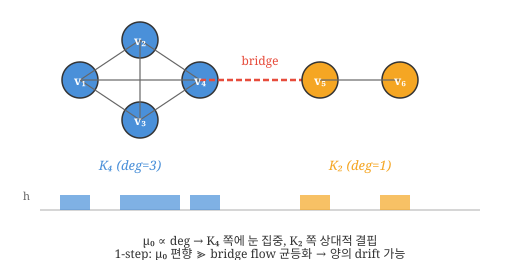
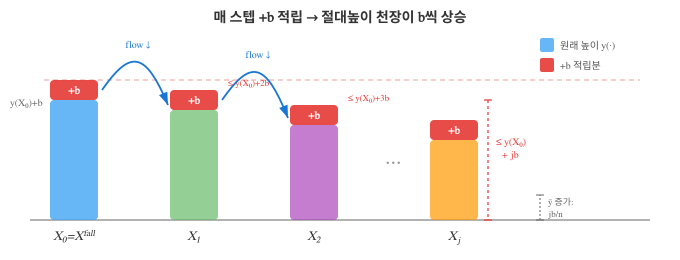

# 1. 논문 기호 정리 (Notation Reference)

## 그래프 기본

| 기호 | 의미 |
|------|------|
| $\mathcal{G} = (V, \mathbf{E}, \mathbf{W})$ | 가중 그래프 |
| $V = \{1, 2, \ldots, n\}$ | 노드 집합 ($n = \|V\|$) |
| $\mathcal{E}$ | 간선 집합: $\{(v_i, v_j) : v_i \leftrightarrow v_j\}$ |
| $\mathbf{E}$ | $n \times n$ 인접 행렬 ($E_{ij} = 1$ if $(v_i, v_j) \in \mathcal{E}$) |
| $\mathbf{W}$ | $n \times n$ 가중치 행렬 ($0 \leq W_{ij} \leq 1$) |
| $v_i$ | $i$번째 노드 |
| $N_i$ | $v_i$의 이웃 집합: $\{j : (v_i, v_j) \in \mathcal{E}\}$ |
| $\deg(v_i)$ | $v_i$의 차수 ($= \|N_i\|$) |
| $\deg^-(v)$ | 내차수 (in-degree): $\sum_{u \in V} w(u, v)$ |
| $\deg^+(v)$ | 외차수 (out-degree): $\sum_{u \in V} w(v, u)$ |
| $n$ | 노드 수 ($= \|V\|$) |

## 초기 데이터

| 기호 | 의미 |
|------|------|
| $y(v)$ | 노드 $v$에서 관측된 신호값 |
| $\mathbf{y} = (y(v_1), \ldots, y(v_n))^\top$ | 신호 벡터 |

## Heavy-Snow Process (Algorithm 1)

| 기호 | 의미 |
|------|------|
| $h(v, t)$ | 시각 $t$에서 노드 $v$의 높이 ($h(v, 0) := y(v)$) |
| $\mathbf{h}(\cdot, t) = \{h(v,t) : v \in V\}$ | 시각 $t$의 snowy ground (높이 벡터) |
| $b$ | 업데이트 양 (눈의 양, $b > 0$) |
| $T_{max}$ | 최대 연속 flow 횟수 |
| $\boldsymbol{\mu}_0$ | 초기 낙하 분포 ($\mu_0(v_i) \propto \deg(v_i)$) |
| $X(t)$ | 시각 $t$에서 눈이 존재하는 노드 인덱스 |
| $Z(t)$ | 연속 flow 카운터 ($Z(t) \in \{0, 1, \ldots, T_{max}\}$) |
| $\mathcal{N}_i$ | $v_i$의 이웃 집합 |
| $\mathcal{D}(t)$ | 하류 영역 (downstream): $h(v_j, t-1) \leq h(v_{X(t-1)}, t-1)$인 이웃 |

## 전이 확률

| 기호 | 의미 |
|------|------|
| $p_{\downarrow v_j}$ | $\boldsymbol{\mu}_0$에 의해 $v_j$가 선택될 확률: $\frac{\deg(v_j)}{\sum_{k \in V} \deg(v_k)}$ |
| $p_{t, v_i \to v_j}$ | 시각 $t$에서 $v_i$→$v_j$ flow 확률: $I(h(v_i,t) \geq h(v_j,t)) \frac{\deg(v_j)}{\sum_{k \in \mathcal{N}_i} \deg(v_k)}$ |
| $p_{t, v_i \to \cdot}$ | block 확률: $\frac{\sum_{k \notin \mathcal{D}(t)} \deg(v_k)}{\sum_{k \in \mathcal{N}_i} \deg(v_k)}$ |

## Snow Distance & Snow Weight

| 기호 | 의미 |
|------|------|
| $SD_{ij}(t)$ | snow distance: $\sqrt{\sum_{s=0}^{t}(h(v_i,s)-h(v_j,s))^2}$ |
| $\mathbf{SD}(t)$ | Snow distance 행렬 ($n \times n$) |
| $W_{ij}(t)$ | snow weight: $e^{-SD^2_{ij}(t) / 2\theta^2}$ ($i \neq j$, $t > 0$) |
| $\mathbf{W}(t)$ | Snow weight 행렬 ($n \times n$) |
| $\theta$ | 연결 강도 조절 파라미터 (Gaussian kernel) |

## 스펙트럼 분석 (Spectral Analysis)

| 기호 | 의미 |
|------|------|
| $\mathbf{D}(t)$ | 차수 대각행렬: $d_i(t) = \sum_{j=1}^n W_{ij}(t)$ |
| $\mathbf{L}(t)$ | snow graph Laplacian: $\mathbf{D}(t) - \mathbf{W}(t)$ |
| $\bar{\mathbf{L}}(t)$ | 정규화 snow graph Laplacian: $\mathbf{D}^{-1/2}(t)\,\mathbf{L}(t)\,\mathbf{D}^{-1/2}(t)$ |
| $\lambda_j^{(t)}$ | $\bar{\mathbf{L}}(t)$의 $j$번째 고유값 ($0 \leq \lambda_1^{(t)} \leq \cdots \leq \lambda_J^{(t)}$) |
| $\boldsymbol{\psi}_j^{(t)}$ | $\lambda_j^{(t)}$에 대응하는 정규직교 고유벡터: $(\psi_{j1}^{(t)}, \ldots, \psi_{jn}^{(t)})^\top$ |
| $\boldsymbol{\Psi}(t)$ | 고유벡터 행렬: $[\boldsymbol{\psi}_1^{(t)}, \ldots, \boldsymbol{\psi}_J^{(t)}]$ |
| $\boldsymbol{\Lambda}(t)$ | 고유값 대각행렬: $\text{diag}(\lambda_1^{(t)}, \ldots, \lambda_J^{(t)})$ |
| $\bar{y}(\lambda_j)$ | graph Fourier 변환: $\sum_{i=1}^n y(v_i)\, \psi_{ij}$ |
| $\boldsymbol{\psi}_j \boldsymbol{\psi}_j^\top \mathbf{y}$ | $\mathbf{y}$의 $j$번째 spectral component |

## 기타 파라미터

| 기호 | 의미 |
|------|------|
| $\sigma^2$ | Gaussian kernel 분산 (예: $\sigma^2 = 0.35$) |
| $\varepsilon_i$ | 노이즈 ($\varepsilon_i \sim N(0, 0.1^2)$) |
| $\|\cdot\|_2$ | 유클리드 노름 |

## 증명 전용 기호 (Section 2에서 사용)

> 논문 기호와의 충돌을 피하기 위해, 증명에서는 아래 기호를 별도로 정의한다.

**상태 및 상태 공간**

| 기호 | 의미 |
|------|------|
| $\boldsymbol{\delta}(t) = (\delta_2(t), \ldots, \delta_n(t))$ | 높이차 벡터: $\delta_i(t) := h(v_i, t) - h(v_1, t)$ |
| $S(t) = (\boldsymbol{\delta}(t),\, X(t),\, Z(t))$ | 마르코프 체인의 상태 |
| $\mathcal{X}$ | 상태 공간: $(\boldsymbol{\delta}(0) + b\mathbb{Z}^{n-1}) \times \{1,\ldots,n\} \times \{0,\ldots,T_{max}+1\}$ |

**Lyapunov 함수 및 drift**

| 기호 | 의미 |
|------|------|
| $\bar{h}(t) := \frac{1}{n}\sum_k h(v_k, t)$ | 평균 높이 |
| $\hbar(v, t) := h(v, t) - \bar{h}(t)$ | 중심화 높이 |
| $\Phi(t) := \sum_{i=1}^{n}\hbar(v_i,t)^2$ | Lyapunov 함수 (높이 분산, 포텐셜) |
| $M(t) := \max_i \hbar(v_i, t) - \min_i \hbar(v_i, t)$ | 높이 범위 (최고−최저) |
| $\Delta_{\mathrm{drift}} := 2k\alpha - \frac{q_0}{n-1}$ | drift 조건 상수 ($< 0$이면 수렴 보장) |

**그래프 구조 상수**

| 기호 | 의미 |
|------|------|
| $\mu_{min} := \min_i \mu_0(v_i)$ | 최소 낙하 확률 |
| $k := \lceil 1/\mu_{min} \rceil$ | $T$-step drift의 라운드 하한 ($\mathcal{G}$에만 의존) |
| $\alpha := \lVert\boldsymbol{\mu}_0 - \mathbf{u}\rVert_1$ | 차수 비균등도 ($\mathbf{u}$ = 균등분포) |
| $p_0 := \mu_0(u) \cdot P_{RW}(u,w)$ | 경사 간선 $(u,w)$에서 직접 flow 확률 |
| $T := k(T_{max}+1)$ | $T$-step drift의 스텝 수 |
| $q_0 := 1 - (1 - p_0/2)^k$ | $T$ 스텝($\geq k$ 라운드) 중 큰 낙차 사건 ≥1회 확률 |

**눈의 위치**

| 기호 | 의미 |
|------|------|
| $X_{fall}$ | 눈의 초기 낙하 지점 (flow 전) |
| $X^*(r)$ | 라운드 $r$에서 눈의 최종 정착 노드 (flow 후) |
| $v^+,\, v^-$ | 최고점/최저점 노드: $\arg\max_i \hbar(v_i, t)$, $\arg\min_i \hbar(v_i, t)$ |

**Foster-Lyapunov 관련**

| 기호 | 의미 |
|------|------|
| $\mathcal{B}_\Phi := \{S : \Phi(S) \leq C_1\}$ | 유한 refuge 집합 (양의 재귀 영역) |
| $\tau := \inf\{t \geq 1 : S(t) \in \mathcal{B}_\Phi\}$ | $\mathcal{B}_\Phi$ 도달 시각 |
| $Y(t) := \Phi(S(t))\,\mathbf{1}_{\{t < \tau\}}$ | 보조 과정 ($\mathcal{B}_\Phi$ 도달 후 0으로 리셋) |
| $\beta$ | $\mathcal{B}_\Phi$ 내부에서의 drift 상한 ($< \infty$) |
| $C_0, C_1, C_3$ | 그래프에만 의존하는 상수 |

**에르고딕 극한**

| 기호 | 의미 |
|------|------|
| $\pi$ | 정상분포 (stationary distribution) |
| $c_{ij} := \mathbb{E}_\pi[(\delta_i - \delta_j)^2]$ | 에르고딕 극한 ($\frac{1}{t}SD^2_{ij}(t)$의 a.s. 수렴값) |

---

# 2. $\frac{1}{t}SD^2_{ij}(t)$의 수렴 증명

## 세팅

논문의 Algorithm 1에 따른 heavy-snow process를 사용한다. $\mathcal{G} = (V, \mathbf{E}, \mathbf{W})$는 **연결(connected)** 가중 그래프, $n = |V|$, $\mathbf{y} = (y(v_1), \ldots, y(v_n))^\top$은 초기 신호, $b > 0$은 업데이트 양, $T_{max} \geq 1$은 최대 연속 flow 횟수이다.

> **Remark (연결성이 필수인 이유).** 그래프가 비연결이면, 단절된 컴포넌트 A, B 사이에 edge가 없으므로 flow에 의한 높이 균등화(self-correction)가 작동하지 않는다. 재시작 분포 $\boldsymbol{\mu}_0 \propto \deg(v)$가 모든 노드에 눈을 뿌리지만, $\boldsymbol{\mu}_0$는 현재 높이를 반영하지 않는 고정 분포이므로, 컴포넌트 간 높이 불균형을 보정하지 못한다. 구체적으로, 두 컴포넌트의 평균 차수가 다르면 ($\bar{d}_A \neq \bar{d}_B$), 컴포넌트 간 평균 높이차가 $O(t)$로 발산하여 $\frac{1}{t}SD^2_{ij}(t) \to \infty$가 된다. 따라서 연결성은 $\frac{1}{t}SD^2_{ij}(t)$의 유한 수렴을 위한 필수 조건이다.

각 시각 $t$에서 정확히 하나의 노드가 $+b$를 받는다:

$$h(v_i, t) = y(v_i) + b \cdot N_i(t), \quad N_i(t) := \sum_{s=1}^{t} \mathbf{1}(X_s = i)$$

여기서 $X_s$는 시각 $s$에서 눈이 최종 쌓인 노드이다.

Snow distance는 논문 Definition 2에 의해:

$$SD^2_{ij}(t) := \sum_{s=0}^{t} \big(h(v_i, s) - h(v_j, s)\big)^2$$

---

## 정리 (Main Theorem)

**Theorem.** 연결 가중 그래프 $\mathcal{G}$와 파라미터 $(b, T_{max})$가 주어질 때, 다음 drift 조건이 성립한다고 하자:

$$\Delta_{\mathrm{drift}} := 2k\alpha - \frac{q_0}{n-1} < 0 \tag{DC}$$

여기서 $k = \lceil 1/\mu_{min} \rceil$, $\alpha = \|\boldsymbol{\mu}_0 - \mathbf{u}\|_1$ (차수 비균등도), $q_0 = 1-(1-p_0/2)^k$ (경사 간선 flow 확률), $\mu_{min} = \min_i \mu_0(v_i)$이다. 특히 **정칙(regular) 그래프에서는 $\alpha = 0$이므로 (DC)가 자동으로 성립**한다.

이때, 상수 $c_{ij} = c_{ij}(\mathcal{G}, b, T_{max}, \mathbf{y} \bmod b) \geq 0$이 존재하여, 임의의 초기 신호 $\mathbf{y}$에 대해:

$$\frac{1}{t} SD^2_{ij}(t) \xrightarrow{t \to \infty} c_{ij} \quad \text{a.s.}$$

한계값 $c_{ij}$는 초기 신호 $\mathbf{y}$의 거시적인 절대 스케일에는 완전히 독립적이며, 오직 이산 업데이트 규칙의 격자 경계를 결정짓는 $b$ 단위의 미세한 위상차(fractional part modulo $b$)에만 국소적으로 종속된다.

---

## Step 1. 높이차 과정은 시간-동차 마르코프 체인이다

노드 $v_1$을 기준으로 높이차 벡터를 정의한다:

$$\boldsymbol{\delta}(t) := \big(h(v_2, t) - h(v_1, t),\; \ldots,\; h(v_n, t) - h(v_1, t)\big) \in \mathbb{R}^{n-1}$$

임의의 두 노드 사이의 높이차는 $h(v_i, t) - h(v_j, t) = \delta_i(t) - \delta_j(t)$로 복원된다 (단, $\delta_1 := 0$).

**Proposition 1.** Algorithm 1의 모든 전이 규칙은 높이의 **쌍별 비교(pairwise comparison)** $h(v_i, t) \geq h(v_j, t)$에만 의존하며, 절대 높이에는 의존하지 않는다.

**증명.** HST에서 상태 전이를 결정하는 요소는 (i) 눈이 내릴 노드의 선택 ($X(t) \sim \boldsymbol{\mu}_0$, 그래프 구조에만 의존), (ii) flow 발생 여부 (인접 노드 중 현재 노드보다 낮은 노드가 있는지, 즉 $h(v_j, t) \leq h(v_i, t)$ iff $\delta_j(t) \leq \delta_i(t)$), (iii) flow 목적지 선택 (하향 이웃의 차수에 비례, 그래프 구조에만 의존)의 세 가지이다. (i)과 (iii)은 높이와 무관하고, (ii)는 높이차의 부호에만 의존한다. $\square$

따라서 전체 상태를 $S(t) := (\boldsymbol{\delta}(t), X(t), Z(t))$로 정의하면, 전이확률 $\Pr(S(t+1) \mid S(t))$는 $S(t)$에만 의존하고, 절대 높이 $h(v, t)$에는 의존하지 않는다. 즉, **$\{S(t)\}_{t \geq 0}$은 시간-동차 마르코프 체인**이다.

**Example ($n=3$, $b=1$).** 노드가 $v_1, v_2, v_3$인 경로 그래프를 생각하자. 시각 $t=5$에서 높이가 $h(v_1,5) = 7$, $h(v_2,5) = 9$, $h(v_3,5) = 8$이고, 눈이 $v_2$ 위에 있으며 ($X(5)=2$), 직전에 block이 발생하여 flow 카운터가 초기화된 상태라면 ($Z(5) = 0$):

$$\boldsymbol{\delta}(5) = \big(h(v_2,5)-h(v_1,5),\; h(v_3,5)-h(v_1,5)\big) = (2,\, 1)$$

$$S(5) = \big((2,\, 1),\; 2,\; 0\big)$$

여기서 절대 높이 $(7, 9, 8)$은 상태에 포함되지 않는다 — 오직 $v_1$ 기준의 **차이** $(2, 1)$만 기록된다. 만약 절대 높이가 $(107, 109, 108)$이더라도 $S(5)$는 동일하게 $\big((2,\, 1),\; 2,\; 0\big)$이다.

> **Remark (상태 공간의 격자성).** 각 시각 $t$마다 노드의 높이는 $b$ 단위로 변하므로, $\boldsymbol{\delta}(t)$는 초기값 $\boldsymbol{\delta}(0)$로부터 $b\mathbb{Z}^{n-1}$의 격자 위에서만 움직인다. 구체적으로, $\delta_i(t) \in (y(v_i) - y(v_1)) + b\mathbb{Z}$이다. 따라서 마르코프 체인의 유효 상태 공간(effective state space)은 $\boldsymbol{\delta}(0) \bmod b$, 즉 초기 신호의 미세 위상차에 의해 그 형태가 영구적으로 결정된다.

> **Remark ($Z(t)$의 상태 공간).** $Z(t)$는 block 발생 시 $0$으로 초기화되고, flow가 지속되는 동안 매 스텝 $1$씩 증가하며, $Z(t) > T_{max}$이 되면 재시작($X(t+1) \sim \boldsymbol{\mu}_0$)을 트리거한 뒤 다시 $0$으로 돌아온다. 따라서 $Z(t)$의 유효 상태 공간은 유한 집합 $\{0, 1, \ldots, T_{max}+1\}$이다.

**스텝별 $+b$ 축적.** Algorithm 1에서 매 마르코프 체인 스텝 $t$마다 현재 눈 위치 $X(t)$에 $+b$가 쌓인다. Flow 중에도 방문하는 노드마다 $+b$가 추가된다 (높이 $h(v_i, t) = y(v_i) + b \cdot N_i(t)$에서 $N_i(t) = \sum_{s=1}^t \mathbf{1}(X(s) = i)$).

**Round의 정의.** **라운드(round)** $r$은 block 발생 후 새 눈이 $X_{fall}(r) \sim \boldsymbol{\mu}_0$로 낙하하는 시점부터, flow chain을 거쳐 다음 block이 발생하는 시점까지이다:

$$\text{round } r: \quad X_{fall}(r) \sim \boldsymbol{\mu}_0 \;\to\; \text{flow chain (매 스텝 } +b\text{)} \;\to\; \text{block에서 종료}$$

한 라운드가 $m_r$스텝으로 구성되면, 방문한 $m_r$개 노드 각각에 $+b$가 쌓인다. 따라서 한 라운드의 **순효과는 $m_r \cdot b$이며**, 이는 여러 노드에 분산되어 축적된다. $m_r \leq T_{max}+1$이다.

이하 Step 2의 drift 분석은 **마르코프 체인 스텝 $t$를 기본 시간 단위**로 사용한다. 라운드 개념은 block 이벤트(새 눈 낙하)의 확률 논증에서 활용한다.

---

## Step 2. 높이차의 유계성

**Lemma 1 (Drift Condition).** Lyapunov 함수를

$$\Phi(t) := \sum_{i=1}^{n} \big(h(v_i, t) - \bar{h}(t)\big)^2, \quad \bar{h}(t) := \frac{1}{n}\sum_k h(v_k, t)$$

로 정의한다. (여기서 $\Phi$는 높이 분산을 나타내는 포텐셜 함수로, 논문의 노드 집합 $V$와의 혼동을 피하기 위해 별도 기호를 사용한다.) 시각 $t+1$에서 노드 $v_\ell$에 $+b$가 쌓이면:

$$\Phi(t+1) - \Phi(t) = 2b\big(h(v_\ell, t) - \bar{h}(t)\big) + \frac{(n-1)b^2}{n}$$

::: {.callout-tip collapse="true" title="Lemma 1 직관: 왜 이 식이 나오는가?"}

$\Phi$는 "높이들이 평균에서 얼마나 퍼져 있는가"를 재는 분산이다. 한 노드 $v_\ell$에 눈 $b$가 쌓이면 $\Phi$가 어떻게 변하는지 생각해보자.

**항 1: $2b\,\hbar(v_\ell, t)$.** $v_\ell$이 이미 평균보다 높으면 ($\hbar(v_\ell, t) > 0$) 눈이 쌓여서 더 높아지니까 분산이 **증가**한다. 반대로 평균보다 낮은 노드에 쌓이면 ($\hbar(v_\ell, t) < 0$) 평균 쪽으로 당겨지니까 분산이 **감소**한다. 즉, 낮은 곳에 눈이 쌓일수록 $\Phi$가 줄어든다 — 이것이 flow가 $\Phi$를 줄이는 핵심 메커니즘이다.

**항 2: $\frac{(n-1)b^2}{n}$.** 어디에 쌓이든 한 노드만 $+b$되고 나머지 $n-1$개는 그대로이므로, 평균이 $b/n$만큼 올라가면서 "한 놈만 튀는 효과"로 분산이 약간 증가한다. 이 항은 항상 양수이고 $b^2$에 비례하는 작은 상수이다.

요약하면: **$\Phi$의 변화 = (눈이 어디에 쌓였나에 따른 큰 효과) + (무조건 붙는 작은 양의 보정)**이다.
:::

**증명 ($\Phi$ 전개).** $\sum_i \hbar(v_i, t) = 0$이다. $v_\ell$에 $+b$가 쌓이면:

$$\hbar(v_\ell, t{+}1) = \hbar(v_\ell, t) + b\frac{n-1}{n}, \quad \hbar(v_i, t{+}1) = \hbar(v_i, t) - \frac{b}{n} \;\;(i \neq \ell)$$

따라서:

$$\Phi(t{+}1) = \left(\hbar(v_\ell, t) + b\frac{n-1}{n}\right)^2 + \sum_{i \neq \ell}\left(\hbar(v_i, t) - \frac{b}{n}\right)^2$$
$$= \hbar(v_\ell, t)^2 + 2\hbar(v_\ell, t)\, b\frac{n-1}{n} + b^2\frac{(n-1)^2}{n^2} + \sum_{i \neq \ell}\left(\hbar(v_i, t)^2 - 2\hbar(v_i, t)\frac{b}{n} + \frac{b^2}{n^2}\right)$$
$$= \Phi(t) + 2b\frac{n-1}{n}\hbar(v_\ell, t) - \frac{2b}{n}\sum_{i\neq\ell}\hbar(v_i, t) + b^2\frac{(n-1)^2}{n^2} + (n-1)\frac{b^2}{n^2}$$

$\sum_{i\neq\ell}\hbar(v_i, t) = -\hbar(v_\ell, t)$이므로:

$$= \Phi(t) + 2b\frac{n-1}{n}\hbar(v_\ell, t) + \frac{2b}{n}\hbar(v_\ell, t) + b^2\frac{(n-1)^2 + (n-1)}{n^2}$$

$$= \Phi(t) + 2b\,\hbar(v_\ell, t) + \frac{(n-1)b^2}{n} \quad \square$$

**1-step $\Phi$ 변화.** Lemma 1에 기대값을 씌우면, 스텝 $t+1$에서 $+b$가 쌓이는 노드 $X(t+1)$에 대해:

$$\mathbb{E}[\Phi(t+1) - \Phi(t) \mid S(t)] = 2b \cdot \mathbb{E}\big[\hbar(X(t{+}1),\, t) \mid S(t)\big] + \frac{(n-1)b^2}{n} \tag{$\dagger$}$$

::: {.callout-tip collapse="true" title="($\\dagger$) 직관: 이 식이 말하는 것"}

Lemma 1에서 $v_\ell$은 "눈이 실제로 쌓이는 노드"였다. HST에서 매 스텝마다 현재 눈 위치 $X(t{+}1)$에 $+b$가 쌓이므로, Lemma 1의 $\hbar(v_\ell, t)$를 $\hbar(X(t{+}1), t)$로 바꾸고 기대값을 씌운 것이 ($\dagger$)이다.

이 식의 핵심은 $\mathbb{E}[\hbar(X(t{+}1), t) \mid S(t)]$, 즉 **"다음 스텝에서 눈이 쌓이는 노드의 중심화 높이의 기대값"**이다. 이 값이 음수면 — 평균적으로 낮은 곳에 눈이 쌓인다면 — 첫째 항이 음수가 되어 $\Phi$가 감소한다. Flow 스텝에서는 높은 곳에서 낮은 곳으로 눈이 이동하므로 $\hbar(X(t{+}1), t) \leq \hbar(X(t), t) + b$가 보장되고, 이것이 $\Phi$를 줄이는 핵심 메커니즘이다.

$\frac{(n-1)b^2}{n}$ 양의 보정 항이 항상 붙지만, $\Phi$가 제곱합이므로 높이차가 충분히 크면 $|2b \cdot \hbar(X(t{+}1), t)|$이 이 보정을 압도한다 (아래 수치 예시 참조).
:::

::: {.callout-note collapse="true" title="수치 예시: $\\Phi$가 제곱합이라서 생기는 차이"}

$n = 2$, $b = 1$로 놓자. 노드가 $v_1, v_2$ 두 개이고, 눈이 낮은 쪽 $v_2$에 쌓이는 상황을 비교한다.

**Case A: 높이차가 클 때.** $h(v_1) = 50$, $h(v_2) = -50$ (중심화 높이). $v_2$에 $+1$ 쌓이면:

$$\Phi_{\text{before}} = 50^2 + (-50)^2 = 5000$$
$$\Phi_{\text{after}} = 50.5^2 + (-49.5)^2 = 2550.25 + 2450.25 = 5000.50$$

잠깐 — 이건 중심화 높이가 바뀌는 걸 반영해야 한다. $v_2$에 $+1$이 쌓이면 평균이 $0.5$ 올라가므로:

$$h_1' = 50 - 0.5 = 49.5, \quad h_2' = -50 + 1 - 0.5 = -49.5$$
$$\Phi_{\text{after}} = 49.5^2 + (-49.5)^2 = 4900.50$$
$$\Delta\Phi = 4900.50 - 5000 = \mathbf{-99.50}$$

**Case B: 높이차가 작을 때.** $h(v_1) = 5$, $h(v_2) = -5$. 같은 방식으로:

$$\Phi_{\text{before}} = 5^2 + (-5)^2 = 50$$
$$h_1' = 4.5, \quad h_2' = -4.5$$
$$\Phi_{\text{after}} = 4.5^2 + (-4.5)^2 = 40.50$$
$$\Delta\Phi = 40.50 - 50 = \mathbf{-9.50}$$

둘 다 낮은 쪽에 $b=1$이 쌓인 동일한 사건인데, Case A에서는 $\Phi$가 $99.50$ 줄고 Case B에서는 $9.50$밖에 안 줄었다. Lemma 1의 공식으로 검산하면 $\Delta\Phi = 2b \cdot \hbar(v_\ell, t) + \frac{(n-1)b^2}{n} = 2(1)(-50) + \frac{1}{2} = -99.50$ (Case A), $2(1)(-5) + \frac{1}{2} = -9.50$ (Case B)으로 정확히 일치한다.

핵심: **같은 $b$가 쌓여도**, $\hbar(v_\ell, t)$이 $-50$이냐 $-5$이냐에 따라 $\Phi$ 감소량이 **10배** 차이난다. 이것이 "$\Phi$가 제곱합이라서 높이차가 클수록 음의 drift가 강해지는" 메커니즘이다.
:::

**$T$-step drift로의 전환.** 1-step drift만으로는 모든 그래프 구조에서 음의 drift를 보장할 수 없다. 다음의 비대칭 바벨 그래프가 대표적 반례이다.

**Example (비대칭 바벨 그래프).** $K_4$와 $K_2$를 하나의 bridge 간선 $(v_4, v_5)$으로 연결한 그래프를 생각하자. $\mu_0 \propto \deg$이므로 $K_4$ 쪽 노드(차수 $3$~$4$)에 눈이 떨어질 확률이 $K_2$ 쪽 노드(차수 $1$~$2$)보다 크다.

단기적으로 보면, 눈이 $K_4$ 내부의 노드 $v_i$에 떨어지면 ($\mu_0(v_i)$가 큼), $v_i$의 높이가 $b$만큼 올라가고 flow가 인접 노드로 발생하는데, 이 인접 노드 역시 대부분 $K_4$ 내부이다. 즉, **눈이 $K_4$ 안에서 떨어지고 $K_4$ 안에서 흡수되는** 경우가 지배적이다. Bridge를 통해 $K_2$ 쪽으로 flow가 흘러가려면 $v_4$에 눈이 떨어지고 $v_5$가 $v_4$보다 높지 않아야 ($y(v_4) \geq y(v_5)$) 하는데, $\mu_0$ 편향으로 $K_4$ 쪽이 이미 높아져 있으므로 이 사건의 확률은 상대적으로 작다.

결과적으로 소수의 스텝에서는 $\mu_0$의 편향이 flow의 균등화 효과를 압도하여, $K_4$ 쪽에 눈이 편중 축적되고 $\Phi$가 **증가**하는 방향의 drift가 발생할 수 있다. 그러나 $T = k(T_{max}+1)$ 스텝에 걸쳐 보면, 높이차가 충분히 커진 상태에서는 경사 간선 $(v_4, v_5)$을 통한 flow가 반드시 발생하여 큰 낙차를 만들고, 이 음의 기여가 $\mu_0$ 편향의 양의 기여를 압도한다.

이 관찰이 다중 스텝 drift를 사용하는 근본적 이유이다. 구체적으로, $T$-step skeleton 체인에 **Foster-Lyapunov 기준**을 적용하여 양의 재귀성을 이끌어낸다.

> **Remark (양의 재귀성이 필요한 이유).** $S(t) = (\boldsymbol{\delta}(t), X(t), Z(t))$에서 $X(t) \in \{1,\ldots,n\}$과 $Z(t) \in \{0,\ldots,T_{max}\}$는 유한이므로 유한 마르코프 체인으로 착각할 수 있으나, $\boldsymbol{\delta}(t) \in b\mathbb{Z}^{n-1}$이 무한이므로 전체 상태 공간 $b\mathbb{Z}^{n-1} \times \{1,\ldots,n\} \times \{0,\ldots,T_{max}\}$는 **가산 무한**이다. 유한 상태 마르코프 체인에서는 비가약성만으로 양의 재귀성이 자동으로 따라오지만, 가산 무한 상태 공간에서는 재귀적이지만 양의 재귀가 아닌 체인(null recurrent chain)이 존재하며, 이 경우 기대 복귀 시간 $\mathbb{E}[\tau_{\mathcal{B}}] = \infty$이므로 Step 4에서 사용할 에르고딕 정리(M&T Theorem 17.1.7)의 전제가 깨진다. 따라서 Foster-Lyapunov 기준을 통해 $\mathbb{E}[\tau_{\mathcal{B}}] < \infty$를 명시적으로 보여야 한다.

**$T$ 스텝 동안의 $\Phi$ 변화.** $T := k(T_{max}+1)$로 놓자. $(\dagger)$를 $T$ 스텝에 걸쳐 축적하면:

$$\mathbb{E}[\Phi(t+T) - \Phi(t) \mid S(t)] = 2b \sum_{s=0}^{T-1} \mathbb{E}\big[\hbar(X(t{+}s{+}1),\, t{+}s) \mid S(t)\big] + T \cdot \frac{(n-1)b^2}{n} \tag{$\dagger\dagger$}$$

$T$ 스텝 안에는 **최소 $k$개의 완전한 라운드**가 포함된다 (각 라운드 $\leq T_{max}+1$ 스텝).

::: {.callout-tip collapse="true" title="($\\dagger\\dagger$) 직관: $T$번의 $+b$ 축적을 합산한 것"}

($\dagger$)는 "1스텝에서 $\Phi$가 얼마나 변하는가"였다. ($\dagger\dagger$)는 그것을 $T$번 더한 것이다.

$\sum$ 안의 $\hbar(X(t{+}s{+}1), t{+}s)$는 "스텝 $t{+}s{+}1$에서 눈이 쌓이는 노드의 중심화 높이"이다. $T$개의 항 중 **대부분은 양수일 수 있다** — $\mu_0$ 편향 때문에 높은 쪽 노드에 눈이 쌓이는 스텝이 더 많을 수 있기 때문이다. 하지만 $T$ 스텝 중 **단 한 번이라도** 큰 낙차 사건이 발생하면 — 즉, 눈이 경사 간선의 높은 끝에서 낮은 끝으로 flow하면 — 그 라운드의 큰 음의 기여가 나머지 스텝들의 양의 기여를 상쇄하고도 남는다.
:::

음의 drift를 확보하기 위해, $T$ 스텝 중 최소 한 번은 눈이 **높이 범위 $M$에 비례하는 큰 낙차를 발생시키는 사건**이 일어남을 보인다.

**핵심 사건의 구성.** (아래 그림 참조)

> **Figure.** $v^+$에서 $v^-$로의 경로 위에서 비둘기집 원리에 의해 높이차가 $M(t)/(n-1)$ 이상인 경사 간선 $(u, w)$가 존재한다. 눈이 $u$에 떨어지면($\mu_0(u)$ 확률) flow를 통해 $w$ 이하로 내려간다.

$\mathcal{G}$가 연결이므로, 최고점 $v^+ = \arg\max_i \hbar(v_i, t)$에서 최저점 $v^- = \arg\min_i \hbar(v_i, t)$로의 경로 $v^+ = w_0, w_1, \ldots, w_m = v^-$ ($m \leq n-1$)가 존재한다. 경로를 따른 총 높이 낙차는:

$$M(t) = \hbar(w_0, t) - \hbar(w_m, t) = \sum_{i=0}^{m-1}\big(\hbar(w_i, t) - \hbar(w_{i+1}, t)\big)$$

총합이 $M(t)$이고 항의 개수가 $m \leq n-1$이므로, 비둘기집 원리(pigeonhole principle)에 의해 평균 이상의 낙차를 가진 간선이 최소 하나 존재한다: 어떤 $i$에서 $\hbar(w_i, t) - \hbar(w_{i+1}, t) \geq M(t)/(n-1)$. 이 간선 $(w_i, w_{i+1})$을 **경사 간선(steep edge)** $(u, w)$ ($\hbar(u,t) > \hbar(w,t)$)이라 한다.

$\mu_{min} := \min_i \mu_0(v_i) > 0$ ($\mathcal{G}$가 연결이고 $\mu_0 \propto \deg$이므로)으로 놓고, 다음 정수를 정의한다:

$$k := \left\lceil \frac{1}{\mu_{min}} \right\rceil$$

이 $k$는 $\mathcal{G}$에만 의존하는 상수이다.

**Lemma 1a ($T$-step Drift).** $T := k(T_{max}+1)$, $M(t) := \max_i \hbar(v_i, t) - \min_i \hbar(v_i, t)$라 할 때, 양의 상수 $\gamma = \gamma(\mathcal{G}) > 0$이 존재하여: $M(t)$가 충분히 크면 (즉, $\Phi(t) > C_0$ for some $C_0$이면),

$$\mathbb{E}[\Phi(t+T) - \Phi(t) \mid S(t)] \leq -\gamma \cdot b \cdot M(t) + T \cdot \frac{(n-1)b^2}{n}$$

::: {.callout-tip collapse="true" title="Lemma 1a 직관: 이 부등식이 말하는 것"}

이 부등식의 우변에는 두 항이 경쟁하고 있다.

- $-\gamma \cdot b \cdot M(t)$: **음의 항**. ($\dagger\dagger$)의 합 $2b\sum \mathbb{E}[\hbar(X(t{+}s{+}1), t{+}s)]$을 상한한 것이다. $T$개의 스텝 중 $\mu_0$ 편향 때문에 양의 $\hbar$가 나오는 스텝도 많지만, 큰 낙차 사건이 발생하면 해당 라운드의 flow 스텝들이 $M(t)$에 비례하는 큰 음의 기여를 만든다. 이 음의 기여가 양의 기여를 압도하여 합 전체를 $-\gamma bM(t)$ 이하로 누른다.
- $T \cdot \frac{(n-1)b^2}{n}$: **양의 항**. 매 스텝마다 무조건 붙는 보정 $\frac{(n-1)b^2}{n}$이 $T$번 쌓인 것이다. 이 값은 그래프가 정해지면 **상수**이다.

$M(t)$가 커지면 음의 항은 $M(t)$에 비례해서 커지지만, 양의 항은 상수로 고정이다. 따라서 $M(t)$가 충분히 크면 음의 항이 반드시 이긴다. 이것이 "$\Phi$가 무한히 커질 수 없다"는 핵심 논거이다.
:::

**증명.** $T$ 스텝 동안 $+b$가 쌓이는 노드들의 중심화 높이 합을 분석한다. $T$ 스텝에는 최소 $k$개의 완전한 라운드가 포함되며, 각 라운드 $r$은 $m_r \leq T_{max}+1$ 스텝으로 구성된다.

**Step A: 라운드별 기여 상한.**

라운드 $r$이 $m_r$스텝이고, $X_{fall}(r) \sim \boldsymbol{\mu}_0$에서 시작한다. 라운드의 첫 스텝을 시각 $t_0$라 하고, 스텝 $j$에서 방문하는 노드를 $X_j$라 쓰자. 중심화 높이 함수를 다음과 같이 정의한다:

$$\hbar(v, t) := h(v, t) - \bar{h}(t)$$

Flow는 절대 높이 $h(v, t)$ 기준으로 하향 이동하지만, 매 스텝 $+b$ 적립으로 평균 $\bar{h}(t)$가 $b/n$씩 증가하므로:

$$\hbar(X_j,\, t_0{+}j) < \hbar(X_0,\, t_0) + jb$$

::: {.callout-warning collapse="true" title="왜 $\\hbar(X_j,\\, t_0{+}j) \\leq \\hbar(X_0,\\, t_0)$이 아니라 $< \\hbar(X_0,\\, t_0) + jb$인가?"}

직관적으로는 "flow = 내리막이니까 $\hbar(X_j, t_0{+}j) \leq \hbar(X_0, t_0)$이어야 하지 않나?"라고 생각할 수 있다. 하지만 flow의 "내리막"은 **적립 후** 높이 $h(v, t) + b$를 기준으로 판정하므로, 목적지의 절대높이가 출발 노드보다 높을 수 있다. 다음 반례가 이를 보여준다.

**반례.** $n=4$, $b=1$, path 그래프 $v_1\text{---}v_2\text{---}v_3\text{---}v_4$에서 각 노드의 높이를 직전 노드의 적립 후 높이보다 $0.001$만 낮게 잡자:

$$h(\cdot, t_0) = (\underset{v_1}{9},\;\; \underset{v_2}{9.999},\;\; \underset{v_3}{10.998},\;\; \underset{v_4}{11.997})$$

Flow의 진행:

$$v_1 \xrightarrow[\text{9.999 < 10}]{+1 \to h{=}10} v_2 \xrightarrow[\text{10.998 < 10.999}]{+1 \to h{=}10.999} v_3 \xrightarrow[\text{11.997 < 11.998}]{+1 \to h{=}11.998} v_4$$

매 스텝 "내리막"은 겨우 $0.001$이지만, 방문 노드의 절대높이는 $9 \to 9.999 \to 10.998 \to 11.997$로 거의 $+1$씩 상승한다. 중심화 높이로 확인하면 ($\bar{h}(t_0) = 10.499$):

$$\hbar(X_0, t_0) = -1.499, \quad \hbar(X_1, t_0{+}1) = -0.750, \quad \hbar(X_2, t_0{+}2) = -0.001, \quad \hbar(X_3, t_0{+}3) = +0.748$$

$\hbar(X_3, t_0{+}3) = +0.748 > -1.499 = \hbar(X_0, t_0)$이므로, $\hbar(X_j, t_0{+}j) \leq \hbar(X_0, t_0)$은 **거짓**이다.

그렇다면 올바른 상한은 무엇인가? Flow의 정의에 의해 $h(X_j, t_0{+}j) \leq h(X_{j-1}, t_0{+}j{-}1) + b$이므로, 체이닝하면:

$$h(X_j, t_0{+}j) \leq h(X_{j-1}, t_0{+}j{-}1) + b \leq \cdots \leq h(X_0, t_0) + jb$$

한편, $\hbar(v, t) = h(v, t) - \bar{h}(t)$이고 $\bar{h}(t_0{+}j) = \bar{h}(t_0) + jb/n$이므로:

$$\hbar(X_j, t_0{+}j) - \hbar(X_0, t_0) = \big[h(X_j, t_0{+}j) - h(X_0, t_0)\big] - \frac{jb}{n} \leq jb - \frac{jb}{n} = jb\cdot\frac{n-1}{n} < jb$$

따라서 $\hbar(X_j, t_0{+}j) < \hbar(X_0, t_0) + jb$. $\square$
:::

따라서 라운드 $r$의 총 기여는:

$$\text{(라운드 합)}_r := \sum_{j=0}^{m_r - 1} \hbar(X_j, t_0{+}j) \leq m_r \cdot \hbar(X_0, t_0) + C_{round}$$

여기서 $C_{round} := (T_{max}+1)T_{max} b/2$는 그래프에만 의존하는 상수이다. 이를 다시 분해하면:

$$\text{(라운드 합)}_r = m_r \cdot \hbar(X_0, t_0) + \underbrace{\sum_{j=1}^{m_r-1}\big(\hbar(X_j, t_0{+}j) - \hbar(X_0, t_0)\big)}_{\text{flow 개선 (}\leq C_{round}\text{)}}$$

**Step B: 큰 낙차 사건(Big Drop Event)의 확률과 기여.**

라운드 $r$에서 "큰 낙차 사건" $E_r$: 눈이 경사 간선의 높은 끝 $u$에 떨어지고 ($X_{fall} = u$), 첫 flow 스텝에서 낮은 끝 $w$로 이동하는 사건.

확률 하한: $X_{fall} = u$일 확률은 $\mu_0(u) \geq \mu_{min}$이고, $u$에서 $w$로의 직접 flow 확률은 $P_{RW}(u, w) > 0$이므로, 단일 라운드에서 $p_0 := \mu_0(u) \cdot P_{RW}(u, w) > 0$이다. $T$ 스텝 동안 경사 간선의 높이차는: 매 스텝 하나의 노드에 $+b$가 추가되므로 $M(t+s) \geq M(t) - Tb$. $M(t)$가 $2Tb$보다 크면 경사 간선의 높이차는 원래의 절반 이상을 유지한다.

$k$개 이상의 라운드에서 큰 낙차 사건이 최소 1회 발생할 확률: $q_0 := 1 - (1-p_0/2)^k > 0$.

큰 낙차 라운드의 flow 개선: $E_r$ 발생 시, 스텝 $j = 0$에서 $\hbar(X_0, t_0) = \hbar(u, t_0)$, 스텝 $j \geq 1$에서 $\hbar(X_j, t_0{+}j) \leq \hbar(w, t_0) + (j-1)b \leq \hbar(u, t_0) - M/(n-1) + jb$. 따라서:

$$\sum_{j=1}^{m-1}\big(\hbar(X_j, t_0{+}j) - \hbar(X_{fall}, t_0)\big) \leq -(m-1)\frac{M(t)}{n-1} + C'_{round}$$

큰 낙차 없는 라운드 대비, **개선량**은 최소 $M(t)/(n-1)$ ($m \geq 2$이므로).

**Step C: 결합.**

$(\dagger\dagger)$의 합을 라운드별로 분해한다. $R \geq k$개의 라운드, $\sum_r m_r = T$:

$$2b \sum_{s=0}^{T-1} \hbar(X(t{+}s{+}1),\, t{+}s) = 2b \sum_r \text{(라운드 합)}_r$$

**(I) $\mu_0$-편향 상한.** $\alpha := \|\boldsymbol{\mu}_0 - \mathbf{u}\|_1$로 놓자. 각 라운드의 기여 $\leq m_r \hbar(X_{fall,r}, t_0) + C_{round}$이고, $\mathbb{E}[\hbar(X_{fall}, t_0)] = \sum_i (\mu_0(i) - 1/n) \hbar(v_i, t_0) \leq \alpha M/2$이므로:

$$\text{(I)} := 2b \sum_r m_r \mathbb{E}[\hbar(X_{fall,r}, t_0)] \leq 2b \cdot T \cdot \frac{\alpha M(t)}{2} + C_I = b T \alpha M(t) + C_I$$

여기서 $C_I$는 $M(t+s) \leq M(t) + Tb$의 보정과 $C_{round}$ 기여를 합산한 상수이다.

**(II) 큰 낙차 개선.** 확률 $q_0$으로 큰 낙차 라운드가 존재하여, 해당 라운드의 flow 개선이 $\leq -M(t)/(n-1) + O(1)$:

$$\text{(II)} \leq -2b \cdot q_0 \cdot \frac{M(t)}{n-1}$$

**결합.** (I) + (II) + 상수항:

$$\mathbb{E}[\Phi(t+T) - \Phi(t) \mid S(t)] \leq b\, M(t) \underbrace{\left[T\alpha - \frac{2q_0}{n-1}\right]}_{=:\, \Delta_{\mathrm{drift}}} + C_3 \tag{$\star\star$}$$

여기서 $C_3 := C_I + T(n-1)b^2/n + R \cdot C_{round}$는 $M(t)$에 무관한 상수이다. $\square$

**$\Delta_{\mathrm{drift}} < 0$의 충분 조건.** $T$-step drift가 $M(t)$가 커질 때 확실히 음이 되려면:

$$\Delta_{\mathrm{drift}} = k(T_{max}+1)\alpha - \frac{2q_0}{n-1} < 0 \quad \iff \quad \alpha < \frac{2q_0}{k(T_{max}+1)(n-1)} \tag{$\star\star\star$}$$

이 조건이 성립하면 $\Phi(t) \geq M(t)^2/n$에 의해, $\Phi(t) > C_1 := n\big(\frac{C_3}{|\Delta_{\mathrm{drift}}| b}\big)^2$일 때 $T$-step drift가 확실히 음이 된다.

**정칙 그래프에서의 무조건적 성립.** $\mathcal{G}$가 정칙(regular)이면 $\mu_0(v_i) = 1/n$ for all $i$이므로 $\alpha = 0$이다. 따라서 $\Delta_{\mathrm{drift}} = -2q_0/(n-1) < 0$이 무조건 성립하며, $T$-step drift 조건이 어떤 추가 가정 없이 증명된다.

**일반 연결 그래프로의 확장.** 비정칙 그래프에서 $\alpha > 0$이면, $(\star\star\star)$는 그래프의 차수 균등도(degree uniformity)와 flow-through 확률 $q_0$의 관계를 요구한다. $T = k(T_{max}+1)$이 등장하므로 $T_{max}$이 클수록 조건이 엄격해지지만, 실질적으로 이 조건은 **그래프의 병목(bottleneck)이 지나치게 극단적이지 않을 때** 성립한다.

$k$-NN 그래프, 격자 그래프, 또는 차수 비율 $\deg_{max}/\deg_{min}$이 유계인 그래프에서 이 조건은 자연스럽게 만족된다.

> **Remark (병목 그래프의 한계).** 비대칭 바벨 그래프처럼 $\mu_0$의 편향($\alpha$)이 극도로 크고 컴포넌트 간 flow-through 확률($p_0$)이 극도로 작은 그래프에서는 $(\star\star\star)$이 위반될 수 있다. 이것은 $\boldsymbol{\mu}_0 \propto \deg$이라는 degree-biased 재시작 분포의 본질적 한계이며, $\mu_0$가 균등이면 문제가 사라진다.

> **Remark (실용적 충분 조건).** 논문에서 사용하는 $k$-NN 그래프는 $k$-정칙이므로 $\alpha = 0$이고 $(\star\star\star)$이 자동으로 성립한다. 더 일반적으로, 차수 비율 $\deg_{max}/\deg_{min}$이 유계인 그래프 족에서 이 조건은 자연스럽게 만족된다.

**양의 재귀성의 도출.** 위의 $T$-step drift 부등식 $(\star\star)$으로부터 양의 재귀성을 이끌어내기 위해, 다음의 일반적 결과를 사용한다.

**Theorem (Foster-Lyapunov Criterion; Foster, 1953; Brémaud, 2020, Thm 7.1.1; M&T, 1993, Thm 11.3.4).** 가산 상태 공간 $\mathcal{X}$ 위의 비가약 마르코프 체인 $\{S(t)\}$에 대해, 유한 집합 $\mathcal{B} \subset \mathcal{X}$와 함수 $\Phi: \mathcal{X} \to [0, \infty)$가 존재하여 $\mathbb{E}[\Phi(S(t+1)) - \Phi(S(t)) \mid S(t) = S] \leq -1 + \beta\,\mathbb{1}_{\mathcal{B}}(S)$를 만족하면 ($\beta < \infty$), 체인은 양의 재귀이다. (용어 해설, 직관, 증명은 Appendix A 참조.)

**Proposition ($T$-step 확장).** 위 Theorem에서 1-step drift를 $T$-step drift $\mathbb{E}[\Phi(S(t+T)) - \Phi(S(t)) \mid S(t)] \leq -1$ (for $S(t) \notin \mathcal{B}$)로 바꾸어도 양의 재귀성이 성립한다.

**증명.** $S^{(T)}(m) := S(mT)$로 놓으면, Chapman-Kolmogorov 방정식에 의해 $\{S^{(T)}(m)\}$은 전이 커널 $P^T$를 가진 마르코프 체인이다 (M&T §5.5). 원래 체인의 $T$-step drift 조건은 이 skeleton 체인의 1-step drift 조건과 정확히 같으므로, 위의 Theorem을 적용하면 skeleton이 양의 재귀이다: $\mathbb{E}[\tau^{(T)}_\mathcal{B}] < \infty$ ($\tau^{(T)}_\mathcal{B} := \min\{m \geq 1 : S^{(T)}(m) \in \mathcal{B}\}$). 원래 체인의 복귀 시각 $\tau_\mathcal{B}$는 $\tau_\mathcal{B} \leq T \cdot \tau^{(T)}_\mathcal{B}$를 만족하므로 (skeleton이 시각 $m$에 $\mathcal{B}$를 방문하면 원래 체인도 시각 $mT$에 $\mathcal{B}$에 있으므로) $\mathbb{E}[\tau_\mathcal{B}] \leq T \cdot \mathbb{E}[\tau^{(T)}_\mathcal{B}] < \infty$이고, 원래 체인도 양의 재귀이다. $\square$

**Corollary (양의 재귀성).** $(\star\star\star)$이 성립하는 연결 그래프에서, $(\star\star)$의 drift를 적절히 정규화하면 $T$-step Foster-Lyapunov 조건이 만족되므로, 유한 집합 $\mathcal{B}_\Phi := \{S : \Phi \leq C_1\}$은 양의 재귀(positive recurrent)이다. $\Phi \leq C_1$이면 $M \leq \sqrt{nC_1}$이므로 높이차가 유계이다.

---

## Step 3. 비가약성 (Irreducibility)

**Lemma 2.** 체인이 움직이는 격자 $\boldsymbol{\delta}(0) + b\mathbb{Z}^{n-1}$ 위의 $\mathcal{B}_\Phi$에서, $\{S(t)\}$는 비가약(irreducible)이다.

**증명.** $\mathcal{B}_\Phi$ 내의 임의의 두 상태 $S = (\boldsymbol{\delta}, X, Z)$, $S' = (\boldsymbol{\delta}', X', Z')$를 잡는다.

1. **Block 유도:** 현재 상태에서 유한 스텝 내에 block이 발생할 확률이 양이다 (이웃 중 더 높은 노드가 선택되면 block).

2. **원하는 노드에 눈 쌓기:** 재시작 시 $\boldsymbol{\mu}_0$에 의해 임의의 노드 $v_k$에 눈이 떨어질 확률 $\boldsymbol{\mu}_0(v_k) > 0$이다. 이후 flow/block 과정을 거쳐, 양의 확률로 특정 노드 $v_\ell$에 $+b$가 쌓인다.

3. **높이차 조정:** 위 절차를 반복한다. $\boldsymbol{\delta}$의 각 성분은 격자 $\boldsymbol{\delta}(0) + b\mathbb{Z}$ 위에서 이동하며, $\mathcal{B}_\Phi$ 내에서 유한 개의 값만 취하므로, 유한 횟수의 block-restart 사이클을 통해 양의 확률로 $\boldsymbol{\delta} \to \boldsymbol{\delta}'$에 도달 가능하다.

4. **$(X', Z')$ 조정.** $\boldsymbol{\delta}'$에 도달한 후, 추가 flow/block 이벤트로 $(X', Z')$를 맞출 수 있다.

각 단계의 확률이 양이고 단계 수가 유한이므로, $P^{(\ell)}(S, S') > 0$ for some $\ell < \infty$. $\square$

---

## Step 4. 에르고드 정리와 결론

**Step 1–3의 결합:** $\{S(t)\}$는 격자 $\boldsymbol{\delta}(0) + b\mathbb{Z}^{n-1}$ 위에서 정의된 마르코프 체인이며, Step 2의 $T$-step Foster-Lyapunov 조건에 의해 유한 집합 $\mathcal{B}_\Phi$가 양의 재귀이고, Step 3에 의해 $\mathcal{B}_\Phi$ 위에서 비가약(irreducible)이다. 따라서 $\{S(t)\}$는 비가약이고 양의 재귀적인(irreducible and positive recurrent) 마르코프 체인이다.

체인의 주기성(periodicity)과 무관하게, 양의 재귀성과 비가약성에 의해 유일한 정상분포(stationary distribution) $\pi$가 존재하며, **양의 해리스 체인에 대한 강대수 법칙(LLN for positive Harris chains; Meyn & Tweedie, 1993, Theorem 17.1.7)**에 의해 임의의 $f \in L_1(\pi)$에 대해 시간 평균의 수렴이 보장된다:

$$\frac{1}{t}\sum_{s=0}^{t} f(S(s)) \xrightarrow{t \to \infty} \mathbb{E}_\pi[f] \quad \text{a.s.}$$

$f(S) = f(\boldsymbol{\delta}, X, Z) := (\delta_i - \delta_j)^2$로 놓으면:

$$\boxed{\frac{1}{t} SD^2_{ij}(t) = \frac{1}{t}\sum_{s=0}^{t} (\delta_i(s) - \delta_j(s))^2 \;\xrightarrow{t \to \infty}\; \mathbb{E}_\pi[(\delta_i - \delta_j)^2] =: c_{ij} \quad \text{a.s.}}$$

**$\mathbf{y}$-종속성의 본질:** 에르고드 극한 $c_{ij}$는 전이핵 $P(S, S')$와 유효 상태 공간에 의해 전적으로 결정된다. 전이핵은 $(\mathcal{G}, b, T_{max})$에만 의존하지만 (Step 1), 유효 상태 공간은 이산 격자 $\boldsymbol{\delta}(0) + b\mathbb{Z}^{n-1}$로 제한되므로 $\boldsymbol{\delta}(0) \bmod b$, 즉 $\mathbf{y} \bmod b$에 의존한다.

따라서 $c_{ij}$는 $\mathbf{y}$의 거시적 절대 스케일에는 완전히 무관하지만, 이산 모델의 본질적 한계로 인해 flow/block 판정 경계를 결정짓는 미세 위상차 $\mathbf{y} \bmod b$에는 국소적으로 의존한다. $\blacksquare$

---

## 비고

1. **초기 과도기.** $\boldsymbol{\delta}(0)$가 $\mathcal{B}_\Phi$ 밖에 있으면, drift 조건에 의해 $\mathcal{B}_\Phi$ 진입까지의 시간은 a.s. 유한이며 대략 $t_0^* \approx \frac{\max_{i,j}|y(v_i) - y(v_j)|}{b}$이다. 과도기의 기여는 $O(t_0^*/t) \to 0$이므로 극한에 영향을 주지 않는다.

2. **$b \to 0$ 극한에서의 완전한 독립성.** $b$가 작아지면 격자가 조밀해져 $\mathbf{y} \bmod b$의 영향이 무시 가능해진다. 극한 $b \to 0$에서는 격자 구조가 사라지고 $c_{ij}$가 $\mathbf{y}$에 완전히 독립이 된다. 이것은 논문에서 $b = 0.01, 0.05$ 등 작은 값을 사용하는 실험과 일관적이다.

3. **논문의 약에르고드성과의 관계.** 원 논문은 전체 과정 $\{h(v,t)\}$의 비동차 전이행렬 $\mathbf{P}(t)$에 대해 약에르고드성을 증명하였다 (Theorem A.5). 본 증명은 높이차 과정으로의 변환을 통해 동차 마르코프 체인을 얻고, 표준 에르고드 정리를 직접 적용하는 상보적 접근이다. 두 결과는 서로를 강화한다: 약에르고드성은 전이행렬의 행 분포 수렴을 보장하고, 본 증명의 동차 에르고드성은 시간 평균의 a.s. 수렴을 보장한다.

---

# 3. Appendix

## A. Foster-Lyapunov Criterion: 용어 해설, 직관, 증명

본문 Step 2에서 사용한 Theorem (Foster-Lyapunov Criterion)의 상세한 해설과 증명을 제시한다.

### 용어 해설

**비가약(irreducible) 마르코프 체인이란?** 상태 공간 $\mathcal{X}$ 위의 마르코프 체인 $\{S(t)\}$가 비가약이라 함은, 어떤 상태에서 출발하든 다른 모든 상태에 유한 스텝 안에 양의 확률로 도달할 수 있다는 것이다: 임의의 $S, S' \in \mathcal{X}$에 대해 $P^{(\ell)}(S, S') > 0$인 $\ell < \infty$이 존재한다. 직관적으로, 상태 공간 전체가 하나의 "통신 클래스"로 이루어져 있어서 체인이 어딘가에 영원히 갇히는 일이 없다. 본 증명에서 Step 3 (비가약성)이 바로 이 조건을 확인하는 단계이다.

**Lyapunov 함수 $\Phi: \mathcal{X} \to [0, \infty)$란?** 상태 공간의 각 상태 $S \in \mathcal{X}$에 음이 아닌 실수값 $\Phi(S)$를 대응시키는 함수로, 상태가 "안정 영역" $\mathcal{B}$에서 얼마나 멀리 떨어져 있는지를 측정하는 일종의 **에너지** 혹은 **고도**이다. 이름은 미분방정식의 안정성 이론에서 사용하는 Lyapunov 함수와 같은 역할을 하기 때문에 붙었다 (Brémaud, 2020, Remark 7.1.3). 본 증명에서 이 역할을 하는 것이:

$$\Phi(\boldsymbol{\delta}) = \sum_{i=1}^{n} \hbar(v_i, t)^2$$

즉 **높이의 분산**이다. (논문의 노드 집합 $V$와의 기호 충돌을 피하기 위해 $\Phi$로 표기한다.) $\Phi$는 엄밀히 $S = (\boldsymbol{\delta}, X, Z)$의 세 성분 중 $\boldsymbol{\delta}$에만 의존한다 — $\hbar(v_i, t)$는 높이차 벡터 $\boldsymbol{\delta}$로부터 결정되고, 현재 flow 위치 $X$나 연속 flow 카운터 $Z$와는 무관하기 때문이다. 높이차가 클수록 $\Phi$가 크고 (불안정), 높이가 균등해질수록 $\Phi$가 작아진다 (안정). $\Phi \geq 0$이라는 성질은 "바닥이 있다"는 뜻으로, 이것이 증명의 핵심이다.

### 직관

$\Phi$를 "고도"로 생각하자. $\mathcal{B} = \{S : \Phi(S) \leq C_1\}$은 저지대(refuge)이고, $\mathcal{B}$ 바깥에서는 매 스텝마다 고도가 **평균적으로 최소 $1$씩 하강**한다. $\Phi \geq 0$이라는 바닥이 있으므로, 무한히 하강할 수는 없다 — 결국 유한 시간 안에 $\mathcal{B}$에 도달해야 한다. 더 정확히는, 출발점의 고도가 $\Phi(S(0))$이면 $\mathcal{B}$에 도달하는 기대 시간이 **최대 $\Phi(S(0))$ 스텝**이다. 고도를 매번 $1$씩 깎으면 $\Phi(S(0))$번이면 바닥에 닿는다는 것이다.

### Theorem (Foster-Lyapunov Criterion)의 증명

**증명의 아이디어를 먼저 쉽게 설명한다.**

통장 잔고 비유로 생각하자. 현재 잔고가 $\Phi(S(0))$원이고, $\mathcal{B}$ 바깥에 있는 동안 매 스텝마다 **평균적으로 1원 이상**을 잃는다. 잔고는 음수가 될 수 없다 ($\Phi \geq 0$). 그러면 잔고가 $\Phi(S(0))$원에서 시작해서 매번 1원씩 줄어드니까, **최대 $\Phi(S(0))$번이면 잔고가 바닥나서** $\mathcal{B}$ (잔고가 $C_1$ 이하인 영역)에 들어갈 수밖에 없다.

증명은 이 직관을 정확히 수식으로 옮긴 것이다. 핵심 트릭은 **$\mathcal{B}$에 도착한 이후에는 $\Phi$를 0으로 꺼버리는** 보조 과정 $Y(t)$를 정의하는 것이다.

**증명** (Brémaud, 2020, p.228).

**Step 1: 보조 과정 $Y(t)$ 정의.** $\tau := \inf\{t \geq 1 : S(t) \in \mathcal{B}\}$를 $\mathcal{B}$에 처음 도달하는 시각이라 하자. 다음 과정을 정의한다:

$$Y(t) := \Phi(S(t))\,\mathbf{1}_{\{t < \tau\}} = \begin{cases} \Phi(S(t)) & t < \tau \text{ ($\mathcal{B}$에 아직 도착 전)} \\ 0 & t \geq \tau \text{ ($\mathcal{B}$에 도착한 후)} \end{cases}$$

$Y(t)$는 시각 $t$에서의 잔고이다. 단, $\mathcal{B}$에 도착한 순간 잔고를 0으로 리셋한다.

**Step 2: $Y(t)$가 평균적으로 감소함을 보인다.** $t < \tau$이면 $S(t) \notin \mathcal{B}$이므로, drift 조건에 의해:

$$\mathbb{E}[Y(t+1) \mid S(0), \ldots, S(t)] \leq Y(t) - \mathbf{1}_{\{t < \tau\}}$$

이것은 "$\mathcal{B}$ 도착 전에는, $Y$가 매 스텝 평균적으로 최소 1 감소한다"는 뜻이다. $t \geq \tau$이면 양변 모두 0이므로 자명하게 성립한다.

**Step 3: 양변에 기대값을 취하고 축적한다.**

Step 2의 부등식 양변에 기대값을 취하면:

$$\mathbb{E}[Y(t+1)] \leq \mathbb{E}[Y(t)] - \mathrm{P}(\tau > t)$$

이것을 $t = 0, 1, \ldots, T-1$까지 합산한다 (telescoping):

$$\mathbb{E}[Y(T)] \leq \mathbb{E}[Y(0)] - \sum_{t=0}^{T-1} \mathrm{P}(\tau > t \mid S(0))$$

$Y_T \geq 0$이므로 ($\Phi \geq 0$이 여기서 쓰인다!) 좌변을 0으로 대체해도 부등식이 유지된다:

$$\sum_{t=0}^{T-1} \mathrm{P}(\tau > t \mid S(0)) \leq \mathbb{E}[Y(0)] = \Phi(S(0))$$

$T \to \infty$로 보내면 좌변은 $\sum_{t=0}^{\infty} \mathrm{P}(\tau > t \mid S(0)) = \mathbb{E}[\tau \mid S(0)]$이 되므로:

$$\boxed{\mathbb{E}[\tau \mid S(0)] \leq \Phi(S(0))} \quad (S(0) \notin \mathcal{B})$$

이것이 핵심 결론이다: **$\mathcal{B}$ 바깥에서 출발하면, $\mathcal{B}$에 도달하는 기대 시간이 현재 Lyapunov 값 이하**이다. 잔고 비유로 말하면, 잔고가 $\Phi(S(0))$원인데 매 스텝 최소 1원씩 빠지니까, 아무리 늦어도 $\Phi(S(0))$번이면 바닥난다.

**Step 4: $\mathcal{B}$ 안에서 출발하는 경우.** $S(0) \in \mathcal{B}$이면, 한 스텝 후 $\mathcal{B}$ 밖으로 나갈 수 있지만, first-step analysis로:

$$\mathbb{E}[\tau \mid S(0)] = 1 + \sum_{S' \notin \mathcal{B}} P(S(0), S')\, \mathbb{E}[\tau \mid S'] \leq 1 + \sum_{S'} P(S(0), S')\, \Phi(S') \leq 1 + \Phi(S(0)) + \beta < \infty$$

따라서 $\mathcal{B}$ 안의 모든 상태에서도 복귀 기대 시간이 유한하다. $\mathcal{B}$가 유한 집합이므로 체인은 양의 재귀이다 (Brémaud, Lemma 7.1.2). $\square$

