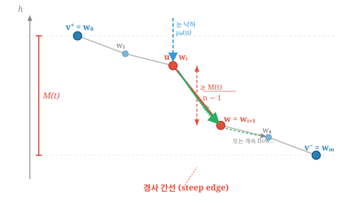
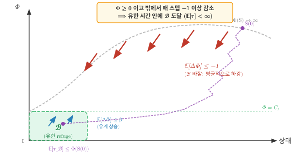

# 1. 논문 기호 정리 (Notation Reference)

## 그래프 기본

| 기호 | 의미 |
|------|------|
| $\mathcal{G} = (V, \mathbf{E}, \mathbf{W})$ | 가중 그래프 |
| $V = \{1, 2, \ldots, n\}$ | 노드 집합 ($n = \|V\|$) |
| $\mathcal{E}$ | 간선 집합: $\{(v_i, v_j) : v_i \leftrightarrow v_j\}$ |
| $\mathbf{E}$ | $n \times n$ 인접 행렬 ($E_{ij} = 1$ if $(v_i, v_j) \in \mathcal{E}$) |
| $\mathbf{W}$ | $n \times n$ 가중치 행렬 ($0 \leq W_{ij} \leq 1$) |
| $v_i$ | $i$번째 노드 |
| $N_i$ | $v_i$의 이웃 집합: $\{j : (v_i, v_j) \in \mathcal{E}\}$ |
| $\deg(v_i)$ | $v_i$의 차수 ($= \|N_i\|$) |
| $\deg^-(v)$ | 내차수 (in-degree): $\sum_{u \in V} w(u, v)$ |
| $\deg^+(v)$ | 외차수 (out-degree): $\sum_{u \in V} w(v, u)$ |
| $n$ | 노드 수 ($= \|V\|$) |

## 초기 데이터

| 기호 | 의미 |
|------|------|
| $y(v)$ | 노드 $v$에서 관측된 신호값 |
| $\mathbf{y} = (y(v_1), \ldots, y(v_n))^\top$ | 신호 벡터 |

## Heavy-Snow Process (Algorithm 1)

| 기호 | 의미 |
|------|------|
| $h(v, t)$ | 시각 $t$에서 노드 $v$의 높이 ($h(v, 0) := y(v)$) |
| $\mathbf{h}(\cdot, t) = \{h(v,t) : v \in V\}$ | 시각 $t$의 snowy ground (높이 벡터) |
| $b$ | 업데이트 양 (눈의 양, $b > 0$) |
| $T_{max}$ | 최대 연속 flow 횟수 |
| $\boldsymbol{\mu}_0$ | 초기 낙하 분포 ($\mu_0(v_i) \propto \deg(v_i)$) |
| $X_t$ | 시각 $t$에서 눈이 존재하는 노드 인덱스 |
| $Z(t)$ | 연속 flow 카운터 ($Z(t) \in \{0, 1, \ldots, T_{max}\}$) |
| $\mathcal{N}_i$ | $v_i$의 이웃 집합 |
| $\mathcal{D}(t)$ | 하류 영역 (downstream): $h(v_j, t-1) \leq h(v_{X_{t-1}}, t-1)$인 이웃 |

## 전이 확률

| 기호 | 의미 |
|------|------|
| $p_{\downarrow v_j}$ | $\boldsymbol{\mu}_0$에 의해 $v_j$가 선택될 확률: $\frac{\deg(v_j)}{\sum_{k \in V} \deg(v_k)}$ |
| $p_{t, v_i \to v_j}$ | 시각 $t$에서 $v_i$→$v_j$ flow 확률: $I(h(v_i,t) \geq h(v_j,t)) \frac{\deg(v_j)}{\sum_{k \in \mathcal{N}_i} \deg(v_k)}$ |
| $p_{t, v_i \to \cdot}$ | block 확률: $\frac{\sum_{k \notin \mathcal{D}(t)} \deg(v_k)}{\sum_{k \in \mathcal{N}_i} \deg(v_k)}$ |

## Snow Distance & Snow Weight

| 기호 | 의미 |
|------|------|
| $\operatorname{SD}_{ij}(t)$ | snow distance: $\sqrt{\sum_{s=0}^{t}(h(v_i,s)-h(v_j,s))^2}$ |
| $\mathbf{SD}(t)$ | Snow distance 행렬 ($n \times n$) |
| $\overline{\operatorname{SD}}^2_{ij}(t) := \frac{1}{t}\operatorname{SD}^2_{ij}(t)$ | 시간 평균 snow distance (제곱) |
| $W_{ij}(t)$ | snow weight: $e^{-\operatorname{SD}^2_{ij}(t) / 2\theta^2}$ ($i \neq j$, $t > 0$) |
| $\mathbf{W}(t)$ | Snow weight 행렬 ($n \times n$) |
| $\theta$ | 연결 강도 조절 파라미터 (Gaussian kernel) |

## 스펙트럼 분석 (Spectral Analysis)

| 기호 | 의미 |
|------|------|
| $\mathbf{D}(t)$ | 차수 대각행렬: $d_i(t) = \sum_{j=1}^n W_{ij}(t)$ |
| $\mathbf{L}(t)$ | snow graph Laplacian: $\mathbf{D}(t) - \mathbf{W}(t)$ |
| $\bar{\mathbf{L}}(t)$ | 정규화 snow graph Laplacian: $\mathbf{D}^{-1/2}(t)\,\mathbf{L}(t)\,\mathbf{D}^{-1/2}(t)$ |
| $\lambda_j^{(t)}$ | $\bar{\mathbf{L}}(t)$의 $j$번째 고유값 ($0 \leq \lambda_1^{(t)} \leq \cdots \leq \lambda_J^{(t)}$) |
| $\boldsymbol{\psi}_j^{(t)}$ | $\lambda_j^{(t)}$에 대응하는 정규직교 고유벡터: $(\psi_{j1}^{(t)}, \ldots, \psi_{jn}^{(t)})^\top$ |
| $\boldsymbol{\Psi}(t)$ | 고유벡터 행렬: $[\boldsymbol{\psi}_1^{(t)}, \ldots, \boldsymbol{\psi}_J^{(t)}]$ |
| $\boldsymbol{\Lambda}(t)$ | 고유값 대각행렬: $\text{diag}(\lambda_1^{(t)}, \ldots, \lambda_J^{(t)})$ |
| $\bar{y}(\lambda_j)$ | graph Fourier 변환: $\sum_{i=1}^n y(v_i)\, \psi_{ij}$ |
| $\boldsymbol{\psi}_j \boldsymbol{\psi}_j^\top \mathbf{y}$ | $\mathbf{y}$의 $j$번째 spectral component |

## 기타 파라미터

| 기호 | 의미 |
|------|------|
| $\sigma^2$ | Gaussian kernel 분산 (예: $\sigma^2 = 0.35$) |
| $\varepsilon_i$ | 노이즈 ($\varepsilon_i \sim N(0, 0.1^2)$) |
| $\|\cdot\|_2$ | 유클리드 노름 |

## 증명 전용 기호 (Section 2에서 사용)

> 논문 기호와의 충돌을 피하기 위해, 증명에서는 아래 기호를 별도로 정의한다.

**상태 및 상태 공간**

| 기호 | 의미 |
|------|------|
| $\boldsymbol{\delta}(t) = (\delta_2(t), \ldots, \delta_n(t))$ | 높이차 벡터: $\delta_i(t) := h(v_i, t) - h(v_1, t)$ |
| $S(t) = (\boldsymbol{\delta}(t),\, X_t,\, Z(t))$ | 마르코프 체인의 상태 |
| $\mathcal{X}$ | 상태 공간: $(\boldsymbol{\delta}(0) + b\mathbb{Z}^{n-1}) \times \{1,\ldots,n\} \times \{0,\ldots,T_{max}\}$ |

**Lyapunov 함수 및 drift**

| 기호 | 의미 |
|------|------|
| $\bar{h}(t) := \frac{1}{n}\sum_k h(v_k, t)$ | 평균 높이 |
| $\hbar(i, t) := h(v_i, t) - \bar{h}(t)$ | 중심화 높이 |
| $\Phi(t) := \sum_{i=1}^{n}\hbar(i,t)^2$ | Lyapunov 함수 (높이 분산, 포텐셜) |
| $M(t) := \max_i \hbar(i, t) - \min_i \hbar(i, t)$ | 높이 범위 (최고−최저) |
| $\Delta_{\mathrm{drift}} := (k+1)(T_{max}{+}1)\alpha - \frac{2q_0}{n-1}$ | drift 조건 상수 ($< 0$이면 수렴 보장) |

**그래프 구조 상수**

| 기호 | 의미 |
|------|------|
| $\mu_{min} := \min_i \mu_0(v_i)$ | 최소 낙하 확률 |
| $k := \lceil 1/\mu_{min} \rceil$ | $T$-step drift의 라운드 하한 ($\mathcal{G}$에만 의존) |
| $\alpha := \lVert\boldsymbol{\mu}_0 - \mathbf{u}\rVert_1$ | 차수 비균등도 ($\mathbf{u}$ = 균등분포) |
| $P_{RW,\min} := \min_{(u,w) \in \mathcal{E}} \frac{\deg(w)}{\sum_{k \in \mathcal{N}_u}\deg(v_k)}$ | 간선-균일 random walk 전이확률 하한 |
| $p_0 := \mu_{min} \cdot P_{RW,\min}$ | 경사 간선 direct flow 확률의 상태-무관 하한 |
| $T := (k+1)(T_{max}+1)$ | $T$-step drift의 스텝 수 |
| $q_0 := 1 - (1 - p_0)^k$ | $T$ 스텝 내 완전 라운드 $\geq k$개 중 큰 낙차 사건 ≥1회 확률 |

**눈의 위치**

| 기호 | 의미 |
|------|------|
| $X_{fall} \in \{1,\ldots,n\}$ | 눈의 초기 낙하 노드 인덱스 (flow 전); 특정 라운드 문맥에서는 $\tilde X_0$와 동일 |
| $X^*(r) \in \{1,\ldots,n\}$ | 라운드 $r$에서 눈의 최종 정착 노드 인덱스 (flow 후) |
| $v^+,\, v^-$ | 최고점/최저점 노드: $\arg\max_i \hbar(i, t)$, $\arg\min_i \hbar(i, t)$ |

**Foster-Lyapunov 관련**

| 기호 | 의미 |
|------|------|
| $\mathcal{B}_\Phi := \{S : \Phi(S) \leq C_1\}$ | 유한 refuge 집합 (양의 재귀 영역) |
| $\tau := \inf\{t \geq 1 : S(t) \in \mathcal{B}_\Phi\}$ | $\mathcal{B}_\Phi$ 도달 시각 |
| $Y(t) := \Phi(S(t))\,\mathbf{1}_{\{t < \tau\}}$ | 보조 과정 ($\mathcal{B}_\Phi$ 도달 후 0으로 리셋) |
| $\beta$ | $\mathcal{B}_\Phi$ 내부에서의 drift 상한 ($< \infty$) |
| $C_0, C_1, C_3$ | 그래프에만 의존하는 상수 |

**에르고딕 극한**

| 기호 | 의미 |
|------|------|
| $\pi$ | 정상분포 (stationary distribution) |
| $c_{ij} := \mathbb{E}_\pi[(\delta_i - \delta_j)^2]$ | 에르고딕 극한 ($\overline{\operatorname{SD}}^2_{ij}(t)$의 a.s. 수렴값) |

---

# 2. $\overline{\mathbf{SD}}^2(t)$의 수렴 증명

## 세팅

논문의 Algorithm 1에 따른 heavy-snow process를 사용한다. $\mathcal{G} = (V, \mathbf{E}, \mathbf{W})$는 **연결(connected)** 가중 그래프, $n = |V|$, $\mathbf{y} = (y(v_1), \ldots, y(v_n))^\top$은 초기 신호, $b > 0$은 업데이트 양, $T_{max} \geq 1$은 최대 연속 flow 횟수이다.

> **Remark (연결성이 필수인 이유).** 그래프가 비연결이면, 단절된 컴포넌트 A, B 사이에 간선이 없으므로 flow에 의한 높이 균등화(self-correction)가 작동하지 않는다. 재시작 분포 $\boldsymbol{\mu}_0 \propto \deg(v)$가 모든 노드에 눈을 뿌리지만, $\boldsymbol{\mu}_0$는 현재 높이를 반영하지 않는 고정 분포이므로, 컴포넌트 간 높이 불균형을 보정하지 못한다. 구체적으로, 두 컴포넌트의 평균 차수가 다르면 ($\bar{d}_A \neq \bar{d}_B$), 컴포넌트 간 평균 높이차가 $O(t)$로 발산하여 $\overline{\operatorname{SD}}^2_{ij}(t) \to \infty$가 된다. 따라서 연결성은 $\overline{\mathbf{SD}}^2(t)$의 유한 수렴을 위한 필수 조건이다.

각 시각 $t$에서 정확히 하나의 노드가 $+b$를 받는다:

$$h(v_i, t) = y(v_i) + b \cdot N_i(t), \quad N_i(t) := \sum_{s=1}^{t} \mathbf{1}(X_s = i)$$

여기서 $X_s$는 시각 $s$에서 눈이 최종 쌓인 노드이다 (원 논문의 표기를 따름).

> **표기 규약 (walker 위치의 두 시간스케일).**
> - **전역시간**: $X_t$ — 전체 마르코프 체인의 시각 $t$에서의 눈 위치. 원 논문과 일치.
> - **라운드 내 로컬**: $\tilde X_j$ — 특정 라운드 분석에서 그 라운드의 $j$번째 스텝에서의 눈 위치 (Appendix B.3 이후로 사용). 전역 표기와의 관계는 $\tilde X_j := X_{t_r + j}$.
>
> 즉 $X$와 $\tilde X$는 **같은 walker의 두 가지 인덱싱**이다. 이 규약은 B.3 도입부에서 다시 명시된다.

Snow distance는 논문 Definition 2에 의해:

$$\operatorname{SD}^2_{ij}(t) := \sum_{s=0}^{t} \big(h(v_i, s) - h(v_j, s)\big)^2$$

---

## 정리 (Main Theorem)

**Theorem.** 연결 가중 그래프 $\mathcal{G}$와 파라미터 $(b, T_{max})$가 주어질 때, 다음 drift 조건이 성립한다고 하자:

$$\Delta_{\mathrm{drift}} := (k+1)(T_{max}{+}1)\alpha - \frac{2q_0}{n-1} < 0 \tag{DC}$$

여기서 $k = \lceil 1/\mu_{min} \rceil$, $\alpha = \|\boldsymbol{\mu}_0 - \mathbf{u}\|_1$ (차수 비균등도), $q_0 = 1-(1-p_0)^k$ (큰 낙차 사건 1회 이상 확률), $\mu_{min} = \min_i \mu_0(v_i)$이다. 특히 **정칙(regular) 그래프에서는 $\alpha = 0$이므로 (DC)가 자동으로 성립**한다.

이때, 상수 행렬 $C = [c_{ij}]_{n \times n}$, $c_{ij} = c_{ij}(\mathcal{G}, b, T_{max}, \mathbf{y} \bmod b) \geq 0$이 존재하여, 임의의 초기 신호 $\mathbf{y}$에 대해:

$$\overline{\mathbf{SD}}^2(t) \xrightarrow{t \to \infty} C \quad \text{a.s.}$$

한계값 $c_{ij}$는 초기 신호 $\mathbf{y}$의 거시적인 절대 스케일에는 완전히 독립적이며, 오직 이산 업데이트 규칙의 격자 경계를 결정짓는 $b$ 단위의 미세한 위상차(fractional part modulo $b$)에만 국소적으로 종속된다.

---

## Step 1. 높이차 과정은 시간-동차 마르코프 체인이다

노드 $v_1$을 기준으로 높이차 벡터를 정의한다:

$$\boldsymbol{\delta}(t) := \big(h(v_2, t) - h(v_1, t),\; \ldots,\; h(v_n, t) - h(v_1, t)\big) \in \mathbb{R}^{n-1}$$

임의의 두 노드 사이의 높이차는 $h(v_i, t) - h(v_j, t) = \delta_i(t) - \delta_j(t)$로 복원된다 (단, $\delta_1 := 0$).

**Proposition 1.** Algorithm 1의 모든 전이 규칙은 높이의 **쌍별 비교(pairwise comparison)** $h(v_i, t) \geq h(v_j, t)$에만 의존하며, 절대 높이에는 의존하지 않는다.

**증명.** HST에서 상태 전이를 결정하는 요소는 (i) 눈이 내릴 노드의 선택 ($X_t \sim \boldsymbol{\mu}_0$, 그래프 구조에만 의존), (ii) flow 발생 여부 (인접 노드 중 현재 노드보다 낮은 노드가 있는지, 즉 $h(v_j, t) \leq h(v_i, t)$ iff $\delta_j(t) \leq \delta_i(t)$), (iii) flow 목적지 선택 (하향 이웃의 차수에 비례, 그래프 구조에만 의존)의 세 가지이다. (i)과 (iii)은 높이와 무관하고, (ii)는 높이차의 부호에만 의존한다. $\square$

따라서 전체 상태를 $S(t) := (\boldsymbol{\delta}(t), X_t, Z(t))$로 정의하면, 전이확률 $\Pr(S(t+1) \mid S(t))$는 $S(t)$에만 의존하고, 절대 높이 $h(v, t)$에는 의존하지 않는다. 즉, **$\{S(t)\}_{t \geq 0}$은 시간-동차 마르코프 체인**이다.

**Example ($n=3$, $b=1$).** 노드가 $v_1, v_2, v_3$인 경로 그래프를 생각하자. 시각 $t=5$에서 높이가 $h(v_1,5) = 7$, $h(v_2,5) = 9$, $h(v_3,5) = 8$이고, 눈이 $v_2$ 위에 있으며 ($X_5=2$), 직전에 block이 발생하여 flow 카운터가 초기화된 상태라면 ($Z(5) = 0$):

$$\boldsymbol{\delta}(5) = \big(h(v_2,5)-h(v_1,5),\; h(v_3,5)-h(v_1,5)\big) = (2,\, 1)$$

$$S(5) = \big((2,\, 1),\; 2,\; 0\big)$$

여기서 절대 높이 $(7, 9, 8)$은 상태에 포함되지 않는다 — 오직 $v_1$ 기준의 **차이** $(2, 1)$만 기록된다. 만약 절대 높이가 $(107, 109, 108)$이더라도 $S(5)$는 동일하게 $\big((2,\, 1),\; 2,\; 0\big)$이다.

> **Remark (상태 공간의 격자성).** 각 시각 $t$마다 노드의 높이는 $b$ 단위로 변하므로, $\boldsymbol{\delta}(t)$는 초기값 $\boldsymbol{\delta}(0)$로부터 $b\mathbb{Z}^{n-1}$의 격자 위에서만 움직인다. 구체적으로, $\delta_i(t) \in (y(v_i) - y(v_1)) + b\mathbb{Z}$이다. 따라서 마르코프 체인의 유효 상태 공간(effective state space)은 $\boldsymbol{\delta}(0) \bmod b$, 즉 초기 신호의 미세 위상차에 의해 그 형태가 영구적으로 결정된다.

> **Remark ($Z(t)$의 상태 공간).** $Z(t)$는 새로운 $\mu_0$ 낙하 시 $0$으로 초기화되고, flow가 지속되는 동안 매 스텝 $1$씩 증가한다. (i) flow가 연속 $T_{max}$회 쌓여 $Z(t) = T_{max}$에 도달하거나 (ii) block이 발생하면 (이때 $Z(t) \leftarrow T_{max}$) 다음 스텝에 $\mu_0$ 재시작이 트리거되고 $Z$가 다시 $0$으로 돌아온다. 따라서 $Z(t)$의 유효 상태 공간은 유한 집합 $\{0, 1, \ldots, T_{max}\}$이다. ($T_{max}$가 "flow 상한 도달"과 "block flag" 두 가지 의미를 겸하므로 $\infty$ 별도 상태가 불필요.)

**스텝별 $+b$ 축적.** Algorithm 1에서 매 마르코프 체인 스텝 $t$마다 현재 눈 위치 $X_t$에 $+b$가 쌓인다. Flow 중에도 방문하는 노드마다 $+b$가 추가된다 (높이 $h(v_i, t) = y(v_i) + b \cdot N_i(t)$에서 $N_i(t) = \sum_{s=1}^t \mathbf{1}(X_s = i)$).

**Round의 정의.** **라운드(round)** $r$은 block 발생 후 새 눈이 $X_{fall}(r) \sim \boldsymbol{\mu}_0$로 낙하하는 시점부터, flow chain을 거쳐 다음 block이 발생하는 시점까지이다. 한 라운드가 $m_r$ 스텝으로 구성되며 $2 \leq m_r \leq T_{max}+1$ (알고리즘 구조상).

이하 Step 2의 drift 분석은 **마르코프 체인 스텝 $t$를 기본 시간 단위**로 사용한다.

---

## Step 2. Height Recurrence — 높이차가 유한 영역으로 반복 복귀

**목표**: 높이차 체인 $\{S(t)\}$가 **양의 재귀 마르코프 체인**임을 보이기.

**전략**: **Foster-Lyapunov 정리** 적용. Lyapunov 함수로 **높이 분산**

$$\Phi(t) := \sum_{i=1}^n (h(v_i,t) - \bar h(t))^2 = \sum_i \hbar(i, t)^2 \qquad (\hbar(i,t) := h(v_i,t) - \bar h(t))$$

을 쓰고, $T$-스텝 window ($T := (k+1)(T_{max}+1)$, $k := \lceil 1/\mu_{min}\rceil$) 동안의 drift를 분석한다.

**핵심 아이디어**: $T$ 스텝 중 **높이 범위 $M(t) := \max_i \hbar - \min_i \hbar$에 비례하는 큰 낙차 (big drop) 사건**이 양의 확률로 발생하면 $\Phi$의 음의 drift 확보. 연결 그래프에서 비둘기집 원리로 최고점 $v^+$에서 최저점 $v^-$로의 경로 위에 **경사 간선 $(v_{i^\star}, v_{j^\star})$** (높이차 $\geq M(t)/(n-1)$)이 존재:

> **Figure.** $v_{i^\star}$에 눈이 떨어지고 첫 flow 스텝에서 $v_{j^\star}$로 이동하면 $M$에 비례한 개선 발생. 단일 라운드 big drop 확률 하한 $p_0 := \mu_{min} \cdot P_{RW,\min} > 0$, $k$ 라운드 중 1회 이상 발생 확률 $q_0 := 1 - (1-p_0)^k > 0$.

이 설정 아래 다음 명제가 성립:

**Proposition (Height Recurrence).** 높이 범위 $M(t)$에 대해, **drift 조건**

$$\Delta_{\mathrm{drift}} := (k+1)(T_{max}{+}1)\alpha - \frac{2q_0}{n-1} \;<\; 0 \tag{DC}$$

이 성립하면 ($\mathcal{G}$가 정칙이면 $\alpha = 0$이므로 자동 성립), $(\mathcal{G}, b, T_{max})$에만 의존하는 상수 $C > 0$이 존재하여, **높이차 과정 $\{S(t)\}$는 유한 집합 $\mathcal{B}_\Phi$로 유한 기대 시간 내에 반복 복귀하는 양의 재귀 마르코프 체인**이다. 특히 $M(t)$는 $\{M \leq C\}$로 반복 복귀.

::: {.callout-tip collapse="true" title="Proposition 직관"}
HST에서 높이 범위 $M(t)$는 $(\mathcal{G}, b, T_{max})$에 의존하는 상수 $C$ 이하로 계속 돌아온다 (무한 발산 안 함). 증명 핵심: $T$-스텝 동안 $\Phi$의 drift를 분석하여 $M(t)$가 충분히 크면 $\Phi$가 감소함을 보인 뒤 Foster-Lyapunov 기준 적용.
:::

**증명의 핵심 산출물**은 $T$-step drift 부등식

$$\begin{aligned}
& \mathbb{E}[\Phi(t{+}T) - \Phi(t) \mid S(t)] \\
& \qquad \leq\; b\, M(t) \underbrace{\left[(k{+}1)(T_{max}{+}1)\alpha - \tfrac{2q_0}{n-1}\right]}_{=:\, \Delta_{\mathrm{drift}}} + C_3
\end{aligned} \tag{$\star\star$}$$

이며, (DC) 아래에서 $(\star\star)$의 우변이 $M(t)$가 충분히 크면 음이 되고, Foster-Lyapunov로 Proposition 완성.

**증명은 [Appendix B](#b-proposition-height-recurrence-의-증명)로 이관.** Appendix B는 8단계로 조직:
- **B.1** — Lyapunov 함수 $\Phi$와 1-step drift (Lemma 1)
- **B.2** — $T$-step drift로의 확장 (tower property 전개)
- **B.3** — 라운드별 기여 상한
- **B.4** — Big drop 사건의 확률과 기여
- **B.5** — $T$-스텝 window 전체에서 $M$ 보존
- **B.6** — 결합 → $(\star\star)$ 도출
- **B.7** — Drift 조건 $\Delta_{\mathrm{drift}} < 0$의 충분 조건
- **B.8** — Foster-Lyapunov 적용과 Proposition 완성

---

## Step 3. 비가약성 (Irreducibility)

**Lemma 2.** 유효 상태 공간 $\mathcal{X}^* := (\boldsymbol{\delta}(0) + b\mathbb{Z}^{n-1}) \times \{1,\ldots,n\} \times \{0,1,\ldots,T_{max}\}$ 위에서 $\{S(t)\}$는 비가약(irreducible)이다.

**증명 (구성적 스케치).** 임의의 $S = (\boldsymbol{\delta}, X, Z)$, $S' = (\boldsymbol{\delta}', X', Z') \in \mathcal{X}^*$에 대해 $P^{(m)}(S, S') > 0$인 $m < \infty$ 존재를 보인다. 세 단계로 경로 구성:

**① Reset ($S$에서 fresh $\mu_0$-상태로 진입).** 어떤 상태에서 시작하든, 최대 $T_{max}+1$ 스텝 내에 양의 확률로 $\mu_0$-재시작 발생. 이후 상태는 $(\tilde{\boldsymbol{\delta}}, v_\ell, 0)$ where $v_\ell$는 $\mu_0$로 샘플링된 노드 (확률 $\mu_0(v_\ell) \geq \mu_{min}$).

**② $\boldsymbol{\delta}$ 격자 이동.** 연속된 라운드들을 통해 $\tilde{\boldsymbol{\delta}} \to \boldsymbol{\delta}'$ 목표. 한 라운드의 net δ-변화는 그 라운드에서 방문한 노드들 ($v_{\ell_1}, v_{\ell_2}, \ldots$)의 시퀀스에 의해 결정됨 (각 방문 노드에 +b 축적 후 평균 보정). 방문 시퀀스는 두 가지 요인으로 제어 가능:
- **Block 라운드** ($m_r = 1$): $\mu_0$ draw 후 즉시 rejected flow로 끝. 순효과 "단 한 노드 $v_\ell$에만 +b". 발생 조건: $v_\ell$의 이웃 중 $v_\ell$보다 높은 것이 샘플링됨 (확률 $\geq P_{RW,\min}$, 이 조건은 $v_\ell$이 자신 이웃 집합 내 최저가 아니면 성립).
- **Flow 라운드** ($m_r \geq 2$): 여러 노드 방문. 순효과 "방문 노드들에 +b".

**핵심**: Block 라운드로 모든 방향의 격자 기저 $\{b \mathbf{e}_\ell\}_{\ell=2}^n$ 생성 가능. $v_\ell$이 현재 자기 이웃 집합의 최저점인 경우만 문제인데, 이는 사전에 다른 노드들을 먼저 +b로 올려서 해소 가능 (유한 번의 보조 라운드). 연결 그래프에선 이 "재배치" 과정이 유한 스텝에 종료 (생성 가능한 δ 이동들이 $b\mathbb{Z}^{n-1}$을 span).

**③ $(X, Z)$ 맞춤.** $\boldsymbol{\delta}'$ 도달 후, 추가 $\mu_0$-draw로 $X = X'$ 달성 (확률 $\mu_0(X') > 0$). $Z'$는 원하는 값까지 flow 지속 또는 block으로 조정.

각 단계의 확률이 양이고 단계 수가 유한이므로 $P^{(m)}(S, S') > 0$. $\square$

> **Remark (증명의 엄밀성).** ②의 "격자 기저 생성 가능" 주장은 연결 그래프 + 균일한 $\mu_0$-draw에서 직관적으로 명백하지만, 완전 엄밀한 전개는 각 graph topology에 대한 case-by-case 구성 (spanning tree 기반 재귀 등)을 요한다. 표준 random-walk-on-lattice 유형의 결과와 구조적으로 동일하며, 본 증명에서는 직관적 스케치로 충분하다 (주 결론인 양의 재귀성 도출에 기여하는 부분).

---

## Step 4. 에르고드 정리와 결론

**Step 1–3의 결합:** $\{S(t)\}$는 격자 $\boldsymbol{\delta}(0) + b\mathbb{Z}^{n-1}$ 위에서 정의된 (가산 상태공간) 마르코프 체인이며, Step 2의 $T$-step Foster-Lyapunov 조건에 의해 유한 집합 $\mathcal{B}_\Phi$가 양의 재귀이고, Step 3에 의해 $\mathcal{B}_\Phi$ 위에서 비가약(irreducible)이다. 따라서 $\{S(t)\}$는 비가약이고 양의 재귀적인(irreducible and positive recurrent) 마르코프 체인이다.

**양의 Harris 재귀성으로의 이행.** 가산(countable) 상태공간 위의 비가약 양의 재귀 마르코프 체인은 자동으로 **양의 Harris 재귀(positive Harris recurrent)** 이다 (M&T, 1993, Prop 10.1.1 및 §9.1; 가산 공간에서는 모든 점이 작은 집합이므로 $\varphi$-비가약성에서 Harris 비가약성이 동치). 따라서 아래 Theorem 17.1.7의 전제가 충족된다.

### 모멘트 조건 $\mathbb{E}_\pi[M^2] < \infty$ 확보

LLN을 $f(S) = (\delta_i - \delta_j)^2$에 적용하려면 $f \in L_1(\pi)$, 즉 $\mathbb{E}_\pi[f] < \infty$가 필요하다. $(\delta_i - \delta_j)^2 = (\hbar(i) - \hbar(j))^2 \leq M(t)^2$이므로 충분조건은:

$$\mathbb{E}_\pi[M^2] < \infty. \tag{M2}$$

하지만 Step 2의 drift $(\star\star)$는 $M$에 **선형**이라 Foster-Lyapunov로부터 직접 도출되는 것은 $\mathbb{E}_\pi[M] < \infty$뿐이다 (이건 M&T Thm 14.0.1 $f$-regularity로 자동). $M^2$ moment까지 확보하려면 **Lyapunov 함수를 강화**해야 한다.

**강화된 Lyapunov: $V := \Phi^2$.** $D := \Phi(t+T) - \Phi(t)$라 쓰면 $V$ 변화량은

$$V(t+T) - V(t) = \Phi(t+T)^2 - \Phi(t)^2 = D^2 + 2\Phi(t)\,D.$$

각 항 제어:

**(a) $\mathbb{E}[D^2 \mid S(t)]$의 상한.** Lemma 1로 $|\Phi(s+1) - \Phi(s)| \leq 2b\,|\hbar(X_{s+1}, s)| + \tfrac{(n-1)b^2}{n} \leq 2bM(s) + b^2$. $T$ 스텝에 걸친 누적은 $|D| \leq 2bTM^* + Tb^2$, where $M^* := \max_{0\leq s\leq T} M(t+s)$. $(\heartsuit)$로 $M^* \leq M(t) + Tb$이므로:

$$\mathbb{E}[D^2 \mid S(t)] \;\leq\; \big(2bT(M(t) + Tb) + Tb^2\big)^2 \;=\; O(b^2T^2 M(t)^2) + O(1).$$

**(b) $2\Phi(t)\cdot \mathbb{E}[D \mid S(t)]$의 상한.** $(\star\star)$로 $\mathbb{E}[D \mid S(t)] \leq bM(t) \Delta_{\mathrm{drift}} + C_3 = -c\,M(t) + C_3$ (여기서 $c := b\,|\Delta_{\mathrm{drift}}| > 0$). 또 항상 $\Phi \geq M^2/2$ (왜냐하면 $\hbar_{\max}^2 + \hbar_{\min}^2 \geq M^2/2$)이므로:

$$2\Phi(t) \cdot (-cM(t)) \;\leq\; 2 \cdot \frac{M(t)^2}{2} \cdot (-cM(t)) \;=\; -c\,M(t)^3.$$

한편 $2\Phi(t) \cdot C_3 \leq 2nC_3\,M(t)^2$ ($\Phi \leq nM^2$ 사용).

**(c) 결합.** $V$-drift 전체는:

$$\begin{aligned}
& \mathbb{E}[V(t{+}T) - V(t) \mid S(t)] \\
& \qquad \leq\; \underbrace{O(b^2T^2)\,M(t)^2 + 2nC_3\,M(t)^2}_{=\,A_2\,M(t)^2} \;-\; c\,M(t)^3 \;+\; O(1)
\end{aligned}$$

$M(t)$가 충분히 크면 (정확히는 $M(t) > 2A_2/c$) $-cM^3$이 $A_2 M^2$를 압도하므로 **유한 집합 $\mathcal{B}_\Phi^\prime := \{M \leq 2A_2/c\}$ 바깥에서**

$$\mathbb{E}[V(t+T) - V(t) \mid S(t)] \;\leq\; -\frac{c}{2}\,M(t)^3 + O(1).$$

Foster-Lyapunov의 $f$-regular 버전 (M&T Thm 14.0.1; drift $\leq -f + O(1) \cdot \mathbf{1}_{\mathcal{B}^\prime}$ ⇒ $\mathbb{E}_\pi[f] < \infty$)을 $f = (c/2) M^3$에 적용:

$$\mathbb{E}_\pi[M^3] \;<\; \infty \quad \Longrightarrow \quad \mathbb{E}_\pi[M^2] < \infty \quad (\text{Jensen}).$$

이로써 (M2)가 확보되고, $(\delta_i - \delta_j)^2 \leq M^2$이 $L_1(\pi)$임이 보장된다.

### LLN 적용

체인의 주기성(periodicity)과 무관하게, 양의 Harris 재귀성과 비가약성에 의해 유일한 정상분포(stationary distribution) $\pi$가 존재하며, **양의 Harris 체인에 대한 강대수 법칙(LLN for positive Harris chains; Meyn & Tweedie, 1993, Theorem 17.1.7)**에 의해 임의의 $f \in L_1(\pi)$에 대해 시간 평균의 수렴이 보장된다:

$$\frac{1}{t}\sum_{s=0}^{t} f(S(s)) \xrightarrow{t \to \infty} \mathbb{E}_\pi[f] \quad \text{a.s.}$$

모멘트 조건 (M2)에 의해 $f(S) = (\delta_i - \delta_j)^2 \in L_1(\pi)$이므로:

$$\boxed{\begin{aligned}
\overline{\operatorname{SD}}^2_{ij}(t) \;=\;\; & \frac{1}{t}\sum_{s=0}^{t} (\delta_i(s) - \delta_j(s))^2 \\
\xrightarrow{t \to \infty}\;\; & \mathbb{E}_\pi[(\delta_i - \delta_j)^2] =: c_{ij} \quad \text{a.s.}
\end{aligned}}$$

**$\mathbf{y}$-종속성의 본질:** 에르고드 극한 $c_{ij}$는 전이핵 $P(S, S')$와 유효 상태 공간에 의해 전적으로 결정된다. 전이핵은 $(\mathcal{G}, b, T_{max})$에만 의존하지만 (Step 1), 유효 상태 공간은 이산 격자 $\boldsymbol{\delta}(0) + b\mathbb{Z}^{n-1}$로 제한되므로 $\boldsymbol{\delta}(0) \bmod b$, 즉 $\mathbf{y} \bmod b$에 의존한다.

따라서 $c_{ij}$는 $\mathbf{y}$의 거시적 절대 스케일에는 완전히 무관하지만, 이산 모델의 본질적 한계로 인해 flow/block 판정 경계를 결정짓는 미세 위상차 $\mathbf{y} \bmod b$에는 국소적으로 의존한다. $\blacksquare$

---

## 비고

1. **초기 과도기.** $\boldsymbol{\delta}(0)$가 $\mathcal{B}_\Phi$ 밖에 있으면, drift 조건에 의해 $\mathcal{B}_\Phi$ 진입까지의 시간은 a.s. 유한이며 대략 $t_0^* \approx \frac{\max_{i,j}|y(v_i) - y(v_j)|}{b}$이다. 과도기의 기여는 $O(t_0^*/t) \to 0$이므로 극한에 영향을 주지 않는다.

2. **$b \to 0$ 극한에서의 완전한 독립성.** $b$가 작아지면 격자가 조밀해져 $\mathbf{y} \bmod b$의 영향이 무시 가능해진다. 극한 $b \to 0$에서는 격자 구조가 사라지고 $c_{ij}$가 $\mathbf{y}$에 완전히 독립이 된다. 이것은 논문에서 $b = 0.01, 0.05$ 등 작은 값을 사용하는 실험과 일관적이다.

3. **논문의 약에르고드성과의 관계.** 원 논문은 전체 과정 $\{h(v,t)\}$의 비동차 전이행렬 $\mathbf{P}(t)$에 대해 약에르고드성을 증명하였다 (Theorem A.5). 본 증명은 높이차 과정으로의 변환을 통해 동차 마르코프 체인을 얻고, 표준 에르고드 정리를 직접 적용하는 상보적 접근이다. 두 결과는 서로를 강화한다: 약에르고드성은 전이행렬의 행 분포 수렴을 보장하고, 본 증명의 동차 에르고드성은 시간 평균의 a.s. 수렴을 보장한다.

---

# 3. Appendix

## A. Foster-Lyapunov Criterion: 용어 해설, 직관, 증명

본문 Step 2에서 사용한 Theorem (Foster-Lyapunov Criterion)의 상세한 해설과 증명을 제시한다.

### 용어 해설

**비가약(irreducible) 마르코프 체인이란?** 상태 공간 $\mathcal{X}$ 위의 마르코프 체인 $\{S(t)\}$가 비가약이라 함은, 어떤 상태에서 출발하든 다른 모든 상태에 유한 스텝 안에 양의 확률로 도달할 수 있다는 것이다: 임의의 $S, S' \in \mathcal{X}$에 대해 $P^{(\ell)}(S, S') > 0$인 $\ell < \infty$이 존재한다. 직관적으로, 상태 공간 전체가 하나의 "통신 클래스"로 이루어져 있어서 체인이 어딘가에 영원히 갇히는 일이 없다. 본 증명에서 Step 3 (비가약성)이 바로 이 조건을 확인하는 단계이다.

**Lyapunov 함수 $\Phi: \mathcal{X} \to [0, \infty)$란?** 상태 공간의 각 상태 $S \in \mathcal{X}$에 음이 아닌 실수값 $\Phi(S)$를 대응시키는 함수로, 상태가 "안정 영역" $\mathcal{B}$에서 얼마나 멀리 떨어져 있는지를 측정하는 일종의 **에너지** 혹은 **고도**이다. 이름은 미분방정식의 안정성 이론에서 사용하는 Lyapunov 함수와 같은 역할을 하기 때문에 붙었다 (Brémaud, 2020, Remark 7.1.3). 본 증명에서 이 역할을 하는 것이:

$$\Phi(\boldsymbol{\delta}) = \sum_{i=1}^{n} \hbar(i, t)^2$$

즉 **높이의 분산**이다. (논문의 노드 집합 $V$와의 기호 충돌을 피하기 위해 $\Phi$로 표기한다.) $\Phi$는 엄밀히 $S = (\boldsymbol{\delta}, X, Z)$의 세 성분 중 $\boldsymbol{\delta}$에만 의존한다 — $\hbar(i, t)$는 높이차 벡터 $\boldsymbol{\delta}$로부터 결정되고, 현재 flow 위치 $X$나 연속 flow 카운터 $Z$와는 무관하기 때문이다. 높이차가 클수록 $\Phi$가 크고 (불안정), 높이가 균등해질수록 $\Phi$가 작아진다 (안정). $\Phi \geq 0$이라는 성질은 "바닥이 있다"는 뜻으로, 이것이 증명의 핵심이다.

### 직관

$\Phi$를 "고도"로 생각하자. $\mathcal{B} = \{S : \Phi(S) \leq C_1\}$은 저지대(refuge)이고, $\mathcal{B}$ 바깥에서는 매 스텝마다 고도가 **평균적으로 최소 $1$씩 하강**한다. $\Phi \geq 0$이라는 바닥이 있으므로, 무한히 하강할 수는 없다 — 결국 유한 시간 안에 $\mathcal{B}$에 도달해야 한다. 더 정확히는, 출발점의 고도가 $\Phi(S(0))$이면 $\mathcal{B}$에 도달하는 기대 시간이 **최대 $\Phi(S(0))$ 스텝**이다. 고도를 매번 $1$씩 깎으면 $\Phi(S(0))$번이면 바닥에 닿는다는 것이다.

### Theorem (Foster-Lyapunov Criterion)의 증명

**증명의 아이디어를 먼저 쉽게 설명한다.**

통장 잔고 비유로 생각하자. 현재 잔고가 $\Phi(S(0))$원이고, $\mathcal{B}$ 바깥에 있는 동안 매 스텝마다 **평균적으로 1원 이상**을 잃는다. 잔고는 음수가 될 수 없다 ($\Phi \geq 0$). 그러면 잔고가 $\Phi(S(0))$원에서 시작해서 매번 1원씩 줄어드니까, **최대 $\Phi(S(0))$번이면 잔고가 바닥나서** $\mathcal{B}$ (잔고가 $C_1$ 이하인 영역)에 들어갈 수밖에 없다.

증명은 이 직관을 정확히 수식으로 옮긴 것이다. 핵심 트릭은 **$\mathcal{B}$에 도착한 이후에는 $\Phi$를 0으로 꺼버리는** 보조 과정 $Y(t)$를 정의하는 것이다.

**증명** (Brémaud, 2020, p.228).

**Step 1: 보조 과정 $Y(t)$ 정의.** $\tau := \inf\{t \geq 1 : S(t) \in \mathcal{B}\}$를 $\mathcal{B}$에 처음 도달하는 시각이라 하자. 다음 과정을 정의한다:

$$Y(t) := \Phi(S(t))\,\mathbf{1}_{\{t < \tau\}} = \begin{cases} \Phi(S(t)) & t < \tau \text{ ($\mathcal{B}$에 아직 도착 전)} \\ 0 & t \geq \tau \text{ ($\mathcal{B}$에 도착한 후)} \end{cases}$$

$Y(t)$는 시각 $t$에서의 잔고이다. 단, $\mathcal{B}$에 도착한 순간 잔고를 0으로 리셋한다.

**Step 2: $Y(t)$가 평균적으로 감소함을 보인다.** $t < \tau$이면 $S(t) \notin \mathcal{B}$이므로, drift 조건에 의해:

$$\mathbb{E}[Y(t+1) \mid S(0), \ldots, S(t)] \leq Y(t) - \mathbf{1}_{\{t < \tau\}}$$

이것은 "$\mathcal{B}$ 도착 전에는, $Y$가 매 스텝 평균적으로 최소 1 감소한다"는 뜻이다. $t \geq \tau$이면 양변 모두 0이므로 자명하게 성립한다.

**Step 3: 양변에 기대값을 취하고 축적한다.**

Step 2의 부등식 양변에 기대값을 취하면:

$$\mathbb{E}[Y(t+1)] \leq \mathbb{E}[Y(t)] - \mathrm{P}(\tau > t)$$

이것을 $t = 0, 1, \ldots, T-1$까지 합산한다 (telescoping):

$$\mathbb{E}[Y(T)] \leq \mathbb{E}[Y(0)] - \sum_{t=0}^{T-1} \mathrm{P}(\tau > t \mid S(0))$$

$Y_T \geq 0$이므로 ($\Phi \geq 0$이 여기서 쓰인다!) 좌변을 0으로 대체해도 부등식이 유지된다:

$$\sum_{t=0}^{T-1} \mathrm{P}(\tau > t \mid S(0)) \leq \mathbb{E}[Y(0)] = \Phi(S(0))$$

$T \to \infty$로 보내면 좌변은 $\sum_{t=0}^{\infty} \mathrm{P}(\tau > t \mid S(0)) = \mathbb{E}[\tau \mid S(0)]$이 되므로:

$$\boxed{\mathbb{E}[\tau \mid S(0)] \leq \Phi(S(0))} \quad (S(0) \notin \mathcal{B})$$

이것이 핵심 결론이다: **$\mathcal{B}$ 바깥에서 출발하면, $\mathcal{B}$에 도달하는 기대 시간이 현재 Lyapunov 값 이하**이다. 잔고 비유로 말하면, 잔고가 $\Phi(S(0))$원인데 매 스텝 최소 1원씩 빠지니까, 아무리 늦어도 $\Phi(S(0))$번이면 바닥난다.

**Step 4: $\mathcal{B}$ 안에서 출발하는 경우.** $S(0) \in \mathcal{B}$이면, 한 스텝 후 $\mathcal{B}$ 밖으로 나갈 수 있지만, first-step analysis로:

$$\begin{aligned}
\mathbb{E}[\tau \mid S(0)] \;=\;\; & 1 + \sum_{S' \notin \mathcal{B}} P(S(0), S')\, \mathbb{E}[\tau \mid S'] \\
\leq\;\; & 1 + \sum_{S'} P(S(0), S')\, \Phi(S') \\
\leq\;\; & 1 + \Phi(S(0)) + \beta \;<\; \infty
\end{aligned}$$

따라서 $\mathcal{B}$ 안의 모든 상태에서도 복귀 기대 시간이 유한하다. $\mathcal{B}$가 유한 집합이므로 체인은 양의 재귀이다 (Brémaud, Lemma 7.1.2). $\square$

---

## B. Proposition (Height Recurrence)의 증명

Step 2의 Proposition을 증명한다. $T := (k+1)(T_{max}+1)$ 스텝 동안의 Lyapunov 함수 $\Phi$의 drift를 분석하여 $T$-step drift 부등식 $(\star\star)$을 도출한 뒤, Foster-Lyapunov를 적용하는 구성.

### B.1. Lyapunov 함수 $\Phi$와 1-step drift (Lemma 1)

**Lemma 1 (Drift Condition).** Lyapunov 함수를

$$\Phi(t) := \sum_{i=1}^{n} \big(h(v_i, t) - \bar{h}(t)\big)^2, \quad \bar{h}(t) := \frac{1}{n}\sum_k h(v_k, t)$$

로 정의한다. (여기서 $\Phi$는 높이 분산을 나타내는 포텐셜 함수로, 논문의 노드 집합 $V$와의 혼동을 피하기 위해 별도 기호를 사용한다.) 또한 **중심화 높이**를 노드 인덱스 $i \in \{1,\ldots,n\}$에 대해 $\hbar(i, t) := h(v_i, t) - \bar{h}(t)$로 쓴다. 시각 $t+1$에서 노드 $v_\ell$에 $+b$가 쌓이면:

$$\Phi(t+1) - \Phi(t) = 2b\,\hbar(\ell, t) + \frac{(n-1)b^2}{n}$$

::: {.callout-tip collapse="true" title="Lemma 1 직관: 왜 이 식이 나오는가?"}

$\Phi$는 "높이들이 평균에서 얼마나 퍼져 있는가"를 재는 분산이다. 한 노드 $v_\ell$에 눈 $b$가 쌓이면 $\Phi$가 어떻게 변하는지 생각해보자.

**항 1: $2b\,\hbar(\ell, t)$.** $v_\ell$이 이미 평균보다 높으면 ($\hbar(\ell, t) > 0$) 눈이 쌓여서 더 높아지니까 분산이 **증가**한다. 반대로 평균보다 낮은 노드에 쌓이면 ($\hbar(\ell, t) < 0$) 평균 쪽으로 당겨지니까 분산이 **감소**한다. 즉, 낮은 곳에 눈이 쌓일수록 $\Phi$가 줄어든다 — 이것이 flow가 $\Phi$를 줄이는 핵심 메커니즘이다.

**항 2: $\frac{(n-1)b^2}{n}$.** 어디에 쌓이든 한 노드만 $+b$되고 나머지 $n-1$개는 그대로이므로, 평균이 $b/n$만큼 올라가면서 "한 놈만 튀는 효과"로 분산이 약간 증가한다. 이 항은 항상 양수이고 $b^2$에 비례하는 작은 상수이다.

요약하면: **$\Phi$의 변화 = (눈이 어디에 쌓였나에 따른 큰 효과) + (무조건 붙는 작은 양의 보정)**이다.
:::

**증명 ($\Phi$ 전개).** $\sum_i \hbar(i, t) = 0$이다. $v_\ell$에 $+b$가 쌓이면:

$$\hbar(\ell, t{+}1) = \hbar(\ell, t) + b\frac{n-1}{n}, \quad \hbar(i, t{+}1) = \hbar(i, t) - \frac{b}{n} \;\;(i \neq \ell)$$

따라서:

$$\Phi(t{+}1) = \left(\hbar(\ell, t) + b\frac{n-1}{n}\right)^2 + \sum_{i \neq \ell}\left(\hbar(i, t) - \frac{b}{n}\right)^2$$
$$= \hbar(\ell, t)^2 + 2\hbar(\ell, t)\, b\frac{n-1}{n} + b^2\frac{(n-1)^2}{n^2} + \sum_{i \neq \ell}\left(\hbar(i, t)^2 - 2\hbar(i, t)\frac{b}{n} + \frac{b^2}{n^2}\right)$$
$$= \Phi(t) + 2b\frac{n-1}{n}\hbar(\ell, t) - \frac{2b}{n}\sum_{i\neq\ell}\hbar(i, t) + b^2\frac{(n-1)^2}{n^2} + (n-1)\frac{b^2}{n^2}$$

$\sum_{i\neq\ell}\hbar(i, t) = -\hbar(\ell, t)$이므로:

$$= \Phi(t) + 2b\frac{n-1}{n}\hbar(\ell, t) + \frac{2b}{n}\hbar(\ell, t) + b^2\frac{(n-1)^2 + (n-1)}{n^2}$$

$$= \Phi(t) + 2b\,\hbar(\ell, t) + \frac{(n-1)b^2}{n} \quad \square$$

**1-step $\Phi$ 변화.** Lemma 1에 기대값을 씌우면, 스텝 $t+1$에서 $+b$가 쌓이는 노드 $X_{t+1}$에 대해:

$$\mathbb{E}[\Phi(t+1) - \Phi(t) \mid S(t)] = 2b \cdot \mathbb{E}\big[\hbar(X_{t+1},\, t) \mid S(t)\big] + \frac{(n-1)b^2}{n} \tag{$\dagger$}$$

::: {.callout-tip collapse="true" title="($\\dagger$) 직관: 이 식이 말하는 것"}

Lemma 1에서 $v_\ell$은 "눈이 실제로 쌓이는 노드"였다. HST에서 매 스텝마다 현재 눈 위치 $X_{t+1}$에 $+b$가 쌓이므로, Lemma 1의 $\hbar(\ell, t)$를 $\hbar(X_{t+1}, t)$로 바꾸고 기대값을 씌운 것이 ($\dagger$)이다.

이 식의 핵심은 $\mathbb{E}[\hbar(X_{t+1}, t) \mid S(t)]$, 즉 **"다음 스텝에서 눈이 쌓이는 노드의 중심화 높이의 기대값"**이다. 이 값이 음수면 — 평균적으로 낮은 곳에 눈이 쌓인다면 — 첫째 항이 음수가 되어 $\Phi$가 감소한다. Flow 스텝에서는 높은 곳에서 낮은 곳으로 눈이 이동하므로 $\hbar(X_{t+1}, t) \leq \hbar(X_t, t) + b$가 보장되고, 이것이 $\Phi$를 줄이는 핵심 메커니즘이다.

$\frac{(n-1)b^2}{n}$ 양의 보정 항이 항상 붙지만, $\Phi$가 제곱합이므로 높이차가 충분히 크면 $|2b \cdot \hbar(X_{t+1}, t)|$이 이 보정을 압도한다 (아래 수치 예시 참조).
:::

::: {.callout-note collapse="true" title="수치 예시: $\\Phi$가 제곱합이라서 생기는 차이"}

$n = 2$, $b = 1$로 놓자. 노드가 $v_1, v_2$ 두 개이고, 눈이 낮은 쪽 $v_2$에 쌓이는 상황을 비교한다.

**Case A: 높이차가 클 때.** $h(v_1) = 50$, $h(v_2) = -50$ (중심화 높이). $v_2$에 $+1$ 쌓이면:

$$\Phi_{\text{before}} = 50^2 + (-50)^2 = 5000$$
$$\Phi_{\text{after}} = 50.5^2 + (-49.5)^2 = 2550.25 + 2450.25 = 5000.50$$

잠깐 — 이건 중심화 높이가 바뀌는 걸 반영해야 한다. $v_2$에 $+1$이 쌓이면 평균이 $0.5$ 올라가므로:

$$h_1' = 50 - 0.5 = 49.5, \quad h_2' = -50 + 1 - 0.5 = -49.5$$
$$\Phi_{\text{after}} = 49.5^2 + (-49.5)^2 = 4900.50$$
$$\Delta\Phi = 4900.50 - 5000 = \mathbf{-99.50}$$

**Case B: 높이차가 작을 때.** $h(v_1) = 5$, $h(v_2) = -5$. 같은 방식으로:

$$\Phi_{\text{before}} = 5^2 + (-5)^2 = 50$$
$$h_1' = 4.5, \quad h_2' = -4.5$$
$$\Phi_{\text{after}} = 4.5^2 + (-4.5)^2 = 40.50$$
$$\Delta\Phi = 40.50 - 50 = \mathbf{-9.50}$$

둘 다 낮은 쪽에 $b=1$이 쌓인 동일한 사건인데, Case A에서는 $\Phi$가 $99.50$ 줄고 Case B에서는 $9.50$밖에 안 줄었다. Lemma 1의 공식으로 검산하면 $\Delta\Phi = 2b \cdot \hbar(\ell, t) + \frac{(n-1)b^2}{n} = 2(1)(-50) + \frac{1}{2} = -99.50$ (Case A), $2(1)(-5) + \frac{1}{2} = -9.50$ (Case B)으로 정확히 일치한다.

핵심: **같은 $b$가 쌓여도**, $\hbar(\ell, t)$이 $-50$이냐 $-5$이냐에 따라 $\Phi$ 감소량이 **10배** 차이난다. 이것이 "$\Phi$가 제곱합이라서 높이차가 클수록 음의 drift가 강해지는" 메커니즘이다.
:::

### B.2. $T$-step drift로의 확장

**$T$-step drift로의 전환.** 1-step drift만으로는 모든 그래프 구조에서 음의 drift를 보장할 수 없다. 다음의 비대칭 바벨 그래프가 대표적 반례이다.

**Example (비대칭 바벨 그래프).** $K_4$와 $K_2$를 하나의 bridge 간선 $(v_4, v_5)$으로 연결한 그래프를 생각하자. $\mu_0 \propto \deg$이므로 $K_4$ 쪽 노드(차수 $3$~$4$)에 눈이 떨어질 확률이 $K_2$ 쪽 노드(차수 $1$~$2$)보다 크다.

단기적으로 보면, 눈이 $K_4$ 내부의 노드 $v_i$에 떨어지면 ($\mu_0(v_i)$가 큼), $v_i$의 높이가 $b$만큼 올라가고 flow가 인접 노드로 발생하는데, 이 인접 노드 역시 대부분 $K_4$ 내부이다. 즉, **눈이 $K_4$ 안에서 떨어지고 $K_4$ 안에서 흡수되는** 경우가 지배적이다. Bridge를 통해 $K_2$ 쪽으로 flow가 흘러가려면 $v_4$에 눈이 떨어지고 $v_5$가 $v_4$보다 높지 않아야 ($y(v_4) \geq y(v_5)$) 하는데, $\mu_0$ 편향으로 $K_4$ 쪽이 이미 높아져 있으므로 이 사건의 확률은 상대적으로 작다.

결과적으로 소수의 스텝에서는 $\mu_0$의 편향이 flow의 균등화 효과를 압도하여, $K_4$ 쪽에 눈이 편중 축적되고 $\Phi$가 **증가**하는 방향의 drift가 발생할 수 있다. 그러나 $T = (k+1)(T_{max}+1)$ 스텝에 걸쳐 보면, 높이차가 충분히 커진 상태에서는 경사 간선 $(v_4, v_5)$을 통한 flow가 반드시 발생하여 큰 낙차를 만들고, 이 음의 기여가 $\mu_0$ 편향의 양의 기여를 압도한다.

이 관찰이 다중 스텝 drift를 사용하는 근본적 이유이다. 구체적으로, $T$-step skeleton 체인에 **Foster-Lyapunov 기준**을 적용하여 양의 재귀성을 이끌어낸다.

> **Remark (양의 재귀성이 필요한 이유).** $S(t) = (\boldsymbol{\delta}(t), X_t, Z(t))$에서 $X_t \in \{1,\ldots,n\}$과 $Z(t) \in \{0,\ldots,T_{max}\}$는 유한이므로 유한 마르코프 체인으로 착각할 수 있으나, $\boldsymbol{\delta}(t) \in b\mathbb{Z}^{n-1}$이 무한이므로 전체 상태 공간 $b\mathbb{Z}^{n-1} \times \{1,\ldots,n\} \times \{0,\ldots,T_{max}\}$는 **가산 무한**이다. 유한 상태 마르코프 체인에서는 비가약성만으로 양의 재귀성이 자동으로 따라오지만, 가산 무한 상태 공간에서는 재귀적이지만 양의 재귀가 아닌 체인(null recurrent chain)이 존재하며, 이 경우 기대 복귀 시간 $\mathbb{E}[\tau_{\mathcal{B}}] = \infty$이므로 Step 4에서 사용할 에르고딕 정리(M&T Theorem 17.1.7)의 전제가 깨진다. 따라서 Foster-Lyapunov 기준을 통해 $\mathbb{E}[\tau_{\mathcal{B}}] < \infty$를 명시적으로 보여야 한다.

**$T$ 스텝 동안의 $\Phi$ 변화.** $T := (k+1)(T_{max}+1)$로 놓자. $(\dagger)$의 per-step 등식에 **tower property** ($\mathbb{E}[\mathbb{E}[\cdot \mid S(t{+}s)] \mid S(t)] = \mathbb{E}[\cdot \mid S(t)]$)를 써서 $S(t)$-조건부로 맞추고 $s = 0, \ldots, T-1$ 합산하면 (telescoping):

$$\begin{aligned}
& \mathbb{E}[\Phi(t{+}T) - \Phi(t) \mid S(t)] \\
& \qquad =\; 2b \sum_{s=0}^{T-1} \mathbb{E}\big[\hbar(X_{t{+}s{+}1},\, t{+}s) \mid S(t)\big] + T \cdot \tfrac{(n-1)b^2}{n}
\end{aligned} \tag{$\dagger\dagger$}$$

$T$ 스텝 안에는 **최소 $k$개의 완전한 라운드**가 포함된다 (각 라운드 $\leq T_{max}+1$ 스텝).

> **Remark (window 경계 보정과 $T$ 정의의 버퍼).** Window 시작 시각 $t$는 임의이므로 라운드 중간일 수 있다. 이 경우 window 앞쪽에 "이미 진행 중이던 라운드의 꼬리 ($\leq T_{max}$ 스텝)"가 fresh $\mu_0$-재시작 없이 소비될 수 있다. 이 경계 손실을 흡수하기 위해 $T = (k+1)(T_{max}+1)$로 정의하여 **$T_{max}+1$ 스텝의 여유 버퍼**를 두었다. 이 버퍼 덕분에 앞쪽에 꼬리 라운드를 하나 통째로 손실해도 뒤쪽에서 $k$개의 완전한 라운드가 남는다.

::: {.callout-tip collapse="true" title="($\\dagger\\dagger$) 직관: $T$번의 $+b$ 축적을 합산한 것"}

($\dagger$)는 "1스텝에서 $\Phi$가 얼마나 변하는가"였다. ($\dagger\dagger$)는 그것을 $T$번 더한 것이다.

$\sum$ 안의 $\hbar(X_{t+s+1}, t{+}s)$는 "스텝 $t{+}s{+}1$에서 눈이 쌓이는 노드의 중심화 높이"이다. $T$개의 항 중 **대부분은 양수일 수 있다** — $\mu_0$ 편향 때문에 높은 쪽 노드에 눈이 쌓이는 스텝이 더 많을 수 있기 때문이다. 하지만 $T$ 스텝 중 **단 한 번이라도** 큰 낙차 사건이 발생하면 — 즉, 눈이 경사 간선의 높은 끝에서 낮은 끝으로 flow하면 — 그 라운드의 큰 음의 기여가 나머지 스텝들의 양의 기여를 상쇄하고도 남는다.
:::

### B.3. 라운드별 기여 상한

라운드 $r$이 $m_r$스텝으로 구성되고, $X_{fall}(r) \sim \boldsymbol{\mu}_0$에서 시작한다. 라운드 $r$의 첫 스텝이 일어나는 시각을 $t_r$로 쓰자. **이 라운드 내 $j$번째 스텝의 눈 위치**를 (전역 표기 $X_t$와 구별하여) 틸데 기호로

$$\tilde X_j \;:=\; X_{t_r + j}, \qquad j = 0, 1, \ldots, m_r - 1$$

로 쓴다. 즉 $\tilde X_j \in \{1,\ldots,n\}$이고, $j=0$은 라운드 시작 노드 ($X_{fall}(r)$와 같음)이다. 중심화 높이는 $\hbar(i, t) := h(v_i, t) - \bar{h}(t)$를 사용한다.

Flow는 절대 높이 $h(v, t)$ 기준으로 하향 이동하지만, 매 스텝 $+b$ 적립으로 평균 $\bar{h}(t)$가 $b/n$씩 증가하므로:

$$\hbar(\tilde X_j,\, t_r{+}j) < \hbar(\tilde X_0,\, t_r) + jb$$

::: {.callout-warning collapse="true" title="왜 $\\hbar(\tilde X_j,\\, t_r{+}j) \\leq \\hbar(\tilde X_0,\\, t_r)$이 아니라 $< \\hbar(\tilde X_0,\\, t_r) + jb$인가?"}

직관적으로는 "flow = 내리막이니까 $\hbar(\tilde X_j, t_r{+}j) \leq \hbar(\tilde X_0, t_r)$이어야 하지 않나?"라고 생각할 수 있다. 하지만 flow의 "내리막"은 **적립 후** 높이 $h(v, t) + b$를 기준으로 판정하므로, 목적지의 절대높이가 출발 노드보다 높을 수 있다. 다음 반례가 이를 보여준다.

**반례.** $n=4$, $b=1$, path 그래프 $v_1\text{---}v_2\text{---}v_3\text{---}v_4$에서 각 노드의 높이를 직전 노드의 적립 후 높이보다 $0.001$만 낮게 잡자:

$$h(\cdot, t_r) = (\underset{v_1}{9},\;\; \underset{v_2}{9.999},\;\; \underset{v_3}{10.998},\;\; \underset{v_4}{11.997})$$

Flow의 진행:

$$v_1 \xrightarrow[\text{9.999 < 10}]{+1 \to h{=}10} v_2 \xrightarrow[\text{10.998 < 10.999}]{+1 \to h{=}10.999} v_3 \xrightarrow[\text{11.997 < 11.998}]{+1 \to h{=}11.998} v_4$$

매 스텝 "내리막"은 겨우 $0.001$이지만, 방문 노드의 절대높이는 $9 \to 9.999 \to 10.998 \to 11.997$로 거의 $+1$씩 상승한다. 중심화 높이로 확인하면 ($\bar{h}(t_r) = 10.499$):

$$\hbar(\tilde X_0, t_r) = -1.499, \quad \hbar(\tilde X_1, t_r{+}1) = -0.750, \quad \hbar(\tilde X_2, t_r{+}2) = -0.001, \quad \hbar(\tilde X_3, t_r{+}3) = +0.748$$

$\hbar(\tilde X_3, t_r{+}3) = +0.748 > -1.499 = \hbar(\tilde X_0, t_r)$이므로, $\hbar(\tilde X_j, t_r{+}j) \leq \hbar(\tilde X_0, t_r)$은 **거짓**이다.

그렇다면 올바른 상한은 무엇인가? Flow의 정의에 의해 $h(v_{\tilde X_j}, t_r{+}j) \leq h(v_{\tilde X_{j-1}}, t_r{+}j{-}1) + b$이므로, 체이닝하면:

$$h(v_{\tilde X_j}, t_r{+}j) \leq h(v_{\tilde X_{j-1}}, t_r{+}j{-}1) + b \leq \cdots \leq h(v_{\tilde X_0}, t_r) + jb$$

한편, $\hbar(i, t) = h(v_i, t) - \bar{h}(t)$이고 $\bar{h}(t_r{+}j) = \bar{h}(t_r) + jb/n$이므로:

$$\hbar(\tilde X_j, t_r{+}j) - \hbar(\tilde X_0, t_r) = \big[h(v_{\tilde X_j}, t_r{+}j) - h(v_{\tilde X_0}, t_r)\big] - \frac{jb}{n} \leq jb - \frac{jb}{n} = jb\cdot\frac{n-1}{n} < jb$$

따라서 $\hbar(\tilde X_j, t_r{+}j) < \hbar(\tilde X_0, t_r) + jb$. $\square$
:::

따라서 라운드 $r$의 총 기여 $\sum_{j=0}^{m_r - 1} \hbar(\tilde X_j, t_r{+}j)$는:

$$\sum_{j=0}^{m_r - 1} \hbar(\tilde X_j, t_r{+}j) < \sum_{j=0}^{m_r-1}\big(\hbar(\tilde X_0, t_r) + jb\big) = m_r \cdot \hbar(\tilde X_0, t_r) + b\cdot\frac{(m_r-1)m_r}{2}$$

$m_r \leq T_{max}+1$이므로 $b \cdot \frac{(m_r-1)m_r}{2} \leq b \cdot \frac{T_{max}(T_{max}+1)}{2}$. 따라서:

$$\sum_{j=0}^{m_r - 1} \hbar(\tilde X_j, t_r{+}j) < m_r \cdot \hbar(\tilde X_0, t_r) + C_{round}$$

여기서 $C_{round} := \frac{T_{max}(T_{max}+1)}{2}\,b$는 $\mathcal{G}$와 알고리즘 파라미터 $(b, T_{max})$에만 의존하는 상수이다.

### B.4. Big drop 사건의 확률과 기여

각 라운드 $r$ 시작 시각 $t_r$에서 현재 $\hbar(\cdot, t_r)$로부터 경사 간선 $(v_{i^\star}, v_{j^\star})$ 구성 (비둘기집으로 높이차 $\geq M(t_r)/(n-1)$). 경사 간선은 **라운드마다 달라질 수 있지만** 연결성으로 항상 존재.

**큰 낙차 사건 $E_r$**: 눈이 $v_{i^\star}$에 떨어지고 ($\tilde X_0 = i^\star$), 첫 flow 스텝에서 $v_{j^\star}$로 이동.

확률은 (경사 간선 선택과 무관하게) **그래프-uniform 하한** 가짐:

$$\Pr(E_r) \;\geq\; \mu_{min} \cdot P_{RW,\min} \;=:\; p_0 \;>\; 0$$

여기서 $P_{RW,\min} := \min_{(u,w) \in \mathcal{E}} \deg(w)/\sum_{k \in \mathcal{N}_u}\deg(v_k) > 0$는 간선-균일 전이확률 하한, $\mu_{min} := \min_i \mu_0(v_i) > 0$. 즉 $p_0$는 상태에 무관하고 $\mathcal{G}$에만 의존하는 **결정적 상수**.

$k$개의 완전 라운드에서 각 라운드 시작 시 fresh $\mu_0$-재시작이 일어나 라운드간 independent이므로, 큰 낙차 1회 이상 발생할 확률: $q_0 := 1 - (1-p_0)^k > 0$.

큰 낙차 라운드의 flow 개선: $E_r$ 발생 시 스텝 $j=0$에서 $\tilde X_0 = i^\star$, 스텝 $j=1$에서 $\tilde X_1 = j^\star$이다. 이때 $j^\star$에는 스텝 1에서 $+b$가 쌓이므로 평균 $\bar{h}(\cdot)$의 $b/n$ 상승분을 빼주면

$$\hbar(\tilde X_1, t_r{+}1) = \hbar(j^\star, t_r) + b\cdot\frac{n-1}{n} < \hbar(j^\star, t_r) + b.$$

이후 $j \geq 2$에 대해서는 B.3과 동일한 체이닝으로 $\hbar(\tilde X_j, t_r{+}j) < \hbar(\tilde X_1, t_r{+}1) + (j-1)b$가 성립하므로, $j \geq 1$에서 통일하여:

$$\hbar(\tilde X_j, t_r{+}j) < \hbar(j^\star, t_r) + jb \;\;\overset{(\ast)}{\leq}\;\; \hbar(i^\star, t_r) - \frac{M(t_r)}{n-1} + jb.$$

(마지막 부등호 $(\ast)$는 경사 간선의 정의 $\hbar(j^\star, t_r) \leq \hbar(i^\star, t_r) - M(t_r)/(n-1)$을 대입한 것이다.) 따라서:

$\tilde X_0 = i^\star$이므로 각 항은 $\hbar(\tilde X_j, t_r{+}j) - \hbar(\tilde X_0, t_r) \leq -M(t_r)/(n-1) + jb$. $j=1$부터 $m_r-1$까지 합하면:

$$\sum_{j=1}^{m_r-1}\big(\hbar(\tilde X_j, t_r{+}j) - \hbar(\tilde X_0, t_r)\big) \leq -(m_r-1)\frac{M(t_r)}{n-1} + b\cdot\frac{(m_r-1)m_r}{2}$$

$m_r \leq T_{max}+1$이므로 $b\cdot\frac{(m_r-1)m_r}{2} \leq C_{round}$이고:

$$\sum_{j=1}^{m_r-1}\big(\hbar(\tilde X_j, t_r{+}j) - \hbar(\tilde X_0, t_r)\big) \leq -(m_r-1)\frac{M(t_r)}{n-1} + C_{round}$$

큰 낙차 없는 라운드 대비, **개선량**은 최소 $M(t_r)/(n-1)$ ($m_r \geq 2$이므로).

::: {.callout-tip collapse="true" title="두 합의 직관적 의미"}
- $\sum_{j=0}^{m_r-1} \hbar(\tilde X_j, t_r{+}j)$는 라운드 $r$ 동안 walker가 방문한 노드들의 centered height 총합이다. 이 값이 클수록 높은 곳을 많이 방문한 것이고, $\Phi$의 증가에 기여한다.
- $\sum_{j=1}^{m_r-1} \big(\hbar(\tilde X_j, t_r{+}j) - \hbar(\tilde X_0, t_r)\big)$는 출발점 대비 얼마나 낮은 곳으로 내려갔는지를 측정한다. 큰 낙차 사건에서는 walker가 $v_{i^\star}$(높은 곳)에서 출발하여 $v_{j^\star}$(낮은 곳)로 떨어지므로 이 합이 크게 음수가 되고, 이것이 $\Phi$를 줄이는 핵심 메커니즘이다.
:::

### B.5. $T$-스텝 window 전체에서 $M$ 보존

B.4의 개선량 부등식은 해당 라운드의 시작 시점 $M$에 비례한다. 하지만 B.6에서 $T$ 스텝 전체에 걸쳐 drift를 합산할 때는 **하나의 기준값** — window 시작 시점의 $M(t)$ — 으로 개선량을 균일하게 표현하는 것이 편리하다. 이를 위해 window의 스텝 $t, t+1, \ldots, t+T$ 내내 $M$이 크게 줄지 않음을 확보해야 한다.

**관찰 (한 스텝당 $M$의 변화량 $\leq b$).** 한 스텝에 노드 하나에만 $+b$가 쌓이므로, 중심화 높이 $\hbar$의 변화는 해당 노드 $\hbar \mapsto \hbar + b(n{-}1)/n$, 나머지 $\hbar \mapsto \hbar - b/n$이다. 즉 $M = \max\hbar - \min\hbar$의 한 스텝 변동은 절댓값으로 $\leq b$. 따라서 $s = 0, 1, \ldots, T$에 대해

$$|M(t+s) - M(t)| \leq Tb, \quad s = 0, 1, \ldots, T. \tag{$\heartsuit$}$$

**가정 $M(t) > 2Tb$로부터의 결론.** $(\heartsuit)$에 의해 window 내내

$$M(t+s) \;>\; M(t) - Tb \;>\; 2Tb - Tb \;=\; Tb \;=\; \tfrac{1}{2}M(t), \quad s = 0, 1, \ldots, T.$$

즉 **$M$이 window 내내 반토막은 나지 않는다.** 따라서:

1. (**확률**) window 내 각 **완전** 라운드에서 큰 낙차 확률이 $\geq p_0$로 유지되므로, $k$개 이상의 완전 라운드 중 최소 1회 발생할 확률 $\geq q_0 = 1-(1-p_0)^k$.
2. (**개선량**) 큰 낙차 라운드의 개선량 $\geq M(t+s)/(n-1) \geq M(t)/(2(n-1))$ — 즉 **$M(t)$만으로 균일하게 하한** 가능.

::: {.callout-tip collapse="true" title="왜 하필 $2Tb$? 그리고 $M(t) \leq 2Tb$ 영역은 어떻게 처리하나?"}

**① 왜 $2Tb$인가? — 반토막 방지용 여유분**

핵심은 "window 내내 $M$이 크게 변하지 않게" 하고 싶다는 것. $M$은 한 스텝에 최대 $b$, $T$ 스텝 동안 총 $Tb$까지 움직일 수 있다. 그래서 $M(t) > 2Tb$로 잡으면, 최악의 감소를 겪어도 $M(t) - Tb > Tb = M(t)/2$로 **반토막은 면한다**.

"반토막" 기준은 편의의 산물이다. 대신 $M(t) > Tb/(1-\varepsilon)$로 잡으면 $(1-\varepsilon)M(t)$까지는 보존되고, 이후 개선량 하한은 $M(t)/(n-1) \cdot (1-\varepsilon)$로 바뀐다. 숫자 $2$는 깔끔함을 위해 $\varepsilon = 1/2$을 택한 것일 뿐, 본질적이지 않다.

**② $M(t) \leq 2Tb$ 영역은 어떻게 되는가? — 그냥 refuge에 흡수**

Foster-Lyapunov 기준의 핵심은 이 문장이다:

> "**유한 refuge 집합 $\mathcal{B}$ 바깥에서만** drift가 음수이면 양의 재귀성 보장."

즉 $\mathcal{B}$ **안에서는** drift의 부호가 뭐든 상관없다 (단, 유한함이라는 제약만). 그래서 우리는 영역을 이렇게 나눈다:

| 영역 | 우리 전략 |
|------|-----------|
| $M > 2Tb$ | B.4의 big drop 논증으로 음의 drift 증명 |
| $M \leq 2Tb$ | "여긴 refuge $\mathcal{B}_\Phi$에 포함, 분석 건너뜀" |

이게 정당하려면 $\{M \leq 2Tb\}$가 **유한 집합**이어야 한다. 확인:

- $\boldsymbol{\delta}$는 격자 $\boldsymbol{\delta}(0) + b\mathbb{Z}^{n-1}$ 위 (이산).
- $\{\boldsymbol{\delta} : M(\boldsymbol{\delta}) \leq 2Tb\}$는 $\mathbb{R}^{n-1}$에서 **유계** ($M$이 $\boldsymbol{\delta}$의 스프레드와 $O(1)$만큼 차이나므로).
- **이산 격자 ∩ 유계 집합 = 유한 집합.** ✓
- $X \in \{1,\ldots,n\}$, $Z \in \{0,\ldots,T_{max}\}$도 유한.

따라서 $\{S : M(\boldsymbol{\delta}(S)) \leq 2Tb\}$는 유한 집합이고, Foster-Lyapunov의 refuge로 쓸 자격이 있다.

**③ 한 문장 요약**

$M > 2Tb$는 "음의 drift를 보장할 수 있는 **작동 영역**"이고, $M \leq 2Tb$는 "어차피 유한하니 refuge로 던져놓고 무시할 **예외 영역**"이다. 두 영역의 경계를 $2Tb$로 잡은 건 window 내내 $M$이 반토막 나지 않게 하는 가장 간단한 여유값이기 때문.
:::

### B.6. 결합

$(\dagger\dagger)$의 합을 라운드별로 분해한다. window 내 라운드 개수를 $R$이라 하면 (체인 trajectory에 따라 달라지는 확률변수) $\sum_{r=1}^R m_r = T$이고, 각 $m_r$이 $1 \leq m_r \leq T_{max}+1$ 범위이므로

$$k+1 \;=\; \frac{T}{T_{max}+1} \;\leq\; R \;\leq\; T.$$

이 중 최대 1개(앞쪽 경계 꼬리)가 부분 라운드일 수 있으니, fresh $\mu_0$-재시작으로 시작하는 **완전 라운드는 $\geq k$개 보장**된다. 상수항 평가에서는 상한 $R \leq T$가 결정적(deterministic)이다. 이제 $(\dagger\dagger)$의 합을 라운드-스텝 이중합으로 재배열:

$$2b \sum_{s=0}^{T-1} \hbar(X_{t+s+1},\, t{+}s) = 2b \sum_{r=1}^{R} \sum_{j=0}^{m_r-1} \hbar(\tilde X_j, t_r{+}j)$$

**(I) $\mu_0$-편향 상한.** 각 라운드의 기여 $\leq m_r \hbar(\tilde X_0, t_r) + C_{round}$이다 (여기서 $\tilde X_0$는 해당 라운드의 초기 낙하 노드). 핵심은 $\mathbb{E}[\hbar(\tilde X_0, t_r)]$의 상한 — 이는 **$\boldsymbol{\mu}_0$ 가중치로 본 노드들의 중심화 높이 평균**이다.

$$\mathbb{E}[\hbar(\tilde X_0, t_r)] = \sum_i \mu_0(i)\,\hbar(i, t_r)$$

**기준점 (정칙 그래프).** 만약 $\boldsymbol{\mu}_0$가 **균등분포** $\mathbf{u} = (1/n,\ldots,1/n)$이면

$$\sum_i \tfrac{1}{n}\,\hbar(i, t_r) = \tfrac{1}{n}\underbrace{\sum_i \hbar(i, t_r)}_{=\,0} = 0$$

즉 **낙하 편향에 의한 $\Phi$ drift 기여가 없다.** 이게 왜 정칙 그래프에서 Theorem이 자동 성립하는지의 이유.

**편향 측정 ($\alpha$).** 일반 그래프에서는 $\boldsymbol{\mu}_0 \neq \mathbf{u}$. 둘의 차이를 $L^1$-norm으로 재면

$$\alpha \;:=\; \|\boldsymbol{\mu}_0 - \mathbf{u}\|_1 \;=\; \sum_i |\mu_0(i) - 1/n|$$

이 차이는 **양의 초과분과 음의 부족분으로 나누어지는데, 두 쪽이 정확히 같은 크기 $\alpha/2$씩** 차지한다 — 이유: $\sum_i(\mu_0(i) - 1/n) = 0$이므로 "더 얹은 확률 총량 = 깎은 확률 총량".

**상한 유도.** 균등 기준에서 벗어난 부분만 남기면:

$$\mathbb{E}[\hbar(\tilde X_0, t_r)] = \sum_i \mu_0(i)\,\hbar(i, t_r) - \underbrace{\sum_i \tfrac{1}{n}\,\hbar(i, t_r)}_{=\,0} = \sum_i \big(\mu_0(i) - \tfrac{1}{n}\big)\,\hbar(i, t_r)$$

우변은 "편향 벡터 $\boldsymbol{\mu}_0 - \mathbf{u}$와 $\hbar$의 내적". 최악의 경우는:

- 초과 확률 $\alpha/2$를 전부 **최고점** $\max_i \hbar$에 배치
- 부족 확률 $\alpha/2$를 전부 **최저점** $\min_i \hbar$에서 차감

이때 내적의 상한:

$$\boxed{\mathbb{E}[\hbar(\tilde X_0, t_r)] \;\leq\; \frac{\alpha}{2}\,\max_i \hbar(i, t_r) - \frac{\alpha}{2}\,\min_i \hbar(i, t_r) \;=\; \frac{\alpha}{2}\,M(t_r)}$$

**직관.** $\mu_0$ 편향이 크면($\alpha$ ↑) 높은 노드에 눈이 더 자주 떨어지는 경향이 생기고, 이게 $\Phi$의 음의 drift를 **$\alpha M/2$만큼 깎아먹는다**.

**$T$ 스텝 합산 + 시간 보정.** 위 박스 안의 상한은 시각 $t_r$(라운드 $r$의 시작)에서의 $M(t_r)$을 쓴다. B.6은 window 시작 $M(t)$ 기준으로 묶어야 하므로 둘을 이어야 한다. 각 라운드 $r$은 window 안에 있으니 $0 \leq t_r - t \leq T$이고, $(\heartsuit)$에 의해

$$M(t_r) \;\leq\; M(t) + Tb$$

이 보정을 반영해 라운드 기여를 전부 합산하면:

$$\text{(I)} \;:=\; 2b \sum_r m_r \,\mathbb{E}[\hbar(\tilde X_0, t_r)] \;\leq\; 2b \cdot T \cdot \frac{\alpha M(t)}{2} + C_I \;=\; b\,T\,\alpha\,M(t) + C_I$$

여기서

$$C_I \;:=\; \alpha\, b^2 T^2 \;+\; 2bT\, C_{round}$$

는 $M(t)$에 무관하고 $\mathcal{G},\,b,\,T_{max}$에만 의존하는 **결정적** 상수이다 ($M(t_r) \leq M(t) + Tb$로 얻는 $\alpha b^2 T^2$ 항과 $R \leq T$로 bounding한 round 상수 기여).

**(II) 큰 낙차 개선.** (I)은 "각 라운드의 **baseline 기여**" ($m_r \hbar(\tilde X_0, t_r)$을 $2b \sum_r m_r$로 합산)를 담당. 이제 (II)는 **baseline을 넘어서는 개선분**을 담당:

$$\text{(II)} \;:=\; 2b \sum_r \sum_{j=1}^{m_r-1}\big(\hbar(\tilde X_j, t_r{+}j) - \hbar(\tilde X_0, t_r)\big)$$

즉 $(\dagger\dagger)$의 합을 "baseline + 개선"으로 분해한 것 중 후자. $\sum_j \hbar(\tilde X_j) = m_r \hbar(\tilde X_0) + \sum_{j \geq 1}(\hbar(\tilde X_j) - \hbar(\tilde X_0))$이므로 (I) + (II) = 전체 sum × $2b$.

B.4에서 한 big-drop 라운드의 개선 bound은

$$\sum_{j=1}^{m_r-1}(\hbar(\tilde X_j, t_r{+}j) - \hbar(\tilde X_0, t_r)) \;\leq\; -(m_r{-}1)\frac{M(t_r)}{n-1} + C_{round}$$

이었다. 모든 라운드에서 $m_r \geq 2$ 보장 (라운드 길이 범위 참조: $\mu_0$-draw 스텝은 flow/block 시도 없으므로 최소 1 스텝이 추가로 필요)이므로 $-(m_r{-}1) \leq -1$, 따라서 한 big-drop 라운드의 음의 기여는 $\leq -M(t_r)/(n-1) + C_{round}$.

**$M(t_r) \to M(t)$ 환산.** $(\heartsuit)$에 의해 $M(t_r) \geq M(t) - Tb$이므로:

$$-\frac{M(t_r)}{n-1} \;\leq\; -\frac{M(t) - Tb}{n-1} \;=\; -\frac{M(t)}{n-1} + \underbrace{\frac{Tb}{n-1}}_{\text{근사 오차}}$$

**Big-drop 이벤트 확률과 기여.** $T = (k+1)(T_{max}+1)$의 버퍼 덕분에 window 내 **완전** 라운드는 최소 $k$개 보장되므로, 큰 낙차 이벤트 1회 이상이 일어나는 사건 $E := \bigcup_{r=1}^{k} E_r$의 확률은 $\Pr(E) \geq 1-(1-p_0)^k = q_0$이다. $E$가 일어나면 위 bound가 최소 한 라운드에 적용되므로:

$$\begin{aligned}
& \mathbb{E}\!\left[\sum_{j\in\text{big-drop round}}\!\! (\hbar(\tilde X_j) - \hbar(\tilde X_0))\right] \\
& \qquad \leq\; q_0 \cdot \left[-\frac{M(t)}{n-1} + \frac{Tb}{n-1} + C_{round}\right] \;=\; -q_0\cdot\frac{M(t)}{n-1} + D_{II}
\end{aligned}$$

여기서

$$D_{II} \;:=\; q_0\left(\frac{Tb}{n-1} + C_{round}\right)$$

는 $M(t)$에 무관한 상수. 두 원천: (i) $q_0 \cdot C_{round}$는 big-drop 라운드 자체의 additive 상수 ($C_{round} = \tfrac{T_{max}(T_{max}+1)}{2} b$), (ii) $q_0 \cdot Tb/(n-1)$는 $M(t_r) \to M(t)$ 근사 오차.

**보수적 하한임을 두 관점에서 확인.**

**(i) 이벤트 지표 vs. 기댓값 수.** $q_0 = \Pr(\geq 1\text{회 big drop})$은 확률이지 기댓값이 아니다. 실제로 window에서 big drop 라운드의 **기대 개수**는 $\mathbb{E}[\#\text{big drops}] \geq k p_0$ (각 $k$ 라운드 독립 Bernoulli $p_0$의 합). Big drop 라운드가 여러 번 발생하면 **추가적 음의 기여** (각각 $-M/(n-1)$)가 누적되어 $\sum$이 더욱 작아지지만, 우리가 사용하는 $-q_0 M/(n-1)$ 상한은 "최소 1회" 이벤트 하나만 감안. 추가 기여를 무시한 **덜 공격적인 (=보수적인) 상한**이라 여전히 정당한 upper bound.

**(ii) Bernoulli 부등식으로 비교.** $(1-p_0)^k \geq 1 - kp_0$ (Bernoulli inequality)이므로

$$q_0 = 1 - (1-p_0)^k \;\leq\; kp_0.$$

따라서 $-q_0 \cdot M/(n-1) \geq -kp_0 \cdot M/(n-1)$, 즉 우리 bound는 $kp_0$ 기반 bound보다 **덜 음수** (약한 하한). 하지만 $q_0 > 0$이기만 하면 drift 조건이 여전히 성립하므로 증명에 지장 없음 — 단순성과 $q_0$의 깔끔한 해석("적어도 1회 성공 확률")을 택한 trade-off.

정리하면 $q_0 M/(n-1)$은 (i) 다중 big drop 추가 기여 무시 + (ii) Bernoulli 느슨 추정의 이중 보수적 근사이며, 그럼에도 **양수이므로 drift 조건 유도에 충분**.

따라서 (II)의 상한 (non-big-drop 라운드의 개선 $\leq 0$을 사용):

$$\begin{aligned}
\text{(II)} \;=\;\; & 2b \sum_r \sum_{j=1}^{m_r-1}\mathbb{E}[\hbar(\tilde X_j) - \hbar(\tilde X_0)] \\
\leq\;\; & 2b \cdot \left(-q_0 \cdot \frac{M(t)}{n-1} + D_{II}\right) \\
=\;\; & -2b \cdot q_0 \cdot \frac{M(t)}{n-1} + 2b\, D_{II}
\end{aligned}$$

여기서 $2b\, D_{II} = 2bq_0\big(\tfrac{Tb}{n-1} + C_{round}\big)$는 $M(t)$-무관 상수, $C_3$에 포함.

**결합.** (I) + (II) + 상수항:

$$\begin{aligned}
& \mathbb{E}[\Phi(t{+}T) - \Phi(t) \mid S(t)] \\
& \qquad \leq\; b\, M(t) \underbrace{\left[(k{+}1)(T_{max}{+}1)\alpha - \tfrac{2q_0}{n-1}\right]}_{=:\, \Delta_{\mathrm{drift}}} + C_3
\end{aligned} \tag{$\star\star$}$$

여기서 $T = (k+1)(T_{max}+1)$을 대입했고,

$$\begin{aligned}
C_3 \;:=\;\; & C_I \;+\; \underbrace{\frac{T(n-1)b^2}{n}}_{(\dagger\dagger)\text{의 상수항}} \;+\; \underbrace{2b\, D_{II}}_{\text{(II)의 상수항}} \\
=\;\; & \alpha b^2 T^2 + 2bT\, C_{round} + \frac{T(n-1)b^2}{n} + 2bq_0\!\left(\frac{Tb}{n-1} + C_{round}\right)
\end{aligned}$$

는 $M(t)$에 무관하고 $\mathcal{G},\,b,\,T_{max}$에만 의존하는 **결정적** 상수. (B.6 종료.)

### B.7. Drift 조건 $\Delta_{\mathrm{drift}} < 0$의 충분 조건

$T$-step drift $(\star\star)$의 우변이 $M(t)$가 커질 때 확실히 음이 되려면:

$$\begin{aligned}
& \Delta_{\mathrm{drift}} = (k+1)(T_{max}{+}1)\alpha - \frac{2q_0}{n-1} < 0 \\
& \qquad \iff\; \alpha < \frac{2q_0}{(k+1)(T_{max}{+}1)(n-1)}
\end{aligned} \tag{$\star\star\star$}$$

이 조건이 성립하면, $|\hbar(i, t)| \leq M(t)$ ($\sum_i \hbar(i)=0$이므로 $\max|\hbar| \leq M$)로부터 $\Phi(t) = \sum_i \hbar(i,t)^2 \leq n\,M(t)^2$, 즉 $M(t)^2 \geq \Phi(t)/n$. 따라서 $\Phi(t) > C_1 := n\big(\tfrac{C_3}{|\Delta_{\mathrm{drift}}|\, b}\big)^2$이면 $M(t) > C_3/(|\Delta_{\mathrm{drift}}| b)$이고 $(\star\star)$의 우변이 음이 된다.

**정칙 그래프에서의 무조건적 성립.** $\mathcal{G}$가 정칙(regular)이면 $\mu_0(v_i) = 1/n$이므로 $\alpha = 0$. 따라서 $\Delta_{\mathrm{drift}} = -2q_0/(n-1) < 0$이 무조건 성립. $T$-step drift 조건이 추가 가정 없이 증명된다.

**일반 연결 그래프로의 확장.** 비정칙 그래프에서 $\alpha > 0$이면 $(\star\star\star)$는 차수 균등도와 $q_0$의 관계를 요구. $T_{max}$가 클수록 조건이 엄격해지지만, 그래프의 병목이 지나치게 극단적이지 않으면 성립. $k$-NN 그래프, 격자 그래프, 차수 비율 $\deg_{max}/\deg_{min}$이 유계인 그래프에서 자연스럽게 만족.

> **Remark (병목 그래프의 한계).** 비대칭 바벨 그래프처럼 $\mu_0$ 편향이 극도로 크고 컴포넌트 간 flow-through 확률이 극도로 작으면 $(\star\star\star)$가 위반될 수 있다. 이것은 $\boldsymbol{\mu}_0 \propto \deg$의 본질적 한계이며, $\mu_0$가 균등이면 문제 소멸.

### B.8. Foster-Lyapunov 적용과 Proposition 완성

$(\star\star)$으로부터 양의 재귀성을 이끌어내기 위해 다음 결과 사용:

**Theorem (Foster-Lyapunov Criterion; Foster, 1953; Brémaud, 2020, Thm 7.1.1; M&T, 1993, Thm 11.3.4).** 가산 상태 공간 $\mathcal{X}$ 위의 비가약 마르코프 체인 $\{S(t)\}$에 대해, 유한 집합 $\mathcal{B} \subset \mathcal{X}$와 함수 $\Phi: \mathcal{X} \to [0, \infty)$가 존재하여

$$\mathbb{E}[\Phi(S(t+1)) - \Phi(S(t)) \mid S(t) = S] \leq -1 + \beta\,\mathbb{1}_{\mathcal{B}}(S)$$

를 만족하면 ($\beta < \infty$), 체인은 양의 재귀이다. (용어 해설, 직관, 증명은 Appendix A 참조.)

**Proposition ($T$-step 확장).** 위 Theorem에서 1-step drift를 $T$-step drift

$$\mathbb{E}[\Phi(S(t+T)) - \Phi(S(t)) \mid S(t)] \leq -1 \quad (S(t) \notin \mathcal{B})$$

로 바꾸어도 양의 재귀성이 성립한다.

**증명.** $S^{(T)}(m) := S(mT)$로 놓으면 $\{S^{(T)}(m)\}$은 전이 커널 $P^T$를 가진 마르코프 체인 (M&T §5.5). 원래 체인의 $T$-step drift 조건은 skeleton 체인의 1-step drift 조건과 같으므로 skeleton이 양의 재귀: $\mathbb{E}[\tau^{(T)}_\mathcal{B}] < \infty$. 원래 체인의 복귀 시각은 $\tau_\mathcal{B} \leq T \cdot \tau^{(T)}_\mathcal{B}$이므로 $\mathbb{E}[\tau_\mathcal{B}] < \infty$. $\square$

$(\star\star\star)$이 성립하면 $(\star\star)$의 drift를 정규화하여 위 Proposition ($T$-step 확장)의 조건을 만족시킬 수 있다.

**$\mathcal{B}_\Phi$의 유한성.** $\mathcal{B}_\Phi := \{S = (\boldsymbol{\delta}, X, Z) : \Phi(\boldsymbol{\delta}) \leq C_1\}$로 놓자. (i) $\boldsymbol{\delta}$는 격자 $\boldsymbol{\delta}(0)+b\mathbb{Z}^{n-1}$ 위 + $\Phi$는 coercive 이차형식이므로 $\{\Phi \leq C_1\}$은 격자에서 유한. (ii) $X \in \{1,\ldots,n\}$, $Z \in \{0,\ldots,T_{max}\}$은 유한. 따라서 $\mathcal{B}_\Phi$는 유한 집합.

$M$에 대한 명시적 상한: $\sum_i\hbar^2 \geq \hbar_{\max}^2 + \hbar_{\min}^2 \geq (\hbar_{\max}-\hbar_{\min})^2/2 = M^2/2$로부터 $\Phi \leq C_1 \Rightarrow M \leq \sqrt{2C_1} =: C$. 이로써 Proposition (Height Recurrence) 증명 완료. $\blacksquare$
