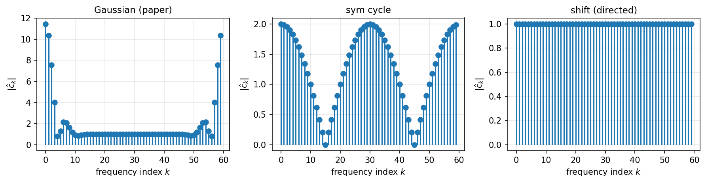
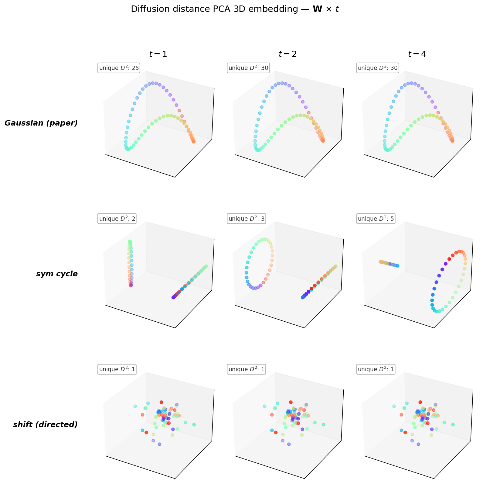

# 0. 동기: "순환행렬로 바꿔봐도 결과가 같을까?"

논문 예제2(링 60점, $f_1=0$ 과 $f_2=\pm 3$ 두 신호)에서 그래프 가중치 $\mathbf{W}$는 Gaussian 커널

$$\mathbf{W}_{ij} = \exp\!\left(-\frac{\Sigma_{ij}^2}{2\theta^2}\right) - \delta_{ij}, \qquad \Sigma_{ij} = \|v_i - v_j\|^2,\ \theta=0.35$$

로 주어져 있다. 링 위의 점이라 $\Sigma_{ij}$가 $|i-j|\,\mathrm{mod}\,n$에만 의존하고, 따라서 이 $\mathbf{W}$는 **이미 순환행렬(circulant)** 이다.

그렇다면 $\mathbf{W}$를 **다른 순환행렬**로 바꿔도 distance embedding (Euclidean / diffusion / snow)이 같은 구조를 복원할까? 구체적으로, 고유벡터가 DFT 기저인 "그 행렬" — 즉 cyclic **shift matrix** $\mathbf{S}$ ($\mathbf{S}_{i,i+1\bmod n} = 1$, 나머지 $0$) — 로 극단화해보면 무엇이 살아남고 무엇이 무너지는가?

> **요지.** 세 distance 중 **diffusion distance 만이 $\mathbf{W}$의 스펙트럼에 강하게 의존**한다. Shift matrix는 모든 고유값 크기가 1이라 diffusion이 **완전히 퇴화**해 정보를 잃는다. 반면 **snow distance는 nonlinear flow/block 규칙 덕분에 스펙트럼 퇴화와 무관**하게 링 순서를 복원한다. HST의 "graph structure를 본다"는 주장이 spectral-robust 한 의미에서 정량적으로 드러나는 예시다.

---

# 1. 세 가지 circulant

세 후보를 병렬 비교한다. 모두 $n=60$, 첫 열 $\mathbf{c}\in\mathbb{R}^n$로 정의되는 $\mathbf{W} = \mathrm{circulant}(\mathbf{c})$, 즉 $\mathbf{W}_{ij} = c_{(i-j)\bmod n}$.

| 이름 | 첫 열 $\mathbf{c}$ | 대칭성 | 희소성 |
|:---|:---|:---:|:---:|
| 논문 $\mathbf{W}_{\mathrm{Gauss}}$ | $c_k = \exp(-\Sigma_{0,k}^2/2\theta^2)$ (대각 제외) | 대칭 | 1.7% 0 |
| 대칭 cycle $\mathbf{W}_{\mathrm{cyc}}$ | $c_1 = c_{n-1} = 1$, 나머지 0 | 대칭 | 96.7% 0 |
| shift $\mathbf{S}$ | $c_{n-1} = 1$, 나머지 0 | **비대칭** | 98.3% 0 |

Shift matrix는 $\mathbf{S}_{i,i+1\bmod n} = 1$ 하나만 가진 순수 permutation 행렬이다.

---

# 2. 공통점: DFT 기저가 고유벡터

**사실.** 모든 $n\times n$ circulant $\mathbf{W}$는 DFT 행렬 $\mathbf{F}$ ($F_{jk} = \tfrac{1}{\sqrt{n}}\omega^{jk}$, $\omega = e^{-2\pi i/n}$)에 의해 대각화된다:

$$\mathbf{W} = \mathbf{F}\,\mathrm{diag}(\hat{\mathbf{c}})\,\mathbf{F}^*$$

여기서 $\hat{\mathbf{c}} = \mathbf{F}\mathbf{c}$는 첫 열의 DFT — 고유값의 열벡터다.

따라서 세 candidate의 **고유벡터는 모두 같다** (DFT 기저). 차이는 오직 **고유값** $\hat{c}_k$에만 있다.

---

# 3. 차이점: 고유값 스펙트럼

$n=60$에서 수치로 확인하면:

| 행렬 | 최대 $|\lambda|$ | 최소 $|\lambda|$ | 실수? | 해석 |
|:---|---:|---:|:---:|:---|
| Gaussian | 11.45 | 0.81 | ✓ | 저주파 집중, 고주파 급감쇠 (Gaussian의 FT) |
| sym cycle | 2.00 | 0.00 | ✓ | $\lambda_k = 2\cos(2\pi k/n)$ — $[-2,2]$에 분산 |
| shift $\mathbf{S}$ | 1.00 | 1.00 | ✗ | 단위원 위 $\omega^k$, 모두 크기 1 |



**해석.** 세 스펙트럼은 "random walk의 smoothing 강도"를 결정한다. Random walk transition $\mathbf{P} = \mathbf{W}/\mathrm{rowsum}$도 circulant이므로 DFT로 대각화되며, $\mathbf{P}^t$의 고유값은 $\hat{p}_k^t$다.

- Gaussian $\mathbf{W}$: $\hat{p}_k$가 $k=0$에서 1, 나머지 빠르게 작아짐 → $\mathbf{P}^t$가 빠르게 DC 모드(균일분포)로 수렴.
- sym cycle: $\hat{p}_k = \cos(2\pi k/n)$ — 매우 천천히 수렴, **$k=n/2$에서 $\hat{p}_{n/2} = -1$** → parity 문제.
- shift $\mathbf{S}$: $\hat{p}_k = \omega^k$, $|\hat{p}_k| = 1$ 전부 → **절대 수렴 안 함, 순수 phase rotation**.

---

# 4. Diffusion distance의 spectral 의존성

Diffusion distance는 $t$ 스텝 후 분포의 $L^2$ 차이

$$\mathrm{DD}^2(i,j) = \|\mathbf{P}^t(i,\cdot) - \mathbf{P}^t(j,\cdot)\|^2$$

로 정의된다. Circulant에서는 Parseval로

$$\mathrm{DD}^2(i,j) = \sum_{k} |\hat{p}_k|^{2t}\,|F_{ik} - F_{jk}|^2 = \sum_k |\hat{p}_k|^{2t}\cdot 2\left[1-\cos\!\left(\tfrac{2\pi k(i-j)}{n}\right)\right]$$

즉 $\mathrm{DD}^2$는 **스펙트럼 가중 이중 코사인 합**이다. 가중치 $|\hat{p}_k|^{2t}$가 distance의 discriminating power를 결정한다.

## 4.1 Shift matrix에서의 완전 퇴화

Shift에서는 $|\hat{p}_k| = 1$ 전부이므로 $|\hat{p}_k|^{2t} = 1$. 합이 $(i-j)$에 대한 **순수 Fourier 합**이 되는데, Parseval로

$$\sum_{k=0}^{n-1} 2\left[1-\cos\!\left(\tfrac{2\pi k m}{n}\right)\right] = 2n - 2n\delta_{m,0} = \begin{cases} 0, & m = 0 \\ 2n, & m \neq 0 \end{cases}$$

즉 $i \neq j$인 모든 쌍이 **정확히 같은 거리** $\mathrm{DD}^2 = 2n$. PCA 관점에서는 $n$개의 점이 $(n-1)$-simplex 꼭짓점에 박힌 꼴 — 선호할 축이 없어 3차원 투영은 무작위처럼 보인다.

**$n=3$ 구체 예시** (구현과 일치):

```
P^4 = P (주기 3) 의 세 행:
  행 0 = [0, 1, 0]   ← "노드 0 에서 4 스텝 후 무조건 1"
  행 1 = [0, 0, 1]   ← "노드 1 에서 4 스텝 후 무조건 2"
  행 2 = [1, 0, 0]   ← "노드 2 에서 4 스텝 후 무조건 0"

행간 squared L2:   D²[i,j] = 2 (모든 i≠j), 0 (i=j)
```

Walker가 결정론적이라 분포가 항상 delta 함수 — 두 delta의 $L^2$ 거리는 **지지점이 다르기만 하면** 항상 $\sqrt{2}$. 정보량 0.

## 4.2 sym cycle에서의 parity 문제

sym cycle에서 $\hat{p}_k = \cos(2\pi k/n)$. $t=4$(논문 기본값)일 때 $|\hat{p}_{n/2}|^{2t} = 1$로 여전히 크며, 홀수 $k$의 기여가 짝수 $k$와 간섭한다. 실제로 $\mathbf{P}^4$는 parity-보존 마르코프 — 노드 0에서 출발하면 4스텝 후 $\{0,\pm 2,\pm 4\}$ (모두 짝수)에만 존재. 결과:

- 짝수 노드끼리, 홀수 노드끼리는 링 순서가 거리로 인코딩됨
- 짝수-홀수 쌍은 지지점 교집합이 공집합 → 최대 거리로 일정

PCA는 이 이분 구조를 최상위 축으로 잡고 각 parity class가 별도의 작은 링을 그린다. "큰 링 + 앞쪽 cluster" 처럼 보이는 전형적 결과.

## 4.3 논문 Gaussian에서는 왜 잘 작동하나

Gaussian $\mathbf{W}$에서 $\hat{c}_k$는 $k$에 대해 Gaussian-decay, 따라서 $|\hat{p}_k|^{2t}$는 몇 개의 저주파 모드만 크고 나머지는 빠르게 0. $\mathrm{DD}^2(i,j)$가 **저주파 몇 개의 코사인 차**로 근사되며 이는 링 거리의 부드러운 함수. PCA로 2~3 축만 잡아도 링을 복원한다.

**핵심 관찰.** Diffusion distance의 discriminating power = "**중간 주파수 모드의 생존**". 스펙트럼이 완전 균일($\mathbf{S}$)이거나 parity-edge가 살아있으면($t=4$인 cyc) 실패한다.

## 4.4 $t$를 바꿔도 spectral failure는 못 구한다

흔한 반문: "$t=4$ 말고 $t=1$ 이나 $t=2$를 쓰면 달라지지 않나?" — 수치로 확인하면 **shift는 어떤 $t$에서도 퇴화**, **cycle은 $t$를 키울수록 미세해짐**, **Gaussian은 $t$에 거의 둔감**.

| 행렬 | $t=1$ (unique $D^2$) | $t=2$ | $t=4$ |
|:---|:---:|:---:|:---:|
| Gaussian | 22 | 30 | 30 |
| sym cycle | **2** | 3 | 5 |
| shift | **1** | 1 | 1 |



- **shift**: $|\hat{p}_k| = 1$이 $t$-제곱으로도 그대로라 discriminating power가 근본적으로 0. $t$ 조절로 해결 불가.
- **sym cycle at $t=1$**: 이웃 2개만 반영되므로 "바로 앞 2칸 떨어진 쌍 vs 나머지"의 이진 구분만 됨. $t$를 키워야 walker 분포가 더 퍼지며 링 거리가 세분화됨. 단, $t$가 짝수로 넘어가는 순간 parity 구조가 끼어들어 단순 ring이 아닌 이분 ring이 나타남($t=4$ 패널).
- **Gaussian**: 이미 첫 스텝부터 링 전체를 덮으므로 $t$ 키워봤자 미세 조정뿐. $t$에 robust.

결론: **$t$ 조절은 spectrum shape을 바꾸지 못한다** ($\hat{p}_k^t$는 $\hat{p}_k$의 단순 함수). 스펙트럼이 퇴화한 그래프에선 diffusion distance가 원천적으로 정보를 못 뽑는다.

---

# 5. Snow distance는 왜 다른가

Snow distance는 $\mathbf{W}$를 마르코프 체인으로 변환한 뒤 **flow/block 규칙으로 non-linear state-dependent dynamics**를 돌린다. 핵심: 같은 노드 $i$에서 다음 노드 $i'$로 가는 step이 snow 또는 block 중 어느 것이 되는가는 "현재 $\mathbf{Z}(t)$의 값" 에 의존하는 비선형 규칙이다:

$$\text{snow deposit at } i':\ \ Z_{i'}(t+1) = Z_{i'}(t) + b\cdot\mathbf{1}\{Z_i(t) \geq Z_{i'}(t)\}$$

(block일 경우 walker가 $\boldsymbol{\mu}_0$로 재생되며 $Z_i$에 $b$ 쌓임.)

## 5.1 Shift matrix에서도 살아남는 메커니즘

Shift에서는 $\mathbf{P}$가 deterministic이라 walker 궤적이 $0 \to 1 \to 2 \to \cdots$ 고정이다. **그럼에도** snow distance가 살아남는 이유:

1. **초기조건 $\mathbf{y} = \mathbf{f}$가 flow/block 분기를 가른다.** $f_2 = \pm 3$의 경우, walker가 $+3$ 노드에서 $-3$ 노드로 이동하려는 순간 $Z_i = +3 \geq Z_{i'} = -3$는 flow, 반대 방향은 block. 이 비대칭이 $\mathbf{Z}(t)$에 구조적 흔적을 남긴다.
2. **재생(block)의 랜덤성이 결정론적 궤적을 깬다.** $\boldsymbol{\mu}_0$(대개 uniform)에서 다시 뽑히므로 "한 번 회전한 궤적"이 여러 번 중첩되며 각 노드별 누적 $Z_i(t)$가 달라진다.
3. **$f_1 = 0$ 같은 trivial 신호에서도** block이 가끔씩 발생하면 walker 재시작 지점에 따라 링을 따라 위치의존 편차가 생긴다. 관측된 figure에서 (a) 패널이 매끄러운 3D 호로 링 순서를 복원하는 이유다.

## 5.2 Linear vs nonlinear

이 차이는 구조적이다:

| 질문 | Diffusion | Snow |
|:---|:---|:---|
| Dynamics | $\mathbf{Z}(t) = \mathbf{P}^t\mathbf{Z}(0)$ (선형) | $\mathbf{Z}(t+1) = \mathbf{Z}(t) + b\cdot\mathbf{1}\{\cdots\}$ (비선형) |
| 정보원 | $\mathbf{W}$의 spectral decomposition | $\mathbf{W}$의 topology + $\mathbf{Z}$ 경계면 |
| 실패 조건 | 스펙트럼 퇴화 ($|\hat{p}_k|$ 균일) | 없음 (어느 circulant 에서도 작동) |

Diffusion은 "많이 걷는다 → 분포가 어떻게 퍼지나"를 본다. Shift에서는 walker가 단 한 점에 모여 있어 분포가 항상 delta → 볼 게 없다. Snow는 "걷는 과정에서 무엇이 block 되나"를 본다. Block 경계면은 $\mathbf{Z}$의 **level set**이며 linear spectrum에 종속되지 않는다.

---

# 6. 실험: directed shift에서의 figure 5

스크립트 [260424\_예제2재현\_순환행렬.py](../260424_예제2재현_순환행렬.py), $\tau = 10^5$:

```
PYHST_CIRC=directed python 260424_예제2재현_순환행렬.py
```

산출물: [results/figure5\_circulant\_directed.png](../results/figure5_circulant_directed.png)

| 행 | (a) $f_1 = 0$ | (b) $f_2 = \pm 3$ |
|:---|:---|:---|
| Euclidean | 완전 퇴화 ($f=0$) | 두 클러스터로 분리 |
| Diffusion | 모든 쌍 $D^2 = 2n$ — 단일 값 | 동일 (diffusion은 $\mathbf{W}$만 의존) |
| **Snow** | **매끄러운 3D 호로 링 순서 복원** | **두 개의 휜 호로 반원 분리** |

Euclidean과 diffusion이 둘 다 무너지는 (a) 열에서 snow만 유일하게 링 구조를 복원한다. 이는 논문의 정성적 주장 — "snow distance는 graph structure를 본다" — 이 **스펙트럼 퇴화에 대한 강건성**이라는 구체적 의미를 가진다는 증거다.

---

# 7. 논의와 열린 문제

## 7.1 요약

- 세 circulant($\mathbf{W}_{\mathrm{Gauss}}$, sym cycle, shift $\mathbf{S}$)는 DFT 기저를 공유하지만 스펙트럼 $\hat{\mathbf{c}}$가 완전히 다르다.
- Diffusion distance의 discriminating power는 $|\hat{p}_k|^{2t}$의 비균일성에 **선형적으로** 의존. 스펙트럼 평탄하면 퇴화.
- Snow distance는 $\mathbf{Z}$의 level set을 읽는 **non-linear** 구조라 스펙트럼 형상과 무관.
- 결과: shift matrix처럼 diffusion이 완전히 실패하는 극단 케이스에서도 snow는 링 순서를 복원.

## 7.2 열린 문제

**Q1.** Snow distance의 "discriminating power"를 $\mathbf{W}$와 $\mathbf{f}$의 어떤 양으로 정량화할 수 있는가? Diffusion의 $|\hat{p}_k|^{2t}$에 대응되는 snow 측의 invariant 은?

**Q2.** Shift에서의 snow distance가 복원하는 링 순서는 **어떤 의미의 거리**인가? "Walker 궤적상 인덱스" 인가, "block 발생 패턴의 확률" 인가?

**Q3.** 본 실험의 (b) 결과에서 두 호의 상대 배치는 $\boldsymbol{\mu}_0$(초기분포)에 어떻게 의존하는가? Uniform과 non-uniform $\boldsymbol{\mu}_0$를 비교하면 새 구조가 드러날 가능성.

**Q4.** Circulant가 아닌 일반 그래프에서도 같은 spectral/nonlinear 이분법이 유효한가? Non-regular 또는 방향 그래프에서는 $\mathbf{P}$가 DFT로 대각화되지 않으므로 분석이 달라지지만, non-linear 부분의 강건성은 보존될 것이라 기대한다.

## 7.3 실용적 함의

Graph Laplacian 기반 방법 (spectral clustering, diffusion maps, GCN의 message passing)은 모두 **스펙트럼에 선형 종속**이다. 본 실험은 이 계열이 failure mode (permutation-like graph)에서 무너진다는 사실을 분명히 한다. 반면 HST는 **level-set dynamics** 라는 비선형 메커니즘을 통해 그 기각 경계를 확장한다. 이는 graph signal processing에서 snow process가 갖는 독립적 가치다.
