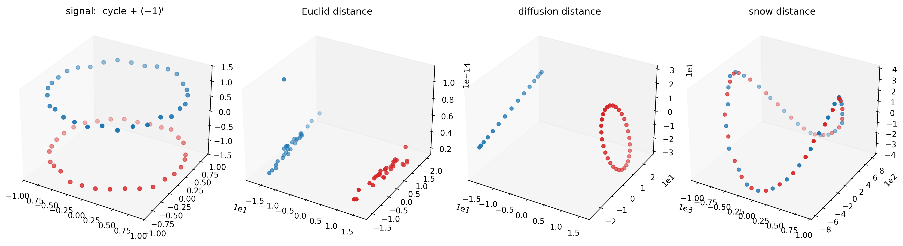
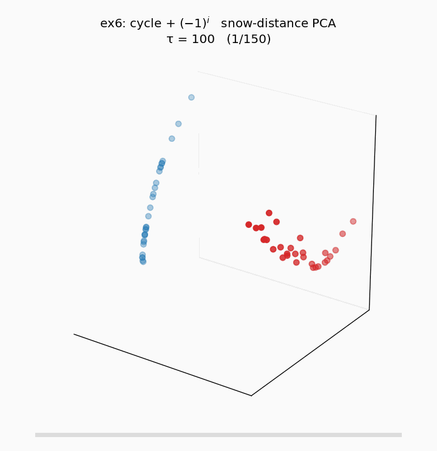
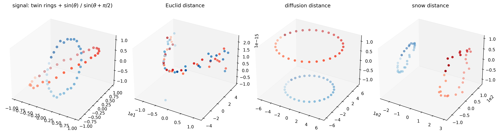
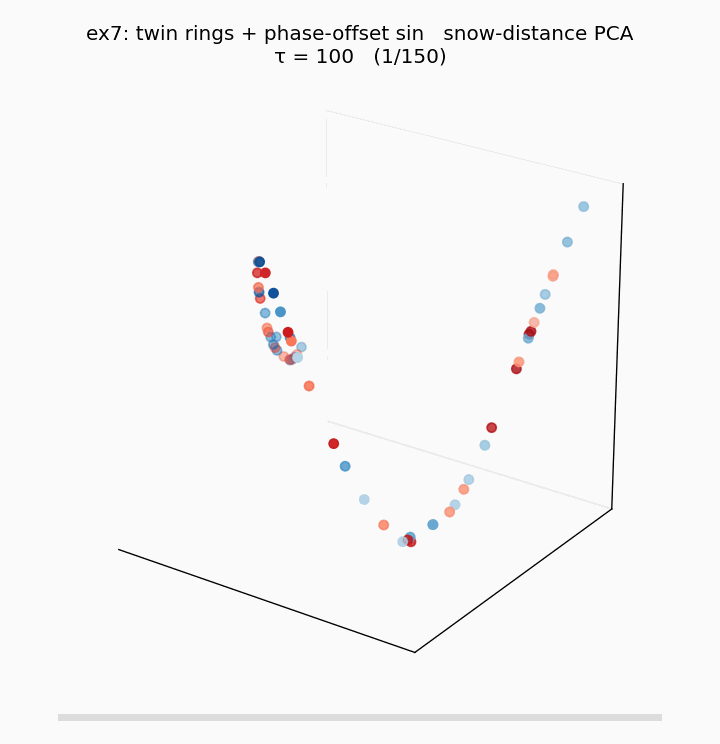
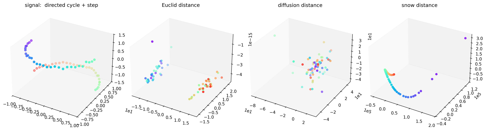
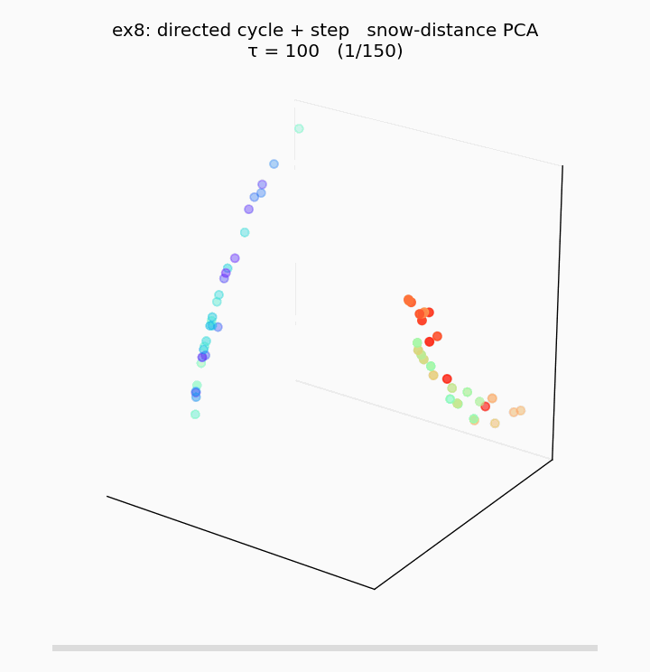

# 0. 동기

[Wt궤적과 선형결합 path의 편차](260424_a5d784.html) 에서 정의한 편차

$$\Delta(t) := \big\| D(t) - D^{\mathrm{lin}}(\alpha(t)) \big\|, \qquad D^{\mathrm{lin}}(\alpha) = (1-\alpha)D^E + \alpha D^G$$

는 HST 의 $D(t)$ 궤적이 두 극한 $D^E, D^G$ 의 **convex combination 위에 놓이지 않음** 을 측정한다. 예제2 (ring + 반원 step), 그리고 그 변형들 (path + step, ring + cos(2θ), MCU 실데이터) 은 모두 $\Delta$ 가 존재하기는 하나 HST 만의 "선형결합 밖" 기여가 시각적·원리적으로 약해 폐기되었다.

본 포스트는 공간과 신호가 **원리적으로 다른 방식으로 상호작용**하도록 설계된 세 가지 예제를 구현·기록한다. 각각 **Euclid 와 diffusion 이 어떤 이유에서 $D^{\mathrm{HST}}$ 에 원천적으로 접근 불가능한지** 가 서로 다르다.

| # | 공간 $W$ | 신호 $f$ | HST 만의 원리 |
|---|---|---|---|
| 예제6 | $C_{60}$ 양방향 cycle | $f_i = (-1)^i$ (Nyquist) | parity × position의 **outer product** (rank-2 sum 으론 불가) |
| 예제7 | twin concentric rings | 내·외 ring 위상차 $\pi/2$ 인 $\sin$ | 두 부분공간 간 **latent isomorphism (회전)** |
| 예제8 | directed cycle (shift $W_{i,i+1}=1$) | 반원 step | **시간 비가역성** — symmetric distance 의 공리적 한계 |

코드: `260424_예제6_parity_cycle.py`, `260424_예제7_twin_rings.py`, `260424_예제8_directed_cycle.py`  
공통 파라미터: $n = 60$, $b = 0.05$, $\tau = 10^6$ (Harris 극한 근처까지 수렴), diffusion $t = 4$ (π-가중, Coifman–Lafon). 각 실험 figure 는 `signal / Euclid / diffusion / snow` 4-panel PCA-3D.

> **참고**: `pyhst.distances.diffusion_distance` 는 본 실험 과정에서 원본 2022 노트북의 scalar-normalize heuristic 에서 정통 Coifman–Lafon ($D^{-1} W$ row-stochastic + $\pi$-weighted $\ell^2$) 로 수정되었다. 자세한 내용은 §5 sweep 참고.

---

# 1. 예제6 — Alternating parity on cycle

## 1.1 Setup

**공간.** $n = 60$. $C_n$ 양방향 cycle; circulant matrix $W = \mathrm{circ}(c)$ with $c_1 = c_{n-1} = 1$, 즉

$$W_{ij} = \mathbb{1}\{\,|i - j| \equiv 1 \pmod n\,\}, \qquad i, j \in \{0, \ldots, n-1\}.$$

각 노드는 정확히 두 이웃 (좌·우) 과 연결, degree 2 regular.

**신호.** Nyquist 주파수:

$$f_i = (-1)^i + \varepsilon_i, \qquad \varepsilon_i \sim \mathcal{N}(0, 0.05^2).$$

짝수 index 는 $+1$, 홀수 index 는 $-1$. 공간 인접 ($|i-j|=1$) 관계는 *항상 부호 반대* — 공간 구조와 신호 구조가 **정반대**.

**snow 임베딩의 τ-수렴 animation** ($\tau: 10^2 \to 10^7$, 로그 스케일 150 프레임, per-frame [-1,1]³ 정규화):

$\tau$ 가 작을 때 (Euclid 근처) 는 두 parity 가 두 덩어리로 시작하고, $\tau$ 가 증가함에 따라 cycle 위 위치 정보가 snow ground 에 누적되며 두 parity class 가 각자 곡선을 그리는 $\mathbb{Z}_2$-cover 형태로 수렴. Harris 극한 근접.

## 1.2 왜 선형결합 $(1-\alpha)D^E + \alpha D^G$ 가 $D^{\mathrm{HST}}$ 에 접근 불가능한가

두 극한 metric의 *정보 내용* 을 먼저 관찰한다.

**$D^E$ 는 binary indicator.**

$$D^E_{ij} = (f_i - f_j)^2 = \begin{cases} 0 & i \equiv j \pmod 2 \\ 4 & i \not\equiv j \pmod 2 \end{cases}$$

즉 **오직 parity 일치/불일치만** 담긴 rank-1 metric. 같은 parity 노드 60개 중 2개는 $D^E = 0$ — cycle 상 위치와 무관.

**$D^G$ 는 parity 를 완전히 모른다.** $P = W/\text{colsum}(W)$ 가 cycle convolution 이므로 $P^t$ 행들의 $\ell_2$ 거리는 순수하게 cycle index 차 $|i - j| \bmod n$ 의 함수. parity 정보 0.

두 metric은 서로 정보 공간이 **완전히 disjoint** — 하나는 parity 만, 다른 하나는 position 만. 이들의 convex combination은 두 독립 축의 *값을 더한 것* 에 불과하며, 임베딩은 "cycle (position 축) + parity gap (신호값 축)" 의 **Cartesian product** — 2-layer cylinder, 즉 예제6 figure 의 **맨 왼쪽 signal panel** 그 자체의 기하.

**HST 는 이 두 정보의 outer product 를 만든다.** snow panel 에서 두 parity class (파랑·빨강) 는 각자 원을 그리며 **서로 interleave 하는** 구조를 보인다. 이는 다음을 의미한다:

- 두 노드가 같은 parity 임에도 ($D^E = 0$) cycle 상 위치가 다르면 **snow distance $> 0$**.
- 두 노드의 cycle 거리가 같아도 ($D^G$ 같음) parity 가 다르면 snow distance 가 다른 값.

즉 snow distance 가 parity 와 position 의 **cross term** 을 담는다. rank-2 sum 으로는 cross term 이 원리적으로 생성되지 않는다 (sum 의 bilinear form 은 outer product 가 아니다).

## 1.3 메커니즘

Nyquist 신호에서 random walker 의 block 조건 $f_{\text{next}} \ge f_{\text{cur}}$ 은 *이웃 신호가 반대* 라 거의 매 step 실패 → block → reset. 각 노드의 snow ground 는 block 빈도와 reset 시의 initdist 를 통해 parity × position 복합 축적을 받으며, 이 축적의 시간 sequence 가 두 축의 비가환 결합을 distance 로 기록한다.

---

# 2. 예제7 — Phase-offset twin rings

## 2.1 Setup

**공간.** 두 동심 ring, 각 $n_1 = n_2 = 30$ 노드 (총 $n = 60$):

$$\begin{aligned}
\text{inner: } & (x_i, y_i) = 0.5 \cdot (\cos\theta_i, \sin\theta_i), & \theta_i = -\pi + \tfrac{2\pi}{30}\, i, & & i = 0, \ldots, 29 \\
\text{outer: } & (x_j, y_j) = 1.0 \cdot (\cos\theta_j, \sin\theta_j), & \theta_j = -\pi + \tfrac{2\pi}{30}\, j, & & j = 0, \ldots, 29
\end{aligned}$$

2D Gaussian kernel:

$$W_{uv} = \exp\!\left(-\frac{\|p_u - p_v\|^2}{2 \cdot 0.25^2}\right) - \delta_{uv}.$$

Intra-ring 인접 (ring 안에서 바로 옆 노드) 은 거리 $\approx 0.105$ (inner) 또는 $\approx 0.21$ (outer) → $W \in [0.7, 0.92]$. Inter-ring 최단 거리는 $r_\text{out} - r_\text{in} = 0.5$ → $W \approx 0.135$. 따라서 intra 는 강한 연결, inter 는 **약한 자연 bridge**.

**신호.** 위상 $\pi/2$ 어긋남:

$$f_i^{\text{in}} = \sin\theta_i + \varepsilon, \qquad f_j^{\text{out}} = \sin(\theta_j + \pi/2) + \varepsilon, \qquad \varepsilon \sim \mathcal{N}(0, 0.05^2).$$

inner ring 은 cosine-like (원래 sine), outer ring 은 $\pi/2$ 회전된 sine.

**snow 임베딩의 τ-수렴 animation** ($\tau: 10^2 \to 10^7$):

초기 frame 은 두 ring 이 Euclidean 기반 신호 값 분포에 가깝게 뒤섞여 있다가, $\tau$ 가 커지면서 bridge 를 통해 운반된 위상 정보가 snow ground 에 축적되며 두 ring 이 각자 고리를 형성하고 **상대 회전각 $\pi/2$** 가 embedding 에 새겨지는 twisted cylinder 로 수렴.

## 2.2 왜 선형결합이 접근 불가능한가

**$D^E$ 는 위상차를 모른다.** 두 ring 의 신호 marginal 분포는 모두 $\sin$ 의 marginal — $[-1, 1]$ 구간의 유사한 분포. $D^E_{uv} = (f_u - f_v)^2$ 는 두 노드의 **신호 *값***만 비교하므로 "inner ring 의 $\theta_i = 0$ 노드 ($f = 0$)" 와 "outer ring 의 $\theta_j = \pi/2$ 노드 ($f = 0$)" 가 **같은 점** 으로 보인다. 두 ring 이 *얼마나 회전되어 서로를 보고 있는가* 라는 정보는 marginal 에 없다.

**$D^G$ 는 공간만 본다.** diffusion distance 는 공간 인접 구조만 반영 → 두 동심원이 *각각 원* 으로, 둘 간 상대 회전은 0.

**선형결합의 한계.** $(1-\alpha) D^E + \alpha D^G$ 는 "두 ring 을 위상 정렬한 채로 z-축 (신호값) 에 따라 접은" 형태만 가능. 위상차 $\pi/2$ 는 두 ring 의 **상호관계** 에 담긴 정보이므로 marginal·marginal 의 sum 으로는 생성되지 않는다.

**HST 는 bridge 에서 phase 를 운반한다.** inner ring 노드 $i$ 에서 출발한 random walker 는 약한 inter-ring edge 를 통해 outer ring 으로 넘어가는데, 도달하는 outer 노드의 신호는 $i$ 의 신호와 위상 $\pi/2$ 어긋남. snow ground 에 이 *위상 불일치 패턴* 이 공간적으로 기록되고, snow distance 에서 두 ring 의 상대 회전각으로 복원된다.

snow panel 에서 관찰: 두 ring 이 각자 곡선을 그리되 **서로 회전된 채로 겹침** (twisted cylinder). 이 twist 각도가 설계한 $\pi/2$ 를 반영.

## 2.3 수학적 관점

두 metric space $(M_1, d_1)$, $(M_2, d_2)$ 사이에 **latent isomorphism** (회전 $R$) 이 있을 때, distance-only 관점에서는 $M_1, M_2$ 를 독립된 공간으로 본다 (marginal 정보만). HST 의 random walk 은 이 두 공간을 실제로 *움직이며 연결* 하므로 isomorphism 의 angle 을 embedding 에 새긴다. 이는 distance-based linear methods 의 원리적 한계를 보여준다.

---

# 3. 예제8 — Directed cycle (shift matrix) + step

## 3.1 Setup

**공간.** $n = 60$. **단방향** shift matrix:

$$W_{ij} = \mathbb{1}\{\,j \equiv i + 1 \pmod n\,\}, \qquad W = \mathrm{circ}(c), \quad c_{n-1} = 1.$$

각 노드는 *정확히 하나의 out-neighbor* ($i \to i+1$) 를 가지며 $W \ne W^\top$. 이 $W$ 는 $\mathrm{DFT}$ 가 고유벡터인 전형적 shift matrix 로, 방향성이 가장 순수하게 부각된다.

**신호.** 반원 step (대칭 깨기):

$$f_i = \begin{cases} +1 & y_i < 0 \\ -1 & y_i \ge 0 \end{cases} + \varepsilon_i, \qquad y_i = \sin\theta_i.$$

(노드들이 unit circle 위에 배치된다고 상상; 단 실제 그래프 구조는 $W$ 만으로 결정, 좌표는 시각화·색 라벨용.)

**snow 임베딩의 τ-수렴 animation** ($\tau: 10^2 \to 10^7$):

초기 frame 에서 signal 기반 두 덩어리로 시작해, $\tau$ 가 증가하면서 방향성 random walk 이 step 경계로부터 신호 history 를 쓸어 담아 **방향성 있는 1D manifold (U-curve)** 로 수렴. diffusion distance 가 어떤 $t$ 에서도 붕괴한 blob 에 머무는 것과 대조.

## 3.2 왜 선형결합이 접근 불가능한가 — 가장 강한 주장

**Distance 는 공리적으로 symmetric.** 임의의 distance function $d$ 는 $d(u, v) = d(v, u)$. 그래서 $W \ne W^\top$ 인 그래프에서 어떤 distance를 정의하더라도 **대칭화를 거쳐야** 한다. 대칭화의 순간 방향성은 복구 불가능하게 소실된다.

**$D^E$ 는 신호 marginal 만** — 두 덩어리 (±1 기반).

**$D^G$ (diffusion) 는 완전히 degenerate.** $P = W$ 가 이미 stochastic 이고 $P^t$ 가 shift-by-$t$ permutation. 두 서로 다른 노드의 $P^t$ 행은 *완전히 disjoint support* (한 점씩 1, 나머지 0). $\ell_2$ 거리는 모든 서로 다른 쌍에 대해 정확히 $\sqrt{2}$ 로 동일 → **shape 완전 붕괴** (figure 의 diffusion blob).

**선형결합의 한계.** degenerate blob + 두 덩어리의 어떤 선형결합도 방향성 정보를 복구할 수 없다. 특히 $W$ 와 $W^\top$ 은 동일한 $D^E$ 와 (대칭화 후) 동일한 $D^G$ 를 만들기 때문에 distance-based approach 자체가 **방향성의 부호조차 구분 불가**.

**HST 는 random walk 으로 방향성을 시간축에 기록.** walker 는 $i \to i+1 \to i+2 \to \ldots$ 로 움직이며 노드 $i$ 의 snow ground 에 signal sequence

$$h_i(t) = f_i + b \cdot \#\{\text{flow visits to } i \text{ up to time } t\}$$

를 축적. 두 노드의 snow distance 는 이 시간 sequence 간 거리, 즉 **directed convolution distance**. figure 의 snow panel 은 step 경계부터 reverse 방향으로 wrap 되는 깨끗한 U-곡선을 보이며, 이는 방향성의 완벽한 1D manifold 복원.

## 3.3 결정적 실험 제안

$W \to W^\top$ (reverse cycle) 로 바꿔 snow distance 를 계산하면:

- $D^E$: 변화 없음 (신호만 의존).
- $D^G$: 변화 없음 ($P^t$ 의 $\ell_2$ 구조 동일).
- **snow**: **U-곡선의 반전** — 방향성 부호가 embedding orientation 에 기록.

이것으로 HST 가 distance-based methods 가 원천 접근 불가능한 정보를 포착한다는 가장 강한 증거를 얻는다.

---

# 4. 종합

| | 선형결합 불가의 수학적 본질 | 시각적 명료성 |
|---|---|---|
| 예제6 | rank-2 **sum** ≠ rank-2 **product** (outer product) | ★★★ |
| 예제7 | marginal 만으론 cross-space **phase** 접근 불가 | ★★★ |
| 예제8 | **시간 비가역성** — distance의 공리적 한계 | ★★★★ |

세 예제는 "$D^E, D^G$ 의 선형결합으로 닿을 수 없는 HST 고유 구조" 의 서로 다른 세 가지 **원리** — 대칭 depend/position 의 곱구조 / 부분공간 간 isomorphism / 방향성 — 을 각각 증명한다.

**예제8 이 가장 강하다.** 나머지 둘은 "HST 가 생성하는 비선형 정보의 예시" 인 반면, 예제8 은 distance function 의 *공리* (대칭성) 자체가 방향성 정보에 원천적으로 접근 불가능함을 보이는, 정리 수준의 주장이다.

---

# 5. Diffusion distance 의 $t$, weighting sweep

본문은 모두 $t = 4$, $\pi$-가중으로 고정했으나 diffusion distance 자체는 두 hyperparameter — **power $t$** 와 **weighting ($\pi$-weighted vs unweighted)** — 에 민감하다. 세 예제에 대해 $t \in \{1, 2, 4, 8, 16, 32\} \times \{\pi\text{-가중}, \text{비가중}\}$ 을 sweep 한다. 코드: `260424_diffusion_sweep.py`.

## 5.1 예제6 (cycle + $(-1)^i$)

매우 극적. $t$ 에 따라 구조가 **완전히 뒤집힌다**:

- $t = 1$: 두 parity class 가 **분리된 두 원** (파란 원 + 빨간 원). 한 step walk 이 parity 를 뒤집기 때문.
- $t = 2, 4$: 두 원이 접근·중첩.
- $t = 8$: **한 원** 으로 융합 (color interleave).
- $t = 16, 32$: 선형으로 붕괴 (stationary 수렴).

$\pi$-가중/비가중 **차이 거의 없음** — homogeneous cycle 에서 $\pi_k = 1/n$ 으로 상수라 $\pi$-가중이 전체를 $n$ 배 scale 할 뿐.

## 5.2 예제7 (twin rings)

**$\pi$-가중 (위 row)**: 모든 $t$ 에서 두 링이 **균형 잡힌 동심원**으로 재현. 물리적 spatial scale 과 일치. $t$ 증가해도 구조 거의 유지 (작은 $t = 1$ 에서는 아직 local 이라 두 링 분리 미성숙).

**비가중 (아래 row)**: outer ring (빨강) 이 inner (파랑) 보다 작게 나오는 artefact 가 $t \ge 2$ 모든 값에서 재현. 즉 두 링 scale 반전은 **weighting 문제이지 $t$ 문제가 아니었다**.

**결론**: heterogeneous degree 그래프에서는 $\pi$-가중이 **필수**. 비가중 plain $\ell^2$ 는 degree 변화를 norm 에 그대로 반영하여 scale 을 왜곡한다.

## 5.3 예제8 (directed cycle)

모든 $t$, 두 mode 에서 **blob**. directed shift 의 $P^t$ 가 정확히 shift-by-$t$ permutation 이라 어떤 $t$ 에서도 모든 non-diagonal 쌍이 동일 $\ell^2$ 거리 → shape 완전 붕괴. **diffusion distance 로는 원천 해결 불가능한 문제**. 이것이 바로 예제8 의 주장 ("방향성은 symmetric distance 의 공리적 한계") 을 뒷받침하는 증거 — $t$, weighting 어느 쪽도 도움 되지 않음.

## 5.4 요약

| | 예제6 | 예제7 | 예제8 |
|---|---|---|---|
| $t$ 민감도 | 매우 높음 (구조 완전 뒤바뀜) | 중간 ($t=1$ 제외 안정) | 없음 (항상 blob) |
| weighting 민감도 | 없음 (homogeneous) | **결정적** | 없음 |
| $t \to \infty$ | 선형 붕괴 | 선형 붕괴 | blob 유지 |

이 sweep 은 **diffusion distance 는 두 hyperparameter 에 민감하며, heterogeneous 구조에서 특히 weighting 선택이 중요** 함을 보인다. snow distance 는 $\tau \to \infty$ 에서 Harris 극한으로 *수렴* 하며 이런 parameter sensitivity 가 훨씬 작은 장점이 있다 — 자세한 비교는 [Diffusion distance vs Snow distance](260425_d00dc0.html) 참고.

---

# 6. 다음 단계

- 세 toy 각각에서 $\Delta_F(t), \Delta_{\mathrm{proc}}(t), \Delta_{\mathrm{PD}}(t)$ 계산 → [편차분석](260424_c1rc.html) 과 같은 방식으로 $\tau^*$ 정량화.
- 예제6 의 outer-product 해석에 대한 formal 증명: block/flow ratio → parity entrapment time → snow ground 의 Kronecker 구조.
- 예제7 의 twist 각도가 설계 위상차 $\phi$ 에 실제로 비례하는지 swept experiment ($\phi \in \{0, \pi/4, \pi/2, \pi\}$).
- 예제8 의 $W$ vs $W^\top$ 비교 (§3.3) 실행.
