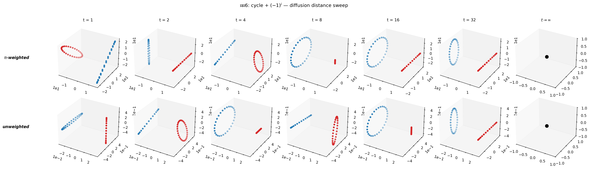
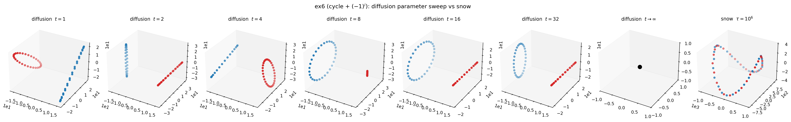
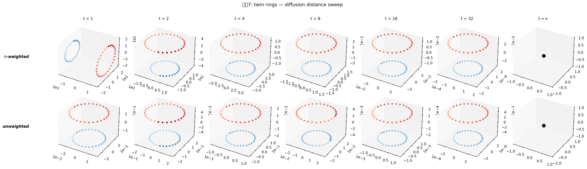
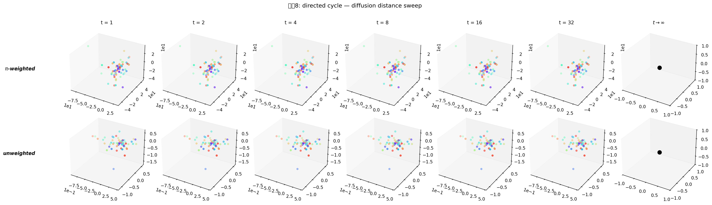

# 0. 동기

[선형결합 밖 embedding](260424_e45e10.html) 에서 $D^{G,\mathrm{diff}}$ 를 HST 의 $D^{\mathrm{HST}}$ 와 비교하는 기준으로 자주 썼다. 이때 드러난 질문들:

1. Diffusion distance 의 엄밀한 정의는? pyhst 의 기존 구현이 맞는가?
2. Diffusion 은 $t$ 파라미터, snow 는 $\tau$ 파라미터 — 둘은 같은 종류의 것인가?
3. $t \to \infty$, $\tau \to \infty$ 에서 각각 어떻게 거동하는가?
4. heterogeneous degree 그래프 (예제7 twin rings) 에서 diffusion 이 왜 물리적 scale 을 왜곡했는가?
5. 방향성 있는 그래프 (예제8 directed cycle) 에서 diffusion 은 왜 붕괴하는가?

본 포스트는 두 distance 를 **정의·파라미터·정보·극한** 네 관점에서 나란히 정리한다.

---

# 1. Diffusion distance — 정통 정의 (Coifman–Lafon 2006)

## 1.1 Setup

그래프 $\mathcal{G} = (V, W)$, $W \in \mathbb{R}_{\ge 0}^{n \times n}$ (대칭 또는 비대칭 허용).

**Row-stochastic transition matrix:**

$$P = D_{\mathrm{out}}^{-1} W, \qquad D_{\mathrm{out}} = \mathrm{diag}\!\left(\sum_j W_{ij}\right), \qquad P \mathbf{1} = \mathbf{1}.$$

**Stationary distribution** $\pi \in \Delta^{n-1}$:

$$\pi^\top P = \pi^\top, \qquad \pi_i > 0 \text{ (irreducible aperiodic 가정)}.$$

대칭 $W = W^\top$ 인 경우 $\pi_i = d_i / \sum_k d_k$ (reversible Markov).

## 1.2 정통 정의

$$\boxed{\; D_t^2(i, j) \;:=\; \sum_k \frac{\big(P^t_{ik} - P^t_{jk}\big)^2}{\pi_k} \;=\; \big\| P^t_i - P^t_j \big\|^2_{L^2(1/\pi)} \;}$$

**Spectral form** (reversible 경우, $P = \Psi \Lambda \Phi^\top$, $\lambda_0 = 1 > \lambda_1 \ge \cdots$):

$$D_t^2(i, j) = \sum_{\ell \ge 1} \lambda_\ell^{2t} \big(\psi_\ell(i) - \psi_\ell(j)\big)^2.$$

- trivial mode $\lambda_0 = 1$ 의 상수 eigenvector 는 모든 노드에서 같으므로 기여 0 → 자동 제외.
- $|\lambda_\ell| < 1$ 이므로 $t$ 증가 시 각 항이 $\lambda_\ell^{2t}$ 로 지수 감쇠. 큰 $t$ 에서 **고주파 모드가 먼저 죽고** 저주파 (= 큰 cluster scale) 만 남음.

## 1.3 $\pi$-가중 vs 비가중

두 변종:

- **$\pi$-가중** (정통): $\sum_k (P^t_{ik} - P^t_{jk})^2 / \pi_k$. $P$ 의 spectral 분해와 직교성 유지.
- **비가중** (plain $\ell^2$): $\sum_k (P^t_{ik} - P^t_{jk})^2$. 계산은 간단하지만 $\pi$ heterogeneous 할 때 $P^t$ 행 norm 이 편향되어 scale 왜곡.

**homogeneous graph** ($\pi_k = 1/n$ 상수) 에서는 두 버전이 상수배 차이. **heterogeneous** 에서는 질적으로 다름 ([선형결합 밖 embedding §5.2](260424_e45e10.html) 예제7 twin rings 에서 극적으로 드러남).

## 1.4 Limit 거동

| $t$ | $P^t$ | $D_t^2$ |
|---|---|---|
| $t = 0$ | $I$ | $(1/\pi_i + 1/\pi_j) - 2\cdot 0 = 1/\pi_i + 1/\pi_j$ (indicator pair) |
| small $t$ | 거의 $I$ + first-order mixing | **local** 이웃 구조 |
| moderate $t$ | 고주파 모드 감쇠 시작 | **global** cluster 구조 드러남 |
| $t \to \infty$ | $\mathbf{1}\pi^\top$ (rank-1) | **$\to 0$ degenerate** |

핵심: $D_t$ 는 유한한 ($t$ 의존) 최적 영역을 갖고, $t$ 가 너무 크면 정보가 **모두 소실**. "스케일 파라미터" 성격.

## 1.5 pyhst 구현

원본 2022 노트북은 scalar normalize + plain $\ell^2$ 의 heuristic 이었으나, 본 연구 과정에서 정통 Coifman–Lafon ($D^{-1} W$ row-stochastic + stationary $\pi$ power-iteration + $\pi$-가중/비가중 옵션) 으로 수정되었다. [pyhst/distances.py](../pyhst/distances.py) 참고.

---

# 2. Snow distance — HST ergodic accumulation

## 2.1 Snow dynamics

[HST 논문 기호정리](260407_XX.html) 에서 정리한 바:

- Walker $\{X_\ell\}$, 초기 $X_0 \sim \mathrm{initdist}$, 전이 $X_\ell \sim P$.
- Snow ground $h_v(\ell) \in \mathbb{R}$: 노드 $v$ 에 쌓인 **누적 신호**.
- 초기 $h_v(0) = f_v$ (신호).
- 매 $\ell$ 에서 **flow** (walker 가 downhill 로 이동) 이면 도착 노드에 $+b$ 적재, 그 외는 **block/reset** 규칙 (drift condition 하에서 ergodic).

## 2.2 Snow distance 정의

$$\boxed{\; \overline{SD}^2_{ij}(\tau) \;:=\; \frac{1}{\tau} \sum_{\ell = 1}^\tau \big(h_i(\ell) - h_j(\ell)\big)^2 \;}$$

즉 **시각 $0$ 부터 $\tau$ 까지의 snow ground 시간 sequence $\{h_v(\ell)\}$ 의 평균 제곱 차**. 각 노드의 "snow 높이 궤적" 을 함수로 보고 둘 사이의 $L^2$ 거리의 시간 평균.

## 2.3 Limit 거동

Drift condition (DC) 하에서 Harris 극한:

$$c_{ij} = \lim_{\tau \to \infty} \overline{SD}^2_{ij}(\tau) = \mathbb{E}_\pi\big[\big(\delta_i(X) - \delta_j(X)\big)^2\big] \cdot \text{(b·다변량 상수)}$$

(정확한 형태는 [260407 Main Theorem](260407_XX.html) 참고.)

| $\tau$ | $\overline{SD}^2_{ij}(\tau)$ |
|---|---|
| $\tau = 0$ | $(f_i - f_j)^2 = D^E_{ij}$ (Euclidean) |
| small $\tau$ | $D^E$ 근처 |
| moderate $\tau$ | $D^E$ 와 $D^G$ 사이 비가환 interpolation |
| $\tau \to \infty$ | $D^G_{ij}$ (**비자명** Harris 극한) |

핵심: $\tau \to \infty$ 에서 **degenerate 하지 않고 의미있는 극한에 수렴**. 이것이 diffusion 의 parameter 거동과 가장 큰 차이.

---

# 3. 파라미터 비교 — $t$ vs $\tau$

| | diffusion $t$ | snow $\tau$ |
|---|---|---|
| 수학적 연산 | $P^t$ (matrix power) | time average $\frac{1}{\tau} \sum_{\ell=1}^\tau \cdots$ |
| 계산 | deterministic | stochastic (random walk 시뮬) |
| 신호 $f$ 사용 | **무관** | **필수** (초기 ground) |
| $= 0$ | indicator: $1/\pi_i + 1/\pi_j$ | $D^E$ |
| small → moderate | local → global 구조 | $D^E$ 에서 이탈 시작 |
| $\to \infty$ | $\mathbf{0}$ (degenerate) | $D^G$ (Harris 극한, 비자명) |
| 최적 $^*$ | 문제 의존 (너무 크면 정보 소실) | $\tau^*$ deviation 최대 (편차분석) |
| 정보 구조 | rank deflation (고주파 제거) | ergodic averaging |

두 파라미터는 "시간" 이라는 공통 어휘로 표현되지만:

- $t$ 는 **스케일 선택** — 어느 주파수까지 볼 것인가. 너무 크면 정보가 균일화되어 사라진다.
- $\tau$ 는 **추정 정밀도** — 얼마나 오래 걸어서 ergodic 평균을 채울 것인가. 클수록 좋다 (asymptotically exact).

---

# 4. 구조 비교 — 정보 내용

| | diffusion | snow |
|---|---|---|
| 신호 포함 | ✗ | ✓ |
| 방향성 ($W \ne W^\top$) | 대칭화 → 정보 소실 | random walk 에 자연 반영 |
| heterogeneous degree | weighting 선택 결정적 | 자동 |
| spectral interpretation | $P$ 의 eigenmode 제거 | walker 의 hitting time 통계 |
| symmetry (distance 공리) | 대칭 강제 | stochastic, $\tau \to \infty$ 에 대칭 |

---

# 5. 실증 — diffusion sweep

[선형결합 밖 embedding §5](260424_e45e10.html) 에서 수행한 sweep 을 재인용 (3개 예제, $t \in \{1, 2, 4, 8, 16, 32\}$, $\pi$-가중/비가중).

## 5.1 예제6 — homogeneous cycle + $(-1)^i$

- $t$ 에 따라 **구조 완전 뒤바뀜**: $t=1$ 두 parity 원 분리 → $t=8$ 한 원 융합 → $t=32$ 선형 붕괴.
- $\pi$-가중/비가중 차이 거의 없음 (homogeneous).
- **diffusion 은 $t$ hyperparameter 에 극도로 민감**; 최적 $t$ 없이 쓰면 임의 구조 보게 됨.

### 5.1.1 어떤 $t$ 도 snow 를 모방하지 못한다

동일 $W, f$ 에서 **diffusion 의 여러 $t$** 와 **snow ($\tau = 10^6$)** 를 한 줄에 놓고 비교:

코드: `260425_예제6_diffusion_param.py`. Euclidean 은 뻔해서 제외. 관찰:

| $t$ | diffusion shape |
|---|---|
| $1$ | 한 parity = 원, 다른 parity = 선 (비대칭 transient) |
| $2$ | 위 과도기가 뒤집힌 상태 |
| $4$ | 두 원이 접근, 비대칭 여전 |
| $8$ | 두 원이 원 하나로 융합 (color interleave) |
| $16$ | 완전 융합된 원 |
| $32$ | 선형 붕괴 시작 |

snow ($\tau = 10^6$) 는 **두 parity class 가 각자 따로 곡선을 그리는** $\mathbb{Z}_2$-cover 형태. 이는 diffusion 의 어떤 $t$ 단일 값과도 다르다:

- $t=1, 2, 4$ 의 "한쪽 parity 는 선으로 짜부라진" 비대칭 transient 가 **아님**.
- $t=8, 16$ 의 "두 parity 가 한 원 안에서 interleave" 하는 융합 상태도 **아님**.
- 두 parity 의 **고유 구조가 각자 살아있으면서** 서로 교차하는 형태 — rank-2 outer product 구조.

즉 diffusion 의 parameter 공간 전체에 걸쳐 snow 와 등가인 점이 없음. 이것이 [선형결합 밖 embedding §1](260424_e45e10.html) 의 "rank-2 sum 으로 복제 불가한 rank-2 product" 주장의 **시각적 증거**.

## 5.2 예제7 — twin rings (heterogeneous)

- $\pi$-가중 (위): 균형 잡힌 동심원.
- 비가중 (아래): outer ring scale 축소 artefact.
- **heterogeneous 에선 weighting 선택이 본질적**.

## 5.3 예제8 — directed cycle

- 모든 $t$, 두 mode 에서 **blob**. shift matrix $P^t$ 가 permutation 이라 모든 non-diagonal 쌍 거리 동일 → **diffusion 은 방향성 정보에 원천 접근 불가**.
- Snow distance 는 동일 setup 에서 깨끗한 U-curve 생성 ([선형결합 밖 embedding §3](260424_e45e10.html)).

---

# 6. 결론

**두 distance 는 다른 종류의 정보를 담는다.**

- **Diffusion**: 그래프의 **smoothing kernel**. 신호와 무관. scale 파라미터 $t$ 의 조정 필요. $t$ 무한대에서 degenerate. 대칭 graph 에 적합.
- **Snow**: 공간 × 신호 × 시간의 **비가환 convolution**. 신호 사용. $\tau$ 무한대에서 비자명 Harris 극한. 방향성·heterogeneous 에 자연.

특히 snow distance 의 **Harris 수렴** 은 (1) $\tau$ hyperparameter 튜닝 부담 완화, (2) 방향성 그래프에서 유일하게 작동, (3) 신호·구조의 cross term 을 내재적으로 인코딩 — 세 측면에서 diffusion 의 한계를 보완한다.

실용적으로는:

| 상황 | 권장 |
|---|---|
| 대칭 homogeneous graph, smoothing 만 필요 | diffusion ($t$ 적당 튜닝) |
| heterogeneous degree | diffusion 쓴다면 $\pi$-가중 필수 |
| 방향성 그래프 | diffusion 사용 불가 → **snow 필수** |
| 신호까지 함께 encode 하고 싶음 | **snow** |
| 스케일-독립 극한이 필요 | **snow (Harris)** |

---

# 7. 다음 단계

- 예제6, 7, 8 에서 snow $\tau$ sweep ($\tau \in \{10^3, 10^4, 10^5, 10^6\}$) 도 돌려 diffusion $t$ sweep 과 직접 비교 figure.
- Harris 극한 수렴 속도 정량화: $\|\overline{SD}^2(\tau) - c\|_F$ 의 $\tau$ 의존성.
- Spectral 관점에서 snow 의 근사 — random walk 의 $\tau$-부분합을 $P$ 의 resolvent $(I - \lambda P)^{-1}$ 와 연관 짓는 시도.
