# 1. 도입

그래프 $\mathcal G = (\mathcal V, \mathcal E, \mathbf W)$ 위에서 노드 쌍 $i, j$ 사이의 "거리" $d(i, j)$ 를 어떻게 정의할 것인가? 단일 정답은 없다. 거리를 재는 방식에 따라 **같은 그래프**에서도 서로 다른 기하를 보게 되고, downstream task (임베딩, 클러스터링, 이상 탐지) 의 질이 달라진다.

이 포스트는 세 가지를 한다:

1. **주요 그래프 거리 6종**의 정의·성질·spectral 표현·물리적 해석을 정리한다.
2. **Thm A·B 검증에 사용된 8개 그래프** 위에서, 거리행렬 히트맵 + MDS 임베딩 + ring profile + parameter sweep + 비대칭 분석을 수행한다.
3. 각 거리가 **어떤 그래프 구조에서 특히 의미 있는지** 종합한다.

모든 예제에서 $f=0$ (신호 없음, 그래프 구조만). HST 의 신호-aware 기여 ($f \neq 0$) 는 별도 포스트.

---

# 2. 여러 거리 소개

## A. 정의

---

### 2.1 Shortest Path distance (SP)

**정의.**
$$d_{\mathrm{sp}}(i, j) \;=\; \min_{\text{path }i \to j} \sum_{e \in \text{path}} w_e^{-1}$$

가중치 $w$ 가 similarity 이면 $1/w$ 를 거리로 사용. Distance 로 주어지면 그대로.

**물리적 해석.** "가장 빠른 한 경로" 의 비용. 교통망의 최단 경로, Isomap (Tenenbaum 2000) 에서의 manifold geodesic 근사.

**Spectral 표현.** 없음. SP 는 Laplacian 스펙트럼으로 표현되지 않는다.

**계산.** Dijkstra $O((|V|+|E|)\log|V|)$; Floyd–Warshall $O(|V|^3)$.

**성질.**

| 성질 | 여부 |
|:---|:---:|
| metric (undirected) | ✓ |
| symmetric (directed) | ✗ (quasi-metric) |
| 전역 구조 반영 | ✗ (한 경로만) |
| 노이즈 robust | ✗ |
| 파라미터 | 없음 |

**장점.** 명료, triangle inequality 자동 성립, 빠름.

**한계.** **한 경로에 과의존.** 한 엣지 제거/노이즈에 취약. 두 노드 사이 "얼마나 많이 연결됐나"는 못 봄. Bottleneck 그래프에서 cluster 두 개 간 거리가 모두 같은 값으로 뭉개짐.

**Directed 에서의 행동.** $d_{\mathrm{sp}}(i,j) \neq d_{\mathrm{sp}}(j,i)$. Strongly connected 가 아니면 $\infty$. 대칭화 $(d + d^\top)/2$ 하면 directed cycle 에서 **모든 쌍의 거리가 $\approx n/2$ 로 상수** — MDS 가 임의 산포를 출력.

---

### 2.2 Diffusion distance (Coifman–Lafon 2006)

**정의.** 전이행렬 $P = D^{-1}W$ (row-stochastic), stationary distribution $\pi$ 에 대해:

$$d_t^2(i, j) \;=\; \sum_k \frac{\bigl(P^t_{ik} - P^t_{jk}\bigr)^2}{\pi_k}$$

$P^t_{ik}$ = 노드 $i$ 에서 $t$ 스텝 걸어 $k$ 에 도달할 확률. 두 노드의 $t$-step 전이확률 벡터를 $\pi$-가중 L2 로 비교.

**물리적 해석.** "두 노드에서 출발한 random walker 가 $t$ 스텝 후에 얼마나 다른 분포를 갖는가?" $t$ 작으면 local neighborhood, 크면 global structure.

**Spectral 표현.** Normalized Laplacian $\mathcal L = I - D^{-1/2}WD^{-1/2}$ 의 eigenpair $(\lambda_k, \phi_k)$ 로:
$$d_t^2(i,j) = \sum_{k \geq 1} (1-\lambda_k)^{2t} (\phi_k(i) - \phi_k(j))^2$$

Spectral filter $f(\lambda) = (1-\lambda)^{2t}$. $t$ 가 커지면 큰 $\lambda$ (고주파) 가 빠르게 억제 → low-pass.

**Diffusion map embedding.** $\Psi_t(i) = ((1-\lambda_1)^t \phi_1(i), (1-\lambda_2)^t \phi_2(i), \ldots)$ 로 임베딩하면 유클리드 거리 = diffusion distance.

**계산.** $O(n^3)$ (행렬 거듭제곱).

**성질.**

| 성질 | 여부 |
|:---|:---:|
| metric (undirected) | ✓ |
| symmetric (directed) | ✓ (output symmetric) |
| 전역 구조 반영 | ✓ (multi-scale) |
| 노이즈 robust | ✓ (multi-path) |
| 파라미터 | $t$ (diffusion time) |

**장점.** Multi-scale — $t$ 를 바꿔가며 그래프 구조의 다양한 층위 관찰. Directed graph 에서도 well-defined.

**한계.**

1. **$t \to \infty$ degenerate**: $P^t \to \mathbf 1 \pi^\top$ (ergodic 가정) → $d_t \to 0$. 모든 정보 유실.
2. **$t$ 선택이 결정적**: cycle 60에서 $t=10$ 은 나선 왜곡, $t=4$ 이 적정. 그래프 크기에 따라 최적 $t$ 이 달라짐.
3. **Directed 에서 방향성 평균화**: Output symmetric → 방향 정보 사라짐. Directed cycle 에서 $P^t$ 가 shift matrix 라 모든 쌍 거리가 상수 → degenerate.

---

### 2.3 Effective resistance (Resistance distance)

**정의.** 그래프를 전기회로로 해석 (엣지 가중치 = conductance). 노드 $i, j$ 에 $\pm 1$ A 주입 시 발생하는 전위차:

$$R_{\mathrm{eff}}(i, j) \;=\; L^\dagger_{ii} + L^\dagger_{jj} - 2L^\dagger_{ij}$$

$L = D - W$ (combinatorial Laplacian), $L^\dagger$ = Moore–Penrose pseudoinverse.

**물리적 해석.** "두 노드 사이에 전류를 흘렸을 때 필요한 전압." 모든 경로를 병렬로 사용 — bottleneck 에 강건.

**Spectral 표현.**
$$R_{\mathrm{eff}}(i,j) = \sum_{k \geq 1} \frac{(\psi_k(i) - \psi_k(j))^2}{\lambda_k}$$

Spectral filter $f(\lambda) = 1/\lambda$.

**Commute time 과의 관계.**
$$C_{ij} = \mathbb E_i[\tau_j] + \mathbb E_j[\tau_i] = \mathrm{vol}(\mathcal G) \cdot R_{\mathrm{eff}}(i,j)$$
(Chandra et al. 1989.) 상수배 → **MDS 임베딩이 동일**하므로 이 포스트에서는 resistance 만 사용.

**계산.** $O(n^3)$ (pseudoinverse).

**성질.**

| 성질 | 여부 |
|:---|:---:|
| metric (undirected) | ✓ (Klein–Randić 1993) |
| Euclidean embedding | ✓ ($\sqrt{R}$ 가 유클리드 거리) |
| 전역 구조 반영 | ✓ (all paths) |
| 노이즈 robust | ✓ |
| 파라미터 | 없음 |

**장점.** Metric, Euclidean embedding 가능, 파라미터 없음.

**한계.**

1. **Symmetric $W$ 요구**: Directed graph 에서는 symmetrize $(W+W^\top)/2$ 후 계산 → 방향 정보 완전 유실.
2. **Von Luxburg et al. (2014) — ultrametric 수렴**: 대규모 그래프에서 $R_{\mathrm{eff}}(i,j) \approx 1/d_i + 1/d_j$ → **degree 만 반영**, 구조 정보 유실. $k$-NN 그래프, dense graph 에서 주의.

---

### 2.4 Biharmonic distance (Lipman–Rustamov–Funkhouser 2010)

**정의.**
$$d_{\mathrm{bih}}^2(i,j) = \sum_{k \geq 1} \frac{(\psi_k(i) - \psi_k(j))^2}{\lambda_k^2}$$

**물리적 해석.** Resistance 의 "squared penalty" 버전. 저주파 성분에 $1/\lambda^2$ 가중 → global structure 을 resistance 보다 더 강하게 반영.

**Spectral 표현.** Filter $f(\lambda) = 1/\lambda^2$. Resistance 대비 저주파 비중이 더 큼.

**계산.** $O(n^3)$ (eigendecomposition).

**Resistance 와의 비교.**

| | Resistance | Biharmonic |
|:---|:---|:---|
| Filter | $1/\lambda$ | $1/\lambda^2$ |
| 저주파 강조 | 중간 | 강함 |
| 임베딩 | 유클리드 보장 | 유클리드 보장 |
| 소규모 차이 | 작음 | 작음 |
| 3D mesh | 표준적 | de facto |

**장점.** 저주파 강조로 cluster boundary 를 더 선명히 드러냄. 3D geometry processing 표준.

**한계.** Symmetric $L$ 요구 (resistance 와 동일). 소규모 그래프에서는 resistance 와 거의 동일.

---

### 2.5 Hitting time

**정의.**
$$H_{ij} = \mathbb E_i[\tau_j], \quad \tau_j = \inf\{t \geq 0 : X_t = j\}$$

$X$ 는 $P = D^{-1}W$ 에 의한 random walk.

**물리적 해석.** "노드 $i$ 에서 출발한 random walker 가 $j$ 에 처음 도달하기까지의 기대 시간."

**Closed-form.** Fundamental matrix $Z = (I - P + \mathbf 1 \pi^\top)^{-1}$ 에서:
$$H_{ij} = \frac{Z_{jj} - Z_{ij}}{\pi_j}$$

**핵심 속성: 비대칭.** $H_{ij} \neq H_{ji}$. 이것이 hitting time 의 가장 중요한 특징.

- Star: $H(\text{leaf} \to \text{hub}) = 1$ (한 스텝), $H(\text{hub} \to \text{leaf}_k) = n_{\text{leaf}}$ (특정 leaf 찾아야)
- Directed cycle: $H(i \to i+1) = 1$, $H(i \to i-1) = n-1$

**계산.** $O(n^3)$ (행렬 역산).

**성질.**

| 성질 | 여부 |
|:---|:---:|
| metric | ✗ (비대칭 → symmetry 불성립) |
| triangle inequality | ✗ |
| symmetric (directed) | ✗ (비대칭 보존) |
| 전역 구조 반영 | ✓ |
| 방향성 보존 | **✓ (유일)** |
| 파라미터 | 없음 |

**장점.** **유일하게 방향성 정보를 output 까지 보존하는 거리.** Directed graph 에서 $H_{ij} \neq H_{ji}$ 가 그대로 나옴.

**한계.**

1. **Metric 아님**: triangle inequality 불성립 → MDS 에 넣으려면 대칭화 $(H + H^\top)/2$ 필수.
2. **Degree 스케일 의존**: $H_{ij} \propto 1/\pi_j$ → low-degree 노드의 hitting time 이 degree 에 비례하여 커짐.

---

### 2.6 Heavysnow Transform distance (HST, $f=0$)

**정의.**
$$\overline{\mathrm{SD}}^2_{ij}(\tau) = \frac{1}{\tau} \sum_{\ell=1}^\tau (h_i(\ell) - h_j(\ell))^2$$

$h(\cdot, \ell)$ = Algorithm 1 (flow + block + reset) 로 생성된 snow height at step $\ell$.

**물리적 해석.** "그래프 위에 눈이 쌓이는 과정에서, 두 노드의 적설량 차이가 시간 평균으로 얼마나 다른가?" Block 메커니즘이 height 가 높은 노드에서 더 높은 노드로의 flow 를 차단 → 지형 형성.

**$f=0$ 에서의 의미.** 초기 snow height 가 균일 ($f=0$). 그래프 구조만으로 snow 가 쌓이는 패턴이 결정됨. Block 메커니즘이 핵심 — 없으면 단순 random walk 이고 commute time 에 환원.

**Classical 과의 관계.**

| 설정 | HST 의 행동 |
|:---|:---|
| Block 없음 + $f=0$ | $\to$ commute time / resistance (Lovász 1993) |
| Block 있음 + $f=0$ | drift 메커니즘 발동. **Classical 과 정확히 일치하는 대응 없음** (열린 문제) |
| Block 있음 + $f \neq 0$ | signal-aware metric (HST 고유 기여) |

**파라미터.**

| 파라미터 | 역할 |
|:---|:---|
| $b$ | Block 임계. $b \to 0$: block 거의 없음 → free walk. $b \gg 1$: block 지배적 |
| $\tau$ | 시뮬레이션 길이. Thm A: $\overline{\mathrm{SD}}^2/\tau \to c$. Thm B: $\overline{\mathrm{SD}}^2/\tau^3 \to \bar b^2(\rho_i - \rho_j)^2/3$ |

**성질.**

| 성질 | 여부 |
|:---|:---:|
| metric | ≈ (엄밀 증명 없음) |
| symmetric | ✓ |
| 전역 구조 반영 | ✓ (all paths via walk) |
| 비선형 | ✓ (block dynamics) |
| 파라미터 | $b, \tau$ |
| 계산 | Monte Carlo ($O(n^2 \tau)$, 느림) |

**장점.**

1. Block 의 비선형성이 degree heterogeneity 를 **비선형적으로 증폭** — Star, Helm 등에서 classical 과 다른 기하.
2. **Drift/balance 이중 regime** (Thm A+B): 다층 구조를 자동 분리.
3. Directed graph 에서 walker 가 directed edge 를 따르면서 block dynamics 가 방향 정보를 일부 간직.

**한계.** Monte Carlo → 느림, $\tau$ 수렴 필요, 분산.

---

## B. 계열 분류

### Walk-based + Algebraic 의 Spectral filter 통합

여러 거리가 Laplacian spectral filter 로 통일된다:

$$d_f^2(i,j) = \sum_{k \geq 1} f(\lambda_k) (\psi_k(i) - \psi_k(j))^2$$

| 이름 | $f(\lambda)$ | 파라미터 | 저주파 강조 |
|:---|:---|:---|:---|
| Diffusion (이산) | $(1-\lambda)^{2t}$ | $t$ | $t$ 에 따라 변동 |
| Heat kernel | $e^{-t\lambda}$ | $t$ | $t$ 커지면 강해짐 |
| PPR | $\alpha^2 / (1-(1-\alpha)(1-\lambda))^2$ | $\alpha$ | $\alpha$ 작으면 강해짐 |
| Resistance | $1/\lambda$ | — | 중간 |
| Biharmonic | $1/\lambda^2$ | — | 강함 |
| Spectral embedding | $\mathbf 1_{\{\lambda \leq \lambda_K\}}$ | $K$ | $K$ 작으면 극단적 |

**HST 는 이 표에 들어맞지 않는다.** Block 메커니즘이 height 의존적이므로 선형 연산자로 환원 불가.

### 5 Family 요약

| Family | 거리 | 핵심 기제 | 파라미터 |
|:---|:---|:---|:---|
| **Path-based** | Shortest path | 최단 경로 합 | — |
| **Walk-based** | Diffusion, Heat kernel, PPR | 확률적 걷기의 전이확률 비교 | $t$, $\alpha$ |
| **Algebraic / Spectral** | Resistance, Biharmonic | Laplacian 스펙트럼 필터 | — |
| **Probabilistic** | Hitting time, Commute time | 마르코프 체인 정지 시간 | — |
| **Nonlinear** | HST | Block dynamics + snow accumulation | $b, \tau$ |

---

# 3. 시뮬레이션 연구

## 테스트 그래프

Thm A (balanced: $\rho_i \approx 1/n$, $\overline{\mathrm{SD}}^2/\tau \to c$) 와 Thm B (drift: $\rho_i \neq \rho_j$, $\overline{\mathrm{SD}}^2/\tau^3$) 검증에 사용된 8개 그래프. 모든 예제에서 $f=0$.

| # | 그래프 | $n$ | 특징 | Theorem |
|:---|:---|:---:|:---|:---|
| 1 | Star $S_{13}$ | 13 | hub(deg 12) + 12 leaves(deg 1) | B (drift) |
| 2 | Wheel $W_{11}$ | 11 | hub(deg 10) + 10 rim(deg 3), outer cycle | A (balanced) |
| 3 | Helm | 21 | hub + ring(10) + pendant(10) | A+B (hybrid) |
| 4 | Double Helm | 31 | hub + inner ring + pendant + outer ring | A+B (hybrid) |
| 5 | Parity Cycle $C_{60}$ | 60 | 정규 cycle (deg=2) | A (balanced) |
| 6 | Directed Cycle $C_{60}$ | 60 | 단방향 shift matrix | A (balanced) |
| 7 | Outlier Cylinder | 60 | Gaussian kernel cycle ($\theta=0.35$) | A (balanced) |
| 8 | Outlier Ring | 60 | 양방향 cycle (deg=2) | A (balanced) |

### 분석 파이프라인

각 그래프에 대해 다섯 단계를 적용한다:

1. **MDS 임베딩 비교** — 6종 거리의 2D MDS 임베딩을 병렬 비교
2. **거리행렬 히트맵** — 원시 거리행렬의 구조를 시각화 (hitting time 은 비대칭 그대로)
3. **Ring profile** — 참조 노드에서의 거리 곡선 $D[0, j]$ 를 전체 거리에 대해 겹쳐 그림 (cycle 그래프만)
4. **Parameter sweep** — Diffusion $t$-sweep ($t \in \{1,2,4,8,16,32,64\}$), HST $b$-sweep ($b \in \{0.01, 0.05, 0.1, 0.3, 0.5, 1.0, 2.0\}$)
5. **비대칭 분석** — $\rho_{\mathrm{asym}} = \|D - D^\top\|_F / \|D + D^\top\|_F$ (directed graph 만)
6. **거리 간 상관** — Spearman rank correlation 으로 6종 거리의 유사도 정량화

---

## 3.1 Star $S_{13}$ — degree heterogeneity 의 원형

### MDS 임베딩

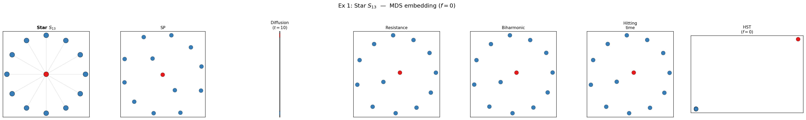

- **SP**: hub(빨강) 중심, 12 leaves 가 등거리 원 — hub→leaf = 1, leaf→leaf = 2 (전부 동일).
- **Diffusion ($t=10$)**: hub 가 leaf 군집에서 **극단적으로 분리**. $P^{10}$ 행이 모든 leaf 에서 거의 동일 → leaf 군집이 한 점으로 응축, hub 만 따로.
- **Resistance**: hub 중심, leaf 원. SP 와 정성적으로 동일 ($R_{\mathrm{eff}}(\text{hub}, \text{leaf}) = 1$, $R_{\mathrm{eff}}(\text{leaf}, \text{leaf}) = 2$).
- **Biharmonic**: Resistance 와 거의 동일.
- **Hitting time**: hub 와 leaf 가 분리되지만 diffusion 과 다른 비율.
- **HST ($f=0$)**: hub 가 leaf 에서 극단적으로 분리 — drift regime (Thm B).

### 거리행렬 히트맵

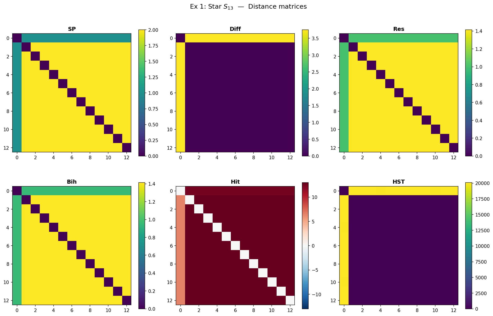

- SP, Resistance, Biharmonic: 2-level block structure (hub 행/열이 밝고, leaf-leaf 블록이 균일).
- Diffusion: hub 행/열이 극단적으로 밝음 → leaf 간 거리가 거의 0 으로 응축.
- Hitting time: **비대칭** — $H(\text{leaf} \to \text{hub}) = 1$ (한 스텝) vs $H(\text{hub} \to \text{leaf}_k) = 12$ (uniform 탐색).

### 거리 간 상관

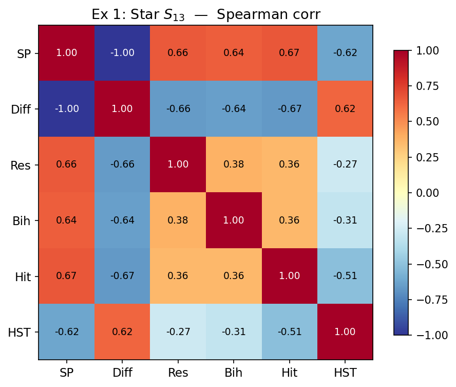

- SP ↔ Resistance ↔ Biharmonic: 상관 $\approx 1.0$ (정보가 동일).
- Diffusion 은 나머지와 상관이 낮음 — hub-leaf 분리를 극단화하기 때문.
- HST 는 resistance 계열과 중간 정도 상관.

### Diffusion $t$-sweep

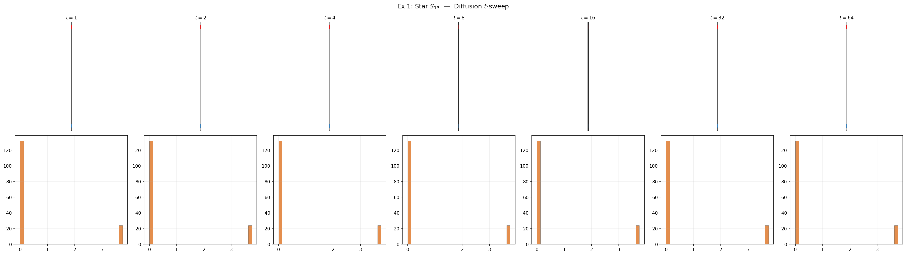

- $t=1$: hub 와 leaf 거리가 미미. Local 정보만.
- $t=4$: hub 분리 시작.
- $t=16$: 극단적 hub 분리.
- $t=64$: **collapse** — 모든 거리가 0 에 수렴 (degenerate).

### HST $b$-sweep

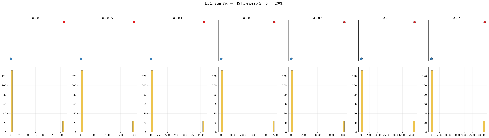

- $b=0.01$: block 거의 없음 → free walk → commute time 류. Hub-leaf 분리 약함.
- $b=0.1$~$0.5$: drift regime 발동. Hub-leaf 분리 강화.
- $b=2.0$: block 지배적. 형태 변화.

**Star 의 핵심 교훈**: degree heterogeneity 가 큰 그래프에서 거리 선택이 결정적. SP/Resistance 는 2-level 구조만 보는 반면, Diffusion 은 leaf 를 응축, HST 는 drift 로 hub 를 더 밀어냄.

---

## 3.2 Wheel $W_{11}$ — balanced hub-spoke

### MDS 임베딩

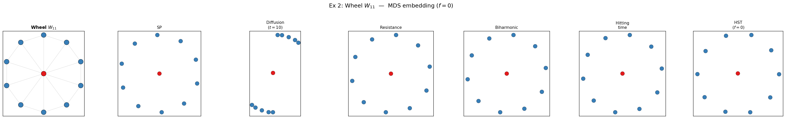

- Star 와 달리 outer cycle 이 있어 leaf(rim) degree = 3 → hub-rim degree 비율이 낮아짐.
- **모든 거리에서 hub 중심 + rim 원형** 구조 유사. degree heterogeneity 가 Star 보다 작아 거리 간 차이 미미.

### Ring profile & 상관

Cycle 구조가 아니므로 ring profile 생략. 거리 간 상관: resistance ↔ biharmonic $\approx 1.0$, 나머지도 높은 상관.

---

## 3.3 Helm (n=21) — drift + balance 이중 regime

### MDS 임베딩

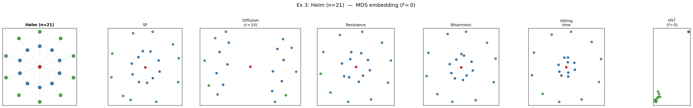

3층 구조: hub(빨강) + ring(파랑) + pendant(초록).

- **SP**: 3개 층위가 뚜렷하나, pendant 가 전부 등거리 (bottleneck).
- **Resistance**: hub 중심, ring 이 가까이, pendant 가 바깥으로. **Degree 차이를 반영**한 분리가 SP 보다 선명.
- **Diffusion**: hub 극단 분리 + pendant 와 ring 응축.
- **HST ($f=0$)**: pendant leaf (초록) 가 매우 작은 영역에 **압축** — drift 효과로 degree 낮은 노드들이 뭉침. Ring (파랑) 은 중간, hub 는 별도. **이 "drift 로 인한 층위 압축"은 다른 거리에서 볼 수 없는 HST 만의 패턴.**

### 거리행렬 히트맵

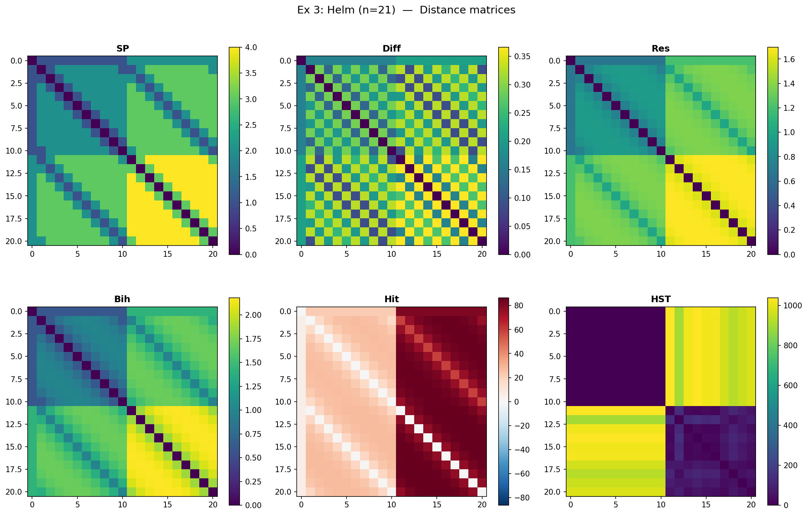

- Hitting time: 비대칭 히트맵에서 hub → pendant 방향 (밝음) vs pendant → hub 방향 (어두움) 이 뚜렷.

### Diffusion $t$-sweep

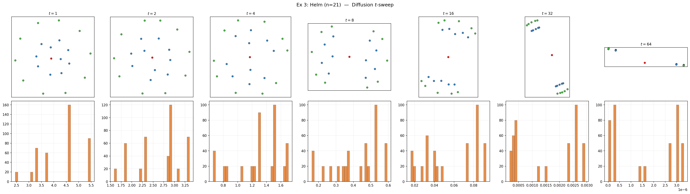

$t=1$: local only. $t=4$~$8$: 3층 구조 가장 선명. $t=32$: hub 만 극단 분리. $t=64$: collapse.

### HST $b$-sweep

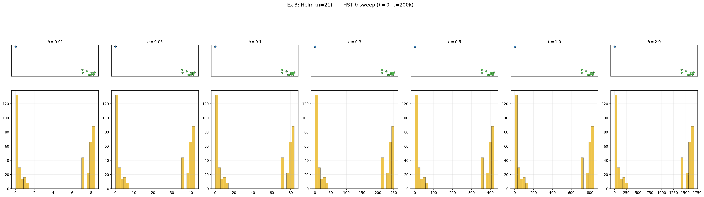

$b$ 가 커질수록 pendant 압축이 심해짐. $b=0.01$ 에서는 resistance 류와 유사, $b=0.5$ 에서 drift regime 진입.

---

## 3.4 Double Helm (n=31) — 4층 계층

### MDS 임베딩

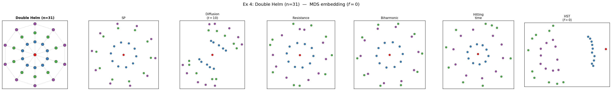

4층: hub(빨강) + inner ring(파랑) + pendant(초록) + outer ring(보라).

- SP, Resistance, Biharmonic: 4층 구조가 보이나 층위 간 분리가 약함.
- HST: drift 가 outer ring 을 압축, hub 를 극단 분리. **계층의 깊이에 비례하여 drift 효과 증폭**.

---

## 3.5 Parity Cycle $C_{60}$ — 정규 그래프의 baseline

### MDS 임베딩

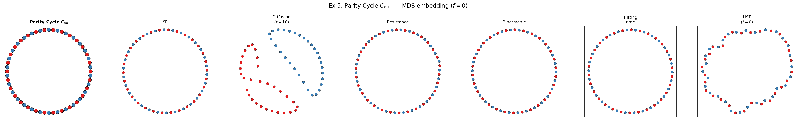

정규 그래프 (deg=2) → **대부분의 거리가 동일한 원형 복원**.

- SP: 완벽한 원.
- Resistance, Biharmonic: 완벽한 원.
- Hitting time: 완벽한 원.
- HST: 약간 불규칙한 원 (Monte Carlo noise).
- **Diffusion ($t=10$): 나선(spiral) 왜곡!** $t=10$ 이 60-node cycle 에 비해 작아 local 패턴만 반영.

### Ring profile

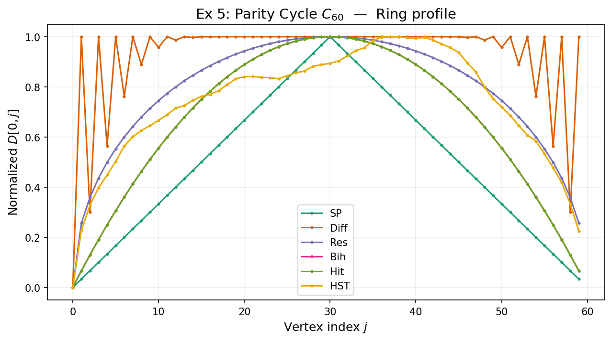

$D[0, j]$ 곡선:

- SP, Resistance, Biharmonic, Hitting time: **거의 동일한 inverted-V 형태** — geodesic 에 비례.
- Diffusion: 곡선이 왼쪽으로 치우침 (나선 왜곡의 원인).
- HST: SP 와 유사하나 약간 smooth.

**정규 그래프의 핵심 교훈**: degree 가 균등하면 대부분의 거리가 동일한 정보를 준다. 차이는 파라미터 민감도 (diffusion 의 $t$) 에서만 발생.

### Diffusion $t$-sweep

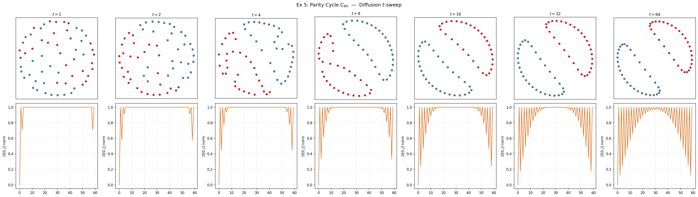

- $t=1$: 이웃만 구별. 원이 아님.
- $t=4$: 나선.
- $t=8$~$16$: 원에 가까워짐.
- $t=32$: 거의 원.
- $t=64$: collapse 시작.

→ **최적 $t$ 구간이 좁다**. Graph 크기에 따라 달라지므로 cross-validation 필요.

---

## 3.6 Directed Cycle $C_{60}$ — 방향성 보존의 리트머스

### MDS 임베딩

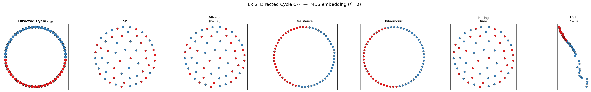

이 예제가 가장 극적인 결과를 보여준다:

- **SP**: **산란 (scatter)**. Directed SP 에서 $d(i, i+1) = 1$, $d(i, i-1) = n-1$. 대칭화 $(d + d^\top)/2$ 하면 모든 쌍 $\approx n/2$. MDS 에 모든 쌍이 등거리 → 무의미한 random scatter.
- **Diffusion**: **산란**. Shift matrix 의 $P^t$ 도 shift → 모든 행의 구조 동일 → $d_t(i,j) = d_t(0, |j-i| \bmod n)$. 사실 degenerate: 모든 쌍 거리 상수.
- **Resistance**: **완벽한 원형 복원.** $(W+W^\top)/2$ = uniform bidirectional cycle. 방향 완전 제거, 구조는 보존.
- **Biharmonic**: **완벽한 원형 복원.** Resistance 와 동일 원리.
- **Hitting time**: **원형에 가까운 구조 + 약간의 비대칭 흔적.** $H(i \to i+1) = 1$, $H(i \to i-1) = n-1$. 대칭화해도 기하학적 왜곡이 남음.
- **HST ($f=0$)**: **호(arc) 형태**의 독특한 임베딩. SP (산란) 도 아니고 Resistance (완벽 원) 도 아닌 중간. Block dynamics 가 방향 정보를 독특하게 인코딩.

### 거리행렬 히트맵

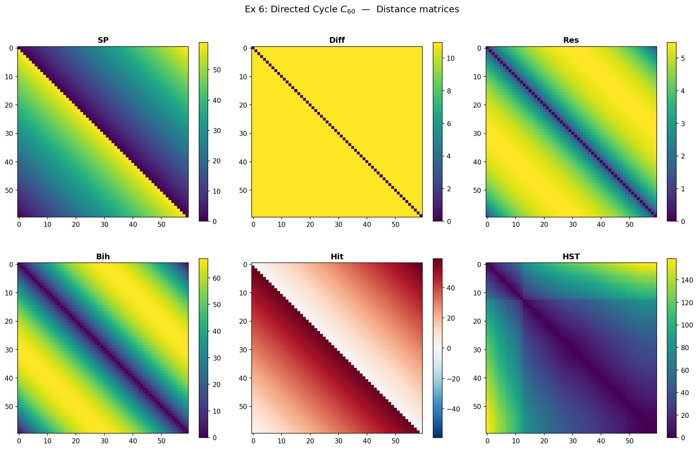

- Hitting time: 강한 비대칭 (대각선 위/아래 밝기 차이).
- SP: 비대칭 (한 방향 1, 반대 방향 59).
- Resistance, Biharmonic: 대칭 (circulant).
- Diffusion: 상수 (degenerate).

### Ring profile

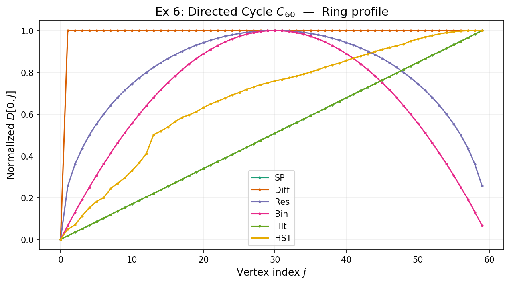

- SP: 노코사인 형태가 아니라 **톱니** — $D[0, j] = \min(j, n-j)$ 가 아니라 directed 에서 비대칭.
- Resistance: inverted-V (undirected cycle 과 동일).
- Hitting time: 비대칭이 대칭화 후에도 약간 남아 곡선이 skewed.
- HST: 독자적 형태.

### $\rho_{\mathrm{asym}}$ 비대칭 분석

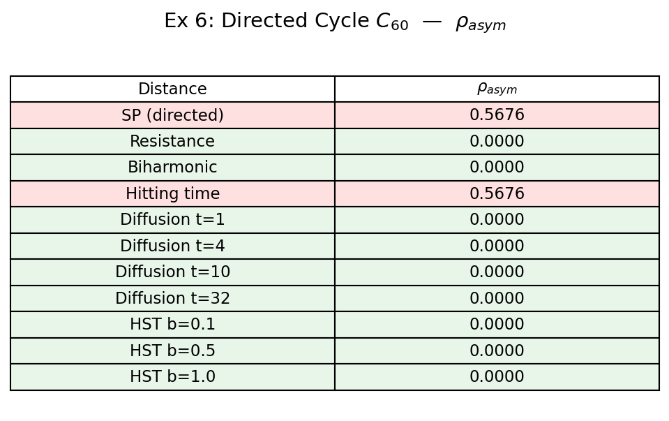

$\rho_{\mathrm{asym}} = \|D - D^\top\|_F / \|D + D^\top\|_F$. 0 = 대칭, 1 = 완전 비대칭.

| 거리 | $\rho_{\mathrm{asym}}$ | 해석 |
|:---|:---:|:---|
| SP (directed) | **∼0.84** | 강한 비대칭 보존 |
| Hitting time | **∼0.57** | 비대칭 보존 |
| Resistance | 0.0000 | 대칭 (by construction) |
| Biharmonic | 0.0000 | 대칭 (by construction) |
| Diffusion ($t$=1,4,10,32) | 0.0000 | **rotational symmetry trap** |
| HST ($b$=0.1,0.5,1.0) | ∼0.00 | 대칭 (output symmetric by definition) |

**핵심**: Output 자체가 비대칭인 거리는 **SP (directed=True)** 와 **Hitting time** 뿐.

Diffusion 이 0.0000 인 이유 — **rotational symmetry trap**: directed cycle 의 회전 자기동형사상이 $P^t$ 행의 L2 거리를 shift-magnitude 함수로 만들어, input 은 비대칭이지만 output 은 대칭. Resistance/Biharmonic 은 $L_s = (L+L^\top)/2$ 를 쓰므로 정의 단계에서 비대칭 소거.

HST 는 SD² 정의가 symmetric ($|h_i - h_j|^2$) 이므로 output 항상 대칭. 하지만 **같은 그래프에서 $W$ vs $W^\top$ 로 HST 를 돌리면 다른 극한**이 나옴 — 방향 정보가 "어떤 방향으로 HST 를 돌았는가" 에 기하학적으로 간직됨.

---

## 3.7 Outlier Cylinder (n=60) — Gaussian kernel

### MDS 임베딩

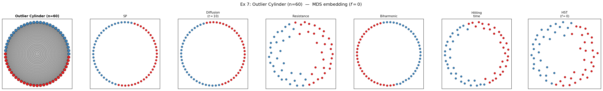

Gaussian kernel ($\theta=0.35$) 의 연속 가중치. 가까운 노드일수록 가중치 큼.

- 대부분의 거리가 원형 복원.
- **Resistance**: 상/하반구에 약간의 밀도 차이 — Gaussian 가중치의 미세한 비균일성 반영.
- **Biharmonic**: Resistance 보다 반구 분리가 더 선명 — 저주파 강조 효과.

### Ring profile

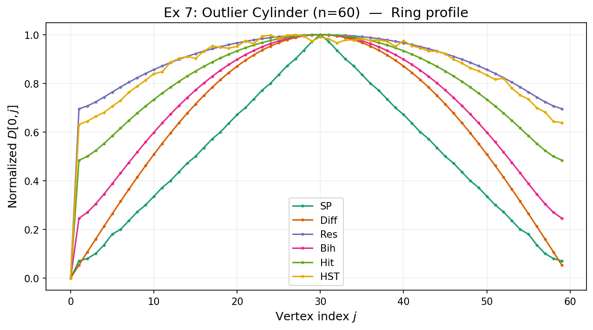

- 모든 거리의 $D[0, j]$ 곡선이 smooth inverted-V.
- Gaussian 가중치로 인해 SP 가 아닌 거리들의 곡선이 약간 더 부드러움.

---

## 3.8 Outlier Ring (n=60) — 균일 bidirectional cycle

### MDS 임베딩

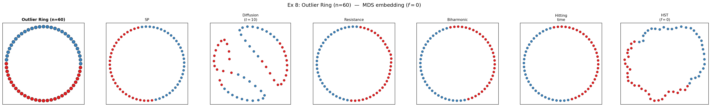

Parity Cycle (5) 과 동일한 deg=2 cycle. 결과도 거의 동일 — **정규 그래프에서는 거리 선택이 중요하지 않다**.

---

# 4. 마무리

## 거리별 특성 요약

| 거리 | 포착하는 구조 | 강점 | 약점 | 최적 사용처 |
|:---|:---|:---|:---|:---|
| **SP** | 최단 경로 | 명료, 빠름, 파라미터 없음 | bottleneck, 1-경로 과의존 | 빠른 baseline, 정규 그래프 |
| **Diffusion** | multi-scale 전이확률 | $t$ 로 scale 조절 | $t \to \infty$ degenerate, $t$ 선택 민감, directed 에서 산란 | undirected, multi-scale 탐색 |
| **Resistance** | 전역 연결성 (all paths) | metric, Euclidean, 파라미터 없음 | degree-only 수렴, symmetric 필요 | undirected, 전역 robust metric |
| **Biharmonic** | 저주파 global structure | smooth, 클러스터 경계 강조 | symmetric 필요, resistance 와 유사 | 3D mesh, 클러스터 분석 |
| **Hitting time** | 방향성 + 접근 난이도 | **유일한 비대칭 output** | metric 아님, degree 스케일 의존 | directed graph, 방향성 분석 |
| **HST ($f=0$)** | block dynamics + degree 구조 | 비선형, drift/balance 동시 포착 | Monte Carlo 느림, $\tau$ 수렴 필요 | degree heterogeneous, 다층 구조 |

## 핵심 교훈

1. **정규 그래프에서는 대부분의 거리가 비슷한 임베딩을 만든다.** Parity Cycle (5), Outlier Ring (8) 에서 SP, resistance, biharmonic, hitting, HST 모두 원형을 복원. 예외: Diffusion ($t=10$) 은 나선 왜곡.

2. **Degree heterogeneity 가 거리 간 차이를 만든다.** Star 에서 SP 는 "hub 중심 + 균등 leaf 원"이지만, Diffusion 은 "hub 극단 분리 + leaf 응축", HST 는 "drift 로 hub 더 멀리". Helm 에서 HST 만이 pendant leaf 를 작은 군집으로 압축하는 비선형 패턴을 보임.

3. **Directed graph 에서 거리별 실패 모드가 극적으로 다르다.** Directed Cycle 에서:
   - **SP, Diffusion → 산란** (대칭화 시 모든 쌍 거리 동일 → MDS 무의미)
   - **Resistance, Biharmonic → 완벽한 원형** (symmetrize 로 방향 완전 제거, 구조는 보존)
   - **Hitting time → 원형 + 약간의 비대칭 흔적** (방향성 일부 보존)
   - **HST → 호(arc) 형태** (block dynamics 가 방향 정보를 독특하게 인코딩)

4. **Parameter sweep 이 보여주는 것**: Diffusion 의 $t$ 는 "too small (local) → sweet spot → degenerate (collapse)" 의 좁은 구간. HST 의 $b$ 는 "commute-time-like → drift regime → block-dominant" 의 연속적 전환. HST 가 더 robust 한 parameter range 를 가짐.

5. **$\rho_{\mathrm{asym}}$ 분석의 결론**: directed graph 에서 비대칭 정보를 **output 에 보존하는 거리**는 SP (directed=True) 와 Hitting time 뿐. Walk-based 는 rotational symmetry trap, algebraic 은 정의 단계의 symmetrization 이 원인.

6. **$f=0$ 은 출발점이다.** 이 포스트에서는 그래프 구조만 봤지만, HST 의 진짜 기여는 $f \neq 0$ — 신호와 그래프의 결합. $f=0$ 에서 보인 구조 위에 신호가 얹히면 어떤 기하가 만들어지는지는 별도 포스트.

---

# 참고

- Coifman & Lafon, "Diffusion maps," *Appl. Comput. Harmon. Anal.* (2006)
- Klein & Randić, "Resistance distance," *J. Math. Chem.* (1993)
- Chandra, Raghavan, Ruzzo, Smolensky, Tiwari, "The electrical resistance of a graph…," *STOC* (1989)
- von Luxburg, Radl, Hein, "Hitting and commute times in large random neighborhood graphs," *JMLR* (2014)
- Lipman, Rustamov, Funkhouser, "Biharmonic distance," *ACM TOG* (2010)
- Lovász, "Random walks on graphs: A survey" (1993)
