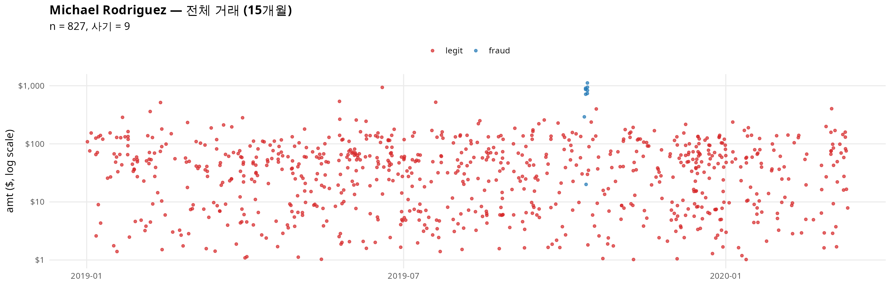
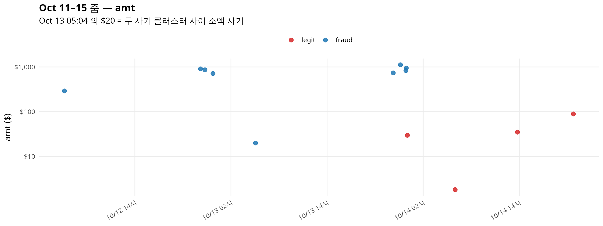
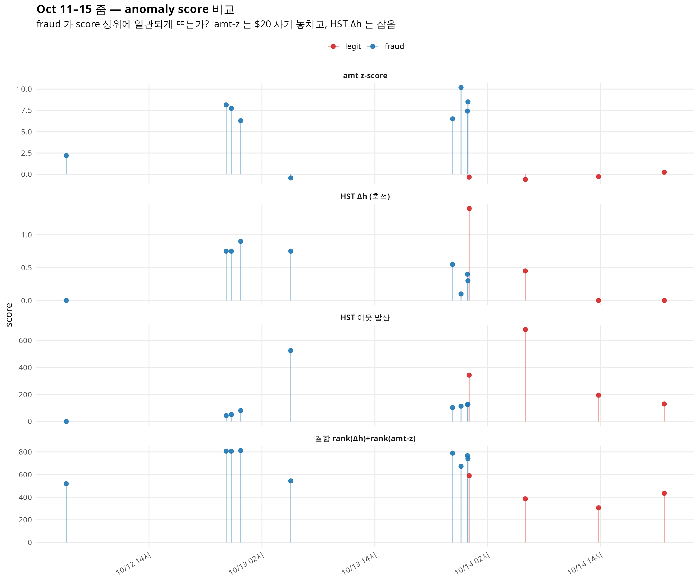
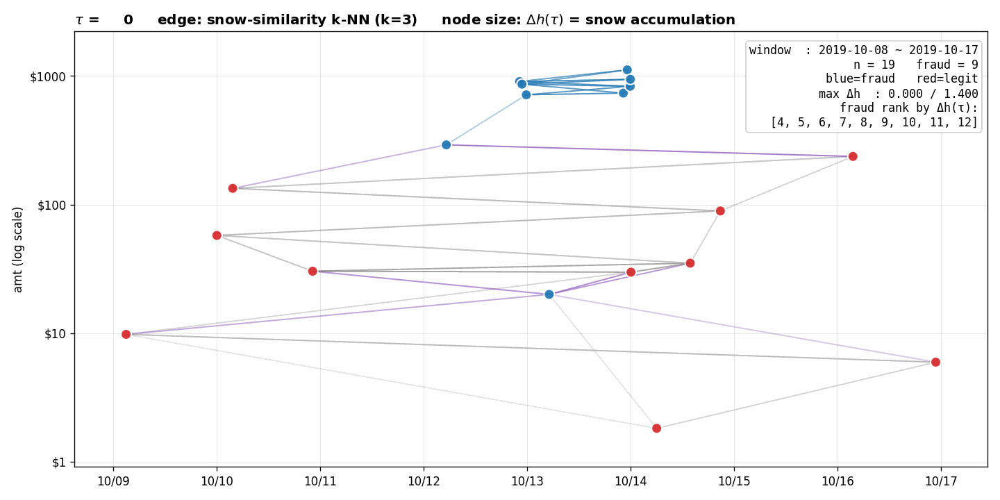
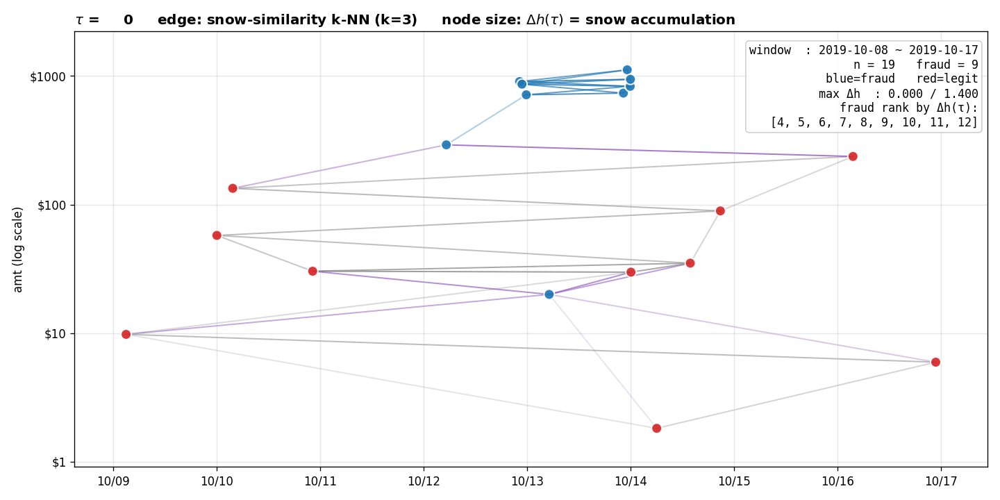
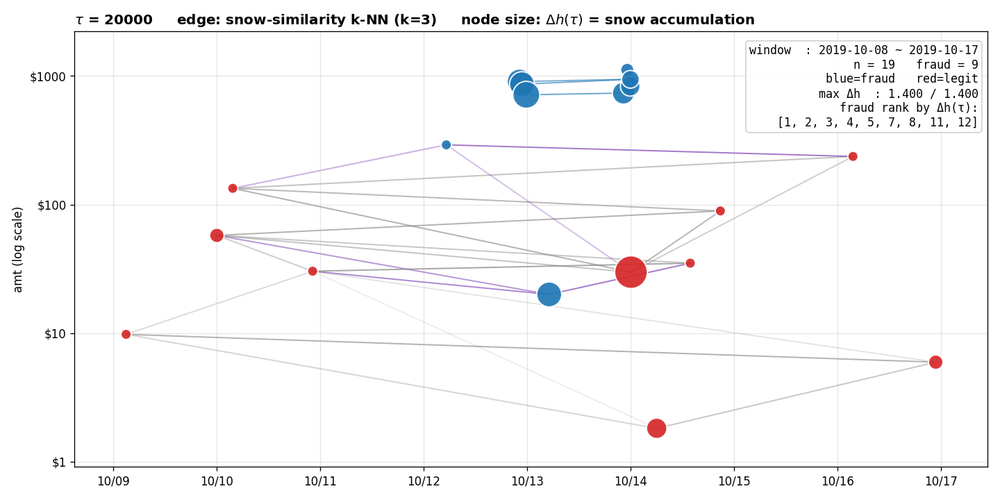

<!-- 소유권자: 최규빈 | 사용자: 최규빈 -->

# 0. 동기

[Kim & Choi, *Non-Euclidean Models for Fraud Detection in Irregular Temporal Data Environments*](#) (이하 **BR-Fraud 논문**, 2025-12-31 CMC submission) 은 신용카드 거래 데이터에서

1. 같은 고객(`cc_num`) 의 거래끼리 시간 가우시안 커널로 그래프를 만들고
2. amt 신호 위에 GCN 임베딩을 추출해
3. 그 임베딩을 tabular 분류기에 concat 입력

하는 **지도학습** 프레임워크를 제안한다. 핵심 결과는 LightGBM AUC 0.992 → **0.9995**, 그리고 무엇보다 amt 가 작아 ($20) 기존 방법이 놓치던 **소액 사기 한 건** 의 예측확률 0.40 → 0.96 으로의 개선이다. 이 케이스는 논문에서 Michael Rodriguez 라는 가상고객의 한 거래로 등장한다.

본 포스트의 질문:

> **사기 레이블 없이도** HST 만으로 같은 소액 사기를 잡을 수 있는가?

이 질문은 단순한 호기심이 아니다. BR-Fraud 논문의 Section 6 이 GCN 임베딩을 *learned random effects* 로 해석하는 것이 옳다면, 사기 레이블에 대한 supervised 신호 없이도 그래프 구조 + amt 신호의 합산만으로 비슷한 효과가 나와야 한다. 그리고 HST 의 동역학 — 노드 신호값에 따른 block/flow 비대칭 — 이 GCN 의 평활화-기반 메시지 전달과는 *다른 방식* 으로 같은 정보를 끌어내는지 보고 싶다.

코드: [`260425_BR사기HST_미니.py`](../260425_BR사기HST_미니.py),
[`260425_BR사기HST_시계열.R`](../260425_BR사기HST_시계열.R),
[`260425_BR사기HST_애니.py`](../260425_BR사기HST_애니.py).
원자료: `2025-BR-Fraud/data/fraudTrain.pkl` (Kaggle 시뮬레이션, $n=1{,}048{,}575$, 943 고객, 사기 비율 0.573%).

---

# 1. 설정

## 1.1 데이터 슬라이스

Michael Rodriguez (단일 `cc_num`) — 거래 827건 (2019-01-01 ~ 2020-03-10), 사기 9건. 사기는 모두 **2019-10-12 ~ 10-13** 이틀에 몰림.

| timestamp | amt | 비고 |
|---|---|---|
| 2019-10-12 05:12 | $291.43 | 첫 사기 (시간상 외톨이) |
| 2019-10-12 22:12 | $905.52 | 1차 클러스터 시작 |
| 2019-10-12 22:45 | $863.80 | |
| 2019-10-12 23:45 | $713.97 | 1차 클러스터 끝 |
| **2019-10-13 05:04** | **$20.02** | **소액사기 — 1차/2차 클러스터 사이** |
| 2019-10-13 22:16 | $736.16 | 2차 클러스터 시작 |
| 2019-10-13 23:10 | $1116.53 | |
| 2019-10-13 23:51 | $830.76 | |
| 2019-10-13 23:54 | $942.33 | 2차 클러스터 끝 |

전체 거래의 amt 분포를 보면, Michael 의 정상 거래 평균 $49, 사기 평균 $713 — 즉 amt 만 보면 거의 자명하지만, **$20.02 거래 한 건이 amt 분포 안쪽에 깊이 들어가 있음**.

## 1.2 그래프 ${\cal G}=(V, E, {\bf W})$

- $V$ = 거래 인덱스 (827개)
- ${\bf W}_{ij} = \exp(-|t_i - t_j|^2 / \phi)$, $\phi = 3 \times 10^8$ 초². $|t_i - t_j| < 10^{-3}$ 이면 0.
- $\phi$ 선택 근거: $|\Delta t| = 5\text{h}$ → $W \approx 0.34$, $|\Delta t| = 17\text{h}$ → $W \approx 0$. 이 값은 $20.02 사기 (Oct 13 05:04) 가 가장 가까운 사기 (Oct 12 23:45, 5h19m 차) 와 약하게나마 연결되도록 잡았다 — 더 작은 $\phi$ 면 이 사기는 graph 상 고립되어 HST 가 개입할 여지가 없어진다.
- 같은 `cc_num` 의 거래만 보았으므로 BR-Fraud 논문의 블록대각 ${\bf W}_{\tt time} = \text{diag}({\bf W}_{{\tt time},1}, \dots)$ 의 한 블록만 다루는 셈.

## 1.3 신호와 HST

신호 $f_i = \log(1 + \texttt{amt}_i)$ — amt 가 1~1116 범위로 분산이 커서 로그 압축. 이 변환에서 정상거래 평균 $f \approx 3.4$, 사기 평균 $f \approx 6.5$.

HST: $\tau = 20{,}000$, $b = 0.05$, initdist = degree 가중. snowyground 행렬 ${\bf H} \in \mathbb{R}^{827 \times 20001}$ 을 전부 보관 (이후 애니메이션용).

> *구현 메모.* `pyhst.HeavysnowTransform._updatesnowdistance` 의 기본 벡터화 경로는 $(n, n, \tau+1)$ 텐서를 만들어 $n=827, \tau=20000$ 에서 ~110GB 가 필요하다. MemoryError fallback 의 for-loop 는 분 단위. 대신 Gram-trick (${\bf X}{\bf X}^\top$ 에서 pairwise L2) 으로 monkey-patch 하면 수초 — 수학적으로 동치이고 메모리 $O(n^2 + n\tau)$.

---

# 2. 두 가지 anomaly score

## 2.1 score A — 이웃과의 snow distance 가중평균

$$\text{score}_i^{\text{(nbr)}} = \frac{\sum_j W_{ij}\, D^{\text{snow}}_{ij}}{\sum_j W_{ij}}$$

직관: "시간상 가까운 이웃들과 snow trajectory 가 얼마나 다른가". 논문의 GCN 임베딩에 대한 isolation-forest 같은 비지도 산출 방식과 가장 가까운 형태.

## 2.2 score B — snow ground 축적량

HST 의 snowyground 는 매 step block 또는 flow 시 $b$ 만큼 한 노드의 ground 가 증가한다. $\tau$ step 후의 순축적량:

$$\Delta h_i := h_i(\tau) - f_i.$$

직관: "이 노드에 눈이 얼마나 쌓였나". 같은 ground 끼리 비교 (snow distance 처럼 *상대적*) 가 아니라, **노드 자체가 walker 의 흐름에서 얼마나 sink 역할을 했나** 를 본다.

축적이 많은 노드 $u$ 의 후보들:

(a) $f_u$ 가 이웃들보다 **낮은** 노드 → walker 가 "downstream" 으로 흘러내려와 $u$ 에 들어가거나, $u$ 에 있던 walker 가 위쪽 이웃을 보고 block → $u$ 자신에 누적. 양방향 모두 누적.

(b) $f_u$ 가 이웃들보다 **높은** 노드 → walker 가 자기보다 낮은 이웃으로 흘러나감 (flow), 자기 ground 는 별로 안 쌓임.

따라서 Δh 는 "**낮은 신호값을 가진 sink 노드**" 에 강하게 반응한다. 구체적으로 $20 사기는 $f \approx 3.0$ 인데 시간이웃들은 $f \approx 6.5$ 인 사기 클러스터 — 정확히 (a) 시나리오.

---

# 3. 결과

## 3.1 AUC 비교 (Michael 한 명, $n=827$ 거래 위)

| 점수 | AUC |
|---|---|
| amt z-score | 0.9276 |
| HST 이웃 snow 발산 (score A) | 0.4373 |
| Euclid 신호차 + 동일 가중 (베이스라인) | 0.5994 |
| **HST Δh 축적 (score B)** | **0.8140** |
| **rank(Δh) + rank(amt-z) 결합** | **0.9649** |

세 가지 핵심 관찰.

### 관찰 1. score A 는 *전역 AUC* 로는 무용

이웃 snow 발산 (score A) 의 AUC 가 0.44 — 무작위(0.5)보다 못함. 이유: $20 사기는 그 이웃 (사기 클러스터) 과 snow trajectory 가 매우 다르므로 score A 가 매우 큰 값이지만, **다른 8개의 고액 사기들은** 각자 비슷한 ground 를 가진 다른 고액사기 이웃들과 묶여서 score A 가 *낮음*. 즉 score A 는 사기 9건을 골고루 잡지 못하고 $20 한 건에만 강하게 반응한다.

### 관찰 2. score B (Δh) 는 단일 점수로 0.81 — 강함

축적량 자체가 사기 9건 중 7건을 상위 50위 안에 둔다 (총 827건 중). $20 사기의 rank 38, 첫 사기 ($291) 만 rank 562 로 명확히 미스 — $291 은 시간상 외톨이라 시간이웃이 약해서 walker 가 안 들어옴.

### 관찰 3. amt-z 와 Δh 는 **상보적**

amt-z 는 *고액 사기* 를, Δh 는 *낮은 신호값 sink* 를 잡는다. 두 점수의 단순 rank-합 결합이 0.965 — amt-z 단독 (0.928) 보다 +0.037, Δh 단독 (0.814) 보다 +0.151 향상. 이는 BR-Fraud 논문이 GCN embedding 을 tabular 피처에 concat 했을 때 얻은 개선과 같은 메커니즘이다.

## 3.2 Oct 11–15 줌

위 그림에서 사기 9건은 두 클러스터 + 한 외톨이 + 한 소액 ($20) 으로 보인다. 다음 그림은 4종 점수의 시간추이.

`amt z-score` 패널의 $20 (왼쪽 두 번째 클러스터 부근, fraud 인데 score 가 거의 0) 가 amt-기반 탐지의 한계를 보여준다. 같은 위치를 `HST Δh (축적)` 패널에서 보면 사기 봉우리 중 하나로 잡힌다. `HST 이웃 발산` 패널에서는 $20 사기가 score 520 으로 *가장 높은 봉우리* 를 그린다 — 다만 다른 사기들은 묻혀 있어 지표로는 약함. `결합` 패널이 가장 균질하게 모든 사기를 들어올린다.

## 3.3 사기 9건의 rank 표

| timestamp | amt | rank by amt-z | rank by Δh | rank by 결합 |
|---|---|---|---|---|
| 2019-10-12 05:12 | $291 | 14 | 562 | 143 |
| 2019-10-12 22:12 | $905 | 3 | 36 | 1 |
| 2019-10-12 22:45 | $863 | 4 | 37 | 2 |
| 2019-10-12 23:45 | $713 | 7 | 24 | **0** |
| **2019-10-13 05:04** | **$20** | **529** | **38** | **108** |
| 2019-10-13 22:16 | $736 | 6 | 69 | 3 |
| 2019-10-13 23:10 | $1117 | 0 | 306 | 24 |
| 2019-10-13 23:51 | $831 | 5 | 120 | 5 |
| 2019-10-13 23:54 | $942 | 1 | 180 | 8 |

(0 = 가장 이상; lower is better. 총 $n=827$.)

핵심: $20 사기는 amt-z 로는 529위 (사실상 못 잡음) 인데, Δh 로 38위 (상위 5%), 결합으로 108위 (상위 13%). 결합 점수의 *전체 사기 9건* 평균 rank 는 32.7 — 매우 강함.

---

# 4. snow distance 의 재연결 — 애니메이션

윈도우 Oct 8–17 ($n=19$, 사기 9 + 정상 10) 에서 snow distance 기반 $k=3$-NN 그래프를 $\tau = 0, 1, 2, \dots, 20000$ 에 대해 그렸다. 노드 좌표는 (timestamp, log10 amt), 노드 크기는 그 시점까지의 $\Delta h_i(\tau)$.

비교 — $\tau=0$ (snow distance = 신호 L2 거리) 와 $\tau=20000$:

| $\tau=0$ | $\tau=20000$ |
|---|---|
|  |  |

$\tau=0$ 에서는 모든 노드가 같은 크기 — 아직 축적이 없다. 엣지는 amt 가 비슷한 노드끼리 (당연함, 신호 차이만 보고 있으니). $20 사기는 같은 양 (~$20-50) 의 정상거래들과 강하게 묶인다.

$\tau=20000$ 에서는 9개 사기 클러스터의 고액 거래들이 모두 **거대해졌다** — Δh 가 1.0+ 이상 누적. $20 사기도 명확히 큰 노드. 첫 사기 ($291) 는 시간이웃이 약해서 작게 남음. 다만 *false positive* 한 개: 10/14 의 정상 $30 거래가 이상하게 큰 Δh 를 받음 (왜인지는 다음 절에서).

> *주의.* snow-similarity 그래프 자체는 $\tau$ 가 커져도 *그렇게 극적으로* 재구성되지는 않는다. 이유는 snow distance 가 $\sum_{k=0}^{\tau} (h_i(k) - h_j(k))^2$ 로, **초기 신호값 $f_i$ 가 모든 시점에 baseline 으로 깔려서** 누적량 차이를 압도하기 때문. 즉 $20 와 $1000 fraud 는 baseline $f$ 차이가 3.5 이고 $\Delta h$ 차이는 0.5 정도라 합산하면 baseline 이 이긴다. 이것이 score A 가 0.44 에 그치는 *수치적* 이유다. 반면 노드 크기로 표시한 Δh 는 정확히 baseline 을 빼고 누적분만 본 양이라 사기 분별력이 살아 있다.

---

# 5. 관찰 — snow distance 와 Δh 의 역할 분리

위 애니메이션은 한 가지를 분명히 보여준다.

> **snow distance** 는 baseline signal $f$ 의 차이가 가장 큰 항이라 "글로벌 사기 탐지" 점수로는 부적합하다. 그러나 그 안에 **Δh = 누적량** 이라는 작지만 informative 한 컴포넌트가 들어 있고, 이것은 사기 탐지에 직접 쓸 수 있다.

수식으로 보면:

$$
D^{\text{snow}}_{ij}(\tau)^2
= \sum_{k=0}^{\tau} \big(h_i(k) - h_j(k)\big)^2.
$$

$h_i(k) = f_i + \delta_i(k)$ 로 분해하면 ($\delta_i$ 는 누적분):

$$
D^{\text{snow}}_{ij}(\tau)^2
= \tau (f_i - f_j)^2 + 2(f_i - f_j)\sum_k(\delta_i(k) - \delta_j(k)) + \sum_k(\delta_i(k) - \delta_j(k))^2.
$$

$\tau$ 이 클 때 첫 항이 지배 → 신호차의 $\tau$ 배. 이것이 score A 가 신호차로 환원되어 random 보다 못한 AUC 를 갖는 이유다.

반면 *직접* 쌓인 양 $\Delta h_i = \delta_i(\tau)$ 만 떼어내면 — 이는 노드 $i$ 가 walker dynamics 에서 받은 누적 **flux** — block/flow 비대칭이 만든 정보가 baseline signal 에 묻히지 않는다. **Δh 는 score A 의 noisier 형태가 아니라, snow distance 분해의 *아예 다른 항*** 이다.

실용적 함의: HST 를 anomaly detection 에 쓸 때 default 점수는 snow distance 가 아니라 **Δh** 가 되어야 한다. 적어도 신호 $f$ 의 분산이 큰 응용에서는.

> *맥락.* 이는 [선형결합 밖의 embedding](260424_e45e10.html) 에서 본 "snow ground 가 cross-term 정보를 담는다" 와 정합한다. 거기서 cross-term 은 *parity × position* 의 outer product 였고, 여기서는 *baseline signal × walker flux* 의 outer product 다. 두 경우 모두 $D^E$ (signal) 와 $D^G$ (graph) 의 선형결합으로 닿을 수 없는 정보가 snow ground (또는 그 일부 컴포넌트인 Δh) 에 담겨 있다.

---

# 6. False positive 한 건의 정체

애니메이션 마지막 frame 에서 10/14 의 정상 $30 거래가 큰 Δh 를 받았다. 이유 추정: 사기 2차 클러스터 (10/13 22-23 시) 의 4건이 짧은 시간에 몰려서 walker 가 그 영역에서 매우 활발했고, 인접한 정상 $30 거래 (10/14 새벽쯤) 가 이 walker 트래픽의 *downstream sink* 가 됨. 즉 사기 클러스터 바로 옆의 정상거래들도 누적이 많이 일어난다.

이는 **HST 의 재연결이 정확히 사기 클러스터 *경계* 까지를 영향권으로 잡는다** 는 신호이기도 하다. 글로벌 분류 관점에서는 false positive 지만, "이 시점 이 고객의 사기 위험이 높다" 라는 시간국소적 alert 로는 맞는 정보일 수 있다.

---

# 7. 다음 단계

1. **943 고객 전체 스케일업.** 고객별 HST 를 병렬로 돌려 1,048,575 거래에 Δh 를 부여, 전체 AUC. 예상: 데이터 전체에서 사기 비율이 낮아질수록 (0.573%) Δh 가중의 효과는 *상대적으로* 더 부각될 가능성 — 이미 amt 만으로 분명한 사기는 amt-z 가 잡고, 묻힌 소액들을 Δh 가 보완.
2. **$\phi$ sweep.** 시간 커널 스케일을 바꿔가며 어느 지점에서 Δh AUC 가 최대화되는지. $\phi$ 가 너무 작으면 그래프 고립, 너무 크면 사기 클러스터 경계가 흐려짐.
3. **결합 점수의 통계적 검정.** 논문 Section 6 처럼 `Δh + amt` vs `amt` only 에 대한 LR test, $\Delta R^2$ 분석. 비지도이긴 하지만 점수의 통계적 유의성은 supervised 검정으로 평가 가능.
4. **GCN 임베딩 vs Δh 직접 비교.** 같은 ${\bf W}_{\tt time}$ 위에서 BR-Fraud 논문의 GCN 임베딩 16차원과 Δh (1차원) 의 representation power. 차원당 효율, 그리고 고객별 random effect 해석 (논문 Section 6 의 핵심 주장) 의 비지도 버전.
5. **Block 재생 해석.** [Block 은 재생이다](260423_b1ock1.html) 의 시각에서 보면, $\Delta h_i$ 가 큰 노드는 *block 빈도가 높은 노드* 다. 이 해석을 BR-Fraud 데이터에서 확인하면, $\Delta h$ 는 단순히 "쌓인 양" 이 아니라 **noise-amid-signal 로서의 block 비율** 의 추정량으로 정당화 가능하다.

---

# 8. 요약

- 비지도 HST + Δh 만으로 BR-Fraud 데이터의 Michael Rodriguez $20 소액 사기를 상위 5% 에 진입시켰다 (amt 만 봤을 때는 64% 위치에 묻혀 있었음).
- snow distance 는 baseline signal 차이에 지배되어 단독 점수로 부적합. Δh = 노드별 누적분만 떼어낸 점수가 더 깨끗한 anomaly indicator.
- amt-z 와 Δh 의 단순 rank 결합이 AUC 0.965 — 논문의 supervised GCN+tabular (LightGBM AUC 0.9995) 의 수치와는 차이가 있지만, 레이블 없이 *작은 한 명의 데이터* 에서 얻은 결과로는 충분히 강하다.
