# 0. 개요

본 노트는 그래프 거리 9종을 두 개의 단순한 예제 위에서 동일한 분석 파이프라인으로 비교한다. 두 예제는 모두 hst.tex \S\ref{sec:hst} 의 Example 2 의 정점 집합 $\mathcal V$ 와 신호 $\bsy$ 를 공유하며, 가중치 행렬 $\mathbf W$ 의 정의에서만 차이를 둔다.

- **예제 A** — Gaussian kernel weighting (대칭, hst.tex Example 2 그대로).
- **예제 B** — 단방향 순환행렬 (비대칭, 본 노트에서 추가한 변형).

각 예제에서 다음 다섯 단계를 동일하게 수행한다:

1. 정확한 setup 명시 (정점·신호·가중치 정의),
2. 9종 거리에 대한 단발 비교 — distance matrix 와 cMDS-3D 임베딩,
3. Ring profile — 한 기준 정점으로부터의 거리 곡선 비교,
4. 파라메터를 갖는 5종 거리에 대한 파라메터 스윕,
5. 비대칭-정직 분석 — $\rho_{\mathrm{asym}}$ 정량지표와 Sammon-style dual MDS 임베딩.

이 다섯 단계를 모든 예제에 동일하게 적용함으로써, 향후 예제가 추가·교체되더라도 비교 가능한 결과가 누적되도록 설계한다.

---

# 1. 거리 9종 — 카탈로그

상세 정의·이력·directed graph 에서의 거동은 [공부 ▷ 그래프 도메인에서의 거리 — 고전부터 HST까지](260425_64440a.html) 를 참조한다. 본 노트는 다음 9종을 다룬다.

| Family | 거리 | 정의 | 파라메터 |
|:---|:---|:---|:---|
| Path | Shortest path² | $\bigl(\min_\pi \sum_{e\in\pi} w_e^{-1}\bigr)^2$ | — |
| Walk | Diffusion | $\sum_k(P^t_{ik}-P^t_{jk})^2/\pi_k$ (Coifman–Lafon) | $t$, $\pi$-weighted/unweighted |
| Walk | Heat kernel | $\bigl\| (e^{-tL})_{i,\cdot} - (e^{-tL})_{j,\cdot} \bigr\|_2^2$ | $t$ |
| Walk | PPR | $\| \mathbf p_i - \mathbf p_j \|_2^2$, $\;\mathbf p_i = \alpha\mathbf e_i + (1-\alpha)P^\top \mathbf p_i$ | $\alpha$ |
| Algebraic | Resistance | $L^\dagger_{ii} + L^\dagger_{jj} - 2L^\dagger_{ij}$ | — |
| Algebraic | Biharmonic | $\sum_k\bigl(\psi_k(i)-\psi_k(j)\bigr)^2/\lambda_k^2$ | — |
| Algebraic | Spectral embedding | $\sum_{k=1}^K\bigl(\psi_k(i)-\psi_k(j)\bigr)^2$ | $K$ |
| Signal | Euclidean | $\bigl(y(v_i) - y(v_j)\bigr)^2$ | — |
| Signal+Graph | **HST** | $\overline{\mathrm{SD}}^2(\tau) = \tau^{-1}\sum_{\ell=1}^\tau \bigl(h(v_i,\ell)-h(v_j,\ell)\bigr)^2$ | $\tau, b$ |

여기서 $P = D^{-1}\mathbf W$ 는 row-stochastic 전이행렬, $\pi$ 는 $P$ 의 stationary distribution, $L = D - \mathbf W$ 는 (combinatorial) 그래프 라플라시안, $L^\dagger$ 는 그 Moore–Penrose 의사역, $(\lambda_k, \psi_k)$ 는 대칭화 라플라시안 $L_s = (L+L^\top)/2$ 의 고유쌍이다. 비대칭 $\mathbf W$ 에 대해서는 본 노트 §3.5 / §4.5 에서 이 정의들의 한계를 별도로 검토한다.

---

# 2. 분석 파이프라인의 공통 도구

## 2.1 cMDS-3D 임베딩

squared symmetric distance matrix $\mathbf D \in \mathbb R^{n \times n}$ 에 대해 double-centering $\mathbf B = -\tfrac12 \mathbf J \mathbf D \mathbf J$ ($\mathbf J = \mathbf I - n^{-1}\mathbf 1\mathbf 1^\top$) 의 상위 3 고유쌍 $(\mu_k, \mathbf v_k)_{k=1,2,3}$ 으로 임베딩 좌표를 $\mathbf x_i = \bigl(\sqrt{\mu_k}\, v_k(i)\bigr)_{k=1,2,3}$ 로 정의한다.

## 2.2 Ring profile

ring 형 그래프의 회전 구조를 활용해, 기준 정점 $v_1$ 으로부터의 거리 $D[1, j]$ 를 정점 인덱스 $j$ 의 함수로 그린 후 각 거리마다 $\min$–$\max$ 정규화하여 형상만 비교한다.

## 2.3 비대칭-정직 분석 (asymm-honest)

cMDS 는 squared *symmetric* 행렬을 요구하므로, 비대칭 그래프 위에서 기존 분석은 알고리즘적 대칭화 (`directed=False`, $L_s$ 강제, $(D + D^\top)/2$ 평균 등) 를 통해 사실상 directed 정보를 소거한다. 이를 보완하기 위해 다음 네 가지 도구를 추가로 사용한다.

**(i) 비대칭 정량지표 $\rho_{\mathrm{asym}}$.**
$$\rho_{\mathrm{asym}}(\mathbf D) \;=\; \frac{\| \mathbf D - \mathbf D^\top \|_F}{\| \mathbf D + \mathbf D^\top \|_F}.$$
$\rho_{\mathrm{asym}} = 0$ 은 완전 대칭, $\rho_{\mathrm{asym}} \to 1$ 은 강한 비대칭을 의미한다.

**(ii) $\mathbf D$ heatmap.** 비대칭이라면 비대칭 그대로 표현한다.

**(iii) $\mathbf D - \mathbf D^\top$ heatmap.** 0 을 중심으로 한 발산 colormap 으로 비대칭 성분을 직접 시각화한다.

**(iv) $D[i,j]$ vs $D[j,i]$ scatter.** 모든 정점 쌍이 $y = x$ 선 위에 위치하면 대칭, 벗어나면 directional 정보가 보존됨을 의미한다.

**(v) Sammon-style 비대칭 dual MDS.** 각 정점 $v_i$ 를 source 좌표 $\mathbf p_i \in \mathbb R^k$ 와 sink 좌표 $\mathbf q_i \in \mathbb R^k$ 두 벡터로 임베딩한다. stress 함수
$$\mathcal S(\mathbf P, \mathbf Q) \;=\; \sum_{i \neq j} \Bigl(\sqrt{D[i,j]} - \| \mathbf p_i - \mathbf q_j \|_2 \Bigr)^2$$
를 L-BFGS-B 로 최소화한다. $\mathbf D$ 가 대칭이면 최소점에서 $\mathbf p_i = \mathbf q_i$ 가 성립하여 통상적 cMDS 와 동치이다. 비대칭이면 source 와 sink 좌표가 어긋나며, 그 어긋남이 directional 정보의 시각적 흔적으로 남는다.

소스 코드: [`260428_예제2_거리비교_asymm정직판.py`](../260428_예제2_거리비교_asymm정직판.py).

---

# 3. 예제 A — Gaussian ring (대칭)

## 3.1 Setup

hst.tex \S\ref{sec:hst} Example 2 의 정의를 그대로 사용한다.

**정점 집합 ($n = 60$)**:
$$\mathcal V \;=\; \Bigl\{\, v_i = \bigl(\cos\tfrac{2\pi i}{n},\, \sin\tfrac{2\pi i}{n}\bigr) \;:\; i = 1, \ldots, n \,\Bigr\}.$$

**엣지 집합**: 자기루프를 제외한 완전 그래프, $E_{ij} = \mathbb 1[i \neq j]$.

**가중치 행렬**: Gaussian kernel weighting,
$$W_{ij} \;=\; \begin{cases} \displaystyle\exp\!\Bigl(-\frac{\| v_i - v_j \|_2^2}{2\theta^2}\Bigr) & i \neq j, \\[4pt] 0 & i = j, \end{cases} \qquad 2\theta^2 = 0.35.$$
이로부터 $\mathbf W^\top = \mathbf W$ (대칭).

**신호**:
$$y(v_i) \;=\; \begin{cases} +3 + \epsilon_i & i = 1, \ldots, n/2, \\ -3 + \epsilon_i & i = n/2 + 1, \ldots, n, \end{cases} \qquad \epsilon_i \stackrel{\text{iid}}{\sim} \mathcal N(0, 0.1^2).$$

소스: [`260424_예제2재현.py`](../260424_예제2재현.py).

## 3.2 9종 거리 — 단발 비교

각 거리에 표준 파라메터 (diffusion $t = 4$, heat $t = 2$, PPR $\alpha = 0.15$, spectral $K = 5$, HST $\tau = 5 \cdot 10^7$) 를 부여하여 distance matrix heatmap 과 cMDS-3D 임베딩을 한 그림에 정리한다. HST 의 $\tau$ 는 transient noise 를 충분히 압축하기 위해 $5 \cdot 10^7$ 까지 키웠다 ([재생성 스크립트](../260428_예제2_거리비교_gauss_tau50M재생성.py); precomputed $\overline{\mathrm{SD}}^2$ 캐시는 [`results/numeric/260428_HST_gauss_tau50M/`](../results/numeric/260428_HST_gauss_tau50M/) 에 있음).

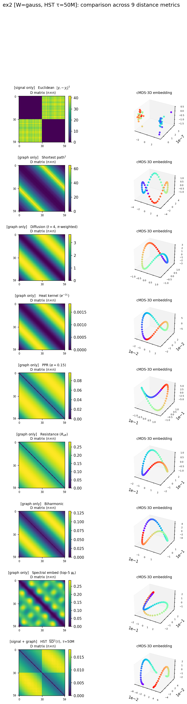

**관찰.**

- *Signal-only* (Euclidean): 두 cluster 가 1차원으로 분리.
- *Graph-only* 7종 (SP, Diffusion, Heat, PPR, Resistance, Biharmonic, Spectral): 모두 거의 동일한 ring 임베딩으로 수렴. 정규 ring 의 라플라시안 spectrum 이 단순한 형태로 분포하므로 spectral filter $f(\lambda)$ 의 형태에 거의 무관한 결과를 얻는다 ([§5.1](260425_64440a.html) 통합식 참조).
- *Signal+Graph* (HST): cluster 두 개가 ring substructure 를 보유한 cylinder 형태. 이 cylinder 의 unique 성에 대한 별도 검증은 [예제2 재검토](260425_6dc8c6.html) 의 Procrustes 분석 참조.

## 3.3 Ring profile

기준 정점 $v_1$ 으로부터의 거리 $D[1, j]$ 를 정규화하여 $j$ 에 대해 그린 그림.

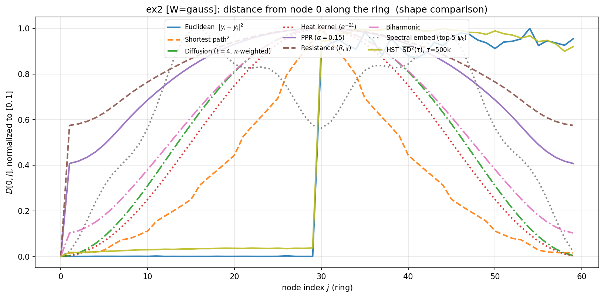

graph-only 7종이 거의 한 곡선 위에 겹친다. Euclidean 은 step 함수, HST 는 Euclidean 과 graph-only 사이의 부드러운 곡선이다.

## 3.4 파라메터 스윕

각 파라메터 거리에 대해 (열 = 파라메터 값) × (행 = distance matrix / cMDS-3D / ring profile) 의 그림으로 형상 변화를 추적한다.

### 3.4.1 Diffusion — $t \in \{1, 2, 4, 8, 16, 32, 64\}$, $\pi$-weighted vs unweighted

$$d_t^2(v_i, v_j) \;=\; \sum_{k=1}^n \frac{(P^t_{ik} - P^t_{jk})^2}{\pi_k} \quad (\pi\text{-weighted}), \qquad \sum_{k=1}^n (P^t_{ik} - P^t_{jk})^2 \quad (\text{unweighted}).$$

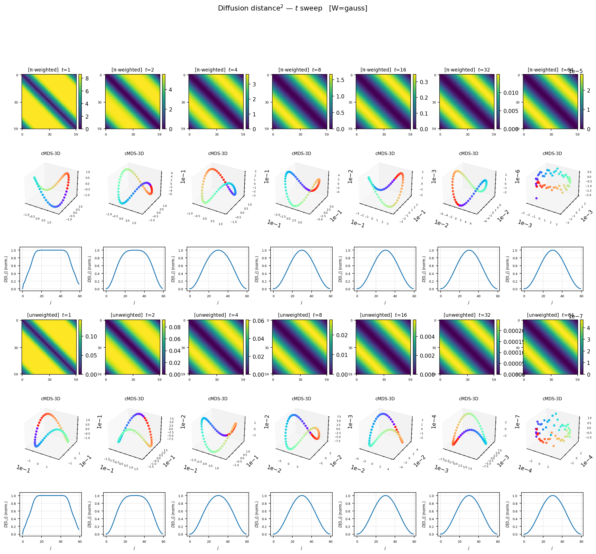

$t \to 0$: 국소 1-홉 정보만 (heatmap 의 대각 근방만 활성). $t \to \infty$: $P^t \to \mathbf 1 \pi^\top$, 모든 거리가 $0$ 으로 붕괴. $t \in [4, 16]$ 구간에서 cMDS 가 가장 깨끗한 ring 임베딩을 산출한다 (multi-scale sweet spot). 정규 ring 에서 $\pi$ 가 거의 균일하므로 weighted 와 unweighted 의 시각적 차이는 미미하다.

### 3.4.2 Heat kernel — $t \in \{0.1, 0.5, 1, 2, 4, 8, 16\}$

$$d_t^2(v_i, v_j) \;=\; \bigl\| (e^{-t L})_{i,\cdot} - (e^{-t L})_{j,\cdot} \bigr\|_2^2.$$

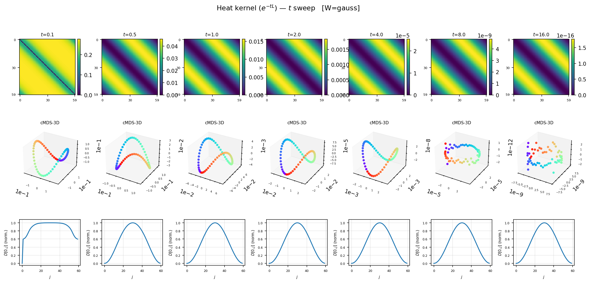

$t \to 0$: $e^{-tL} \approx \mathbf I$, 거리 $\approx 0$. $t$ 증가에 따라 고주파 성분이 감쇠하여 저주파 모드만 남고, ring 임베딩으로 수렴. $t$ 가 매우 크면 stationary 로 다시 붕괴.

### 3.4.3 PPR — $\alpha \in \{0.05, 0.1, 0.2, 0.4, 0.6, 0.8, 0.95\}$

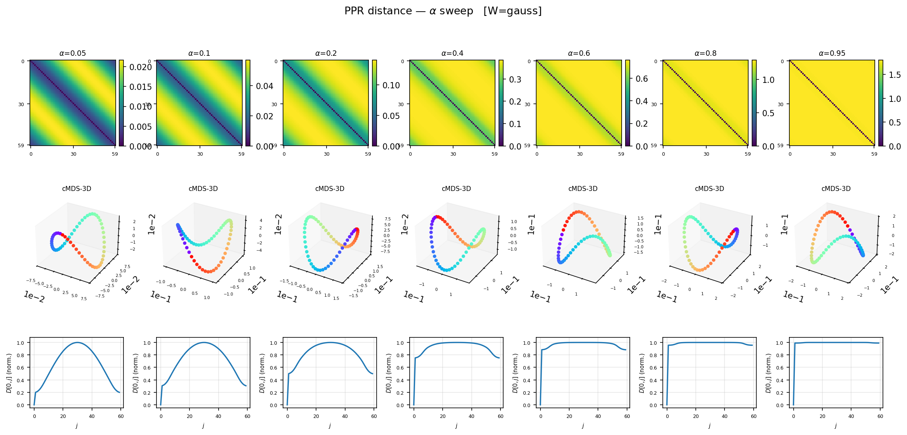

$\alpha \to 0$: $\mathbf p_i \to \pi$, 한 점 collapse. $\alpha \to 1$: $\mathbf p_i \to \mathbf e_i$, 모든 쌍 거리 $= \sqrt 2$ (heatmap 균일). 중간값 ($\alpha \approx 0.2 \sim 0.4$) 에서 ring 구조가 가장 잘 펴진다.

### 3.4.4 Spectral embedding — $K \in \{2, 3, 5, 8, 12, 20, 30\}$

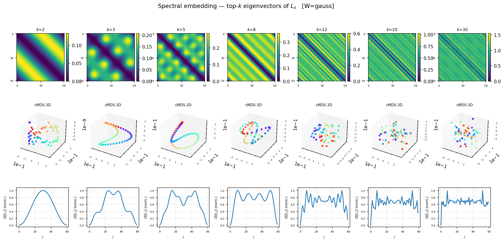

$K = 2$: 첫 두 nontrivial 고유벡터 $(\psi_1, \psi_2)$ 가 ring 의 $(\cos, \sin)$ 좌표를 정확히 복원. $K$ 가 증가하면 고차 harmonic 이 더해져 표면적으로 더 풍부해 보이나, 본질적인 형상 변화는 작다. $K \geq \mathrm{rank}(L_s)$ 에서 Parseval 항등식에 의해 Euclidean 거리에 점근.

### 3.4.5 HST — $b \in \{0.01, 0.05, 0.1, 0.3, 0.5, 1, 2\}$, $\tau = 3 \cdot 10^4$ 고정

$b$ 는 block 임계 — flow 가 height 차이 $\theta = b/\sqrt 2$ 를 초과하는 이웃으로 이동할 확률 가중치.

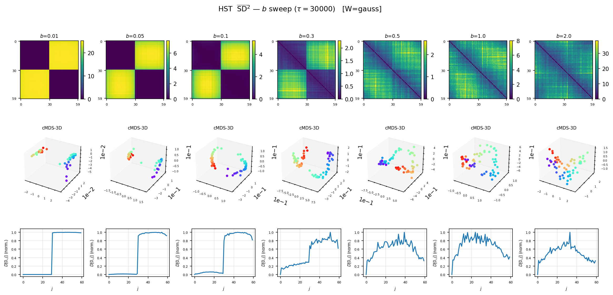

$b \to 0$: block 메커니즘 무력화 → 자유 random walk → $\overline{\mathrm{SD}}^2$ 가 commute time 과 같은 거동. $b$ 중간값: cylinder 형태 (signal split + ring residual). $b \gg 1$: block 이 거의 모든 flow 를 차단 → snowy ground 가 초기 신호를 보존 → $\overline{\mathrm{SD}}^2$ 가 Euclidean 거리의 상수배에 점근.

## 3.5 비대칭-정직 분석 (sanity check)

$\mathbf W^\top = \mathbf W$ 이므로 비파라메터 5종 + 파라메터 4종의 *모든 파라메터 값* 에서 $\rho_{\mathrm{asym}} = 0$ 이 성립해야 한다. 거리를 두 부류로 나누어 검증:

- **(native)** — 정의가 비대칭 $\mathbf W$ 도 well-defined: SP² (`directed=True`), Hitting time, Diffusion, Heat, PPR.
- **(symmetric by construction)** — 정의 자체가 $L_s$ 혹은 $\bsy$ 만을 사용: Resistance, Biharmonic, Spectral embedding, Euclidean.

(HST 의 거동은 따로 정리되어 있으므로 본 분석에서 제외 — [예제2 재검토](260425_6dc8c6.html), [수렴 증명](260426_c05541.html) 등 참조.)

### 3.5.1 비파라메터 5종

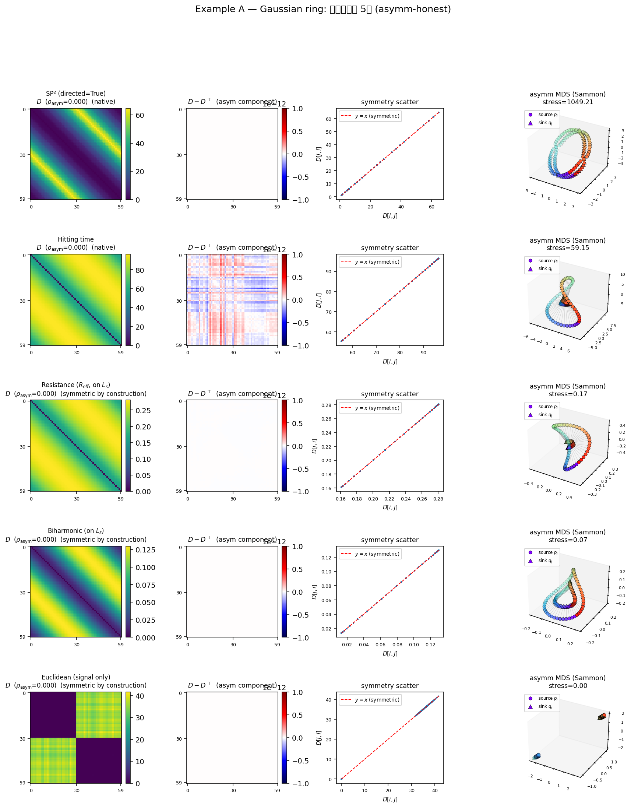

| 거리 | $\rho_{\mathrm{asym}}$ | 분류 |
|:---|---:|:---|
| Shortest path² (`directed=True`) | 0.0000 | native |
| Hitting time | 0.0000 | native |
| Resistance ($R_{\mathrm{eff}}$, on $L_s$) | 0.0000 | symmetric by construction |
| Biharmonic (on $L_s$) | 0.0000 | symmetric by construction |
| Euclidean (signal only) | 0.0000 | symmetric by construction |

### 3.5.2 Diffusion — $t \in \{1, 2, 4, 8, 16, 32, 64\}$ ($\pi$-weighted)

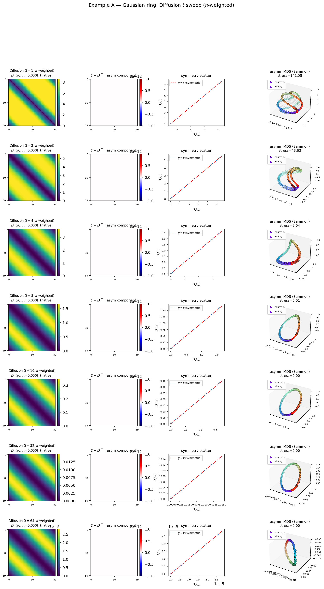

모든 $t$ 에서 $\rho_{\mathrm{asym}} = 0.0000$.

### 3.5.3 Heat kernel — $t \in \{0.1, 0.5, 1, 2, 4, 8, 16\}$

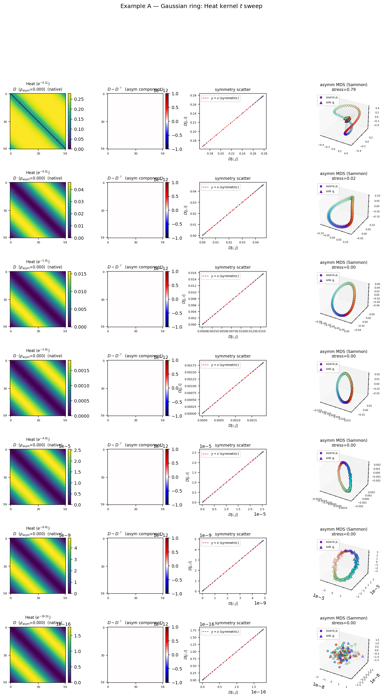

모든 $t$ 에서 $\rho_{\mathrm{asym}} = 0.0000$.

### 3.5.4 PPR — $\alpha \in \{0.05, 0.1, 0.2, 0.4, 0.6, 0.8, 0.95\}$

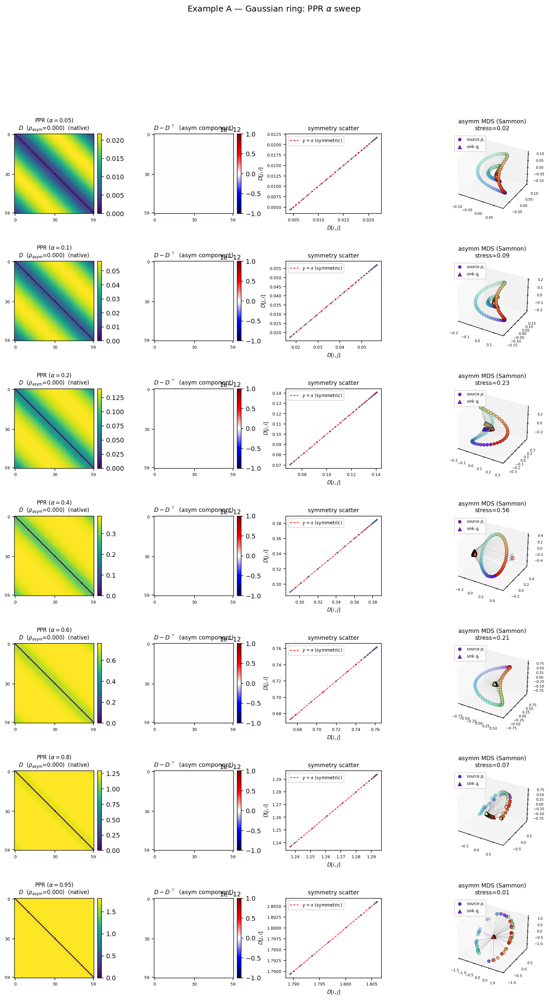

모든 $\alpha$ 에서 $\rho_{\mathrm{asym}} = 0.0000$.

### 3.5.5 Spectral embedding — $K \in \{2, 3, 5, 8, 12, 20, 30\}$

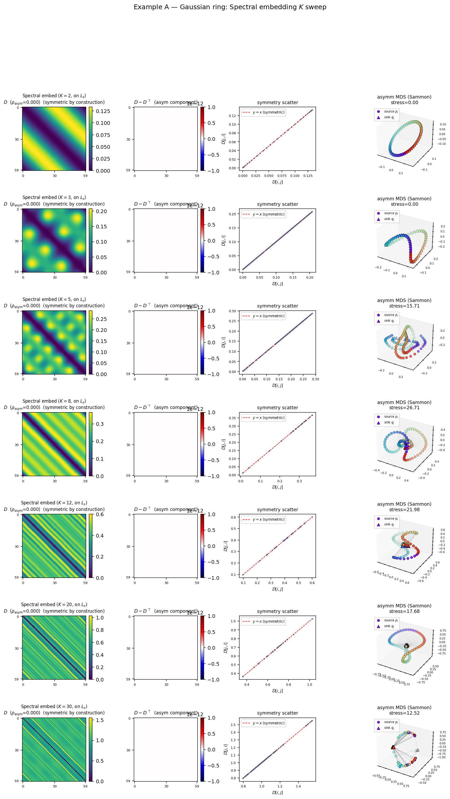

모든 $K$ 에서 $\rho_{\mathrm{asym}} = 0.0000$.

### 3.5.6 정리

모든 거리·모든 파라메터 값에서 $\rho_{\mathrm{asym}}$ 이 정확히 $0$. Sammon dual MDS 의 source/sink 좌표가 동일 위치로 수렴하여 통상적 cMDS-3D 와 동치임을 확인. 도구 자체의 유효성이 검증된다.

---

# 4. 예제 B — Directed cycle (비대칭)

## 4.1 Setup

§3.1 의 정점 집합 $\mathcal V$ 와 신호 $\bsy$ 를 그대로 유지하고, 가중치 행렬만 단방향 순환행렬로 교체한다.

**엣지·가중치 행렬**:
$$E_{ij} \;=\; W_{ij} \;=\; \begin{cases} 1 & j = (i \bmod n) + 1, \\ 0 & \text{otherwise}. \end{cases}$$
즉 각 정점 $v_i$ 는 후속 정점 $v_{(i \bmod n) + 1}$ 로의 단 하나의 나가는 엣지만을 가지며, $\mathbf W^\top \neq \mathbf W$.

이는 hst.tex Example 2 에는 없는 변형으로, 비대칭성이 거리 행렬에 어떻게 (또는 어떻게 *못* 하게) 전달되는지 검토하기 위해 도입한다.

## 4.2 9종 거리 — 단발 비교

§3.2 와 동일한 표준 파라메터로 단발 비교를 수행한다.

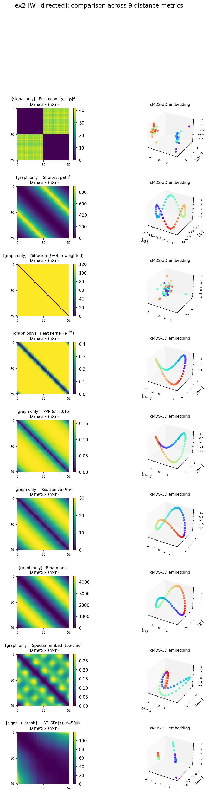

표면적으로는 §3.2 와 유사한 패턴 — graph-only 거리들의 임베딩이 비슷한 ring 형태로 수렴하는 것처럼 보인다. 그러나 이 결과를 액면 그대로 받기 전에 다음 두 사실을 짚어야 한다:

1. **`260425_예제2_거리비교.py` 가 directed cycle 위에서 사용한 알고리즘적 대칭화.**
   - Shortest path: `scipy.sparse.csgraph.shortest_path(..., directed=False)` 호출 → 양방향 최단경로의 *최솟값* 사용 (directed 정보 소거).
   - Resistance / Biharmonic / Spectral embedding: $L_s = (L + L^\top)/2$ 강제 → $\mathbf W$ 의 단방향 정보 소거.

2. **cMDS 자체의 한계.** cMDS 는 squared symmetric 행렬을 요구한다. 비대칭 거리에 적용하려면 어떤 식으로든 대칭화가 필요하며, 이 단계에서 directional 정보가 추가로 소실된다.

따라서 위 그림은 *directed cycle 의 9종 거리* 라기보다는, *각 거리를 무리하게 symmetric 화한 결과* 로 해석해야 정확하다. 이 한계를 §4.5 의 비대칭-정직 분석으로 정량화한다.

## 4.3 Ring profile

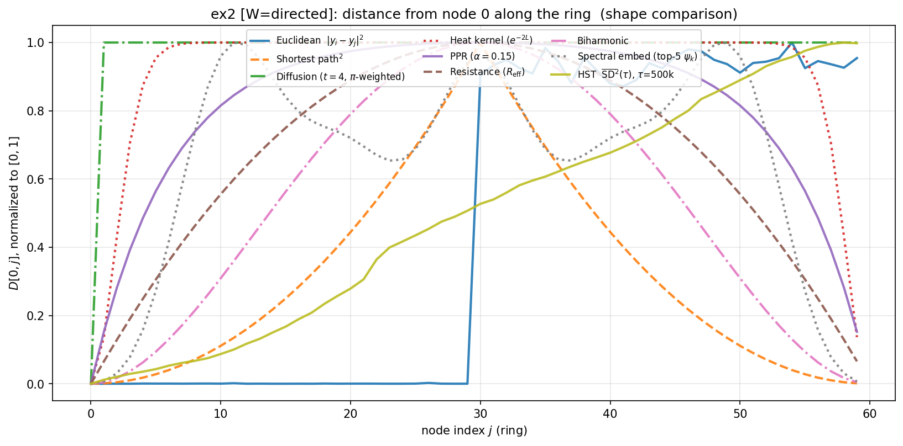

§3.3 과 비교했을 때 곡선 형상의 분포가 다르나 (특히 Euclidean·HST 와 graph-only 사이의 분리), 위 §4.2 에서 짚은 알고리즘적 대칭화 효과가 ring profile 에도 동일하게 작용함에 유의한다.

## 4.4 파라메터 스윕

### 4.4.1 Diffusion

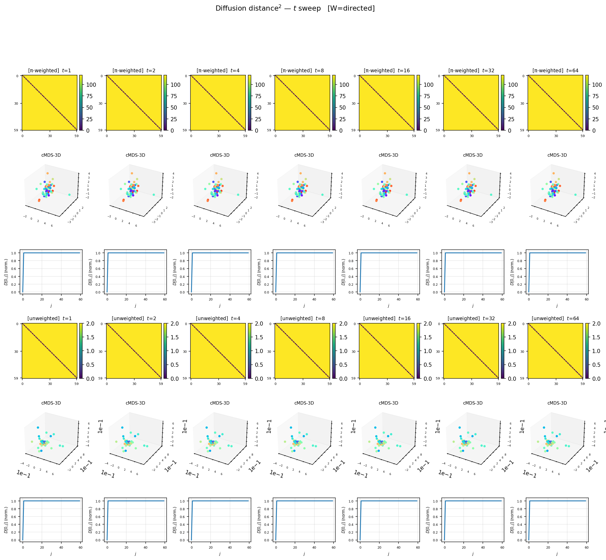

순환행렬 $\mathbf W$ 에 대해 $P = D^{-1}\mathbf W$ 도 순환 permutation 이며 $P^t$ 역시 permutation. 이로부터 $\sum_k (P^t_{ik} - P^t_{jk})^2 = 2$ ($i \neq j$) 가 성립하여, $\pi$-weighted diffusion distance 가 모든 쌍에서 $2/\pi_k = 2n$ 으로 *상수* 가 된다 (degenerate). cMDS-3D 임베딩이 모든 정점을 한 점 (또는 동일한 거리의 simplex) 으로 모은다.

### 4.4.2 Heat kernel

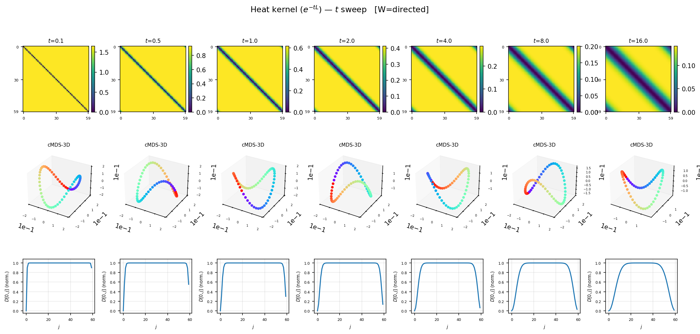

$L = \mathbf I - \mathbf W$ 가 비대칭. $e^{-tL}$ 의 행 $i$ 는 $i$ 위치에서 한 방향으로 Poisson 분포를 따라 펴진다. 행 간 L2 거리는 두 분포의 *shift magnitude* 에만 의존하므로 회전 대칭 → output 자체는 symmetric. 이는 §4.5 의 $\rho_{\mathrm{asym}} = 0$ 결과와 일치.

### 4.4.3 PPR

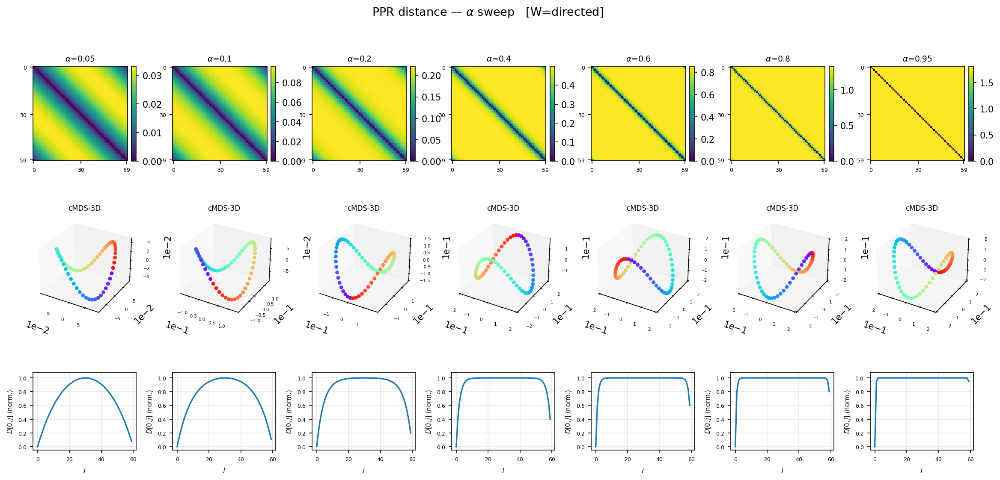

$\mathbf p_i = \alpha \mathbf e_i + (1-\alpha) P^\top \mathbf p_i$ 로부터 $\mathbf p_i$ 가 $i$ 위치에서 한 방향으로 geometric 감쇠. Heat kernel 과 같은 이유로 거리 자체는 회전 대칭 (symmetric output).

### 4.4.4 Spectral embedding

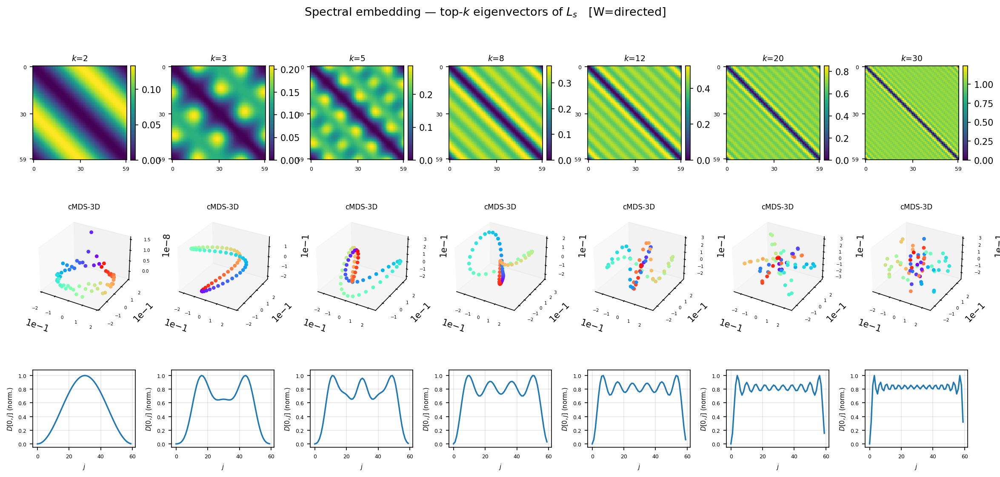

대칭화 라플라시안 $L_s$ 가 본질적으로 절반 가중치 *undirected* cycle 의 라플라시안에 해당하므로, 결과적으로 §3.4.4 와 동일한 형상이 나타난다 (directed 정보 완전 소실).

### 4.4.5 HST

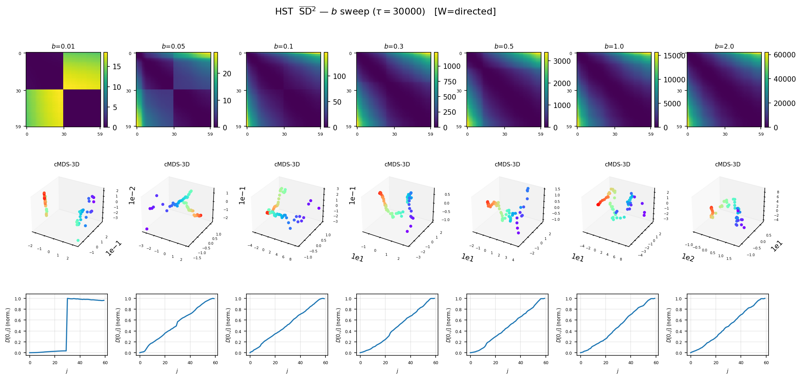

HST 의 walker dynamics 는 $\mathbf W$ 를 대칭화하지 않고 그대로 받아들이므로, $b$ 중간값에서 비대칭으로 비틀린 cylinder 형태가 나타나는 등 directional 정보의 흔적이 일부 보존된다.

## 4.5 비대칭-정직 분석

§3.5 와 동일한 분류·동일한 파라메터 구성으로 비대칭-정직 분석을 수행한다. 핵심 검증 항목은 **파라메터 거리들의 결과가 *어떤 파라메터 값에서도* $\rho_{\mathrm{asym}} = 0$ 으로 수렴**하는지 — 즉 directed cycle 위에서의 symmetric output trap 이 파라메터 의존이 아닌 *구조적* 한계인지 — 이다.

### 4.5.1 비파라메터 5종

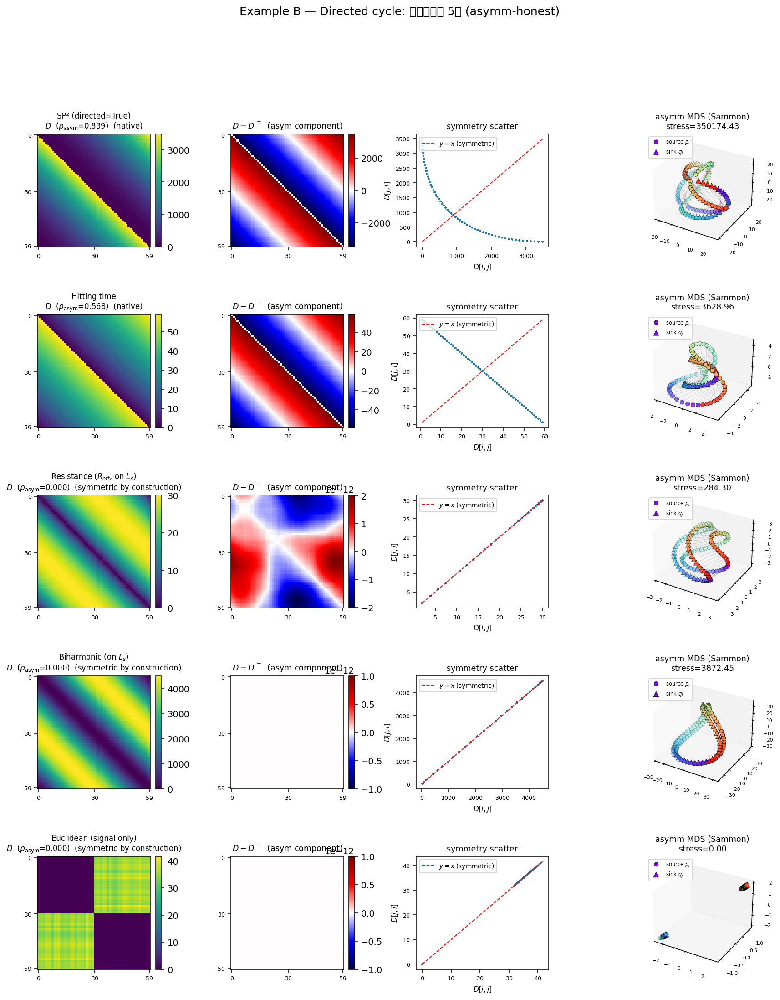

| 거리 | $\rho_{\mathrm{asym}}$ | 분류 | 해석 |
|:---|---:|:---|:---|
| **Shortest path² (`directed=True`)** | **0.8389** | native | $D[i, j] = \bigl((j - i) \bmod n\bigr)^2$. 명확한 비대칭. heatmap 사선, scatter 가 $y = x$ 에서 좌우로 갈라짐, Sammon dual MDS 에서 source ring 과 sink ring 이 회전 offset 으로 분리. |
| **Hitting time** | **0.5676** | native | $\mathbb E_{v_i}[\tau_{v_j}] = (j - i) \bmod n$. SP 와 동일한 비대칭 구조. |
| Resistance ($R_{\mathrm{eff}}$, on $L_s$) | 0.0000 | symmetric by construction | 정의상 $L_s$ 사용 — 비대칭 $\mathbf W$ 정보 차단. |
| Biharmonic (on $L_s$) | 0.0000 | symmetric by construction | 같음. |
| Euclidean (signal only) | 0.0000 | symmetric by construction | 신호만 사용, 그래프 정보 미반영. |

### 4.5.2 Diffusion — $t \in \{1, 2, 4, 8, 16, 32, 64\}$ ($\pi$-weighted)

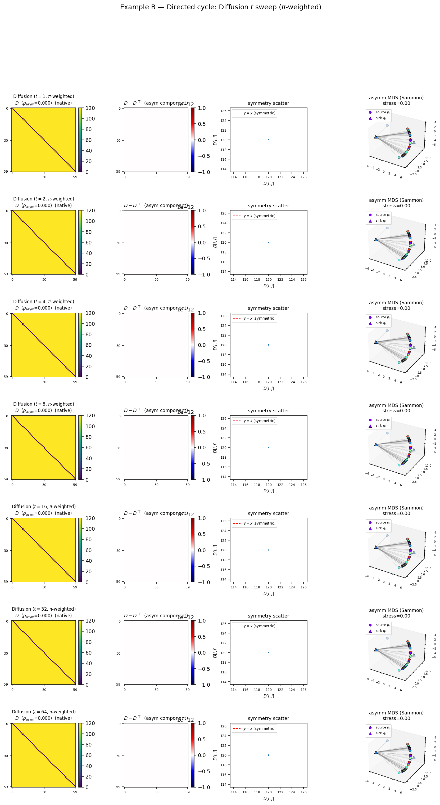

모든 $t$ 에서 $\rho_{\mathrm{asym}} = 0.0000$. $P$ 가 permutation 행렬이므로 $P^t$ 도 permutation 이고, $D[i, j] = \sum_k(P^t_{ik} - P^t_{jk})^2 / \pi_k$ 가 모든 $i \neq j$ 쌍에서 상수로 떨어진다 (degenerate). $t$ 와 무관한 자명한 대칭.

### 4.5.3 Heat kernel — $t \in \{0.1, 0.5, 1, 2, 4, 8, 16\}$

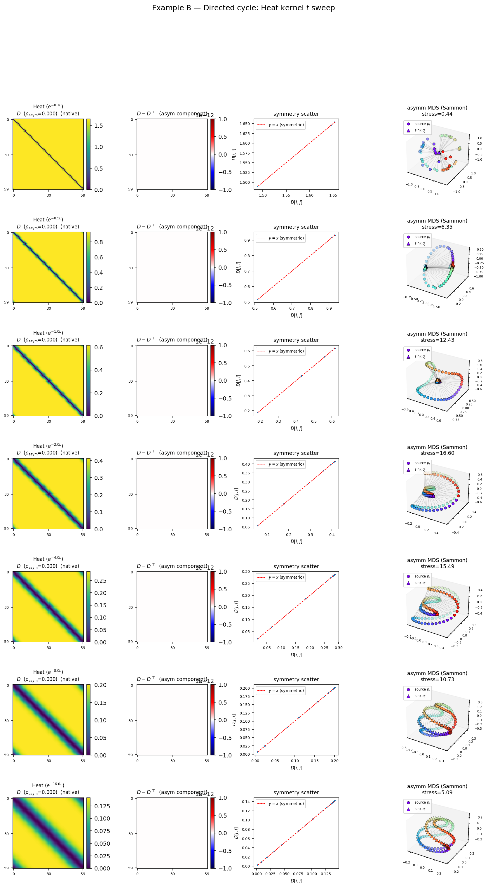

모든 $t$ 에서 $\rho_{\mathrm{asym}} = 0.0000$. $e^{-tL}$ 의 행 $i$ 가 한 방향 Poisson 분포로 펴지지만, 두 행 사이 L2 거리가 *shift magnitude* 의 함수로만 떨어져 회전 대칭이 강제됨.

### 4.5.4 PPR — $\alpha \in \{0.05, 0.1, 0.2, 0.4, 0.6, 0.8, 0.95\}$

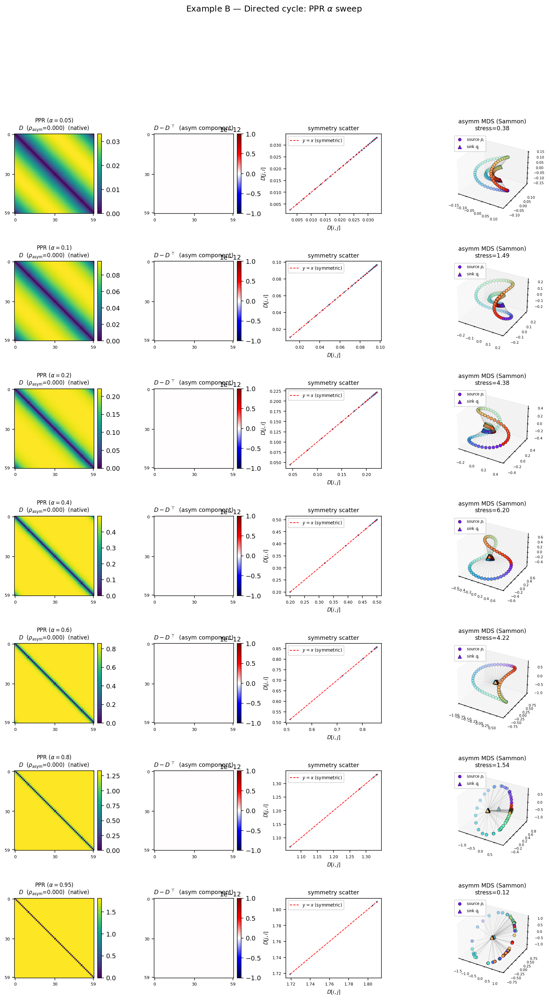

모든 $\alpha$ 에서 $\rho_{\mathrm{asym}} = 0.0000$. $\mathbf p_i = \alpha\mathbf e_i + (1-\alpha) P^\top \mathbf p_i$ 가 한 방향 geometric decay 를 만들지만, 분포 사이 L2 거리는 같은 이유로 회전 대칭.

### 4.5.5 Spectral embedding — $K \in \{2, 3, 5, 8, 12, 20, 30\}$

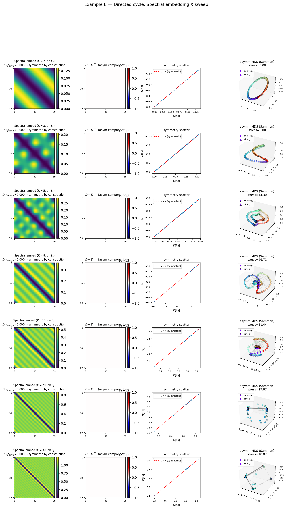

모든 $K$ 에서 $\rho_{\mathrm{asym}} = 0.0000$. 정의상 $L_s$ 의 고유벡터를 사용하므로 자명한 대칭.

### 4.5.6 정리

비파라메터 5종 + 파라메터 4종 × 7개 파라메터 값 = 총 33개 측정에서, $\rho_{\mathrm{asym}} > 0$ 을 보이는 거리는 오직 **Shortest path² (`directed=True`) 와 Hitting time** 둘뿐이다. 나머지 거리들이 directed cycle 위에서 모두 symmetric output 으로 떨어지는 것은 *파라메터 선택에 무관한 구조적 한계* 이며, 다음 두 메커니즘으로 분해된다:

- (i) **회전 대칭성 trap** (Diffusion / Heat / PPR) — directed cycle 의 회전 자기동형이 row-L2 형식의 거리를 두 정점 사이 shift magnitude 의 함수로만 환원시킨다. 입력은 비대칭이나 출력은 대칭.
- (ii) **$L_s$ 강제 대칭화** (Resistance / Biharmonic / Spectral) — 정의 자체가 대칭 라플라시안을 요구하므로, 비대칭 $\mathbf W$ 의 정보가 거리 정의 단계에서 이미 소거.

따라서 §4.2–§4.4 의 모든 그림에서 directed cycle 결과가 §3.2–§3.4 의 Gaussian ring 결과와 비슷하게 보였던 이유는 (i)·(ii) 와 알고리즘적 대칭화 (SP `directed=False` 등) 가 결합한 것이며, *어떤 파라메터 조정으로도* 이 한계는 우회되지 않는다.

**directed cycle 위에서 directional 정보를 거리 행렬 수준까지 보존하는 것은 Shortest path² (`directed=True`) 와 Hitting time 뿐이다.** 본 sweep 으로 *strong robustness* 가 확보된 결론이다.

---

# 5. 정리

본 노트의 결과를 거리 분류 관점에서 다음과 같이 갱신할 수 있다.

**(A) Spectral filter family (graph-only).** Diffusion / Heat / PPR / Resistance / Biharmonic / Spectral embedding 은 spectral filter $f(\lambda)$ 의 차이로 통합된다 ([§5.1](260425_64440a.html)). 정규 ring 위에서는 $f$ 의 형태에 거의 무관하게 비슷한 ring 임베딩을 산출한다. 파라메터 ($t, \alpha, K$) 는 분해능의 다이얼이다.

**(B) Path-only family.** Shortest path. 매개변수가 없으며, 한 경로에 의존하므로 노이즈에 민감하나 directional 정보를 가장 직접적으로 보존한다 (§4.5 결과 참조).

**(C) Signal-aware family.** Euclidean (signal only) 과 HST (signal+graph). HST 는 $b$ 와 $\tau$ 를 통해 (B)–(A)–(C) 사이의 매끄러운 가족을 형성한다.

**(D) Directed-aware family — 본 노트의 새 분류.** §4.5 의 sweep 결과 (33개 측정) 에서 비대칭 입력으로부터 비대칭 *출력* 까지 보존하는 거리는 Shortest path² (`directed=True`) 와 Hitting time 둘뿐이다. 나머지 native 분류 거리 (Diffusion / Heat / PPR) 는 회전 대칭 그래프에서 row-L2 형식이 shift-magnitude 함수로 환원되는 trap 에 빠지며, $L_s$ 기반 거리 (Resistance / Biharmonic / Spectral) 는 정의 자체에서 비대칭이 소거된다.

ex2 setting 이 HST 의 고유 가치를 충분히 보이지 못하는 이유는 [예제2 재검토](260425_6dc8c6.html) 에 정리되어 있다. 본 노트의 파라메터 스윕도 같은 방향의 결론을 보충 — $b$ 의 어떤 값에서도 cMDS 임베딩이 graph-only 또는 Euclidean 어느 한쪽으로 수렴하며, *진정 새로운* 형태가 나타나는 regime 은 좁다.

---

# 6. 다음

- 같은 분석 파이프라인을 [예제 6 (parity cycle)](260424_연구_HST_*) / [예제 7 (twin rings)](260424_연구_HST_*) / [예제 8 (directed cycle)](260424_연구_HST_*) 에 동일하게 적용. 이 노트의 5단계 구조를 그대로 사용.
- $b \times \tau$ 2차원 sweep — convergence rate 까지 동시에 조망.
- 본 노트의 비대칭-정직 분석에 HST 를 별도 거리 정의로 추가 검토 (현재는 분석에서 제외). $\overline{\mathrm{SD}}^2_{ij} = \tau^{-1}\sum_\ell (h_i(\ell) - h_j(\ell))^2$ 가 squared-norm 형태이므로 자명히 대칭 출력으로 떨어지지만, $\mathbf h_i$ 의 dynamics 자체에는 비대칭 정보가 보존되어 있을 가능성. lag-aware stress, source/sink 분리 height 등의 변형 거리 후보가 있다.
- 더 비대칭적인 directed 그래프 (DAG, 비균등 cycle bias 등) 위에서 동일한 분석. directed cycle 은 회전 대칭이 너무 강해 walk-family 의 한계만 부각되고 *진짜 차이* 는 나타나지 않는다.
- 파라메터별 cMDS 임베딩 사이의 Procrustes / spectral entropy 정량화.