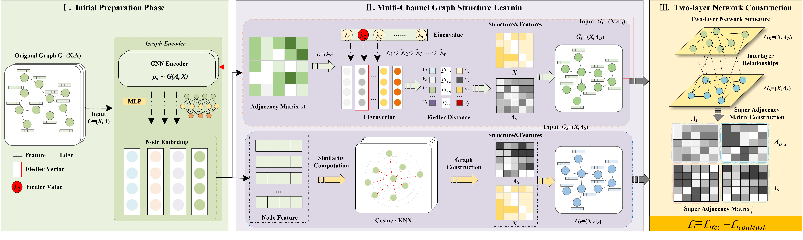
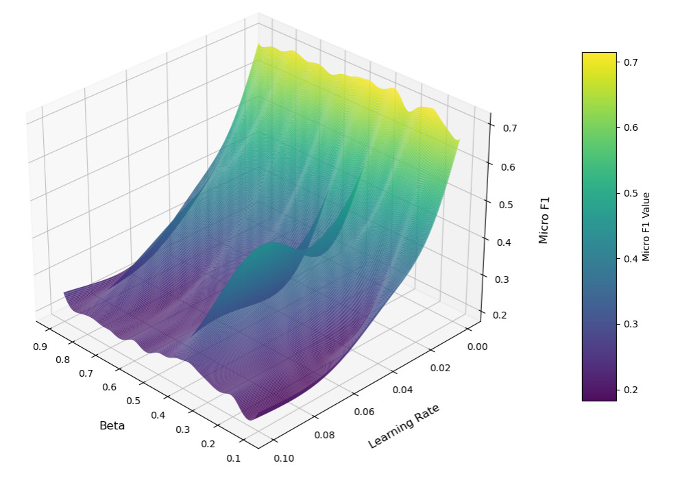

http://doi.org/10.32604/journal.2026.000000

ARTICLE

# D2GSL: Self-supervised Dual-Layer Structure-Driven Graph Structure Learning

Juncheng Zhang$^{1,2}$, Xuhao Wei$^{1,2}$, Xiaolei Gu$^3$, Haixing Zhao$^{4,*}$, Zhonglin Ye$^{1,2,5,*}$

$^1$ School of Computer, Qinghai Normal University, Xining 810008, China
$^2$ State Key Laboratory of Tibetan Intelligent, Xining 810008, China
$^3$ Qinghai Provincial Public Security Department, Xining 810000, China
$^4$ College of Intelligent Science and Engineering, Qinghai Minzu University, Xining 810007, China
$^5$ Graduate School of Engineering, Nagasaki Institute of Applied Science, Nagasaki 851-0193, Japan
*Corresponding Author: Haixing Zhao. Email: h.x.zhao@163.com, Zhonglin Ye. Email: yezhonglin@qhnu.edu.cn

Version March 30, 2026; submitted to Journal Not Specified

## 초록

그래프 구조 학습은 그래프 데이터의 무결성과 신뢰성에 의존한다. 그러나 실제 환경의 그래프는 흔히 잡음, 정보 결손, 편향을 포함하고 있어 기존 모델의 표현 능력을 제약한다. 단일 계층 구조 학습 방법은 국소적 상호작용과 전역 구조를 동시에 포착하지 못한다. 또한 고품질의 레이블 데이터에 의존하기 때문에 레이블 희소성과 높은 주석 비용 문제가 발생한다. 이러한 문제를 해결하기 위해, 본 논문은 D2GSL이라는 자기지도 이중 계층 구조 기반 그래프 구조 학습 방법을 제안한다. D2GSL은 의미적 유사도 채널과 스펙트럼 특징 채널을 구성하여 국소 의미 및 전역 스펙트럼 관점에서 노드 관계를 모델링한다. 본 방법은 계층 간 노드 대응 관계를 명시적으로 모델링하고 채널 간 결합 구조 재구성을 가능하게 하는 초인접 행렬(hyperadjacency matrix)을 도입한다. 또한 구조 재구성 제약을 적용하고 대조 학습 메커니즘을 채택하여 자기지도 환경에서의 구조 표현을 개선한다. 실험 결과 D2GSL은 공개 벤치마크 데이터셋에서 주류 기준 모델을 능가하며, 구조적 잡음과 레이블 희소성 조건에서 강력한 효과를 보임을 입증한다.

## 핵심어

Graph Structure Learning; Dual-layer Structure; Hyperadjacency Matrix; Graph Contrastive Learning

# 1 서론

최근 몇 년 동안 그래프 신경망(Graph Neural Networks, GNNs) 기반 방법은 소셜 네트워크[1,2], 교통 네트워크[3,4], 생물정보학[5,6] 등 다양한 분야에 폭넓게 적용되어 왔다. 그래프 구조는 다재다능하고 유연한 데이터 표현으로서 복잡한 관계형 데이터를 효과적으로 포착한다. GNN은 노드 사이의 인접 관계에 기반하여 정보를 전파하고 특징을 집계함으로써 노드, 엣지 또는 전체 그래프의 고수준 표현을 학습한다. 이들은 노드 분류[7,8], 링크 예측[9,10], 그래프 분류[11,12], 노드 군집화[13,14]와 같은 다양한 그래프 학습 과제에서 뛰어난 일반화 성능을 보여주었다. 전형적인 GNN 모델에서는 메시지 전달(message-passing) 메커니즘이 사용되며, 각 계층에서 노드는 이웃 노드의 특징을 집계하고 자신의 특징과 결합하여 자신의 표현을 갱신한다.

GNN이 강력한 표현력과 모델 유연성을 보여주었지만, 여전히 핵심적인 한계에 직면해 있다. 대부분의 GNN 방법은 한 가지 근본적인 가정에 의존하는데, 즉 원래의 그래프 구조가 노드 간의 진정한 관계를 안정적으로 반영하고 다운스트림 과제에 충분한 지침을 제공한다고 가정한다. 그러나 이 가정은 실제 그래프 데이터에서는 충족되기 어렵고 지나치게 이상적인 경우가 많다. 실제로 그래프 구조에는 잡음, 정보 결손, 편향[15] 같은 문제가 종종 동반된다. 예를 들어, 소셜 네트워크에는 조작된 관계나 정보 단절이 포함될 수 있다. 분자 그래프에는 핵심 화학 결합 연결이 누락될 수 있다. 인용 네트워크에는 중복되거나 부정확한 인용 관계가 포함될 수 있다. 이러한 구조적 결함은 GNN의 학습 성능에 큰 영향을 미쳐 모델 성능 저하와 일반화 능력 제약으로 이어진다.

앞서 언급한 문제를 해결하기 위해 그래프 구조 학습(Graph Structure Learning, GSL)이 점차 효과적인 해결책으로 자리 잡으며 다양한 분야에 폭넓게 적용되어 왔다. GSL은 학습 과정 중에 그래프 구조를 동적으로 구성하거나 최적화함으로써, 그래프 합성곱 신경망(Graph Convolutional Networks, GCNs)이 불완전하거나 잡음이 있거나 편향된 그래프 데이터를 다룰 때에도 더 강건하고 표현력 있는 노드 표현을 학습할 수 있게 한다. GSL 방법은 잠재적인 의미적 연관성을 드러내고 노드 간 정보 전파의 효율성을 향상시키는 데 도움을 준다. 또한 다운스트림 과제에 대한 구조 적응력을 높이고 모델의 표현 능력과 일반화 성능을 한층 강화한다. 최근 몇 년 동안 연구자들은 그래프 구조 구성과 최적화를 위한 다양한 전략을 제안해 왔다. 이러한 전략에는 거리 학습 기반 방법[16-18], 구조 생성을 위한 확률적 표본 추출 방법[19-21], 그리고 인접 행렬을 학습 가능한 파라미터로 취급하여 직접 최적화하는 종단간(end-to-end) 접근법[22,23]이 포함된다. 이러한 방법들은 그래프 구조 학습의 유연성과 표현력을 어느 정도 향상시켜 그래프 신경망의 성능 개선에 기여했다. 그러나 대부분의 기존 방법은 여전히 지도 학습 틀 안에서 그래프 구조를 최적화하고 있어, 구조 조정을 안내하는 데 레이블 정보에 크게 의존한다. 이는 레이블 데이터가 부족한 실제 시나리오에서 중대한 제약이 된다. 많은 방법들이 여전히 정적이고 단일한 구조적 관점에 의존한다. 이러한 한계는 모델이 서로 다른 의미 공간에서 노드 간의 복잡한 관계를 포착하기 어렵게 만든다. 일부 방법들은 채널 간의 구조적 상호작용을 학습하지 못한다. 이 약점은 다중 관점(multi-view) 정보 융합의 효과를 감소시키고 모델의 강건성을 떨어뜨린다.

이러한 문제를 고려하여, 본 논문은 D2GSL이라는 자기지도 이중 계층 구조 기반 그래프 구조 학습 방법을 제안한다. 본 방법은 레이블 지도에 의존하지 않고 다중 채널 구조 정보를 통합하여 더 강한 표현력을 갖는 그래프 구조 표현을 구축하는 것을 목표로 한다. D2GSL은 먼저 노드 임베딩에 기반하여 두 개의 구조적 채널을 구성한다. 의미적 유사도 채널은 노드 간의 국소적 의미 관계를 포착한다. 스펙트럼 특징 채널은 전역 구조 패턴을 포착한다. 두 종류의 구조적 정보를 더욱 통합하기 위해, 본 논문은 이중 계층 네트워크 구조를 설계한다. 두 채널 그래프는 독립된 그래프 계층으로 취급되고, 계층 간 연결을 통해 초인접 행렬(hyperadjacency matrix)이 구성된다. 이러한 채널 간 융합은 국소 정보와 전역 정보 사이의 결합을 포착하고 학습된 구조의 전체 표현력을 강화한다. 본 논문은 또한 구조 재구성 제약을 도입한다. 이 제약은 각 채널 구조와 전체 구조 사이의 일관성을 유지하며 정보 손실이나 중복을 줄인다. 또한 자기지도 환경에서 원래 그래프의 의미를 보존하기 위해 대조 학습 메커니즘이 통합된다. 본 논문의 주요 기여는 다음과 같이 요약된다:

- 의미적 유사도 채널과 스펙트럼 특징 채널을 구성한다. 이 두 시점은 그래프 정보를 국소 의미 및 전역 스펙트럼 관점에서 포착하고, 그래프 구조의 표현력과 다중 노드 표현의 이해도를 향상시킨다.
- 이중 계층 그래프 구조가 설계되고 초인접 행렬이 도입되어 다중 채널 구조 정보를 통합한다. 대조 학습 목적과 구조 재구성 손실을 결합한 이중 채널 협력 최적화 메커니즘이 적용되어 채널 간의 일관성을 향상시키고 표현 공간과 구조 공간의 식별 능력을 강화한다.
- 다수의 실세계 데이터셋에서 광범위한 실험을 수행하였으며, 결과는 기준 방법들과 비교하여 D2GSL이 노드 분류 과제에서 강력한 성능을 달성함을 보여준다.

# 2 관련 연구

## 2.1 그래프 신경망

GNN은 그래프 구조 데이터를 다루는 강력한 도구로서 노드 분류와 링크 예측 등의 과제에서 뛰어난 성능을 보여 왔다. GCN[24]과 같은 초기 방법들은 이웃 특징을 국소적으로 집계하여 노드 표현을 갱신하고, 그래프 신경망이 더 깊은 네트워크 구조를 학습할 수 있는 토대를 마련했다. 이를 바탕으로 연구자들은 다양한 GNN 구조 변형과 개선안을 제안하여 모델 성능과 확장성을 한층 향상시켰다. 예를 들어 GAT[25]는 메시지 전달에 어텐션 메커니즘을 도입해 이웃 노드에 다른 가중치를 부여함으로써 모델이 특징 집계 과정에서 식별 능력을 갖게 하였다. GraphSAGE[26]는 확장 가능한 이웃 표본 추출 전략을 채택하여 GNN이 효율적으로 대규모 그래프 데이터를 처리할 수 있게 한다. ChebNet[27]은 체비셰프 다항식으로 그래프 합성곱 연산을 근사하여 모델의 표현력과 계산 효율성을 향상시킨다. 해당 분야의 발전과 다양한 GNN 모델에 관한 추가 정보는 최신 종설[28-30]을 참고하기 바란다.

## 2.2 그래프 구조 학습

GSL은 그래프 머신 러닝 분야의 핵심 연구 영역이다. 학습 과정에서 그래프의 잠재적 구조를 동적으로 최적화하고자 한다. 이러한 최적화는 노드 분류, 링크 예측, 그래프 분류와 같은 다운스트림 과제의 성능을 향상시킨다. 기존 연구는 그래프 구조의 표현력과 강건성을 향상시키는 다양한 방법을 제안해 왔다. CoGSL[18]은 그래프 구조 학습을 위한 정보-이론적 그래프 구조 학습 방법을 제안한다. 다중 시점 그래프 구조에서 핵심 정보를 추출하는 것을 목표로 하며, 다운스트림 과제에 견고하고 잉여 잡음을 적게 갖는 그래프 구조를 구축한다. 이 방법은 노이즈와 외란에 대한 모델의 강건성을 유지하면서 예측 성능을 향상시키는 데 도움이 된다.

IDGL[16]은 그래프 구조 학습을 유사도 측정 문제로 다룬다. 다중 헤드 코사인 유사도와 $\epsilon$-이웃 희소화를 결합하여 적응적 그래프를 생성한다. 이는 과제 손실과 그래프 정규화 항을 동시에 최적화하여 잡음에 강하고 적대적 공격에 잘 견디며 GNN의 파라미터 학습을 함께 안내한다. 그래프의 본질적 특성을 활용하여 표현력을 더욱 끌어올리고 잡음, 희소성, 특징 비대칭에 대한 강건성을 향상시킨다. TO-GCN[31]은 노드 토폴로지를 함께 정제하고 측면 정보를 사용해 완전 연결 네트워크의 파라미터를 학습한다. SUBLIME[32]은 자기 강화 신호를 대조 학습을 통해 구성하고 자기지도 그래프 구조 학습 목적을 함께 최적화하며, 비지도 그래프 구조 학습이 가능하게 한다.

PROSE[33]는 상태 인지 점진적 그래프 구조 학습 프레임워크를 제안한다. 노드 간 관계를 우선순위화하고 점진적으로 그래프 구조를 확장하여 학습 그래프의 강건성을 유지한다. 이 방법은 잡음 환경에서의 인접 관계와 표현 학습 능력을 효과적으로 처리한다. GEN[15]은 GNN 학습 과정을 향상시키기 위해 그래프 구조 추정 신경망을 제안한다. 이 모델은 동적으로 그래프 구조를 최적화하고 학습 가능한 파라미터를 도입함으로써 모델의 표현력을 강화한다. 한편, GEN은 GNN 학습의 강건성을 높이고 다운스트림 과제 성능을 개선한다. 이러한 방법들은 다양한 시나리오에서 그래프 구조 학습의 표현력과 강건성을 어느 정도 향상시켰지만, 한계는 여전히 존재한다. 대부분의 기존 방법은 비지도 학습 프레임워크에서 작동하지만, 레이블 비용이 높은 실세계 시나리오에서는 효율이 제한된다. 또한, 대부분의 방법은 정적이고 단일한 구조적 관점에 의존한다. 이 한계는 다른 의미 공간에서 노드 간의 표현 능력을 포착하기 어렵게 만들고, 다중 채널 정보의 표현력을 감소시킨다.

## 2.3 그래프 대조 학습

그래프 대조 학습(Graph Contrastive Learning, GCL)은 비지도 그래프 표현 학습 분야에서 중요한 진보를 이룩했다. 최근 몇 년 동안 그 핵심 아이디어는 데이터 증강을 통해 양성·음성 쌍을 구성하여 그래프 수준 표현의 식별성과 일반화 능력을 향상시키는 것이다. 이 설계는 레이블 정보의 의존성을 제거하며 연구자들로부터 광범위한 주목을 받았다. DGI[34]는 노드 임베딩을 향상시키고 글로벌 그래프 구조를 최대화함으로써 글로벌 구조를 캡처하는 학습 능력을 개선한다. MVGRL[35]은 다중 시점 학습을 적용하여 다른 수준의 대조를 보장한다. 그래프 구조 정보를 캡처하고, 비슷한 의미를 가진 의미적 특징과 식별 가능한 다른 특징을 구별하여, 다운스트림 과제에서 분류 정확도가 크게 떨어지는 결과를 낳는다. GRACE[36]는 노드 수준 대조 학습 전략을 도입함으로써 노드 임베딩의 식별성과 강건성을 향상시킨다. 인접 행렬을 통해 노드와 엣지를 마스킹하여 강건한 자기지도 노드 표현을 학습한다. 이러한 방법들은 노드 또는 그래프 표현 학습의 진보를 이끌어 왔지만, 대부분은 단일 대조 시점만 사용하고 다중 채널 구조 정보를 거의 활용하지 않는다.

# 3 문제 정의

무방향 그래프 $G = (V, E)$에서 $V = \{v_1, v_2, \dots, v_N\}$은 노드 집합을 나타내고, $E \subseteq V \times V$는 엣지 집합을, $X \in \mathbb{R}^{N \times d}$는 노드의 특징 행렬을 나타내며 여기서 $d$는 특징의 차원 수이다. 인접 행렬 $A$는 $a_{ij} = 1$이면 노드 $v_i$와 $v_j$ 사이에 엣지가 있고, 그렇지 않으면 $a_{ij} = 0$으로 그래프 구조를 표현한다. GCN과 같은 그래프 신경망은 인접 구조를 활용하여 메시지 전파와 특징 집계를 수행하며, 다음 식으로 표현된다:

$$H^{(l+1)} = \sigma\!\left( D^{-1/2}\, \tilde{A}\, D^{-1/2}\, H^{(l)}\, W^{(l)} \right) \tag{1}$$

여기서 $H^{(l)}$은 $l$번째 계층에서의 노드 특징을 나타내며, 초기 입력은 $H^{(0)} = X$ ($\tilde{A} = A + I$는 자기 루프를 더한 인접 행렬, $D$는 차수 행렬, $W^{(l)}$은 $l$번째 계층의 학습 가능한 가중치 행렬, $\sigma(\cdot)$는 비선형 활성화 함수)이다. 그러나 실세계 그래프에서는 종종 잡음이나 불완전한 데이터와 같은 문제가 있어 노드 사이의 진정한 관계를 충분히 포착하기 어렵게 만들고, 표현 능력을 향상시키기 위해 지도 하에 향상된 그래프 구조의 구성을 안내할 필요가 있다.

정의 1 (Fiedler Value 및 Fiedler Vector). 그래프 이론에서 무방향 그래프의 라플라시안 행렬은 그 구조를 라플라시안 행렬로 특징짓는다. 무방향 정규화 라플라시안 행렬은 다음과 같이 정의된다:

$$L = I - D^{-1/2}\, A\, D^{-1/2} \tag{2}$$

여기서 $A$는 인접 행렬, $D$는 그래프의 차수 행렬, $I$는 단위 행렬이다. 정규화된 그래프 라플라시안 행렬 $L$은 양의 준정부호이며, 모든 고유값은 $0 \leq \lambda_0 \leq \lambda_1 \leq \cdots \leq \lambda_{N-1}$로 음이 아닌 실수이다. $\lambda_0 = 0$임에 유의하자. 두 번째로 작은 고유값 $\lambda_1$은 그래프의 Fiedler value로 불리고, 그에 대응하는 고유벡터는 Fiedler vector로 불린다.

정의 2 (다중 계층 네트워크). 다중 계층 네트워크는 $M = (G, \varepsilon_c)$로 표현되며, $G = \{G_\alpha; \alpha \in \{1, 2, \dots, M\}\}$은 $M$개의 방향 또는 무방향 그래프의 클래스이며 각 $G_\alpha = (V_\alpha, E_\alpha)$이다. 계층 간 엣지 집합 $\varepsilon_c$는 다음과 같이 정의된다:

$$\varepsilon_c = \{ E_{\alpha\beta} \subseteq V_\alpha \times V_\beta \mid \alpha, \beta \in \{1, \dots, M\}, \alpha \neq \beta \} \tag{3}$$

이는 동일한 계층 또는 서로 다른 계층의 노드 사이의 상호 연결 집합을 나타낸다 ($\alpha = \beta$일 때 또는 $\alpha \neq \beta$일 때). $\varepsilon_c$의 원소는 cross-layer edges로 불린다. 각 $E_{\alpha\alpha}$는 계층 간 엣지의 집합으로, $M$의 계층 내 엣지로 간주된다 ($\alpha = \beta$).

정의 3 (그래프 구조 학습). 무방향 그래프 $G = (V, E)$가 주어지면, GSL은 인접 행렬 $A \in \{0, 1\}^{N \times N}$ (또는 확률 행렬 $P(A)$)를 최적화하여 목적 함수 $\mathcal{L}$을 최소화한다. 그래프 구조 학습 메커니즘은 다음과 같이 표현된다:

$$\hat{A} = \arg\min_A \mathcal{L}(A, X, \Theta) + R(A) \tag{4}$$

여기서 $\Theta$는 모델 파라미터를 나타내고, $\mathcal{L}(A, X, \Theta)$는 그래프 구조와 예측된 그래프 구조 사이의 차이를 정량화하는 구조 손실 함수이며, $R(A)$는 인접 행렬 $A$의 희소성이나 복잡도를 제어하는 정규화 항이다.

정의 4 (그래프 대조 학습). GCL의 목적은 차원 축소된 공간으로 노드 표현을 사상하는 사영 함수 $f_\theta : \mathbb{R}^{N \times d} \to \mathbb{R}^{N \times k}$를 학습하는 것이다. 여기서 $d$는 입력 특징의 차원이고 $k$는 차원 축소된 공간의 차원이다. 목적 함수는 다음과 같이 최적화된다:

$$\mathcal{L}(f_\theta(G_1), f_\theta(G_2)) = -\sum_{i=1}^N \log \frac{\exp(\text{sim}(f_\theta(z_i^{(G_1)}), f_\theta(z_i^{(G_2)})))}{\sum_{j=1}^N \exp(\text{sim}(f_\theta(z_i^{(G_1)}), f_\theta(z_j^{(G_2)})))} \tag{5}$$

최적의 사영 함수는 다음으로 얻어진다:

$$\hat\theta = \arg\min_\theta\, \mathcal{L}(f_\theta(G_1), f_\theta(G_2)) \tag{6}$$

여기서 $\text{sim}(z_i, z_j)$는 노드 $i$와 노드 $j$의 표현 사이의 유사도를 나타내며, $G_1$과 $G_2$는 그래프의 서로 다른 시점을 나타낸다.

# 4 방법론

이 절에서는 자기지도 GSL 프레임워크의 전체 구조를 그림 1에 나타낸 대로 자세히 설명한다.

그림 1: 제안된 D2GSL의 전체 프레임워크. D2GSL은 먼저 의미 유사도 채널 그래프를 구성하고 Fiedler 벡터를 활용해 스펙트럼 특징 채널 그래프를 생성한다. 그런 다음, 다중 채널 그래프 구조와 계층 간 상호작용을 결합하여 그래프의 표현 능력을 향상시킨다. 또한 두 채널 그래프의 의미와 하이퍼인접성-기반 정보 손실 사이의 구조적 차이를 최소화하여 정보 압축과 일관성을 동시에 유지한다. 마지막으로, 원본 그래프의 기저 구조 정보를 보존하기 위해 대조 학습 목적을 사용한다.

D2GSL은 세 가지 주요 구성 요소로 이루어진다: 다중 채널 그래프 구조 학습 모듈, 이중 계층 네트워크 구조 재구성 모듈, 그리고 결합 최적화 모듈. D2GSL은 먼저 의미 유사도 채널 그래프를 구성하고 Fiedler 벡터를 활용하여 전역 스펙트럼 구조를 포착하는 스펙트럼 특징 채널 그래프를 생성한다. 이 두 채널은 상호 보완적이며 함께 학습되어 의미적 및 구조적 수준 모두에서 그래프의 구조적 표현력을 향상시킨다. 두 채널 그래프는 그런 다음 이중 계층 그래프 구조로 구성된다. 초인접 행렬이 다중 채널 사이의 구조적 상호작용 관리를 가능하게 하기 위해 도입된다. 다음으로, 구조 재구성 손실이 두 채널 그래프와 초인접 행렬 사이의 구조적 차이를 최소화하기 위해 도입된다. 이 손실은 구조적 압축과 정보 보존을 모두 달성한다. 대조 학습 목적이 원본 그래프와 두 채널 그래프 사이의 구조적 차이를 정렬하기 위해 설계되었다. 이는 모델이 원본 그래프의 의미를 보존하면서 잠재적 구조 정보를 포착하도록 안내한다.

## 4.1 다중 채널 그래프 구조 학습

D2GSL은 국소 의미 및 전역 구조 관점에서 그래프 데이터의 깊은 학습을 달성하는 것을 목표로 한다. 이는 두 개의 상보적 채널을 구성하여 그래프에 내재된 다차원 구조 정보를 충분히 포착한다: 의미 유사도 채널 그래프와 스펙트럼 구조 채널 그래프.

### 4.1.1 의미 유사도 채널 그래프의 구성

노드 사이의 의미적 관계를 고려하여, 우리는 GCN 모델로 원본 노드 특징 $X \in \mathbb{R}^{N \times d}$를 사상한다. 모델은 $X$를 노드 임베딩 $H = f_\theta(X) \in \mathbb{R}^{N \times d}$로 변환한다. 각 임베딩 $h_i \in \mathbb{R}^k$는 노드 $v_i$의 특징 벡터를 나타낸다. 본 논문은 의미적 및 구조적 그래프 모두에 대한 두 가지 다른 그래프 구성 메커니즘을 설계한다.

(1) K-최근접 이웃

각 임베딩의 노드를 얻은 후, 노드 수 $N$과 그래프 표현의 차원을 가지고, 각 노드 $h_i \in \mathbb{R}^k$. 우리는 임베딩 사이의 유클리디언 거리를 최소화하여 $K$-최근접 이웃 방법을 사용한다. $A_S = \{(v_i, v_j) \mid v_j \in \text{KNN}(v_i), i \in \{1, \dots, N\}\}$로, 여기서 인접 행렬 항목은 임베딩의 $L^2$-노름의 음수 값으로 가중치를 부여하여 표현된다. $w_{ij} = \mathcal{O}(\| h_i - h_j \|^2)$. 마지막으로, 일부 엣지를 무작위로 제거하기 위해 DropEdge 기법을 적용하여, 정제된 그래프 $G_S = (X, A_S)$를 얻는다.

(2) 코사인 유사도

노드 사이의 의미적 관계를 더 잘 포착하기 위해, 또 다른 그래프 구성 방법은 노드 임베딩 사이의 코사인 유사도에 기반한다. 노드 $i$와 $j$ 사이의 코사인 유사도는 다음과 같이 계산된다:

$$\text{sim}_{ij}^{(s)} = \frac{h_i^\top h_j}{\| h_i \|_2 \| h_j \|_2} \tag{7}$$

이는 노드 $v_i$와 $v_j$ 사이의 관계의 방향성을 포착하며, 우리는 가장 높은 코사인 유사도를 가진 상위 $K$를 모든 노드에 대해 유지한다. 이는 $A_S = \{(v_i, v_j) \mid i, j \in \{1, \dots, N\}\}$로 표현된다. 우리는 위와 동일한 활성화 함수 $\varphi(\cdot)$와 DropEdge 기법을 적용하여 최종 그래프 $G_S = (X, A_S)$를 얻는다.

### 4.1.2 스펙트럼 특징 채널 그래프의 구성

특징 공간에서 그래프 구조의 표현력을 향상시키기 위해, 본 논문은 라플라시안 스펙트럼 분해 방법을 스펙트럼 그래프 이론에서 도입한다. 이 방법은 Fiedler 벡터의 두 번째 가장 작은 고유값을 그래프의 스펙트럼 특징 채널 그래프로 구성하며, 이는 전역적인 저주파 구조 특징을 포착하여 전역 연결 정보를 포착한다.

원본 그래프 $G = (V, E)$가 주어지면, 우리는 먼저 인접 행렬 $A$에 자기 루프를 더하여 인접 행렬 $A = A + I$를 도입한다. 차수 행렬 $D \in \mathbb{R}^{N \times N}$는 갱신된 인접 행렬 $A = A + I$의 노드 차수와 같으며, 그런 다음 우리는 대각선 원소가 노드 $v_i$의 차수와 같은 대각 행렬 $D_{ii}$를 갖는 차수 행렬 $D_{ii} = \sum_{j=1}^N A_{ij}$로 정규화한다. 다음으로, 우리는 정규화된 라플라시안 행렬을 $L = D - A$로 정의한다. 이 행렬은 대칭적이며 양의 준정부호이다. 두 번째로 작은 고유값 $\lambda_1 \leq \cdots$의 고유벡터는 그래프의 저주파 구조 특징과 함께 전역 연결성 정보를 포착한다.

그래프 $G = (V, E)$가 주어지면, 우리는 먼저 인접 행렬 $A$에 자기 루프를 더한다 — 결과적으로 $A = A + I$. 그런 다음, 우리는 정규화된 라플라시안 행렬을 $L = D - A$로 갱신한다. 다음으로, 우리는 정규화된 라플라시안 행렬을 $L = D - A$로 정의한다. 이 행렬은 대칭적이고 양의 준정부호이며, 그 두 번째 가장 작은 고유값에 해당하는 고유벡터는 저주파 구조 특징과 함께 전역 그래프 연결성 정보를 캡처한다.

이 벡터를 $f = u_2 \in \mathbb{R}^N$으로 표시하고 각 노드의 임베딩을 그 차수에 의해 표현한다.

## 4.2 이중 계층 네트워크 구조

본 논문은 다중 채널 그래프 학습을 기반으로 깊은 관계와 보완적 특징을 다른 채널 구조 사이에서 탐색한다. 이는 두 채널 학습을 위한 형식적 프레임워크를 도입하고, 이중 계층 그래프 구조를 구성하여, 그래프 네트워크 $M = ((G_D, G_S), \varepsilon_c)$를 만든다. 여기서 $G_D = (X_D, E_D)$와 $G_S = (X_S, E_S)$는 두 계층에 해당하는 그래프 구조를 나타내고, $\varepsilon_c$는 계층 간 상호작용 엣지 집합을 나타낸다.

두 그래프 사이의 계층 간 연결을 위해, 각 노드 $v_i^{(D)}$를 $G_D$ 그래프에서 골라 $G_S$ 그래프의 가장 비슷한 노드 상위 $K$를 선택하여 연결을 구축한다. 이 계층 간 엣지 집합 $\varepsilon_c$는 다음과 같이 정의된다:

$$\varepsilon_c = \bigcup_{i=1}^N \left\{ \bigl( v_i^{(D)}, v_j^{(S)} \bigr) \,\Big|\, v_j^{(S)} \in \text{TopK}\!\bigl(\text{sim}(h_i^{(D)}, h_j^{(S)})\bigr) \right\} \tag{8}$$

여기서 $h_i^{(D)}$와 $h_j^{(S)}$는 $G_D$와 $G_S$ 그래프의 노드 임베딩을 각각 나타내고, $\text{TopK}(\cdot)$는 가장 비슷한 노드 상위 $K$를 선택하는 것을 나타낸다.

위에서 설명한 절들에서, 우리는 이중 계층 그래프의 노드 집합 $X_D = x_1^{(D)}, x_2^{(D)}, \dots, x_{N_D}^{(D)}$로 노드 집합을 나타내기로 한다. $G_D$. 각 계층 $G_D$에 대해, 그 인접 행렬은 $A^{(D)} = (a_{ij}^{(D)}) \in \mathbb{R}^{N_D \times N_D}$로 식 (9)에 나타낸 대로 정의된다.

$$a_{ij}^{(D)} = \begin{cases} 1, & \text{if } (v_i^{(D)}, v_j^{(D)}) \in E_D, \\ 0, & \text{otherwise.} \end{cases} \tag{9}$$

$1 \leq i, j \leq N_D$에 대해, 계층 간 관계 $G_D$와 $G_S$는 다음 식에 나타낸 대로 두 그래프 사이의 중요한 cross-graph 관계를 반영한다. 그런 다음 우리는 cross-layer adjacency matrix $A^{(DS)} = (a_{ij}^{(DS)}) \in \mathbb{R}^{N_D \times N_S}$를 다음과 같이 정의한다:

$$a_{ij}^{(DS)} = \begin{cases} 1, & \text{if } j \in \text{TopK}(\text{dist}(h_i^{(D)}, h_j^{(S)})), \\ 0, & \text{otherwise.} \end{cases} \tag{10}$$

여기서 $N_D$와 $N_S$는 $G_D$와 $G_S$의 노드 수를 각각 나타내며, $h_i$와 $h_j^{(D)}$는 다른 계층에서 온 노드 임베딩을 나타낸다. 마지막으로, cross-layer 초인접 행렬 $\tilde{A}$는 이중 계층 네트워크에 대해 식 (11)에 정의된다:

$$A = \begin{pmatrix} A^{(D)} & A^{(DS)} \\ \bigl(A^{(DS)}\bigr)^\top & A^{(S)} \end{pmatrix} \in \mathbb{R}^{(M+N) \times (M+N)} \tag{11}$$

여기서 $A^{(DS)}$는 $G_D$와 $G_S$ 사이의 계층 간 연결을 나타낸다.

## 4.3 결합 최적화

표현 공간과 구조적 공간에서의 일관성을 유지하기 위해, 본 연구는 결합 최적화 목적을 도입한다. 이 목적은 다중 채널 그래프 구조에서 대조 학습 목적과 구조 재구성 손실을 결합하여, 다중 채널 정보가 의미 보존을 유지하고, 두 시점에서의 잠재적 표현이 잘 정렬되도록 한다. 첫째, 표현 공간의 일관성을 향상시키기 위해, 우리는 모델이 다른 채널의 노드 임베딩을 정렬하도록 강제하여, 동일한 노드 쌍 사이의 유사도를 최대화하고 음성 표본 쌍 사이의 유사도를 최소화한다. D2GSL은 의미 수준에서 채널 간 정렬을 달성한다. 이는 식 (12)의 다음 손실 함수에 의해 구체적으로 정의된다:

$$\mathcal{L}_{\text{con}} = -\sum_{i=1}^N \log \frac{\exp\!\bigl(\text{sim}(h_i^{(D)}, h_i^{(S)})/\tau\bigr)}{\sum_{j=1}^N \!\bigl[ \exp\!\bigl(\text{sim}(h_i^{(D)}, h_j^{(D)})/\tau\bigr) + \exp\!\bigl(\text{sim}(h_i^{(D)}, h_j^{(S)})/\tau\bigr) \bigr]} \tag{12}$$

여기서 $\text{sim}(\cdot)$은 코사인 유사도 함수를 나타내고 $\tau$는 온도 계수이다. 다음으로, 구조적 수준에서의 위상학적 일관성을 유지하기 위해, 이중 계층 네트워크 재구성 손실은 채널 간의 다중 채널 그래프, 구조적 정렬을 달성한다. 또한, 두 시점의 멀티채널 그래프, 구조 정렬은 두 그래프의 임베딩으로부터 구성된 더 높은 차수의 구조 표현으로 합쳐지며, 식 (11)에 의해 정의된다. D2GSL은 두 그래프의 임베딩으로부터 인접 행렬 $A^{(D)}$와 $A^{(S)}$를 예측하고, 그런 다음 구조 재구성 손실을 초인접 행렬 $\tilde{A}$와 두 행렬 사이에서 계산한다.

$$\mathcal{L}_{\text{rec}}(\tilde{A}, A^{(D)}) = -\frac{1}{N^2} \sum_{i=1}^N \sum_{j=1}^N \!\left[ w_p \cdot A^{(D)}_{ij} \log\!\bigl(\sigma(\tilde{A}_{ij})\bigr) + w_n \cdot \bigl(1 - A^{(D)}_{ij}\bigr) \log\!\bigl(1 - \sigma(\tilde{A}_{ij})\bigr) \right] \tag{13}$$

여기서 $\sigma(\cdot)$는 시그모이드 활성화 함수이며, $w_p$와 $w_n$은 양성 및 음성 표본의 가중치를 각각 나타낸다. 또한 희소 그래프에서의 불균등 엣지 분포 문제를 다루는 것이다. 최종 결합 최적화 목적은 식 (14)에서 정의된다.

$$\mathcal{L} = \beta \cdot \mathcal{L}_{\text{con}} + (1-\beta) \cdot \mathcal{L}_{\text{rec}} \tag{14}$$

이러한 이중 채널 결합 최적화 메커니즘을 통해 D2GSL은 표현 공간과 구조적 공간 모두에서 의미적 관점과 스펙트럼 관점에서 일관성을 달성한다.

# 5 실험

이 절에서는 제안된 D2GSL 방법의 성능을 다양한 과제와 데이터셋에서 비교 실험을 통해 평가한다. 이러한 실험은 D2GSL의 전반적인 효과성과 우수성을 검증한다.

## 5.1 실험 설정

데이터셋: D2GSL의 효과를 평가하기 위해, 광범위한 자기지도 노드 분류 실험을 세 개의 일반적으로 사용되는 데이터셋에서 수행한다. 데이터셋 속성에 대한 자세한 설명은 표 1에 제공된다.

표 1: 데이터셋 속성 통계.

| Datasets | Nodes | Edges | Classes | Features |
|----------|-------|-------|---------|----------|
| Cora     | 2708  | 5429  | 7       | 1433     |
| Citeseer | 3327  | 4732  | 6       | 3703     |
| DBLP     | 2975  | 2398  | 4       | 334      |

기준선: 본 연구는 비교 실험을 위해 일곱 개의 대표적인 기준선 모델을 선택한다. 자기지도 학습 방법은 고전적인 GCN과 GAT를 포함하고, 자기지도 학습 방법은 DGI, IDGL, GEN을 포함하며, 그래프 구조 최적화 방법은 ProGNN과 SUBLIME을 포함한다.

실험적 세부 사항: 제안된 D2GSL 방법에 대한 실험은 NVIDIA GeForce RTX 4070 Ti GPU가 장착된 컴퓨터에서 수행되었으며, PyTorch 1.10.1과 CUDA 11.3이 사용되었다. 모델은 두 계층 GCN을 인코더로 사용하여 공유된 파라미터를 사용한다. 세 데이터셋에 대한 최적의 실험 하이퍼파라미터는 표 2에 표시된다.

표 2: 자세한 파라미터 설정.

| Datasets | EP  | LR    | $\beta$ | $\tau$ | HD  |
|----------|-----|-------|---------|--------|-----|
| Cora     | 300 | 1e-3  | 0.4     | 0.5    | 512 |
| Citeseer | 400 | 1e-3  | 0.4     | 0.6    | 512 |
| DBLP     | 400 | 1e-3  | 0.4     | 0.5    | 512 |

표 2에서 EP는 학습 epoch 수, LR은 모델 파라미터 갱신 시 단계 크기를 제어하는 데 사용되고, $\beta$는 과제에 대한 hyperparameter이며, $\tau$는 온도 파라미터이고, HD는 은닉 계층 차원이다.

## 5.2 효과성 실험과 분석

이 연구에서, 우리는 다운스트림 과제로서 노드 분류를 평가한다. 실험 결과는 표 3에 표시되어 있으며, 가장 좋은 결과는 굵게 표시되어 있다.

표 3: 다른 데이터셋에 대한 노드 분류 결과.

| Method   | Cora Mi-F1 / Ma-F1 | Citeseer Mi-F1 / Ma-F1 | DBLP Mi-F1 / Ma-F1 |
|----------|--------------------|------------------------|---------------------|
| GCN      | 81.84±0.57 / 80.46±1.10 | 71.81±0.31 / 68.12±0.44 | 90.99±0.28 / 90.02±0.32 |
| GAT      | 82.80±0.50 / 81.80±0.30 | 72.10±1.00 / 67.10±1.30 | 91.13±0.40 / 90.22±0.37 |
| DGI      | 80.10±0.44 / 75.06±0.07 | 71.99±0.46 / 67.74±2.65 | 83.00±0.03 / 78.21±0.01 |
| IDGL     | 84.00±0.44 / 82.65±0.45 | 72.10±0.46 / 69.05±0.26 | 83.00±0.03 / 78.21±0.01 |
| GEN      | 81.36±0.49 / 80.16±0.46 | 72.90±0.49 / 68.43±0.72 | 89.77±0.67 / 87.54±0.52 |
| Pro-GNN  | 81.26±0.51 / 80.94±0.49 | 80.49±1.40 / 70.98±1.27 | 89.77±0.67 / 87.54±0.52 |
| SUBLIME  | 83.82±0.57 / 82.82±0.66 | 72.72±0.49 / 68.19±0.61 | 91.82±0.27 / 90.89±0.37 |
| D2GSL    | 85.12±0.83 / 83.54±0.71 | 73.45±0.42 / 68.74±0.21 | 91.76±0.30 / 89.32±0.45 |

표 3에서 보듯이, D2GSL은 세 개의 벤치마크 데이터셋: Cora, Citeseer, DBLP에서 기준 방법들에 비해 유의한 우수성을 보여준다. 구체적으로, Cora 데이터셋에서, 그 정확도는 기준선 방법들에 비해 1.12%와 0.89%만큼 GCN과 GAT를 각각 능가한다. 두 번째로 좋은 방법인 IDGL에 대해서, D2GSL은 Mi-F1에서 1.12%만큼 더 잘 수행한다. SUBLIME에 대해서, 이는 Mi-F1에서 1.30% 더 잘 수행한다. DBLP 데이터셋에서, D2GSL은 Mi-F1에서 SUBLIME과 비교하여 약간 떨어지지만 여전히 두 번째로 잘 수행하는 방법으로, SUBLIME(91.76% 대 91.82%)에 비해 약간 떨어진다. 그러나, 그것은 강건한 구조와 의미를 모두에서 다른 기준 데이터셋에 대해 결정적으로 성능을 발휘하며, 이러한 데이터셋들에 대한 D2GSL의 우수한 분류 능력을 입증한다. 이러한 결과들은 다음 결론을 도출하게 한다:

(1) 다중 채널 구조 모델링이 특징 표현을 강화한다: D2GSL은 의미적 유사도 채널과 스펙트럼 특징 채널을 구성하여, 이는 국소 의미와 전역 구조 정보를 별도로 포착한다. 두 채널은 상보적이며, 모델이 균형 있고 식별성이 풍부한 그래프 표현 사이에서 균형을 잡을 수 있게 한다.

(2) 이중 계층 구조와 초인접 행렬이 정보 융합을 향상시킨다: D2GSL은 채널 간 상호작용을 통해 초인접 행렬을 구성한다. 이 설계는 깊은 통합을 가능하게 한다. 국소적 및 전역적 할당 구조의 다양성을 향상시키고 학습된 노드 표현의 다양성을 향상시킨다.

(3) 구조 재구성과 대조 학습이 표현 일관성을 향상시킨다: 구조 재구성은 다중 채널 구조에 대한 의미 일관성을 유지하며, 대조 학습은 의미를

## 5.3 어블레이션 연구

이 절에서, 우리는 D2GSL 모델에 대한 어블레이션 실험을 수행하여 각 핵심 구성 요소의 기여를 검토한다. 두 모델 변형을 Cora와 Citeseer 데이터셋에서 구성하고, 핵심 모듈을 점진적으로 제거하여 그 성능을 비교한다. 실험 결과는 표 4에 요약되어 있다.

표 4: D2GSL과 그 변형의 성능.

| Method | Cora Mi-F1 / Ma-F1 | Citeseer Mi-F1 / Ma-F1 |
|--------|--------------------|------------------------|
| D2GSL w/o $\mathcal{L}_{\text{rec}}$ | 84.12±0.11 / 82.11±0.23 | 72.91±0.01 / 67.22±0.05 |
| D2GSL w/o $\mathcal{L}_{\text{con}}$ | 83.80±0.23 / 82.27±0.10 | 72.10±0.22 / 66.87±0.56 |
| D2GSL  | 85.12±0.83 / 83.54±0.71 | 73.45±0.42 / 68.74±0.21 |

표 4에서 보듯이, 모델의 성능은 핵심 구성 요소가 제거될 때 Cora와 Citeseer 데이터셋에서 떨어진다. 이 결과는 설계된 구성 요소의 효과성과 필요성을 모두 입증한다. 구체적으로, $\mathcal{L}_{\text{con}}$은 노드 특징의 식별성을 비슷한 의미적 차이로 향상시킨다. $\mathcal{L}_{\text{rec}}$이 제거되면, 모델은 비슷한 특징을 집계하고 식별 가능한 특징을 구별하는 능력을 잃으며, 두 데이터셋 모두에서 분류 정확도가 유의하게 떨어진다. 이는 $\mathcal{L}_{\text{rec}}$이 효과적인 특징을 학습하기 위한 필요한 구성 요소임을 보여준다. 한편, $\mathcal{L}_{\text{rec}}$은 핵심 위상학적 구조 정보가 이중 계층 네트워크에서 보존됨을 보장한다. $\mathcal{L}_{\text{rec}}$이 제거되면, 모델의 성능이 떨어진다. 그것의 핵심적인 역할을 강조하면서 이중 계층 네트워크의 이점을 유지한다.

## 5.4 하이퍼파라미터 민감도

D2GSL에 대한 하이퍼파라미터의 영향을 종합적으로 분석하기 위해, 우리는 Citeseer 데이터셋에서 실험을 수행한다.

그림 2: Citeseer에 대한 강건성 분석.

그림 2는 다른 하이퍼파라미터, 예를 들어 Beta와 학습률이 Citeseer 데이터셋에 대한 Micro F1 점수에 미치는 영향을 보여준다. 학습률이 [0.005, 0.04] 범위에 있을 때, 모델은 더 높은 Micro F1 점수를 달성한다. 그러나, 학습률이 증가함에 따라 학습 과정은 감소를 보이는데, 이는 최적화 과정에서 유의한 감소로 이어진다. 이는 hyperparameter Beta에 관해서 유의한 감소를 보인다. Beta가 더 높은 값을 가질 때, D2GSL 모델이 점진적으로 기준 방법들의 성능 수준에 도달한다. Beta를 [0.4, 0.5]의 범위에서 유지하는 것은 더 좋은 성능을 가져온다. 요약하면, Beta와 학습률은 Citeseer 데이터셋에 대해 잘 조정될 필요가 있다. 두 파라미터는 비교적 낮은 값을 안정된 결과를 얻기 위해 필요로 한다.

# 6 결론

본 논문은 자기지도 이중 계층 구조 기반 그래프 구조 학습 방법인 D2GSL을 제안한다. 이 방법은 구조적 잡음, 정보 손실, 그래프 데이터에서의 표현의 편향과 같은 도전들을 다루는 것을 목표로 한다. 단일 시점 그래프 구조에서 레이블 데이터에 대한 의존성을 제거한다. D2GSL은 의미 유사도 채널과 스펙트럼 특징 채널을 구성하여 다중 채널 계산 관점을 채택한다. 이 채널들은 다른 의미 공간에서 국소 의미적 관계와 전역 구조 특징을 포착한다. 두 채널은 그런 다음 이중 계층 그래프 구조에서 통합된다. 이 설계는 표현 공간과 구조적 공간 사이의 일관성을 유지한다. 모듈은 채널 사이의 일관성과 보완성을 향상시킨다. 다중 실세계 데이터셋에 대한 실험 결과들은 D2GSL이 노드 분류와 같은 다운스트림 과제에서 좋은 성능을 보임을 입증한다. 향후 연구는 D2GSL의 큰 그래프 데이터에 대한 확장성을 탐구할 것이며, 또한 cross-domain 그래프 데이터와 다중 과제 학습에서의 D2GSL의 잠재력을 검토할 것이다.

# 7 진술

Acknowledgement: None

Funding Statement: This work is supported by Scientific Research Innovation Capability Support Project for Young Faculty(SRICSPYF-BS2025007), Natural Science Foundation of Qinghai Province (2025-ZJ-994M), National Natural Science Foundation of China(62566050)

Author Contributions: In this study, Zhang primarily contributed to conceptualization, methodology development and manuscript writing. Wei and Gu was involved in data curation and analysis. Ye and Zhao provided overall research guidance, supervision and manuscript revision.

Conflicts of Interest: All authors declare that there is no conflict of interest

# References

1. Kumar S, Mallik A, Panda BS. Influence maximization in social networks using transfer learning via graph-based LSTM. Expert Syst Appl. 2023;212:118770. [CrossRef]
2. Wei X, Liu Y, Sun J, Jiang Y, Tang Q, Yuan K. Dual subgraph-based graph neural network for friendship prediction in location-based social networks. ACM Trans Knowl Discov Data. 2023;17(3):1-28. [CrossRef]
3. Chen C, Liu Y, Chen L, Zhang C. Bidirectional spatial-temporal adaptive transformer for urban traffic flow forecasting. IEEE Trans Neural Netw Learn Syst. 2022;34(10):6913-6925. [CrossRef]
4. Jiang W, Luo J. Graph neural network for traffic forecasting: A survey. Expert Syst Appl. 2022;207:117921. [CrossRef]
5. Li R, Yuan X, Radlar M, Marendy P, Ni W, O'Brien TJ, Casillas-Espinosa PM. Graph signal processing, graph neural network and graph learning on biological data: a systematic review. IEEE Rev Biomed Eng. 2021;16:109-135. [CrossRef]
6. Gao Z, Jiang C, Zhang J, Jiang X, Li L, Zhao P, et al. Hierarchical graph learning for protein-protein interaction. Nat Commun. 2023;14(1):1093. [CrossRef]
7. Kipf TN, Welling M. Semi-supervised classification with graph convolutional networks. arXiv:1609.02907. 2016.
8. Zou M, Gan Z, Cao R, Guan C, Leng S. Similarity-navigated graph neural networks for node classification. Inf Sci. 2023;633:41-69. [CrossRef]
9. Kipf TN, Welling M. Variational graph auto-encoders. arXiv:1611.07308. 2016. [CrossRef]
10. Peng Z, Huang W, Luo M, Zheng Q, Rong Y, Xu T, et al. Graph representation learning via graphical mutual information maximization. Proc WWW. 2020:259-270. [CrossRef]
11. Zeng J, Xie P. Contrastive self-supervised learning for graph classification. Proc AAAI. 2021;35(12):10824-10832. [CrossRef]
12. Du J, Wang S, Miao H, Zhang J. Multi-channel pooling graph neural networks. Proc IJCAI. 2021:1442-1448. [CrossRef]
13. Tsitsulin A, Palowitch J, Perozzi B, Müller E. Graph clustering with graph neural networks. J Mach Learn Res. 2023;24(127):1-21. [CrossRef]
14. Bhowmick A, Kosan M, Huang Z, Singh A, Medya S. DGCLUSTER: a neural framework for attributed graph clustering via modularity maximization. Proc AAAI. 2024;38(10):11069-11077. [CrossRef]
15. Wang R, Mou S, Wang X, Xiao W, Ju Q, Shi C, et al. Graph structure estimation neural networks. Proc WWW. 2021:342-353. [CrossRef]
16. Chen Y, Wu L, Zaki M. Iterative deep graph learning for graph neural networks: better and robust node embeddings. Proc NeurIPS. 2020;33:19314-19326.
17. Fatemi B, El Asri L, Kazemi SM. SLAPS: self-supervision improves structure learning for graph neural networks. Proc NeurIPS. 2021;34:22667-22681.
18. Liu N, Wang X, Wu L, Chen Y, Guo X, Shi C. Compact graph structure learning via mutual information compression. Proc WWW. 2022:1601-1610. [CrossRef]
19. Franceschi L, Niepert M, Pontil M, He X. Learning discrete structures for graph neural networks. Proc ICML. 2019;97:1972-1982.
20. Sun Q, Li J, Peng H, Wu J, Fu X, Ji C, et al. Graph structure learning with variational information bottleneck. Proc AAAI. 2022;36(4):4165-4174. [CrossRef]
21. Zhao J, Wen Q, Ju H, Zhang C, Ye Y. Self-supervised graph structure refinement for graph neural networks. Proc WSDM. 2023:159-167. [CrossRef]
22. Wu Q, Zhao W, Li Z, Wipf DP, Yan J. NodeFormer: a scalable graph structure learning transformer for node classification. Proc NeurIPS. 2022;35:27387-27401.
23. Jin W, Ma Y, Liu X, Tang X, Wang S, Tang J. Graph structure learning for robust graph neural networks. Proc KDD. 2020:66-74. [CrossRef]
24. Kipf TN, Welling M. Semi-supervised classification with graph convolutional networks. Proc ICLR. 2017. [CrossRef]
25. Veličković P, Cucurull G, Casanova A, Romero A, Liò P, Bengio Y. Graph attention networks. Proc ICLR. 2018. [CrossRef]
26. Hamilton WL, Ying Z, Leskovec J. Inductive representation learning on large graphs. Proc NeurIPS. 2017;30.
27. Defferrard M, Bresson X, Vandergheynst P. Convolutional neural networks on graphs with fast localized spectral filtering. Proc NeurIPS. 2016;29:3844-3852.
28. Jin W, Koh HY, Wen Q, Zambon D, Alippi C, Webb GI, et al. A survey on graph neural networks for time series: forecasting, classification, imputation, and anomaly detection. IEEE Trans Pattern Anal Mach Intell. 2023;46(12):10466-10485. [CrossRef]
29. Dai E, Zhao T, Zhu H, Xu J, Guo Z, Liu H, et al. A comprehensive survey on trustworthy graph neural networks: privacy, robustness, fairness, and explainability. Mach Intell Res. 2024;21(6):1011-1061. [CrossRef]
30. Lu H, Wang L, Ma X, Cheng J, Zhou M. A survey of graph neural networks and their industrial applications. Neurocomputing. 2025;614:128761. [CrossRef]
31. Yang L, Kang Z, Cao X, Jin D, Yang B, Guo Y. Topology optimization based graph convolutional network. Proc IJCAI. 2019:4054-4061. [CrossRef]
32. Liu Y, Zheng Y, Zhang D, Chen H, Peng H, Pan S. Towards unsupervised deep graph structure learning. Proc WWW. 2022:1392-1403. [CrossRef]
33. Wang H, Fu Y, Yu T, Hu L, Jiang W, Pu S. PROSE: graph structure learning via progressive strategy. Proc KDD. 2023:2447-2458. [CrossRef]
34. Veličković P, Fedus W, Hamilton WL, Liò P, Bengio Y, Hjelm RD. Deep graph infomax. arXiv:1809.10341. 2018. [CrossRef]
35. Hassani K, Khasahmadi AH. Contrastive multi-view representation learning on graphs. Proc ICML. 2020;119:4116-4126. [CrossRef]
36. Zhu Y, Xu Y, Yu F, Liu Q, Wu S, Wang L. Deep graph contrastive representation learning. arXiv:2006.04131. 2021. [CrossRef]
37. Zeng X, Wang Y, Sun Y, Guo G, Ding W, Zhang B. Graph structure refinement with energy-based contrastive learning. Proc AAAI. 2025;39(21):22326-22335. [CrossRef]

© 2026 by the Authors. Submitted to Journal Not Specified for possible open access publication under the terms and conditions of the Creative Commons Attribution 4.0 International License (CC BY 4.0).
