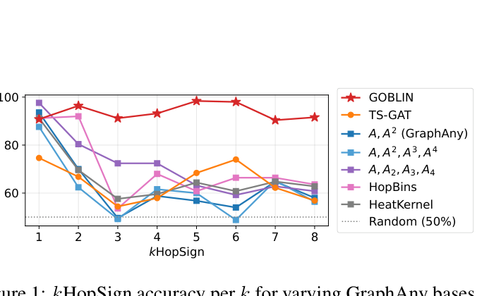
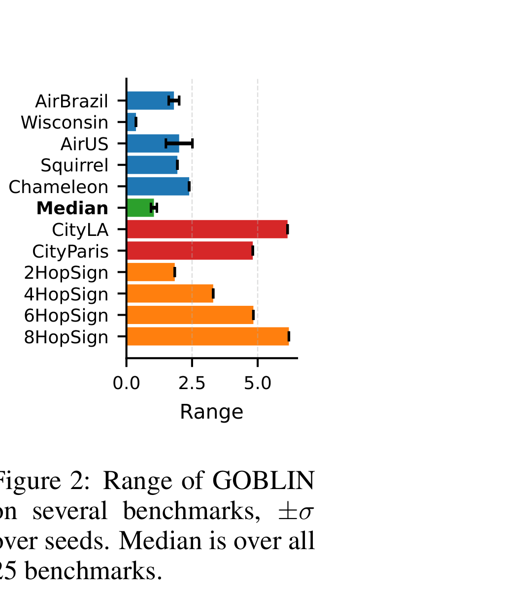
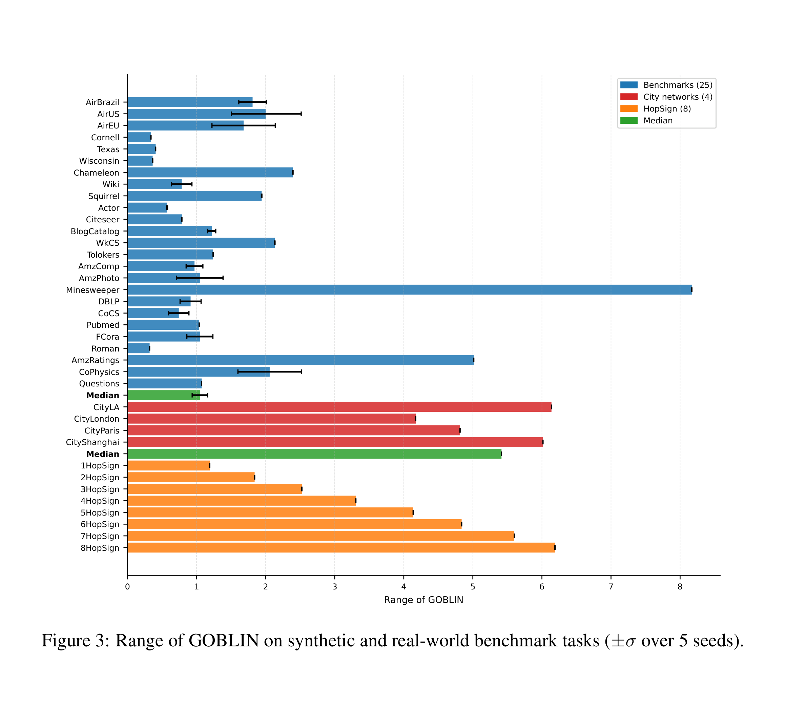
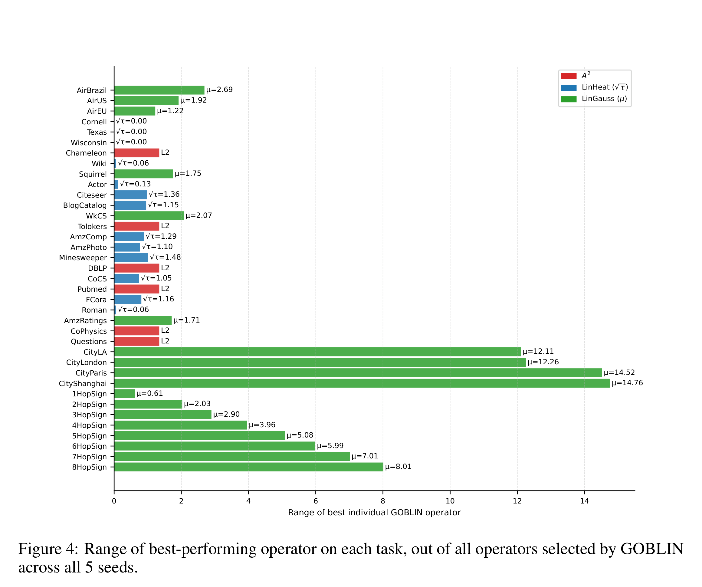
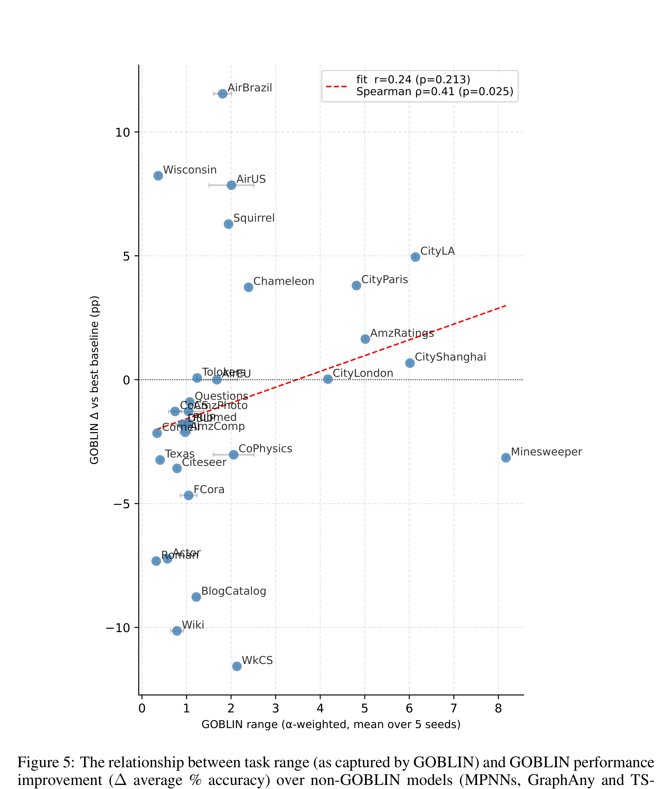

GRaM workshop at ICLR 2026 — Proceedings Track

# 그래프 기초 모형은 아키텍처를 일반화할 수 있는가?

Benjamin Gutteridge$^{1*}$, Michael Bronstein$^{1,2}$ & Xiaowen Dong$^1$

$^1$University of Oxford, $^2$AITHYRA

## 초록

그래프 기초 모형(GFM)은 임의의 스케일, 특징 차원, 도메인을 가진 그래프에 걸쳐 일반화되는 그래프 신경망(GNN) 아키텍처에 대한 약속 덕분에 최근 관심을 끌어 왔다. 기존 연구가 다양한 실세계 벤치마크에 걸쳐 이 능력을 경험적으로 입증해 왔지만, 이러한 작업들은 결정적인 숨은 불변성(invariance)을 공유한다: 그것들은 효과적인 GNN 아키텍처의 좁은 집합을 부과한다. 특히, 현재의 도메인-비의존(domain-agnostic) GFM은 고정된 아키텍처 백본에 의존하며, 이는 단일 메시지 전달 방식이 작업들 전반에 충분하다는 가정을 암묵적으로 깐다. 본 논문에서, 우리는 아키텍처적 적응성(architectural adaptivity)이 참된 GFM에 대한 필수 요건이라고 주장한다. 우리는 기존 접근들이 작업-의존 아키텍처적 속성에 대해 비강건하다는 것을 보이며, 사례 연구로서 이 한계가 명시적으로 드러나는 최소한의 측정 가능한 축으로 등급(rank)을 사용한다. 이론적 분석과 통제된 합성 실험을 통해, 우리는 고정 백본 GFM이 학습 시점에 본 것과 다른 아키텍처적 요구사항을 가진 작업에 대해 불가피하게 성능이 떨어진다는 것을 입증한다. 이 문제를 다루기 위해, 우리는 작업-특화 선형 그래프 연산자들을 발견하고 혼합함으로써 추론 시점에 효과적인 GNN 아키텍처를 적응시키는 프레임워크를 도입하며, 이는 재학습 없이 이질적 아키텍처적 요구사항을 가진 작업들에 걸쳐 영-샷 일반화를 가능하게 한다. 우리는 임의 범위(arbitrary-range)의 합성 작업과 실세계 벤치마크 모음에 대해 우리의 접근을 검증하며, 기존 도메인-비의존 GFM에 비해 향상된 성능과 강건성을 입증한다.

## 1 도입

컴퓨터 비전(Dosovitskiy 외, 2020; He 외, 2022; Radford 외, 2021; Wang 외, 2025c)과 자연어 처리(Devlin, 2018; Bubeck 외, 2023; Touvron 외, 2023) 같은 도메인에서 기초 모형의 놀라운 성공은, 그래프-구조 데이터를 생성하고 추론하기 위한 유사한 이득을 달성하는 수단으로서 그래프 기초 모형(GFM)에 대한 관심을 촉발해 왔다. 이 목표를 향해 여러 GFM이 제안되어 왔지만, 그것들 대부분은 도메인-특화적이다. 즉, 그것들은 매우 상호 연관된 데이터(Wang 외, 2025) — 예를 들어 지식 그래프, 분자, 또는 운송 네트워크(Wu 외, 2025; Huang 외, 2024; Wang 외, 2023a; Galkin 외, 2023) — 위에서 다중 그래프 작업을 다루도록 설계되어 있다. 실제로 도메인 사이에 공유되는 '어휘'의 부재는 효과적인 도메인-비의존 GFM이 여전히 모호한 이유 중 하나이다. 그럼에도 불구하고 여러 최근 연구가 이 방향에서 진전을 이루어 왔는데, 접근법으로는 추론-시점 선택(Xia & Huang, 2024), 표(tabular) 기초 모형을 활용하기 위한 그래프의 표 형식으로의 확장(Eremeev 외, 2025; Mayer 외, 2025), 그리고 큰 언어 모형(LLM)과 결합한 GNN(Liu 외, 2025) 등이 있다. 후자는 LLM을 백본 GNN의 특징 인코더로 사용하거나(Zhu 외, 2024), GNN을 LLM의 'soft' 도구로 사용하거나(Tang 외, 2024), 그래프의 토큰 또는 텍스트 표현 위에서 LLM을 종단 간(end-to-end)으로 사용할 수 있다(Perozzi 외, 2024).

본 논문에서, 우리는 GFM을 기하학적 학습(geometric learning) 설정 내에서, 즉 GNN이 제공하는 그래프 구조와 대칭 원리를 존중하면서 다루는 연구들에 우리의 주의를 집중한다. 이 공간 내에서 두 가지 주요한 기여가 있었으며, 둘 다 영-샷 'inpainting' 문제로서의 귀납적 노드 분류에 초점을 두고 있다. 즉, 그래프와 일부 참조 노드 라벨이 주어졌을 때, 나머지 노드를 분류하는 것이다. 첫 번째인 GraphAny(Zhao 외, 2024)는 선형 GNN의 고정 기저에 걸친 노드별 전문가 혼합(MoE)으로 해석될 수 있다. 두 번째인 Finkelshtein 외(2025)는 이를 기반으로, 대칭-인지 아키텍처(Zaheer 외, 2017; Segol & Lipman, 2019)를 확장하여 영-샷 GFM 추론에 요구되는 'triple symmetry'를 형식화한다: 노드 등변성(equivariance), 라벨 등변성, 특징 불변성.

GraphAny와 triple-symmetry (TS-)GNN은 둘 다 도메인-비의존적이며, 둘 다 그래프 크기, 위상, 도메인, 작업 동질성(homophily)/이질성(heterophily), 특징 차원, 그리고 클래스 수에 있어서 다양한 실세계 벤치마크 집합에 대해 그것들의 일반화를 입증한다. 그러나 일반화 능력을 평가하기 위해 이러한 표준 그래프 벤치마크들을 사용함에 있어, 이러한 방법들은 결정적인 영역에서 강하게 과적합하게 된다: 백본 GNN 아키텍처이다.

기존 도메인-비의존 GFM은 고정된 아키텍처를 가정한다: 그 아키텍처의 능력을 넘어서는 작업으로의 일반화는 재학습 없이는 불가능하다.

이 암묵적 과적합은 이 연구들에서 사용되는 벤치마크들을 고려할 때 명확해진다. 그것들이 어떤 측면에서는 다양함에도 불구하고(예: 동질적 vs 이질적), 그것들은 모두 단거리(short-range) 작업이라고 주장할 수 있다(Bamberger 외, 2025; Arnaiz-Rodriguez & Errica, 2025). 구체적으로, 이러한 작업들 중 어느 것도 국소 메시지 전달보다 더 정교한 접근을 요구한다고 시사하는 것은 없다 — 그리고 이는 기저 아키텍처에 반영된다: GraphAny와 TS-GNN은 모두 단지 두 층의 MPNN 백본을 사용하여 평가되었다.

본 논문에서, 우리는 이 한계가 고려된 벤치마크들에 특정한 것이 아니라 구조적인 것이라고 주장한다: 고정-백본 GFM은 구성에 의해, 그것들의 설계에 암묵적으로 인코딩된 것과 다른 아키텍처적 요구사항을 가진 작업에 적응할 수 없다. 더 광범위하게, 우리는 아키텍처 적응성(architecture adaptivity)이 GFM에 대한 필수 요건이라고 주장한다.

이 한계를 정확하게 만들기 위해, 우리는 범위(range)에 초점을 맞춘다. 이는 최소한의 측정 가능한 아키텍처적 속성이다. 범위는 작업을 풀기 위해 노드 상호작용이 집계되어야 하는 거리(그래프 위의 어떤 거리 측도, 예를 들어 측지적 거리에 따른)를 포착한다. 범위는 GNN이 다를 수 있는 많은 잠재적 아키텍처 축들 중 하나일 뿐이지만, 그것은 형식적 분석과 깔끔한 반례를 인정한다는 장점이 있다. 더욱이, 범위와 장거리 상호작용은 GNN 연구자들에게 점점 더 큰 관심사가 되고 있으며, 최근 몇 년간 여러 장거리 벤치마크와 측정치가 등장해 왔다(Bamberger 외, 2025; Liang 외, 2025; Migliot 외, 2025; Zhou 외, 2025; Attali 외, 2026).

우리는 기존 도메인-비의존 GFM이 그것들의 고정 연산자 기저 또는 고정된 메시지-전달 깊이에 의해 범위에 있어 증명 가능하게 묶여 있음을 보이며, 따라서 이러한 한계를 초과하는 작업에 대해 도달하지 못할 수 있다(섹션 3). 우리는 통제 가능한 범위를 가진 단순한 합성 노드 분류 작업을 사용하여 이 실패 모드를 경험적으로 입증하며, 그에 대해 기존 방법은 관대한 연산자 확장 하에서도 무너진다(섹션 4). 결정적으로, 우리는 이 실패가 추가 층이나 확장된 연산자 기저와 같은 가산적 아키텍처적 변화로는 — 표준 벤치마크에서의 성능을 떨어뜨리지 않고는 — 해결될 수 없음을 보인다. 이는 근본적인 긴장을 부각시킨다: 이질적 아키텍처적 요구사항을 가진 작업들에 걸쳐 잘 수행되는 단일 GNN 아키텍처는 없다.

이 관찰에 동기를 받아, 우리는 그래프 연산자 기저 학습 및 추론(Graph Operator Basis Learning and INference, GOBLIN)을 도입한다. 이는 추론-시점 아키텍처 적응을 위한 GFM 프레임워크이다(섹션 5). 학습 시점에 메시지-전달 아키텍처를 미리 고정하는 대신, GOBLIN은 추론 시점에 작업-적합한 선형 그래프 연산자의 기저를 발견하며, 대상 그래프의 라벨된 노드 부분집합만을 사용한다(Zhao 외(2024)와 Finkelshtein 외(2025)의 동일한 노드 라벨 'inpainting' 작업). 이러한 연산자들은 그 다음 순열-불변 MoE를 통해 결합되며, 대상 그래프에서 재학습이나 역전파 없이 작업-특화 아키텍처적 요구사항에 대한 영-샷 적응을 가능하게 한다. 우리의 분석과 실험이 진단 축으로서 범위에 초점을 두지만, 제안된 프레임워크는 범위-특화적이지 않다: 동일한 추론-시점 기저 학습 메커니즘이 아키텍처적 선택을 인코딩하는 그래프 연산자의 어떤 매개변수화된 족(family)에도 적용된다. 우리는 임의-범위 합성 작업뿐만 아니라 장거리 작업(Liang 외, 2025)을 포함한 실세계 벤치마크 모음에 대해 GOBLIN의 영-샷 일반화 능력을 검증하며, 기존 도메인-비의존 GFM(섹션 4 & 6) 및 종단 간 학습된 표준 MPNN에 비해 향상된 성능을 입증한다.

## 2 문제 형식화 및 배경

문제 설정. 우리는 단일 그래프 위에서의 영-샷, 전이적(transductive) 노드 분류를 고려하며, 기존 도메인-비의존 GFM(Zhao 외, 2024; Finkelshtein 외, 2025)의 설정을 따른다. $G = (V, E)$를 $|V| = N$개 노드, 인접 행렬 $A \in \mathbb{R}^{N \times N}$, 그리고 노드 특징 $X \in \mathbb{R}^{N \times d}$를 가지는 그래프로 두자. 각 노드 $u \in V$는 (가능하게는 미지의) 라벨 $Y_u \in \{1, \ldots, C\}$와 연관된다. 노드들의 부분집합 $V_L \subset V$가 라벨되어 있고, 대응되는 라벨은 $Y_L \in \mathbb{R}^{N_L \times C}$ (한-핫 벡터로 표현됨)이며, 나머지 노드 $V_U = V \setminus V_L$은 라벨되어 있지 않다. 작업은 대상 그래프에서 재학습이나 미세-조정 없이, $(A, X, Y_L)$이 주어졌을 때 $V_U$의 모든 노드에 대한 라벨을 예측하는 것이다.

### 2.1 GraphAny

GraphAny는 고정된 연산자 기저를 가지고 라벨된 노드 부분집합 위에서 동작하는 노드별 전문가-혼합 선택자로 해석될 수 있다. GOBLIN과 함께, 우리는 이 파이프라인을 적응적 연산자 선택을 포함하도록 확장할 것이다.

선형 GNN $\hat{Y} = SXW$를 정의하자. 이는 $W^* = (SX)^{\dagger}_{tr} Y_L$로 주어지는 분석적 해를 가지며 (여기서 $\dagger$는 의사역(pseudo-inverse)을 나타낸다), $tr$은 학습 시점에서의 노드 부분집합을 나타낸다. 우리는 $S$를 그래프 연산자 $S \in \mathbb{R}^{N \times N}$의 선택에 의해 전적으로 정의되는 값싼 (즉, 학습-자유) GNN '전문가'로 생각할 수 있다. 여기서 $S$는 인접 행렬 $A$의 어떤 함수를 인코딩할 가능성이 높고 어떤 형태의 메시지 전달을 표현할 가능성이 높다. 예를 들어, $S = I$는 혼합 없는 선형 층이고, $S = A^k$는 $k$-층 선형 GNN이다.

고정된 연산자 기저 $\hat{Y} = \{\hat{Y}^{(i)}\}_{i=1}^t$를 선택함으로써, 우리는 주어진 기저 위에서 가중합 $\hat{Y}_u = \sum_{i=1}^t \alpha_u^{(i)} \hat{Y}_u^{(i)}$로서 GraphAny-스타일 노드별 MoE를 정의할 수 있는데, 여기서 $\alpha_u = [\alpha_u^{(1)}, \alpha_u^{(2)}, \ldots, \alpha_u^{(t)}] = f_a(P_u)$이고 $P_u$는 $\hat{Y}$로부터 유도된 노드-수준 거리 특징을 나타낸다. 특징-순열 불변성을 보장하기 위해, GraphAny는 노드별 선형 GNN 차이 함수 $|\hat{Y}_u^{(i)} - \hat{Y}_u^{(j)}|^2$를 사용하며, 즉 총 $t(t-1)$개의 특징이 $f_a$ MLP로 들어가서 전문가별 로짓을 출력하고, 한 개 이상의 그래프에서 학습되어 유사도 특징으로부터 전문가를 가중하는 법을 배운다.

학습이 끝나면, 이 모형은 임의의 크기와 특징/클래스 차원의 새로운 그래프에 대해, 재학습 없이 단지 $t$개의 분석적 선형 GNN 풀이만으로 추론 시점에 영-샷으로 적용될 수 있다. 그러나 학습된 GraphAny 모형은 학습된 연산자 기저에 잠겨 있으며(locked), 따라서 그 기저에 의해 부과된 'low-pass' 그리고 두 'high-pass' 항. 따라서 효과적인 아키텍처는 0-, 1-, 2-홉 메시지 전달의 혼합이다. GraphAny는 $S = \{S^{(1)}, \ldots, S^{(t)}\} = \{I, A, A^2 \cdot (I - A), (I - A)^2\}$ (등급-정규화 인접 행렬)을 사용하는데, 즉 선형 항 더하기 두 'low-pass'와 두 'high-pass' 항이다.

### 2.2 Triple-symmetry GNN

TS-GNN은 GFM 대칭 요건을 형식화함으로써 GraphAny 프레임워크를 확장한다. 구체적으로, TS-GNN은 노드 등변성, 라벨 등변성, 특징 불변성을 강제하며, 이러한 제약을 노드, 특징, 라벨에 대한 DeepSet 구성을 사용해 구현한다. GraphAny의 명시적 MoE 형식과 대조적으로, TS-GNN은 경사 하강법으로 종단 간(end-to-end) 학습된다.

이러한 아키텍처적 차이에도 불구하고, TS-GNN은 GraphAny와 한 가지 핵심 한계를 공유한다: 그것들은 고정된 메시지-전달 백본에 의존한다. 실제로, 보고된 모든 TS-GNN 결과는 최대 두 개의 국소 메시지-전달 층을 가진 얕은 아키텍처를 사용한다. 결과적으로, TS-GNN은 다른 고정-깊이 GNN과 동일한 도달 부족(under-reaching) 제약을 받는다: 정보는 선택된 깊이와 집계 연산자에 의해 결정된 수용 영역을 넘어 전파될 수 없다.

다음 섹션들에서 우리는 작업 범위(task range)의 렌즈를 통해 아키텍처적 강성이 명시적으로 입증될 수 있음을, 그리고 그것을 극복하기 위해서는 추론-시점 아키텍처 적응이 필요함을 보일 것이다.

### 2.3 고정-백본 GFM의 한계

GraphAny와 TS-GNN은 둘 다 최대 두 층의 고정된 깊이를 가진 메시지-전달 아키텍처에 기반하며, 따라서 그 이상을 요구하는 작업에서 평가될 때 도달 부족으로 인해 무너질 수밖에 없다. 누군가는 이에 대한 자명한 해법이 있다고 주장할 수 있다: TS-GNN에 대해 깊은 GNN이나 그래프 변환기(GT; Dwivedi & Bresson, 2020) 백본을 사용하거나, GraphAny에 대해 대안적이거나 더 포괄적인 기저를 사용하는 것이다. 그러나 이는 두 방법 모두의 결정적인 단점을 부각시킨다: 어떤 대안적 아키텍처가 선택되든 그것은 여전히 고정되어 있으며, 'one-size-fits-all' 아키텍처는 존재하지 않는다. 우리가 섹션 4에서 보듯이, GraphAny의 기저를 확장하는 것은 일부 작업에 도움이 될 수 있지만 다른 작업에 잡음과 성능 저하를 초래한다. 유사하게, 더 깊은 GNN이나 GT를 사용하는 것은 많은 작업에 대해 종종 불필요한 계산 복잡성을 도입하며(Tönshoff 외, 2023), 종종 과도한 평활화/스쿼싱과 사라지는 그래디언트 효과(Oono & Suzuki, 2019; Alon & Yahav, 2020; Di Giovanni 외, 2023; Arroyo 외, 2025) 때문에 다른 종류의 작업들에 대해 성능 트레이드오프를 강요할 수 있다.

간단히 말해, 진정한 GFM은 아키텍처적 차이를 필요로 하는 작업들에 걸쳐 강건해야 한다. 실제로, GFM을 개발하는 전체 동기는 비싸고 긴 하이퍼파라미터 및 아키텍처 탐색을 피하기 위함이다. 기존 방법은 이를 다루지 않는다: 그것들은 GNN 아키텍처 매개변수화의 좁은 범위로부터 이득을 보는 작업들에만 일반화될 수 있을 뿐이다. 우리의 방법은 추론 시점에 적응적 기저(따라서 적응적인 효과적 아키텍처) 선택을 통해 이를 다룬다.

## 3 아키텍처적 한계에 대한 진단으로서의 범위

이 섹션에서 우리는 고정-아키텍처 GFM의 강성을 형식적으로 입증하며, 범위를 대용물(proxy)로 사용한다. 우리는 GraphAny에 초점을 두고, GraphAny의 전체 범위가 기저 연산자의 범위를 도출함으로써 연구될 수 있음을 보인다. 우리는 Bamberger 외(2025)의 노드-수준 범위 측도 $\rho_n$을 사용한다: 그래프 위의 어떤 거리 측도(예: 측지적 거리)가 주어졌을 때, 비공식적으로 범위는 거리-가중 쌍별 노드 민감도를 노드별로 평균한 것이다. 형식적으로,

$$\rho_n = \frac{\sum_{u, v \in V} J_{uv} \cdot d_G(u, v)}{\sum_{u, v \in V} J_{uv}}, \text{ where } J_{uv} = \left\| \frac{\partial \phi(X_u)}{\partial X_v} \right\|_*, \tag{1}$$

그리고 $\phi$는 노드 입력 특징을 출력 특징으로 매핑하는 어떤 연산자(예: GNN)이다.

GraphAny의 범위. GraphAny가 선형 GNN의 가중합이므로, 우리는 개별 선형 GNN 전문가의 범위를 계산하고 그것들의 상대 가중치를 비교함으로써 그것의 전체 범위를 연구할 수 있다. 선형 GNN의 야코비안은 $\partial \hat{Y}^{(i)}_u / \partial X_v = S^{(i)}_{uv} W$로 분해된다. 식 1을 참조하면, 여기서 $J_{uv} = |S_{uv} W_{v\cdot}|$이며, 우리는 따라서 노드-수준 범위를 얻을 수 있다:

$$\tilde{\rho}_n = \left( \sum_{i,j=1}^{d, C} |W_{ij}| \right) \left( \sum_{v \in V} |S_{uv}| \cdot d_G(u, v) \right) = \|W\|_1 \cdot \sum_{v \in V} |S_{uv}| \cdot d_G(u, v),$$

정규화하면 $\rho_n = \frac{\sum_{v \in V} |S_{uv}| \cdot d_G(u, v)}{\sum_{v \in V} |S_{uv}|}. \tag{2}$

따라서, 선형 GNN의 범위는 효과적인 아키텍처 $S$와 그래프 자체($d_G$ 및 가능하게는 $S$를 통해)에만 의존하며, 노드 가중치에는 의존하지 않는다.

GraphAny는 그것의 연산자에 대해 차수-정규화된 인접 행렬을 사용한다. 이 $A$는 합이 1인 행을 가지므로 (라플라스 행렬에 대해서는 2), 우리는 주어진 6개 연산자에 대해 해석 가능한 범위/범위 상한을 얻는다: $S = I \to \rho_n = 0$; $S = A \to \rho_n = 1$; $S = A_b$ ($A_b$를 라플라스 행렬로 가정) $\to \rho_n = 0.5$; $S = (I - A) \to \rho_n = 0.5$, 그리고 $S = A^2 \to \rho_n = 2$. 요약하면, GraphAny에 의해 사용되는 5개 연산자 중 3개는 위상에 불변인 범위 $(0, 1, 0.5)$를 가지고, 다른 두 개는 2-홉으로 상한된다. 이는 일반화에서 핵심적인 단점을 보여준다. $S = A^k$ 연산자로 구성된 기저를 가진 GraphAny는 최대 범위 $k$를 가질 수 있고, 실제로는 이것이 훨씬 더 낮을 가능성이 높은데, 특히 어텐션 가중치가 $\le 1$인 범위를 가지도록 보장된 전문가들 사이에서 공유되기 때문이다. 그것의 표준 기저로는, GraphAny는 범위 $> 2$인 작업을 풀 수 없다.

TS-GNN. 우리는 여기서 범위를 분석적으로 도출할 수는 없지만, 같은 결론이 성립한다: $\ell$-층 메시지 전달 백본을 가정하면, 모든 $\{u, v \in V : d_G(u, v) > \ell\}$에 대해 $\partial \hat{Y}_u / \partial X_v = 0$이며, 따라서 $\rho_n \le \ell$이다.

진단 도구로서 범위를 사용하는 동기. 범위가 아키텍처적 적응을 요구하는 유일한 작업 속성은 아니지만, 여기서 유용하고 우아한 대용물(proxy)이다. 라벨 동질성과 같은 작업 속성과 달리, 범위는 작업과 아키텍처(그리고 실제로 작업에 적용된 아키텍처) 모두의 속성으로서 직관적인 의미를 가지며, 이는 $o$가 작업 연산자인지 모형인지에 따라 달라진다. 작업과 아키텍처적 속성 사이의 이 측정 가능한 관계는 범위와 알려진-범위 합성 작업을 단지 다운스트림 성능을 평가하는 것 — 문헌에서 지배적인 것 — 에 보완적인 유용한 진단 도구로 만든다.

또 다른 이점은 선형 GNN 전문가의 혼합인 GFM이 식 2를 사용하여 특정 범위를 가진 구성요소들로 분해될 수 있다는 것이다. 선형 GNN은 그것들의 연산자 $S$에 의해 전적으로 정의되고, 작업에서 각 선형 GNN의 범위는 그 연산자와 작업 그래프 위상에 의해 전적으로 정의되므로, 범위는 확장된 또는 적응적인 연산자 기저를 조사하기 위한 기하학적 해석을 제공한다. 예를 들어, 연산자는 저주파-통과 또는 고주파-통과일 수 있지만, 또한 단거리, 중거리, 또는 장거리일 수도 있다.

## 4 $k$-HOPSIGN: 알려진-범위 작업에 대한 고정 기저의 실패

이 섹션에서 우리는 고정된 연산자 기저가 GraphAny 기저를 확장할 때조차 특정 최소 아키텍처를 요구하는 작업에 임의로 적응할 수 없음을 경험적으로 입증한다.

RingTransfer (Bodnar 외, 2021)와 $k$-Disc (Bamberger 외, 2025) 같은 고정된 범위를 가진 합성 작업들은 사전 연구에서 범위를 연구하는 데 사용되어 왔으나, 이들은 일반적으로 고정된 그래프-내(in-graph) 설정을 가진다. 우리는 핵심 아이디어 — 노드들이 $k$-홉 거리에서 정보를 회수하는 것 — 를 전이적 설정으로 적응시켜 $k$-HopSign으로 만든다. 직경 $> k_{\max}$인 어떤 그래프 위상이 주어졌을 때 (우리는 1000개 노드와 반지름 0.1의 무작위 기하학적 그래프를 사용한다), 각 노드는 표준 가우시안에서 추출된 스칼라 특징 $x_n$과 다음으로 주어지는 이진 라벨을 가진다: $y_u^{(k)} = \text{sign}\left( \sum_v \exp\left( -\frac{(d_G(u, v) - k)^2}{\sigma_{\text{noise}}^2} \right) x_v \right)$, 즉, 단단한 $k$-홉 회수 작업의 'soft' 버전이며, $\sigma_{\text{noise}} = 0$일 때 $y_u^{(k)} = \text{sign}\left( \sum_{v: d_G(u,v)=k} x_v \right)$로 무너진다. 이 작업은 범위 $k$를 가진다 (단단한 경우에는 정확히 $k$). 우리는 50:50 학습-검증 분할을 무작위로 표본추출하고, Cora에서 GraphAny를 학습 (그리고 평가)하며, 그림 1에 $k = 1, \ldots, 8$에 대한 $k$-HopSign 결과를 보인다.

추가 연산자 기저. 우리는 표준 연산자를 가진 GraphAny가 $k > 2$에 대해 도달 부족이어야만 한다는 것을 안다. 따라서 단순히 고정 기저를 확장하는 것이 문제를 해결하지 못함을 입증하기 위해, 우리는 여러 추가 기저를 포함한다: 인접 행렬의 추가적인 거듭제곱 ($A^3, A^4$), 주어진 $k$에 대해 정확한-홉 인접 행렬 $A_k$ ($k = 1, \ldots, 4$에 대해 거의-오라클 연산자), 그리고 한 줌의 연산자에 다양한 범위를 압축하려는 두 연산자 족: HopBins와 HeatKernel. HopBins의 연산자는 $(A_{l,l'})_{ij} = \mathbb{1}\{l \le d(i, j) \le l'\}$로 주어지며, 여기서 $d$는 모든 노드 쌍 사이의 측지적 거리 측도이다. 이는 단거리 1- 그리고 2-홉 연산자에 추가하여 가장 가까운 ~50% 노드 쌍을 다루는 '중거리' 항과 나머지 '장거리' 쌍을 다루는 $A_{>l'}$ 항을 포함함으로써 다양한 범위에 걸쳐 포착하는 'binned' 정확한-홉 기저를 반영하기 위한 것이다. HeatKernel은 단거리, 중거리, 장거리 저항 거리(resistance distance)의 개념을 포착하기 위한 것이며, 열 커널 항의 집합 $\{\exp(-\tau_k)\}_k^{MS}$를 사용한다, 온도 $\sqrt{\tau_k} = 1$, $\sqrt{\tau_k} = d$, $\sqrt{\tau_k} = 2d$에 대해, $d$는 평균 측지적 노드 쌍 거리이다.

논의. 표준 GraphAny가 $\rho < 2$이므로, 그것이 $k > 1$에 대해 무작위 추측에 가깝게 무너진다는 것은 놀랍지 않다. 세 번째와 네 번째 인접 행렬 거듭제곱을 포함하는 기저조차 $k > 1$ 너머에서 무너지며, 이는 작업의 범위가 기저의 상한 내에 있더라도 단순한 평활화(smoothing)는 그러한 작업에 충분하지 않음을 시사한다. 예상대로, 정확한-홉 연산자 $A_k$는 대응되는 범위를 가진 작업에 대해 더 강한 성능을 산출하지만, 이것 역시 기저 너머 (즉 $k > 4$)에서는 무작위 추측으로 무너진다. 우리의 'binned' 다중-범위 기저들도 제한된 성공을 가지며, 가끔 더 높은 $k$에서 더 좋은 성능을 보이지만 일관성이 없고, 어떤 GraphAny 기저도 ~80% 정확도를 능가하지 못한다. 더욱이, 표 1을 고려하면, 우리는 기저를 확장할 때 $k$-HopSign에서의 성능이 약간 향상될 수는 있지만 벤치마크에서의 성능은 상당히 떨어진다는 것을 본다. 이는 다음을 입증한다.

표 1: 25개 벤치마크에 대한 평균 정확도 $\Delta\%$, 다양한 기저 vs. 표준 GraphAny.

| 평균 벤치마크 정확도 ($\Delta$ %) | |
| --- | --- |
| $A, A^2$ (GraphAny) | 0.0 |
| $A, A^2, A^3, A^4$ | -5.51 |
| $A, A_2, A_3, A_4$ | -4.95 |
| HopBins | -5.29 |
| HeatKernel | -3.02 |

그림 1: 다양한 GraphAny 기저에 대해 $k$별 $k$-HopSign 정확도.

one-size-fits-all 아키텍처는 존재하지 않는다는 것을: 한 아키텍처적 요구사항을 다루기 위해 기저를 넓히는 것은 다른 곳에서 성능을 해치는 잡음을 도입한다. 우리는 적응적 기저가 필요하다. 섹션 5에서 우리는 그러한 기저를 가능하게 하는 새로운 프레임워크인 GOBLIN을 도입하며, 그림 1로부터 그것이 모든 $k$-HopSign 작업에 대해 잘 수행됨을 (모든 곳에서 >90% 정확도로) 볼 수 있다.

## 5 방법: 그래프 연산자 기저 학습 및 추론

우리는 GFM에서 추론-시점 아키텍처 적응을 위한 프레임워크인 GOBLIN을 도입한다. GOBLIN은 영-샷 추론을 두 단계로 분해한다: (i) 매개변수화된 연산자 족(family)으로부터 작업-적응적 선형 그래프 연산자 기저의 발견, 그리고 (ii) 노드 수준에서 결과 연산자에 대한 순열-불변 MoE 가중치 부여. 결정적으로, 두 단계 모두 대상 그래프에서 재학습이나 역전파 없이 추론 시점에 전적으로 동작한다.

### 5.1 매개변수화된 연산자 족

GOBLIN은 매개변수화된 선형 그래프 연산자 족 $S(\theta) \in \mathbb{R}^{N \times N}$에 대한 접근을 가정하며, 여기서 매개변수 $\theta$는 수용 영역, 평활화, 집계 스케일과 같은 아키텍처적 속성을 제어한다. 본 연구에서, 우리는 두 가지 보완적인 연산자 클래스로 구성된 족을 고려한다:

$$S(\theta) = \lambda S^{\text{Gauss}}(\mu, \sigma) + (1 - \lambda) S^{\text{Hop}}(\tau), \text{ where} \tag{3}$$

$$S^{\text{Gauss}}_{(\mu, \sigma)}(u, v) = \exp\left( -\frac{(\mu - d_G(u, v))^2}{2\sigma^2} \right) \text{ and } S^{\text{Hop}}(\tau) = \exp(-\tau L_{\text{sym}}), \tag{4}$$

여기서 $\theta = (\lambda, \mu, \sigma, \tau)$, $\lambda \in \{0, 1\}$, 그리고 $\mu, \sigma, \tau \in \mathbb{R}_+$이다. 이 접근은 그래프 스케일에 대해 적응적 연산자를 사용하는 기존 비-GFM 연구들(Frasca 외, 2020; Chien 외, 2020)과 유사성을 가지며, 여기에는 스펙트럼 그래프 웨이블릿(Hammond 외, 2011; Opolka 외, 2022)이 포함된다. $S^{\text{Gauss}}$는 목표 홉 거리 $\mu$ 주위의 (소프트) 거리-국소화된 집계에 대응하며, $\sigma = 0$일 때 정확한 $A_k$로 무너진다. 그리고 $S^{\text{Hop}}$은 $\tau$에 의해 제어되는 확산-기반 평활화에 대응하며, 증가하는 효과적 범위를 가진 다층 메시지 전달을 포착한다. 그러한 연산자 족은 우리가 저주파, 고주파, 대역 통과 필터링, 단거리 및 장거리 집계, 그리고 국소, 다중-홉(Gutteridge 외, 2023) 및 다층 메시지 전달을 포함한 광범위한 아키텍처적 거동의 스펙트럼을 펼칠 수 있게 한다. 이는 두 가지 모드를 가지며, 각각은 특정 거리 측도를 통해 범위를 인코딩한다: 측지적 거리와 저항 거리. 우리가 구체성을 위해 이 족에 초점을 두지만, GOBLIN은 연산자 족의 구체적인 선택에 비의존적이며, 아키텍처적 변동을 인코딩하는 어떤 매개변수화에도 적용된다.

### 5.2 추론-시점 연산자 기저 학습

연산자 족 $S(\theta)$가 주어졌을 때, 첫 번째 단계의 목표는 대상 그래프에서 작업에 적합한 작은 연산자 매개변수 집합 $\{\theta_i\}_{i=1}^t$를 식별하는 것이다. 각 후보 $\theta$에 대해, 우리는 선형 GNN 전문가 $\hat{Y}^\theta = S(\theta) X W^\theta$를 정의한다. $W^\theta = (S(\theta) X)^{\dagger}_{tr} Y_{tr}$는 라벨된 노드의 부분집합에 대한 분석적 최소-제곱 해를 통해 얻어지며, Zhao 외(2024)에서와 같다.

과적합 없이 연산자 적합성을 평가하기 위해, 우리는 라벨된 노드를 $Y_L = Y_{L_{\text{in}}} \cup Y_{L_{\text{out}}}$으로 분할하고 스칼라 점수 $f(\theta) = \ell(\hat{Y}^\theta_{L_{\text{out}}}, Y_{L_{\text{out}}})$를 정의하며, 여기서 $\hat{Y}^\theta_{L_{\text{out}}}$은 $Y_{L_{\text{in}}}$에 적합된 선형 GNN이고

$Y_{L_{\text{out}}}$에서 평가되며, $\ell(\cdot)$은 어떤 점수 측도를 나타낸다. 함수 $f(\theta)$는 연산자 매개변수에 대한 블랙-박스 목적함수로 다루어지며, 표본-효율적인 블랙-박스 최적화에 적합한 어떤 전략으로도 최적화되거나 근사될 수 있다. 우리의 실험에서 우리는 베이즈 최적화(BO)를 사용하며, 탐험과 활용 사이의 트레이드오프를 위해 상한 신뢰 한계(Upper Confidence Bound, UCB) 표본추출을 사용한다. 우리의 점수 측도 $\ell(\cdot)$로는 'trimmed' 정확도, 즉 마진 기준 상위와 하위 5%를 제외한 $L_{\text{out}}$ 노드 집합 위에서의 평균 정확도를 사용한다. 설계 결정은 부록 A에서 더 논의되지만, 이러한 구체적인 선택은 프레임워크에 본질적인 것은 아니다.

탐색 예산이 다 사용되면, 우리는 점수와 다양성 패널티의 합(식 7)을 최대화하는 욕심적 선택자를 통해 작은 연산자 기저 $\{\theta_i\}_{i=1}^t$를 얻으며, 이는 중복된 (즉, 사실상 동일한) 연산자가 없도록 보장한다.

### 5.3 순열-불변 전문가 혼합

두 번째 단계는 적응적 연산자 기저를 노드별 MoE를 통해 결합한다. 연산자 기저가 고정되고 순서가 정해진 GraphAny와 달리, GOBLIN은 연산자 순서와 기저 크기 둘 다에 대해 불변으로 유지된다. 그러므로 우리는 순열별 특징 위에 DeepSet (Zaheer 외, 2017)을 채택한다. GraphAny와 같이 우리는 선형-GNN-도출 거리 특징을 사용한다. 즉 $t$개의 특징 벡터에서 $t(t-1)$ 특징 벡터로 매핑이 필요하므로, 우리는 노드별 쌍 'disagreement'를 $D_u^{(i,j)} = (\hat{Y}_u^{(i)} - \hat{Y}_u^{(j)})^2$로 정의하고 이것의 요약 통계량인 특징을 생성한다: $H_u^{(i)} = [\frac{1}{t-1} \sum_{j \ne i} D_u^{(i,j)}, \text{Var}_{j \ne i}[D_u^{(i,j)}], \min_{j \ne i} D_u^{(i,j)}, \max_{j \ne i} D_u^{(i,j)}]$. 이러한 특징은 기저 크기나 순서에 대한 의존성 없이 전문가들 사이의 합의와 다양성을 포착한다.

이는 방법을 설명하기 위한 단순하고 합리적인 예비 특징이다; 추가 실험은 더 풍부한 확장된 특징을 시사할 가능성이 높다. 예를 들어, 우리는 추가 점수 특징도 실험한다; 자세한 사항은 부록 A.3 참조.

다음으로, 각 $H_u^{(i)}$는 학습된 함수(MLP) $\phi$를 통해 임베딩되어 연산자별 임베딩 $E_u^{(i)} = \phi(H_u^{(i)})$를 산출한다. 두 번째 학습된 함수 $\psi$는 그 다음 $E_u^{(i)}$와 풀링된 임베딩 $\sum_j E_u^{(j)}$의 연결을 스칼라 로짓 $\hat{\alpha}_u^{(i)}$로 매핑하며, 이는 연산자에 걸친 최종 합산을 위한 정규화된 가중치 $\alpha_u^{(i)} = \exp(\hat{\alpha}_u^{(i)}) / \sum_j \exp(\hat{\alpha}_u^{(j)})$를 산출한다. $\phi$와 $\psi$의 학습 동안 정보 누설을 피하기 위해, 특징은 $Y_{L_{\text{in}}}$에 적합된 전문가들로부터 계산되고, 감독은 $Y_{L_{\text{out}}}$에 의해 제공된다. 추론 시점에, 전문가들은 특징 추출 전에 모든 라벨 $Y_L$에 대해 다시 적합된다.

## 6 실험

이 섹션에서 우리는 영-샷 노드 분류 능력을 실세계 벤치마크에 대해 평가하며, GOBLIN을 GraphAny와 TS-GNN에 대해 비교한다.

우리의 BO 목적함수는 잘린 평균이다: 마진 기준 상위 그리고 하위 20%의 노드를 제외한 $Y_{L_{\text{out}}}$ 위에서의 정확도이며, 이는 노드의 부분집합과 전체 모두에서 잘 수행하는 연산자를 촉진한다. 우리는 총 표본 예산 25로 BO를 실행하며, $\mu$ (LinGauss)와 $\sqrt{\tau}$ (LinHeat)에 대한 별개의 가우시안 프로세스(GP) 사이의 가족 간 UCB 경쟁을 사용하며, 탐색 공간은 대상 그래프의 평균 쌍별 측지 거리로 스케일된다. 예산을 다 사용한 후, 우리는 욕심적 다양성-패널티 선택자(식 7)를 통해 $K = 4$ 연산자의 기저를 선택한다. 전체 하이퍼파라미터 세부사항은 부록 A에 있다. 우리는 Finkelshtein 외 (2025)와 동일한 학습 그래프인 Cora에서 학습하고, 그 작업의 실험 절차를 따라 영-샷으로 평가한다.

우리는 25개 표준 벤치마크 작업(표 2), 4개 실세계 장거리 작업(표 3) 및 우리의 합성 $k$-HopSign 작업(그림 1)에 대해 평가한다. 장거리 작업은 CityNetworks(Liang 외, 2025)에서 가져왔으며, 도로 교차로 접근성 분류에 관한 벤치마크이다 (~1-600k 노드, 최대 16홉 거리의 정보 필요).

표 2: 25개 벤치마크 그래프 데이터셋에 걸친 정확도 평균 ± 표준편차 (5 시드). 종단 간 모형은 각 데이터셋에 대해 학습되었고, 영-샷 모형은 그 데이터셋에 대해 학습-자유로 적용되었다. 비-GOBLIN 열은 Finkelshtein 외 (2025)로부터 재현되었다. 별표(*)는 이질적(heterophilic) 데이터셋을 표시한다. 첫째-둘째 최고가 색상-코드되어 있다.

|  | 종단 간 |  | 영-샷 |  |  |
| --- | --- | --- | --- | --- | --- |
|  | MeanGNN | GAT | GraphAny | TS-Mean | GOBLIN |
| Actor* | 32.03 ± 0.28 | 32.59 ± 0.83 | 27.54 ± 0.20 | 28.09 ± 0.93 | 25.36 ± 0.14 |
| AirBrazil | 32.31 ± 7.50 | 35.38 ± 4.21 | 33.84 ± 15.65 | 39.23 ± 5.70 | 50.77 ± 9.55 |
| AirEU | 39.12 ± 6.44 | 39.00 ± 4.30 | 41.25 ± 7.25 | 35.88 ± 6.91 | 41.25 ± 3.95 |
| AirUS | 43.93 ± 1.16 | 43.03 ± 2.08 | 43.35 ± 1.62 | 42.34 ± 2.12 | 51.78 ± 4.43 |
| AmzComp | 73.88 ± 0.66 | 70.94 ± 3.40 | 82.79 ± 1.15 | 81.37 ± 1.25 | 80.06 ± 2.43 |
| AmzPhoto | 88.95 ± 1.08 | 80.78 ± 3.59 | 89.91 ± 0.66 | 90.18 ± 1.30 | 88.90 ± 1.34 |
| AmzRatings* | 40.74 ± 0.13 | 40.63 ± 0.66 | 42.20 ± 0.09 | 42.27 ± 1.40 | 44.44 ± 0.00 |
| BlogCatalog | 84.48 ± 0.74 | 78.20 ± 7.25 | 71.54 ± 3.04 | 76.30 ± 2.92 | 75.71 ± 2.66 |
| Chameleon* | 61.75 ± 0.94 | 58.46 ± 6.23 | 63.66 ± 1.48 | 60.83 ± 5.41 | 67.37 ± 0.26 |
| Citeseer | 65.06 ± 1.30 | 63.92 ± 0.51 | 68.88 ± 0.10 | 68.66 ± 0.19 | 65.30 ± 0.98 |
| CoCS | 80.87 ± 0.69 | 82.28 ± 0.86 | 90.06 ± 0.46 | 90.92 ± 0.47 | 89.64 ± 1.13 |
| CoPhysics | 79.05 ± 1.13 | 85.92 ± 1.10 | 91.85 ± 0.34 | 92.61 ± 0.04 | 89.58 ± 1.59 |
| Cornell* | 63.78 ± 1.48 | 69.73 ± 2.26 | 63.24 ± 1.32 | 68.65 ± 2.42 | 67.57 ± 0.00 |
| DBLP | 65.01 ± 2.40 | 67.34 ± 2.75 | 75.49 ± 1.44 | 66.42 ± 3.65 | 69.68 ± 2.67 |
| FCora | 55.85 ± 1.04 | 59.95 ± 0.98 | 51.18 ± 0.78 | 53.58 ± 0.73 | 55.28 ± 0.00 |
| Minesweeper* | 84.06 ± 0.18 | 84.15 ± 0.24 | 80.46 ± 0.10 | 80.68 ± 0.38 | 81.40 ± 0.00 |
| Pubmed | 74.59 ± 0.13 | 75.12 ± 0.69 | 76.46 ± 0.06 | 74.98 ± 0.56 | 74.70 ± 0.00 |
| Questions* | 97.16 ± 0.06 | 97.13 ± 0.05 | 97.07 ± 0.03 | 97.02 ± 0.01 | 96.26 ± 0.02 |
| Roman* | 69.37 ± 0.66 | 69.89 ± 4.18 | 63.34 ± 0.36 | 66.36 ± 1.02 | 62.48 ± 0.00 |
| Squirrel* | 43.32 ± 0.66 | 38.16 ± 1.04 | 49.74 ± 0.43 | 41.81 ± 0.80 | 56.02 ± 0.27 |
| Texas* | 76.76 ± 1.48 | 83.62 ± 6.45 | 71.35 ± 2.16 | 73.51 ± 4.01 | 78.38 ± 0.00 |
| Tolokers* | 78.59 ± 0.06 | 78.22 ± 0.37 | 78.20 ± 0.03 | 78.12 ± 0.09 | 75.66 ± 0.02 |
| Wiki | 74.23 ± 0.89 | 68.91 ± 9.50 | 60.27 ± 3.06 | 69.69 ± 1.31 | 64.09 ± 3.80 |
| Wisconsin* | 74.12 ± 12.20 | 73.33 ± 8.27 | 59.61 ± 5.77 | 61.18 ± 11.38 | 82.35 ± 0.00 |
| WkCS | 71.97 ± 1.70 | 74.99 ± 0.59 | 74.11 ± 0.60 | 74.16 ± 2.07 | 63.42 ± 0.42 |
| 평균 | 66.04 ± 1.83 | 65.98 ± 2.91 | 65.76 ± 1.96 | 66.20 ± 2.31 | 68.05 ± 1.42 |

그림 2: 여러 벤치마크에 대한 GOBLIN의 범위. 시드에 걸친 $\pm \sigma$. 중앙값은 전체 25개 벤치마크에 걸친 값.

논의. 표 2는 GOBLIN이 25개 벤치마크에 걸쳐 다른 모든 방법(MeanGNN, GAT, GraphAny, TS-GNN)과 경쟁력이 있음을 보인다. GOBLIN은 강력한 종단 간 기준선인 표준 MPNN (Velickovic, 2017)을 작업에서 일관되게 능가하는 유일한 방법이다. GOBLIN의 전체적 성능이 몇몇 데이터셋(AirBrazil이 >10%, Wisconsin, AirUS, Squirrel이 >6%)에 의해 주도된다는 점을 주목한다; 실제로 일부 작업에서는 GOBLIN이 기준선보다 낮은 성능을 보인다. 이는 더 일반적인 모형으로서 예상되는 성능이다: 우리는 작업들에 걸친 강건한 일반화를 원하지, 반드시 SOTA 성능을 원하는 것은 아니다. 실제로 GOBLIN의 GraphAny 대비 향상은 어려운 작업들이 예상보다 더 긴 범위일 수 있음을 시사한다. 그림 2는 25개 벤치마크 + CityNetworks에 걸친 GOBLIN의 범위, 그리고 표 2에서 GOBLIN의 정확도 향상이 가장 큰 5개 작업의 범위를 함께 그린다. 예상대로 $k$-HopSign 작업은 $k$가 증가함에 따라 범위가 증가한다. 평균적으로 25개 표준 벤치마크 작업은 낮은 범위를 가진다; 약 2-홉 합성 작업 정도이다. 우리의 최대-$\Delta$% 작업들은(Wisconsin을 제외하고) 평균보다 훨씬 더 높은 범위를 가진다. 실제로, 우리는 GOBLIN의 성능 향상과 작업 범위 사이에 약하지만 통계적으로 유의한 관계를 본다.

표 3: CityNetworks에 대한 평균 ± 표준편차 % 정확도 (5 시드). TS-Mean보다 더 좋은 성능을 보였기에 TS-GAT를 보고한다.

|  | MeanGNN | GAT | GraphAny | TS-GAT | GOBLIN |
| --- | --- | --- | --- | --- | --- |
| Paris | 20.79 ± 0.25 | 20.73 ± 0.28 | 20.09 ± 0.10 | 16.36 ± 1.73 | 24.59 ± 0.00 |
| Shanghai | 22.86 ± 0.13 | 20.80 ± 0.18 | 19.72 ± 0.02 | 19.93 ± 1.45 | 21.53 ± 0.00 |
| LA | 19.34 ± 0.06 | 18.74 ± 0.25 | 17.19 ± 0.02 | 15.85 ± 1.27 | 24.29 ± 0.00 |
| London | 21.58 ± 0.12 | 21.13 ± 0.15 | 17.13 ± 0.01 | 17.60 ± 1.49 | 21.60 ± 0.00 |
| 평균 | 21.14 ± 0.14 | 20.35 ± 0.21 | 18.53 ± 0.04 | 17.44 ± 1.49 | 23.50 ± 0.00 |

범위; 부록 B의 그림 5를 보라. 우리는 GOBLIN의 고정-단거리 기준선 대비 아키텍처적 적응성이 성능 향상의 주요 기여자라고 결론지을 수 있다.

장거리. 표 3에서 우리는 GOBLIN이 기준선 GNN을 ~3-8% 능가하는 것을 본다 — 격려할 만한 결과이며, 그것들의 엄격하게 낮은 범위를 고려할 때 우리가 예상하는 결과이다. GOBLIN은 또한 종단 간 학습된 MPNN을 전반적으로 능가하지만, 우리는 (공정한 교차-벤치마크 비교를 위해) 이러한 MPNN이 위에서 설명한 동일한 매개변수 탐색을, 2층의 고정 깊이로 사용한다는 점에 유의한다. 실제로 CityNetworks는 깊이-민감하며, 이러한 모든 결과는 깊이를 증가시킴으로써 상당히 향상될 수 있다. 우리는 이를 부록 C.2에서 논의한다.

## 7 결론

이 연구는 효과적인 GFM(고정 아키텍처와 모형 가중치)의 전제조건이 다재다능한 아키텍처라는 점을 강조하는 것을 목표로 한다; GNN의 경우, 그러한 기초 아키텍처를 선택하는 문제는 여전히 미해결이라고 할 수 있다. 범위는 그러한 아키텍처가 중요한 한 축이다; 우리는 그것들의 정적 아키텍처를 따라 이 축에서의 일반화에 있어 기존 GFM의 약점을 강조한다. 우리는 커뮤니티가 GFM의 미래 평가에 합성 및 실세계 장거리 작업을 포함할 것을 권한다.

한계. GOBLIN은 SOTA 방법이 아니다 — 약한 선형 GNN 학습자들로 구성된 MoE 아키텍처이기 때문이다. 그것은 많은 복잡한 작업에 대해 표현력이 충분하지 않다 (부록 C 참조). 이는 설계상 그러하지만, 우리의 결합된 하이퍼파라미터 탐색과 추론-시점 MoE 가중치에서의 트레이드오프를 보여주며, 순수 역전파-자유 학습은 불충분하다는 것을 시사한다.

GOBLIN은 또한 GraphAny와 같은 고정-기저 방법보다 더 높은 추론-시점 비용을 가진다 — 추가적인 선형 GNN 풀이와 더 비싼 연산자 구성 때문이지만, 여전히 종단 간 학습보다는 훨씬 빠르다. 자세한 논의는 부록 D 참조.

미래 연구. GOBLIN의 현재 인스턴스화는 단순하며, 연산자 선택을 위해 휴리스틱하게 선택된 표본추출 규칙과 MoE 가중치를 위해 작은 요약 특징 집합을 사용한다. 이러한 선택은 프레임워크에 본질적이지 않다. 더 표현력 있는 연산자 특징은 정확도를 향상시킬 수 있다. 작업 어려움을 평가하기 위해 다중 그래프에 걸친 학습에 대한 조사 또한 효율성과 일반화 모두에서 개선으로 이어질 가능성이 높다.

### 감사의 말

B.G.는 EPSRC Centre for Doctoral Training in AIMS (EP/S024050/1)에 의해 지원되었다. M.B.는 EPSRC Turing AI World-Leading Research Fellowship No. EP/X040062/1과 EPSRC AI Hub No. EP/Y028872/1에 의해 지원되었다.

## 참고문헌

Uri Alon and Eran Yahav. On the bottleneck of graph neural networks and its practical implications. arXiv preprint arXiv:2006.05205, 2020.

Adrian Arnaiz-Rodriguez and Federico Errica. Oversmoothing, oversquashing, heterophily, longrange, and more: Demystifying common beliefs in graph machine learning. arXiv preprint arXiv:2505.15547, 2025.

Álvaro Arroyo, Alessio Gravina, Benjamin Gutteridge, Federico Barbero, Claudio Gallicchio, Xiaowen Dong, Michael Bronstein, and Pierre Vandergheynst. On vanishing gradients, oversmoothing, and over-squashing in gnns: Bridging recurrent and graph learning. arXiv preprint arXiv:2502.10818, 2025.

Hugo Attali, Nadi Tomeh, Thomas Papastergiou, and Fragkiskos D Malliaros. When do distant dependencies matter? diagnostics for long-range information propagation in GNNs, 2026. URL https://openreview.net/forum?id=5RhpFf03aQ.

Jacob Bamberger, Benjamin Gutteridge, Scott Le Roux, Michael M Bronstein, and Xiaowen Dong. On measuring long-range interactions in graph neural networks. arXiv preprint arXiv:2506.05971, 2025.

Cristian Bodnar, Fabrizio Frasca, Nina Otter, Yuguang Wang, Pietro Lio, Guido F Montufar, and Michael Bronstein. Weisfeiler and lehman go cellular: Cw networks. Advances in neural information processing systems, 34:2625–2640, 2021.

Aleksandar Bojchevski and Stephan Günnemann. Deep gaussian embedding of graphs: Unsupervised inductive learning via ranking. arXiv preprint arXiv:1707.03815, 2017.

Sébastien Bubeck, Varun Chandrasekaran, Ronen Eldan, Johannes Gehrke, Eric Horvitz, Ece Kamar, Peter Lee, Yin Tat Lee, Yuanzhi Li, Scott Lundberg, et al. Paper review: 'sparks of artificial general intelligence: Early experiments with gpt-4'. 2023.

Eli Chien, Jianhao Peng, Pan Li, and Olgica Milenkovic. Adaptive universal generalized pagerank graph neural network. arXiv preprint arXiv:2006.07988, 2020.

Jacob Devlin. Bert: Pre-training of deep bidirectional transformers for language understanding. arXiv preprint arXiv:1810.04805, 2018.

Francesco Di Giovanni, Lorenzo Giusti, Federico Barbero, Giulia Luise, Pietro Lio, and Michael M Bronstein. On over-squashing in message passing neural networks: The impact of width, depth, and topology. In International conference on machine learning, pp. 7865–7885. PMLR, 2023.

Yukang Dong, Fanxing Pan, Yi Gui, Wenbin Jiang, Sao Wan, Ran Zhang, and Hai Jin. Comprehensive architecture search for deep graph neural networks. IEEE Transactions on Big Data, 2025.

Alexey Dosovitskiy, Lucas Beyer, Alexander Kolesnikov, Dirk Weissenborn, Xiaohua Zhai, Thomas Unterthiner, Mostafa Dehghani, Matthias Minderer, Georg Heigold, Sylvain Gelly, et al. An image is worth 16x16 words: Transformers for image recognition at scale. arXiv preprint arXiv:2010.11929, 2020.

Vijay Prakash Dwivedi and Xavier Bresson. A generalization of transformer networks to graphs. arXiv preprint arXiv:2012.09699, 2020.

Dmitry Eremeev, Oleg Platonov, Gleb Bazhenov, Artem Babenko, and Liudmila Prokhorenkova. Graphpfn: A prior-data fitted graph foundation model. arXiv preprint arXiv:2509.21489, 2025.

Matthias Fey and Jan Eric Lenssen. Fast graph representation learning with pytorch geometric. arXiv preprint arXiv:1903.02428, 2019.

Ben Finkelshtein, Ismail Ilkan Ceylan, Michael Bronstein, and Ron Levie. Equivariance everywhere all at once: A recipe for graph foundation models. arXiv preprint arXiv:2506.14291, 2025.

Fabrizio Frasca, Emanuele Rossi, Davide Eynard, Ben Chamberlain, Michael Bronstein, and Federico Monti. Sign: Scalable inception graph neural networks. arXiv preprint arXiv:2004.11198, 2020.

Mikhail Galkin, Xinyu Yuan, Hesham Mostafa, Jian Tang, and Zhaocheng Zhu. Towards foundation models for knowledge graph reasoning. arXiv preprint arXiv:2310.04562, 2023.

Benjamin Gutteridge, Xiaowen Dong, Michael M Bronstein, and Francesco Di Giovanni. Drew: Dynamically rewired message passing with delay. In International Conference on Machine Learning, pp. 12252–12267. PMLR, 2023.

David K Hammond, Pierre Vandergheynst, and Rémi Gribonval. Wavelets on graphs via spectral graph theory. Applied and computational harmonic analysis, 30(2):129–150, 2011.

Adrian Hayler, Xingyue Huang, Ismail Ilkan Ceylan, Michael Bronstein, and Ben Finkelshtein. Bringing graphs to the table: Zero-shot node classification via tabular foundation models. arXiv preprint arXiv:2509.07143, 2025.

Kaiming He, Xinlei Chen, Saining Xie, Yanghao Li, Piotr Dollár, and Ross Girshick. Masked autoencoders are scalable vision learners. In Proceedings of the IEEE/CVF conference on computer vision and pattern recognition, pp. 16000–16009, 2022.

Weihua Hu, Matthias Fey, Marinka Zitnik, Yuxiao Dong, Hongyu Ren, Bowen Liu, Michele Catasta, and Jure Leskovec. Open graph benchmark: Datasets for machine learning on graphs. Advances in neural information processing systems, 33:22118–22133, 2020.

Kexin Huang, Payal Chandak, Qianwen Wang, Shreyas Havaldar, Akhil Vaid, Jure Leskovec, Girish N Nadkarni, Benjamin S Glicksberg, Nils Gehlenborg, and Marinka Zitnik. A foundation model for clinician-centered drug repurposing. Nature Medicine, 30(12):3601–3613, 2024.

Huidong Liang, Haitz Sáez de Ocáriz Borde, Baskaran Sripathmanathan, Michael Bronstein, and Xiaowen Dong. Towards quantifying long-range interactions in graph machine learning: a large graph dataset and a measurement. arXiv preprint arXiv:2503.09008, 2025.

Jiawei Liu, Cheng Yang, Zhiyuan Lu, Junze Chen, Yibo Li, Mengmei Zhang, Ting Bai, Yuan Fang, Lichao Sun, Philip S Yu, et al. Graph foundation models: Concepts, opportunities and challenges. IEEE Transactions on Pattern Analysis and Machine Intelligence, 2025.

Péter Mernyei and Cătălina Cangea. Wiki-cv: A wikipedia-based benchmark for graph neural networks. arXiv preprint arXiv:2007.02901, 2020.

Luca Migliot, Matteo Tolloso, Alessio Gravina, and Davide Bacciu. Can you hear me now? a benchmark for long-range graph propagation. arXiv preprint arXiv:2512.17762, 2025.

Matheus Nunes and Gisele L Pappa. Neural architecture search in graph neural networks. In Brazilian conference on intelligent systems, pp. 302–317, Springer, 2020.

Kenta Oono and Taiji Suzuki. Graph neural networks exponentially lose expressive power for node classification. arXiv preprint arXiv:1905.10947, 2019.

Felix Opolka, Yin-Cong Zhi, Pietro Lio, and Xiaowen Dong. Adaptive gaussian processes on graphs via spectral graph wavelets. In International Conference on Artificial Intelligence and Statistics, pp. 4818–4834, PMLR, 2022.

Hongbin Pei, Bingzhe Wei, Kevin Chen-Chuan Chang, Yu Lei, and Bo Yang. Geom-gcn: Geometric graph convolutional networks. arXiv preprint arXiv:2002.05287, 2020.

Bryan Perozzi, Bahare Fatemi, Dustin Zelle, Anton Tsitsulin, Mehran Kazemi, Rami Al-Rfou, and Jonathan Halcrow. Let your graph do the talking: Encoding structured data for llms. arXiv preprint arXiv:2402.05862, 2024.

Oleg Platonov, Denis Kuznedelev, Michael Diskin, Artem Babenko, and Liudmila Prokhorenkova. A critical look at the evaluation of gnns under heterophily: Are we really making progress? arXiv preprint arXiv:2302.11640, 2023.

Alec Radford, Jong Wook Kim, Chris Hallacy, Aditya Ramesh, Gabriel Goh, Sandhini Agarwal, Girish Sastry, Amanda Askell, Pamela Mishkin, Jack Clark, et al. Learning transferable visual models from natural language supervision. In International conference on machine learning, pp. 8748–8763. PmLR, 2021.

Leonardo FR Ribeiro, Pedro HP Saverese, and Daniel R Figueiredo. struc2vec: Learning node representations from structural identity. In Proceedings of the 23rd ACM SIGKDD international conference on knowledge discovery and data mining, pp. 385–394, 2017.

Benedek Rozemberczki, Carl Allen, and Rik Sarkar. Multi-scale attributed node embedding. Journal of Complex Networks, 9(2):cnab014, 2021.

Nimrod Segol and Yaron Lipman. On universal equivariant set networks. arXiv preprint arXiv:1910.02421, 2019.

Oleksandr Shchur, Maximilian Mumme, Aleksandar Bojchevski, and Stephan Günnemann. Pitfalls of graph neural network evaluation. arXiv preprint arXiv:1811.05868, 2018.

Jiabin Tang, Yuhao Yang, Wei Wei, Lei Shi, Lixin Su, Suqi Cheng, Dawei Yin, and Chao Huang. Graphgpt: Graph instruction tuning for large language models. In Proceedings of the 47th International ACM SIGIR Conference on Research and Development in Information Retrieval, pp. 491–500, 2024.

Jan Tönshoff, Martin Ritzert, Eran Rosenbluth, and Martin Grohe. Where did the gap go? reassessing the long-range graph benchmark. arXiv preprint arXiv:2309.00367, 2023.

Hugo Touvron, Thibaut Lavril, Gautier Izacard, Xavier Martinet, Marie-Anne Lachaux, Timothée Lacroix, Baptiste Rozière, Naman Goyal, Eric Hambro, Faisal Azhar, et al. Llama: Open and efficient foundation language models. arXiv preprint arXiv:2302.13971, 2023.

P Velickovic. Graph attention networks. arXiv preprint arXiv:1710.10903, 2017.

Ding Wang, Xudong Wang, Liang Chen, Shengyue Yao, Ming Jing, Honghai Li, Shiquang Bao, Li Li, Fei-Yue Wang, and Yilun Lin. Transworlding: Traffic simulation via foundation model. In 2023 IEEE 26th International Conference on Intelligent Transportation Systems (ITSC), pp. 6007–6012. IEEE, 2023a.

Haishuai Wang, Yang Gao, Xin Zheng, Peng Zhang, Hongyang Chen, Jiajun Bu, and Philip S Yu. Graph neural architecture search with gpt-4. arXiv preprint arXiv:2310.01436, 2023b.

Wenhai Wang, Zhe Chen, Xiaokang Chen, Jiannan Wu, Xizhou Zhu, Gang Zeng, Ping Luo, Tong Lu, Jie Zhou, Yu Qiao, et al. Visionllm: Large language model is also an open-ended decoder for vision-centric tasks. Advances in Neural Information Processing Systems, 36:61501–61513, 2023c.

Yuxiang Wang, Wenqi Fan, Suhang Wang, and Yao Ma. Towards graph foundation models: A transferability perspective. arXiv preprint arXiv:2503.09361, 2025.

Bin Wu, Yihang Wang, Yuanhao Zeng, Jiawei Liu, Jiashu Zhao, Cheng Yang, Yawen Li, Long Xia, Dawei Yin, and Chuan Shi. Graph foundation models for recommendation: A comprehensive survey. arXiv preprint arXiv:2502.08346, 2025.

Liangbao Xia and Chao Huang. Anygraph: Graph foundation model in the wild. arXiv preprint arXiv:2408.10700, 2024.

Renchi Yang, Jieming Shi, Xiaokui Xiao, Yin Yang, Sourav S Bhowmick, and Juncheng Liu. Pane: scalable and effective attributed network embedding. The VLDB Journal, 32(6):1237–1262, 2023.

Zhilin Yang, William Cohen, and Ruslan Salakhudinov. Revisiting semi-supervised learning with graph embeddings. In International conference on machine learning, pp. 40–48. PMLR, 2016.

Manzil Zaheer, Satwik Kottur, Siamak Ravanbakhsh, Barnabas Poczos, Russ R Salakhutdinov, and Alexander J Smola. Deep sets. Advances in neural information processing systems, 30, 2017.

Jianan Zhao, Hesham Mostafa, Michael Galkin, Michael Bronstein, Zhaocheng Zhu, and Jian Tang. Graphany: A foundation model for node classification on any graph. arXiv preprint arXiv:2405.20445, 29, 2024.

Dongzhuoran Zhou, Evgeny Kharlamov, and Egor V Kostylev. Glora: A benchmark to evaluate the ability to learn long-range dependencies in graphs. In The Thirteenth International Conference on Learning Representations, 2025.

Yun Zhu, Yaoke Wang, Haizhou Shi, and Siliang Tang. Efficient tuning and inference for large language models on textual graphs. arXiv preprint arXiv:2401.15569, 2024.

## A GOBLIN 파이프라인: 추가 세부사항

이 섹션은 GOBLIN 파이프라인의 연산자 탐색과 DeepSet 학습 단계에 대한 더 상세한 설명을 포함하며, GOBLIN 하이퍼파라미터 탐색 공간과 설계 결정도 함께 설명한다.

### A.1 연산자 탐색

연산자 탐색의 자세한 단계는 다음과 같다:

1. $\mu, \sqrt{\tau}$ 스케일 인자가 비-영(non-zero)이라면, 데이터셋의 평균 모든-쌍 최단-경로 거리에 그것들을 곱함으로써 그것들의 최댓값을 계산한다. (이는 LinGauss 연산자에 대해 이미 APSPDs 캐시에 있으므로, 이 단계는 비용이 들지 않는다.) 그러고 나서 우리는 각 가족의 탐색 공간을 1과 $\sqrt{\tau_{\max}}$ 사이의 매개변수에 걸쳐 격자 표본추출함으로써 정의한다 — 즉 $[0, \mu_{\max}]$ 또는 $[0, \sqrt{\tau_{\max}}]$.

2. 표본 예산이 다 사용되면, 우리는 다음의 단계를 사용하여 다음 연산자를 평가한다. 별개의 GP가 LinGauss와 LinHeat 각각에 대해 유지되며, 두 연산자 ($\mu$, 정확도) 쌍이 LinGauss에 대해, ($\sqrt{\tau}$, 정확도) 쌍이 LinHeat에 대해 적합된다. 각 단계에서 각 GP는 그것의 국소-최적 매개변수를 제안한다:

$$\mu^* = \arg\max_{\mu \in [0, \mu_{\max}] \setminus \mathcal{O}_\mu} \left[ m_\mu(\mu) + \beta s_\mu(\mu) \right], \tag{5}$$

$$\sqrt{\tau}^* = \arg\max_{\sqrt{\tau} \in [0, \sqrt{\tau_{\max}}] \setminus \mathcal{O}_\tau} \left[ m_\tau(\sqrt{\tau}) + \beta s_\tau(\sqrt{\tau}) \right], \tag{6}$$

여기서 $m_\mu, s_\mu$ 그리고 $m_\tau, s_\tau$는 LinGauss와 Heat GP 각각에 대한 사후(posterior) 평균과 표준편차이며, $\mathcal{O}_\mu$와 $\mathcal{O}_\tau$는 이미 평가된 매개변수의 집합이다 (그것들의 $-\infty$로 마스킹됨), $\beta \ge 0$은 탐험-활용 트레이드오프를 제어한다. 어느 쪽 제안이 더 높은 학습-부분집합 점수를 얻든 그것이 표본추출되어 평가된다. 이러한 가족 간 경쟁은 공유 예산이 더 유망해 보이는 가족 쪽으로 더 효과적으로 배분되도록 해 준다.

3. $K = \texttt{basis_size}$의 연산자 집합을 평가된 매개변수의 전체 집합 $\mathcal{O}_\mu \cup \mathcal{O}_\tau$로부터 욕심적으로 선택한다:

$$\theta^* = \arg\max_{\theta \in \{\mathcal{O}_\mu \cup \mathcal{O}_\tau\} \setminus \Theta} \left[ \ell(\theta) - \lambda \cdot \max_{\theta' \in \Theta} \cos\left( \hat{Y}^\theta, \hat{Y}^{\theta'} \right) \right], \tag{7}$$

그리고 $|\Theta| = K$가 될 때까지 $\theta^*$를 $\Theta$에 추가한다. 여기서 $\ell(\theta)$는 매개변수 $\theta$에 대한 BO 점수, $\hat{Y}^\theta$는 학습-검증 분할 위에서의 그것의 $L_2$-정규화된 예측 벡터, $\lambda \ge 0$은 다양성 패널티 가중치이다. $\lambda = 0$으로 두면 단지 상위-$K$ 선택으로 환원된다.

### A.2 학습

개발/하이퍼파라미터 탐색 동안 우리는 두 가지 학습 모드를 탐색했다: stochastic과 pool. stochastic은 본질적으로 GraphAny가 사용하는 학습 모드와 같다; 단일 그래프의 학습 분할을 사용하여, 각 epoch는 라벨된 학습 노드의 무작위 미니배치를 표본추출하고, 그것을 '대상'과 '참조' 노드로 분할한다.

단일 시드에 대해, 이런 식으로 학습된 GOBLIN DeepSet 구성요소는 단지 한 집합의 기저 특징에 대해서만 학습되게 된다; 이 특징들은 추론 시점에 적용되는 동일한 표본추출 전략을 사용하여 얻어진 기저로부터 도출된다. 이것이 GraphAny가 작동하는 방식이다; 그것들은 동일한 5개 선형 연산자에서 도출된 일관된 특징 집합 위에서 MLP를 학습한다. 우리의 모형이 임의의 그래프 연산자를 지원하므로, 우리는 또한 pool 학습도 실험한다. 이 설정에서, 우리의 학습 그래프(우리의 경우 Cora)에 대해, 우리는 ($\mu, \sqrt{\tau}$) 특징 공간에 걸쳐 선형 연산자의 격자를 표본추출한다 — 각각 25개, 총 50개 연산자. 그런 다음 각 epoch마다, 가장 성능이 좋은 연산자를 사용하는 대신 (추론 시점에 우리가 하듯이), 이 풀로부터 무작위 연산자 집합을 표본추출한다. 이는 DeepSet이 다양한 연산자-도출 특징의 배열로부터 학습하도록 보장한다. 우리의 하이퍼파라미터 탐색은 pool-기반 학습이 stochastic보다 더 효과적이라는 것을 발견했다.

### A.3 하이퍼파라미터 용어집

이 섹션은 부록 A.4의 하이퍼파라미터 탐색 표에서 사용된 용어에 대한 설명을 포함한다.

#### A.3.1 연산자 탐색과 GP

**BO 목적함수: trimmed.20.** $Y_{L_{\text{out}}}$ 위에서 노드별 정확도, 위와 아래 10/20%가 정렬되어 잘림. 정확도는 무작위 추측이 0이고 완벽한 정확도가 1, 무작위 추측보다 더 나쁜 것은 음수가 되도록 또한 표준화된다. 우리는 잘린 정확도를 사용하여 노드의 작은 부분집합에서만 잘 수행하는 연산자가 아니라, 보편적인 노드 집합에 걸쳐 잘 수행하는 'all-rounder' 연산자를 촉진한다.

$\mu, \sqrt{\tau}$ **스케일 인자.** 그래프 속성으로부터 연산자 탐색 공간을 결정하기 위한 옵션. 기본값(스케일 인자 = 0)은 데이터셋 전체에 걸쳐 $\mu$와 $\sqrt{\tau}$ 각각에 대해 고정된 탐색 공간 [0, 8.0]과 [0, 5.0]을 사용한다. $\mu, \sqrt{\tau} > 0$인 경우, 추론 시점에 $\mu$와 $\sqrt{\tau}$의 최댓값은 평균 쌍별 측지 거리에 그 하이퍼파라미터를 곱함으로써 계산된다. $\sqrt{\tau}$에서 탐색은 평균에 의해서가 아니라 그것의 제곱근에 의한다 (왜냐하면 $\sqrt{\tau}$는 노드 거리 스케일에 거의 비례하는 확산 거리 스케일에 비례하기 때문이다); 선형 격자가 $\sqrt{\tau}$에서 더 잘 작용하지만 더 균일한 표본추출이 $\sqrt{\tau}$에서 선호된다.

$\mu, \sqrt{\tau}$ **앵커.** UCB 표본추출이 국소 최대값에 빠지는 것을 막기 위해, 우리는 GP 표본추출을 합리적인 초기 표본의 도전된 매개변수 공간을 가지고 시드한다. 실제로, $\sqrt{\tau}$는 좁은 공간이고 $\mu$는 더 넓은 공간이며, 더 빨리 떨어지는 항이고 더 균일하게 표본추출된다. 그러므로 우리는 $\sqrt{\tau}$에 대해 더 적은 앵커를 사용한다 (수치는 표 4 참조), 그리고 $\mu_{\min}, \sqrt{\tau_{\min}}$ (영) 그리고 $\mu_{\max}, \sqrt{\tau_{\max}}$를 사용한다.

#### A.3.2 DeepSet

**학습 모드.** 부록 A.2 참조.

- **stochastic.** 고정 연산자 미니배치-스타일 학습, GraphAny와 유사함.
- **pool.** epoch당 표본추출된 연산자에 대해 DeepSet을 학습, 특징 다양성을 위해.

**가중치 선택.** DeepSet이 어떤 연산자를 보고, 그것의 가중치가 어떻게 사전-처리되는지. pre.filter와 mask.by.deepset 변형 중 하나, 그것의 .half 또는 .all 접미사가 어떤 학습된 BO 점수가 비-중복된 연산자 집합으로 사용되는지 (혹은 전체 비-중복된 연산자 집합)를 결정한다.

- **standard.** DeepSet 입력은 모든 연산자 형태로 도출된다 (실제로, 4개 연산자만; $\alpha$ 가중치는 섹션 5.3에서 설명된 대로 도출된다).
- **pre.filter.{half, all}.** DeepSet은 표본추출된 연산자의 더 작은 부분집합을 본다: 모든 변형은 가중치 선택자가 BO 점수에 따라 가중하는 단지 절반 연산자, 혹은 모든 비-중복된 연산자, 그러나 마지막 추론은 단지 비-중복된 연산자에 대해만 (혹은 모든 연산자가 아닐 수 있다). 이 형태는 DeepSet이 단지 작은 표본 집합 위에서 예측/가중치를 모으는 것을 보장하지만, 표본추출은 더 많은 단계에서 도출된다.
- **mask.by.deepset.{half, all}.** DeepSet은 모든 표본추출된 연산자를 보지만 그것들의 일부 (절반 또는 모두)에 대해 BO 점수에 의해 미리 결정된 마스크가 사전-결정된 BO 점수에 의해 마스킹된다 (사전-결정된 BO 점수에 의해, 학습된 마지막 BO 표본추출과 함께). 이는 DeepSet이 선택과 마스킹 모두에 대해 책임이 있다는 것을 의미한다. 그것은 가장 좋은 연산자만 마지막 추론을 위해 식별되도록 한다. 실제로 이는 pre.filter보다 덜 효과적이다.

**어텐션 온도.** $\alpha$ 사전-소프트맥스 가중치, 더 높은 값은 더 부드러운 마스크를 매끄럽게 한다.

**점수 특징.** 섹션 5.3에서 설명된 연산자 유사도 통계 위에 추가 점수 특징을 포함하는지 여부.

- **none.** 순수한 유사도 특징만, GraphAny에서와 같이.

- **trimmed.** GP가 추가적인 연산자별 특징으로 적합하는 잘린 점수(상위 그리고 하위 20%)를 추가하며, 단지 노드의 작은 표본 위에서의 점수가 아닌 연산자 사이의 유사도를 인코딩한다. 실제로, 단순한 유사도 특징이 충분하다.

### A.4 하이퍼파라미터 탐색

우리는 GOBLIN에 대한 ~800개 구성에 걸친 무작위 하이퍼파라미터 탐색을 수행했고, 각각이 ~7-8분에서 평가되었으며, 학습 데이터셋(Cora만)에서 학습된 후 데이터셋의 부분집합 위에서 평가되었다. 탐색 공간과 마지막 구성에 대한 하이퍼파라미터는 표 4에 주어진다. 추가 용어 정의는 부록 A.3 참조.

표 4: GOBLIN의 하이퍼파라미터 탐색 공간, 그림 1과 표 2 & 3에서 사용됨.

|  | 하이퍼파라미터 | 탐색 공간 | 선택됨 |
| --- | --- | --- | --- |
| 연산자 탐색 | 학습 데이터셋 | — | Cora |
|  | BO 목적함수 | — | trimmed_20 |
|  | sample_budget | 20, 25, 30, 35 | 25 |
|  | UCB $\beta$ | 2.0, 3.0, 4.0 | 3.0 |
|  | basis_size | 3, 4, 5 | 4 |
|  | 다양성 패널티 $\lambda$ | 0.0, 0.1, 0.2, 0.3, 0.4, 0.5 | 0.2 |
|  | $\mu$ 스케일 인자 | None (기본 [0, 8.]), 1.25, 1.5, 2.0 | 1.25 |
|  | $\sqrt{\tau}$ 스케일 인자 | None (기본 [0, 5.]), 1.0, 1.25, 1.5 | 1.25 |
|  | $\mu$ 앵커 | None, 2, 3, 5 | 5 |
|  | $\sqrt{\tau}$ 앵커 | None, 1, 2 | 1 |
|  | 추가 앵커 | None, $A^2$ | $A^2$ |
| GP | RBF 길이 스케일 | — | 1.0 |
|  | 백색 잡음 | — | 0.2 |
| DeepSet | 학습 모드 | stochastic, pool | pool |
|  | #Batches | 500, 1000, 2000 | 500 |
|  | 가중치 선택 | standard, pre.filter.{half, all}, mask.by.deepset.{half, all} | pre.filter.all |
|  | 점수 특징 | none, trimmed | none |
|  | 숨김 차원 | 32, 64 | 64 |
|  | 어텐션 온도 | 1.0, 2.0, 5.0, 10.0 | 2.0 |
|  | #DeepSet 층 | 2, 3 | 3 |
|  | #Head 층 | 1, 2 | 1 |
|  | 학습률 | $5 \times 10^{-3}, 10^{-4}, 3 \times 10^{-4}$ | $3 \times 10^{-4}$ |
|  | 드롭아웃 | 0.0, 0.1, 0.2 | 0.1 |

### A.5 가우시안 프로세스 논의

평가 측도가 이산임에도 불구하고, 목적함수는 실제로 연산자 매개변수에 따라 매끄럽게 변화한다. 왜냐하면 예측이 기저 그래프 연산자와 대응되는 최소-제곱 해에 연속적으로 의존하기 때문이다. 연산자 매개변수의 작은 섭동은 일반적으로 노드 로짓에서만 변화를 유도하며, 따라서 집계 정확도에서는 제한적인 변화만 일어난다. 갑작스러운 변화는 단지 적은 수의 노드가 결정 경계 근처에 있을 때만 발생한다. 이 거동을 설명하기 위해, 우리는 목적함수를 RBF 핵을 가진 가우시안 프로세스로 모형화하며, 유사한 매개변수를 가진 연산자가 상관된 성능을 보이는 경향이 있다는 가정을 인코딩한다. 우리는 유한 라벨 집합과 이산 예측에서 발생하는 잔여 비-매끄러움과 평가 잡음을 포착하기 위해 가산적 백색 잡음 항을 포함한다. 우리의 구현에서 우리는 커널 길이 스케일을 1로, 잡음 분산을 $\sigma_n = 0.2$로 고정했으며, 이것이 과적합 없이 안정적인 귀납 편향을 제공함을 발견했다. 우리는 노드에 걸친 잘린-평균 정확도를 최적화 목적함수으로 사용함으로써 불안정한 결정 경계에 대한 민감도를 더 줄였으며, 이는 작은 국소화된 예측 민감도에 대한 강건성을 경험적으로 개선한다.

그림 3: GOBLIN의 합성 및 실세계 벤치마크 작업에 대한 범위 ($\pm \sigma$ 5 시드).

## B GOBLIN의 범위: 추가 결과 및 논의

그림 3은 우리가 평가하는 모든 실세계 및 합성 작업, 25개 벤치마크 그리고 CityNetwork 벤치마크에 대해 GOBLIN 범위의 중앙값을 보여준다. 이는 모든 5개 시드에 걸쳐 평균된, 노드에 걸쳐 가중치 $\alpha$로 가중된 모든 개별 연산자 범위에 대한 집계된 측도이다. 자세한 사항은 아래에 있다.

그림 4는 그림 3과 유사하지만, 단일 GOBLIN 모형이 모든 시드에 걸쳐 그것의 가장 성능 좋은 단일 연산자의 범위만을 포함한다 (즉, 단일 시드와 데이터셋당 단일 값). 이는 그림 3의 결과들에 대한 유용한 보완이며 몇 가지 이유 때문이다. 첫째, 그것은 GraphAny 작업에 대한 연산자의 범위가 그림 3에서 여기 보이는 것보다 약간 더 낮다는 것을 보여주며, 작업 범위에 대한 평균 가중치 효과의 존재 때문에 성능에 영향을 끼치지 않는다. 우리는 또한 CityNetworks 작업에 대해, 가장 잘 수행하는 단일 연산자의 범위가 평균 12-15 홉인 반면, GOBLIN은 평균 ~4-6이라는 것을 관찰한다. 둘째, 비효과적인 외부 연산자의 혼란스러운 영향을 살펴보면, 예를 들어 그림 3 Minesweeper에서 (~50 홉, 표 6 참조, 우리의 단일 홉 매개변수 표본 척도 인자 하이퍼파라미터를 보라 (부록 A.1)) 큰 평균 APSPD가 GP의 표본추출 결과를 단지 단일 매개변수 표본추출 평가 결과로부터 매끄럽게 한다. 그림 4는 Minesweeper의 작업 범위가 비효율적인 외부 연산자에 대해 매끄러움을 산출함을 드러내며, 그러나 비-GFM 영-샷 영역에서 가장 잘 수행하는 하이퍼파라미터는 LinHeat(1.48)이다.

**노드별 $\alpha$와 연산자 범위로부터 GOBLIN 범위 계산하기.** 노드 수준 가중치 $\alpha \in \mathbb{R}^{N \times t}$가 $t$-연산자 기저에 대해 주어지면, 우리는 노드별 전문가 평균을 다음과 같이 계산한다 $\bar{\alpha} = \frac{1}{N} \mathbb{1}^\top \alpha \in \mathbb{R}^t$.

유사하게, 우리는 노드-수준 범위 $\rho_n \in \mathbb{R}^t$를 평균함으로써 그래프-수준 전문가별 범위를 얻는다: $\rho_G = \frac{1}{N} \sum_{n \in V} \rho_n$, 여기서 각 요소 $\rho_n$은 식 2에서 정의된다.

그림 3은 시드에 걸쳐 평균 ± 표준편차된 $\bar{\alpha}^\top \rho_G$를 그린다.

그림 4: 각 작업에 대한 가장 잘 수행하는 연산자의 범위, 5개 시드에 걸쳐 GOBLIN에 의해 선택된 모든 연산자에 대해.

논의. 예상대로 $k$-HopSign 작업에 대한 GOBLIN의 범위는 $k$에 따라 일관되게 증가한다. 다른 작업에 대해서는 데이터셋에 따라 의미 있는 차이가 있지만, 평균적으로 GOBLIN이 가장 잘 수행하는 작업(Minesweeper와 Wisconsin이 특히 그렇고, 표 2에서 본 것처럼 일반적으로 GOBLIN이 가장 좋은 결과를 가지는 작업)이 얕은 MPNN과 얕은 MPNN-기반 GFM이 잘 수행하는 작업보다 더 높은 범위로 향하는 경향이 있다. 이는 GOBLIN이 그 작업들에 대해 실제로 더 높은-범위 적응적 아키텍처를 학습하여 성능을 향상시키고 있다는 것을 시사한다.

작업 범위와 GOBLIN vs. 비-GOBLIN 성능 격차의 상관관계. 위에서 언급한 점을 확장하기 위해, 우리는 작업 범위와 GOBLIN의 정확도 우위(가장 강력한 경쟁 메서드 — 종단 간 MeanGNN, GAT, (영-샷) GraphAny, TS-GNN 중에서, 표 2 & 3에서 — 에 대한) 사이에 통계적으로 유의한 양의 상관관계(스피어만 $\rho = 0.11, p = 0.025$)를 관찰한다, GOBLIN에 더 큰 공간 범위 스케일이 더 큰 향상으로 이어진다는 가설과 일치하며, 장거리 구조가 GOBLIN의 상대적 우위를 이끄는 요인이라는 가설과 일치한다. 상관관계가 결정적이지 않다는 것은 그것의 작업 범위가 여러 요인(예: 특징 정보성, 위상, 그래프 위상)에 의해 영향을 받기 때문이며, 평가된 데이터셋의 대부분이 단거리이기 때문이다.

### B.1 GOBLIN 연산자 가족의 범위

가우시안. 정의에 의해, $S^{\text{Gauss}}$ 연산자의 범위는 $\mu$에 중심을 둔다. 위상과 $\sigma$에 따라, 범위는 $\mu$보다 더 높거나 더 낮을 수 있는데, 이는 그것이 노드의 분포에 의해 영향을 받기 때문이다 — 그것은 더 많은 노드가 $\mu$의 위 (또는 아래)에서 표본추출된 노드의 수에 의해 영향을 받는다 — 예를 들어, 더 큰 공간 거리에 대해 ($|N_{k-1}(u)| > |N_{k+1}(u)|$ 그리고 그 반대로), 그리고 $\sigma$에 대해도 마찬가지이다.

열. 열 커널 연산자 $S^{\text{Hop}}(\tau)$는 그래프에 걸쳐 정보를 확산-같은 과정을 통해 펼치며, 효과적인 거리는 특정 거리에 대응되는 작업 범위에 대응된다. 작은 $\tau$에 대해, 집계는 국소화되어 있다; $\tau$가 증가함에 따라, 범위는

그림 5: 작업 범위(GOBLIN에 의해 포착된 대로)와 GOBLIN의 비-GOBLIN 모형(MPNN, GraphAny, TS-GNN) 대비 성능 향상($\Delta$ 평균 % 정확도) 사이의 관계, 표 2 & 3의 29개 실세계 벤치마크에 대해.

무작위 걸음의 효과적 분산을 통해 천천히 자란다, 결국 그래프에 걸친 무작위 걸음에 의해 매끄러워진다. 결과로, 열 연산자 기저는 매끄러운 다중-스케일 집계를 제공하지만, 정확한 효과적 거리에 대한 직접적인 통제는 제공하지 않는다. 다른 방식으로 표현하자면, 그것은 그래프 위에서의 거리 측도로서 측지적 거리 대신 무작위 걸음/저항 거리를 사용하여 거리를 표현하는 또 다른 연산자 가족을 나타낸다.

## C 데이터셋 세부사항

### C.1 데이터셋

우리는 본 논문에서 30개 데이터셋을 사용한다 (29개 평가 벤치마크와 1개 학습 그래프, Cora): Cornell, Texas, Wisconsin, Chameleon, Squirrel, Actor (Pei 외., 2020), AirBrazil, AirUS, AirEU (Ribeiro 외., 2017), Wiki, BlogCatalog (Yang 외., 2023), Cora, Citeseer, Pubmed Yang 외. (2016), AmzPhoto, AmzComp, CoCS, CoPhysics (Shchur 외., 2018), WikiCS (Mernyei & Cangea, 2020),

FullCora, DBLP Bojchevski & Günnemann (2017), Roman, AmzRatings, Minesweeper, Tolokers와 Questions (Platonov 외., 2023), 그리고 마지막으로 CityNetworks 작업: (City)London, Paris, LA, Shanghai (Liang 외., 2025).

CityNetworks를 제외하고, 우리는 Finkelshtein 외 (2025)와 동일한 벤치마크 집합을 사용하지만, LastFMAsia와 Deezer (Rozemberczki 외., 2021)는 제외한다 — 그것들이 더 이상 PyTorch Geometric (Fey & Lenssen, 2019)에서 다운로드될 수 없고, 그것들의 크기가 작업하기에 비실용적이기 때문이다 (Hu 외., 2020). 전체 데이터셋 통계는 표 6에 있다.

### C.2 CityNetworks 논의

표 3 참조: 우리는 GraphAny와 TS-GNN이 작업의 장거리 성격으로 인해 어려움을 겪는 반면, 그 모형들의 고정된 단거리 아키텍처로 인해 더 그러함을 본다. 성능 향상은 GFM에 더 많은 층을 사용하여 (i) 그래프 연산의 비싼 계산 복잡성을 부과하고 (ii) 영-샷 분포 일반화 정확도에 단거리 작업에 대한 부정적 영향을 줄 가능성이 높을 것이다. GOBLIN 매개변수화를 사용하여 우리는 다른 GFM에 비해 적어도 2-3% 더 좋은 결과를 얻고, 6개의 표준 비-GFM 깊이 영-샷 MPNN보다 더 좋은 결과를 얻는다 (그러나 표 5).

표 5: CityNetworks 정확도(%) 깊이 ($L = 16$) MeanGNN과 GAT가 부록 B에 설명된 동일한 하이퍼파라미터 탐색을 사용하여 Finkelshtein 외 (2025)에서와 같이 직접 학습됨. 결과는 4 학습 시드에 대한 평균 ± 표준편차이며, 고정된 데이터 분할을 가진다.

| 데이터셋 | MeanGNN | GAT |
| --- | --- | --- |
| Paris | 27.10 ± 0.67 | 46.75 ± 0.50 |
| Shanghai | 28.64 ± 0.36 | 58.50 ± 0.75 |
| LA | 26.89 ± 0.15 | 53.36 ± 0.59 |
| London | 28.13 ± 0.25 | 47.72 ± 0.25 |

#### C.2.1 깊이

Liang 외 (2025)에서 보였듯이, 더 깊은 모형이 CityNetworks 작업에서 훨씬 더 잘 수행한다. 깊이를 증가시키면 영-샷 TS-GNN에 대한 추론-시점 성능을 향상시킬 가능성이 높고, 우리는 또한 표 5에서 우리의 영-샷 MPNN 기준선에 대해 그것이 늘어나는 것을 본다. 표 5는 이를 명시적으로 확인한다; 동일한 하이퍼파라미터를 표 3에서의 MPNN을 사용하지만, 깊이를 $L = 2$에서 $L = 16$으로 변경하고, 거대한 성능 향상을 관찰한다, GAT에 대해 특히.

우리의 특정 하이퍼파라미터화에서 GOBLIN의 최대 범위는 8이며, 16층의 '오라클' MPNN과 비교했을 때, 확장된 GOBLIN조차 이 작업에서 어려움을 겪을 가능성이 높다. 간단히 말해, 그것은 약한 선형 GNN 전문가에게는 너무 복잡하다. 그러나 이 발견이 우리의 방법을 약화시키기보다는 우리의 핵심 주장을 부각시킨다고 믿는다: 우리는 GOBLIN이 SOTA라고 주장하려는 것이 아니다 — 실제로 본 논문의 많은 벤치마크 결과를 이미 향상시키는 다른 연구들이 존재한다 (Hayler 외., 2025). CityNetworks는 특정 아키텍처/하이퍼파라미터에 매우 민감하고, TS-GNN과 GraphAny는 이에 일반화하지 못한다. 따라서 실제 설정에서 우리는 $L = 16$이 최적임을 학습하기 위해 매번 새로운 MPNN을 처음부터 학습하면서 GNN 아키텍처 모형에 걸쳐 비싸고 시간 소모적인 탐색을 강요받게 될 것이다. GOBLIN은 현재 자신의 아키텍처적 한계 — 표현력 — 때문에 Liang 외 (2025)에서 보고된 최고 결과와 동등한 성능을 달성할 수는 없다. 그러나 미래 GFM 연구는 이 트레이드오프에 대해 더 신중할 수 있다. 더 표현력 있는 MoE 모형은 'one-size-fits-all'이 필요하지 않으면서 다양한 작업 유형과 아키텍처적 요구사항에 가설적으로 일반화할 수 있다. 우리는 그러한 조사를 미래 연구로 남겨둔다.

표 6: 본 논문에서 사용된 30개 데이터셋의 통계. APSPD는 모든-쌍 최단 경로 거리(측지적).

| 데이터셋 | #노드 | #간선 | #특징 | #클래스 | #라벨된 노드 | 직경 | 평균 APSPD | 학습/검증/테스트 비율(%) | 이질적 | 출처 |
| --- | --- | --- | --- | --- | --- | --- | --- | --- | --- | --- |
| AirBrazil | 131 | 1074 | 131 | 4 | 80 | 4 | 2.17 | 61.3/19.1/19.8 |  | Ribeiro 외 al. (2017) |
| Cornell | 183 | 554 | 1703 | 5 | 87 | 8 | 3.18 | 47.5/32.2/20.2 | ✓ | Pei 외 al. (2020) |
| Texas | 183 | 558 | 1703 | 5 | 87 | 8 | 3.02 | 47.5/31.7/20.2 | ✓ | Pei 외 al. (2020) |
| Wisconsin | 251 | 900 | 1703 | 5 | 120 | 8 | 3.25 | 47.8/31.9/20.3 | ✓ | Pei 외 al. (2020) |
| AirEU | 399 | 5995 | 399 | 4 | 80 | 5 | 2.32 | 20.1/39.8/40.1 |  | Ribeiro 외 al. (2017) |
| Chameleon | 1190 | 13599 | 1190 | 4 | 80 | — | — | 6.7/46.6/46.6 |  | Ribeiro 외 al. (2017) |
| Cora | 2277 | 36101 | 2325 | 5 | 1092 | 11 | 3.56 | 48.0/32.0/20.0 | ✓ | Pei 외 al. (2020) |
| Cora | 2405 | 17981 | 4973 | 17 | 340 | — | — | 14.1/42.9/43.0 |  | Yang 외 al. (2023) |
| Cora | 2708 | 10556 | 1433 | 7 | 140 | — | — | 5.2/18.5/36.9 |  | Yang 외 al. (2016) |
| Citeseer | 3327 | 9104 | 3703 | 6 | 120 | — | — | 3.6/15.0/30.1 |  | Yang 외 al. (2016) |
| BlogCatalog | 5196 | 343486 | 8189 | 6 | 120 | 4 | 2.51 | 2.3/48.8/48.8 |  | Yang 외 al. (2023) |
| Squirrel | 5201 | 217073 | 2089 | 5 | 2496 | 10 | 3.09 | 48.0/32.0/20.0 | ✓ | Pei 외 al. (2020) |
| Actor | 7600 | 30019 | 932 | 5 | 3648 | 12 | 4.11 | 48.0/32.0/20.0 | ✓ | Pei 외 al. (2020) |
| AmzPhoto | 7650 | 238162 | 745 | 8 | 160 | — | — | 2.1/49.0/49.0 |  | Shchur 외 al. (2018) |
| Minesweeper | 10000 | 78804 | 7 | 2 | 5000 | 99 | 46.66 | 50.0/25.0/25.0 | ✓ | Platonov 외 al. (2023) |
| WikiCS | 11701 | 431206 | 300 | 10 | 580 | — | — | 5.0/15.1/49.9 |  | Mernyei & Cangea (2020) |
| Tolokers | 11758 | 1038000 | 10 | 2 | 5879 | 11 | 2.79 | 50.0/25.0/25.0 | ✓ | Platonov 외 al. (2023) |
| AmzComp | 13752 | 491722 | 767 | 10 | 200 | — | — | 1.5/49.3/49.3 |  | Shchur 외 al. (2018) |
| DBLP | 17716 | 105734 | 1639 | 4 | 80 | — | — | 0.5/49.8/49.8 |  | Bojchevski & Günnemann (2017) |
| CoCS | 18333 | 163788 | 6805 | 15 | 300 | 24 | 5.43 | 1.6/49.2/49.2 |  | Shchur 외 al. (2018) |
| Pubmed | 19717 | 88648 | 500 | 3 | 60 | 18 | 6.34 | 0.3/25.5/51.5 |  | Yang 외 al. (2016) |
| FullCora | 19793 | 126842 | 8710 | 70 | 1400 | — | — | 7.1/46.5/46.5 |  | Bojchevski & Günnemann (2017) |
| Roman | 22662 | 65854 | 300 | 18 | 11331 | 6824 | 2331.5 | 50.0/25.0/25.0 | ✓ | Platonov 외 al. (2023) |
| AmzRatings | 24492 | 186100 | 300 | 5 | 12246 | 46 | 16.24 | 50.0/25.0/25.0 | ✓ | Platonov 외 al. (2023) |
| CoPhysics | 34493 | 495924 | 8415 | 5 | 100 | 17 | 5.16 | 0.3/49.9/49.9 |  | Shchur 외 al. (2018) |
| Questions | 48921 | 307080 | 301 | 2 | 24460 | 16 | 4.29 | 50.0/25.0/25.0 | ✓ | Platonov 외 al. (2023) |
| CityParis | 114127 | 365022 | 37 | 10 | 11412 | — | — | 10.0/10.0/80.0 |  | Liang 외 al. (2025) |
| CityShanghai | 183917 | 524184 | 37 | 10 | 18391 | — | — | 10.0/10.0/80.0 |  | Liang 외 al. (2025) |
| CityLA | 240587 | 683046 | 37 | 10 | 24058 | — | — | 10.0/10.0/80.0 |  | Liang 외 al. (2025) |
| CityLondon | 568795 | 1513004 | 37 | 10 | 56879 | — | — | 10.0/10.0/80.0 |  | Liang 외 al. (2025) |

## D 시간 복잡성

우리는 4개 CityNetworks 작업에 대해 GPU 기준선과 GOBLIN의 벽시계 시간을 비교한다. 모든 실행은 A10 GPU에서 5 시드로 사용한다. GOBLIN은 또한 무작위 탐색에서 (lr ∈ {5 × 10⁻⁴, 10⁻³} × 숨김 차원 ∈ [64, 128])에서 기술된 동일한 하이퍼파라미터를 표 4에 사용하는, 표본추출된 무작위 탐색을 사용한다, 우리는 4개 데이터셋의 평균 최고 구성을 사용한다 (즉, $N = 5 \times 10^{-4}$, 숨김 차원 = 128); GAT $L = 16$은 동일한 하이퍼파라미터를 GAT $L = 2$로 별개의 탐색 없이 사용한다. GAT 모형은 데이터셋당 독립적으로 학습된다.

표 7은 데이터셋당 학습 및 추론 시간을 보고한다. GOBLIN의 추론 시간 (5-18초/도시)은 베이지안 최적화 연산자 탐색과 그 다음의 DeepSet 순방향 통과에 의해 지배되며, Cora에서의 일회성 사전 학습 비용은 모든 다운스트림 작업에 걸쳐 분할된다. GAT $L = 2$ 학습 시간은 GOBLIN과 비슷하지만(~340초), 모든 하이퍼파라미터 탐색을 포함한 추가 학습 비용(~88초)을 더하면 더 많아진다. BO 탐색은 한 번만 실행되는 반면 GAT 하이퍼파라미터 탐색은 도시당 다시 실행된다. GAT $L = 16$은 표준 단거리 탐색보다 약 19배 더 비싸다 (그래프 위에서 $O(L)$ 스케일링 순방향 및 역방향 통과).

표 7: 학습/추론 벽시계 시간 (평균 ± 표준편차, 5 시드, A10 GPU 위), CityNetworks. GOBLIN의 학습은 한 번만 (LA만) 발생하며 모든 도시에 걸쳐 분할되고, 추론 시간은 전체 BO 연산자 탐색을 포함한다. GAT 추론은 단일 순방향 통과이다; 학습은 도시당 5 시드와 4 도시에 대해 반복되며, 별개의 GAT 하이퍼파라미터 탐색 없이 진행된다 (GOBLIN은 도시당 탐색을 가진다).

| 모형 | 데이터셋 | $N$ | Hparam 탐색 | 학습 / 시드 | 추론 / 시드 |
| --- | --- | --- | --- | --- | --- |
| GOBLIN (영-샷) | LA | 240,587 | — | 19.9 ± 0.3s | 15.8 ± 0.5s |
|  | London | 568,795 | — | — | 10.2 ± 0.2s |
|  | Paris | 114,127 | — | — | 4.5 ± 0.1s |
|  | Shanghai | 183,917 | — | — | 18.0 ± 0.5s |
| GAT $L = 2$ | LA | 240,587 |  | 67.1s | 20.5 ± 0.2s | 15.1 ± 0.18s |
|  | London | 568,795 |  | 149.9s | 46.1 ± 0.4s | 34.9 ± 0.2ms |
|  | Paris | 114,127 |  | 36.6s | 11.1 ± 0.1s | 8.0 ± 0.0ms |
|  | Shanghai | 183,917 |  | 50.0s | 15.4 ± 0.1s | 11.4 ± 0.1ms |
| GAT $L = 16$ | LA | 240,587 | 비-$L$ hparams 동일하게 $L = 2$ | 344.7 ± 1.2s | 195.4 ± 0.8ms |
|  | London | 568,795 |  | 792.1 ± 2.8s | 449.9 ± 1.6ms |
|  | Paris | 114,127 |  | 175.7 ± 0.6s | 97.8 ± 0.4ms |
|  | Shanghai | 183,917 |  | 258.3 ± 0.9s | 141.7 ± 0.5ms |

| 모형 | 총 (5 시드, 4 작업) | |
| --- | --- | --- |
|  | 제외. 탐색 | 포함. 탐색 |
| GOBLIN | ~340s | ~340s |
| GAT $L = 2$ | ~465s ($1.4×$) | ~768s ($2.3×$) |
| GAT $L = 16$ | ~8,855s ($26×$) | ~9,156s ($27×$) |

GOBLIN vs. GraphAny. 섹션 5에서 언급했듯이, GOBLIN은 GraphAny보다 더 높은 추론-시점 비용을 가진다. 이 오버헤드는 두 주요 출처에서 온다.

더 많은 선형 GNN 풀이. 두 방법 모두에서 시간 복잡성은 선형 GNN 풀이의 수에 의해 지배되며, GOBLIN은 그래프 구성당 25개 풀이를 요구한다.

비싼 연산자 구성. GraphAny 연산자는 단순한 인접 행렬 거듭제곱이며 계산 비용이 싸다. GOBLIN의 $S^{\text{Gauss}}$ 연산자는 약 $\mu + 3\sigma$의 효과적 반경까지 모든-쌍 최단-경로 거리(APSPD) 계산을 요구한다. 전체 APSPD 행렬을 계산하는 것은 시간- 그리고 메모리-집약적이지만, 그래프당 한 번만 수행되고 모든 후속 추론 호출에 걸쳐 캐시되어 재사용될 수 있다. 더욱이, 큰 그래프에 대한 메모리와 시간 복잡성은 합리적인 임계값에서 홉 거리를 잘라냄으로써 상당히 감소될 수 있다;

실제로, 우리는 여기서 의미 있는 차이를 관찰하지 못했다 — CityNetworks 같은 매우 큰 그래프는 시간에서 아닌 분 단위로 처리된다. $S^{\text{Hop}}$ 연산자는 또한 단순 인접 행렬 거듭제곱보다 더 비싸지만, 잘린 테일러 전개를 그것의 행렬 지수의 효율적으로 근사함으로써 상당히 오버헤드가 감소된다.

이러한 한계는 과소평가되어서는 안 된다. 그러나, (i) GOBLIN의 학습은 계산적으로 학습 모델 학습보다 더 효율적이며, 그리고 (ii) 실제로, GOBLIN의 탐색 복잡성은 작다; 본 논문에서 강건성 제약 하의 매우 다른 작업들에 걸쳐 더 적극적인 전체 작업 비용 예산을 사용한다. GOBLIN은 GraphAny처럼 유연하게 적응될 수 있으며, 그것의 계산 예산을 그것의 GraphAny 인스턴스 수준으로 적응시킬 수 있다 — 저-탐험 GOBLIN은 본질적으로 GraphAny로 환원된다. GraphAny는, 구성에 의해, 이렇게 할 수 없다.

## E 선형 GNN MoE 모형의 범위 측정

### E.1 왜 우리는 고정-$W$ 범위를 사용하는가

선형 GNN 전문가는 다음 형태를 가진다 $\hat{Y} = SXW$, $W = (SX)^{\dagger}_{tr} Y_L$,

따라서 그것의 야코비안은 다음과 같이 분해된다 $\frac{\partial \hat{Y}}{\partial X} = \frac{\partial (SX)}{\partial X} W + (SX) \frac{\partial W}{\partial X}.$

첫 번째 항은 명시적 아키텍처적 혼합을 포착한다: 정보가 연산자 $S$에 의해 정의된 그래프에 걸쳐 어떻게 전파되는지. 두 번째 항은 회귀 해, 즉 라벨된 노드에서 발생하는 항으로부터 일어나며, 라벨된 노드와 추가 메시지 전달 단계에서 라벨된 노드에 대한 회귀 해의 민감도를 반영한다.

결정적으로, 이 두 번째 항은 추가 아키텍처적 혼합을 도입하지 않는다 — $W$의 어떤 의존성도 그래프-의존적이며, 임의의 시스템 $X$를 사용함으로써, 어떠한 추가적 도달도 없으며, 이것은 효과적인 범위를 증가시키지 않는다.

순수히 아키텍처적 관점에서, $S$는 그래프 위에서의 정보 흐름을 결정하는 계산 그래프 그것을 명시한다, 그러나 어떤 추가 학습 가능한 구조도 포함하지 않는다. 우리의 목표는 아키텍처적 도달 부족(architectural under-reaching)을 진단하는 것이며, 즉 메시지-전달 구조의 표현력에 대한 $S$의 기여를 격리하는 것이다 — 이는 충분하고 적절하다.

이는 학습된 GNN의 범위 분석과 그것의 수용-영역 분석에서의 표준 관행을 반영하며, 그것의 고정 기저로 다루어진다 (Bamberger 외., 2025).

우리는 또한 이 블랙-박스 범위 측도를 실제에 대해 비정보적이라고 본다; 우리는 6개 종류의 GraphAny와 그것의 선형 GNN 연산자 인스턴스에 대해 이 범위를 여러 벤치마크 작업에 대해 계산하고 그것의 상대적 가중치를 GraphAny 인스턴스의 체크포인트에 대해 자세히 본다.

### E.2 고정-$W$ 그리고 블랙-박스 범위 — 벤치마크 그래프

이 섹션은 Zhao 외 (2024)에서 사용된 15개 데이터셋에 대한 표를 포함한다, 모든 사용 가능한, 연결된 데이터셋, 본 논문에서 사용된 모든 데이터셋에 대해. $\rho_a$를 고정-$W$ 범위로 두자, 그리고 $\rho_b$를 블랙-박스 범위로 두자, 식 1에서 정의된 대로, 그것의 야코비안은 \texttt{torch.autograd.functional.jacobian}을 사용하여 계산한다, 종단 간 학습된 선형 GNN 위에. 이러한 결과는 표 8에 요약되어 있으며, 9-25개의 개별 데이터셋에 대한 결과는 표 9-25에 있다.

논의. $\rho_a$는 0.6-1.0 범위에 있다. 그것의 모든 데이터셋에 걸쳐, 보통 약 0.9이다. 분리는 선형 GNN 사이에서 상대적으로 동일하다 어디서나; 거의 모든 가중치가 0.33에 가깝다, 그리고 0.22 또는 0.48 아래는 없다.

표 8: 17개 연결된 벤치마크 데이터셋에 대한 (참조, 검증 정확도) 둘 다 고정-$W$와 블랙박스 전체 범위. $\rho_B$의 계산은 17개 표본추출 노드를 사용하거나, 또는 그것들 모두에 대해, 가능한 곳마다 가능하다. 대부분의 경우 $\rho_W$는 평균 측지 거리(가깝게); $\rho_B$는 더 정확한 범위 측도를 제공한다 — 고정 $\rho \le 2$ 연산자가 사용되었기 때문에, GraphAny의 효과적인 범위는 모든 작업에 걸쳐 $< 1$이다. 모든 범위는 Wisconsin에서 학습된 GraphAny의 체크포인트화된 인스턴스에서 계산되며, Zhao 외 (2024)에서 가져왔다.

| 데이터셋 | $\rho_W$ | $\rho_B$ | 평균 측지 거리 | 검증 정확도 (%) |
| --- | --- | --- | --- | --- |
| AirBrazil | 0.80 | 1.63 | 2.17 | 50.00 |
| Cornell | 0.80 | 3.22 | 3.18 | 71.19 |
| Texas | 0.80 | 2.79 | 3.02 | 74.14 |
| AirEU | 0.82 | 1.29 | 2.32 | 34.59 |
| Squirrel | 0.91 | 2.34 | 3.09 | 42.31 |
| Wisconsin | 0.80 | 3.18 | 3.24 | 62.50 |
| BlogCatalog | 0.88 | 1.84 | 2.51 | 76.04 |
| Chameleon | 0.89 | 2.42 | 3.56 | 62.14 |
| Actor | 0.92 | 2.35 | 4.11 | 30.26 |
| Minesweeper | 0.81 | 29.87 | 46.66 | 80.16 |
| Tolokers | 0.93 | 2.12 | 2.79 | 78.26 |
| CoCS | 0.82 | 3.65 | 5.43 | 91.09 |
| Pubmed | 0.89 | 5.78 | 6.34 | 77.60 |
| Roman | 0.71 | 2152.7 | 2331.5 | 63.57 |
| AmzRatings | 0.80 | 16.04 | 16.24 | 42.05 |
| CoPhysics | 0.82 | 2.84 | 5.16 | 92.38 |
| Questions | 0.95 | 3.62 | 4.29 | 97.08 |

대부분의 작업에 대해, 다른 선형 GNN 사이의 $\rho_B$ 변동(이는 일반적으로 훨씬 적은 혼합 양을 가지는 $X$를 제외하고)은 유의미하게 나타나기에 충분하지만, 학습된 가중치의 변동을 설명하는 것은 충분하지 않다. 두 번째 기여 사이에서는 1- 그리고 2-홉 학습 데이터셋의 변동을 보여 줄 수 있는데, 이는 또한 학습되지 않은 학습 평가 데이터셋의 변동도 가능하게 한다. 학습 데이터셋의 변동은 작지만, 평가 데이터셋의 $\rho_B$의 변동은 훨씬 더 높다. 전체적으로 $\rho_B$는 그래프 위의 평균 SPD에 의해 본질적으로 결정되는 것으로 보인다. 모든 그래프에서 우리가 보는 그것의 변동은 \texttt{mean.dist.in}와 그래프의 평균 SPD에 의해 본질적으로 결정되는 것으로 보인다. 라벨된 노드의 부분집합이 어떻게 그래프에 분포되어 있는지에 의존하는 변동을 가진 솔루션들이 라벨된 노드에 강력하게 의존한다. 만약 우리가 평균 범위가 노드 $v$ 자체에 대해 가깝다는 것을 가정한다면, 그러나 라벨된 노드 집합이 $v$에 대해 매우 낮은 차수와 매우 가깝다면 평균 범위가 작을 것이다. Roman은 특히 비정상적이다 — 매우 낮은 차수와 매우 큰 직경을 가진 사슬과 비슷한 그래프이기 때문이다. 그것의 범위는 매우 높은 끝에 가깝다. Minesweeper도 유사하다.

표 9: **AirBrazil** 데이터셋에 대한 GraphAny 선형 GNN 구성요소의 범위와 가중치.

| LinearGNN | $\rho_W$ | $\rho_B$ (131) | $\alpha_{\text{Cora}}$ | $\alpha_{\text{Wisconsin}}$ | $\alpha_{\text{Actor}}$ | $\alpha_{\text{Pubmed}}$ |
| --- | --- | --- | --- | --- | --- | --- |
| $X$ | 0.00 | 1.36 | 0.30 | 0.37 | 0.43 | 0.37 |
| $AX$ | 1.00 | 1.75 | 0.35 | 0.35 | 0.34 | 0.35 |
| $A^2 X$ | 1.61 | 1.84 | 0.35 | 0.28 | 0.23 | 0.28 |
| $(I - A) X$ | 0.50 | 1.84 | — | — | — | — |
| $(I - A)^2 X$ | 0.87 | 1.77 | — | — | — | — |

표 10: **Cornell** 데이터셋에 대한 GraphAny 선형 GNN 구성요소의 범위와 가중치.

| LinearGNN | $\rho_W$ | $\rho_B$ (183) | $\alpha_{\text{Cora}}$ | $\alpha_{\text{Wisconsin}}$ | $\alpha_{\text{Actor}}$ | $\alpha_{\text{Pubmed}}$ |
| --- | --- | --- | --- | --- | --- | --- |
| $X$ | 0.00 | 2.98 | 0.30 | 0.34 | 0.35 | 0.37 |
| $AX$ | 1.00 | 3.42 | 0.35 | 0.38 | 0.36 | 0.34 |
| $A^2 X$ | 1.48 | 3.23 | 0.35 | 0.29 | 0.30 | 0.29 |
| $(I - A) X$ | 0.50 | 3.09 | — | — | — | — |
| $(I - A)^2 X$ | 0.86 | 3.18 | — | — | — | — |

표 11: **Texas** 데이터셋에 대한 GraphAny 선형 GNN 구성요소의 범위와 가중치.

| LinearGNN | $\rho_W$ | $\rho_B$ (183) | $\alpha_{\text{Cora}}$ | $\alpha_{\text{Wisconsin}}$ | $\alpha_{\text{Actor}}$ | $\alpha_{\text{Pubmed}}$ |
| --- | --- | --- | --- | --- | --- | --- |
| $X$ | 0.00 | 2.82 | 0.30 | 0.32 | 0.33 | 0.34 |
| $AX$ | 1.00 | 2.11 | 0.35 | 0.42 | 0.36 | 0.34 |
| $A^2 X$ | 1.50 | 3.89 | 0.35 | 0.25 | 0.31 | 0.31 |
| $(I - A) X$ | 0.50 | 2.94 | — | — | — | — |
| $(I - A)^2 X$ | 0.87 | 3.02 | — | — | — | — |

표 12: **Wisconsin** 데이터셋에 대한 GraphAny 선형 GNN 구성요소의 범위와 가중치.

| LinearGNN | $\rho_W$ | $\rho_B$ (251) | $\alpha_{\text{Cora}}$ | $\alpha_{\text{Wisconsin}}$ | $\alpha_{\text{Actor}}$ | $\alpha_{\text{Pubmed}}$ |
| --- | --- | --- | --- | --- | --- | --- |
| $X$ | 0.00 | 2.94 | 0.30 | 0.34 | 0.34 | 0.36 |
| $AX$ | 1.00 | 3.28 | 0.35 | 0.38 | 0.36 | 0.34 |
| $A^2 X$ | 1.48 | 3.32 | 0.35 | 0.29 | 0.30 | 0.30 |
| $(I - A) X$ | 0.50 | 3.06 | — | — | — | — |
| $(I - A)^2 X$ | 0.86 | 3.11 | — | — | — | — |

표 13: **AirEU** 데이터셋에 대한 GraphAny 선형 GNN 구성요소의 범위와 가중치.

| LinearGNN | $\rho_W$ | $\rho_B$ (399) | $\alpha_{\text{Cora}}$ | $\alpha_{\text{Wisconsin}}$ | $\alpha_{\text{Actor}}$ | $\alpha_{\text{Pubmed}}$ |
| --- | --- | --- | --- | --- | --- | --- |
| $X$ | 0.00 | 0.36 | 0.29 | 0.40 | 0.42 | 0.48 |
| $AX$ | 1.00 | 1.68 | 0.35 | 0.29 | 0.33 | 0.30 |
| $A^2 X$ | 1.71 | 2.11 | 0.36 | 0.31 | 0.25 | 0.22 |
| $(I - A) X$ | 0.50 | 1.90 | — | — | — | — |
| $(I - A)^2 X$ | 0.91 | 2.29 | — | — | — | — |

표 14: **Squirrel** 데이터셋에 대한 GraphAny 선형 GNN 구성요소의 범위와 가중치.

| LinearGNN | $\rho_W$ | $\rho_B$ (500) | $\alpha_{\text{Cora}}$ | $\alpha_{\text{Wisconsin}}$ | $\alpha_{\text{Actor}}$ | $\alpha_{\text{Pubmed}}$ |
| --- | --- | --- | --- | --- | --- | --- |
| $X$ | 0.00 | 1.44 | 0.30 | 0.35 | 0.34 | 0.38 |
| $AX$ | 1.00 | 2.64 | 0.35 | 0.31 | 0.33 | 0.31 |
| $A^2 X$ | 1.76 | 2.99 | 0.35 | 0.34 | 0.33 | 0.31 |
| $(I - A) X$ | 0.50 | 2.38 | — | — | — | — |
| $(I - A)^2 X$ | 0.93 | 2.59 | — | — | — | — |

표 15: **BlogCatalog** 데이터셋에 대한 GraphAny 선형 GNN 구성요소의 범위와 가중치.

| LinearGNN | $\rho_W$ | $\rho_B$ (500) | $\alpha_{\text{Cora}}$ | $\alpha_{\text{Wisconsin}}$ | $\alpha_{\text{Actor}}$ | $\alpha_{\text{Pubmed}}$ |
| --- | --- | --- | --- | --- | --- | --- |
| $X$ | 0.00 | 0.92 | 0.30 | 0.38 | 0.37 | 0.41 |
| $AX$ | 1.00 | 2.38 | 0.35 | 0.33 | 0.34 | 0.33 |
| $A^2 X$ | 1.89 | 2.42 | 0.35 | 0.29 | 0.29 | 0.26 |
| $(I - A) X$ | 0.50 | 2.37 | — | — | — | — |
| $(I - A)^2 X$ | 0.97 | 2.37 | — | — | — | — |

표 16: **Chameleon** 데이터셋에 대한 GraphAny 선형 GNN 구성요소의 범위와 가중치.

| LinearGNN | $\rho_W$ | $\rho_B$ (500) | $\alpha_{\text{Cora}}$ | $\alpha_{\text{Wisconsin}}$ | $\alpha_{\text{Actor}}$ | $\alpha_{\text{Pubmed}}$ |
| --- | --- | --- | --- | --- | --- | --- |
| $X$ | 0.00 | 1.13 | 0.30 | 0.31 | 0.30 | 0.32 |
| $AX$ | 1.00 | 2.79 | 0.35 | 0.40 | 0.35 | 0.34 |
| $A^2 X$ | 1.70 | 3.33 | 0.35 | 0.29 | 0.35 | 0.34 |
| $(I - A) X$ | 0.50 | 2.47 | — | — | — | — |
| $(I - A)^2 X$ | 0.90 | 2.74 | — | — | — | — |

표 17: **Actor** 데이터셋에 대한 GraphAny 선형 GNN 구성요소의 범위와 가중치.

| LinearGNN | $\rho_W$ | $\rho_B$ (500) | $\alpha_{\text{Cora}}$ | $\alpha_{\text{Wisconsin}}$ | $\alpha_{\text{Actor}}$ | $\alpha_{\text{Pubmed}}$ |
| --- | --- | --- | --- | --- | --- | --- |
| $X$ | 0.00 | 1.00 | 0.30 | 0.33 | 0.35 | 0.38 |
| $AX$ | 1.00 | 2.39 | 0.35 | 0.30 | 0.33 | 0.31 |
| $A^2 X$ | 1.69 | 3.55 | 0.35 | 0.36 | 0.33 | 0.30 |
| $(I - A) X$ | 0.50 | 2.46 | — | — | — | — |
| $(I - A)^2 X$ | 0.92 | 3.11 | — | — | — | — |

표 18: **Minesweeper** 데이터셋에 대한 GraphAny 선형 GNN 구성요소의 범위와 가중치.

| LinearGNN | $\rho_W$ | $\rho_B$ (500) | $\alpha_{\text{Cora}}$ | $\alpha_{\text{Wisconsin}}$ | $\alpha_{\text{Actor}}$ | $\alpha_{\text{Pubmed}}$ |
| --- | --- | --- | --- | --- | --- | --- |
| $X$ | 0.00 | 26.63 | 0.31 | 0.32 | 0.32 | 0.35 |
| $AX$ | 1.00 | 30.65 | 0.36 | 0.34 | 0.34 | 0.33 |
| $A^2 X$ | 1.37 | 32.10 | 0.34 | 0.34 | 0.35 | 0.32 |
| $(I - A) X$ | 0.50 | 34.24 | — | — | — | — |
| $(I - A)^2 X$ | 0.81 | 30.59 | — | — | — | — |

표 19: **Tolokers** 데이터셋에 대한 GraphAny 선형 GNN 구성요소의 범위와 가중치.

| LinearGNN | $\rho_W$ | $\rho_B$ (500) | $\alpha_{\text{Cora}}$ | $\alpha_{\text{Wisconsin}}$ | $\alpha_{\text{Actor}}$ | $\alpha_{\text{Pubmed}}$ |
| --- | --- | --- | --- | --- | --- | --- |
| $X$ | 0.00 | 2.02 | 0.30 | 0.33 | 0.32 | 0.35 |
| $AX$ | 1.00 | 1.98 | 0.35 | 0.36 | 0.35 | 0.34 |
| $A^2 X$ | 1.82 | 2.39 | 0.34 | 0.32 | 0.32 | 0.30 |
| $(I - A) X$ | 0.50 | 2.05 | — | — | — | — |
| $(I - A)^2 X$ | 0.95 | 2.05 | — | — | — | — |

표 20: **CoCS** 데이터셋에 대한 GraphAny 선형 GNN 구성요소의 범위와 가중치.

| LinearGNN | $\rho_W$ | $\rho_B$ (500) | $\alpha_{\text{Cora}}$ | $\alpha_{\text{Wisconsin}}$ | $\alpha_{\text{Actor}}$ | $\alpha_{\text{Pubmed}}$ |
| --- | --- | --- | --- | --- | --- | --- |
| $X$ | 0.00 | 2.21 | 0.30 | 0.34 | 0.31 | 0.34 |
| $AX$ | 1.00 | 4.14 | 0.35 | 0.37 | 0.36 | 0.35 |
| $A^2 X$ | 1.54 | 4.73 | 0.34 | 0.29 | 0.33 | 0.31 |
| $(I - A) X$ | 0.50 | 4.02 | — | — | — | — |
| $(I - A)^2 X$ | 0.87 | 4.41 | — | — | — | — |

표 21: **Pubmed** 데이터셋에 대한 GraphAny 선형 GNN 구성요소의 범위와 가중치.

| LinearGNN | $\rho_W$ | $\rho_B$ (500) | $\alpha_{\text{Cora}}$ | $\alpha_{\text{Wisconsin}}$ | $\alpha_{\text{Actor}}$ | $\alpha_{\text{Pubmed}}$ |
| --- | --- | --- | --- | --- | --- | --- |
| $X$ | 0.00 | 6.02 | 0.30 | 0.34 | 0.35 | 0.39 |
| $AX$ | 1.00 | 5.63 | 0.35 | 0.34 | 0.35 | 0.33 |
| $A^2 X$ | 1.71 | 5.69 | 0.34 | 0.32 | 0.30 | 0.28 |
| $(I - A) X$ | 0.50 | 5.83 | — | — | — | — |
| $(I - A)^2 X$ | 0.93 | 5.73 | — | — | — | — |

표 22: **Roman** 데이터셋에 대한 GraphAny 선형 GNN 구성요소의 범위와 가중치.

| LinearGNN | $\rho_W$ | $\rho_B$ (500) | $\alpha_{\text{Cora}}$ | $\alpha_{\text{Wisconsin}}$ | $\alpha_{\text{Actor}}$ | $\alpha_{\text{Pubmed}}$ |
| --- | --- | --- | --- | --- | --- | --- |
| $X$ | 0.00 | 2088.70 | 0.30 | 0.33 | 0.35 | 0.39 |
| $AX$ | 1.00 | 2212.81 | 0.35 | 0.26 | 0.29 | 0.28 |
| $A^2 X$ | 1.12 | 2166.40 | 0.35 | 0.40 | 0.36 | 0.34 |
| $(I - A) X$ | 0.50 | 2173.21 | — | — | — | — |
| $(I - A)^2 X$ | 0.75 | 2179.69 | — | — | — | — |

표 23: **AmzRatings** 데이터셋에 대한 GraphAny 선형 GNN 구성요소의 범위와 가중치.

| LinearGNN | $\rho_W$ | $\rho_B$ (500) | $\alpha_{\text{Cora}}$ | $\alpha_{\text{Wisconsin}}$ | $\alpha_{\text{Actor}}$ | $\alpha_{\text{Pubmed}}$ |
| --- | --- | --- | --- | --- | --- | --- |
| $X$ | 0.00 | 16.10 | 0.31 | 0.32 | 0.31 | 0.35 |
| $AX$ | 1.00 | 15.98 | 0.35 | 0.35 | 0.35 | 0.34 |
| $A^2 X$ | 1.39 | 16.06 | 0.34 | 0.33 | 0.34 | 0.32 |
| $(I - A) X$ | 0.50 | 15.99 | — | — | — | — |
| $(I - A)^2 X$ | 0.80 | 15.81 | — | — | — | — |

표 24: **CoPhysics** 데이터셋에 대한 GraphAny 선형 GNN 구성요소의 범위와 가중치.

| LinearGNN | $\rho_W$ | $\rho_B$ (500) | $\alpha_{\text{Cora}}$ | $\alpha_{\text{Wisconsin}}$ | $\alpha_{\text{Actor}}$ | $\alpha_{\text{Pubmed}}$ |
| --- | --- | --- | --- | --- | --- | --- |
| $X$ | 0.00 | 0.83 | 0.30 | 0.33 | 0.29 | 0.31 |
| $AX$ | 1.00 | 3.36 | 0.35 | 0.39 | 0.38 | 0.37 |
| $A^2 X$ | 1.57 | 4.54 | 0.34 | 0.27 | 0.34 | 0.32 |
| $(I - A) X$ | 0.50 | 3.05 | — | — | — | — |
| $(I - A)^2 X$ | 0.88 | 4.10 | — | — | — | — |

표 25: **Questions** 데이터셋에 대한 GraphAny 선형 GNN 구성요소의 범위와 가중치.

| LinearGNN | $\rho_W$ | $\rho_B$ (200) | $\alpha_{\text{Cora}}$ | $\alpha_{\text{Wisconsin}}$ | $\alpha_{\text{Actor}}$ | $\alpha_{\text{Pubmed}}$ |
| --- | --- | --- | --- | --- | --- | --- |
| $X$ | 0.00 | 3.34 | 0.30 | 0.32 | 0.32 | 0.35 |
| $AX$ | 1.00 | 3.46 | 0.35 | 0.35 | 0.35 | 0.34 |
| $A^2 X$ | 1.82 | 4.07 | 0.34 | 0.33 | 0.33 | 0.31 |
| $(I - A) X$ | 0.50 | 3.84 | — | — | — | — |
| $(I - A)^2 X$ | 0.96 | 3.82 | — | — | — | — |

