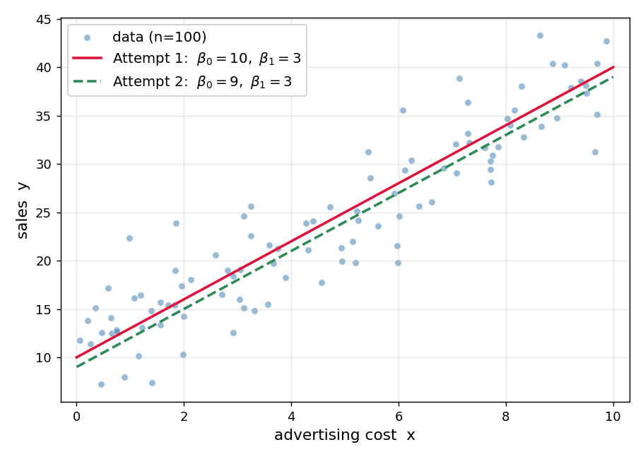
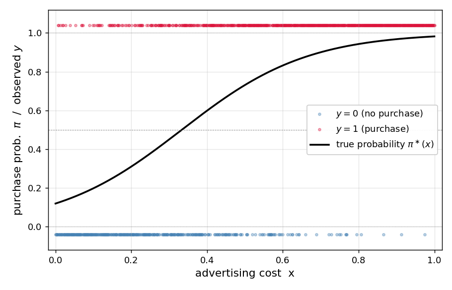
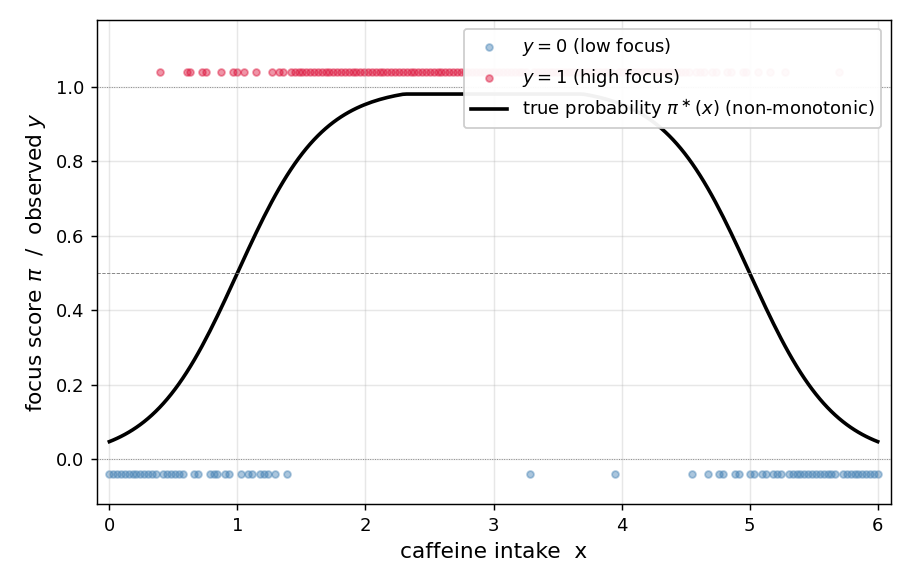
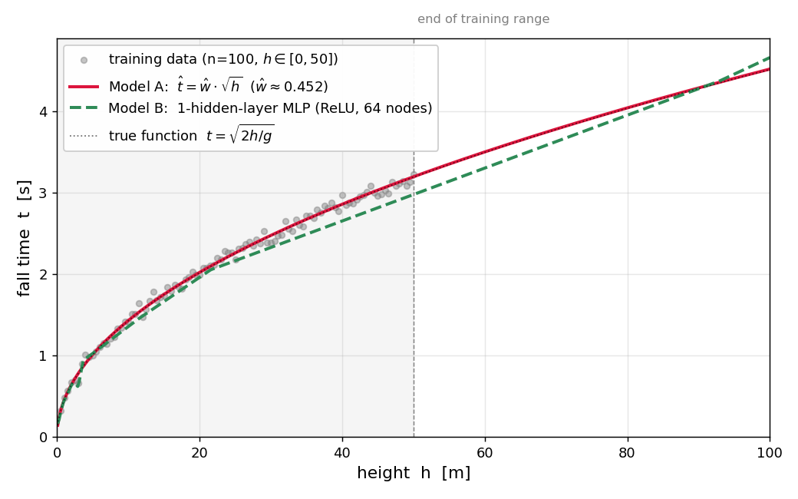

## Problem 1. Advertising Cost vs. Sales

Mr. Kim, working at a marketing firm, collected 100 days' worth of data on (advertising cost $x$, sales $y$). The scatter plot showed a positive correlation. Mr. Kim wants to estimate the underlying trend so as to predict future sales.



`(1)` Mr. Kim wants to assume that the data above were generated from some statistical model. Which is the most natural assumption?

① $y_i \overset{i.i.d.}{\sim} N(0, 1)$\
② $y_i = w_0^\ast + w_1^\ast x_i$\
③ $y_i = w_0^\ast + w_1^\ast x_i + \epsilon_i, \quad \epsilon_i \overset{i.i.d.}{\sim} N(0, \sigma^2)$\
④ $y_i = w_0^\ast / x_i$

`(2)` Mr. Kim found it hard to decide by intuition which is better between two candidate lines: Attempt 1 $[\hat w_0, \hat w_1] = [10, 3]$ and Attempt 2 $[\hat w_0, \hat w_1] = [9, 3]$. Which is the most appropriate tool to make this comparison objective?

① Collect more than 100 days of data so that the scatter plot becomes denser, allowing one to visually distinguish which line is better\
② For each line, define a loss function such as $$l(w_0, w_1) \;=\; \sum_{i=1}^{n}\big(y_i - w_0 - w_1 x_i\big)^{2}$$ which aggregates the differences between data points $(x_i, y_i)$ and the line's prediction $w_0 + w_1 x_i$, then numerically compare the $l$ values of the two lines\
③ Add more candidate lines (Attempt 3, Attempt 4, ...) and compare them all with Attempt 1 and Attempt 2; the better candidate will naturally emerge\
④ Flip a coin: heads → Attempt 1, tails → Attempt 2 as the line that fits the data better

`(3)` Mr. Kim computed the loss function defined in (2) ②

$$l(w_0, w_1) \;=\; \sum_{i=1}^{n}\big(y_i - (w_0 + w_1 x_i)\big)^{2}$$

for the two candidates and found $l(10, 3) < l(9, 3)$ (i.e., Attempt 1's loss is smaller than Attempt 2's). Which interpretation of this result is correct?

① Attempt 1 fits the data better than Attempt 2\
② Attempt 2 fits the data better than Attempt 1\
③ The two lines fit the data equally well\
④ The two lines cannot be compared by the value of $l$ alone

`(4)` Among the following statements about the simple regression loss function

$$l(w_0, w_1) \;=\; \sum_{i=1}^{n}\big(y_i - (w_0 + w_1 x_i)\big)^{2}$$

which **correctly explains the key reason** why regression can be solved by gradient descent?

① $l$ can be viewed as a function of the parameters $(w_0, w_1)$ and is convex in $(w_0, w_1)$, so regression reduces to the convex optimization problem of minimizing $l(w_0, w_1)$, which is solvable by gradient descent\
② Gradient descent only applies to regression problems where the error term follows a normal distribution; since this assumption is implicit in the data, gradient descent is applicable\
③ Gradient descent only works when the loss is MSE; although $l$ itself is not MSE, $\frac{1}{n}\, l$ equals MSE, so gradient descent is applicable\
④ Gradient descent only applies when the number of data points is $n > 30$; since $n = 100$ here, gradient descent is applicable

## Problem 2. Regression with PyTorch

Now Mr. Kim wants to implement the regression of Problem 1 directly with PyTorch. He stored the 100 days of data in length-100 tensors `x` and `y`, then wrote the following **base code** to learn $(\hat w_0, \hat w_1)$. (In the code, `w0hat` and `w1hat` correspond to $\hat w_0, \hat w_1$ respectively.)

```python
x = torch.tensor(...)   # length-100 tensor of advertising cost (assume given)
y = torch.tensor(...)   # length-100 tensor of sales (assume given)

w0hat = torch.tensor(0.0, requires_grad=True)
w1hat = torch.tensor(0.0, requires_grad=True)
for epoch in range(30):
    yhat = w0hat + w1hat * x
    loss = torch.sum((y - yhat)**2)
    loss.backward()
    w0hat.data = w0hat.data - 0.001 * w0hat.grad
    w1hat.data = w1hat.data - 0.001 * w1hat.grad
    w0hat.grad = None
    w1hat.grad = None
```

The following (1)–(3) are variants written to produce the same result as the base code. Choose the correct fill-in for each variant's blank.

`(1)` **Constructing matrices ${\bf X}, {\bf Y}$.** From the base code's tensors `x` and `y`, build the design matrix

$${\bf X}_{100\times 2} \;=\; \begin{bmatrix} 1 & x_1 \\ 1 & x_2 \\ \vdots & \vdots \\ 1 & x_{100} \end{bmatrix}, \qquad {\bf Y}_{100\times 1} \;=\; \begin{bmatrix} y_1 \\ y_2 \\ \vdots \\ y_{100} \end{bmatrix}$$

Which of the following is correct for the blanks ⓐ, ⓑ?

```python
X = ⓐ
Y = ⓑ
```

① ⓐ `torch.stack([torch.ones(100), x], axis=1)`, ⓑ `y.reshape(-1, 1)`\
② ⓐ `torch.cat([torch.ones(100), x])`, ⓑ `y`\
③ ⓐ `x.reshape(100, 2)`, ⓑ `y.reshape(1, -1)`\
④ ⓐ `torch.stack([x, torch.ones(100)], axis=0)`, ⓑ `y.T`

`(2)` **Matrix-form training code using ${\bf X}, {\bf Y}$.** Which is correct for the blank? (`What` is a $2 \times 1$ weight tensor.)

```python
What = torch.tensor([[0.0], [0.0]], requires_grad=True)
for epoch in range(30):
    ???
    loss = torch.sum((Y - Yhat)**2)
    loss.backward()
    What.data = What.data - 0.001 * What.grad
    What.grad = None
```

① `Yhat = X @ What`\
② `Yhat = What @ X`\
③ `Yhat = X * What`\
④ `Yhat = What.T @ X`

`(3)` **Variant using `nn.Linear`.** Which is correct for the blanks ⓐ, ⓑ? (Input is ${\bf X}$ from (1), output is ${\bf Y}$.)

```python
net = ⓐ
loss_fn = torch.nn.MSELoss()
for epoch in range(30):
    Yhat = net(X)
    loss = loss_fn(Yhat, Y)
    loss.backward()
    net.weight.data = net.weight.data - 0.1 * net.weight.grad
    ⓑ
```

① ⓐ `torch.nn.Linear(2, 1, bias=False)`, ⓑ `net.weight.grad = None`\
② ⓐ `torch.nn.Linear(2, 1, bias=True)`, ⓑ `net.weight.grad = None`\
③ ⓐ `torch.nn.Linear(2, 1, bias=False)`, ⓑ leave blank\
④ ⓐ `torch.nn.Linear(1, 2, bias=False)`, ⓑ `net.weight.grad = None`

## Problem 3. Advertising Cost vs. Purchase Decision

Researcher Lee collected 1000 data points of (advertising cost $x \in [0, 1]$, purchase decision $y \in \{0, 1\}$). Assume that the data were generated from the following model.

```python
torch.manual_seed(0)
x = torch.linspace(0, 1, 1000)
def sig(u):
    return torch.exp(u) / (torch.exp(u) + 1)
piast = sig(-2 + 6 * x)
y = torch.bernoulli(piast)
```



`(1)` Which is the correct mathematical expression of the code above?

① $\pi_i^\ast = \text{sig}(-2 + 6 x_i), \quad y_i = \pi_i^\ast + \epsilon_i, \quad \epsilon_i \sim N(0, 1)$\
② $\pi_i^\ast = \text{sig}(-2 + 6 x_i), \quad y_i \sim \text{Bernoulli}(\pi_i^\ast)$\
③ $\pi_i^\ast = \text{sig}(6 - 2 x_i), \quad y_i \sim \text{Bernoulli}(\pi_i^\ast)$\
④ $\pi_i^\ast = \text{sig}(-2 + 6 x_i), \quad y_i \sim N(\pi_i^\ast, 1)$

`(2)` Researcher Lee wants to write a network that fits the data above as follows. What are the correct values for the blanks (a), (b)?

```python
X = x.reshape(-1, 1)
Y = y.reshape(-1, 1)
net = torch.nn.Sequential(
    torch.nn.Linear(in_features=(a), out_features=(b)),
    torch.nn.Sigmoid()
)
```

① (a) 1, (b) 1\
② (a) 2, (b) 1\
③ (a) 1, (b) 2\
④ (a) 1000, (b) 1

`(3)` How many learnable parameters does the network in (2) have?

① 1\
② 2\
③ 3\
④ 1000

`(4)` What is the most appropriate loss function for training this model?

① `torch.nn.MSELoss()`\
② `torch.nn.BCELoss()`\
③ `torch.nn.CrossEntropyLoss()`\
④ `torch.nn.L1Loss()`

`(5)` Suppose training finishes well with appropriate learning rate and optimizer. Which is the closest value of `net[0].weight, net[0].bias`?

① `net[0].weight ≈ [[6.0]]`, `net[0].bias ≈ [-2.0]`\
② `net[0].weight ≈ [[-2.0]]`, `net[0].bias ≈ [6.0]`\
③ `net[0].weight ≈ [[0.0]]`, `net[0].bias ≈ [0.0]`\
④ `net[0].weight ≈ [[1.0]]`, `net[0].bias ≈ [1.0]`

## Problem 4. Caffeine vs. Concentration

Pharmacist Park collected (caffeine intake $x$, concentration score $y \in \{0, 1\}$) data. The plot showed that as caffeine increases, concentration rises up to a certain point and then decreases. Park first tried fitting with a simple logistic `net1` and failed, then succeeded by switching to `net2`.



```python
# net1 (failed)
net1 = torch.nn.Sequential(
    torch.nn.Linear(1, 1),
    torch.nn.Sigmoid()
)

# net2 (succeeded)
net2 = torch.nn.Sequential(
    torch.nn.Linear(1, 2, bias=True),
    torch.nn.ReLU(),
    torch.nn.Linear(2, 1, bias=True),
    torch.nn.Sigmoid()
)
```

`(1)` What is the biggest reason `net1` failed?

① The learning rate was too small\
② The pre-sigmoid value is a straight line, so only monotonically increasing/decreasing S-shapes can be expressed; an "increase-then-decrease" shape is not expressible\
③ One should use `MSELoss` instead of `BCELoss`\
④ The number of epochs was insufficient

`(2)` Which is correct about the comparison of the number of learnable parameters of `net1` and `net2`?

① `net1` has more than `net2`\
② `net2` has more than `net1`\
③ Both have the same\
④ Neither has any learnable parameters

`(3)` Among the descriptions of each layer of `net2` below, which is **incorrect**? (Assume the input tensor's shape is $(n, 1)$.)

① `net2[0]` outputs shape $(n, 2)$ and has learnable parameters\
② `net2[1]` outputs shape $(n, 2)$ and has no learnable parameters\
③ `net2[2]` takes input shape $(n, 2)$, outputs shape $(n, 1)$, and has learnable parameters\
④ `net2[3]` outputs shape $(n, 1)$ and has learnable parameters

`(4)` Among the descriptions of `net2`'s expressive power, which is **incorrect**?

① The pre-sigmoid value can be a piecewise-linear (kinked) line, so `net2` is more expressive than `net1`\
② Since the 2 hidden nodes go through ReLU, the pre-sigmoid value can express a line with at most 2 kinks\
③ It can only express kinked lines and never the simple S curve that `net1` represents\
④ Data well-fit by `net1` (simple logistic) can also be fit by `net2`

## Problem 5. Free Fall Experiment

Professor Choi (Physics) collected 100 data points of "drop height $h$ vs. free-fall time $t$" stored in length-100 lists `height`, `fall_time`. Two models are fit:

**Model A (Traditional Modeling)** — uses domain knowledge ($t \propto \sqrt{h}$): apply $\sqrt{\cdot}$ transformation to the input first, then 1-layer linear regression.

```python
X = torch.sqrt(torch.tensor(height)).reshape(-1, 1)
Y = torch.tensor(fall_time).reshape(-1, 1)
net_A = torch.nn.Sequential(
    torch.nn.Linear(1, 1, bias=False)
)
# Prediction at new input h_new: net_A(torch.sqrt(torch.tensor([[h_new]])))
```

**Model B (Deep-learning style)** — without domain knowledge: 1-hidden-layer MLP that takes $h$ directly as input.

```python
X = torch.tensor(height).reshape(-1, 1)
Y = torch.tensor(fall_time).reshape(-1, 1)
net_B = torch.nn.Sequential(
    torch.nn.Linear(1, 512),
    torch.nn.ReLU(),
    torch.nn.Linear(512, 1)
)
# Prediction at new input h_new: net_B(torch.tensor([[h_new]]))
```

Within the training data range, the two models gave similar predictions. However, for large $h$ outside the training range, the predictions differed significantly.



`(1)` Which is correct about comparing the number of learnable parameters of the two models?

① Model A has more than Model B\
② Model B has more than Model A\
③ Both have the same\
④ Neither has learnable parameters

`(2)` Which is the most appropriate reason that the two models give similar predictions inside the training data range?

① Because the two models exactly learned the same function\
② Within the training data range, each model just happened to find some function with similar outputs\
③ Because both models were fit to the same training data\
④ Because the Adam optimizer guarantees the correct answer

`(3)` Which is the most appropriate reason that the predictions of the two models differ for large $h$ outside the training range?

① Model A follows the $\sqrt{h}$ curve faithfully, but Model B is a ReLU-based piecewise-linear function whose last linear segment at the end of the training data simply continues outward\
② Because Model A was incorrectly trained\
③ Because Model B is 100% accurate\
④ Because the data noise is larger outside the training range

`(4)` If we increase the hidden-layer node count of Model B far beyond 512 (e.g., 5000), which of the following statements about training results is correct?

① Larger node counts always fit the training data better and so always give a better model\
② Too large a node count increases the risk of overfitting; regularization techniques such as Dropout can mitigate this\
③ Node count is irrelevant to training results\
④ Larger node counts only increase training time without changing expressive power

`(5)` We added Dropout between the activation (ReLU) and the next Linear of Model B and finished training.

```python
net_B = torch.nn.Sequential(
    torch.nn.Linear(1, 512),
    torch.nn.ReLU(),
    torch.nn.Dropout(0.8),
    torch.nn.Linear(512, 1)
)
# (training code omitted)
```

Now we want to compute prediction `Yhat` at a new input `Xnew = torch.tensor([[50.0]])`. Which is the most correct code?

①
```python
Yhat = net_B(Xnew)
```

②
```python
net_B.eval()
Yhat = net_B(Xnew)
```

③
```python
net_B.train()
Yhat = net_B(Xnew)
```

④
```python
Yhat = net_B(Xnew)
net_B.eval()
```

## Problem 6. The 16 Truth Tables

For two binary inputs $x_1, x_2 \in \{0, 1\}$, there are exactly $2^4 = 16$ possible truth tables for output $y \in \{0, 1\}$. Below is the full list of these 16 truth tables ($D_1$ ~ $D_{16}$).

:::: {.columns}

:::: {.column width="24%"}
::: {.callout-note appearance="simple" icon=false}
**$D_{1}$**

| ${\bf x}_1$ | ${\bf x}_2$ | ${\bf y}$ |
|:---:|:---:|:---:|
| 0 | 0 | 0 |
| 0 | 1 | 0 |
| 1 | 0 | 0 |
| 1 | 1 | 0 |
:::
::::
:::: {.column width="1%"}
::::

:::: {.column width="24%"}
::: {.callout-note appearance="simple" icon=false}
**$D_{2}$**

| ${\bf x}_1$ | ${\bf x}_2$ | ${\bf y}$ |
|:---:|:---:|:---:|
| 0 | 0 | 0 |
| 0 | 1 | 0 |
| 1 | 0 | 0 |
| 1 | 1 | 1 |
:::
::::
:::: {.column width="1%"}
::::

:::: {.column width="24%"}
::: {.callout-note appearance="simple" icon=false}
**$D_{3}$**

| ${\bf x}_1$ | ${\bf x}_2$ | ${\bf y}$ |
|:---:|:---:|:---:|
| 0 | 0 | 0 |
| 0 | 1 | 0 |
| 1 | 0 | 1 |
| 1 | 1 | 0 |
:::
::::
:::: {.column width="1%"}
::::

:::: {.column width="24%"}
::: {.callout-note appearance="simple" icon=false}
**$D_{4}$**

| ${\bf x}_1$ | ${\bf x}_2$ | ${\bf y}$ |
|:---:|:---:|:---:|
| 0 | 0 | 0 |
| 0 | 1 | 0 |
| 1 | 0 | 1 |
| 1 | 1 | 1 |
:::
::::

::::

:::: {.columns}

:::: {.column width="24%"}
::: {.callout-note appearance="simple" icon=false}
**$D_{5}$**

| ${\bf x}_1$ | ${\bf x}_2$ | ${\bf y}$ |
|:---:|:---:|:---:|
| 0 | 0 | 0 |
| 0 | 1 | 1 |
| 1 | 0 | 0 |
| 1 | 1 | 0 |
:::
::::
:::: {.column width="1%"}
::::

:::: {.column width="24%"}
::: {.callout-note appearance="simple" icon=false}
**$D_{6}$**

| ${\bf x}_1$ | ${\bf x}_2$ | ${\bf y}$ |
|:---:|:---:|:---:|
| 0 | 0 | 0 |
| 0 | 1 | 1 |
| 1 | 0 | 0 |
| 1 | 1 | 1 |
:::
::::
:::: {.column width="1%"}
::::

:::: {.column width="24%"}
::: {.callout-note appearance="simple" icon=false}
**$D_{7}$**

| ${\bf x}_1$ | ${\bf x}_2$ | ${\bf y}$ |
|:---:|:---:|:---:|
| 0 | 0 | 0 |
| 0 | 1 | 1 |
| 1 | 0 | 1 |
| 1 | 1 | 0 |
:::
::::
:::: {.column width="1%"}
::::

:::: {.column width="24%"}
::: {.callout-note appearance="simple" icon=false}
**$D_{8}$**

| ${\bf x}_1$ | ${\bf x}_2$ | ${\bf y}$ |
|:---:|:---:|:---:|
| 0 | 0 | 0 |
| 0 | 1 | 1 |
| 1 | 0 | 1 |
| 1 | 1 | 1 |
:::
::::

::::

:::: {.columns}

:::: {.column width="24%"}
::: {.callout-note appearance="simple" icon=false}
**$D_{9}$**

| ${\bf x}_1$ | ${\bf x}_2$ | ${\bf y}$ |
|:---:|:---:|:---:|
| 0 | 0 | 1 |
| 0 | 1 | 0 |
| 1 | 0 | 0 |
| 1 | 1 | 0 |
:::
::::
:::: {.column width="1%"}
::::

:::: {.column width="24%"}
::: {.callout-note appearance="simple" icon=false}
**$D_{10}$**

| ${\bf x}_1$ | ${\bf x}_2$ | ${\bf y}$ |
|:---:|:---:|:---:|
| 0 | 0 | 1 |
| 0 | 1 | 0 |
| 1 | 0 | 0 |
| 1 | 1 | 1 |
:::
::::
:::: {.column width="1%"}
::::

:::: {.column width="24%"}
::: {.callout-note appearance="simple" icon=false}
**$D_{11}$**

| ${\bf x}_1$ | ${\bf x}_2$ | ${\bf y}$ |
|:---:|:---:|:---:|
| 0 | 0 | 1 |
| 0 | 1 | 0 |
| 1 | 0 | 1 |
| 1 | 1 | 0 |
:::
::::
:::: {.column width="1%"}
::::

:::: {.column width="24%"}
::: {.callout-note appearance="simple" icon=false}
**$D_{12}$**

| ${\bf x}_1$ | ${\bf x}_2$ | ${\bf y}$ |
|:---:|:---:|:---:|
| 0 | 0 | 1 |
| 0 | 1 | 0 |
| 1 | 0 | 1 |
| 1 | 1 | 1 |
:::
::::

::::

:::: {.columns}

:::: {.column width="24%"}
::: {.callout-note appearance="simple" icon=false}
**$D_{13}$**

| ${\bf x}_1$ | ${\bf x}_2$ | ${\bf y}$ |
|:---:|:---:|:---:|
| 0 | 0 | 1 |
| 0 | 1 | 1 |
| 1 | 0 | 0 |
| 1 | 1 | 0 |
:::
::::
:::: {.column width="1%"}
::::

:::: {.column width="24%"}
::: {.callout-note appearance="simple" icon=false}
**$D_{14}$**

| ${\bf x}_1$ | ${\bf x}_2$ | ${\bf y}$ |
|:---:|:---:|:---:|
| 0 | 0 | 1 |
| 0 | 1 | 1 |
| 1 | 0 | 0 |
| 1 | 1 | 1 |
:::
::::
:::: {.column width="1%"}
::::

:::: {.column width="24%"}
::: {.callout-note appearance="simple" icon=false}
**$D_{15}$**

| ${\bf x}_1$ | ${\bf x}_2$ | ${\bf y}$ |
|:---:|:---:|:---:|
| 0 | 0 | 1 |
| 0 | 1 | 1 |
| 1 | 0 | 1 |
| 1 | 1 | 0 |
:::
::::
:::: {.column width="1%"}
::::

:::: {.column width="24%"}
::: {.callout-note appearance="simple" icon=false}
**$D_{16}$**

| ${\bf x}_1$ | ${\bf x}_2$ | ${\bf y}$ |
|:---:|:---:|:---:|
| 0 | 0 | 1 |
| 0 | 1 | 1 |
| 1 | 0 | 1 |
| 1 | 1 | 1 |
:::
::::

::::


We define a simple logistic network as below and set its weights to $(w_0, w_1, w_2) = (0, 0, 0)$.

```python
net = torch.nn.Sequential(
    torch.nn.Linear(2, 1),
    torch.nn.Sigmoid()
)

net[0].bias.data   = torch.tensor([0.0])         # w_0 = 0
net[0].weight.data = torch.tensor([[0.0, 0.0]])  # (w_1, w_2) = (0, 0)
```

`(1)` Under the weight setting $(w_0, w_1, w_2) = (0, 0, 0)$, what is the most appropriate value of the network's output vector $\hat{\bf y} = (\hat y_1, \hat y_2, \hat y_3, \hat y_4)$ — collecting outputs $\hat y_i$ for the four rows $(x_{1,i}, x_{2,i})$, $i = 1, 2, 3, 4$?

① $\hat{\bf y} = (0,\ 0,\ 0,\ 0)$\
② $\hat{\bf y} = (0.5,\ 0.5,\ 0.5,\ 0.5)$\
③ $\hat{\bf y} = (1,\ 1,\ 1,\ 1)$\
④ $\hat{\bf y} = (0,\ 1,\ 1,\ 1)$  (only at input $(0, 0)$ the output is $0$)

`(2)` Which is the most appropriate formula for the network's output vector $\hat{\bf y}$ in terms of inputs ${\bf x}_1, {\bf x}_2$ and weights $(w_0, w_1, w_2)$? (Here $\text{sig}(z) = \dfrac{e^z}{1 + e^z}$ is the sigmoid function, applied elementwise to vectors.)

① $\hat{\bf y} = w_0 + w_1 {\bf x}_1 + w_2 {\bf x}_2$\
② $\hat{\bf y} = \text{sig}(w_0 + w_1 {\bf x}_1 + w_2 {\bf x}_2)$\
③ $\hat{\bf y} = \text{sig}(w_0) + w_1 {\bf x}_1 + w_2 {\bf x}_2$\
④ $\hat{\bf y} = w_0 \cdot \text{sig}({\bf x}_1) + w_2 \cdot \text{sig}({\bf x}_2)$

> **Note**: In (3)–(7) below, "fits well" means $\hat y_i \approx y_i$ for all $i = 1, 2, 3, 4$.

`(3)` From $D_1 \sim D_{16}$, list **all** datasets for which no choice of weights $(w_0, w_1, w_2)$ can make $\hat y_i \approx y_i$ hold (i.e., the dataset that **cannot** be fit by simple logistic).

(answer: __________________________________________ )

`(4)` Keeping $(w_1, w_2) = (0, 0)$ and setting $w_0$ to a very large **positive** value, list the datasets from $D_1 \sim D_{16}$ that fit well under this setup.

(answer: __________________________________________ )

`(5)` Keeping $(w_1, w_2) = (0, 0)$ and setting $w_0$ to a very large **negative** value, list the datasets from $D_1 \sim D_{16}$ that fit well under this setup.

(answer: __________________________________________ )

> **Note**: The answers to (6)–(7) below have multiple correct choices, but writing only one of them correctly counts as a correct answer.

`(6)` Pick one dataset from $D_1 \sim D_{16}$ for which the fitted weight $w_1$ is expected to be **positive** and $w_2$ is expected to be **negative**.

(answer: __________________________________________ )

`(7)` Pick one dataset from $D_1 \sim D_{16}$ for which the fitted weight $w_1$ is expected to be **negative** and $w_2$ is expected to be **positive**.

(answer: __________________________________________ )

## Problem 7. Discussion on Bernoulli Estimation

Read the following two materials and answer the questions.

::: {.callout-note appearance="default" icon=false title="〈Material 1〉 A Quiz Problem and its Solution from a Lecture"}

`(Quiz)`

The code below generates $X_i \overset{i.i.d.}{\sim} \text{Ber}(p^\ast)$ (true parameter $p^\ast = 0.3$).

```python
torch.manual_seed(43052)
x = torch.bernoulli(torch.tensor([0.3] * 5000))
```

Use gradient descent to estimate $p$ that minimizes the function $l(p)$ below.

$$l(p) = -\frac{1}{n} \sum_{i=1}^{n} \log f(x_i), \quad f(x_i) = p^{x_i}(1-p)^{1-x_i}$$

`(Solution)`

```python
def l(p):
    return -torch.mean(torch.log(p**x * (1-p)**(1-x)))
```

```python
p = torch.tensor(0.5, requires_grad=True)
for dummy in range(15):
    l(p).backward()
    p.data = p.data - 0.1 * p.grad
    p.grad = None
    print(p.data)
```

```
tensor(0.4170)
tensor(0.3659)
tensor(0.3343)
tensor(0.3156)
tensor(0.3049)
tensor(0.2991)
tensor(0.2960)
tensor(0.2944)
tensor(0.2935)
tensor(0.2931)
tensor(0.2928)
tensor(0.2927)
tensor(0.2927)
tensor(0.2926)
tensor(0.2926)
```

```python
x.mean()  # check
```

```
tensor(0.2926)
```

:::

::: {.callout-note appearance="default" icon=false title="〈Material 2〉 An Excerpt from a Mathematical Statistics Textbook"}

For an i.i.d. sample $x_1, \dots, x_n$ drawn from the Bernoulli distribution $\text{Ber}(p)$ with $p \in (0,1)$, consider the function

$$l(p) = -\frac{1}{n}\sum_{i=1}^n \log f(x_i), \quad f(x_i) = p^{x_i}(1-p)^{1-x_i}.$$

Since $\log f(x_i) = x_i \log p + (1 - x_i)\log(1-p)$, letting $\bar x = \frac{1}{n}\sum_{i=1}^n x_i$ denote the sample mean, we may rewrite

$$l(p) = -\bar x \log p - (1 - \bar x)\log(1-p).$$

Differentiating directly with respect to $p$:

$$l'(p) = -\frac{\bar x}{p} + \frac{1 - \bar x}{1 - p}, \qquad l''(p) = \frac{\bar x}{p^2} + \frac{1 - \bar x}{(1-p)^2}$$

Since $\bar x \in [0,1]$ and $p \in (0,1)$, we have $l''(p) > 0$. That is, $l$ is a strongly convex function on $(0,1)$, and the unique solution

$$\hat p = \bar x$$

of $l'(p) = 0$ is the unique minimizer of $l$. This $\hat p$ is called the **Maximum Likelihood Estimator (MLE)** of the Bernoulli parameter $p$. Furthermore, by the Law of Large Numbers, $\bar x \overset{n \to \infty}{\to} p$, so by taking the sample size $n$ large enough, $\hat p$ can be made arbitrarily close to the true parameter $p$.

:::

Seven students discuss the two materials above:

- **Jaehyun**: "The fact that $p$ converged to 0.297 means the true parameter $p^\ast$ that generated the data is 0.297. We've recovered the true value."
- **Seulgi**: "Jaehyun is wrong. The convergence value is not the true parameter $p^\ast$ but the sample mean `x.mean()`. The fact that the two `print` outputs in the code are identical proves it."
- **Eunhee**: "Even if we remove the `p.grad = None` line in the code, the result would be the same. Since we only update `p.data`, accumulating grad has no effect on the result."
- **Semin**: "Material 2 told us that $l(p)$ is convex, so changing the initial value from $p = 0.5$ to $p = 0.1$ would still converge to the same point."
- **Jisu**: "Actually, Material 1's code is nothing more than a numerical re-confirmation, via PyTorch, of the result $\hat{p} = \bar x$ that Material 2 has already derived analytically."
- **Dohyun**: "Jisu is right. It's like running gradient descent on $f(x) = (x - 2)^2$ even though we already know by hand that its minimum is at $x = 2$."
- **Yunseo**: "Then if the MLE can be solved cleanly by hand, the mathematical-statistics approach (like Material 2) is preferable; if hand differentiation is hard, the practical approach is the gradient-descent style of Material 1 — define the loss and update parameters along its gradient to find the numerical optimum."

`(1)` Among the seven students above, choose **all** who made a **correct claim**.

① Jaehyun, Eunhee\
② Seulgi, Semin, Jisu, Dohyun, Yunseo\
③ Jaehyun, Seulgi, Semin, Jisu, Dohyun\
④ Jaehyun, Seulgi, Eunhee, Semin, Jisu, Dohyun, Yunseo

`(2)` What is the **initial value** of the variable `p` in Material 1's code?

① $0$\
② $0.3$\
③ $0.5$\
④ $0.297$

`(3)` What is the **learning rate $\alpha$** used in Material 1's code?

① $0.01$\
② $0.05$\
③ $0.1$\
④ $0.5$

`(4)` Suppose we keep everything else in Material 1's code the same but change only the learning rate to $\alpha = 10^{-6}$ and re-run. Which best describes the value of `p.data` after 50 iterations?

① Each iteration's update is too tiny; in 50 iterations `p.data` barely moves and stays near the initial value $0.5$\
② A smaller learning rate makes the convergence more accurate, so `p.data` converges to the true parameter $p^\ast = 0.3$\
③ Regardless of the learning rate, `p.data` always reaches exactly $0.297$ within 50 iterations\
④ Smaller learning rate causes the update to diverge to $\pm \infty$

`(5)` Material 2 showed by direct differentiation that $l(p)$ is convex on $(0,1)$. Which is the most appropriate **additional fact** guaranteed about Material 1's result?

① Even if we change the initial value from $p = 0.5$ to $p = 0.1$ or $p = 0.9$, with appropriate learning rate and enough iterations, gradient descent still converges to the same unique minimum $\hat p = \bar x$\
② For convex functions, gradient descent reaches the exact minimum in 1 iteration regardless of the learning rate\
③ For convex losses, starting from any initial value always converges exactly to the true parameter $p^\ast$\
④ The convexity of $l(p)$ has no impact on PyTorch's training result

`(6)` Suppose we change only `torch.manual_seed(43052)` in Material 1's code to a different seed (e.g., `torch.manual_seed(2026)`) and re-run. Which is **correct** about the function $l(p)$ and its minimizer?

(a) `x = torch.bernoulli(torch.tensor([0.3] * 5000))` produces 5000 values of 0 or 1 stored in ${\bf x}$. Even if the seed changes, the count of 1's in ${\bf x}$ stays roughly 1485 (almost the same), so the minimizer of $l(p)$ remains 0.297.\
(b) Changing the seed changes ${\bf x}$, which changes the shape of $l(p)$, so $l(p)$ no longer remains convex on $(0,1)$.\
(c) The shape of $l(p)$ remains convex (downward-opening), but the location of its minimum shifts to a value different from 0.297.\
(d) $l(p)$ is a function of the variable $p$ only, so no matter how the seed changes, $l(p)$ itself and its minimizer remain at 0.297.

① (a)\
② (b)\
③ (c)\
④ (d)

`(7)` By the conclusion of Material 2, when gradient descent in Material 1 is performed properly, the convergence value should theoretically be $\bar x \approx 0.297$. However, modifying parts of Material 1's code as below could prevent `p.data` from reaching close to $0.297$ within 50 iterations. Choose **all** modifications that carry such risk.

(a) Increase the learning rate from $\alpha = 0.1$ to $\alpha = 100$ (very large)\
(b) Decrease the learning rate from $\alpha = 0.1$ to $\alpha = 10^{-6}$ (very small)\
(c) Change `range(50)` to `range(1)` so only 1 iteration runs\
(d) Change initial value $p = 0.5$ to $p = 0.4$ (keeping learning rate, iteration count, etc. the same)

① (a)\
② (a), (b)\
③ (a), (b), (c)\
④ (a), (b), (c), (d)

## Problem 8. Comprehensive Deep Learning Concepts

The following is a comprehensive problem grouping core deep-learning concepts by topic.


##### Divergence Threshold of Learning Rate

The figure below shows the result of running gradient descent on $f(x) = (x-2)^2$ from the starting point $x_{sol} = 6.5$ with learning rates $0.1, 0.5, 0.95, 1.05$.


`(1)` Among the figure, which learning rate requires the **most iterations** to reach near the minimum $x = 2$?

① $\alpha = 0.1$\
② $\alpha = 0.5$\
③ $\alpha = 0.95$\
④ $\alpha = 1.05$

`(2)` In the figure, which learning rate oscillates left-right and converges slowly?

① $\alpha = 0.1$\
② $\alpha = 0.5$\
③ $\alpha = 0.95$\
④ $\alpha = 1.05$

`(3)` Among the following statements about the effect of the learning rate $\alpha$ observed in the figure above, choose **all** that are **incorrect**. (Below, all statements assume $\alpha > 0$.)

(a) The larger the learning rate, the faster the convergence — always.\
(b) Small learning rate gives slow convergence; large gives fast convergence. However, for a convex function like the one in the figure, any choice of learning rate is guaranteed to converge.\
(c) Too large a learning rate may fail to converge and instead diverge.\
(d) Too small a learning rate may make convergence very slow.

① (a)\
② (a), (b)\
③ (c), (d)\
④ (a), (b), (c), (d)


##### Standard Pattern of Training Code

The standard PyTorch training pattern proceeds in 4 steps each epoch:

- **Step 1. Compute Yhat**
- **Step 2. Compute loss**
- **Step 3. Differentiate**
- **Step 4. Update**

`(4)` Which is the correct call order for blanks ⓐ, ⓑ, ⓒ in the training code below?

```python
for epoch in range(30):
    Yhat = net(X)
    loss = loss_fn(Yhat, Y)
    ⓐ
    ⓑ
    ⓒ
```

① ⓐ `loss.backward()`, ⓑ `optimizer.step()`, ⓒ `optimizer.zero_grad()`\
② ⓐ `optimizer.step()`, ⓑ `loss.backward()`, ⓒ `optimizer.zero_grad()`\
③ ⓐ `optimizer.zero_grad()`, ⓑ `optimizer.step()`, ⓒ `loss.backward()`\
④ ⓐ `loss.backward()`, ⓑ `optimizer.zero_grad()`, ⓒ `optimizer.step()`

`(5)` Which is the most appropriate role of `optimizer.step()` in the training code above?

① Sets the value of loss to 0\
② Initializes gradient values to 0\
③ Updates the weights by subtracting learning rate × gradient\
④ Initializes the weights randomly

`(6)` What is the most likely result if `optimizer.zero_grad()` is omitted in the training code above?

① Training proceeds exactly the same\
② Gradients accumulate every epoch and training proceeds abnormally\
③ The number of epochs automatically doubles\
④ The learning rate automatically becomes 0

##### Number of Nodes and Expressive Power

`(7)` Which of the following two networks can fit a more complex curve?

```python
# (a)
net_a = torch.nn.Sequential(
    torch.nn.Linear(1, 2),
    torch.nn.ReLU(),
    torch.nn.Linear(2, 1)
)

# (b)
net_b = torch.nn.Sequential(
    torch.nn.Linear(1, 512),
    torch.nn.ReLU(),
    torch.nn.Linear(512, 1)
)
```

① (a)\
② (b). With more hidden nodes, more kinks (piecewise-linear pieces) can be expressed\
③ Both have the same expressive power\
④ Both can only express straight lines

`(8)` Suppose we fit some curve data with `net_a` or `net_b` above. As we increase the data size $n$, which is correct? (assume sufficient learning rate and epoch count)

① As $n$ grows, any network gets close to the true function exactly\
② Just because $n$ grows does not automatically increase the network's expressive power; if the node count is not large enough, it is hard to say the network gets close to the true function\
③ As $n$ grows, the number of kinks the network can have increases automatically\
④ The size of $n$ is unrelated to the fit result

`(9)` Choose **all** correct descriptions of the expressive power of `net_a`.

① It can express a simple S-shaped curve\
② It can express a curve formed by passing a once-kinked line through a sigmoid\
③ It can express a constant function (form $f(x) = c$)\
④ It can exactly express any kind of function

##### Cybenko's Theorem, Overfitting, Dropout

The following theorem is known as **Cybenko's Theorem (Universal Approximation Theorem)**:

> A 1-hidden-layer network (with sufficient nodes + ReLU or Sigmoid activation) can approximate any Borel-measurable function $f: {\bf X}_{n \times p} \to {\bf Y}_{n \times q}$ to arbitrary precision.

`(10)` Among the following statements about the relation between Cybenko's theorem and overfitting, choose **all** that are **correct**.

(a) Cybenko's theorem guarantees that a 1-hidden-layer network with sufficient nodes can **express** any function to arbitrary precision.\
(b) Cybenko's theorem only guarantees expressive power; it does not guarantee that the learning algorithm finds the true function or that the model generalizes to unseen data.\
(c) A network with strong expressive power (e.g., a 1-hidden-layer with very many nodes) can fit even the noise in the training data, which can in turn cause overfitting.\
(d) By Cybenko's theorem, generalization performance always improves as long as the node count is large enough.

① (a), (b)\
② (a), (b), (c)\
③ (a), (b), (c), (d)\
④ (d)

`(11)` Among the following statements about the definition and diagnosis of overfitting, choose **all** that are **correct**. (Let $A$ be the training-data loss and $C$ the evaluation-data loss.)

(a) Overfitting refers to the phenomenon where the model fits training data well but fits unseen (evaluation) data poorly.\
(b) When the evaluation loss $C$ is significantly larger than the training loss $A$ ($A \ll C$), overfitting can be suspected.\
(c) One root cause of overfitting is that the model's expressive power is too strong relative to the data.\
(d) The root cause of overfitting is that the learning rate is too large; reducing the learning rate always resolves it.

① (a), (b), (c)\
② (a), (b), (c), (d)\
③ (a), (c)\
④ (a), (d)

`(12)` Among the following statements about Dropout, choose **all** that are **correct**.

(a) `torch.nn.Dropout(p)` randomly zeros out about $p$ proportion of the input elements during training, and scales the surviving elements by $1/(1-p)$.\
(b) In `net.eval()` mode, dropout is disabled and all nodes pass through as is.\
(c) Dropout is generally placed after the activation function. However, when the activation is ReLU, the order between ReLU and Dropout can be swapped without changing the result.\
(d) Adding dropout always guarantees better performance than not adding it.

① (a), (b), (d)\
② (a), (b), (c)\
③ (a), (b), (c), (d)\
④ (d)

##### MNIST 3/7 Classification

Below is part of a PyTorch code for binary classification of handwritten digits 3 and 7 (about 6000 images each, total $n \approx 12{,}000$).

```python
# X3.shape = (6131, 1, 28, 28)   # images of digit 3
# X7.shape = (6265, 1, 28, 28)   # images of digit 7

X = torch.cat([X3, X7], axis=0).reshape(-1, ⓐ)        # X.shape = (n, ⓐ)
Y = torch.tensor([0]*6131 + [1]*6265).reshape(-1, 1).float()

net = torch.nn.Sequential(
    torch.nn.Linear(in_features=ⓐ, out_features=32),
    torch.nn.ReLU(),
    torch.nn.Linear(in_features=32, out_features=1),
    torch.nn.Sigmoid()
)
```

`(13)` Which is the correct value for the blank ⓐ in the code above?

① $1$\
② $28$\
③ $28 \times 28$\
④ $32$

`(14)` Which is the correct value of `X.shape`?

① `(6131+6265, 28*28)`\
② `(6131+6265, 1, 28, 28)`\
③ `(6131, 28*28)`\
④ `(28*28, 6131+6265)`

`(15)` Which is the most appropriate theoretical justification that the `net` above can solve a complex image classification problem like MNIST 3/7?

① Cybenko's theorem: a 1-hidden-layer network with enough nodes + ReLU activation can express any Borel-measurable function to arbitrary precision; the complex function from $28 \times 28$ images to $0/1$ labels also lies within that expressive class\
② Because `Linear(784, 32)` reduces the number of pixels and automatically compresses information\
③ Because the `Sigmoid` function always outputs a correct probability\
④ Because the `Adam` optimizer always guarantees the global optimum
