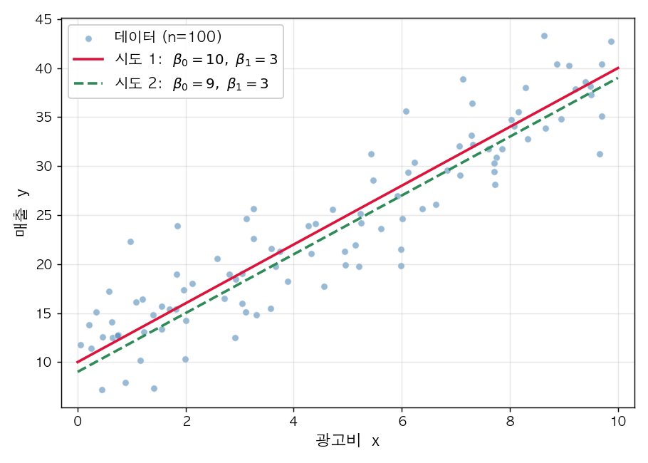
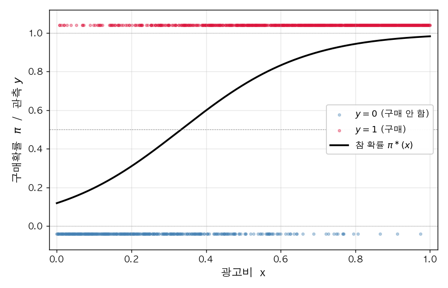
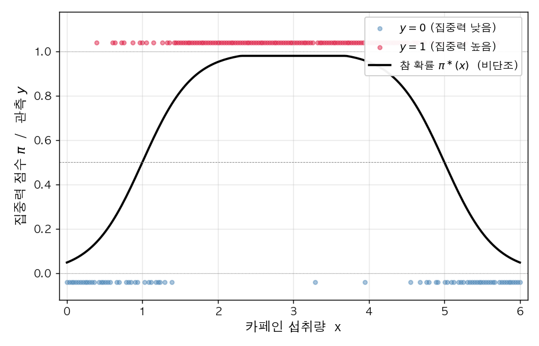
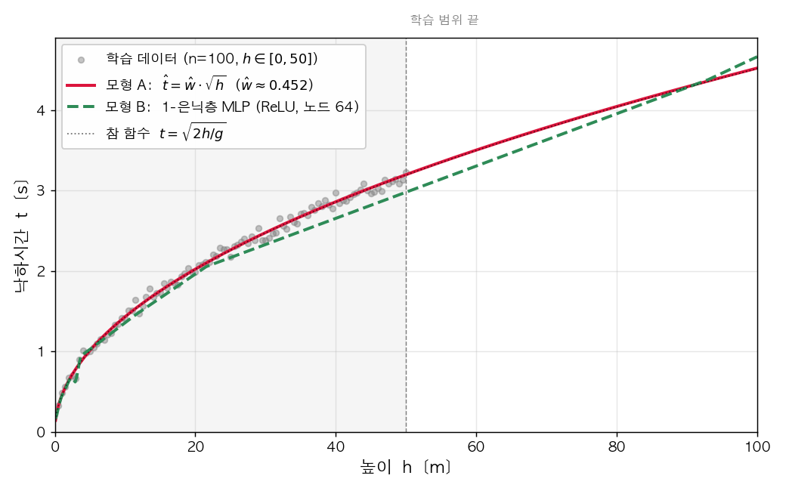

## 문제 1. 광고비와 매출

마케팅 회사의 김대리는 (광고비 $x$, 매출 $y$) 자료 100일치를 모았다. 산점도를 그려보니 양의 상관관계가 보였다. 김대리는 본질적인 추세를 추정하여 미래의 매출을 예측하고 싶다.



`(1)` 김대리는 위 자료가 어떤 통계적 모형에서 생성되었다고 가정하려 한다. 자연스러운 가정은?

① $y_i \overset{i.i.d.}{\sim} N(0, 1)$\
② $y_i = w_0^\ast + w_1^\ast x_i$\
③ $y_i = w_0^\ast + w_1^\ast x_i + \epsilon_i, \quad \epsilon_i \overset{i.i.d.}{\sim} N(0, \sigma^2)$\
④ $y_i = w_0^\ast / x_i$

`(2)` 김대리는 두 후보 직선 시도1 $[\hat w_0, \hat w_1] = [10, 3]$ 와 시도2 $[\hat w_0, \hat w_1] = [9, 3]$ 중 어느 것이 더 좋은지 직관으로 판단하기 어려웠다. 이 비교를 객관화하는 적절한 도구는?

① 데이터를 100일치보다 더 많이 수집해 산점도가 더 빽빽해지면 어느 직선이 더 좋은지 눈으로 구분할 수 있게 된다\
② 각 직선에 대해 데이터 점 $(x_i, y_i)$ 와 그 직선이 예측하는 값 $w_0 + w_1 x_i$ 사이의 차이를 모은 어떤 양, 예를 들어 $$l(w_0, w_1) \;=\; \sum_{i=1}^{n}\big(y_i - w_0 - w_1 x_i\big)^{2}$$ 같은 양을 손실함수로 정의하고, 두 직선의 $l$ 값을 수치적으로 비교한다\
③ 후보 직선의 개수를 늘려 시도3, 시도4 등을 추가하고, 새로 추가된 직선들과 시도1, 시도2 를 모두 비교하면 더 좋은 후보가 자연스럽게 드러난다\
④ 동전을 던져 앞면이 나오면 시도1, 뒷면이 나오면 시도2 를 데이터에 더 잘 맞는 직선으로 채택한다

`(3)` 김대리가 (2) 의 ② 에서 정의한 손실함수

$$l(w_0, w_1) \;=\; \sum_{i=1}^{n}\big(y_i - (w_0 + w_1 x_i)\big)^{2}$$

의 값을 두 후보에 대해 직접 계산해 보았더니 $l(10, 3) < l(9, 3)$ 이었다 (즉 시도1 의 손실이 시도2 의 손실보다 작았다). 이 결과의 해석으로 옳은 것은?

① 시도1 이 시도2 보다 데이터에 더 잘 맞는 직선이다\
② 시도2 가 시도1 보다 데이터에 더 잘 맞는 직선이다\
③ 두 직선은 데이터에 동일하게 잘 맞는다\
④ 손실 $l$ 값만으로는 두 직선의 적합 정도를 비교할 수 없다

`(4)` 단순회귀의 손실함수

$$l(w_0, w_1) \;=\; \sum_{i=1}^{n}\big(y_i - (w_0 + w_1 x_i)\big)^{2}$$

에 대한 다음 진술 중, 회귀분석을 경사하강법으로 풀 수 있는 **핵심 이유** 를 옳게 설명한 것은?

① $l$ 은 모수 $(w_0, w_1)$ 의 함수로 볼 수 있고 $(w_0, w_1)$ 에 대해 아래로 볼록 (convex) 하므로, 회귀분석은 $l(w_0, w_1)$ 을 최소화하는 최적화 문제로 환원되어 경사하강법으로 풀 수 있다\
② 경사하강법은 오차항이 정규분포를 따르는 회귀 문제에서만 적용할 수 있는데, 주어진 자료에는 그 가정이 깔려 있으므로 경사하강법을 적용할 수 있다\
③ 경사하강법은 손실함수가 MSE 일 때만 사용할 수 있는데, $l$ 자체는 MSE 가 아니지만 $\frac{1}{n}\, l$ 이 MSE 와 같으므로 경사하강법을 적용할 수 있다\
④ 경사하강법은 데이터 개수가 $n > 30$ 인 경우에만 적용할 수 있는데, 본 문항의 자료는 $n = 100$ 으로 충분히 크므로 경사하강법을 적용할 수 있다

## 문제 2. 회귀분석과 PyTorch

이제 김대리가 문제 1 의 회귀분석을 PyTorch 로 직접 구현하고자 한다. 100일치 자료를 길이 100 의 텐서 `x`, `y` 에 담은 뒤, 다음 **기준 코드** 를 작성하여 $(\hat w_0, \hat w_1)$ 을 학습하였다. (코드 내 `w0hat`, `w1hat` 이 각각 $\hat w_0, \hat w_1$ 에 해당한다.)

```python
x = torch.tensor(...)   # 길이 100 의 광고비 텐서 (이미 주어졌다고 하자)
y = torch.tensor(...)   # 길이 100 의 매출 텐서 (이미 주어졌다고 하자)

w0hat = torch.tensor(0.0, requires_grad=True)
w1hat = torch.tensor(0.0, requires_grad=True)
for epoch in range(30):
    yhat = w0hat + w1hat * x
    loss = torch.sum((y - yhat)**2)
    loss.backward()
    w0hat.data = w0hat.data - 0.001 * w0hat.grad
    w1hat.data = w1hat.data - 0.001 * w1hat.grad
    w0hat.grad = None
    w1hat.grad = None
```

다음 (1)~(3) 은 위 기준 코드와 동일한 결과를 내도록 작성한 변형들이다. 각 변형의 빈칸으로 옳은 것을 고르시오.

`(1)` **${\bf X}, {\bf Y}$ 행렬 만들기.** 기준 코드의 텐서 `x`, `y` 로부터 디자인 행렬

$${\bf X}_{100\times 2} \;=\; \begin{bmatrix} 1 & x_1 \\ 1 & x_2 \\ \vdots & \vdots \\ 1 & x_{100} \end{bmatrix}, \qquad {\bf Y}_{100\times 1} \;=\; \begin{bmatrix} y_1 \\ y_2 \\ \vdots \\ y_{100} \end{bmatrix}$$

를 만드는 코드의 빈칸 ⓐ, ⓑ 로 옳은 것은?

```python
X = ⓐ
Y = ⓑ
```

① ⓐ `torch.stack([torch.ones(100), x], axis=1)`, ⓑ `y.reshape(-1, 1)`\
② ⓐ `torch.cat([torch.ones(100), x])`, ⓑ `y`\
③ ⓐ `x.reshape(100, 2)`, ⓑ `y.reshape(1, -1)`\
④ ⓐ `torch.stack([x, torch.ones(100)], axis=0)`, ⓑ `y.T`

`(2)` **${\bf X}, {\bf Y}$ 를 사용한 행렬 형태 학습 코드.** 빈칸으로 옳은 것은? (`What` 은 $2 \times 1$ 가중치 텐서.)

```python
What = torch.tensor([[0.0], [0.0]], requires_grad=True)
for epoch in range(30):
    ???
    loss = torch.sum((Y - Yhat)**2)
    loss.backward()
    What.data = What.data - 0.001 * What.grad
    What.grad = None
```

① `Yhat = X @ What`\
② `Yhat = What @ X`\
③ `Yhat = X * What`\
④ `Yhat = What.T @ X`

`(3)` **`nn.Linear` 를 사용한 변형.** 빈칸 ⓐ, ⓑ 로 옳은 것은? (입력은 (1) 의 ${\bf X}$, 출력은 ${\bf Y}$.)

```python
net = ⓐ
loss_fn = torch.nn.MSELoss()
for epoch in range(30):
    Yhat = net(X)
    loss = loss_fn(Yhat, Y)
    loss.backward()
    net.weight.data = net.weight.data - 0.1 * net.weight.grad
    ⓑ
```

① ⓐ `torch.nn.Linear(2, 1, bias=False)`, ⓑ `net.weight.grad = None`\
② ⓐ `torch.nn.Linear(2, 1, bias=True)`, ⓑ `net.weight.grad = None`\
③ ⓐ `torch.nn.Linear(2, 1, bias=False)`, ⓑ 비움\
④ ⓐ `torch.nn.Linear(1, 2, bias=False)`, ⓑ `net.weight.grad = None`

## 문제 3. 광고비와 구매여부

이연구원은 (광고비 $x \in [0, 1]$, 구매여부 $y \in \{0, 1\}$) 1000개를 모았다. 자료가 다음 모형에서 생성되었다고 가정한다.

```python
torch.manual_seed(0)
x = torch.linspace(0, 1, 1000)
def sig(u):
    return torch.exp(u) / (torch.exp(u) + 1)
piast = sig(-2 + 6 * x)
y = torch.bernoulli(piast)
```



`(1)` 위 코드를 수식으로 올바르게 표현한 것은?

① $\pi_i^\ast = \text{sig}(-2 + 6 x_i), \quad y_i = \pi_i^\ast + \epsilon_i, \quad \epsilon_i \sim N(0, 1)$\
② $\pi_i^\ast = \text{sig}(-2 + 6 x_i), \quad y_i \sim \text{Bernoulli}(\pi_i^\ast)$\
③ $\pi_i^\ast = \text{sig}(6 - 2 x_i), \quad y_i \sim \text{Bernoulli}(\pi_i^\ast)$\
④ $\pi_i^\ast = \text{sig}(-2 + 6 x_i), \quad y_i \sim N(\pi_i^\ast, 1)$

`(2)` 이연구원은 위 데이터를 적합하는 네트워크를 다음과 같이 짜려 한다. 빈칸 (가), (나) 로 옳은 것은?

```python
X = x.reshape(-1, 1)
Y = y.reshape(-1, 1)
net = torch.nn.Sequential(
    torch.nn.Linear(in_features=(가), out_features=(나)),
    torch.nn.Sigmoid()
)
```

① (가) 1, (나) 1\
② (가) 2, (나) 1\
③ (가) 1, (나) 2\
④ (가) 1000, (나) 1

`(3)` 위 (2) 의 네트워크의 학습 가능한 파라미터의 개수는?

① 1\
② 2\
③ 3\
④ 1000

`(4)` 위 모형의 학습에 가장 적절한 손실함수는?

① `torch.nn.MSELoss()`\
② `torch.nn.BCELoss()`\
③ `torch.nn.CrossEntropyLoss()`\
④ `torch.nn.L1Loss()`

`(5)` 적절한 학습률·옵티마이저로 학습이 잘 끝났다고 하자. `net[0].weight, net[0].bias` 로 가장 가까운 것은?

① `net[0].weight ≈ [[6.0]]`, `net[0].bias ≈ [-2.0]`\
② `net[0].weight ≈ [[-2.0]]`, `net[0].bias ≈ [6.0]`\
③ `net[0].weight ≈ [[0.0]]`, `net[0].bias ≈ [0.0]`\
④ `net[0].weight ≈ [[1.0]]`, `net[0].bias ≈ [1.0]`

## 문제 4. 카페인-집중력

약사 박씨는 (카페인 섭취량 $x$, 집중력 점수 $y \in \{0, 1\}$) 자료를 모았다. 자료를 그려본 결과, 카페인이 늘어나면 집중력이 일정 지점까지 상승하다가 그 후로는 오히려 감소하는 형태였다. 박씨는 처음에 단순 로지스틱 `net1` 으로 적합을 시도했지만 실패했고, `net2` 로 바꾸어 성공하였다.



```python
# net1 (실패)
net1 = torch.nn.Sequential(
    torch.nn.Linear(1, 1),
    torch.nn.Sigmoid()
)

# net2 (성공)
net2 = torch.nn.Sequential(
    torch.nn.Linear(1, 2, bias=True),
    torch.nn.ReLU(),
    torch.nn.Linear(2, 1, bias=True),
    torch.nn.Sigmoid()
)
```

`(1)` `net1` 이 실패한 가장 큰 이유는?

① 학습률이 너무 작아서\
② 시그모이드 전의 값이 직선이라 단조 증가/감소 S 모양만 표현 가능. 증가 후 감소하는 형태 표현 불가\
③ `BCELoss` 대신 `MSELoss` 를 써야 해서\
④ epoch 수가 부족해서

`(2)` `net1` 과 `net2` 의 학습 가능한 파라미터 개수를 비교한 것으로 옳은 것은?

① `net1` 이 `net2` 보다 많다\
② `net2` 가 `net1` 보다 많다\
③ 둘이 같다\
④ 둘 다 학습 파라미터가 없다

`(3)` `net2` 의 각 층에 대한 설명 중 **틀린** 것은? (입력 텐서의 shape 은 $(n, 1)$ 이라 가정)

① `net2[0]` 의 출력 shape 은 $(n, 2)$ 이며 학습할 파라미터가 있다\
② `net2[1]` 의 출력 shape 은 $(n, 2)$ 이며 학습할 파라미터가 없다\
③ `net2[2]` 의 입력 shape 은 $(n, 2)$, 출력 shape 은 $(n, 1)$ 이며 학습할 파라미터가 있다\
④ `net2[3]` 의 출력 shape 은 $(n, 1)$ 이며 학습할 파라미터가 있다

`(4)` `net2` 의 표현력에 대한 설명 중 **틀린** 것은?

① 시그모이드 직전이 꺾인 직선이 될 수 있어 `net1` 보다 표현력이 좋다\
② 히든 노드 2개에 ReLU 가 적용되므로 시그모이드 직전이 최대 2번 꺾인 직선을 표현 가능\
③ 꺾인 직선만 표현 가능하고 `net1` 의 단순 S 곡선은 절대 표현 불가능\
④ `net1` 이 표현하는 단순 로지스틱 데이터도 적합 가능

## 문제 5. 자유낙하 실험

물리학과 최교수는 「떨어진 높이 $h$ vs 자유낙하 시간 $t$」 자료 100개를 모아 길이 100 의 리스트 `height`, `fall_time` 에 담았다. 다음 두 모형으로 적합한다.

**모형 A (전통적 모델링)** — 도메인 지식 ($t \propto \sqrt{h}$) 을 활용해 입력에 $\sqrt{\cdot}$ 변환을 먼저 적용한 뒤 1-층 선형회귀.

```python
X = torch.sqrt(torch.tensor(height)).reshape(-1, 1)
Y = torch.tensor(fall_time).reshape(-1, 1)
net_A = torch.nn.Sequential(
    torch.nn.Linear(1, 1, bias=False)
)
# 학습 후 새 입력 h_new 에 대한 예측: net_A(torch.sqrt(torch.tensor([[h_new]])))
```

**모형 B (딥러닝식 모델링)** — 도메인 지식 없이 $h$ 를 그대로 입력으로 받는 1-은닉층 MLP.

```python
X = torch.tensor(height).reshape(-1, 1)
Y = torch.tensor(fall_time).reshape(-1, 1)
net_B = torch.nn.Sequential(
    torch.nn.Linear(1, 512),
    torch.nn.ReLU(),
    torch.nn.Linear(512, 1)
)
# 학습 후 새 입력 h_new 에 대한 예측: net_B(torch.tensor([[h_new]]))
```

학습 데이터 범위 안에서는 두 모형이 비슷한 예측을 내놓았다. 그러나 학습 범위 바깥의 큰 $h$ 에서는 두 모형의 예측이 꽤 다르게 나왔다.



`(1)` 두 모형의 학습 가능한 파라미터 수를 비교한 것으로 옳은 것은?

① 모형 A 가 모형 B 보다 많다\
② 모형 B 가 모형 A 보다 많다\
③ 둘이 같다\
④ 둘 다 학습 파라미터가 없다

`(2)` 학습 데이터 범위 안에서 두 모형의 예측이 비슷한 이유로 가장 적절한 것은?

① 두 모형이 정확하게 같은 함수를 학습했기 때문\
② 학습 데이터 범위 안에서는 두 모형이 비슷한 출력을 내는 어떤 함수를 각각 찾았기 때문\
③ 두 모형이 같은 학습 데이터로 적합되었기 때문\
④ Adam optimizer 가 정답을 보장하기 때문

`(3)` 학습 데이터 범위 바깥의 큰 $h$ 에서 두 모형의 예측이 다른 이유로 가장 적절한 것은?

① 모형 A 는 $\sqrt{h}$ 곡선을 그대로 따라가지만, 모형 B 는 ReLU 기반 꺾인 선이라 학습 데이터 끝의 마지막 직선 조각이 그대로 이어지기 때문\
② 모형 A 가 잘못 학습됐기 때문\
③ 모형 B 가 100% 정확하기 때문\
④ 학습 데이터 바깥에서 데이터 잡음이 더 크기 때문

`(4)` 모형 B 의 은닉층 노드 수를 512 보다 훨씬 더 크게 (예: 5000) 늘리면, 학습 결과에 대한 다음 진술 중 옳은 것은?

① 노드 수가 클수록 학습 데이터에 더 잘 fit 되므로 항상 더 좋은 모형이 된다\
② 노드 수가 너무 크면 오버피팅 위험이 커지며, 이를 완화하기 위해 드랍아웃 (Dropout) 같은 정규화 기법을 사용할 수 있다\
③ 노드 수는 학습 결과와 무관하다\
④ 노드 수가 늘어나면 학습 시간만 늘어날 뿐 표현력은 동일하다

`(5)` 모형 B 의 활성화함수 (ReLU) 와 다음 Linear 사이에 드랍아웃을 끼워 넣어 학습을 마쳤다.

```python
net_B = torch.nn.Sequential(
    torch.nn.Linear(1, 512),
    torch.nn.ReLU(),
    torch.nn.Dropout(0.8),
    torch.nn.Linear(512, 1)
)
# (학습 코드 생략)
```

이제 새 입력 `Xnew = torch.tensor([[50.0]])` 에 대한 예측값 `Yhat` 을 구하려 한다. 가장 옳은 코드는?

①
```python
Yhat = net_B(Xnew)
```

②
```python
net_B.eval()
Yhat = net_B(Xnew)
```

③
```python
net_B.train()
Yhat = net_B(Xnew)
```

④
```python
Yhat = net_B(Xnew)
net_B.eval()
```

## 문제 6. 16개 진리표

두 입력 $x_1, x_2 \in \{0, 1\}$ 에 대한 출력 $y \in \{0, 1\}$ 의 진리표는 모두 $2^4 = 16$ 가지이다. 다음은 이 16개 진리표 ($D_1$ ~ $D_{16}$) 의 전체 목록이다.

:::: {.columns}

:::: {.column width="24%"}
::: {.callout-note appearance="simple" icon=false}
**$D_{1}$**

| ${\bf x}_1$ | ${\bf x}_2$ | ${\bf y}$ |
|:---:|:---:|:---:|
| 0 | 0 | 0 |
| 0 | 1 | 0 |
| 1 | 0 | 0 |
| 1 | 1 | 0 |
:::
::::
:::: {.column width="1%"}
::::

:::: {.column width="24%"}
::: {.callout-note appearance="simple" icon=false}
**$D_{2}$**

| ${\bf x}_1$ | ${\bf x}_2$ | ${\bf y}$ |
|:---:|:---:|:---:|
| 0 | 0 | 0 |
| 0 | 1 | 0 |
| 1 | 0 | 0 |
| 1 | 1 | 1 |
:::
::::
:::: {.column width="1%"}
::::

:::: {.column width="24%"}
::: {.callout-note appearance="simple" icon=false}
**$D_{3}$**

| ${\bf x}_1$ | ${\bf x}_2$ | ${\bf y}$ |
|:---:|:---:|:---:|
| 0 | 0 | 0 |
| 0 | 1 | 0 |
| 1 | 0 | 1 |
| 1 | 1 | 0 |
:::
::::
:::: {.column width="1%"}
::::

:::: {.column width="24%"}
::: {.callout-note appearance="simple" icon=false}
**$D_{4}$**

| ${\bf x}_1$ | ${\bf x}_2$ | ${\bf y}$ |
|:---:|:---:|:---:|
| 0 | 0 | 0 |
| 0 | 1 | 0 |
| 1 | 0 | 1 |
| 1 | 1 | 1 |
:::
::::

::::

:::: {.columns}

:::: {.column width="24%"}
::: {.callout-note appearance="simple" icon=false}
**$D_{5}$**

| ${\bf x}_1$ | ${\bf x}_2$ | ${\bf y}$ |
|:---:|:---:|:---:|
| 0 | 0 | 0 |
| 0 | 1 | 1 |
| 1 | 0 | 0 |
| 1 | 1 | 0 |
:::
::::
:::: {.column width="1%"}
::::

:::: {.column width="24%"}
::: {.callout-note appearance="simple" icon=false}
**$D_{6}$**

| ${\bf x}_1$ | ${\bf x}_2$ | ${\bf y}$ |
|:---:|:---:|:---:|
| 0 | 0 | 0 |
| 0 | 1 | 1 |
| 1 | 0 | 0 |
| 1 | 1 | 1 |
:::
::::
:::: {.column width="1%"}
::::

:::: {.column width="24%"}
::: {.callout-note appearance="simple" icon=false}
**$D_{7}$**

| ${\bf x}_1$ | ${\bf x}_2$ | ${\bf y}$ |
|:---:|:---:|:---:|
| 0 | 0 | 0 |
| 0 | 1 | 1 |
| 1 | 0 | 1 |
| 1 | 1 | 0 |
:::
::::
:::: {.column width="1%"}
::::

:::: {.column width="24%"}
::: {.callout-note appearance="simple" icon=false}
**$D_{8}$**

| ${\bf x}_1$ | ${\bf x}_2$ | ${\bf y}$ |
|:---:|:---:|:---:|
| 0 | 0 | 0 |
| 0 | 1 | 1 |
| 1 | 0 | 1 |
| 1 | 1 | 1 |
:::
::::

::::

:::: {.columns}

:::: {.column width="24%"}
::: {.callout-note appearance="simple" icon=false}
**$D_{9}$**

| ${\bf x}_1$ | ${\bf x}_2$ | ${\bf y}$ |
|:---:|:---:|:---:|
| 0 | 0 | 1 |
| 0 | 1 | 0 |
| 1 | 0 | 0 |
| 1 | 1 | 0 |
:::
::::
:::: {.column width="1%"}
::::

:::: {.column width="24%"}
::: {.callout-note appearance="simple" icon=false}
**$D_{10}$**

| ${\bf x}_1$ | ${\bf x}_2$ | ${\bf y}$ |
|:---:|:---:|:---:|
| 0 | 0 | 1 |
| 0 | 1 | 0 |
| 1 | 0 | 0 |
| 1 | 1 | 1 |
:::
::::
:::: {.column width="1%"}
::::

:::: {.column width="24%"}
::: {.callout-note appearance="simple" icon=false}
**$D_{11}$**

| ${\bf x}_1$ | ${\bf x}_2$ | ${\bf y}$ |
|:---:|:---:|:---:|
| 0 | 0 | 1 |
| 0 | 1 | 0 |
| 1 | 0 | 1 |
| 1 | 1 | 0 |
:::
::::
:::: {.column width="1%"}
::::

:::: {.column width="24%"}
::: {.callout-note appearance="simple" icon=false}
**$D_{12}$**

| ${\bf x}_1$ | ${\bf x}_2$ | ${\bf y}$ |
|:---:|:---:|:---:|
| 0 | 0 | 1 |
| 0 | 1 | 0 |
| 1 | 0 | 1 |
| 1 | 1 | 1 |
:::
::::

::::

:::: {.columns}

:::: {.column width="24%"}
::: {.callout-note appearance="simple" icon=false}
**$D_{13}$**

| ${\bf x}_1$ | ${\bf x}_2$ | ${\bf y}$ |
|:---:|:---:|:---:|
| 0 | 0 | 1 |
| 0 | 1 | 1 |
| 1 | 0 | 0 |
| 1 | 1 | 0 |
:::
::::
:::: {.column width="1%"}
::::

:::: {.column width="24%"}
::: {.callout-note appearance="simple" icon=false}
**$D_{14}$**

| ${\bf x}_1$ | ${\bf x}_2$ | ${\bf y}$ |
|:---:|:---:|:---:|
| 0 | 0 | 1 |
| 0 | 1 | 1 |
| 1 | 0 | 0 |
| 1 | 1 | 1 |
:::
::::
:::: {.column width="1%"}
::::

:::: {.column width="24%"}
::: {.callout-note appearance="simple" icon=false}
**$D_{15}$**

| ${\bf x}_1$ | ${\bf x}_2$ | ${\bf y}$ |
|:---:|:---:|:---:|
| 0 | 0 | 1 |
| 0 | 1 | 1 |
| 1 | 0 | 1 |
| 1 | 1 | 0 |
:::
::::
:::: {.column width="1%"}
::::

:::: {.column width="24%"}
::: {.callout-note appearance="simple" icon=false}
**$D_{16}$**

| ${\bf x}_1$ | ${\bf x}_2$ | ${\bf y}$ |
|:---:|:---:|:---:|
| 0 | 0 | 1 |
| 0 | 1 | 1 |
| 1 | 0 | 1 |
| 1 | 1 | 1 |
:::
::::

::::


다음과 같이 단순 로지스틱 네트워크를 정의하고, 그 가중치를 $(w_0, w_1, w_2) = (0, 0, 0)$ 으로 설정하였다.

```python
net = torch.nn.Sequential(
    torch.nn.Linear(2, 1),
    torch.nn.Sigmoid()
)

net[0].bias.data   = torch.tensor([0.0])         # w_0 = 0
net[0].weight.data = torch.tensor([[0.0, 0.0]])  # (w_1, w_2) = (0, 0)
```

`(1)` 위 가중치 설정 $(w_0, w_1, w_2) = (0, 0, 0)$ 에서, 4 개 행 $(x_{1,i}, x_{2,i})$, $i = 1, 2, 3, 4$ 각각에 대한 네트워크의 출력 $\hat y_i$ 를 모은 벡터 $\hat{\bf y} = (\hat y_1, \hat y_2, \hat y_3, \hat y_4)$ 로 가장 적절한 것은?

① $\hat{\bf y} = (0,\ 0,\ 0,\ 0)$\
② $\hat{\bf y} = (0.5,\ 0.5,\ 0.5,\ 0.5)$\
③ $\hat{\bf y} = (1,\ 1,\ 1,\ 1)$\
④ $\hat{\bf y} = (0,\ 1,\ 1,\ 1)$  (입력 $(0, 0)$ 에서만 $0$)

`(2)` 위 네트워크가 입력 벡터 ${\bf x}_1, {\bf x}_2$ 에 대해 계산하는 출력 벡터 $\hat{\bf y}$ 를 가중치 $(w_0, w_1, w_2)$ 로 표현한 식으로 가장 적절한 것은? (단, $\text{sig}(z) = \dfrac{e^z}{1 + e^z}$ 는 시그모이드 함수이며, 벡터에 대해서는 성분별로 적용된다.)

① $\hat{\bf y} = w_0 + w_1 {\bf x}_1 + w_2 {\bf x}_2$\
② $\hat{\bf y} = \text{sig}(w_0 + w_1 {\bf x}_1 + w_2 {\bf x}_2)$\
③ $\hat{\bf y} = \text{sig}(w_0) + w_1 {\bf x}_1 + w_2 {\bf x}_2$\
④ $\hat{\bf y} = w_0 \cdot \text{sig}({\bf x}_1) + w_2 \cdot \text{sig}({\bf x}_2)$

> **참고**: 이하 (3)~(9) 에서 "적합이 잘 된다" 는 모든 $i = 1, 2, 3, 4$ 에 대해 $\hat y_i \approx y_i$ 임을 의미한다.

`(3)` 위 네트워크의 가중치 $(w_0, w_1, w_2)$ 를 어떻게 조정하더라도 $\hat y_i \approx y_i$ 가 성립하도록 만들 수 없는 자료 (단순 로지스틱으로 적합 **불가능** 한 자료) 를 $D_1 \sim D_{16}$ 중에서 **모두** 골라 쓰시오.

(답: __________________________________________ )

`(4)` 가중치 $(w_1, w_2) = (0, 0)$ 은 그대로 둔 채 $w_0$ 만 매우 큰 **양수** 로 두었다. 이 설정으로 적합이 잘 되는 자료를 $D_1 \sim D_{16}$ 중에서 골라 쓰시오.

(답: __________________________________________ )

`(5)` 가중치 $(w_1, w_2) = (0, 0)$ 은 그대로 둔 채 $w_0$ 만 매우 큰 **음수** 로 두었다. 이 설정으로 적합이 잘 되는 자료를 $D_1 \sim D_{16}$ 중에서 골라 쓰시오.

(답: __________________________________________ )

> **참고**: 이하 (6)~(7) 의 답은 여러 개이지만 그중 하나만 정확히 써도 정답으로 인정한다.

`(6)` 적합 후 가중치 $w_1$ 은 **양수**, $w_2$ 는 **음수** 일 것으로 기대되는 자료를 $D_1 \sim D_{16}$ 중에서 하나 골라 쓰시오.

(답: __________________________________________ )

`(7)` 적합 후 가중치 $w_1$ 은 **음수**, $w_2$ 는 **양수** 일 것으로 기대되는 자료를 $D_1 \sim D_{16}$ 중에서 하나 골라 쓰시오.

(답: __________________________________________ )

## 문제 7. 베르누이 추정 토론

다음 두 자료를 읽고 물음에 답하라.

::: {.callout-note appearance="default" icon=false title="〈자료 1〉 어느 강의의 퀴즈 문제와 풀이"}

`(퀴즈)`

아래는 $X_i \overset{i.i.d.}{\sim} \text{Ber}(p^\ast)$ (단, 진짜 모수 $p^\ast = 0.3$) 를 생성하는 코드이다.

```python
torch.manual_seed(43052)
x = torch.bernoulli(torch.tensor([0.3] * 5000))
```

함수 $l(p)$ 를 최소화하는 $p$ 를 경사하강법으로 추정하라.

$$l(p) = -\frac{1}{n} \sum_{i=1}^{n} \log f(x_i), \quad f(x_i) = p^{x_i}(1-p)^{1-x_i}$$

`(풀이)`

```python
def l(p):
    return -torch.mean(torch.log(p**x * (1-p)**(1-x)))
```

```python
p = torch.tensor(0.5, requires_grad=True)
for dummy in range(15):
    l(p).backward()
    p.data = p.data - 0.1 * p.grad
    p.grad = None
    print(p.data)
```

```
tensor(0.4170)
tensor(0.3659)
tensor(0.3343)
tensor(0.3156)
tensor(0.3049)
tensor(0.2991)
tensor(0.2960)
tensor(0.2944)
tensor(0.2935)
tensor(0.2931)
tensor(0.2928)
tensor(0.2927)
tensor(0.2927)
tensor(0.2926)
tensor(0.2926)
```

```python
x.mean()  # 확인
```

```
tensor(0.2926)
```

:::

::: {.callout-note appearance="default" icon=false title="〈자료 2〉 어느 수리통계학 교재의 한 단락"}

베르누이 분포 $\text{Ber}(p)$, $p \in (0,1)$ 으로부터 얻은 i.i.d. 표본 $x_1, \dots, x_n$ 에 대하여 다음 함수를 생각하자.

$$l(p) = -\frac{1}{n}\sum_{i=1}^n \log f(x_i), \quad f(x_i) = p^{x_i}(1-p)^{1-x_i}.$$

$\log f(x_i) = x_i \log p + (1 - x_i)\log(1-p)$ 이므로, 표본평균을 $\bar x = \frac{1}{n}\sum_{i=1}^n x_i$ 라 두면

$$l(p) = -\bar x \log p - (1 - \bar x)\log(1-p)$$

로 다시 쓸 수 있다. 이를 $p$ 에 대해 직접 미분하면

$$l'(p) = -\frac{\bar x}{p} + \frac{1 - \bar x}{1 - p}, \qquad l''(p) = \frac{\bar x}{p^2} + \frac{1 - \bar x}{(1-p)^2}$$

이고, $\bar x \in [0,1]$, $p \in (0,1)$ 이므로 $l''(p) > 0$ 이다. 즉 $l$ 은 $(0,1)$ 위에서 강한 아래로 볼록 (convex) 함수이며, 방정식 $l'(p) = 0$ 의 유일한 해

$$\hat p = \bar x$$

가 $l$ 의 유일한 최소점이 된다. 이 $\hat p$ 를 베르누이 모수 $p$ 에 대한 **최대가능도추정량 (MLE; maximum likelihood estimator)** 이라 부른다. 한편 큰 수의 법칙에 의하여 $\bar x \overset{n \to \infty}{\to} p$ 이므로, 표본 크기 $n$ 을 충분히 크게 잡으면 $\hat p$ 는 참 모수 $p$ 에 임의로 가깝게 만들 수 있다.

:::

위 두 자료를 두고 다음 7명의 학생이 토론하였다.

- **재현**: "$p$ 가 0.2926 로 수렴한 것은 데이터를 만든 진짜 모수 $p^\ast$ 의 값이 0.2926 이라는 의미야. 우리가 진짜 값을 알아낸 거지."
- **슬기**: "재현이 틀렸어. 수렴값은 진짜 모수 $p^\ast$ 가 아니라 표본평균 `x.mean()` 과 같은 값이야. 코드에서 두 print 의 출력이 똑같은 것이 그 증거."
- **은희**: "코드에서 `p.grad = None` 줄을 빼도 결과는 똑같아. 어차피 `p.data` 만 업데이트하는데 grad 가 누적되는 건 결과에 영향이 없어."
- **세민**: "자료 2 에서 $l(p)$ 가 convex 라고 알려줬으니, 초기값을 $p = 0.5$ 가 아니라 $p = 0.1$ 로 바꿔도 같은 곳으로 수렴할 거야."
- **지수**: "사실 자료 1 의 코드는, 자료 2 가 이론적으로 미리 풀어 준 결과 $\hat{p} = \bar x$ 를 파이토치로 한 번 더 수치적으로 확인한 것에 지나지 않아."
- **도현**: "지수의 말이 맞아. 마치 $f(x) = (x - 2)^2$ 의 최소가 $x = 2$ 임을 이미 손으로 알고 있으면서도 경사하강법으로 한 번 풀어 보는 것과 같은 상황이지."
- **윤서**: "그렇다면 MLE 를 손으로 깔끔히 풀 수 있는 경우는 자료 2 처럼 수리통계학적으로 푸는 편이 유리하고, 손으로 미분하기 어려운 경우는 자료 1 처럼 손실함수를 정의하고 그 기울기를 따라 모수를 조금씩 갱신하는 경사하강법으로 수치적 최적값을 구하는 게 실무적인 방법이겠네."

`(1)` 토론에 등장한 7명의 학생 중 **옳은 주장** 을 한 학생을 **모두** 고른 것은?

① 재현, 은희\
② 슬기, 세민, 지수, 도현, 윤서\
③ 재현, 슬기, 세민, 지수, 도현\
④ 재현, 슬기, 은희, 세민, 지수, 도현, 윤서

`(2)` 자료 1 의 코드에서 변수 `p` 의 **초기값** 은?

① $0$\
② $0.3$\
③ $0.5$\
④ $0.2926$

`(3)` 자료 1 의 코드에 사용된 **학습률 $\alpha$** 의 값은?

① $0.01$\
② $0.05$\
③ $0.1$\
④ $0.5$

`(4)` 자료 1 의 코드에서 다른 부분은 그대로 두고 학습률만 $\alpha = 10^{-6}$ 으로 매우 작게 바꾸어 다시 실행하였다. 50 회 반복 후 `p.data` 의 값에 대한 진술로 가장 적절한 것은?

① 매 반복의 갱신폭이 너무 작아 50 회 반복으로는 거의 움직이지 못하므로 `p.data` 는 초기값 $0.5$ 근처에 머무름\
② 학습률을 줄이면 더 정확하게 진짜 모수 $p^\ast = 0.3$ 으로 수렴함\
③ 학습률의 크기에 무관하게 50 회 반복 안에 항상 $0.2926$ 에 정확히 도달함\
④ 학습률이 작을수록 갱신이 발산하여 $\pm\infty$ 로 감

`(5)` 자료 2 는 $l(p)$ 가 $(0,1)$ 위에서 convex 함수임을 직접 미분으로 보였다. 이 사실에 근거하여 자료 1 의 결과에 대해 **추가로 보장되는 사실** 로 가장 적절한 것은?

① 자료 1 에서 초기값 $p = 0.5$ 를 $p = 0.1$ 또는 $p = 0.9$ 로 바꾸어도, 적절한 학습률과 충분한 반복 횟수만 보장된다면 같은 유일한 최소점 $\hat p = \bar x$ 로 수렴함\
② Convex 함수에서는 학습률의 크기와 무관하게 1 회 반복만에 정확한 최소점에 도달함\
③ Convex 손실함수에서는 어떤 초기값에서 출발하든 항상 진짜 모수 $p^\ast$ 에 정확히 수렴함\
④ $l(p)$ 가 convex 라는 사실은 PyTorch 의 학습 결과에 아무런 영향이 없음

`(6)` 자료 1 의 코드에서 `torch.manual_seed(43052)` 부분만 다른 값 (예: `torch.manual_seed(2026)`) 으로 바꿔 코드를 다시 실행하였다. 이때 함수 $l(p)$ 와 그 최소점에 대한 진술 중 **옳은 것은**?

(가) `x = torch.bernoulli(torch.tensor([0.3] * 5000))` 은 0 또는 1 의 값을 5000 개 만들어 ${\bf x}$ 에 저장한다. 시드를 바꾸어도 ${\bf x}$ 안의 1 의 개수는 항상 약 1485 개로 거의 같으므로, $l(p)$ 의 최소점도 0.2926 그대로 유지된다.\
(나) 시드를 바꾸면 ${\bf x}$ 가 달라져 함수 $l(p)$ 의 모양이 바뀌므로, $l(p)$ 가 더 이상 $(0,1)$ 위에서 convex 함수가 아니게 된다.\
(다) 함수 $l(p)$ 의 모양은 여전히 아래로 볼록이겠지만, 그 최소점의 위치가 0.2926 과는 다른 값으로 바뀐다.\
(라) $l(p)$ 는 변수 $p$ 만의 함수이므로 시드를 어떻게 바꾸어도 함수 $l(p)$ 자체와 그 최소점은 0.2926 그대로 유지된다.

① (가)\
② (나)\
③ (다)\
④ (라)

`(7)` 자료 2 의 결론에 의하면, 자료 1 의 경사하강법이 적절히 수행될 경우 그 수렴값은 이론적으로 $\bar x \approx 0.2926$ 이 되어야 한다. 그러나 자료 1 의 코드에서 일부를 다음과 같이 바꾸면 `p.data` 가 $0.2926$ 근처에 도달하지 **못할 수도 있는** 변경이 있다. 그러한 위험이 있는 변경을 **모두** 고른 것은?

(가) 학습률을 $\alpha = 0.1$ 에서 $\alpha = 100$ 으로 매우 크게 키움\
(나) 학습률을 $\alpha = 0.1$ 에서 $\alpha = 10^{-6}$ 으로 매우 작게 줄임\
(다) `range(15)` 을 `range(1)` 로 바꿔 1 회만 반복하도록 함\
(라) 초기값 $p = 0.5$ 를 $p = 0.4$ 로 바꿈 (학습률·반복 횟수 등 나머지는 그대로)

① (가)\
② (가), (나)\
③ (가), (나), (다)\
④ (가), (나), (다), (라)

## 문제 8. 딥러닝 종합 개념

다음은 딥러닝의 핵심 개념을 주제별로 묶은 종합 문제이다.


##### 학습률의 발산 임계값

다음 그림은 $f(x) = (x-2)^2$ 에 대해 시작점 $x_{sol} = 6.5$ 에서 학습률을 $0.1, 0.5, 0.95, 1.05$ 로 바꿔가며 경사하강법을 진행한 결과이다.


`(1)` 그림에서 최소점 $x = 2$ 근처까지 도달하는 데 **가장 많은 반복** 이 필요한 학습률은?

① $\alpha = 0.1$\
② $\alpha = 0.5$\
③ $\alpha = 0.95$\
④ $\alpha = 1.05$

`(2)` 그림에서 좌우로 진동하면서 천천히 수렴하는 학습률은?

① $\alpha = 0.1$\
② $\alpha = 0.5$\
③ $\alpha = 0.95$\
④ $\alpha = 1.05$

`(3)` 위 그림에서 관찰되는 학습률 $\alpha$ 의 영향에 대한 다음 진술 중 **옳지 않은 것** 을 **모두** 고른 것은? (단, 이하 모든 진술은 $\alpha > 0$ 으로 가정)

(가) 학습률은 클수록 항상 빠르게 수렴한다.\
(나) 학습률이 작으면 천천히, 크면 빠르게 수렴한다. 다만 그림과 같은 convex 함수에서는 어떤 학습률을 잡든 항상 수렴이 보장된다.\
(다) 학습률이 너무 크면 수렴하지 못하고 발산할 수 있다.\
(라) 학습률이 너무 작으면 수렴이 매우 느려질 수 있다.

① (가)\
② (가), (나)\
③ (다), (라)\
④ (가), (나), (다), (라)


##### 학습 코드의 표준 패턴

PyTorch 로 학습할 때의 표준 코딩 패턴은 매 epoch 마다 다음 4 단계를 거치는 것이다.

- **Step 1. Yhat 만들기**
- **Step 2. loss 계산**
- **Step 3. 미분**
- **Step 4. 업데이트**

`(4)` 다음 학습 코드의 빈칸 ⓐ, ⓑ, ⓒ 의 호출 순서로 옳은 것은?

```python
for epoch in range(30):
    Yhat = net(X)
    loss = loss_fn(Yhat, Y)
    ⓐ
    ⓑ
    ⓒ
```

① ⓐ `loss.backward()`, ⓑ `optimizer.step()`, ⓒ `optimizer.zero_grad()`\
② ⓐ `optimizer.step()`, ⓑ `loss.backward()`, ⓒ `optimizer.zero_grad()`\
③ ⓐ `optimizer.zero_grad()`, ⓑ `optimizer.step()`, ⓒ `loss.backward()`\
④ ⓐ `loss.backward()`, ⓑ `optimizer.zero_grad()`, ⓒ `optimizer.step()`

`(5)` 위 학습 코드에서 `optimizer.step()` 의 역할로 가장 적절한 것은?

① loss 의 값을 0으로 만든다\
② gradient 값을 0으로 초기화한다\
③ 가중치를 학습률 × gradient 만큼 빼서 업데이트한다\
④ 가중치를 무작위로 초기화한다

`(6)` 위 학습 코드에서 `optimizer.zero_grad()` 가 빠졌을 때 가장 가능성 있는 결과는?

① 학습이 정확히 동일하게 진행됨\
② gradient 가 매 epoch 마다 누적되어 학습이 비정상적으로 진행됨\
③ epoch 수가 자동으로 두 배가 됨\
④ 학습률이 자동으로 0이 됨

##### 노드 수와 표현력

`(7)` 다음 두 네트워크 중 더 복잡한 곡선을 적합할 수 있는 것은?

```python
# (가)
net_a = torch.nn.Sequential(
    torch.nn.Linear(1, 2),
    torch.nn.ReLU(),
    torch.nn.Linear(2, 1)
)

# (나)
net_b = torch.nn.Sequential(
    torch.nn.Linear(1, 512),
    torch.nn.ReLU(),
    torch.nn.Linear(512, 1)
)
```

① (가)\
② (나). 히든 노드가 더 많아 더 많이 꺾인 직선 표현 가능\
③ 둘은 동일한 표현력\
④ 둘 다 직선만 표현 가능

`(8)` 어떤 곡선 데이터를 위 `net_a`, `net_b` 로 적합한다고 하자. 데이터 수 $n$ 을 점점 키울 때 다음 중 옳은 것은? (학습률·epoch 충분히 적절히 가정)

① $n$ 이 커지면 어떠한 네트워크라도 참함수에 정확히 가까워진다\
② $n$ 이 커진다고 해서 네트워크의 표현력이 자동으로 늘어나지는 않으므로, 노드 수가 충분히 크지 않으면 참함수에 정확히 가까워진다고 보기 어렵다\
③ $n$ 이 커지면 네트워크가 꺾을 수 있는 횟수가 자동으로 증가한다\
④ $n$ 의 크기와 적합 결과는 무관

`(9)` `net_a`의 표현력에 대한 설명 중 옳은 것을 **모두** 고르시오.

① 단순 S 곡선도 표현 가능\
② 한 번 꺾인 직선을 시그모이드에 통과시킨 곡선 표현 가능\
③ 상수함수($f(x)=c$와 같은 형태)의 형태도 표현 가능\
④ 모든 종류의 함수를 정확히 표현 가능

##### 시벤코 정리, 오버피팅, 드랍아웃

다음 정리를 「시벤코 정리 (Universal Approximation Theorem)」 라 부른다.

> 1-은닉층 네트워크 (충분한 노드 + ReLU 또는 Sigmoid 활성) 는 임의의 보렐가측함수 $f: {\bf X}_{n \times p} \to {\bf Y}_{n \times q}$ 를 원하는 정확도로 근사할 수 있다.

`(10)` 시벤코 정리와 오버피팅의 관계에 대한 다음 진술 중 **옳은 것** 을 **모두** 고른 것은?

(가) 시벤코 정리는 충분한 노드를 가진 1-은닉층 네트워크가 임의의 함수를 원하는 정확도로 **표현** 할 수 있음을 보장한다.\
(나) 시벤코 정리는 표현력만 보장할 뿐, 학습 알고리즘이 참함수를 찾는다거나 unseen data 에 대해 일반화된다는 보장은 하지 않는다.\
(다) 표현력이 강한 네트워크 (예: 노드 수가 매우 큰 1-은닉층) 는 학습 데이터의 노이즈까지 적합 가능하므로, 오히려 오버피팅의 원인이 될 수 있다.\
(라) 시벤코 정리에 의해 노드 수만 충분히 크면 항상 일반화 성능이 좋아진다.

① (가), (나)\
② (가), (나), (다)\
③ (가), (나), (다), (라)\
④ (라)

`(11)` 오버피팅의 정의와 진단에 대한 다음 진술 중 **옳은 것** 을 **모두** 고른 것은? (단, $A$ 는 학습 데이터의 손실, $C$ 는 평가 데이터의 손실)

(가) 오버피팅은 학습 데이터에는 잘 맞지만 보지 못한 (평가) 데이터에는 잘 맞지 않는 현상을 가리킨다.\
(나) 학습 손실 $A$ 보다 평가 손실 $C$ 가 현저히 큰 경우 ($A \ll C$) 오버피팅을 의심할 수 있다.\
(다) 오버피팅의 근본 원인 중 하나는 모델의 표현력이 너무 강한 것이다.\
(라) 오버피팅의 근본 원인은 학습률이 너무 큰 것이며, 학습률을 줄이면 항상 해소된다.

① (가), (나), (다)\
② (가), (나), (다), (라)\
③ (가), (다)\
④ (가), (라)

`(12)` 드랍아웃 (Dropout) 에 대한 다음 진술 중 **옳은 것** 을 **모두** 고른 것은?

(가) `torch.nn.Dropout(p)` 는 학습 시 입력 원소의 약 $p$ 비율을 임의로 0 으로 만들고, 살아남은 원소는 $1/(1-p)$ 배로 스케일링한다.\
(나) `net.eval()` 모드에서는 드랍아웃이 비활성화되어 모든 노드가 그대로 통과한다.\
(다) 드랍아웃은 일반적으로 활성함수 뒤에 배치한다. 단, 활성함수가 ReLU 인 경우 ReLU 와 드랍아웃의 위치를 바꿔도 결과가 동일하다.\
(라) 드랍아웃을 추가하면 항상 추가하기 전보다  좋은 성능이 보장된다.

① (가), (나), (라)\
② (가), (나), (다)\
③ (가), (나), (다), (라)\
④ (라)

##### MNIST 3/7 분류

다음은 손글씨 숫자 3 과 7 (각각 약 6000 장씩, 총 $n \approx 12{,}000$ 장) 의 이미지를 이진 분류하는 PyTorch 코드의 일부이다.

```python
# X3.shape = (6131, 1, 28, 28)   # 숫자 3 이미지
# X7.shape = (6265, 1, 28, 28)   # 숫자 7 이미지

X = torch.cat([X3, X7], axis=0).reshape(-1, ⓐ)        # X.shape = (n, ⓐ)
Y = torch.tensor([0]*6131 + [1]*6265).reshape(-1, 1).float()

net = torch.nn.Sequential(
    torch.nn.Linear(in_features=ⓐ, out_features=32),
    torch.nn.ReLU(),
    torch.nn.Linear(in_features=32, out_features=1),
    torch.nn.Sigmoid()
)
```

`(13)` 위 코드의 빈칸 ⓐ 의 값으로 옳은 것은?

① $1$\
② $28$\
③ $28 \times 28$\
④ $32$

`(14)` `X.shape` 의 값으로 옳은 것은?

① `(6131+6265, 28*28)`\
② `(6131+6265, 1, 28, 28)`\
③ `(6131, 28*28)`\
④ `(28*28, 6131+6265)`

`(15)` 위 `net` 이 MNIST 3/7 같은 복잡한 이미지 분류 문제를 풀 수 있는 이론적 근거로 가장 적절한 것은?

① 시벤코 정리: 1-은닉층에 충분한 노드 + ReLU 활성을 갖춘 네트워크는 임의의 보렐가측함수를 원하는 정확도로 표현 가능. $28 \times 28$ 이미지 → $0/1$ 라벨로 가는 복잡한 함수도 그 표현력 안에 포함됨\
② `Linear(784, 32)` 가 픽셀 수를 줄여 정보를 자동으로 압축해 주기 때문\
③ `Sigmoid` 함수가 항상 정확한 확률을 출력하기 때문\
④ `Adam` optimizer 가 항상 전역 최적해를 보장하기 때문
