> v5 — 3~8주차, **초고난도**. 큰문제 + 부분문제 구조. 총 100문항.
>
> 자체 제작 그림 (matplotlib) 포함.

# 03wk — 경사하강법, 회귀분석 도입

## 1. 비convex 함수의 경사하강법 — 시작점 의존성

다음 함수의 그래프를 보고 답하시오.

$$f(x) = x^4 - 4x^3 + 4x^2 = x^2(x-2)^2$$

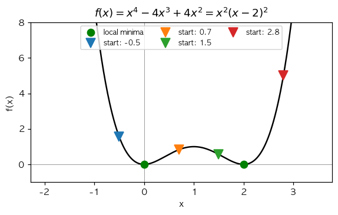

`(1)` 위 함수의 도함수 $f'(x)$ 와 critical point ($f'(x) = 0$ 인 점) 의 개수는?

① $f'(x) = 4x^3 - 12x^2 + 8x = 4x(x-1)(x-2)$, 3개\
② $f'(x) = 4x^3 - 4x$, 2개\
③ $f'(x) = 2x(x-2)$, 2개\
④ $f'(x) = 4x - 12x^2$, 1개

`(2)` 위 함수에 대해, 시작점 $x_{sol} = 0.7$ (그림의 주황색 ▽) 에서 충분히 작은 학습률 $\alpha$ 로 충분한 epoch 의 경사하강법을 진행하면 어디로 수렴하는가?

① $x = 0$ (왼쪽 local minimum)\
② $x = 1$ (saddle/maximum)\
③ $x = 2$ (오른쪽 local minimum)\
④ 발산

`(3)` 시작점 $x_{sol} = 1.5$ (그림의 녹색 ▽) 에서 시작하면 어디로 수렴하는가?

① $x = 0$\
② $x = 1$\
③ $x = 2$\
④ 발산

`(4)` 시작점 $x_{sol} = 1.0$ 에서 시작하면 어떻게 되는가? (단, $f'(1) = 4(1)(0)(−1) = 0$)

① $x = 0$ 으로 수렴\
② $x = 2$ 로 수렴\
③ $x = 1$ 에 그대로 머무름 (그래디언트가 0이라 업데이트 없음). 단, 이 점은 local maximum 이므로 약간이라도 수치오차가 발생하면 0 또는 2 로 굴러떨어짐\
④ 발산

`(5)` 위 비convex 함수의 경사하강법 결과 분석 중 옳은 것은?

① 경사하강법은 시작점이 어디든 항상 전역 최소값에 수렴\
② 경사하강법은 시작점이 속한 「수렴 영역 (basin of attraction)」 의 local minimum 으로 수렴 — 비convex 에서는 시작점 의존적\
③ 경사하강법은 비convex 에선 항상 발산\
④ 비convex 함수에선 경사하강법 사용 불가

## 2. 학습률 $\alpha$ 의 발산 임계값

다음 그림은 $f(x) = (x-2)^2$ 에 대해 시작점 $x_{sol} = 6.5$ 에서 학습률을 $0.1, 0.5, 0.95, 1.05$ 로 바꿔가며 경사하강법을 진행한 결과이다. (`f'(x) = 2(x-2)`)

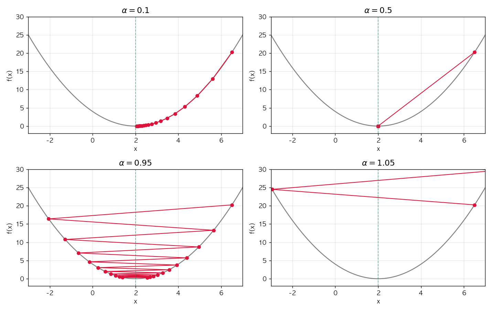

`(1)` $f(x) = (x-2)^2$ 에 대해 $\alpha = 0.5$ 로 1회 업데이트했을 때 ($x_{sol} = 6.5$ 에서 시작) 의 결과는?

① $x_{sol} = 2.0$ — 1회만에 정확히 최소값 도달 (= $6.5 - 0.5 \cdot 2(6.5-2) = 6.5 - 4.5$)\
② $x_{sol} = 0$\
③ $x_{sol} = -2.5$\
④ $x_{sol} = 6.5$ (이동 없음)

`(2)` $f(x) = (x-2)^2$ 의 경사하강법 업데이트 $x_{sol} \leftarrow x_{sol} - \alpha \cdot 2(x_{sol} - 2)$ 를 정리하면 $x_{sol} - 2 \leftarrow (1 - 2\alpha)(x_{sol} - 2)$ 이다. 이로부터 수렴/발산을 결정하는 학습률 조건은?

① $\alpha > 0$\
② $0 < \alpha < 1$ — $|1 - 2\alpha| < 1$ 이어야 수렴, 즉 $\alpha \in (0, 1)$\
③ $\alpha < 0.5$\
④ $\alpha < 2$

`(3)` 위 (2) 의 결과를 그림과 비교하면, 발산하는 학습률은?

① $\alpha = 0.1$ 만\
② $\alpha = 0.95$ 만\
③ $\alpha = 1.05$ 만 — $\alpha > 1$ 인 경우만 발산\
④ $\alpha = 0.5, 0.95, 1.05$ 모두

`(4)` 일반화하여 $f(x) = (x - c)^2$ 의 경우 발산 임계값은? 또한 $f(x) = a (x-c)^2$ 인 경우는?

① 둘 다 $\alpha < 1$\
② $f(x) = (x-c)^2$ 는 $\alpha < 1$, $f(x) = a(x-c)^2$ 는 $\alpha < 1/a$ — 함수의 곡률 (이차계수 $a$) 에 따라 임계값이 달라짐\
③ $f(x) = (x-c)^2$ 는 $\alpha < 1/c$, $f(x) = a(x-c)^2$ 는 $\alpha < 1/(ac)$\
④ 곡률과 무관

## 3. SSE 정규방정식 — 행렬 미분과 closed-form

단순회귀모형 $y_i = \beta_0 + \beta_1 x_i + \epsilon_i$ 의 SSE 를 행렬 형태 $L({\bf w}) = \|{\bf y} - {\bf X}{\bf w}\|^2$ 로 표현한다. 다음 통계량이 주어졌다.

$$\sum x_i = 0, \quad \sum y_i = 0, \quad \sum x_i^2 = 100, \quad \sum x_i y_i = 200, \quad n = 100$$

`(1)` 손실 $L({\bf w}) = ({\bf y} - {\bf X}{\bf w})^\top ({\bf y} - {\bf X}{\bf w})$ 의 그래디언트 $\nabla_{\bf w} L$ 의 형태는?

① $-2 {\bf X}^\top ({\bf y} - {\bf X}{\bf w})$\
② $-2 {\bf X} ({\bf y} - {\bf X}{\bf w})$\
③ $2 {\bf X}^\top {\bf X} {\bf w}$\
④ $2 ({\bf y} - {\bf X}{\bf w})$

`(2)` 위 (1) 의 그래디언트를 0 으로 두면 정규방정식 ${\bf X}^\top {\bf X} \hat{\bf w} = {\bf X}^\top {\bf y}$ 가 나온다. 주어진 통계량 ($\sum x_i = 0$ 라 절편이 분리됨) 으로 $\hat\beta_1$ 을 구하면?

① $\hat\beta_1 = \sum x_i y_i / \sum x_i^2 = 200 / 100 = 2$\
② $\hat\beta_1 = \sum y_i / \sum x_i = 0/0$ — 정의되지 않음\
③ $\hat\beta_1 = 200$\
④ $\hat\beta_1 = 100$

`(3)` 위 데이터에 적절한 학습률·충분한 epoch 으로 경사하강법을 수행했을 때 $\hat\beta_1$ 이 수렴하는 값은?

① true parameter (이 값은 데이터로는 모름)\
② 해석해 $\hat\beta_1 = 2$ — 경사하강법은 SSE 의 closed-form 해로 수렴\
③ $0$\
④ 학습률 $\alpha$ 에 의존

`(4)` 만약 진짜 모델이 $y_i = 1 + 3 x_i + \epsilon_i$ 인데 우리가 절편 없는 모형 $y_i = \beta_1 x_i$ 로 적합한다면 (mis-specified model), $n \to \infty$ 일 때 경사하강법으로 구한 $\hat\beta_1$ 은?

① 항상 $3$ 으로 수렴\
② 항상 $0$\
③ $\beta_1 = E[xy]/E[x^2]$ 로 수렴 — mis-specified 일 때도 SSE 는 어떤 한 값으로 수렴하지만 그것이 true parameter 와 같지 않을 수 있음\
④ 절대 수렴하지 않음

## 4. 알고리즘1 vs 알고리즘2 — 구체 함수 분석

다음 두 알고리즘을 비교한다. (강의노트의 「2차원 경사하강법 아이디어」)

- **알고리즘1**: 현재 점 주변 9개 격자점 중 가장 작은 함수값을 갖는 점으로 이동
- **알고리즘2**: $x$ 와 $y$ 축 방향으로만 조사하여 결정 (편미분 기반)

다음 함수표가 주어졌다. (시작점 $(0, 0)$, 격자 간격 $0.1$, $f$ 의 값을 표로 표시)

| $y \backslash x$ | $-0.1$ | $0$ | $0.1$ |
|:---:|:---:|:---:|:---:|
| $0.1$ | $-100$ | $0$ | $0$ |
| $0$ | $0$ | $0$ | $0$ |
| $-0.1$ | $0$ | $0$ | $0$ |

`(1)` 위 함수표에서 알고리즘1 은 어디로 이동하는가? (가장 작은 함수값)

① $(-0.1, 0.1)$ — $f = -100$ (대각선)\
② $(0, 0.1)$\
③ $(0, 0)$ 에 머무름\
④ $(0.1, 0.1)$

`(2)` 위 함수표에서 알고리즘2 의 $x$ 방향 비교 ($f(-0.1, 0), f(0, 0), f(0.1, 0)$) 에서 결정되는 $x$ 의 이동방향은?

① 왼쪽\
② 오른쪽\
③ 중앙 (이동 없음) — 세 값이 모두 0이라 변화 없음\
④ 결정 불가

`(3)` 위 함수표에서 알고리즘2 의 결정 결과는?

① 알고리즘1 과 같이 $(-0.1, 0.1)$ 로 이동\
② $(0, 0)$ 에 머무름 — 두 축 모두 평평하므로\
③ $(-0.1, 0.1)$ 로 이동\
④ 항상 발산

`(4)` 위 (1), (3) 의 비교로부터 도출되는 결론은?

① 알고리즘1 이 더 정밀하지만 (격자점 더 많이 본다), 차원이 높아지면 계산량 폭발\
② 두 알고리즘은 같은 결과\
③ 알고리즘2 가 항상 더 정밀\
④ 둘 다 잘못된 알고리즘

# 04wk — 회귀, 미분, net/optimizer

## 1. Chain rule 과 자동미분

`(1)` $z = (x^2 + 1)^3$ 의 $\frac{dz}{dx}\Big|_{x=2}$ 의 값은?

(단, $\frac{dz}{dx} = 3(x^2+1)^2 \cdot 2x$)

① $50$\
② $100$\
③ $150$ (= $3 \cdot 25 \cdot 2 \cdot 1$ ... 잠깐 다시: $3 \cdot 5^2 \cdot 2 \cdot 2 = 300$)\
④ $300$

`(2)` 다음 코드의 출력으로 옳은 것은?

```python
x = torch.tensor(2.0, requires_grad=True)
z = (x**2 + 1)**3
z.backward()
print(x.grad)
```

① `tensor(50.)`\
② `tensor(100.)`\
③ `tensor(150.)`\
④ `tensor(300.)`

`(3)` 다음 코드의 출력은? (gradient 누적 함정)

```python
x = torch.tensor(2.0, requires_grad=True)
y = x**2
y.backward()
print(x.grad)         # 출력 ⓐ

x.data = torch.tensor(5.0)
y = x**2
y.backward()
print(x.grad)         # 출력 ⓑ

x.grad = None         # ← 여기서 초기화
x.data = torch.tensor(7.0)
y = x**2
y.backward()
print(x.grad)         # 출력 ⓒ
```

(힌트: $f'(x) = 2x$. $f'(2) = 4$, $f'(5) = 10$, $f'(7) = 14$)

① ⓐ $4$, ⓑ $14$ (= $4 + 10$, 누적), ⓒ $14$ (초기화 후 $7$ 의 미분)\
② ⓐ $4$, ⓑ $10$, ⓒ $14$\
③ ⓐ $4$, ⓑ $14$, ⓒ $28$ (누적 안됨 가정)\
④ ⓐ $0$, ⓑ $0$, ⓒ $0$

`(4)` 다음 코드 중 $z = 3(x+2)^2$ 에서 $\frac{dz}{dx}\Big|_{x=4}$ 를 정확히 계산하지 **못하는** 것은?

① 
```python
x = torch.tensor(4.0, requires_grad=True)
z = 3 * (x + 2)**2
z.backward()
x.grad
```

② 
```python
x = torch.tensor(4.0, requires_grad=True)
y = (x + 2)**2
z = 3 * y
z.backward()
x.grad
```

③ 
```python
x = torch.tensor(4.0, requires_grad=True)
y = x + 2
z = 3 * y**2
z.backward()
x.grad
```

④ 
```python
x = torch.tensor(4.0, requires_grad=True)
y = (x + 2)**2
z = 3 * y
y.backward()       # ← y.backward() 임에 주의
x.grad
```

`(5)` 위 (4) 의 ④ 코드의 `x.grad` 출력값은? ($y = (x+2)^2$ 의 미분 $\frac{dy}{dx}|_{x=4} = 2(4+2) = 12$, $\frac{dz}{dx} = 36$)

① $12$ — `y.backward()` 는 $\frac{dy}{dx}$ 를 계산\
② $36$\
③ $0$\
④ $108$

## 2. 행렬 미분과 매트릭스 회귀

회귀모형을 행렬형태 ${\bf y} = {\bf X} {\bf w} + {\boldsymbol \epsilon}$ 로 본다. 데이터:

$$
{\bf X} = \begin{bmatrix} 1 & 0 \\ 1 & 1 \\ 1 & 2 \end{bmatrix}, \quad {\bf y} = \begin{bmatrix} 1 \\ 3 \\ 5 \end{bmatrix}
$$

`(1)` ${\bf X}^\top {\bf X}$ 의 값은?

① $\begin{bmatrix} 3 & 3 \\ 3 & 5 \end{bmatrix}$\
② $\begin{bmatrix} 1 & 1 \\ 1 & 5 \end{bmatrix}$\
③ $\begin{bmatrix} 3 & 0 \\ 0 & 5 \end{bmatrix}$\
④ $\begin{bmatrix} 0 & 3 \\ 3 & 0 \end{bmatrix}$

`(2)` ${\bf X}^\top {\bf y}$ 의 값은?

① $\begin{bmatrix} 9 \\ 13 \end{bmatrix}$\
② $\begin{bmatrix} 1 \\ 3 \\ 5 \end{bmatrix}$\
③ $\begin{bmatrix} 3 \\ 5 \end{bmatrix}$\
④ $\begin{bmatrix} 9 \\ 5 \end{bmatrix}$

`(3)` 정규방정식 ${\bf X}^\top {\bf X} \hat{\bf w} = {\bf X}^\top {\bf y}$ 의 해 $\hat{\bf w} = [\hat\beta_0, \hat\beta_1]^\top$ 를 구하면?

(힌트: $\det({\bf X}^\top {\bf X}) = 15 - 9 = 6$. $({\bf X}^\top {\bf X})^{-1} = \frac{1}{6}\begin{bmatrix} 5 & -3 \\ -3 & 3 \end{bmatrix}$)

① $\hat{\bf w} = [1, 2]^\top$ — 즉 $\hat\beta_0 = 1, \hat\beta_1 = 2$\
② $\hat{\bf w} = [3, 5]^\top$\
③ $\hat{\bf w} = [0, 0]^\top$\
④ $\hat{\bf w} = [9, 13]^\top$

`(4)` 위 (3) 의 결과는 데이터 $(0, 1), (1, 3), (2, 5)$ 가 정확히 직선 $y = 1 + 2 x$ 위에 있음을 의미한다. SSE 의 최소값은?

① $0$ — 모든 점이 직선 위에 있으므로 잔차가 0\
② $1$\
③ $5$\
④ $6$

`(5)` `What = torch.tensor([[0.0], [0.0]], requires_grad=True)` 로 두고 다음 코드를 실행했을 때 `What.grad` 의 값은?

```python
X = torch.tensor([[1., 0.], [1., 1.], [1., 2.]])
Y = torch.tensor([[1.], [3.], [5.]])
What = torch.tensor([[0.0], [0.0]], requires_grad=True)
Yhat = X @ What
loss = torch.sum((Y - Yhat)**2)
loss.backward()
print(What.grad)
```

(힌트: $\nabla L = -2 X^\top (Y - X W) = -2 X^\top Y$ (왜냐하면 $W = 0$). $X^\top Y = [9, 13]^\top$)

① `tensor([[-18.], [-26.]])` (= $-2 \cdot [9, 13]^\top$)\
② `tensor([[18.], [26.]])`\
③ `tensor([[9.], [13.]])`\
④ `tensor([[1.], [2.]])`

## 3. zero_grad 누락의 정량 분석

다음 코드는 zero_grad 가 누락되어 그래디언트가 매 epoch 마다 누적된다.

```python
torch.manual_seed(0)
n = 100
x = torch.randn(n)
y = 1 + 4 * x + torch.randn(n) * 0.3
Y = y.reshape(-1, 1)
X = torch.stack([torch.ones(n), x], axis=1)
What = torch.tensor([[0.0], [0.0]], requires_grad=True)
for epoch in range(30):
    Yhat = X @ What
    loss = torch.mean((Y - Yhat)**2)
    loss.backward()
    What.data = What.data - 0.1 * What.grad
    # zero_grad 누락
```

`(1)` 첫 번째 epoch 직후 `What.grad` 의 첫 번째 원소 (= $\partial L / \partial \beta_0 = -2 \bar{Y}$) 의 값으로 가장 가까운 것은? ($\bar Y \approx 1$)

① 약 $-2$\
② 약 $0$\
③ 약 $4$\
④ 약 $100$

`(2)` 두 번째 epoch 직후 `What.grad` 의 첫 번째 원소는 (어떤 값에) 첫 번째 epoch 의 그래디언트가 누적된다. 옳은 설명은?

① 두 epoch 의 그래디언트가 **합산** 됨 — 절대값이 더 커짐\
② 두 epoch 의 그래디언트가 **평균** 됨\
③ 두 번째 epoch 의 그래디언트만 남음 (덮어쓰기)\
④ 두 epoch 모두 0이 됨

`(3)` 위 코드를 30 epoch 돌린 결과 `What.data` 의 값은?

① true 값 $[1, 4]^\top$ 로 정상 수렴\
② 그래디언트가 누적되어 업데이트 폭이 매 epoch 더 커지므로 발산하거나 비정상적인 값으로 끝남\
③ 항상 $[0, 0]^\top$\
④ zero_grad 와 무관하게 항상 동일

`(4)` 위 코드의 zero_grad 누락을 고치는 방법으로 옳은 것을 **모두** 고르시오.

① `What.data = What.data - 0.1 * What.grad` 다음 줄에 `What.grad = None` 추가\
② `What.data = What.data - 0.1 * What.grad` 다음 줄에 `What.grad.zero_()` 추가\
③ optimizer 를 사용하고 `optimizer.zero_grad()` 호출\
④ `loss.backward()` 를 두 번 호출

## 4. bias=True over-parameterization 의 식별가능성

다음 두 모형을 비교하자.

**모형 A**: $X$ 의 첫 열이 모두 $1$, `Linear(2, 1, bias=False)` (파라미터 $w_0, w_1$ 두 개)

**모형 B**: $X$ 의 첫 열이 모두 $1$, `Linear(2, 1, bias=True)` (파라미터 $w_0, w_1, b$ 세 개, 출력 $\hat Y_i = w_0 + w_1 x_i + b$)

`(1)` 모형 B 의 학습 결과 $(w_0^{(1)}, b^{(1)}) = (3, 0)$, $(w_0^{(2)}, b^{(2)}) = (1, 2)$, $(w_0^{(3)}, b^{(3)}) = (-1, 4)$ 이고 모두 $w_1$ 의 값이 같다고 하자. 세 결과는 서로 어떤 관계인가?

① 세 결과 모두 같은 함수 $\hat Y_i = 3 + w_1 x_i$ 를 표현 — $w_0 + b = 3$ 이 모두 동일하므로 식별 불가능 (over-parameterized)\
② 세 결과는 서로 다른 함수\
③ 세 결과는 서로 다른 모형\
④ 식별 가능

`(2)` 모형 B 의 학습을 다른 random seed 로 두 번 반복할 때, 결과 비교로 옳은 것은?

① 두 번 모두 정확히 같은 $(w_0, w_1, b)$\
② 두 번 모두 같은 $w_1$ 과 같은 $w_0 + b$ 로 수렴하지만 $w_0, b$ 의 분리는 random init 에 의존\
③ 두 번 결과가 완전히 무관\
④ 학습이 항상 발산

`(3)` 모형 A 와 모형 B 가 표현하는 가설공간 (모형이 표현 가능한 함수의 집합) 의 비교로 옳은 것은?

① 모형 A 의 가설공간이 더 넓음\
② 모형 B 의 가설공간이 더 넓음\
③ 두 모형의 가설공간은 같음 — 둘 다 1차원 직선 $\{a + b x\}$\
④ 두 모형의 가설공간은 무관

# 05wk — 로지스틱

## 1. 시그모이드의 미분과 정성적 성질

다음 그림을 참조하라.

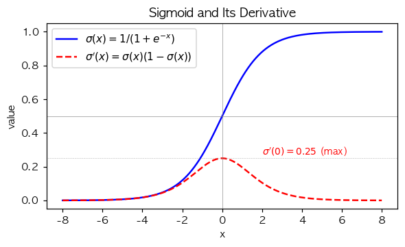

`(1)` 시그모이드 함수 $\sigma(x) = \frac{1}{1+e^{-x}}$ 의 도함수 $\sigma'(x)$ 의 형태는?

① $\sigma'(x) = \sigma(x)$\
② $\sigma'(x) = \sigma(x)(1 - \sigma(x))$\
③ $\sigma'(x) = 1 - \sigma(x)$\
④ $\sigma'(x) = e^{-x}$

`(2)` $\sigma'(0) = ?$ 그리고 $\sigma'(x)$ 의 최댓값은?

① 둘 다 $0$\
② $\sigma'(0) = 0.25$, 최댓값 $0.25$ — $\sigma'$ 의 최댓값은 $x = 0$ 에서 발생\
③ $\sigma'(0) = 0.5$, 최댓값 $1$\
④ $\sigma'(0) = 1$, 최댓값 $1$

`(3)` $|x| \to \infty$ 일 때 $\sigma'(x)$ 의 극한 값과 그 함의는?

① $\sigma'(x) \to 1$ — 학습이 잘 됨\
② $\sigma'(x) \to 0$ — gradient vanishing 으로 학습이 정체될 수 있음\
③ $\sigma'(x) \to \infty$\
④ $\sigma'(x) \to 0.5$

`(4)` $\sigma'(x) = \sigma(x)(1 - \sigma(x))$ 의 도함수 $\sigma''(x)$ 가 0 이 되는 점은?

① $x = 0$ — $\sigma'$ 가 최댓값을 가지는 곳, 즉 $\sigma''(0) = 0$\
② $x = \pm 1$\
③ $\sigma''$ 는 항상 0\
④ $\sigma''$ 는 0이 안 됨

## 2. BCE+sigmoid 의 깔끔한 그래디언트와 gradient vanishing

다음 그림은 $y = 1$ 일 때 sigmoid+MSE 와 sigmoid+BCE 의 sigmoid 직전 값 $z$ 에 대한 그래디언트 절대값 $|\partial L/\partial z|$ 를 비교한 것이다.

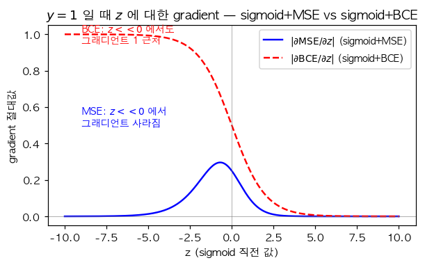

`(1)` $\hat y = \sigma(z)$ 라 할 때 BCE 손실 $L = -(y \log \hat y + (1-y) \log(1-\hat y))$ 의 $z$ 에 대한 그래디언트 $\partial L / \partial z$ 의 형태는?

(힌트: chain rule. $\partial L/\partial \hat y = -y/\hat y + (1-y)/(1-\hat y)$, $\partial \hat y/\partial z = \hat y(1-\hat y)$. 곱하면...)

① $\partial L/\partial z = \hat y - y$ — 매우 깔끔한 형태 (sigmoid 의 도함수 $\sigma'$ 이 분모와 약분되어 사라짐)\
② $\partial L/\partial z = (\hat y - y) \cdot \hat y (1 - \hat y)$\
③ $\partial L/\partial z = y - \hat y$\
④ $\partial L/\partial z = \log(\hat y) - \log(1 - \hat y)$

`(2)` 같은 모형 ($\hat y = \sigma(z)$) 에 대해 MSE 손실 $L = (y - \hat y)^2$ 의 $z$ 에 대한 그래디언트는?

① $\partial L/\partial z = -2(y - \hat y) \cdot \hat y(1 - \hat y)$ — sigmoid 도함수가 곱해짐\
② $\partial L/\partial z = \hat y - y$\
③ $\partial L/\partial z = y - \hat y$\
④ $\partial L/\partial z = -2(y - \hat y)$

`(3)` 위 (1), (2) 의 결과로부터 「sigmoid + MSE 가 sigmoid + BCE 보다 학습이 어려운 이유」 로 가장 적절한 것은?

① $|z|$ 가 큰 (포화) 영역에서 $\sigma'(z) \approx 0$ 이라 MSE 의 그래디언트가 거의 0 → 학습 정체. BCE 는 $\sigma'$ 이 약분되어 영향 없음\
② BCE 가 단순히 더 작은 값을 가짐\
③ MSE 가 분류에 절대 사용 불가\
④ BCE 의 계산이 더 빠름

`(4)` 그림에서 $z = -10$ (즉 $\hat y = \sigma(-10) \approx 0$) 인 상태에서 $y = 1$ 의 학습 데이터에 대한 두 손실의 그래디언트 비교는?

① 둘 다 0 근처\
② BCE 의 그래디언트는 $\hat y - 1 \approx -1$ 로 절대값 1 근처 (학습 잘 됨), MSE 의 그래디언트는 $\sigma'$ 이 곱해져 거의 0 (학습 정체)\
③ MSE 가 더 큼\
④ 두 손실의 그래디언트는 같음

`(5)` 「최악의 초기값」 (예: `net[0].bias = -10.0`) 에서 시그모이드 + MSE 로 학습하면 학습이 정체되는 이유로 가장 정확한 것은?

① 초기값에서 $z = w x + b \ll 0$ 라 $\sigma'(z) \approx 0$, MSE 그래디언트에 $\sigma'$ 이 곱해져 거의 0이 되어 가중치가 거의 업데이트되지 않음\
② Adam optimizer 가 잘못 작동\
③ 학습률이 자동으로 0이 됨\
④ epoch 이 부족함

## 3. 결정경계와 해석

마케팅팀 이연구원씨는 (광고비 $x \in [0, 1]$, 구매여부 $y \in \{0, 1\}$) 자료가 다음 진짜 모형에서 나왔다고 가정한다.

$$\pi_i^\ast = \sigma(-2 + 6 x_i), \quad y_i \sim \text{Ber}(\pi_i^\ast)$$

`(1)` 위 진짜 모형에서 $\pi^\ast = 0.5$ 가 되는 광고비 $x^\ast$ 는?

(힌트: $\sigma(z) = 0.5 \Leftrightarrow z = 0$)

① $x^\ast = 0$\
② $x^\ast = 1/3$ — $-2 + 6 x = 0 \Rightarrow x = 1/3$\
③ $x^\ast = 0.5$\
④ $x^\ast = 1$

`(2)` $x = 0$ 일 때 $\pi^\ast$ 의 값은? ($\sigma(-2) \approx 0.119$)

① 약 $0.12$\
② 약 $0.5$\
③ 약 $0.88$\
④ 약 $1.0$

`(3)` 위 데이터에 단순 로지스틱 (`Sequential(Linear(1,1), Sigmoid())`) 을 적합하여 $\hat w_0, \hat w_1$ 을 얻었을 때, 분류 결정경계 ($\hat \pi = 0.5$ 가 되는 $x$) 의 위치는?

① $x = 0$\
② $x = -\hat w_0 / \hat w_1$ — 적합이 잘 되었다면 $\approx 1/3$\
③ $x = \hat w_0 + \hat w_1$\
④ $x = 0.5$ 항상

`(4)` 회귀와 로지스틱의 closed-form 해의 존재성 비교로 옳은 것은?

① 회귀 (MSE) 는 $\hat{\bf w} = ({\bf X}^\top {\bf X})^{-1} {\bf X}^\top {\bf y}$ 의 closed-form 해 존재. 로지스틱 (BCE) 은 closed-form 해가 없어 반복법 (GD/Newton) 필요\
② 둘 다 closed-form 해 존재\
③ 둘 다 closed-form 해 없음\
④ 로지스틱 (BCE) 만 closed-form 해 존재

`(5)` 다음 비교 중 **틀린** 것은?

| 구분 | 회귀 (MSE) | 로지스틱 (BCE) |
|:---:|:---:|:---:|
| 손실함수 모양 | convex | convex |
| closed-form | 존재 | 없음 |
| $y_i$ 분포 | $N(\mu_i, \sigma^2)$ | $\text{Ber}(\pi_i^\ast)$ |
| $\hat y_i$ 범위 | $(-\infty, \infty)$ | $(0, 1)$ |

① 회귀와 로지스틱 둘 다 손실함수 모양이 convex\
② 회귀는 closed-form 해 존재, 로지스틱은 없음\
③ 회귀의 $y_i$ 는 정규, 로지스틱의 $y_i$ 는 베르누이\
④ 회귀와 로지스틱 모두 $\hat y_i$ 의 범위가 $(0, 1)$

# 06wk — ReLU, 꺾인 직선, 표현력

## 1. ReLU 합성으로 piecewise linear 만들기

다음 그림은 $-|x|$ (꺾인 직선, 두 번 꺾임) 에서 시그모이드를 통과시켜 만든 종 모양 곡선이다.

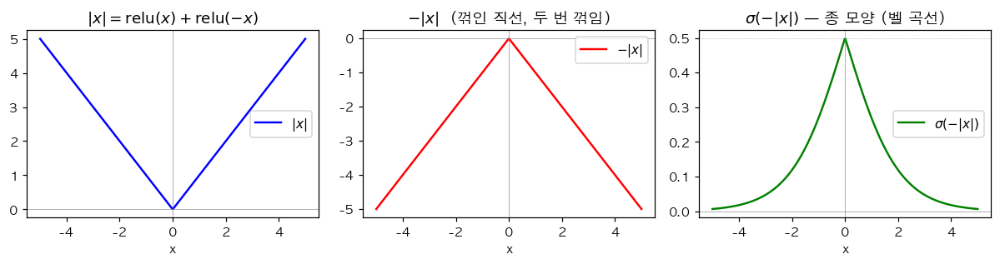

`(1)` $|x|$ 를 ReLU 합성으로 표현하면?

① $|x| = \text{relu}(x) - \text{relu}(-x)$ (이건 $x$)\
② $|x| = \text{relu}(x) + \text{relu}(-x)$\
③ $|x| = 2 \cdot \text{relu}(x)$\
④ $|x| = \text{relu}(2x)$

`(2)` 위 그림의 종 모양 곡선 $\sigma(-|x|)$ 의 최댓값과 그 위치는?

① 최댓값 $1$, $x = 0$\
② 최댓값 $0.5$, $x = 0$ — $\sigma(0) = 0.5$\
③ 최댓값 $0.25$, $x = 0$\
④ 최댓값 $\infty$, $x = 0$

`(3)` $\sigma(-|x|)$ 가 $0$ 에 수렴하는 영역은?

① $x \to \infty$ 또는 $x \to -\infty$ 일 때 $-|x| \to -\infty$ 이므로 $\sigma(-|x|) \to 0$\
② $x = 0$ 일 때\
③ 어느 곳에서도 0 에 수렴하지 않음\
④ $x = \pm 0.5$ 일 때

`(4)` 1-은닉층 (히든 노드 $m$) + ReLU + 출력 1차원 네트워크 (`Linear(1,m) → ReLU → Linear(m,1)`) 가 표현 가능한 piecewise linear 함수의 꺾이는 점의 최대 개수는?

① $1$\
② $m$ — 각 ReLU 의 임계점 ($w_i x + b_i = 0$) 이 한 곳의 꺾인점\
③ $2m$\
④ 무제한

`(5)` 다음은 1-은닉층 (3 ReLU 노드) 으로 만든 piecewise linear 함수의 그래프이다.

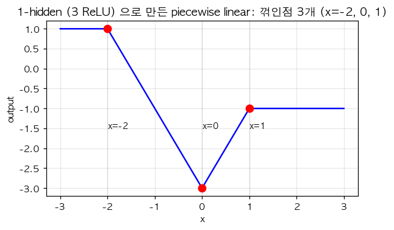

위 함수의 형태는 다음 중 어떤 합성 표현인가?

① $f(x) = -2 \cdot \text{relu}(x + 2) + 4 \cdot \text{relu}(x) - 2 \cdot \text{relu}(x - 1) + 1$ — 꺾인점 $x = -2, 0, 1$\
② $f(x) = 2 \cdot \text{relu}(x) - 4 \cdot \text{relu}(x - 1)$ — 꺾인점 $x = 0, 1$ 만\
③ $f(x) = \sigma(x)$\
④ $f(x) = (x - 1)^2$

`(6)` 1-은닉층 + ReLU + 출력 1차원 네트워크의 시벤코 정리에 의한 표현력은?

① 노드 $m$ 을 충분히 키우면 임의의 (보렐가측) 함수를 piecewise linear 로 원하는 정확도로 근사 가능\
② $m$ 의 크기와 무관하게 항상 직선만 표현\
③ $m$ 을 무한히 키우면 매끄러운 함수 (smooth) 만 표현 가능\
④ 표현력의 한계는 없음 (어떤 함수든 정확히 표현)

## 2. 카페인 데이터 — net1 vs net2 의 표현력 차이

약사 박씨는 (카페인 섭취량 $x \in [-3, 3]$, 집중력 $y \in \{0, 1\}$) 자료를 모았다. 자료가 비단조 (증가 후 감소) 형태였다.

다음 그림은 두 네트워크 (net1: 단순 로지스틱 / net2: 1-hidden ReLU + Sigmoid) 의 적합 결과이다.

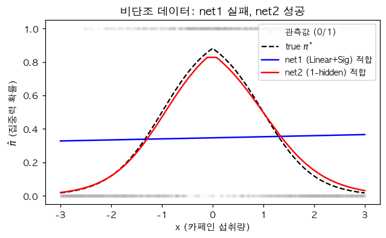

`(1)` net1 (`Linear(1,1) + Sigmoid`) 이 위 데이터에 실패하는 가장 깊은 이유는?

① 시그모이드 직전 값 $z = w_0 + w_1 x$ 가 직선이며, $\sigma(z)$ 는 단조 (증가/감소) S 곡선만 만들 수 있음. 비단조 (벨 모양) 표현 불가\
② 학습률이 너무 작아서\
③ epoch 부족\
④ BCE 가 아닌 MSE 를 써서

`(2)` net2 (`Linear(1, 2, bias=True) → ReLU → Linear(2, 1, bias=True) → Sigmoid`) 의 시그모이드 직전 값 $z$ 가 표현 가능한 형태는?

① 직선만\
② 한 번 꺾인 직선만\
③ 직선 또는 한 번 꺾인 직선 또는 두 번 꺾인 직선 (히든 노드 2개로 최대 2 개의 꺾인점)\
④ 매끄러운 곡선만

`(3)` 위 net2 에서 시그모이드 직전 값 $z(x) = -|x|$ (두 번 꺾임, $x = 0$ 에서 최댓값 $0$) 을 만드는 가중치는?

(힌트: $-|x| = -\text{relu}(x) - \text{relu}(-x)$)

① 
```
net2[0].weight.data = [[1], [-1]]
net2[0].bias.data   = [0, 0]
net2[2].weight.data = [[-1, -1]]
net2[2].bias.data   = [0]
```

② 
```
net2[0].weight.data = [[1], [1]]
net2[0].bias.data   = [0, 0]
net2[2].weight.data = [[1, -1]]
net2[2].bias.data   = [0]
```

③ 
```
net2[0].weight.data = [[1], [-1]]
net2[0].bias.data   = [1, 1]
net2[2].weight.data = [[1, 1]]
net2[2].bias.data   = [-1]
```

④ 
```
net2[0].weight.data = [[0], [0]]
net2[0].bias.data   = [0, 0]
net2[2].weight.data = [[0, 0]]
net2[2].bias.data   = [0]
```

`(4)` 위 (3) 의 가중치로 시그모이드 직전이 $z(x) = -|x|$ 라면, 출력 $\hat\pi(x) = \sigma(-|x|)$ 의 형태는?

① $x = 0$ 에서 최댓값 $0.5$, $|x|$ 가 커지면 $0$ 으로 감소하는 종 모양\
② $x = 0$ 에서 최솟값 $0.5$, 양쪽으로 $1$ 로 증가\
③ 단조 증가 S\
④ 단조 감소 S

`(5)` 위 (4) 의 종 모양 곡선이 위 카페인 데이터를 적합하기에 적절한가?

① 적절함 — 카페인이 적당량 (예: $x = 0$) 에서 집중력이 최대이고 너무 적거나 너무 많으면 떨어지는 형태와 일치\
② 부적절 — 종 모양은 단조 데이터에 적합\
③ 부적절 — 종 모양은 출력이 음수\
④ 적절하지만 학습 불가능

`(6)` net2 의 학습 가능한 파라미터의 개수는? ($1 \cdot 2 + 2 + 2 \cdot 1 + 1 = ?$)

① $5$\
② $7$\
③ $9$\
④ $11$

## 3. 표현력의 한계와 시벤코의 함의

`(1)` 다음 9개 점의 진리표 데이터 ($x_1, x_2 \in \{-1, 0, 1\}$, $y \in \{0, 1\}$):

| $x_1 \backslash x_2$ | $-1$ | $0$ | $1$ |
|:---:|:---:|:---:|:---:|
| $-1$ | 1 | 0 | 1 |
| $0$ | 0 | 0 | 0 |
| $1$ | 1 | 0 | 1 |

(코너 4개에서 $y = 1$, 가운데와 십자형은 $y = 0$)

이 데이터의 구조를 가장 잘 묘사한 것은?

① $x_1$ 이 단조 증가하면 $y$ 가 증가\
② $x_2$ 가 단조 증가하면 $y$ 가 증가\
③ 두 변수 모두 단조 관계로 설명할 수 없는 「꺾인 선형」 구조 — 단순 로지스틱으로 적합 불가\
④ $x_1 = x_2$ 일 때만 $y = 1$ (== AND 같은 구조)

`(2)` 위 (1) 의 데이터를 적합하기 위해 시벤코 정리에 따라 충분한 노드를 가진 네트워크가 필요하다. 다음 중 적합 가능성이 가장 높은 것은?

① `Sequential(Linear(2, 1), Sigmoid())` — 단순 로지스틱\
② `Sequential(Linear(2, 1, bias=False), Sigmoid())` — bias 도 없음\
③ `Sequential(Linear(2, 16), ReLU(), Linear(16, 1), Sigmoid())` — 1-hidden, 충분한 노드\
④ `Sequential(Linear(2, 1, bias=True))` — Sigmoid 없음

`(3)` 데이터 수 $n$ 을 늘리는 것과 네트워크 노드 수 $m$ 을 늘리는 것의 효과 비교로 옳은 것은?

① 둘 다 표현력 (가능 함수 클래스) 을 늘림\
② $n$ 을 늘리면 추정의 정확도가 좋아질 수 있지만, 표현력은 변하지 않음. $m$ 을 늘리면 표현력 (가능 함수의 집합) 이 넓어짐\
③ $n$ 을 늘리면 자동으로 $m$ 도 늘어남\
④ 데이터와 노드 수는 무관

`(4)` 다음 곡선

$$y_i = e^{-x_i} |\cos(3 x_i)| \sin(3 x_i) + \epsilon_i$$

은 음수 $y$ 도 포함한다. 적합용 네트워크의 마지막 활성함수로 부적절한 것은?

① 활성함수 없음 (회귀)\
② Sigmoid — 출력이 $(0, 1)$ 로 제한되어 음수 $y$ 표현 불가\
③ 1-hidden + ReLU + 마지막 Linear (출력 활성함수 없음)\
④ 표현력이 충분히 큰 네트워크라면 마지막에 활성함수 없이 적합

`(5)` 시벤코 정리의 한계 (뭐를 보장하지 않는가) 에 대한 설명으로 가장 정확한 것은?

① 표현력만 보장 — 학습 알고리즘이 그 함수를 실제로 찾는다는 보장 없음, unseen data 에 대한 일반화도 보장 없음, 학습 시간도 보장 없음\
② 시벤코는 일반화도 보장\
③ 시벤코는 학습 알고리즘 수렴도 보장\
④ 시벤코는 얕은 네트워크에선 성립 안함

# 07wk — 신경망 표현, 시벤코, 모델링

## 1. 다이어그램 ↔ 코드 — 깊은 네트워크

다음 세 다이어그램에 대응하는 네트워크 코드를 답하시오.

**다이어그램 A**:

$$\underset{(n,1)}{\bf X} \overset{l_1}{\to} \underset{(n,5)}{\bf U^{(1)}} \overset{relu}{\to} \underset{(n,5)}{\bf V^{(1)}} \overset{l_2}{\to} \underset{(n,1)}{\bf U^{(2)}} \overset{sig}{\to} \hat{\bf Y}$$

**다이어그램 B**:

$$\underset{(n,2)}{\bf X} \overset{l_1}{\to} \underset{(n,3)}{\bf U^{(1)}} \overset{relu}{\to} \underset{(n,3)}{\bf V^{(1)}} \overset{l_2}{\to} \underset{(n,1)}{\bf U^{(2)}} = \hat{\bf Y}$$

**다이어그램 C**:

$$\underset{(n,1)}{\bf X} \overset{l_1}{\to} \underset{(n,2)}{\bf U^{(1)}} \overset{relu}{\to} \underset{(n,2)}{\bf V^{(1)}} \overset{l_2}{\to} \underset{(n,5)}{\bf U^{(2)}} \overset{relu}{\to} \underset{(n,5)}{\bf V^{(2)}} \overset{l_3}{\to} \underset{(n,1)}{\bf U^{(3)}} \overset{sig}{\to} \hat{\bf Y}$$

`(1)` 다이어그램 A 에 대응하는 네트워크 코드는?

① `Sequential(Linear(1,5), ReLU(), Linear(5,1), Sigmoid())`\
② `Sequential(Linear(5,1), ReLU(), Linear(1,5), Sigmoid())`\
③ `Sequential(Linear(1,5), Sigmoid(), Linear(5,1), ReLU())`\
④ `Sequential(Linear(1,1), ReLU(), Linear(5,5), Sigmoid())`

`(2)` 다이어그램 C 의 학습 가능한 파라미터의 총 개수는? ($1 \cdot 2 + 2 + 2 \cdot 5 + 5 + 5 \cdot 1 + 1 = ?$)

① $11$\
② $25$\
③ $19$\
④ $30$

`(3)` 다이어그램 A, B, C 의 hidden layer 수를 강의자 방식으로 세면? (학습 가능 파라미터가 있는 layer 만 카운트)

① A: 1, B: 1, C: 2\
② A: 2, B: 1, C: 3\
③ A: 1, B: 2, C: 3\
④ A: 1, B: 0, C: 2

`(4)` 다이어그램 C 와 같은 깊이의 네트워크를 「2-hidden-layer 네트워크」 라 부른다. 강의자 방식 (학습 layer 만 카운트) 에서 다이어그램 C 의 layer 수와 hidden layer 수의 관계는?

① layer 수 = 3, hidden layer 수 = 2 (= layer 수 - 1)\
② layer 수 = 6, hidden layer 수 = 5 (Activation 포함)\
③ layer 수 = 2, hidden layer 수 = 1\
④ layer 수와 hidden layer 수는 무관

## 2. XOR 가중치 직접 설계

다음 XOR 데이터를 적합한다.

| ${\bf x}_1$ | ${\bf x}_2$ | ${\bf y}$ |
|:---:|:---:|:---:|
| 0 | 0 | 0 |
| 0 | 1 | 1 |
| 1 | 0 | 1 |
| 1 | 1 | 0 |

다음 그림은 XOR 데이터의 분포 (왼쪽) 와 1-은닉층 ReLU 네트워크가 학습한 결정경계 (오른쪽) 이다.

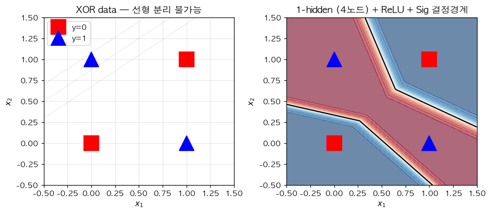

`(1)` XOR 을 단순 로지스틱 (`Sequential(Linear(2,1), Sigmoid())`) 으로 적합할 수 없는 이유는?

① 시그모이드 직전이 $z = w_0 + w_1 x_1 + w_2 x_2$ (선형결합) 이므로 평면 $z = 0$ 의 한쪽이 1, 다른쪽이 0 (선형분리) 만 가능. XOR 은 선형분리 불가능 (그림 왼쪽 참조)\
② 데이터가 적어서\
③ Sigmoid 가 BCE 와 호환되지 않아서\
④ 학습 알고리즘 문제

`(2)` 1-은닉층 (히든 노드 2, ReLU + Sigmoid) 로 XOR 을 적합하는 가중치를 설계해 보자. 다음 가중치 후보 중 시그모이드 직전 값이 (0,0)→음수, (0,1)→양수, (1,0)→양수, (1,1)→음수 가 되는 것은?

(힌트: $z = h_1 - 2 h_2$, $h_1 = \text{relu}(x_1 + x_2 - 0)$, $h_2 = \text{relu}(x_1 + x_2 - 1)$. (0,0)→ $h_1 = 0, h_2 = 0$ → $z = -0.5$, (0,1)→ $h_1 = 1, h_2 = 0$ → $z = 0.5$, (1,1)→ $h_1 = 2, h_2 = 1$ → $z = -0.5$)

① 
```
net[0].weight.data = [[1, 1], [1, 1]]
net[0].bias.data   = [0, -1]
net[2].weight.data = [[1, -2]]
net[2].bias.data   = [-0.5]
```

② 
```
net[0].weight.data = [[1, -1], [1, -1]]
net[0].bias.data   = [0, 0]
net[2].weight.data = [[1, 1]]
net[2].bias.data   = [0]
```

③ 
```
net[0].weight.data = [[0, 0], [0, 0]]
net[0].bias.data   = [0, 0]
net[2].weight.data = [[1, 1]]
net[2].bias.data   = [0]
```

④ 
```
net[0].weight.data = [[1, 1], [-1, -1]]
net[0].bias.data   = [0, 0]
net[2].weight.data = [[1, 1]]
net[2].bias.data   = [0]
```

`(3)` 시벤코 정리에 의해 XOR 을 적합 가능한 네트워크 중, **충분 조건** 으로 옳지 않은 것은?

① 1-은닉층, 노드 수 2 이상, ReLU, 출력 Sigmoid\
② 1-은닉층, 노드 수 16, ReLU, 출력 Sigmoid\
③ 1-은닉층, 노드 수 512, ReLU, 출력 Sigmoid\
④ 0-은닉층 (단순 로지스틱) — XOR 표현 불가능

`(4)` 시벤코 정리는 다음 중 어느 것을 보장하는가?

① 표현력만 — 학습 알고리즘이 그 함수를 실제로 찾는다는 보장은 없으며, unseen data 에 대한 일반화도 보장하지 않음\
② 표현력 + 학습 수렴성\
③ 표현력 + 일반화\
④ 표현력 + 학습 수렴성 + 일반화 모두

`(5)` 시벤코 정리의 가정 (조건) 으로 가장 정확한 것은?

① 함수 $f$ 가 임의의 보렐가측 함수 (어지간한 함수면 됨) 이고, 입력 도메인이 적절히 잘 정의된 경우 1-은닉층 네트워크가 원하는 정확도로 근사 가능\
② 함수 $f$ 가 다항식이어야 함\
③ 함수 $f$ 가 정수값만 가져야 함\
④ 데이터 수 $n$ 이 무한대여야 함

## 3. 자유낙하 — 도메인 지식 vs 딥러닝, extrapolation

물리학과 최교수는 (높이 $h$, 자유낙하 시간 $t$) 자료를 모았다.

- **모형 A**: 도메인 지식 ($t \propto \sqrt{h}$) 활용, $\hat t = \hat w \cdot \sqrt{h}$ — 1 파라미터
- **모형 B**: 1-은닉층 (노드 64, ReLU), $\hat t = net(h)$

다음 그림은 두 모형의 학습 결과와 extrapolation (학습 범위 바깥) 행동이다.

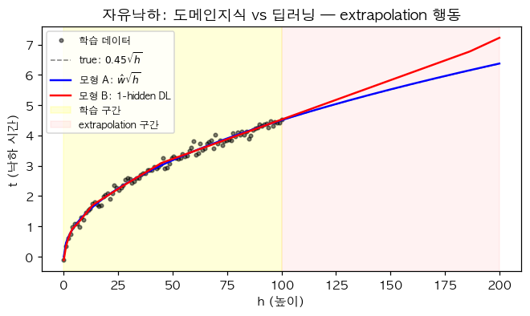

`(1)` 학습 데이터 범위 안 ($h \in [0, 100]$) 에서 두 모형이 비슷한 예측을 내놓는 이유로 가장 적절한 것은?

① 우연이 아니라 두 모형이 같은 함수 ($\sqrt{h}$) 를 학습했기 때문\
② 학습 데이터에서 두 모형이 비슷한 출력을 내는 어떤 함수를 각각 찾았기 때문 — 시벤코는 함수 형태 식별 보장이 아님\
③ $h_0$ 가 학습 데이터에 직접 포함되어 있기 때문\
④ Adam 이 정답을 보장하기 때문

`(2)` 학습 범위 바깥 ($h \in [100, 200]$) 에서 두 모형의 예측이 다른 이유로 가장 적절한 것은? (그림 참조)

① 모형 A 는 $\sqrt{h}$ 곡선을 그대로 따라가지만, 모형 B 는 ReLU 기반 piecewise linear 이므로 학습 데이터 끝의 마지막 직선 조각이 그대로 이어지기 때문 (extrapolation 이 직선)\
② 모형 A 가 잘못 학습됐기 때문\
③ 모형 B 가 100% 정확하기 때문\
④ 학습 데이터 바깥에서 데이터 잡음이 더 크기 때문

`(3)` 1-은닉층 + ReLU + 출력 Linear 의 extrapolation 행동에 대한 일반적 설명으로 옳은 것은?

① 학습 데이터 범위 바깥에서는 학습 데이터 끝의 마지막 ReLU 조각이 직선으로 이어짐 — 즉 extrapolation 이 항상 piecewise linear (직선) 형태\
② Extrapolation 이 매끄러운 곡선\
③ Extrapolation 이 0 으로 수렴\
④ Extrapolation 은 무작위

`(4)` George Box 의 명언 "All models are wrong, but some are useful" 의 가장 적절한 해석은?

① 모든 모형은 본질적으로 현실을 단순화·이상화한 근사이므로 wrong 이지만, 평가 기준은 'true vs wrong' 이 아니라 'useful vs useless' 로 가져가야 한다\
② 모든 모형은 틀렸으므로 사용 불가\
③ 진짜 모형을 찾는 것이 가장 중요\
④ 모형 비교로 항상 어느 모형이 wrong 인지 결정 가능

`(5)` 다음 학생들의 토론에서 강의 내용과 일치하는 (옳은) 주장만 모은 것은?

- **재현**: "두 모형이 다른 답을 내면 둘 중 적어도 하나는 wrong"
- **슬기**: "Box 의 핵심은 모형 비교가 아니라 평가 기준 'useful vs useless'"
- **희석**: "시벤코 정리에 의해 모형 B 는 underlying $\sqrt{\cdot}$ 형태를 식별"
- **은희**: "모형 B 는 $\sqrt{\cdot}$ 형태 식별이 아니라 학습 범위 안에서 비슷한 출력을 내는 어떤 함수를 찾은 것"
- **세민**: "모형 A 는 1 파라미터, 모형 B 는 ~1500 파라미터로 도메인 지식 vs 모형 복잡도 trade-off"

① 재현, 희석\
② 슬기, 은희, 세민\
③ 슬기, 희석\
④ 모두 옳음

## 4. 표현력의 정량화

`(1)` 1-은닉층 + ReLU + 노드 수 $m$ 인 네트워크가 만들 수 있는 piecewise linear 함수의 꺾이는 점의 최대 개수는?

① $1$\
② $m$\
③ $m^2$\
④ $2^m$

`(2)` 시벤코 정리에 의한 표현력 한계의 함의는?

① 노드 수 $m$ 을 충분히 키우면 어떤 매끄러운 함수도 원하는 정확도로 piecewise linear 로 근사 가능\
② 노드 수와 표현력은 무관\
③ 노드 수를 키우면 매끄러운 함수만 표현 가능\
④ 노드 수 키우면 piecewise linear 도 못 만듦

`(3)` 자유낙하 모형 B 가 1-은닉층, 노드 64, ReLU 라면 시그모이드 직전 값 (= 출력) 은 최대 몇 번 꺾인 직선?

① $1$\
② $64$\
③ $128$\
④ 무제한

# 08wk — 이미지 이진분류, 오버피팅, 드랍아웃

## 1. 이미지 데이터의 reshape 와 정보 보존

장교수는 28×28 흑백 이미지로 「강아지」 vs 「고양이」 이진분류를 한다.

```python
X.shape   # torch.Size([12000, 1, 28, 28])
X = X.reshape(-1, 784)
```

`(1)` `X.reshape(-1, 784)` 의 결과 shape 는?

① `(12000, 784)`\
② `(12000, 1, 784)`\
③ `(784, 12000)`\
④ `(12000 * 784,)`

`(2)` 위 reshape 가 데이터의 정보를 보존하는가?

① 모든 픽셀 값이 그대로 보존됨 — 단, 2차원 공간 구조 (인접 픽셀 관계) 는 1차원으로 펼쳐지면서 사라짐\
② 픽셀 값 일부 손실\
③ 픽셀 값과 공간 구조 모두 보존\
④ 모든 정보 손실

`(3)` 위 reshape 후 1차원 벡터를 다시 원래 이미지로 복구하는 코드는?

① `X.reshape(-1, 1, 28, 28)`\
② `X.reshape(28, 28)`\
③ `X.reshape(-1, 28, 28, 1)`\
④ `X.reshape(784, -1)`

`(4)` 다음 코드와 동일한 결과를 주는 것을 **모두** 고르시오.

```python
X = torch.randn(12000, 1, 28, 28)
X = X.reshape(-1, 784)
```

① `X.reshape(12000, 784)`\
② `X.reshape(12000, -1)`\
③ `X.flatten(start_dim=1)`\
④ `X.reshape(-1, 28, 28)`

## 2. MLP 학습과 정확도 평가

`X.shape = (12000, 784)`, `Y.shape = (12000, 1)`, $Y \in \{0, 1\}$ (강아지=0, 고양이=1).

```python
net = torch.nn.Sequential(
    torch.nn.Linear(784, 32),
    torch.nn.ReLU(),
    torch.nn.Linear(32, 1),
    torch.nn.Sigmoid()
)
loss_fn = torch.nn.BCELoss()
optimizer = torch.optim.Adam(net.parameters())
```

`(1)` `net` 의 학습 가능한 파라미터 개수는? ($784 \cdot 32 + 32 + 32 \cdot 1 + 1 = ?$)

① $25{,}088$\
② $25{,}121$\
③ $25{,}153$\
④ $817$

`(2)` 학습이 끝난 후 정확도 (accuracy) 를 계산하는 코드로 옳은 것은?

① `(Y == (net(X).data > 0.5).float()).sum() / 12000`\
② `(Y == net(X).data).sum() / 12000`\
③ `net(X).mean()`\
④ `loss_fn(net(X), Y)`

`(3)` 위 (2) 의 정확도 코드 중 `(net(X).data > 0.5).float()` 의 의미는?

① 확률 $\hat\pi_i$ 를 임계값 0.5 로 잘라 0 또는 1 의 예측 라벨 $\hat y_i$ 로 변환\
② $\hat\pi_i$ 의 평균\
③ $\hat\pi_i$ 의 최댓값\
④ $\hat\pi_i$ 그대로

`(4)` 만약 데이터가 강아지 11000개, 고양이 1000개로 불균형 (class imbalance) 이라면, 다음 분류기 중 정확도가 가장 높을 가능성이 큰 것은?

① 항상 $\hat y = 0$ (강아지) 로 예측 — 정확도 11000/12000 ≈ 92%\
② 항상 $\hat y = 1$ (고양이) 로 예측 — 정확도 1000/12000 ≈ 8%\
③ 잘 학습된 모형\
④ 무작위 예측

`(5)` 위 (4) 와 같은 클래스 불균형 상황에서 정확도가 모형 평가의 좋은 지표가 아닌 이유는?

① 단순히 다수 클래스로 예측하는 자명한 모형도 높은 정확도를 가질 수 있음 — 정밀도 (precision), 재현율 (recall), F1 등 다른 지표 필요\
② 정확도가 항상 100%\
③ 정확도가 항상 0%\
④ 정확도와 손실은 같은 값

## 3. 오버피팅 — 정량 분석

「입력 $x$ 와 출력 $y$ 가 사실은 무관 (참모델: $f(x) = 0$)」 한 데이터 100개를 학습/평가 80/20 으로 분할.

```python
torch.manual_seed(5)
Xall = torch.linspace(0, 1, 100).reshape(100, 1)
Yall = Xall * 0 + torch.randn(100).reshape(100, 1) * 0.01
X, Y   = Xall[:80, :], Yall[:80, :]
XX, YY = Xall[80:, :], Yall[80:, :]
```

다음 큰 네트워크를 1000 epoch 학습한 결과:

```python
net = torch.nn.Sequential(
    torch.nn.Linear(1, 512), torch.nn.ReLU(),
    torch.nn.Linear(512, 1)
)
```

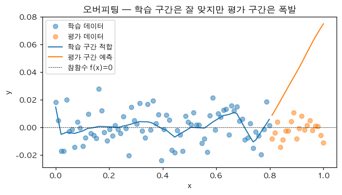

`(1)` 학습 데이터 (`X, Y`) 의 두 손실값 비교:

`A = MSE(net(X), Y)`,  `B = MSE(net(X)*0, Y)` (즉 0 예측의 MSE)

옳은 부등호는?

① $A < B$ — 학습 구간에서는 net 이 노이즈까지 외워서 0 예측보다 작은 잔차\
② $A > B$\
③ $A = B$\
④ 결정 불가

`(2)` 평가 데이터 (`XX, YY`) 의 두 손실값 비교:

`C = MSE(net(XX), YY)`,  `D = MSE(net(XX)*0, YY)`

옳은 부등호는?

① $C < D$\
② $C > D$ — 평가 구간에서 net 의 예측이 폭발 (그림 우측 참조)\
③ $C = D$\
④ 결정 불가

`(3)` 위 (1), (2) 결과로부터 「오버피팅의 정의」 와 가장 일치하는 진단은?

① 학습 손실 $A$ 는 작지만 평가 손실 $C$ 는 큼. 즉 학습 데이터에 과도하게 적합되어 보지 못한 데이터에 일반화하지 못함\
② $A = C$ 가 항상 성립\
③ $C < A$ 가 정상\
④ 손실 비교만으로는 오버피팅 진단 불가

`(4)` 위 오버피팅의 「근본 원인」 은?

① 노드 수 $m = 512$ 가 너무 **적어서** 표현력이 부족했기 때문\
② 노드 수 $m = 512$ 가 너무 **많아서** 표현력이 과해 노이즈까지 적합 가능 → 일반화 실패\
③ Adam optimizer 가 잘못되어서\
④ epoch 수 부족

`(5)` 시벤코 정리의 한계가 위 오버피팅 현상과 어떤 관련이 있는가?

① 시벤코는 표현력만 보장, 일반화는 보장하지 않음. 표현력이 너무 강하면 노이즈도 적합하여 오버피팅 발생\
② 시벤코는 일반화도 보장하므로 오버피팅이 일어나지 않아야 함\
③ 시벤코와 오버피팅은 무관\
④ 시벤코는 깊은 네트워크에만 성립

## 4. 드랍아웃의 작동 원리와 효과

다음 그림은 동일한 오버피팅 시나리오에서 「Dropout 없음」 vs 「Dropout(0.8) 추가」 의 결과 비교이다.

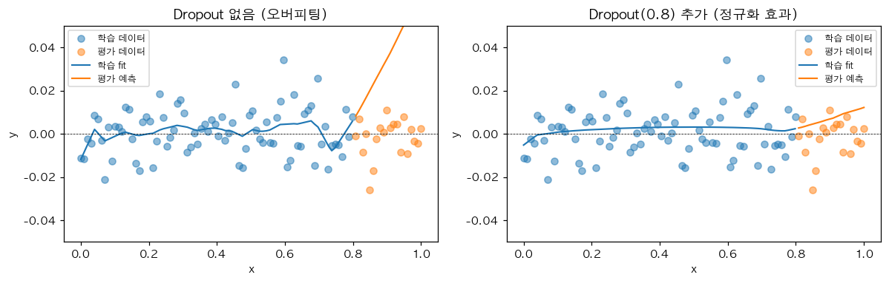

`(1)` 다음 코드의 결과로 가장 적절한 설명은?

```python
torch.manual_seed(0)
u = torch.ones(10)         # tensor([1., 1., 1., ..., 1.])
d = torch.nn.Dropout(0.8)
d(u)
```

① 모든 원소가 약 0.2가 됨\
② 임의로 80% 의 원소가 0이 되고, 살아남은 20% 의 원소는 그대로 1\
③ 임의로 80% 의 원소가 0이 되고, 살아남은 20% 의 원소는 5 가 됨 (스케일링 $1/(1-0.8) = 5$)\
④ 임의로 20% 의 원소가 0이 되고, 나머지 80% 는 1.25

`(2)` `Dropout(0.8)` 의 스케일링 ($\times 5$) 이 적용되는 이유는?

① 학습 시 평균 출력값을 평가 시 (Dropout 비활성화) 와 일치시키기 위해. 만약 스케일링 없으면 평균 출력이 학습/평가 사이에 다름\
② 학습 속도를 빠르게 하기 위해\
③ 그래디언트를 5배 키우기 위해\
④ 우연

`(3)` `Dropout` 이 적용된 네트워크에서 `net.train()` 모드와 `net.eval()` 모드의 차이는?

① `net.train()`: Dropout 활성 (랜덤 마스킹), `net.eval()`: Dropout 비활성 (모든 노드 사용, 스케일링 없음)\
② 두 모드의 차이 없음\
③ `net.train()` 만 가중치 업데이트\
④ `net.eval()` 만 출력 가능

`(4)` 다음 4개의 네트워크 중 드랍아웃 레이어를 올바르게 배치한 것을 **모두** 고르시오. (드랍아웃은 활성함수 뒤에 위치해야 하며, 단 활성함수가 ReLU 이면 ReLU 와 Dropout 의 위치 교환 가능. 계산효율은 고려 X)

```python
# (a)
net_a = torch.nn.Sequential(
    torch.nn.Linear(1, 512), torch.nn.Sigmoid(),
    torch.nn.Dropout(0.5),  torch.nn.Linear(512, 1)
)
# (b)
net_b = torch.nn.Sequential(
    torch.nn.Linear(1, 512), torch.nn.Dropout(0.5),
    torch.nn.Sigmoid(),     torch.nn.Linear(512, 1)
)
# (c)
net_c = torch.nn.Sequential(
    torch.nn.Linear(1, 512), torch.nn.ReLU(),
    torch.nn.Dropout(0.5),  torch.nn.Linear(512, 1)
)
# (d)
net_d = torch.nn.Sequential(
    torch.nn.Linear(1, 512), torch.nn.Dropout(0.5),
    torch.nn.ReLU(),        torch.nn.Linear(512, 1)
)
```

① `net_a`, `net_c`, `net_d`\
② `net_b` 만\
③ 모두 잘못됨\
④ 모두 동일

`(5)` 드랍아웃이 오버피팅을 줄이는 메커니즘에 대한 설명으로 가장 적절한 것은?

① 학습 시 무작위로 일부 노드를 끔으로써 특정 노드들의 「공적응 (co-adaptation)」 을 방지하고, 모델이 더 강건한 (robust) 표현을 학습하도록 유도\
② 학습률이 자동으로 줄어들어서\
③ 손실함수가 자동으로 작아져서\
④ 학습 데이터 양이 자동으로 늘어나서

`(6)` 「오버피팅된 네트워크 + Dropout 추가 → 평가 데이터에서 항상 0 예측보다 잘 맞춤」 라는 주장의 적절성은?

① 항상 보장됨\
② 본래의 net 보다는 일반화 성능이 좋아질 가능성이 크지만, 평가 데이터에서 0 예측보다 잘 맞춤은 보장되지 않음\
③ 절대 그렇지 않음\
④ Dropout 은 오히려 오버피팅을 악화시킴
