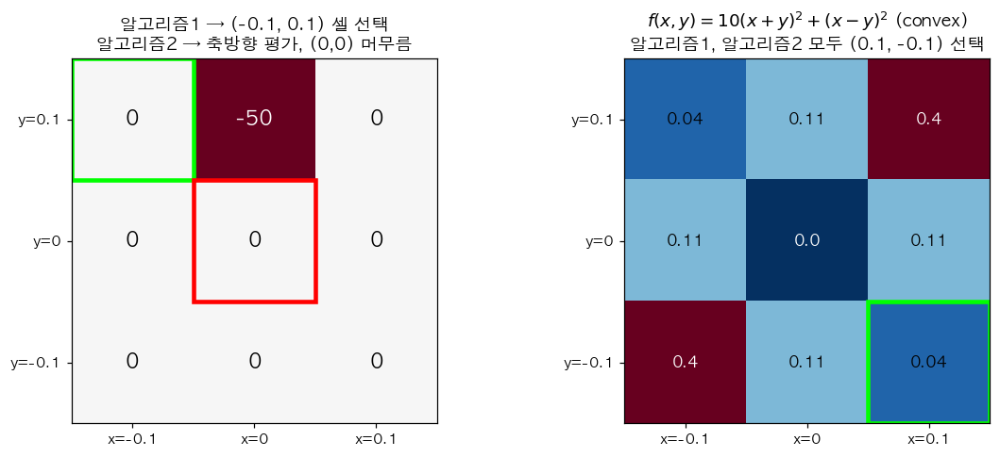
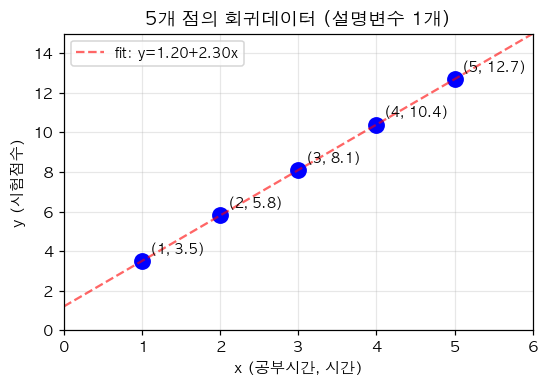
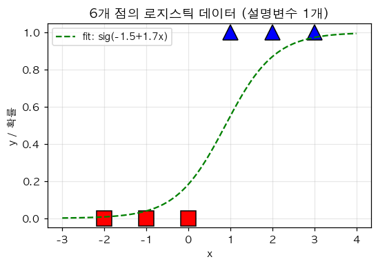
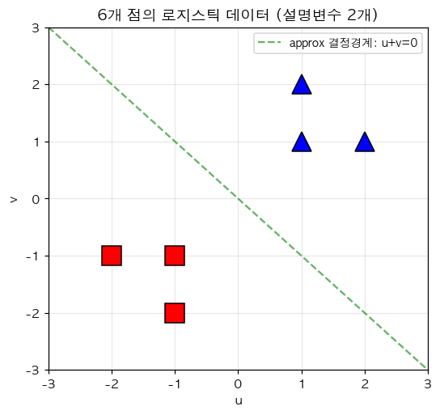
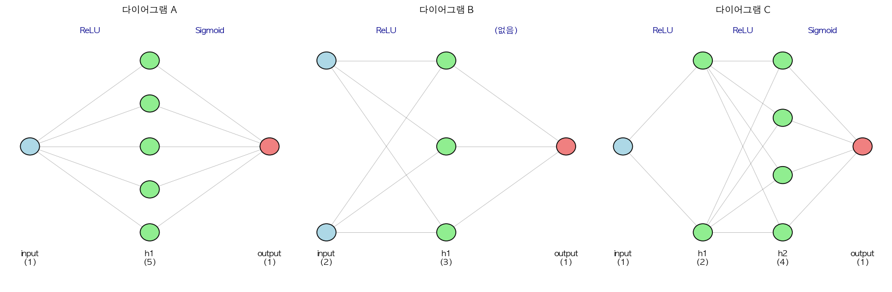
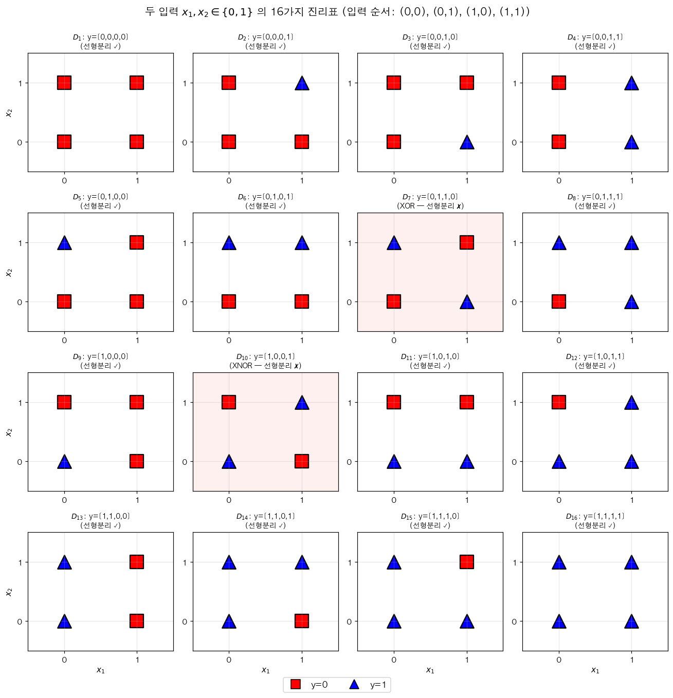
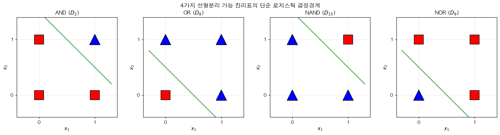
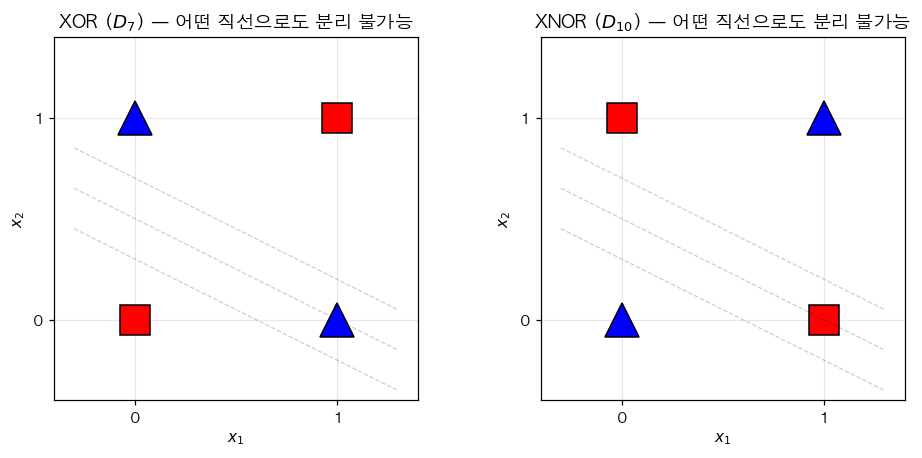

> v6 — 강의 퀴즈 (Quiz7, Quiz8, Quiz9, Quiz10, Quiz11, Quiz14, Quiz15, Quiz16) 의 구조를 미러링한 시험. 다른 데이터·시나리오로 출제. 총 17개 큰문제.

# 1. 알고리즘 비교 (Quiz7 미러링)

다음 두 알고리즘을 고려하자. (강의노트 「2차원 경사하강법 아이디어」)

- **알고리즘1**: 현재 점 $(x_{sol}, y_{sol})$ 주변 9개 격자점 중 가장 작은 함수값을 갖는 점으로 이동
- **알고리즘2**: $x$ 와 $y$ 축 방향으로만 함수값을 비교하여 이동방향을 결정 (편미분 기반, 동시 업데이트)

다음 그림은 두 격자 시나리오를 보여준다.



`(1)` 위 그림 **왼쪽** 의 $f(x, y)$ 함수표 (시작점 $(0, 0)$, 격자 간격 $0.1$) 에서 **알고리즘1** 의 1회 업데이트 결과는?

| $y \backslash x$ | $-0.1$ | $0$ | $0.1$ |
|:---:|:---:|:---:|:---:|
| $0.1$ | $-50$ | $0$ | $0$ |
| $0$ | $0$ | $0$ | $0$ |
| $-0.1$ | $0$ | $0$ | $0$ |

① $(0, 0)$ 에 머무름\
② $(-0.1, 0.1)$ 로 이동 — 가장 작은 값 $-50$ 의 셀\
③ $(0, 0.1)$ 로 이동\
④ $(-0.1, 0)$ 로 이동

`(2)` 같은 함수표에서 **알고리즘2** 의 1회 업데이트 결과는? ($x$ 축: $f(-0.1, 0)=0, f(0,0)=0, f(0.1,0)=0$ 모두 같으므로 $x$ 이동 없음. $y$ 축: $f(0,-0.1)=0, f(0,0)=0, f(0,0.1)=0$ 모두 같으므로 $y$ 이동 없음)

① $(0, 0)$ 에 머무름 — 두 축 모두 평평\
② $(-0.1, 0.1)$ 로 이동\
③ $(0, 0.1)$ 로 이동\
④ $(-0.1, 0)$ 로 이동

`(3)` 위 (1), (2) 의 결과로부터 두 알고리즘이 다른 결과를 주는 함수가 존재함을 보였다. 이 시나리오의 함의는?

① 알고리즘1 이 더 정밀하지만 (대각선 격자점도 봄), 차원이 높아지면 계산량이 $3^d$ 로 폭발하여 실용 불가\
② 두 알고리즘은 항상 같은 결과\
③ 알고리즘2 가 항상 더 정밀\
④ 두 알고리즘 모두 잘못

`(4)` 위 그림 **오른쪽** 은 convex 함수 $f(x, y) = 10(x+y)^2 + (x-y)^2$ 의 격자점 값 (시작점 $(0.1, -0.1)$, 격자 간격 $0.1$) 이다. 이 경우 두 알고리즘의 비교로 옳은 것은?

| $y \backslash x$ | $0.0$ | $0.1$ | $0.2$ |
|:---:|:---:|:---:|:---:|
| $0.0$ | $0.00$ | $0.11$ | $0.44$ |
| $-0.1$ | $0.11$ | $0.04$ | $0.19$ |
| $-0.2$ | $0.44$ | $0.19$ | $0.16$ |

(현재 점은 $(0.1, -0.1)$, 함수값 $0.04$)

① 알고리즘1 → $(0.0, 0.0)$ (가장 작은 값 $0.00$), 알고리즘2 → $(0.1, -0.1)$ 에 머무름 (축 방향 모두 현재가 최소) — **두 알고리즘이 다른 결과**\
② 둘 다 $(0.1, -0.1)$ 에 머무름\
③ 둘 다 $(0.0, 0.0)$ 으로 이동\
④ 둘 다 발산

`(5)` 위 (4) 의 함수는 convex 임에도 두 알고리즘이 다른 결과를 줄 수 있다. 그렇다면 「convex 함수에서는 두 알고리즘이 항상 같은 결과를 준다」 는 주장의 진위는?

① 옳음 — convex 에서 둘은 항상 같은 결과\
② 틀림 — (4) 의 예처럼 convex 함수에서도 두 알고리즘이 한 step 의 결과는 다를 수 있음\
③ convex 일 때 알고리즘1 이 항상 더 빠름\
④ convex 일 때 알고리즘2 가 항상 더 빠름

# 2. 똑같은 코드 찾기 — 단순회귀 6가지 변형 (Quiz8-3 미러링)

다음은 단순회귀 (참 모형 $y_i = 1 + 4 x_i + \epsilon_i$, $n = 100$) 의 기준 코드 (풀이2) 이다.

```python
# 데이터 (n=100)
torch.manual_seed(0)
x = torch.randn(100)
y = 1 + 4 * x + torch.randn(100) * 0.3
Y = y.reshape(-1, 1)
X = torch.stack([torch.ones(100), x], axis=1)

# 기준 코드 (풀이2)
w0hat = torch.tensor(0.0, requires_grad=True)
w1hat = torch.tensor(0.0, requires_grad=True)
for epoch in range(30):
    yhat = w0hat + w1hat * x
    loss = torch.sum((y - yhat)**2)
    loss.backward()
    w0hat.data = w0hat.data - 0.001 * w0hat.grad
    w1hat.data = w1hat.data - 0.001 * w1hat.grad
    w0hat.grad = None
    w1hat.grad = None
```

다음 6가지 변형의 빈칸을 채워라. 모두 기준 코드와 **같은 결과**를 출력해야 한다.

`(1)` matrix 버전:

```python
What = ⓐ
for epoch in range(30):
    Yhat = ⓑ
    loss = torch.sum((Y - Yhat)**2)
    loss.backward()
    What.data = What.data - 0.001 * What.grad
    What.grad = None
```

ⓐ, ⓑ 로 옳은 것은?

① ⓐ `torch.tensor([[0.0], [0.0]], requires_grad=True)`, ⓑ `X @ What`\
② ⓐ `torch.tensor([[0.0], [0.0]])`, ⓑ `What @ X`\
③ ⓐ `torch.tensor([[0.0], [0.0]], requires_grad=True)`, ⓑ `X * What`\
④ ⓐ `torch.tensor([[0.0]], requires_grad=True)`, ⓑ `X @ What`

`(2)` SSE → MSE 로 바꾸기 (학습률 보정 포함):

```python
What = torch.tensor([[0.0], [0.0]], requires_grad=True)
for epoch in range(30):
    Yhat = X @ What
    loss = torch.mean((Y - Yhat)**2)
    loss.backward()
    What.data = What.data - ⓐ * What.grad
    What.grad = None
```

ⓐ 로 옳은 것은? ($n = 100$)

① `0.001`\
② `0.01`\
③ `0.1`\
④ `1.0`

`(3)` `loss_fn` 사용:

```python
What = torch.tensor([[0.0], [0.0]], requires_grad=True)
loss_fn = ⓐ
for epoch in range(30):
    Yhat = X @ What
    loss = loss_fn(Yhat, Y)
    loss.backward()
    What.data = What.data - ⓑ * What.grad
    What.grad = None
```

ⓐ, ⓑ 로 옳은 것은?

① ⓐ `torch.nn.MSELoss()`, ⓑ `0.1`\
② ⓐ `torch.nn.MSELoss()`, ⓑ `0.001`\
③ ⓐ `torch.nn.SSELoss()`, ⓑ `0.001`\
④ ⓐ `torch.nn.BCELoss()`, ⓑ `0.1`

`(4)` `nn.Linear` 사용:

```python
net = ⓐ
ⓑ = ⓒ  # 가중치 초기값 모두 0
loss_fn = torch.nn.MSELoss()
for epoch in range(30):
    Yhat = net(X)
    loss = loss_fn(Yhat, Y)
    loss.backward()
    net.weight.data = net.weight.data - 0.1 * net.weight.grad
    net.weight.grad = None
```

ⓐ, ⓑ, ⓒ 로 옳은 것은?

① ⓐ `torch.nn.Linear(2, 1, bias=False)`, ⓑ `net.weight.data`, ⓒ `torch.tensor([[0.0, 0.0]])`\
② ⓐ `torch.nn.Linear(2, 1, bias=True)`, ⓑ `net.bias.data`, ⓒ `torch.tensor([0.0])`\
③ ⓐ `torch.nn.Linear(1, 1, bias=False)`, ⓑ `net.weight.data`, ⓒ `torch.tensor([[0.0]])`\
④ ⓐ `torch.nn.Linear(1, 2, bias=False)`, ⓑ `net.weight.data`, ⓒ `torch.tensor([[0.0]])`

`(5)` `optimizer` 사용:

```python
net = torch.nn.Linear(2, 1, bias=False)
net.weight.data = torch.tensor([[0.0, 0.0]])
loss_fn = torch.nn.MSELoss()
optimizer = ⓐ
for epoch in range(30):
    Yhat = net(X)
    loss = loss_fn(Yhat, Y)
    loss.backward()
    ⓑ
    ⓒ
```

ⓐ, ⓑ, ⓒ 로 옳은 것은?

① ⓐ `torch.optim.SGD(net.parameters(), lr=0.1)`, ⓑ `optimizer.step()`, ⓒ `optimizer.zero_grad()`\
② ⓐ `torch.optim.Adam(net.parameters(), lr=0.001)`, ⓑ `optimizer.step()`, ⓒ `optimizer.zero_grad()`\
③ ⓐ `torch.optim.SGD(net.parameters(), lr=0.001)`, ⓑ `optimizer.step()`, ⓒ 빈칸 비움\
④ ⓐ `torch.optim.SGD(0.1)`, ⓑ `optimizer.step()`, ⓒ `loss.zero_grad()`

`(6)` `bias=True` + 디자인 행렬에서 1열 제거:

```python
X1 = x.reshape(-1, 1)
net = ⓐ
net.weight.data = ⓑ
net.bias.data = ⓒ
loss_fn = torch.nn.MSELoss()
optimizer = torch.optim.SGD(net.parameters(), lr=0.1)
for epoch in range(30):
    Yhat = ⓓ
    loss = loss_fn(Yhat, Y)
    loss.backward()
    optimizer.step()
    optimizer.zero_grad()
```

ⓐ, ⓑ, ⓒ, ⓓ 로 옳은 것은?

① ⓐ `torch.nn.Linear(1, 1, bias=True)`, ⓑ `torch.tensor([[0.0]])`, ⓒ `torch.tensor([0.0])`, ⓓ `net(X1)`\
② ⓐ `torch.nn.Linear(2, 1, bias=False)`, ⓑ `torch.tensor([[0.0, 0.0]])`, ⓒ `torch.tensor([0.0])`, ⓓ `net(X)`\
③ ⓐ `torch.nn.Linear(1, 1, bias=False)`, ⓑ `torch.tensor([[0.0]])`, ⓒ 없음, ⓓ `net(X1)`\
④ ⓐ `torch.nn.Linear(2, 2, bias=True)`, ⓑ `torch.tensor([[0.0, 0.0]])`, ⓒ `torch.tensor([0.0, 0.0])`, ⓓ `net(X)`

# 3. $W^*$ 를 추정하는 두 가지 방법 (Quiz8-4 미러링)

회귀모형 $y_i = w_0^\ast + w_1^\ast x_i + \epsilon_i$ 에서 $w_0^\ast, w_1^\ast$ 를 추정하는 두 방법을 비교한다 — (가) 회귀분석의 해석해 (closed-form: $\hat{\bf w} = ({\bf X}^\top {\bf X})^{-1} {\bf X}^\top {\bf y}$) (나) 경사하강법.

`(1)` 다음 설명 중 옳은 것을 **모두** 고르시오.

① 적절한 학습률과 충분한 epoch 이 주어지면, 경사하강법으로 구한 추정값은 회귀분석에서 배운 해석해 (closed-form solution) 로 수렴한다\
② 적절한 학습률과 충분한 epoch 이 주어지면, 경사하강법으로 구한 추정값은 결국 true parameter $[w_0^\ast, w_1^\ast]$ 로 정확히 수렴한다\
③ 경사하강법에서 loss 를 SSE 에서 MSE 로 바꿀 때, 학습률을 샘플 수 $n$ 배 만큼 조절하면 정확히 같은 결과를 얻을 수 있다\
④ 경사하강법을 사용하면 벡터미분 공식을 직접 유도하지 않아도 파라미터를 추정할 수 있다

`(2)` 회귀의 해석해와 경사하강법의 결과 비교에 대한 설명 중 **틀린** 것은?

① 회귀의 해석해는 한 번의 행렬 연산으로 정확한 답을 줌 — 단, ${\bf X}^\top {\bf X}$ 가 invertible 이어야 함\
② 경사하강법은 반복 알고리즘으로, 적절한 학습률과 충분한 epoch 이 있어야 해석해에 수렴\
③ 경사하강법은 ${\bf X}^\top {\bf X}$ 의 invertibility 와 무관하게 항상 동작\
④ 경사하강법은 회귀에서는 거의 사용하지 않음 — 항상 해석해가 더 정확하기 때문

`(3)` 단순회귀에서 경사하강법으로 구한 $\hat{\bf w}$ 가 true parameter $[w_0^\ast, w_1^\ast]$ 에 점점 가까워지게 하는 방법으로 가장 효과적인 것은?

① 학습률을 0으로 만든다\
② epoch 을 0으로 만든다\
③ 데이터 수 $n$ 을 늘린다 — 표본 크기가 커지면 추정값의 분산이 줄어 true 에 가까워짐\
④ 손실함수를 항상 0으로 만든다

`(4)` SSE 손실 $\sum (y_i - \hat y_i)^2$ 와 MSE 손실 $\frac{1}{n} \sum (y_i - \hat y_i)^2$ 의 그래디언트 비교로 옳은 것은?

① $\nabla_{\bf w} \text{MSE} = \frac{1}{n} \nabla_{\bf w} \text{SSE}$ — MSE 의 그래디언트는 SSE 의 $1/n$ 배. 따라서 동일한 결과를 위해 MSE 의 학습률은 SSE 의 $n$ 배\
② 두 그래디언트는 같음\
③ MSE 의 그래디언트는 SSE 의 $n$ 배\
④ 두 그래디언트는 무관

# 4. 베르누이 MLE 와 경사하강법 (Quiz9 미러링)

아래는 $X_i \overset{i.i.d.}{\sim} \text{Ber}(0.3)$ 을 생성하는 코드이다.

```python
torch.manual_seed(43052)
x = torch.bernoulli(torch.tensor([0.3] * 5000))
```

함수 $l(p)$ 를 최소화하는 $p$ 를 경사하강법으로 추정하라.

$$l(p) = -\frac{1}{n} \sum_{i=1}^{n} \log f(x_i), \quad f(x_i) = p^{x_i}(1-p)^{1-x_i}$$

(단, 초기값은 $p = 0.5$ 에서 시작)

`(1)` 위 손실함수 $l(p)$ 를 정의하는 코드로 옳은 것은?

① 
```python
def l(p):
    return -torch.mean(torch.log(p**x * (1-p)**(1-x)))
```

② 
```python
def l(p):
    return torch.mean((x - p)**2)
```

③ 
```python
def l(p):
    return torch.mean(torch.log(p**x))
```

④ 
```python
def l(p):
    return -torch.sum(torch.log(p))
```

`(2)` 다음 코드의 빈칸을 채워라.

```python
p = torch.tensor(0.5, requires_grad=True)
for dummy in range(15):
    ⓐ
    p.data = p.data - 0.1 * p.grad
    ⓑ
```

ⓐ, ⓑ 로 옳은 것은?

① ⓐ `l(p).backward()`, ⓑ `p.grad = None`\
② ⓐ `l(p).step()`, ⓑ `p.grad = None`\
③ ⓐ `loss.backward()`, ⓑ `loss.zero_grad()`\
④ ⓐ `p.backward()`, ⓑ `p = 0`

`(3)` 위 경사하강법의 이론적인 수렴값 (베르누이 분포의 MLE) 로 옳은 것은?

① $p \to 0.5$ (초기값)\
② $p \to 0.3$ (true parameter)\
③ $p \to \bar{x}$ (sample mean) — large $n$ 에서 $\bar x \approx 0.3$\
④ $p \to 0$

`(4)` 만약 위 코드에서 `torch.bernoulli(torch.tensor([0.7] * 5000))` 으로 데이터를 생성한 뒤 같은 알고리즘 (초기값 $p = 0.5$) 으로 학습하면, 수렴값은?

① $p \to 0.5$\
② $p \to 0.7$ — sample mean 에 수렴\
③ $p \to 0.3$\
④ $p \to 0$

`(5)` 베르누이 MLE 를 BCE 손실로 다시 표현하면? ($y_i = x_i \in \{0, 1\}$, $\hat y_i = p$)

① $l(p) = -\frac{1}{n} \sum (y_i \log p + (1-y_i) \log(1-p))$ — 정확히 BCE 와 동일\
② $l(p) = \frac{1}{n} \sum (y_i - p)^2$\
③ $l(p) = \frac{1}{n} \sum |y_i - p|$\
④ $l(p) = \sum y_i p$

# 5. 로지스틱 모델링 — 두 방식 비교 + MSE 함정 (Quiz10-4 미러링)

`(1)` 어느 데이터 「광고비 vs 구매여부」 를 시뮬레이션하는 두 방식을 비교한다.

**방식1**:
```python
_y = (1.5 * x + torch.randn(2000) * 0.3 > 0).float()
```

**방식2**:
```python
u = -2 + 6 * x
v = sig(u)
_y = torch.bernoulli(v)
```

「방식2」 를 선호하는 이유로 가장 적절한 것은?

① 방식1 은 잘못된 모형이므로 사용 불가\
② 방식2 는 시그모이드 + BCE 조합으로 학습이 잘 되며, 오즈 (odds) $\log\frac{\pi^*}{1-\pi^*} = w_0^* + w_1^* x$ 의 의미해석이 자연스러움\
③ 방식2 가 코드가 짧기 때문\
④ 방식2 가 결과값이 더 큼

`(2)` 다음 코드는 로지스틱 모델 학습 코드이다. 이 코드의 가장 큰 문제점은?

```python
for epoch in range(100):
    prob = sig(linr(X))
    loss = torch.mean((prob - Y)**2)
    loss.backward()
    linr.weight.data = linr.weight.data - 0.25 * linr.weight.grad
    linr.bias.data = linr.bias.data - 0.25 * linr.bias.grad
    linr.weight.grad = None
    linr.bias.grad = None
```

① MSELoss 를 손실함수로 사용 — 시그모이드 + MSE 조합은 손실면이 non-convex 이고 gradient vanishing 이 있어 학습이 느리거나 수렴 실패. BCE 사용 권장\
② `requires_grad` 가 빠짐\
③ `zero_grad` 가 누락\
④ 학습률이 너무 큼

`(3)` 위 (2) 의 코드에서 MSELoss 를 BCELoss 로 바꾸기 위한 수정으로 옳은 것은?

```python
loss = ???
```

① `torch.mean((prob - Y)**2)`\
② `-torch.mean(Y * torch.log(prob) + (1 - Y) * torch.log(1 - prob))`\
③ `torch.sum(Y - prob)`\
④ `torch.mean(prob)`

`(4)` 시그모이드 + MSE vs 시그모이드 + BCE 의 손실면 모양 비교로 옳은 것은?

① MSE: convex, BCE: non-convex\
② MSE: 일반적으로 non-convex (특히 시그모이드 포화 영역에서 평탄), BCE: convex (단순 로지스틱에서)\
③ 둘 다 convex\
④ 둘 다 non-convex

`(5)` 「최악의 초기값」 (예: `linr.bias = -10`) 에서 시작했을 때 두 손실의 학습 양상으로 가장 적절한 것은?

① BCE 는 그래디언트가 $\hat y - y$ 로 깔끔하여 학습이 잘 진행됨. MSE 는 시그모이드 도함수 $\sigma'(z)$ 가 곱해져 포화 영역에서 학습 정체\
② MSE 가 더 빨리 수렴\
③ 둘 다 수렴 불가\
④ 둘 다 같은 속도로 수렴

# 6. 로지스틱 — 똑같은 코드 찾기 (Quiz10-5 미러링)

기준 코드 (광고비 → 구매여부 데이터, 단순 로지스틱):

```python
torch.manual_seed(0)
x = torch.linspace(0, 1, 1000)
piast = torch.exp(-2 + 6*x) / (torch.exp(-2 + 6*x) + 1)
y = torch.bernoulli(piast)
X = x.reshape(-1, 1)
Y = y.reshape(-1, 1)

# 기준 코드
linr = torch.nn.Linear(1, 1)
linr.weight.data = torch.tensor([[0.0]])
linr.bias.data = torch.tensor([0.0])
def sig(x):
    return torch.exp(x) / (torch.exp(x) + 1)
for epoch in range(5000):
    Yhat = sig(linr(X))
    loss = -torch.mean(Y*torch.log(Yhat) + (1-Y)*torch.log(1-Yhat))
    loss.backward()
    linr.weight.data = linr.weight.data - 0.1 * linr.weight.grad
    linr.bias.data = linr.bias.data - 0.1 * linr.bias.grad
    linr.weight.grad = None
    linr.bias.grad = None
```

`(1)` 직접 정의한 `sig` 함수를 `torch.nn.Sigmoid()` 로 교체. 빈칸으로 옳은 것은?

```python
linr = torch.nn.Linear(1, 1)
linr.weight.data = torch.tensor([[0.0]])
linr.bias.data = torch.tensor([0.0])
sig = ???
for epoch in range(5000):
    Yhat = sig(linr(X))
    ...
```

① `torch.nn.Sigmoid()`\
② `torch.nn.ReLU()`\
③ `torch.nn.Sigmoid`\
④ `torch.sigmoid`

`(2)` BCE 손실 수식을 `loss_fn` 으로 교체. 빈칸 ⓐ, ⓑ 로 옳은 것은?

```python
sig = torch.nn.Sigmoid()
loss_fn = ⓐ
for epoch in range(5000):
    Yhat = sig(linr(X))
    loss = ⓑ
    loss.backward()
    ...
```

① ⓐ `torch.nn.BCELoss()`, ⓑ `loss_fn(Yhat, Y)`\
② ⓐ `torch.nn.MSELoss()`, ⓑ `loss_fn(Yhat, Y)`\
③ ⓐ `torch.nn.BCELoss()`, ⓑ `loss_fn(Y, Yhat)`\
④ ⓐ `torch.nn.CrossEntropyLoss()`, ⓑ `loss_fn(Yhat, Y)`

`(3)` `optimizer` 도입으로 수동 업데이트 + grad 초기화 대체. 빈칸 ⓐ, ⓑ, ⓒ 로 옳은 것은?

```python
sig = torch.nn.Sigmoid()
loss_fn = torch.nn.BCELoss()
optimizer = ⓐ
for epoch in range(5000):
    Yhat = sig(linr(X))
    loss = loss_fn(Yhat, Y)
    loss.backward()
    ⓑ
    ⓒ
```

① ⓐ `torch.optim.SGD(linr.parameters(), lr=0.1)`, ⓑ `optimizer.step()`, ⓒ `optimizer.zero_grad()`\
② ⓐ `torch.optim.Adam(linr.parameters())`, ⓑ `optimizer.step()`, ⓒ `optimizer.zero_grad()`\
③ ⓐ `torch.optim.SGD(linr.parameters(), lr=0.001)`, ⓑ `optimizer.step()`, ⓒ 빈칸 비움\
④ ⓐ `torch.optim.SGD(0.1)`, ⓑ `loss.step()`, ⓒ `loss.zero_grad()`

`(4)` `sig(linr(X))` 를 `net(X)` 로 바꾸기 위해 `Sequential` 사용. 빈칸 ⓐ, ⓑ, ⓒ 로 옳은 것은?

```python
net = torch.nn.Sequential(
    ⓐ,
    ⓑ
)
ⓒ = torch.tensor([[0.0]])
net[0].bias.data = torch.tensor([0.0])
loss_fn = torch.nn.BCELoss()
optimizer = torch.optim.SGD(net.parameters(), lr=0.1)
for epoch in range(5000):
    Yhat = net(X)
    loss = loss_fn(Yhat, Y)
    loss.backward()
    optimizer.step()
    optimizer.zero_grad()
```

① ⓐ `torch.nn.Linear(1, 1)`, ⓑ `torch.nn.Sigmoid()`, ⓒ `net[0].weight.data`\
② ⓐ `torch.nn.Sigmoid()`, ⓑ `torch.nn.Linear(1, 1)`, ⓒ `net[1].weight.data`\
③ ⓐ `torch.nn.Linear(1, 1)`, ⓑ `torch.nn.ReLU()`, ⓒ `net[0].weight.data`\
④ ⓐ `torch.nn.Linear(2, 1)`, ⓑ `torch.nn.Sigmoid()`, ⓒ `net[0].weight.data`

`(5)` `linr` 과 `sig` 를 따로 선언한 뒤 `Sequential` 로 묶기. 빈칸 ⓐ 로 옳은 것은?

```python
linr = torch.nn.Linear(1, 1)
sig = torch.nn.Sigmoid()
net = ⓐ
linr.weight.data = torch.tensor([[0.0]])
linr.bias.data = torch.tensor([0.0])
loss_fn = torch.nn.BCELoss()
optimizer = torch.optim.SGD(net.parameters(), lr=0.1)
for epoch in range(5000):
    Yhat = net(X)
    loss = loss_fn(Yhat, Y)
    loss.backward()
    optimizer.step()
    optimizer.zero_grad()
```

① `torch.nn.Sequential(linr, sig)`\
② `torch.nn.Sequential([linr, sig])`\
③ `torch.nn.Sequential(sig, linr)`\
④ `linr + sig`

# 7. 토이 회귀 — 설명변수 1개 (Quiz11-1 미러링)

다음 토이 데이터에 회귀모델 $y_i \sim N(w_0^\ast + w_1^\ast x_i, \sigma^2)$ 를 적합한다.

| $x_i$ | $y_i$ |
|:---:|:---:|
| 1 | 3.5 |
| 2 | 5.8 |
| 3 | 8.1 |
| 4 | 10.4 |
| 5 | 12.7 |



`(1)` 다음 코드에서 빈칸 ⓐ, ⓑ 로 옳은 것은?

```python
import torch
x = torch.tensor([1.0, 2.0, 3.0, 4.0, 5.0])
y = torch.tensor([3.5, 5.8, 8.1, 10.4, 12.7])
X = ⓐ
Y = y.reshape(-1, 1)
What = ⓑ  # 모든 파라메터의 초기값은 0
for epoch in range(300):
    Yhat = X @ What
    loss = torch.mean((Yhat - Y)**2)
    loss.backward()
    What.data = What.data - 0.05 * What.grad
    What.grad = None
```

① ⓐ `torch.stack([torch.ones(5), x], axis=1)`, ⓑ `torch.tensor([[0.0], [0.0]], requires_grad=True)`\
② ⓐ `x.reshape(-1, 1)`, ⓑ `torch.tensor([[0.0]], requires_grad=True)`\
③ ⓐ `torch.stack([x, torch.ones(5)], axis=1)`, ⓑ `torch.tensor([[0.0], [0.0]])`\
④ ⓐ `torch.tensor([1.0, 2.0, 3.0, 4.0, 5.0])`, ⓑ `torch.tensor(0.0, requires_grad=True)`

`(2)` 학습이 끝났을 때 `What.data` 의 값으로 가장 가까운 것은? (데이터를 보면 $y \approx 1.2 + 2.3 x$ 형태)

① `tensor([[1.2], [2.3]])`\
② `tensor([[2.3], [1.2]])`\
③ `tensor([[0.0], [0.0]])`\
④ `tensor([[3.5], [12.7]])`

`(3)` 학습 후 새로운 데이터 $x_{new} = 7$ 에 대한 예측값을 구하는 코드로 옳은 것은? (단, $\hat w_0 \approx 1.2, \hat w_1 \approx 2.3$ 이라 가정)

① `Xnew = torch.tensor([[1.0, 7.0]]); Xnew @ What`\
② `Xnew = torch.tensor([7.0]); What @ Xnew`\
③ `Xnew = torch.tensor([7.0]); Xnew * What`\
④ `What @ torch.tensor([7.0])`

`(4)` 위 (3) 의 예측값으로 가장 가까운 것은?

① $1.2 + 2.3 \cdot 7 \approx 17.3$\
② $1.2 + 7 \approx 8.2$\
③ $2.3 \cdot 7 \approx 16.1$\
④ $7$

`(5)` 위 학습된 모형의 적합값 $\hat y_i$ 와 실제 관측값 $y_i$ 의 차이 $y_i - \hat y_i$ 를 잔차 (residual) 라 한다. 5개 점의 잔차의 합 $\sum (y_i - \hat y_i)$ 의 이론적 값은? (충분히 학습된 단순회귀의 경우)

① $0$ — 절편을 포함한 OLS 의 정규방정식 첫 번째 식이 $\sum (y_i - \hat y_i) = 0$ 을 보장\
② $\sum y_i \approx 40.5$\
③ 음수\
④ 알 수 없음

# 8. 토이 회귀 — 설명변수 2개 (Quiz11-2 미러링)

다음 토이 데이터에 회귀모델 $y_i \sim N(w_0^\ast + w_1^\ast u_i + w_2^\ast v_i, \sigma^2)$ 를 적합한다.

| $u_i$ | $v_i$ | $y_i$ |
|:---:|:---:|:---:|
| 1 | 2 | 10.2 |
| 2 | 1 | 9.0 |
| 3 | 3 | 17.8 |
| 4 | 2 | 16.5 |
| 5 | 4 | 24.5 |

`(1)` 다음 코드에서 빈칸 ⓐ, ⓑ 로 옳은 것은?

```python
import torch
u = torch.tensor([1.0, 2.0, 3.0, 4.0, 5.0])
v = torch.tensor([2.0, 1.0, 3.0, 2.0, 4.0])
y = torch.tensor([10.2, 9.0, 17.8, 16.5, 24.5])
X = ⓐ
Y = y.reshape(-1, 1)
What = ⓑ
for epoch in range(300):
    Yhat = X @ What
    loss = torch.mean((Yhat - Y)**2)
    loss.backward()
    What.data = What.data - 0.05 * What.grad
    What.grad = None
```

① ⓐ `torch.stack([torch.ones(5), u, v], axis=1)`, ⓑ `torch.tensor([[0.0], [0.0], [0.0]], requires_grad=True)`\
② ⓐ `torch.stack([u, v], axis=1)`, ⓑ `torch.tensor([[0.0], [0.0]], requires_grad=True)`\
③ ⓐ `torch.stack([u, v, torch.ones(5)], axis=1)`, ⓑ `torch.tensor([[0.0], [0.0], [0.0]], requires_grad=True)`\
④ ⓐ `u + v`, ⓑ `torch.tensor([[0.0]], requires_grad=True)`

`(2)` 위 데이터의 디자인 행렬 ${\bf X}$ 의 shape 와 가중치 벡터 $\hat{\bf w}$ 의 shape 는?

① ${\bf X}$: $(5, 3)$, $\hat{\bf w}$: $(3, 1)$\
② ${\bf X}$: $(5, 2)$, $\hat{\bf w}$: $(2, 1)$\
③ ${\bf X}$: $(3, 5)$, $\hat{\bf w}$: $(3, 1)$\
④ ${\bf X}$: $(5, 1)$, $\hat{\bf w}$: $(5, 1)$

`(3)` 학습 후 새로운 데이터 $u_{new} = 3, v_{new} = 4$ 에 대한 예측 코드로 옳은 것은?

① `Xnew = torch.tensor([[1.0, 3.0, 4.0]]); Xnew @ What`\
② `Xnew = torch.tensor([3.0, 4.0]); What @ Xnew`\
③ `Xnew = torch.tensor([[3.0, 4.0]]); Xnew @ What`\
④ `What @ torch.tensor([3.0, 4.0])`

`(4)` 만약 같은 데이터를 `Linear` 와 `optimizer` 로 풀려고 할 때, 다음 중 옳은 코드는?

① 
```python
X = torch.stack([u, v], axis=1)   # 첫 열이 1 이 아님
net = torch.nn.Linear(2, 1, bias=True)
optimizer = torch.optim.SGD(net.parameters(), lr=0.05)
loss_fn = torch.nn.MSELoss()
```

② 
```python
X = torch.stack([torch.ones(5), u, v], axis=1)   # 첫 열이 1
net = torch.nn.Linear(3, 1, bias=True)   # bias 가 또 있음 — over-parameterized
loss_fn = torch.nn.MSELoss()
```

③ 
```python
X = u + v
net = torch.nn.Linear(1, 1, bias=True)
```

④ 
```python
X = torch.stack([u, v], axis=1)
net = torch.nn.Linear(1, 2, bias=False)
```

# 9. 토이 로지스틱 — 설명변수 1개 (Quiz11-3 미러링)

다음 토이 데이터에 로지스틱 모델 $y_i \sim \text{Bernoulli}(\text{sig}(w_0^\ast + w_1^\ast x_i))$ 를 적합한다.

| $x_i$ | $y_i$ |
|:---:|:---:|
| -2 | 0 |
| -1 | 0 |
| 0 | 0 |
| 1 | 0 |
| 2 | 1 |
| 3 | 1 |



`(1)` 다음 코드에서 빈칸 ⓐ, ⓑ 로 옳은 것은?

```python
import torch
def sig(x):
    return torch.exp(x) / (torch.exp(x) + 1)
x = torch.tensor([-2.0, -1.0, 0.0, 1.0, 2.0, 3.0])
y = torch.tensor([0.0, 0.0, 0.0, 0.0, 1.0, 1.0])
X = ⓐ
Y = y.reshape(-1, 1)
What = ⓑ
for epoch in range(300):
    Yhat = sig(X @ What)
    loss = -torch.mean(Y*torch.log(Yhat) + (1-Y)*torch.log(1-Yhat))
    loss.backward()
    What.data = What.data - 0.1 * What.grad
    What.grad = None
```

① ⓐ `torch.stack([torch.ones(6), x], axis=1)`, ⓑ `torch.tensor([[0.0], [0.0]], requires_grad=True)`\
② ⓐ `x.reshape(-1, 1)`, ⓑ `torch.tensor([[0.0]], requires_grad=True)`\
③ ⓐ `torch.stack([x, torch.ones(6)], axis=1)`, ⓑ `torch.tensor([[0.0], [0.0]])`\
④ ⓐ `torch.tensor([-2., -1., 0., 1., 2., 3.])`, ⓑ `torch.tensor(0.0, requires_grad=True)`

`(2)` 학습 후 결정경계 ($\hat\pi = 0.5$ 가 되는 $x$) 의 위치는? (학습된 $\hat w_0 \approx -2.4, \hat w_1 \approx 1.9$)

① $x \approx -2.4 / 1.9 \approx -1.26$\
② $x \approx 2.4 / 1.9 \approx 1.26$ — $-\hat w_0 / \hat w_1$\
③ $x \approx 0$\
④ $x \approx 1.5$

`(3)` 학습 후 새로운 데이터 $x_{new} = 2.2$ 에 대한 예측값을 구하는 코드로 옳은 것은?

① `Xnew = torch.tensor([[1.0, 2.2]]); sig(Xnew @ What)`\
② `Xnew = torch.tensor([2.2]); sig(What @ Xnew)`\
③ `Xnew = torch.tensor([[2.2]]); sig(Xnew * What)`\
④ `sig(What @ torch.tensor([2.2]))`

`(4)` 위 (3) 의 예측값으로 가장 가까운 것은? (즉 $\sigma(-2.4 + 1.9 \cdot 2.2)$. $\sigma(1.78)$ 은?)

① $0.5$\
② $0.86$ — $\sigma$ 가 $0$ 보다 큰 입력에서 점점 1 에 가까워짐\
③ $0.99$\
④ $0.14$

`(5)` 만약 학습 후 임계값 $0.5$ 로 분류 라벨을 예측한다면, $x = -1$ 의 예측 라벨은?

① $\hat y = 0$ — $\sigma(-2.4 + 1.9 \cdot (-1)) = \sigma(-4.3) \approx 0.013 < 0.5$\
② $\hat y = 1$\
③ $\hat y = 0.5$\
④ 알 수 없음

# 10. 토이 로지스틱 — 설명변수 2개 (Quiz11-4 미러링)

다음 토이 데이터에 로지스틱 모델 $y_i \sim \text{Bernoulli}(\text{sig}(w_0^\ast + w_1^\ast u_i + w_2^\ast v_i))$ 를 적합한다.

| $u_i$ | $v_i$ | $y_i$ |
|:---:|:---:|:---:|
| 1 | 1 | 1 |
| 2 | 1 | 1 |
| 1 | 2 | 1 |
| -1 | -1 | 0 |
| -2 | -1 | 0 |
| -1 | -2 | 0 |



`(1)` 다음 코드에서 빈칸 ⓐ, ⓑ 로 옳은 것은?

```python
def sig(x):
    return torch.exp(x) / (torch.exp(x) + 1)
u = torch.tensor([1.0, 2.0, 1.0, -1.0, -2.0, -1.0])
v = torch.tensor([1.0, 1.0, 2.0, -1.0, -1.0, -2.0])
y = torch.tensor([1.0, 1.0, 1.0, 0.0, 0.0, 0.0])
X = ⓐ
Y = y.reshape(-1, 1)
What = ⓑ
for epoch in range(300):
    Yhat = sig(X @ What)
    loss = -torch.mean(Y*torch.log(Yhat) + (1-Y)*torch.log(1-Yhat))
    loss.backward()
    What.data = What.data - 0.1 * What.grad
    What.grad = None
```

① ⓐ `torch.stack([torch.ones(6), u, v], axis=1)`, ⓑ `torch.tensor([[0.0], [0.0], [0.0]], requires_grad=True)`\
② ⓐ `torch.stack([u, v], axis=1)`, ⓑ `torch.tensor([[0.0], [0.0]], requires_grad=True)`\
③ ⓐ `torch.stack([u, v, torch.ones(6)], axis=1)`, ⓑ `torch.tensor([[0.0], [0.0], [0.0]], requires_grad=True)`\
④ ⓐ `u + v`, ⓑ `torch.tensor([[0.0]], requires_grad=True)`

`(2)` 학습 후 $\hat w_0 \approx 0, \hat w_1 \approx 1.78, \hat w_2 \approx 1.78$ 이 나왔다 (대칭성으로 인해 $\hat w_1 \approx \hat w_2$). 새로운 데이터 $u_{new} = 1, v_{new} = -1$ 에 대한 예측값은?

(힌트: $\hat\pi = \sigma(\hat w_0 + \hat w_1 \cdot 1 + \hat w_2 \cdot (-1)) = \sigma(0 + 1.78 - 1.78) = \sigma(0) = ?$)

① $0$\
② $0.5$ — $\sigma(0) = 0.5$\
③ $1$\
④ $0.86$

`(3)` 위 (2) 의 결과 $\hat\pi = 0.5$ 의 의미로 옳은 것은?

① 점 $(u, v) = (1, -1)$ 이 결정경계 ($\hat\pi = 0.5$) 위에 있음 — 분류 가능성이 50:50\
② $\hat y = 1$ 이 확실\
③ $\hat y = 0$ 이 확실\
④ 학습 실패

`(4)` 위 데이터의 결정경계 (즉 $\hat w_0 + \hat w_1 u + \hat w_2 v = 0$) 의 형태는? ($\hat w_0 = 0, \hat w_1 = \hat w_2 = 1.78$ 가정)

① $u + v = 0$ — 즉 직선 $v = -u$\
② $u - v = 0$\
③ $u + v = 1$\
④ $u + v = -1$

`(5)` 위 학습된 모형으로 분류 라벨을 예측할 때, 두 영역 $\{u + v > 0\}$ 과 $\{u + v < 0\}$ 의 예측은 각각?

① $u + v > 0$ → $\hat y = 1$, $u + v < 0$ → $\hat y = 0$\
② $u + v > 0$ → $\hat y = 0$, $u + v < 0$ → $\hat y = 1$\
③ 둘 다 $\hat y = 0$\
④ 둘 다 $\hat y = 1$

# 11. 다이어그램 → 코드 (Quiz14-1 미러링)

다음 그림은 3개의 다른 네트워크 다이어그램이다.



`(1)` **다이어그램 A** (입력 1, 은닉 5, 출력 1, ReLU + Sigmoid) 에 대응하는 네트워크 코드는?

① 
```python
torch.nn.Sequential(
    torch.nn.Linear(1, 5), torch.nn.ReLU(),
    torch.nn.Linear(5, 1), torch.nn.Sigmoid()
)
```

② 
```python
torch.nn.Sequential(
    torch.nn.Linear(5, 1), torch.nn.ReLU(),
    torch.nn.Linear(1, 5), torch.nn.Sigmoid()
)
```

③ 
```python
torch.nn.Sequential(
    torch.nn.Linear(1, 5), torch.nn.Sigmoid(),
    torch.nn.Linear(5, 1), torch.nn.ReLU()
)
```

④ 
```python
torch.nn.Sequential(
    torch.nn.Linear(1, 1), torch.nn.ReLU(),
    torch.nn.Linear(5, 5), torch.nn.Sigmoid()
)
```

`(2)` **다이어그램 A** 에 대응하는 수식 표현은?

① $\underset{(n,1)}{\bf X} \overset{l_1}{\to} \underset{(n,5)}{\bf U^{(1)}} \overset{relu}{\to} \underset{(n,5)}{\bf V^{(1)}} \overset{l_2}{\to} \underset{(n,1)}{\bf U^{(2)}} \overset{sig}{\to} \hat{\bf Y}$\
② $\underset{(n,1)}{\bf X} \overset{l_1}{\to} \underset{(n,1)}{\bf U^{(1)}} \overset{sig}{\to} \hat{\bf Y}$\
③ $\underset{(n,5)}{\bf X} \overset{l_1}{\to} \underset{(n,1)}{\bf U^{(1)}} \overset{relu}{\to} \hat{\bf Y}$\
④ $\underset{(n,1)}{\bf X} \overset{l_1}{\to} \underset{(n,5)}{\bf U^{(1)}} \overset{sig}{\to} \underset{(n,5)}{\bf V^{(1)}} \overset{l_2}{\to} \underset{(n,1)}{\bf U^{(2)}} \overset{relu}{\to} \hat{\bf Y}$

`(3)` **다이어그램 B** (입력 2, 은닉 3, 출력 1, ReLU, 마지막 활성함수 없음 — 회귀) 에 대응하는 네트워크 코드는?

① 
```python
torch.nn.Sequential(
    torch.nn.Linear(2, 3), torch.nn.ReLU(),
    torch.nn.Linear(3, 1)
)
```

② 
```python
torch.nn.Sequential(
    torch.nn.Linear(2, 3), torch.nn.ReLU(),
    torch.nn.Linear(3, 1), torch.nn.Sigmoid()
)
```

③ 
```python
torch.nn.Sequential(
    torch.nn.Linear(3, 2), torch.nn.ReLU(),
    torch.nn.Linear(2, 1)
)
```

④ 
```python
torch.nn.Sequential(
    torch.nn.Linear(2, 1), torch.nn.ReLU(),
    torch.nn.Linear(1, 3)
)
```

`(4)` **다이어그램 C** (입력 1, 은닉1 = 2, 은닉2 = 4, 출력 1, ReLU + ReLU + Sigmoid) 에 대응하는 네트워크 코드는?

① 
```python
torch.nn.Sequential(
    torch.nn.Linear(1, 2), torch.nn.ReLU(),
    torch.nn.Linear(2, 4), torch.nn.ReLU(),
    torch.nn.Linear(4, 1), torch.nn.Sigmoid()
)
```

② 
```python
torch.nn.Sequential(
    torch.nn.Linear(1, 4), torch.nn.ReLU(),
    torch.nn.Linear(4, 2), torch.nn.ReLU(),
    torch.nn.Linear(2, 1), torch.nn.Sigmoid()
)
```

③ 
```python
torch.nn.Sequential(
    torch.nn.Linear(1, 2), torch.nn.Linear(2, 4),
    torch.nn.Linear(4, 1), torch.nn.Sigmoid()
)
```

④ 
```python
torch.nn.Sequential(
    torch.nn.Linear(2, 4), torch.nn.ReLU(),
    torch.nn.Linear(4, 1), torch.nn.Sigmoid()
)
```

# 12. 레이어 / 노드 카운트 (Quiz14-2 미러링)

위 11번의 다이어그램 A, B, C 에 대해 강의자 방식으로 (학습 가능한 파라미터가 있는 layer 만 카운트, hidden layer 수 = 전체 layer 수 - 1) 레이어/노드 수를 답하시오.

`(1)` **다이어그램 A** (1 → 5 → 1, ReLU + Sigmoid) 의 hidden layer 수와 각 hidden layer 의 노드 수는?

① hidden layer **1층**, 노드 수 **5**\
② hidden layer 2층, 노드 수 1, 5\
③ hidden layer 0층 (= 단순 로지스틱)\
④ hidden layer 3층, 노드 수 1, 5, 1

`(2)` **다이어그램 B** (2 → 3 → 1, ReLU, 마지막 활성함수 없음) 의 hidden layer 수와 노드 수는?

① hidden layer **1층**, 노드 수 **3**\
② hidden layer 2층, 노드 수 2, 3\
③ hidden layer 0층\
④ hidden layer 3층, 노드 수 2, 3, 1

`(3)` **다이어그램 C** (1 → 2 → 4 → 1, ReLU + ReLU + Sigmoid) 의 hidden layer 수와 각 hidden layer 의 노드 수는?

① hidden layer **2층**, 노드 수 각각 **2** 와 **4**\
② hidden layer 1층, 노드 수 4\
③ hidden layer 3층, 노드 수 1, 2, 4\
④ hidden layer 0층

`(4)` 다이어그램 A 의 학습 가능한 파라미터의 총 개수는? ($1 \cdot 5 + 5 + 5 \cdot 1 + 1 = ?$)

① $11$\
② $16$\
③ $25$\
④ $30$

`(5)` 다이어그램 C 의 학습 가능한 파라미터의 총 개수는? ($1 \cdot 2 + 2 + 2 \cdot 4 + 4 + 4 \cdot 1 + 1 = ?$)

① $11$\
② $21$\
③ $25$\
④ $30$

# 13. 16개 진리표 — 단순 로지스틱 분류 가능성 (Quiz15-1 확장)

다음 그림은 두 입력 ${\bf x}_1, {\bf x}_2 \in \{0, 1\}$ 에 대한 가능한 16개 진리표 ($D_1$ ~ $D_{16}$) 이다. (입력 순서: $(0, 0), (0, 1), (1, 0), (1, 1)$, 라벨 순서로 표기)



이 중 단순 로지스틱 (`Sequential(Linear(2, 1), Sigmoid())`) — 즉 시그모이드 직전이 직선 $u = w_0 + w_1 x_1 + w_2 x_2$ — 으로 적합 가능한 진리표는 14개이고, 적합 불가능한 진리표는 2개이다.

`(1)` 다음 16개 진리표 중 단순 로지스틱으로 적합 **불가능**한 것을 **모두** 고르시오.

① $D_2$ ($y = [0, 0, 0, 1]$, AND)\
② $D_7$ ($y = [0, 1, 1, 0]$, XOR)\
③ $D_{10}$ ($y = [1, 0, 0, 1]$, XNOR)\
④ $D_{15}$ ($y = [1, 1, 1, 0]$, NAND)

`(2)` $D_2$ (AND, $y = [0, 0, 0, 1]$) 를 단순 로지스틱으로 적합하려 한다. 다음 4개 그림은 4가지 선형분리 가능 진리표 (AND, OR, NAND, NOR) 의 결정경계를 보여준다.



$D_2$ (AND) 를 정확히 분류하기 위한 가중치 $(w_0, w_1, w_2)$ 의 한 예시로 옳은 것은? (단, $\hat\pi = \sigma(w_0 + w_1 x_1 + w_2 x_2)$, 분류 임계값 $0.5$)

(힌트: $(1, 1) → 1$ 이고 다른 모두 $0$. 즉 $w_0 + w_1 + w_2 > 0$, $w_0 + w_1 < 0$, $w_0 + w_2 < 0$, $w_0 < 0$. 예: $w_0 = -1.5, w_1 = w_2 = 1$)

① $(w_0, w_1, w_2) = (-1.5, 1, 1)$\
② $(w_0, w_1, w_2) = (1.5, -1, -1)$\
③ $(w_0, w_1, w_2) = (0, 0, 0)$\
④ $(w_0, w_1, w_2) = (-1, -1, -1)$

`(3)` $D_8$ (OR, $y = [0, 1, 1, 1]$) 를 정확히 분류하기 위한 가중치 $(w_0, w_1, w_2)$ 의 한 예시로 옳은 것은? (단, 임계값 $0.5$)

(힌트: $(0, 0) → 0$ 이고 다른 모두 $1$. 즉 $w_0 < 0$, $w_0 + w_1 > 0$, $w_0 + w_2 > 0$, $w_0 + w_1 + w_2 > 0$. 예: $w_0 = -0.5, w_1 = w_2 = 1$)

① $(w_0, w_1, w_2) = (-0.5, 1, 1)$\
② $(w_0, w_1, w_2) = (0.5, -1, -1)$\
③ $(w_0, w_1, w_2) = (-1.5, 1, 1)$\
④ $(w_0, w_1, w_2) = (-0.5, -1, -1)$

`(4)` 다음 그림은 XOR ($D_7$) 과 XNOR ($D_{10}$) 이 어떠한 직선으로도 분리 불가능함을 보인다.



XOR / XNOR 을 적합하기 위해서는 어떤 네트워크가 필요한가?

① 단순 로지스틱 (`Sequential(Linear(2, 1), Sigmoid())`) 만으로 가능\
② 1-은닉층, 충분한 노드 (예: 2 이상), ReLU + 출력 Sigmoid 의 네트워크 필요 — 시벤코 정리에 의해 가능\
③ 어떤 네트워크로도 불가능\
④ 데이터 수만 늘리면 가능

`(5)` XOR ($D_7$, $y = [0, 1, 1, 0]$) 을 1-은닉층 (히든 노드 2, ReLU + Sigmoid) 으로 적합하기 위한 가중치 설계 — 시그모이드 직전 값이 $(0,0) \to$ 음수, $(0,1) \to$ 양수, $(1,0) \to$ 양수, $(1,1) \to$ 음수 가 되도록. 다음 가중치 후보 중 옳은 것은?

(힌트: $z = h_1 - 2 h_2$, $h_1 = \text{relu}(x_1 + x_2)$, $h_2 = \text{relu}(x_1 + x_2 - 1)$. 검산: $(0,0)$: $h_1 = 0, h_2 = 0, z = -0.5$. $(0,1)$: $h_1 = 1, h_2 = 0, z = 0.5$. $(1,1)$: $h_1 = 2, h_2 = 1, z = -0.5$.)

① 
```
net[0].weight.data = [[1, 1], [1, 1]]
net[0].bias.data   = [0, -1]
net[2].weight.data = [[1, -2]]
net[2].bias.data   = [-0.5]
```

② 
```
net[0].weight.data = [[1, -1], [1, -1]]
net[0].bias.data   = [0, 0]
net[2].weight.data = [[1, 1]]
net[2].bias.data   = [0]
```

③ 
```
net[0].weight.data = [[0, 0], [0, 0]]
net[0].bias.data   = [0, 0]
net[2].weight.data = [[1, 1]]
net[2].bias.data   = [0]
```

④ 
```
net[0].weight.data = [[1, 1], [-1, -1]]
net[0].bias.data   = [0, 0]
net[2].weight.data = [[1, 1]]
net[2].bias.data   = [0]
```

`(6)` 다음 진리표 중 「상수」 (입력과 무관) 인 것은?

① $D_1$ ($y = [0, 0, 0, 0]$ 항상 0) 과 $D_{16}$ ($y = [1, 1, 1, 1]$ 항상 1)\
② $D_7$, $D_{10}$\
③ $D_2$, $D_8$\
④ $D_4$, $D_6$

`(7)` $D_4$ ($y = [0, 0, 1, 1]$) 의 의미와 단순 로지스틱 분류 가능성?

① 출력은 $x_1$ 의 값과 같음 (= $x_1$ 항등). 단조 관계로 적합 가능 → 단순 로지스틱 OK\
② 출력은 XOR\
③ 단순 로지스틱 불가능\
④ $x_2$ 의 값과 같음

# 14. 모델링 토론 (Quiz15-2 미러링)

「약 복용량 vs 효과」 를 측정하는 임상실험을 한다. 의사 박씨는 두 가지 모형으로 자료 (복용량 $h$, 효과 $t$) 를 적합한다.

- **모형 A (전통적)**: 약리학 도메인 지식 ($t \propto \log(1 + h)$) 을 활용, $\hat t = \hat w \cdot \log(1 + h)$ — 1 파라미터
- **모형 B (딥러닝식)**: 1-은닉층, 노드 256, ReLU. $\hat t = net(h)$ — 약 800 파라미터

학습 데이터 범위 안의 어떤 점 $h_0$ 에서 두 모형이 비슷한 예측을 내놓았다. 그러나 학습 범위 바깥의 큰 $h$ 에서는 두 모형의 예측이 꽤 다르게 나왔다.

`(1)` George Box 의 명언 "All models are wrong, but some are useful" 의 가장 적절한 해석은?

① 모든 모형은 본질적으로 현실을 단순화·이상화한 근사이므로 wrong 이지만, 평가 기준은 'true vs wrong' 이 아니라 'useful vs useless' 로 가져가야 한다\
② 모든 모형은 틀렸으므로 사용 불가\
③ 진짜 모형을 찾는 것이 가장 중요\
④ 모형 비교로 항상 어느 모형이 wrong 인지 결정 가능

`(2)` 학습 데이터 범위 안에서 두 모형이 비슷한 예측을 내놓은 이유로 가장 적절한 것은?

① 두 모형이 같은 함수 ($\log(1+h)$) 를 학습했기 때문\
② 학습 데이터에서 두 모형 모두 데이터를 잘 적합하는 어떤 함수를 찾았기 때문 — 시벤코는 함수 형태 식별의 보장이 아님\
③ Adam 이 정답을 보장하기 때문\
④ 데이터가 정확히 직선 위에 있기 때문

`(3)` 학습 범위 바깥에서 두 모형의 예측이 다른 이유로 가장 적절한 것은?

① 모형 A 는 $\log(1+h)$ 곡선을 그대로 따라가지만, 모형 B 는 ReLU 기반 piecewise linear 라 학습 데이터 끝의 마지막 직선 조각이 그대로 이어짐 → 큰 $h$ 에서 두 모형의 예측이 발산\
② 모형 A 가 잘못 학습됐기 때문\
③ 모형 B 가 100% 정확하기 때문\
④ Adam 의 한계

`(4)` 다음 학생들의 토론에서 강의 내용과 일치하는 (옳은) 주장만 모은 것은?

- **재현**: "두 모형이 다른 답을 내면 둘 중 적어도 하나는 wrong 이고, 그게 Box 의 'all models are wrong' 의 핵심"
- **슬기**: "Box 의 핵심은 모형 간 비교가 아니라 평가 기준 자체를 'useful vs useless' 의 관점으로 보라는 것"
- **희석**: "시벤코 정리에 의해 모형 B 는 underlying $\log(1 + \cdot)$ 형태를 식별해서 학습"
- **은희**: "모형 B 는 $\log(1 + \cdot)$ 형태 식별이 아니라 학습 범위 안에서 비슷한 출력을 내는 어떤 함수를 찾은 것"
- **세민**: "모형 A 는 1 파라미터, 모형 B 는 ~800 파라미터로 도메인 지식 비용 vs 모형 복잡도 비용의 trade-off"

① 재현, 희석\
② 슬기, 은희, 세민\
③ 슬기, 희석\
④ 모두 옳음

`(5)` Drew Conway 의 데이터과학 벤다이어그램에서 「데이터과학」 영역은 도메인 지식 + 컴퓨터과학 + 수학/통계 의 교집합이다. 이 그림에서 모형 A (도메인 지식 사용), 모형 B (도메인 지식 없이 큰 네트워크) 의 위치는?

① 모형 A: 데이터과학 영역, 모형 B: 머신러닝 (컴퓨터과학 ∩ 수학/통계, 도메인 지식 없음)\
② 둘 다 데이터과학 영역\
③ 둘 다 머신러닝 영역\
④ 모형 A: 머신러닝, 모형 B: 데이터과학

# 15. MNIST 풍 이미지 분류 (Quiz16-1 미러링)

장교수는 28×28 흑백 이미지로 「티셔츠」 vs 「바지」 이진분류를 한다. 입력은 $(n, 784)$ 로 평탄화하고, 출력은 $y_i \in \{0, 1\}$ (티셔츠 → 0, 바지 → 1).

`(1)` 다음 수식 표현으로 정의되는 네트워크와 손실함수를 구현하려고 한다.

**네트워크**:

$$\underset{(n, 784)}{\bf X} \overset{l_1}{\to} \underset{(n, 64)}{\bf U^{(1)}} \overset{relu}{\to} \underset{(n, 64)}{\bf V^{(1)}} \overset{l_2}{\to} \underset{(n, 1)}{\bf U^{(2)}} \overset{sig}{\to} \hat{\bf Y}$$

**손실함수**:

$$\mathrm{loss} = -\frac{1}{n} \sum_{i=1}^{n} \big(y_i \log \hat y_i + (1 - y_i) \log(1 - \hat y_i)\big)$$

다음 코드의 빈칸으로 옳은 것은?

```python
net = torch.nn.Sequential(
    torch.nn.Linear(in_features=ⓐ, out_features=ⓑ),
    torch.nn.ⓒ(),
    torch.nn.Linear(in_features=ⓓ, out_features=ⓔ),
    torch.nn.ⓕ()
)
loss_fn = torch.nn.ⓖ()
```

① ⓐ=784, ⓑ=64, ⓒ=ReLU, ⓓ=64, ⓔ=1, ⓕ=Sigmoid, ⓖ=BCELoss\
② ⓐ=64, ⓑ=784, ⓒ=Sigmoid, ⓓ=784, ⓔ=1, ⓕ=ReLU, ⓖ=MSELoss\
③ ⓐ=784, ⓑ=1, ⓒ=ReLU, ⓓ=1, ⓔ=64, ⓕ=Sigmoid, ⓖ=MSELoss\
④ ⓐ=784, ⓑ=64, ⓒ=Sigmoid, ⓓ=64, ⓔ=1, ⓕ=ReLU, ⓖ=BCELoss

`(2)` 위 네트워크의 학습 가능한 파라미터의 총 개수는? ($784 \cdot 64 + 64 + 64 \cdot 1 + 1 = ?$)

① $50{,}176$\
② $50{,}241$\
③ $50{,}305$\
④ $784 + 64 + 1 = 849$

`(3)` 위 네트워크와 시벤코 정리·George Box 격언의 관계에 대해 **옳은** 것을 **모두** 고르시오.

① 시벤코 정리에 따르면 은닉층의 노드 수를 충분히 키우면 손글씨 이미지와 숫자 사이의 참함수를 정확히 몰라도 학습 데이터에 거의 완벽히 맞출 수 있다\
② 시벤코 정리는 우리가 찾고자 하는 참함수의 구체적 형태까지 알려준다\
③ George Box 의 시각에 따르면 위 네트워크가 참함수를 식별했는지보다, 이미지에 대해 쓸만한 예측을 주는지가 중요하다\
④ Drew Conway 다이어그램에 따르면, 위와 같은 도메인 지식 없는 큰 네트워크 접근은 데이터과학이 아니라 머신러닝 (컴퓨터과학 ∩ 수학/통계, 도메인 지식 빠짐) 영역에 해당

`(4)` 위 네트워크 학습 후 정확도 (accuracy) 를 계산하는 코드로 옳은 것은? ($n = 12000$)

① `(Y == (net(X).data > 0.5).float()).sum() / 12000`\
② `(Y == net(X).data).sum() / 12000`\
③ `net(X).mean()`\
④ `loss_fn(net(X), Y)`

# 16. 오버피팅 (Quiz16-2 미러링)

다음 데이터를 고려하자.

```python
torch.manual_seed(5)
Xall = torch.linspace(0, 1, 100).reshape(100, 1)
Yall = Xall * 0 + torch.randn(100).reshape(100, 1) * 0.01
X, Y   = Xall[:80,:], Yall[:80,:]    # 학습용 80개
XX, YY = Xall[80:,:], Yall[80:,:]    # 평가용 20개
```

이 데이터의 **참모델** 은 $f({\bf X}) = {\bf 0}$ 이고, 관측값에는 $N(0, 0.01^2)$ 의 작은 노이즈가 섞여 있다. 다음 네트워크로 1000 epoch 학습했다.

```python
torch.manual_seed(1)
net = torch.nn.Sequential(
    torch.nn.Linear(1, 512),
    torch.nn.ReLU(),
    torch.nn.Linear(512, 1)
)
loss_fn = torch.nn.MSELoss()
optimizer = torch.optim.Adam(net.parameters())
for epoch in range(1000):
    Yhat = net(X)
    loss = loss_fn(Yhat, Y)
    loss.backward()
    optimizer.step()
    optimizer.zero_grad()
```

`(1)` 학습 후 다음 두 손실값을 비교했을 때 **옳은 부등호** 를 고르시오.

`A = loss_fn(net(X), Y)`,    `B = loss_fn(net(X) * 0, Y)`

① $A < B$ — 학습 데이터 80개에 대해 네트워크는 노이즈까지 거의 외웠기 때문\
② $A > B$\
③ $A \approx B$\
④ 결정 불가

`(2)` 평가용 데이터 (`XX, YY`) 에 대해 다음 두 손실값을 비교했을 때 **옳은 부등호** 를 고르시오.

`C = loss_fn(net(XX), YY)`,    `D = loss_fn(net(XX) * 0, YY)`

① $C < D$\
② $C > D$ — 오버피팅된 net 은 학습 구간 끝의 직선이 그대로 이어져 평가 구간에서 참값 0 에서 크게 빗나감 → 그냥 0 예측이 더 좋음\
③ $C \approx D$\
④ 결정 불가

`(3)` (1) 과 (2) 의 결과로부터 도출되는 결론으로 옳은 것은?

① net 은 학습 데이터에서는 0 예측보다 잘 맞추지만 평가 데이터에서는 0 예측보다 못 맞춘다 — 오버피팅의 전형\
② net 은 학습/평가 데이터 모두에서 0 예측보다 잘 맞춘다 — 시벤코 정리가 unseen data 까지 보장하기 때문\
③ net 의 표현력이 부족해서 평가 데이터에서 못 맞추는 현상\
④ 드랍아웃을 추가하면 net 의 평가 손실이 0 예측 손실보다 작아짐을 보장

`(4)` 위 오버피팅의 **근본적 원인** 으로 가장 적절한 것은?

① 노드 수 $m = 512$ 가 너무 **적어서** 표현력이 부족했기 때문\
② 노드 수 $m = 512$ 가 너무 **많아서** 표현력이 과해 노이즈까지 적합 가능했기 때문\
③ Optimizer (Adam) 선택이 잘못됐기 때문\
④ 학습 epoch 수가 너무 부족했기 때문

`(5)` 시벤코 정리와 위 오버피팅 현상의 관계로 가장 정확한 것은?

① 시벤코 정리는 표현력만 보장 — 학습 데이터에 대한 적합 가능성만 의미하고, unseen data 에 대한 일반화는 보장 안함. 표현력이 너무 강하면 노이즈까지 적합하여 오버피팅 발생\
② 시벤코 정리는 일반화도 보장 → 오버피팅이 일어날 수 없음\
③ 시벤코 정리는 학습 알고리즘 수렴도 보장\
④ 시벤코 정리는 깊은 네트워크에만 적용

# 17. 드랍아웃 (Quiz16-3 미러링)

`(1)` 다음 코드를 고려하자.

```python
torch.manual_seed(0)
u = torch.ones(10)         # tensor([1., 1., 1., 1., 1., 1., 1., 1., 1., 1.])
d = torch.nn.Dropout(0.8)
d(u)
```

`d(u)` 의 결과로 가장 적절한 설명은?

① 모든 원소가 약 $0.2$ 가 됨\
② 임의로 80% 의 원소가 0이 되고, 살아남은 20% 의 원소는 그대로 1\
③ 임의로 80% 의 원소가 0이 되고, 살아남은 20% 의 원소는 5 가 됨 (스케일링 $1/(1-0.8) = 5$)\
④ 임의로 20% 의 원소가 0이 되고, 나머지 80% 는 1.25

`(2)` 다음 4개의 네트워크는 모두 1-은닉층 구조에 Dropout 을 끼워 넣은 형태이다. 드랍아웃 레이어를 올바르게 이해하고 적용한 네트워크를 **모두** 고르시오. (계산효율 고려 X)

```python
# (a)
net_a = torch.nn.Sequential(
    torch.nn.Linear(1, 512), torch.nn.Sigmoid(),
    torch.nn.Dropout(0.5),  torch.nn.Linear(512, 1)
)
# (b)
net_b = torch.nn.Sequential(
    torch.nn.Linear(1, 512), torch.nn.Dropout(0.5),
    torch.nn.Sigmoid(),     torch.nn.Linear(512, 1)
)
# (c)
net_c = torch.nn.Sequential(
    torch.nn.Linear(1, 512), torch.nn.ReLU(),
    torch.nn.Dropout(0.5),  torch.nn.Linear(512, 1)
)
# (d)
net_d = torch.nn.Sequential(
    torch.nn.Linear(1, 512), torch.nn.Dropout(0.5),
    torch.nn.ReLU(),        torch.nn.Linear(512, 1)
)
```

(원칙: 드랍아웃은 활성함수 뒤에 위치해야 함. 단, 활성함수가 ReLU 인 경우 ReLU 와 Dropout 의 위치 교환 가능)

① `net_a`, `net_c`, `net_d`\
② `net_b` 만\
③ 모두 잘못됨\
④ 모두 동일

`(3)` 드랍아웃 레이어에 대한 설명으로 **옳은** 것을 **모두** 고르시오.

① 드랍아웃을 쓰면 오버피팅이 줄어드는 효과가 있다\
② 학습 시에는 `net.train()` 으로 드랍아웃을 켜고, 평가 시에는 `net.eval()` 로 드랍아웃을 꺼야 한다\
③ 드랍아웃을 쓰면 네트워크의 표현력이 좋아진다\
④ 드랍아웃을 쓰면 학습 속도가 항상 빨라진다

`(4)` `Dropout(0.8)` 의 스케일링 ($\times 5$) 의 이유로 가장 적절한 것은?

① 학습 시 (Dropout 활성, 평균 출력 = 평균 입력 × $0.2$ × $5 = $ 평균 입력) 과 평가 시 (Dropout 비활성, 평균 출력 = 평균 입력) 의 평균 출력을 일치시키기 위해\
② 학습 속도를 빠르게 하기 위해\
③ 그래디언트를 5배 키우기 위해\
④ 우연

`(5)` 드랍아웃이 오버피팅을 줄이는 메커니즘으로 가장 적절한 것은?

① 학습 시 무작위로 일부 노드를 끔으로써 특정 노드들의 「공적응 (co-adaptation)」 을 방지하고, 모델이 더 강건한 (robust) 표현을 학습하도록 유도\
② 학습률이 자동으로 줄어들어서\
③ 손실함수가 자동으로 작아져서\
④ 학습 데이터 양이 자동으로 늘어나서
