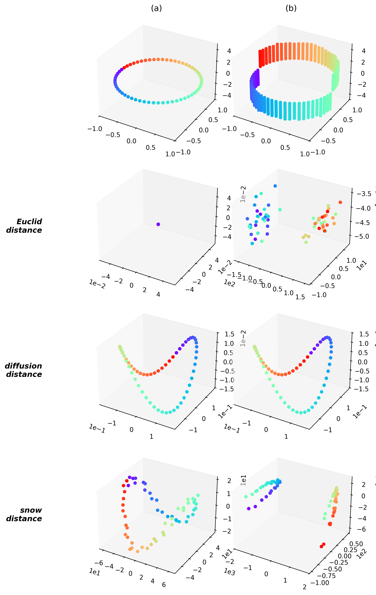

Example 2 의 Gaussian ring ($n=60$, $y=\pm3$) 위에서 눈량을 $b_t \sim \mathrm{Uniform}(0, 0.05)$ 로 랜덤 추출하며 $\tau = 10^{10}$ (100억) 까지 돌려 보았다. 아래는 원본 세팅이다.

$\tau$ 가 작을 때는 초기 신호 $y = \pm 3$ 의 차이가 지배적이라 사실상 유클리드 거리만 본다. (b) cylinder 에서 두 덩어리가 직선으로 갈라져 있을 뿐이다.

눈이 쌓이면서 그래프 구조가 슬슬 섞여 들어온다. 링이 드러나기 시작하지만 아직 끊겨 있고, cylinder 쪽은 두 클러스터가 각각 반원으로 펼쳐지는 — 신호와 그래프가 공존하는 과도기다.

$\tau$ 를 충분히 키우면 에르고딕 평균이 초기 신호를 씻어낸다. thin ring 이든 cylinder 든 결국 **같은 완전한 링**으로 수렴한다. 이 극한 거리는 $\mathbf{y}$ 와 무관하고 오직 그래프 구조만 반영하는 비유클리드 거리다.

전체 애니메이션 ($\tau: 10^2 \to 10^{10}$, 로그 스케일 300 프레임):

한 줄로 정리하면: **유클리드 → 잘린 링 (혼합) → 그래프-only 링.** 이론이 예고한 전이 ($\overline{\mathrm{SD}}^2 \to c_{ij}$, $c_{ij}$ 는 $\mathbf{y}$-무관 그래프 상수) 를 100억 스텝 스케일에서 눈으로 확인한 셈이다.

소스: [`260430_예제2재현_tau애니메이션_unifb.py`](../260430_예제2재현_tau애니메이션_unifb.py).
