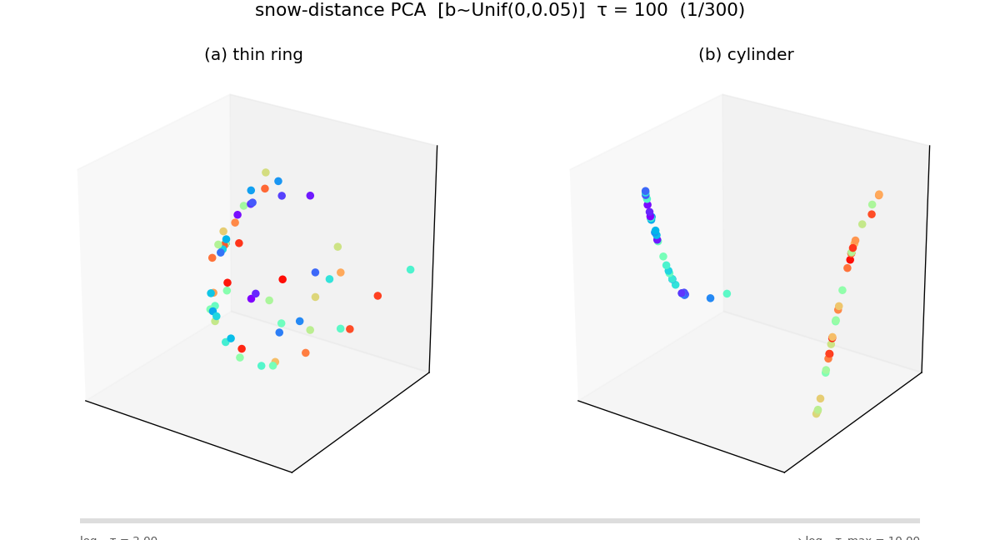
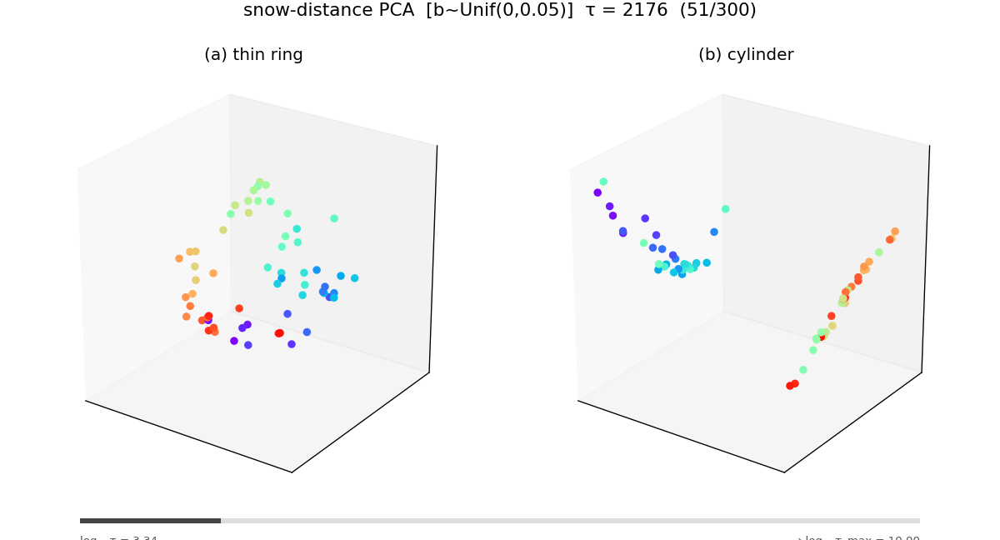
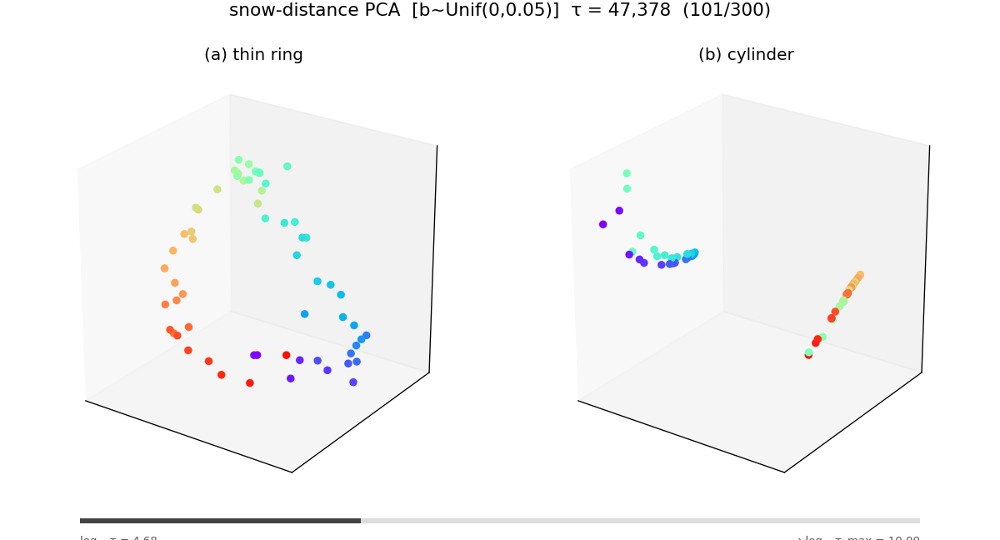
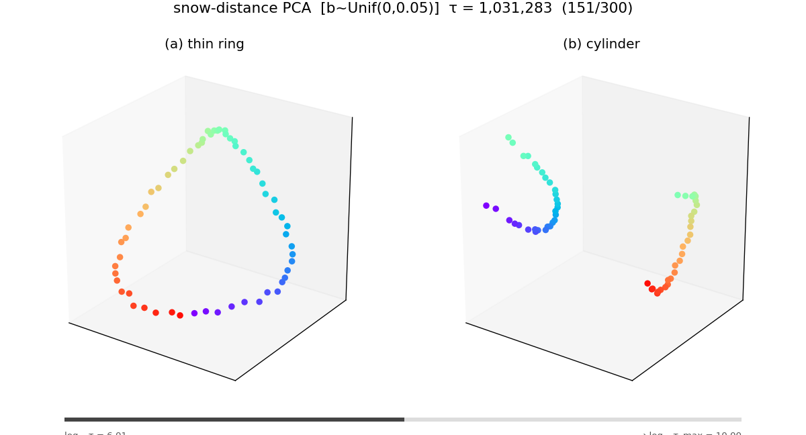
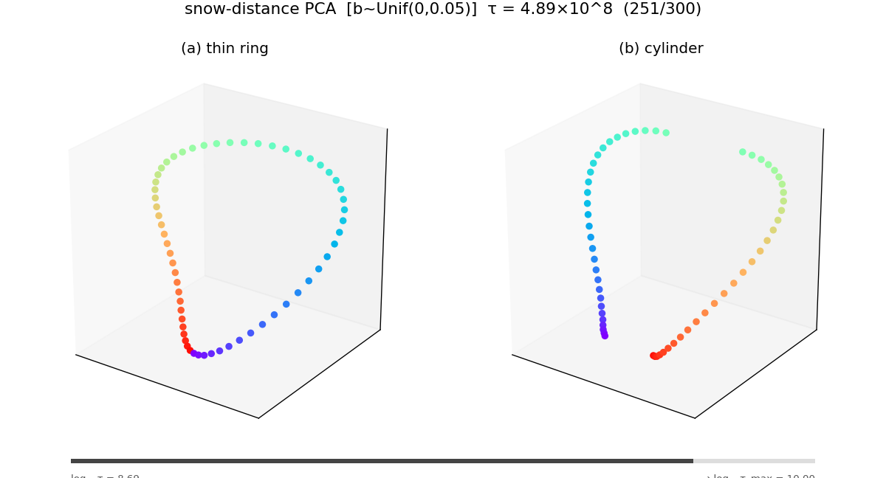
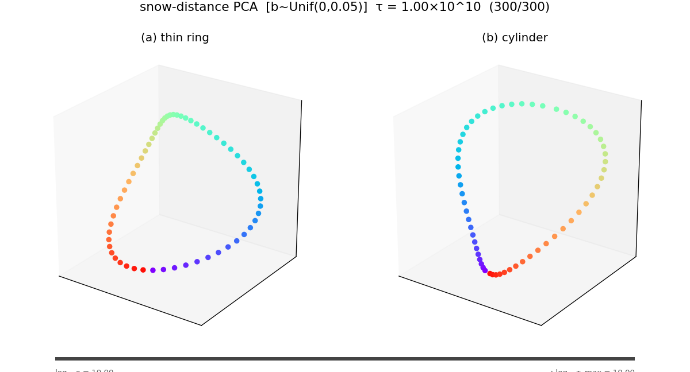
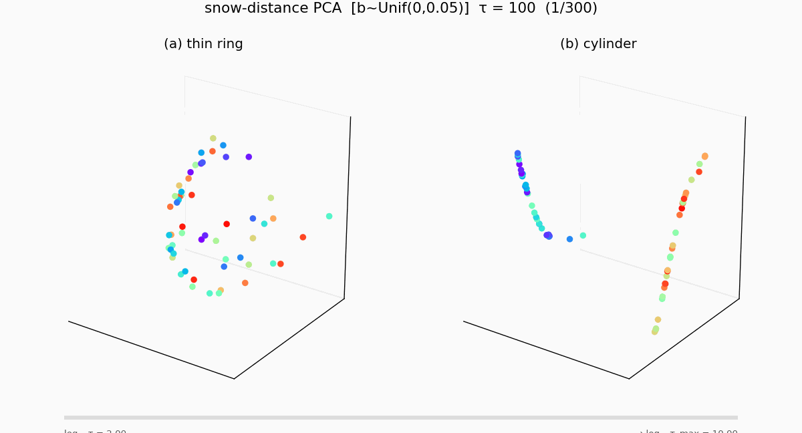

# 0. 한 줄 요약

> Example 2 의 snow-distance 임베딩을 $\tau = 10^{10}$ (100억) 까지 돌리면, **Euclidean 거리 → 잘린 링 (신호+그래프 혼합) → 순수 그래프 거리** 의 3단계 전이가 깨끗하게 관찰된다.

---

# 1. 세팅

[260424_예제2재현.py](../260424_예제2재현.py) 의 Gaussian ring ($n = 60$, $y = \pm 3$) 을 그대로 사용하되, 눈량을 매 스텝 $b_t \sim \mathrm{Uniform}(0,\, 0.05)$ 로 랜덤 추출하는 변형 ([260430_예제2재현_tau애니메이션_unifb.py](../260430_예제2재현_tau애니메이션_unifb.py)).

$\tau$ 를 $10^2$ 에서 $10^{10}$ 까지 로그 스케일 300 프레임으로 체크포인트를 찍고, 각 시점의 $\overline{\mathrm{SD}}^2(\tau)$ 행렬을 PCA-3D 임베딩하여 애니메이션으로 만들었다.

---

# 2. 세 단계

## Phase I — 유클리드 지배 ($\tau \lesssim 10^3$)

초반에는 눈이 충분히 쌓이지 않아 초기 신호 $y = \pm 3$ 의 차이가 지배적이다. (b) cylinder 패널에서 두 클러스터가 직선으로 분리 — 사실상 $|y_i - y_j|^2$ 만 보는 것과 같다.

*$\tau = 100$. 노이즈가 심하고 Euclidean 분리만 보인다.*

*$\tau \approx 2{,}000$. 여전히 신호 차이가 지배.*

## Phase II — 잘린 링 ($\tau \sim 10^4 \text{–} 10^6$)

눈이 쌓이면서 그래프 구조 정보가 섞여 들어온다. (a) thin ring 에서 링이 드러나기 시작하지만 아직 끊겨 있고, (b) cylinder 에서는 두 클러스터 사이에 ring substructure 가 나타나면서 "잘린 링" 형태가 된다. 신호와 그래프 정보가 **공존**하는 과도기.

*$\tau \approx 47{,}000$. (a) 에서 ring 이 드러나기 시작.*

*$\tau \approx 10^6$. (b) 의 두 클러스터가 각각 반원으로 펼쳐진다.*

## Phase III — 그래프 지배 ($\tau \gtrsim 10^8$)

$\tau$ 가 충분히 커지면 에르고딕 평균이 초기 신호를 씻어낸다. (a) thin ring 도 (b) cylinder 도 결국 **같은 완전한 링**으로 수렴한다. 이 극한 거리는 신호 $\mathbf y$ 에 무관하고 오직 $\mathbf W$ 의 그래프 구조만 반영 — 비유클리드 거리다.

*$\tau \approx 5 \times 10^8$. 거의 닫힌 링.*

*$\tau = 10^{10}$. (a) 와 (b) 모두 완전한 링으로 수렴.*

---

# 3. 애니메이션

전체 300 프레임 ($\tau: 10^2 \to 10^{10}$, 로그 스케일) 애니메이션:

---

# 4. 요약

$$
\underbrace{\text{Euclidean}}_{\tau \,\lesssim\, 10^3}
\;\longrightarrow\;
\underbrace{\text{잘린 링 (혼합)}}_{\tau \,\sim\, 10^4 \text{–} 10^6}
\;\longrightarrow\;
\underbrace{\text{Graph-only 링}}_{\tau \,\gtrsim\, 10^8}
$$

이론적으로 예고된 전이 — $\overline{\mathrm{SD}}^2(\tau) \xrightarrow{\tau \to \infty} c_{ij}$ 에서 $c_{ij}$ 가 $\mathbf y$ 와 무관한 그래프 상수로 수렴 ([수렴 증명](260426_c05541.html)) — 를 $\tau = 10^{10}$ 스케일에서 눈으로 확인한 것이다.

소스: [`260430_예제2재현_tau애니메이션_unifb.py`](../260430_예제2재현_tau애니메이션_unifb.py). 캐시: [`results/numeric/260430_예제2재현_tau애니메이션_unifb.py/`](../results/numeric/260430_예제2재현_tau애니메이션_unifb.py/).
