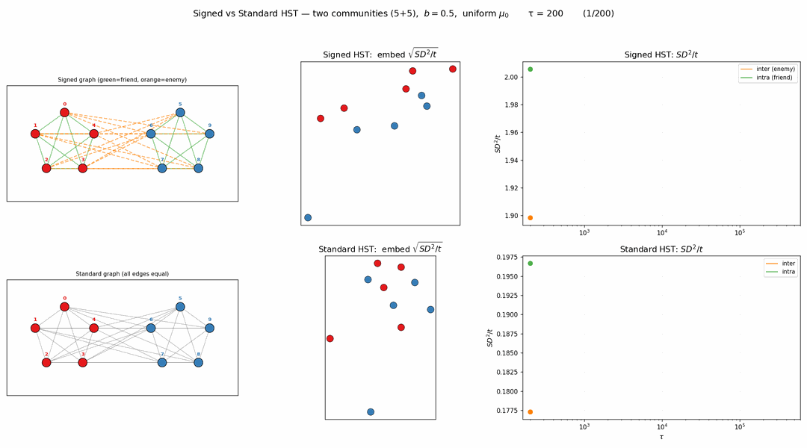

# 동기

그래프에서 엣지가 모두 "우호적"인 것은 아니다. 소셜 네트워크에서 적대 관계(enemy), 신뢰-불신 관계 등 **signed graph**가 자연스럽다. HST의 snow flow 메커니즘을 signed graph로 확장하면 어떻게 될까?

# Signed HST: Repulsive Flow Rule

기존 HST의 flow rule을 부호에 따라 분기한다:

- **Positive edge (우호)**: 기존과 동일. 높은 곳 → 낮은 곳으로 눈이 흐름 (smoothing)
- **Negative edge (적대)**: **반대 방향** — 낮은 곳 → 높은 곳으로 눈이 흐름 (amplifying)

직관: "적이 잘되면(눈이 높으면) 더 쌓아준다" — 높이 차이를 증폭.

# 실험: Two-Community Graph (5+5)

- 노드 10개: community A (5개, 빨강), community B (5개, 파랑)
- Intra-community 엣지: positive (초록 실선)
- Inter-community 엣지: negative (주황 점선)

**Signed HST vs Standard HST** 비교:

# 관찰

## Signed HST (위)

- **inter-community SD²/t 가 발산** (주황) — 적대 엣지의 repulsive flow가 두 커뮤니티 간 높이 차이를 계속 증폭
- **intra-community SD²/t 는 수렴** (초록) — 같은 커뮤니티 내에서는 정상적으로 smoothing
- 2D 임베딩에서 **빨강 vs 파랑이 극명하게 분리**

## Standard HST (아래)

- inter와 intra SD²/t **모두 비슷한 수준에서 수렴** — 부호 정보 없으면 커뮤니티 구분 불가
- 임베딩에서 빨강/파랑이 **섞여있음**

# 의미

Signed HST의 repulsive flow는 자연스러운 **community detection** 메커니즘이 된다.

- 적대 엣지에서 높이 차이가 증폭 → SD 거리가 커뮤니티 경계를 드러냄
- Standard HST로는 보이지 않는 signed structure를 Signed HST가 포착

이건 balance theory (Harary)와도 연결될 수 있다 — balanced signed graph에서는 노드가 정확히 2그룹으로 나뉘고, Signed HST의 SD 거리가 이 partition을 recover하는 셈.
