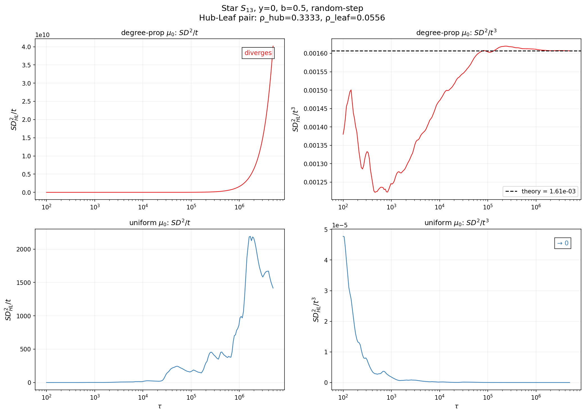
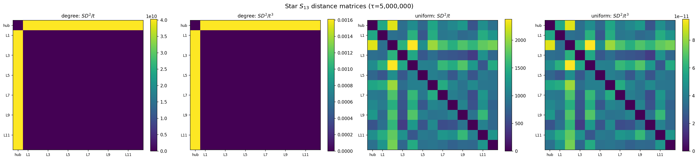
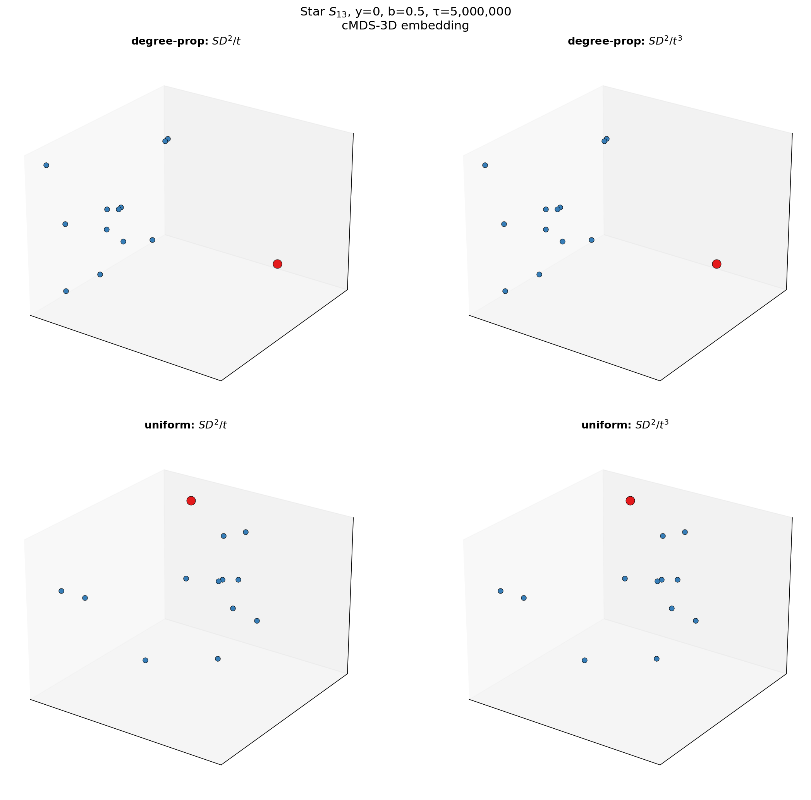

Snow distance $SD^2_{ij}(t) = \sum_{s=0}^t (h_i(s) - h_j(s))^2$ 가 항상 수렴하는 건 아니다. 초기분포 $\mu_0$에 따라 두 가지 regime이 존재한다.

각 노드의 장기 적립률을 $\rho_i = \lim_{t\to\infty} \frac{1}{t}\sum_{s=1}^t \mathbf{1}\{X_s = v_i\}$ 라 하자. 모든 노드에 눈이 균등하게 쌓이면 ($\rho_i = 1/n$) **balanced**, 아니면 **drift**.

`-` **Balanced** ($\rho_i = 1/n$): $SD^2/t$ 가 유한 상수로 수렴. 극한은 그래프-신호 상호작용을 반영.

`-` **Drift** ($\rho_i \neq \rho_j$): $SD^2/t$ 는 발산. 대신 $SD^2/t^3$ 이 수렴한다:

$$\frac{SD^2_{ij}(t)}{t^3} \;\to\; \frac{\bar{b}^2(\rho_i - \rho_j)^2}{3}$$

증명은 간단하다. $\rho_i \neq \rho_j$이면 높이 차이가 선형으로 벌어진다: $h_i(t) - h_j(t) \approx \bar{b}(\rho_i - \rho_j) \cdot t$. 이걸 제곱해서 더하면 $\sum s^2 \sim t^3/3$. 끝. 강대수법칙 하나로 된다.

regime을 결정하는 건 $\mu_0$이다. 정규 그래프에서는 degree-proportional이든 uniform이든 $\rho_i = 1/n$이라 balanced. 비정규 그래프에서 degree-proportional $\mu_0$를 쓰면 높은 차수 노드에 눈이 더 자주 쌓여서 drift에 빠진다.

Star $S_{13}$으로 검증해보았다. $y=0$, $b=0.5$, 500만 스텝.

`-` degree-prop $\mu_0$: hub $\rho=0.33$, leaf $\rho=0.056$ → drift. $M(t)$가 34만까지 선형 발산.

`-` uniform $\mu_0$: 모든 노드 $\rho=1/13=0.077$ → balanced. $M(t)$가 100 근처에서 bounded.

degree-prop (위 빨강)에서 $SD^2/t$는 발산하지만 $SD^2/t^3$은 이론값 $1.607 \times 10^{-3}$으로 수렴. uniform (아래 파랑)에서는 $SD^2/t$가 수렴하고 $SD^2/t^3$은 0으로 간다.

heatmap으로 보면 구조 차이가 더 명확하다:

degree-prop의 $SD^2/t$는 $10^{10}$ 스케일로 발산 — hub 행/열만 노랗다 (hub-leaf 거리가 지배). uniform의 $SD^2/t$는 수천 스케일에서 leaf-leaf 간 변화도 풍부하게 담긴다.

cMDS-3D 임베딩:

degree-prop은 hub이 leaves에서 멀리 떨어져 있을 뿐 — $\rho$ 차이가 지배해서 구조가 단순. uniform은 hub과 leaves 사이에 더 풍부한 상호작용이 보인다.

결국 두 regime 모두 $\tau \to \infty$에서 초기 신호 $\mathbf{y}$는 씻겨나간다. 차이는 **어떤 그래프 정보가 남느냐**: balanced는 flow/block dynamics의 세밀한 구조, drift는 단순히 적립률 격차.
