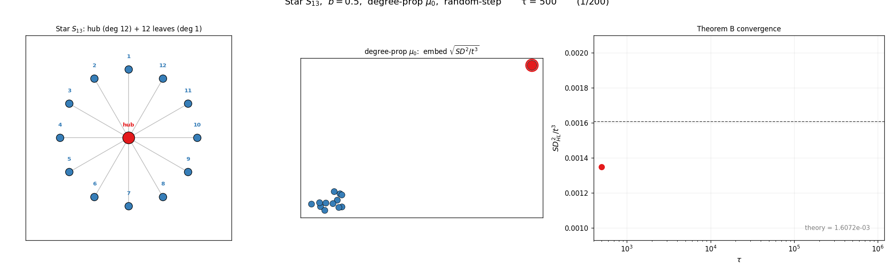
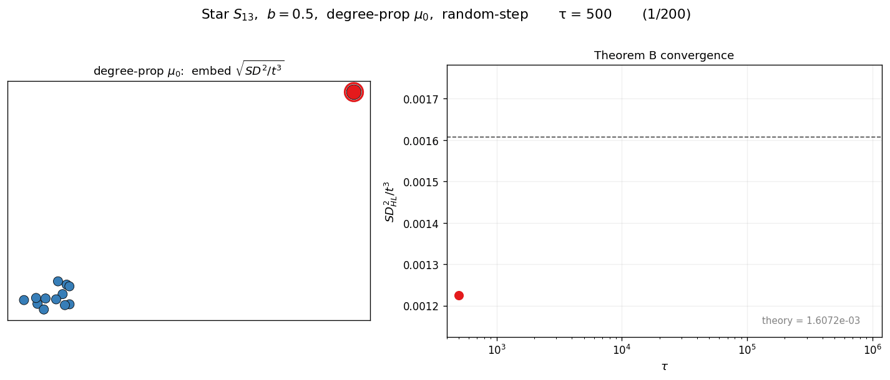
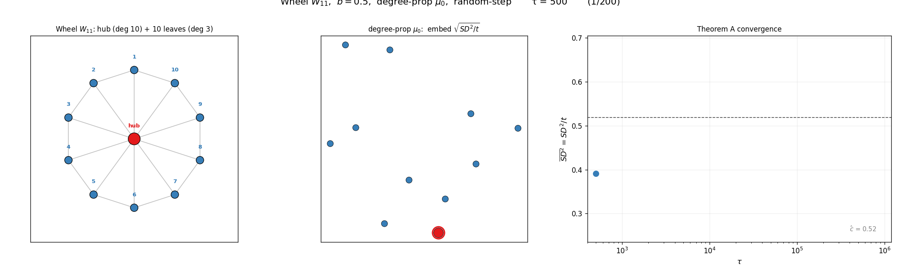
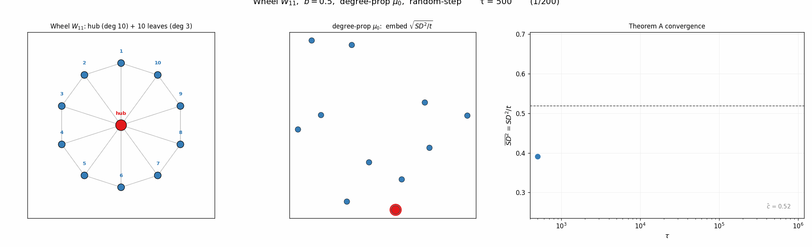
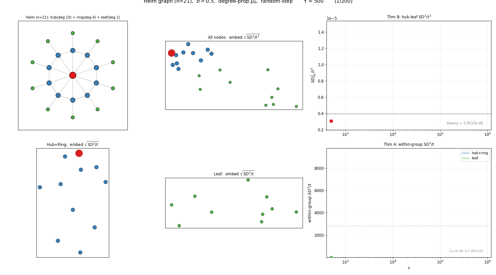

Snow distance $SD^2_{ij}(t) = \sum_{s=0}^t (h_i(s) - h_j(s))^2$ 가 항상 수렴하는 건 아니다. 초기분포 $\mu_0$에 따라 두 가지 regime이 존재한다.

각 노드의 장기 적립률을 $\rho_i = \lim_{t\to\infty} \frac{1}{t}\sum_{s=1}^t \mathbf{1}\{X_s = v_i\}$ 라 하자. 모든 노드에 눈이 균등하게 쌓이면 ($\rho_i = 1/n$) **balanced**, 아니면 **drift**.

`-` **Balanced** ($\rho_i = 1/n$): $SD^2/t$ 가 유한 상수로 수렴. 극한은 그래프-신호 상호작용을 반영.

`-` **Drift** ($\rho_i \neq \rho_j$): $SD^2/t$ 는 발산. 대신 $SD^2/t^3$ 이 수렴한다:

$$\frac{SD^2_{ij}(t)}{t^3} \;\to\; \frac{\bar{b}^2(\rho_i - \rho_j)^2}{3}$$

**Drift regime 증명.** 노드 $v_i$의 누적 높이는

$$h(v_i, t) = h(v_i, 0) + \sum_{s=1}^t b'_s \cdot \mathbf{1}\{X_s = v_i\}$$

여기서 $b'_s \sim \mathrm{Unif}(0, b)$는 매 스텝의 눈량이고 $X_s$는 눈이 쌓이는 노드이다. $b'_s$와 $X_s$는 독립이므로 합을 분리할 수 있다:

$$\sum_{s=1}^t b'_s \cdot \mathbf{1}\{X_s = v_i\} = \bar{b}\sum_{s=1}^t \mathbf{1}\{X_s = v_i\} + \sum_{s=1}^t (b'_s - \bar{b})\cdot\mathbf{1}\{X_s = v_i\}$$

첫째 항: $\rho_i$의 정의에 의해 $\frac{1}{t}\sum \mathbf{1}\{X_s = v_i\} \to \rho_i$ (a.s.)이므로 $\bar{b}\rho_i \cdot t$ 로 성장.

둘째 항은 마팅게일 강대수법칙으로 처리한다. $M_t^{(i)} := \sum_{s=1}^t (b'_s - \bar{b}) \cdot \mathbf{1}\{X_s = v_i\}$ 라 놓으면, $b'_s - \bar{b}$는 평균 0이고 $\mathcal{F}_{s-1}$ (시점 $s-1$까지의 정보)과 독립이므로

$$\mathbb{E}[M_t^{(i)} - M_{t-1}^{(i)} \mid \mathcal{F}_{t-1}] = \mathbb{E}[(b'_t - \bar{b}) \mid \mathcal{F}_{t-1}] \cdot \mathbf{1}\{X_t = v_i\} = 0$$

즉 $\{M_t^{(i)}\}$는 마팅게일이다. 마팅게일 강대수법칙은 **각 증분의 분산이 bounded이면 $M_t/t \to 0$ a.s.** 를 말한다. 정확히는:

> $\{M_t\}$가 마팅게일이고 $\sum_{t=1}^\infty \frac{\mathrm{Var}(M_t - M_{t-1})}{t^2} < \infty$ 이면 $\frac{M_t}{t} \to 0$ a.s.

우리 경우 $\mathrm{Var}(M_t^{(i)} - M_{t-1}^{(i)}) = \mathrm{Var}((b'_t - \bar{b}) \cdot \mathbf{1}\{X_t = v_i\}) \leq \mathrm{Var}(b'_t) = b^2/12$ 로 상수에 bounded. $\sum_{t=1}^\infty \frac{b^2/12}{t^2} < \infty$ ($p$-급수, $p=2$) 이므로 조건이 만족되어 $M_t^{(i)}/t \to 0$ a.s., 즉 둘째 항은 $o(t)$.

따라서 두 노드의 높이 차이는

$$h(v_i, t) - h(v_j, t) = \bar{b}(\rho_i - \rho_j)\cdot t + o(t)$$

이걸 제곱해서 더하면:

$$SD^2_{ij}(t) = \sum_{s=0}^t \left[\bar{b}(\rho_i - \rho_j)\cdot s + o(s)\right]^2 = \bar{b}^2(\rho_i - \rho_j)^2 \sum_{s=0}^t s^2 + \text{(작은 항들)}$$

주항에서 $\sum_{s=0}^t s^2 = \frac{t(t+1)(2t+1)}{6} \sim \frac{t^3}{3}$ 이고, 나머지 교차항 $\sum s \cdot o(s)$과 잔차항 $\sum o(s)^2$은 모두 $o(t^3)$이다. $t^3$으로 나누면:

$$\frac{SD^2_{ij}(t)}{t^3} \;\to\; \frac{\bar{b}^2(\rho_i - \rho_j)^2}{3} \qquad \square$$

---

regime을 결정하는 건 $\mu_0$이다. 정규 그래프에서는 degree-proportional이든 uniform이든 $\rho_i = 1/n$이라 balanced. 비정규 그래프에서 degree-proportional $\mu_0$를 쓰면 높은 차수 노드에 눈이 더 자주 쌓여서 drift에 빠진다.

세 가지 비정규 그래프로 검증해보았다. 모두 degree-proportional $\mu_0$를 사용하고, 100만 스텝 시뮬레이션으로 $SD^2/t^3$이 이론값(점선)으로 수렴하는 과정을 확인한다.

### 예제 1: Star $S_{13}$

hub의 degree는 12, leaf는 1이다. degree-proportional $\mu_0$를 쓰면 $\mu_0(\text{hub}) = 12/24 = 0.5$로 hub에 reset이 집중된다. 시뮬레이션에서 $\hat{\rho}_{\text{hub}} = 0.33$, $\hat{\rho}_{\text{leaf}} = 0.056$. $\mu_0 = 0.5$와 다른 이유는 block/flow dynamics가 적립을 재분배하기 때문이다. 어쨌든 $\rho$가 균등하지 않으므로 drift regime.

### 예제 2: Wheel $W_{11}$

Wheel = Star + outer cycle. hub의 degree는 10, leaf는 3이다. $\mu_0(\text{hub}) = 10/40 = 0.25$로 Star보다 집중도가 낮지만, leaf 간에 outer cycle이 추가되어 flow dynamics가 달라진다. 여전히 비정규이므로 drift regime.

### 예제 3: Helm (n=21) — two regime

Helm = Wheel + pendant leaves. 세 종류의 노드가 있다: hub (deg 10), ring (deg 4), pendant leaf (deg 1). $\mu_0$는 hub $= 0.167$, ring $= 0.067$, leaf $= 0.017$로 세 단계 격차가 생긴다. Helm은 **두 regime이 공존**하는 흥미로운 예이다:

`-` **그룹 간** (hub-leaf): $\rho$가 다르므로 drift regime. $SD^2/t^3$이 이론값으로 수렴 (Row 1 우측).

`-` **그룹 내** (hub+ring끼리, leaf끼리): 같은 그룹 안에서는 $\rho$ 격차가 작아 $SD^2/t$가 유한 상수로 수렴 — balanced regime의 세밀한 구조가 남는다 (Row 2).

---

결국 두 regime 모두 $\tau \to \infty$에서 초기 신호 $\mathbf{y}$는 씻겨나간다. 차이는 **어떤 그래프 정보가 남느냐**: balanced는 flow/block dynamics의 세밀한 구조, drift는 단순히 적립률 격차.
