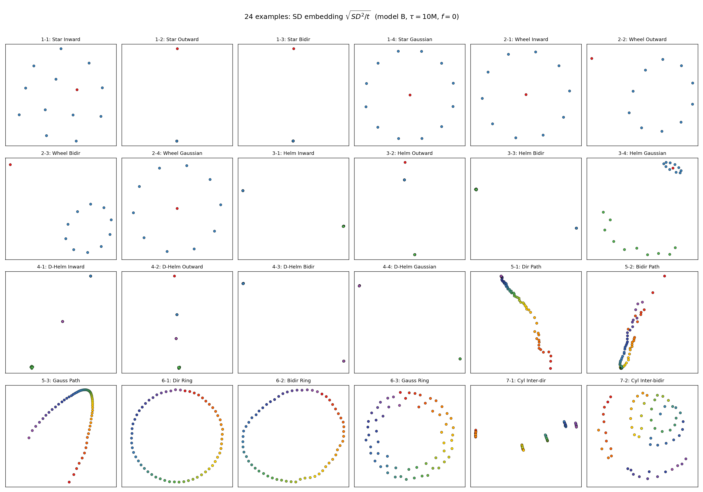
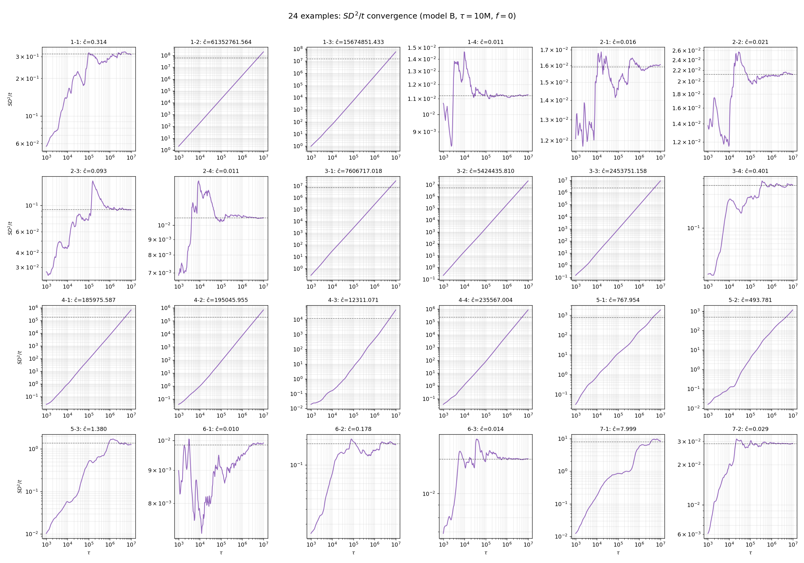
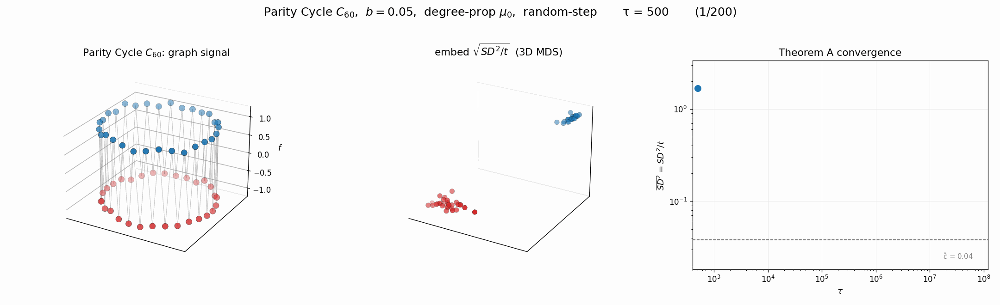
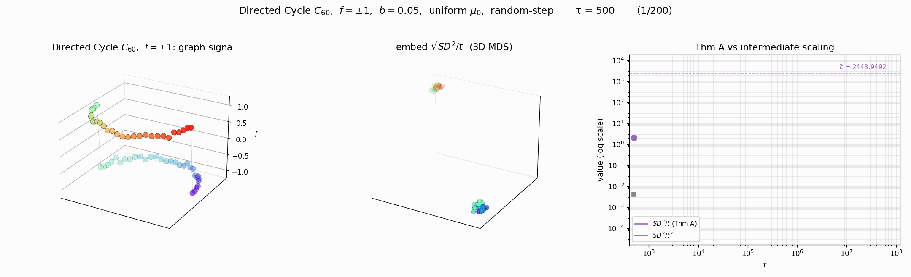
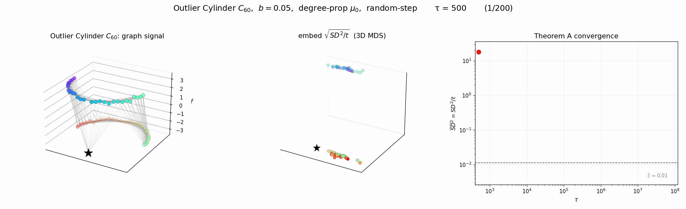
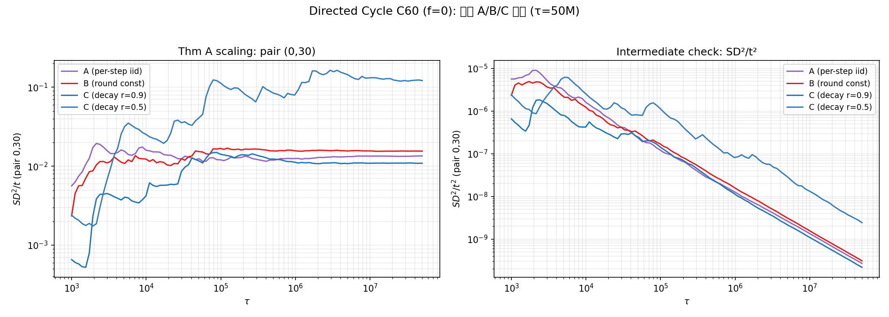

각 노드의 장기 적립률을 $\rho_i = \lim_{t\to\infty} \frac{1}{t}\sum_{s=1}^t \mathbf{1}\{X_s = v_i\}$ 라 하자. $\rho$가 균등한지 여부에 따라 SD의 스케일링이 달라진다.

`-` **Thm A — Balanced** ($\rho_i = 1/n$): $SD^2/t \to c$ (유한 상수). 극한은 그래프-신호 상호작용을 반영.

`-` **Thm B — Drift** ($\rho_i \neq \rho_j$): $SD^2/t \to \infty$. 대신 $\frac{SD^2_{ij}(t)}{t^3} \to \frac{\bar{b}^2(\rho_i - \rho_j)^2}{3}$.

본 글은 두 부분으로 나뉜다. **A 그래프 구조 검증** ($f=0$, 24개 예제) 에서는 그래프 모양·엣지 방향이 regime 분류에 미치는 영향을, **B 신호 변형 검증** ($f \neq 0$, 3개 예제) 에서는 초기 신호의 효과를 본다.

## A. 그래프 구조 검증 ($f = 0$)

[「그래프 도메인에서의 거리」](./260516_연구_HST_그래프도메인에서의거리.html) 에서 정의한 24개 테스트 그래프 (7 모양 × 변형) 에 대해 $f = 0$ 으로 두고 HST 시뮬을 수행했다. 예제 네이밍은 거리 블로그와 동일 (1-1 ~ 7-2). 시뮬 설정: $b = 0.05$, $T_{\max} = 20$, $\tau = 10^7$, seed=42, **모델 B random-step variant**, degree-prop $\mu_0$.

`-` 모양 1 — Star ($n=13$): 1-1 Inward / 1-2 Outward / 1-3 Bidir / 1-4 Gaussian
`-` 모양 2 — Wheel ($n=11$): 4변형
`-` 모양 3 — Helm ($n=21$): 4변형
`-` 모양 4 — Double Helm ($n=31$): 4변형
`-` 모양 5 — Path ($n=60$): 5-1 Directed / 5-2 Bidir / 5-3 Gaussian
`-` 모양 6 — Ring ($n=60$): 3변형
`-` 모양 7 — Cylinder ($n=60$): 7-1 Inter-dir / 7-2 Inter-bidir

### A.1 SD 임베딩

각 그래프에서 시뮬 후 $\sqrt{SD^2_{ij}/\tau}$ 의 2D MDS 임베딩.

### A.2 $SD^2/t$ 수렴 곡선 (log-log)

같은 24 예제의 $\overline{SD^2/t}$ (off-diagonal 평균) 를 $\tau$ 에 대해 log-log plot. 수렴하면 수평선, 발산하면 양의 기울기.

### A.3 Regime 분류

| 예제 | $\hat c$ | 예제 | $\hat c$ | 예제 | $\hat c$ | 예제 | $\hat c$ |
|---|---|---|---|---|---|---|---|
| 1-1 Star Inward | $0.31$ ⚠ | 2-1 Wheel In | $0.016$ ✓ | 3-1 Helm In | $7.6\times10^{6}$ ❌ | 4-1 D-Helm In | $1.9\times10^{5}$ ❌ |
| 1-2 Star Outward | $6.1\times10^{7}$ ❌ | 2-2 Wheel Out | $0.021$ ✓ | 3-2 Helm Out | $5.4\times10^{6}$ ❌ | 4-2 D-Helm Out | $2.0\times10^{5}$ ❌ |
| 1-3 Star Bidir | $1.6\times10^{7}$ ❌ | 2-3 Wheel Bidir | $0.093$ ✓ | 3-3 Helm Bidir | $2.5\times10^{6}$ ❌ | 4-3 D-Helm Bidir | $1.2\times10^{4}$ ❌ |
| 1-4 Star Gauss | $0.011$ ✓ | 2-4 Wheel Gauss | $0.011$ ✓ | 3-4 Helm Gauss | $0.40$ ⚠ | 4-4 D-Helm Gauss | $2.4\times10^{5}$ ❌ |
| 5-1 Dir Path | $768$ ❌ | 6-1 Dir Ring | $0.0098$ ✓ | 7-1 Cyl Inter-dir | $8.0$ ⚠ | | |
| 5-2 Bidir Path | $494$ ❌ | 6-2 Bidir Ring | $0.18$ ✓ | 7-2 Cyl Inter-bidir | $0.029$ ✓ | | |
| 5-3 Gauss Path | $1.4$ ⚠ | 6-3 Gauss Ring | $0.014$ ✓ | | | | |

`-` ✓ = balanced (Thm A 성립). `-` ❌ = drift (Thm B, $SD^2/t$ 발산하니 실제는 $SD^2/t^3$ 수렴). `-` ⚠ = 중간/약발산.

`-` **Wheel 의 4 변형 모두 balanced**: outer cycle 이 차수 격차를 완화해서 $\rho_i \approx 1/n$. 엣지 방향(In/Out/Bidir)과 가중치 종류(Gaussian)와 무관.

`-` **Star/Helm/D-Helm 의 directed/bidir 변형은 모두 drift**: hub 가 reset 을 집중적으로 받아 $\rho_{\text{hub}} \gg \rho_{\text{leaf}}$.

`-` **6-1 Directed Ring**: doubly stochastic 이라 비대칭임에도 $\rho_i = 1/n$ → balanced. 「비대칭 그래프에서도 Thm A」 라는 비자명한 결론.

`-` **Gaussian kernel** 은 정규 그래프(Wheel, Ring)에서 차수 격차를 완화하지만, hub-leaf 격차가 큰 그래프(Helm/D-Helm)에서는 충분치 않다.

`-` **Cylinder 7-1 (inter-dir)** 은 ring 사이 단방향 결합으로 ring별 적립률 격차 → 약한 drift. **7-2 (inter-bidir)** 은 정규 → balanced.

## B. 신호 변형 검증 ($f \neq 0$)

§A의 그래프 중 일부 위에 초기 신호를 얹어 Thm A 가 신호-그래프 상호작용을 어떻게 반영하는지 본다. 모두 balanced regime 그래프 위에서.

### B.1 Parity Cycle $C_{60}$ — $f_i = (-1)^i$

§A 6-2 Bidir Ring 과 동일한 양방향 cycle. 신호는 Nyquist 주파수. 이웃끼리 신호가 반대이므로 block 이 자주 발생한다.

### B.2 Directed Cycle $C_{60}$ — $f = \pm 1$

§A 6-1 Dir Ring 위에 반원 경계 $\pm 1$ 신호. $f \neq 0$ 이면 매 시점 $(h_i - h_j)^2$ 에 초기 신호 차이 $(f_i - f_j)^2$ 가 상수항으로 누적되어 $SD^2/t$ 가 큰 값에서 수렴 (scaling 자체는 Thm A 그대로).

### B.3 Outlier Cylinder

§A 7-2 Cyl Inter-bidir 와 비슷한 cylinder 구조 (Gaussian kernel, 위=-3, 아래=+3) 에서 +3 그룹 정중앙 한 노드만 -3 으로 flip. 정규 → balanced. 국소적 outlier 가 SD 임베딩에서 어떻게 분리되는지.

---

결국 두 regime 모두 $\tau \to \infty$ 에서 초기 신호 $\mathbf{y}$ 는 씻겨나간다. 차이는 **어떤 그래프 정보가 남느냐**: balanced 는 flow/block dynamics 의 세밀한 구조, drift 는 단순히 적립률 격차.

---

## Appendix: random-step variant 모델 정의 민감도

본문의 실제 검증은 random-step variant의 **모델 A** (매 step별 $b'_s \sim \text{Unif}(0,b)$ 추첨, $\mathbb{E}[b'] = b/2$) 가정 위에서 수행되었다. 그런데 "한 라운드 동안 $b'$이 step 수만큼인지, 라운드당 1개인지"에 대한 정의가 코드와 직관 사이에 모호할 수 있다. 후보 모델을 다음과 같이 정리한다.

| 모델 | $b'$ 추첨 시점 | 라운드 내 적립 |
|---|---|---|
| **A** (코드/이론) | 매 step | $b'_s$ 매번 새로 추첨 |
| **B** (round-const) | 라운드 시작 시 1회 | 라운드 동안 같은 $b'$ |
| **C** (감쇠) | 라운드 시작 시 1회 | step $k$에서 $b' \cdot r^k$ ($r<1$) |

추가예제 6 (Directed Cycle $C_{60}$, $f=0$, $b=0.05$, $T_{\max}=20$, $\tau=50\text{M}$, seed=42) 으로 네 가지 모델을 동일 조건에서 비교했다.

| 모델 | 정의 | $SD^2/t$ (pair 0,30) | $SD^2/t^2$ | 비고 |
|---|---|---|---|---|
| A | per-step iid | **0.0135** | $2.7\times 10^{-10}$ | 본문 기준 |
| B | round-const | **0.0155** | $3.1\times 10^{-10}$ | +15% vs A |
| C, $r=0.9$ | 점진 감쇠 | **0.0109** | $2.2\times 10^{-10}$ | $-19\%$ vs A |
| C, $r=0.5$ | 급격 감쇠 | **0.1214** | $2.4\times 10^{-9}$ | 큰 폭 변동 |

### 관찰

1. **Thm A 스케일링은 모델 정의 무관하게 성립**한다. 네 모델 모두 $SD^2/t$는 일정값으로 수렴하고 $SD^2/t^2$는 $0$으로 감소한다. 따라서 추가예제 6의 정성적 결론 ("비대칭 그래프에서도 Thm A 성립") 은 모델 선택에 robust 하다.

2. **$c$ 값의 절댓값은 모델에 민감**하다. A 대비 B는 $+15\%$, C($r=0.9$)는 $-19\%$, C($r=0.5$)는 $\sim 9$배 증폭. 모델 C 의 급감쇠($r=0.5$)는 매 라운드의 첫 step에 적립이 집중되어 노드별 높이 격차가 크게 벌어지는 효과 때문이다.

3. 따라서 본문의 $\hat c \approx 0.0136$ 같은 **수치**는 모델 A 가정에 종속적이지만, "수렴한다"는 **정성**은 모델 정의의 자유도에 영향받지 않는다.

### 비고

이 부록은 모델 A/B/C 가운데 어느 것이 "맞는" 정의인지 결정하지 않는다. 그 판단은 random-step variant 의 물리적 직관, 기존 증명들의 호환성, 그리고 다른 그래프 (Helm, Wheel, Star) 에서의 동일 비교가 필요하다.
