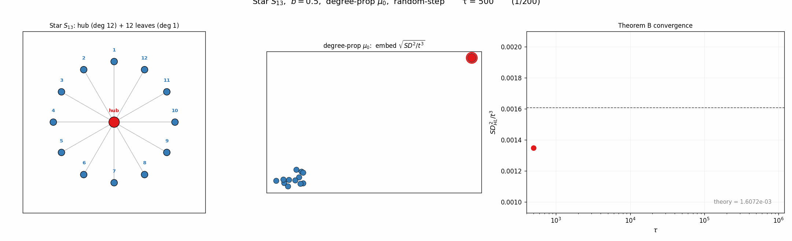
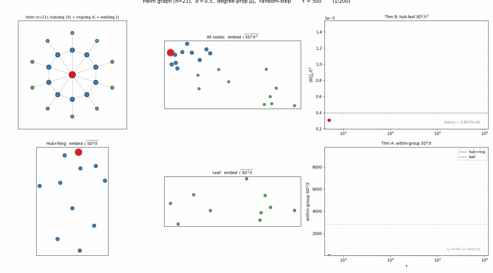

각 노드의 장기 적립률을 $\rho_i = \lim_{t\to\infty} \frac{1}{t}\sum_{s=1}^t \mathbf{1}\{X_s = v_i\}$ 라 하자. $\rho$가 균등한지 여부에 따라 SD의 스케일링이 달라진다.

`-` **Thm A — Balanced** ($\rho_i = 1/n$): $SD^2/t \to c$ (유한 상수). 극한은 그래프-신호 상호작용을 반영.

`-` **Thm B — Drift** ($\rho_i \neq \rho_j$): $SD^2/t \to \infty$. 대신 $\frac{SD^2_{ij}(t)}{t^3} \to \frac{\bar{b}^2(\rho_i - \rho_j)^2}{3}$.

비정규 그래프에서 degree-proportional $\mu_0$를 쓰면 높은 차수 노드에 눈이 더 자주 쌓여 drift에 빠질 수 있다. 세 가지 비정규 그래프로 검증해보았다 (100만 스텝, degree-prop $\mu_0$).

### 예제 1: Star $S_{13}$

hub의 degree는 12, leaf는 1이다. degree-proportional $\mu_0$를 쓰면 $\mu_0(\text{hub}) = 12/24 = 0.5$로 hub에 reset이 집중된다. 시뮬레이션에서 $\hat{\rho}_{\text{hub}} = 0.33$, $\hat{\rho}_{\text{leaf}} = 0.056$. $\mu_0 = 0.5$와 다른 이유는 block/flow dynamics가 적립을 재분배하기 때문이다. 어쨌든 $\rho$가 균등하지 않으므로 drift regime.

### 예제 2: Wheel $W_{11}$

Wheel = Star + outer cycle. hub의 degree는 10, leaf는 3이다. 비정규 그래프이지만, outer cycle 덕분에 눈이 골고루 퍼져서 $\rho_i \approx 1/n$이 된다. 즉 **balanced regime**이고, $SD^2/t$가 유한 상수로 수렴한다 (Thm A).

### 예제 3: Helm (n=21) — two regime

Helm = Wheel + pendant leaves. 세 종류의 노드가 있다: hub (deg 10), ring (deg 4), pendant leaf (deg 1). $\mu_0$는 hub $= 0.167$, ring $= 0.067$, leaf $= 0.017$로 세 단계 격차가 생긴다. Helm은 **두 regime이 공존**하는 흥미로운 예이다:

`-` **그룹 간** (hub-leaf): $\rho$가 다르므로 drift regime. $SD^2/t^3$이 이론값으로 수렴 (Row 1 우측).

`-` **그룹 내** (hub+ring끼리, leaf끼리): 같은 그룹 안에서는 $\rho$ 격차가 작아 $SD^2/t$가 유한 상수로 수렴 — balanced regime의 세밀한 구조가 남는다 (Row 2).

---

결국 두 regime 모두 $\tau \to \infty$에서 초기 신호 $\mathbf{y}$는 씻겨나간다. 차이는 **어떤 그래프 정보가 남느냐**: balanced는 flow/block dynamics의 세밀한 구조, drift는 단순히 적립률 격차.
