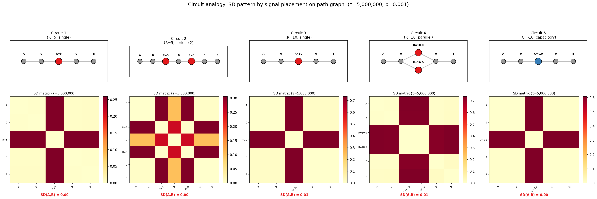

Path graph 위에 신호 $f$를 배치하면 HST의 block dynamics가 **전기회로**처럼 작동한다. 양 끝 A, B ($f=0$) 사이에 높은 신호를 두면 눈의 흐름이 막히고 (저항), 낮은 신호를 두면 눈이 빨려 들어간다 (축전기?).

$b$가 충분히 작으면 초기 신호가 오래 유지되어 block 패턴이 SD에 기록된다. 아래 실험은 $b=0.001$, $\tau=5{,}000{,}000$.

### 회로예제 1: 단일 저항 (R=5)

A — 0 — **5** — 0 — B. 중간에 $f=5$인 노드 하나. 눈이 위에서 아래로 흐르려 할 때 block.

### 회로예제 2: 직렬 저항 (R=5 ×2)

A — 0 — **5** — 0 — **5** — 0 — B. 저항 두 개 직렬. 경로는 길어지지만 저항 총량은?

### 회로예제 3: 큰 저항 (R=10)

A — 0 — **10** — 0 — B. 예제1과 같은 구조에 저항값만 2배.

### 회로예제 4: 병렬 저항 (R=10 ×2)

A — 0 — {**10**, **10**} — 0 — B. 두 경로로 분기. 병렬이면 총 저항이 줄어드는가?

### 회로예제 5: 축전기? (C=−10)

A — 0 — **−10** — 0 — B. 음수 신호. 골짜기로 눈이 빨려 들어간다.

### 결과

| 회로예제 | 구조 | SD(A,B) |
|---|---|---|
| 1 | R=5, single | 0.0042 |
| 2 | R=5, series ×2 | 0.0042 |
| 3 | R=10, single | 0.0120 |
| 4 | R=10, parallel | 0.0130 |
| 5 | C=−10, capacitor | 0.0031 |

`-` 회로예제 1 = 2: 저항 5 하나와 직렬 두 개가 **같은 SD(A,B)**. 경로 길이가 다른데도 block 효과가 동일.

`-` 회로예제 3 > 1: R=10은 R=5보다 SD 약 3배. 저항이 클수록 block 강화 → SD 증가.

`-` 회로예제 4 ≈ 3: 병렬이 단일보다 약간 높음. 우회 경로가 있어도 총 block이 줄지 않음 — 전기회로의 병렬 저항 감소와는 다른 양상.

`-` 회로예제 5 < 1: 음수 신호는 SD를 **줄임**. 골짜기에 눈이 축적되어 A-B 높이 차이가 완화. 축전기 비유가 부분적으로 성립.
