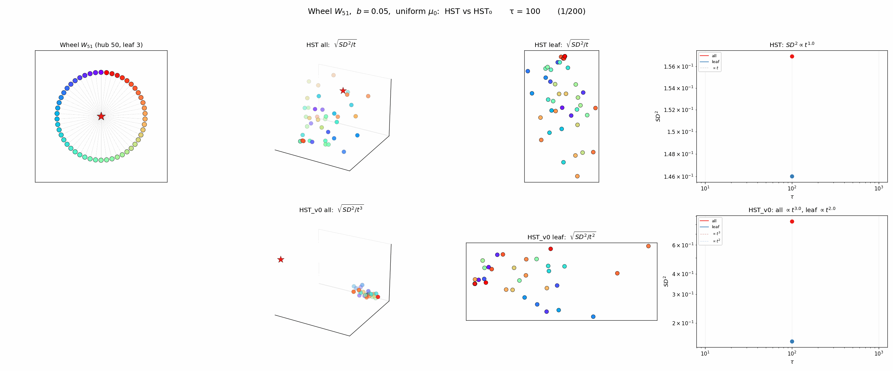

<!-- 소유권자: 소미 | 사용자: 소미 -->

HST의 block/reset 메커니즘이 없으면 어떻게 될까? **HST₀**를 정의하자: 순수 랜덤워크로 이동하고, 도착한 노드에 무조건 눈을 적립. block도 reset도 없다.

Wheel $W_{51}$ (hub deg 50, leaf deg 3) 에서 uniform $\mu_0$, $b=0.05$, $\tau=10^9$ 으로 비교.

### 결과

**HST** (Row 1):

`-` 전체 $SD^2 \propto t^{1.0}$ — **Thm A balanced**. $SD^2/t \to c$ 유한 상수로 수렴.

`-` leaf 임베딩에서 ring 구조가 선명하게 드러남.

**HST₀** (Row 2):

`-` 전체 $SD^2 \propto t^{3.0}$ — **Thm A 실패, Thm C drift regime**. block 이 없어 occupation rate $\rho_i = \pi_i$ (stationary) 가 되고, 이때
$$\frac{SD^2_{ij}}{t^3} \to \frac{\bar{b}^2 (\pi_i - \pi_j)^2}{3}$$
로 $t^3$ 스케일에서 유한 상수 수렴한다. 즉 "발산" 은 어디까지나 Thm A 의미의 발산 ($SD^2/t \to \infty$) 일 뿐, $t^3$ 로 나누면 정상 수렴 — HST₀ 는 [Thm C drift](./260515_41f2b0.html) 의 specific case ($\rho_i = \pi_i$) 다.

`-` leaf끼리만 보면 $SD^2 \propto t^{2.0}$ — 같은 degree leaf 끼리는 $\pi_i = \pi_j$ 라 $(\pi_i - \pi_j)^2$ leading term 이 0, 잔존 $\sqrt{s}$ noise 가 $t^2$ scaling 으로 남는 Thm B intermediate.

`-` 임베딩에서 구조 정보가 사라지고 hub/leaf 분리만 남음 — Resistance 거리 large-$n$ 극한 ($R_{\mathrm{eff}}(i, j) \approx 1/d_i + 1/d_j$, von Luxburg 등 2014) 의 degree-only ultrametric 과 같은 양상.

### 해석

block 메커니즘은 단순히 "수렴 속도"를 높이는 게 아니라, **Thm A/B 의 그래프 구조 정보 보존을 가능하게** 하는 핵심이다. block 이 없으면:

`-` 워커가 stationary $\pi$ 로 수렴하면서 occupation rate 격차 $(\pi_i - \pi_j)^2$ 가 leading term 이 되고

`-` 이 차이가 $t$ 에 누적되어 $SD^2$ 가 $t^3$ 스케일에서 발산 (Thm C)

`-` 그래프의 세밀한 구조 (ring topology 등) 가 두 노드의 stationary 격차에 묻혀 사라짐

HST 의 "높은 곳에서 낮은 곳으로" flow + "갇히면 reset" 메커니즘이 occupation rate 를 균등 ($\rho_i = 1/n$, Thm A) 또는 pair-wise 균등 ($\rho_i = \rho_j$, Thm B) 으로 만들고, 이 두 regime 에서만 그래프-신호 상호작용이 SD 에 기록될 수 있음을 보여준다. HST₀ → HST 의 차이는 SD 가 어느 regime 으로 가느냐 (Thm C drift vs A/B 구조 보존) 의 분기점이다.
