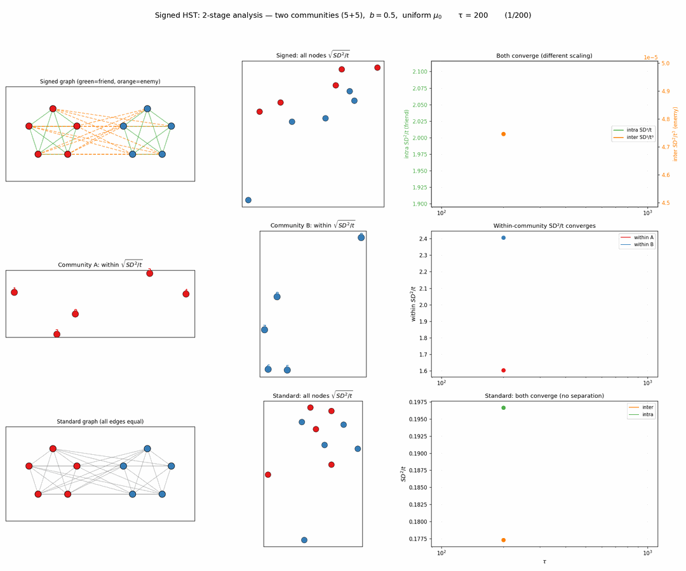
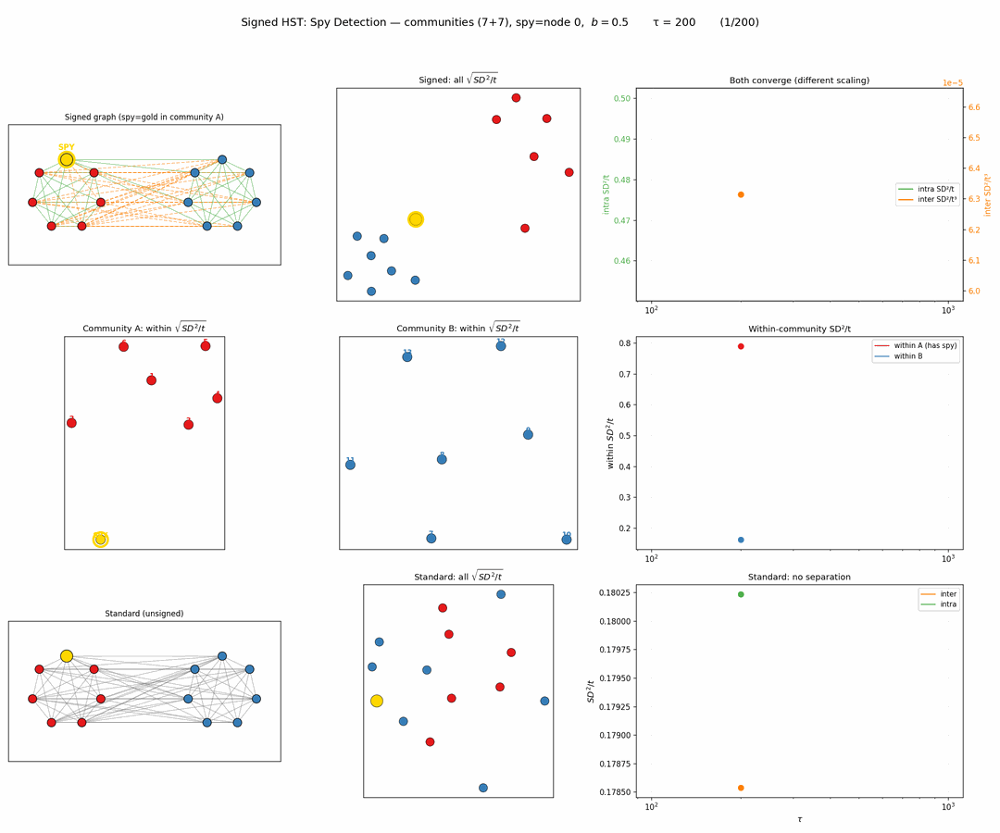
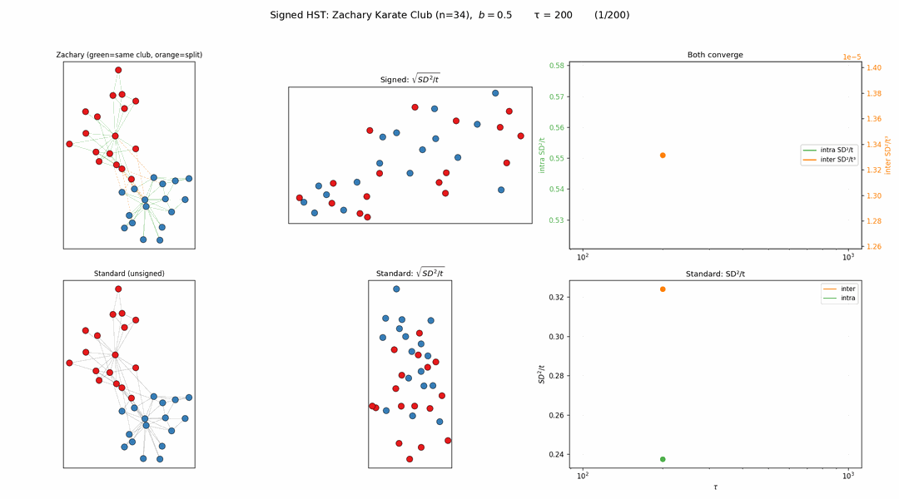
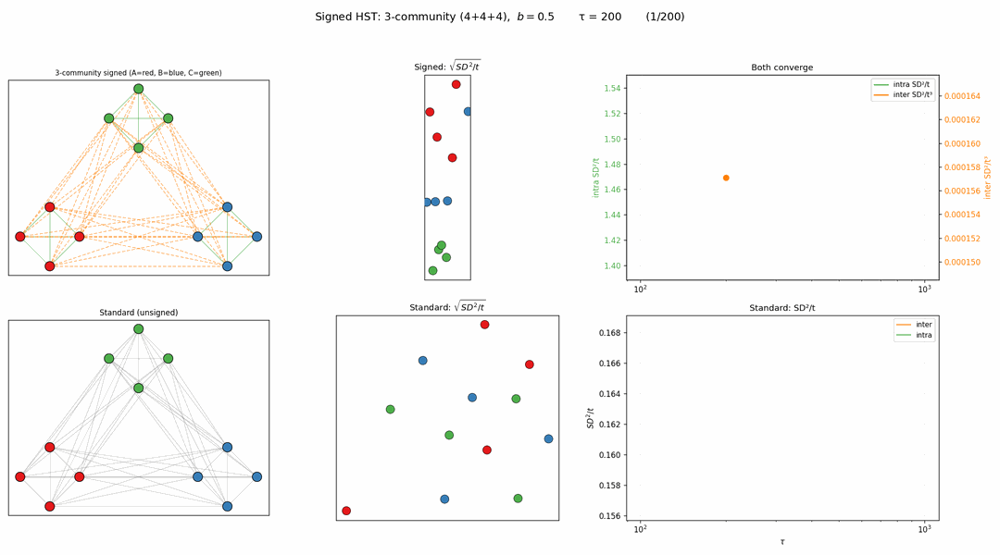
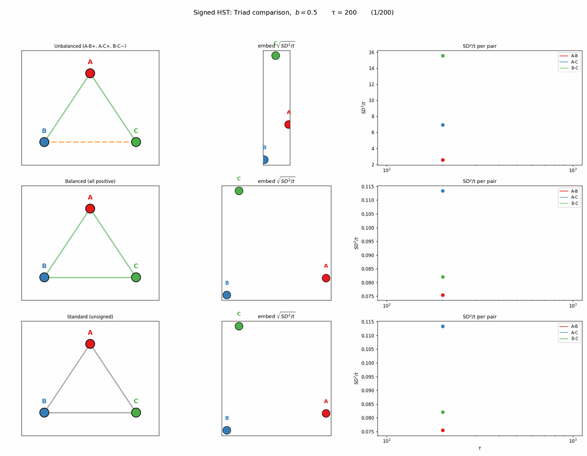
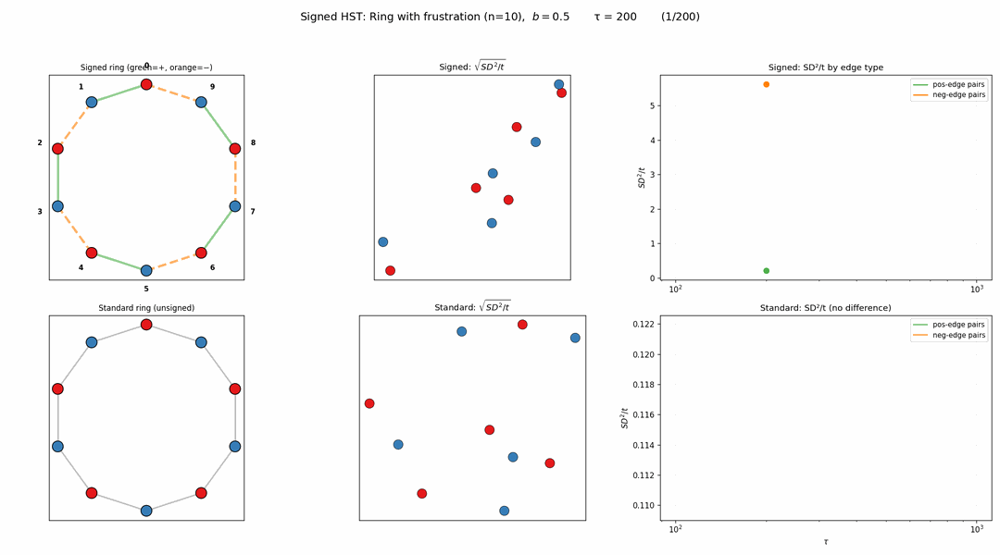

<!-- 소유권자: 최규빈 | 사용자: 최규빈 -->

# 동기

그래프에서 엣지가 모두 "우호적"인 것은 아니다. 소셜 네트워크에서 적대 관계(enemy), 신뢰-불신 관계 등 **signed graph**가 자연스럽다. HST의 snow flow 메커니즘을 signed graph로 확장하면 어떻게 될까?

# Signed HST: Repulsive Flow Rule

기존 HST의 flow rule을 부호에 따라 분기한다:

- **Positive edge (우호)**: 기존과 동일. 높은 곳 → 낮은 곳으로 눈이 흐름 (smoothing)
- **Negative edge (적대)**: **반대 방향** — 낮은 곳 → 높은 곳으로 눈이 흐름 (amplifying)

직관: "적이 잘되면(눈이 높으면) 더 쌓아준다" — 높이 차이를 증폭.

핵심 발견: inter-community SD²/t는 발산하지만 **SD²/t³으로 나누면 수렴**한다 (three-regime의 ballistic regime). intra-community SD²/t는 정상 수렴 (stationary regime).

# 예제 1: Two-Community (5+5)

- community A (5개, 빨강), community B (5개, 파랑)
- Intra = positive (초록), Inter = negative (주황 점선)
- Row 1: 전체 (inter SD²/t³ + intra SD²/t 모두 수렴)
- Row 2: within-community 임베딩 (각 커뮤니티 내 구조)
- Row 3: Standard HST 비교

# 예제 2: Spy Detection (7+7)

- community A에 spy(금색) 1명: B와 우호, A 내 일부와 적대
- Signed HST 임베딩에서 **spy가 B 쪽으로 끌려감** → 이상탐지
- within-A의 SD²/t가 발산 (spy 때문에 A 내부 불안정)

# 예제 3: Zachary Karate Club (n=34)

- 실제 분열된 소셜 네트워크. 같은 club = 우호, 다른 club = 적대
- Signed HST 임베딩에서 Mr. Hi 파벌(빨강)과 Officer 파벌(파랑) **분리**
- Standard HST에서도 약간 분리되긴 하지만 signed가 훨씬 선명

# 예제 4: 3-Community (4+4+4)

- A vs B vs C 3파전. 3그룹이 임베딩에서 삼각형으로 분리
- Standard HST에서는 3그룹 구분 불가

# 예제 5: Unbalanced Triad

- 삼각형 A-B-C: A-B 우호, A-C 우호, **B-C 적대** (불안정 구조)
- Unbalanced: B-C pair SD²/t만 발산, 나머지 수렴
- Balanced (전부 우호): 3 pair 모두 비슷하게 수렴
- Balance theory와 정확히 일치

# 예제 6: Ring with Frustration

- 10-ring에서 짝수 엣지 = 우호, 홀수 엣지 = 적대 (교대)
- **Frustration**: 깨끗하게 2그룹으로 나눌 수 없음
- neg-edge pairs SD²/t 발산, pos-edge pairs 수렴
- 임베딩에서 자연스러운 pair (0-1, 2-3, ...)끼리 클러스터링

# 정리

| 예제 | 구조 | Signed HST 결과 |
|---|---|---|
| Two-community | balanced 2파전 | 2그룹 완벽 분리 |
| Spy detection | 배신자 1명 | spy detect (B쪽으로 이동) |
| Zachary | 실데이터 분열 | 실제 split recover |
| 3-community | 3파전 | 3그룹 삼각형 분리 |
| Unbalanced triad | 불안정 삼각형 | 적대 pair만 발산 |
| Ring frustration | 2-color 불가 | 자연 pair로 클러스터 |

Signed HST의 repulsive flow는 **community detection**, **이상탐지**, **balance theory 검증**에 모두 활용 가능하다.
