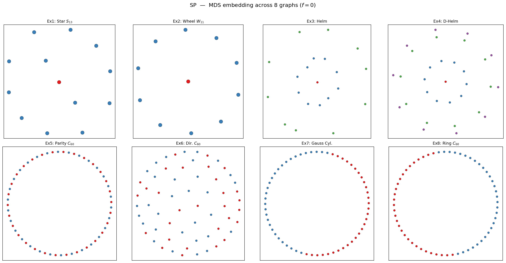
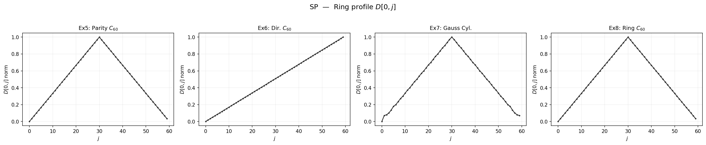
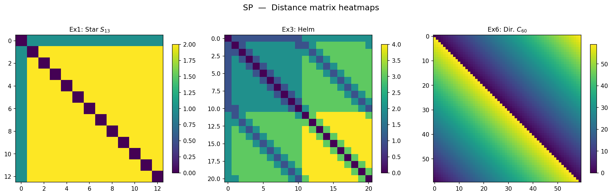
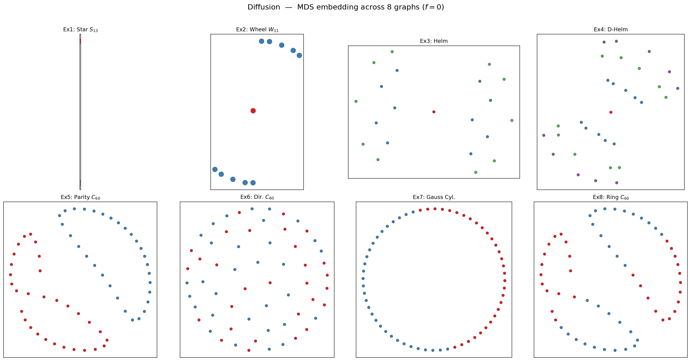
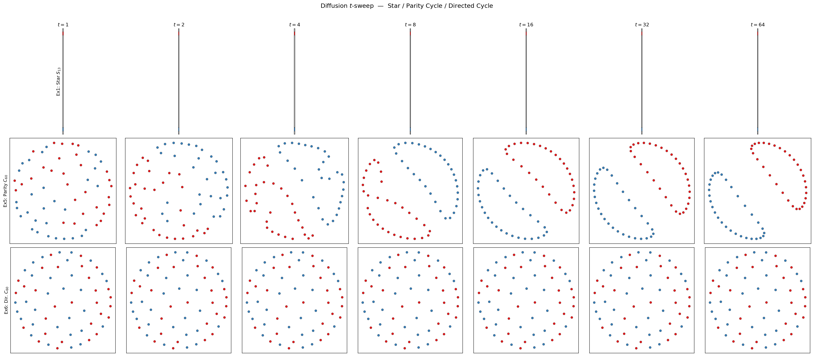
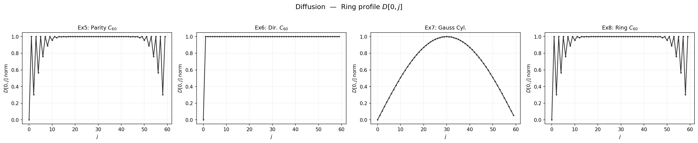
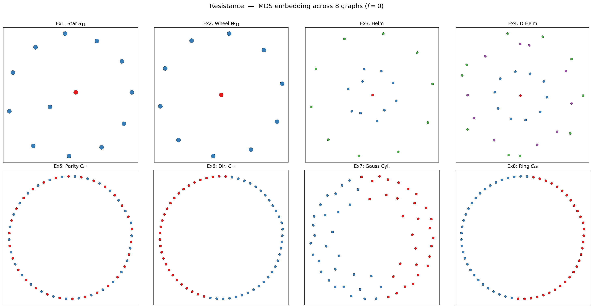
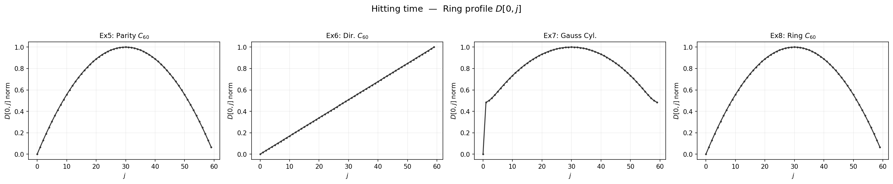
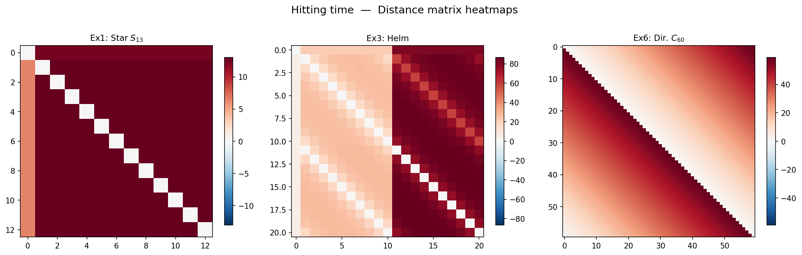

# 1. 도입

그래프 $\mathcal G = (\mathcal V, \mathcal E, \mathbf W)$ 위에서 노드 쌍 $i, j$ 사이의 "거리"를 어떻게 정의할 것인가? 단일 정답은 없다. 거리를 재는 방식에 따라 같은 그래프에서도 서로 다른 기하를 보게 되고, downstream task(임베딩, 클러스터링, 이상 탐지)의 질이 달라진다.

좋은 그래프 거리의 바람직한 성질:

| 성질 | 설명 |
|:---|:---|
| (i) 엣지 가중치 존중 | 가중치가 큰 엣지는 "가까움"을 의미 |
| (ii) 전역 구조 반영 | 한 경로에만 의존하지 않고 전체 연결 패턴을 봄 |
| (iii) 노이즈 둔감 | 엣지 하나의 추가/삭제에 robust |
| (iv) 계산 가능 | $O(n^3)$ 이하로 모든 쌍 계산 가능 |
| (v) 해석 가능 | 물리적/확률적 의미가 명확 |

한 가지가 전부를 만족하지 못하므로 여러 family 가 공존한다.

이 포스트는 그래프 도메인 위의 **주요 거리 5종**을 다음 순서로 리뷰한다:

1. **정의와 성질** — 수학적 정의, spectral 표현, 물리적 해석, 한계
2. **분석 도구** — cMDS 임베딩, 거리행렬 히트맵, ring profile, $\rho_{\mathrm{asym}}$
3. **시뮬레이션 연구** — **거리별로** 8개 테스트 그래프 위에서의 행동을 분석
4. **종합** — 어떤 그래프 구조에서 어떤 거리가 의미 있는가

---

# 2. 거리 카탈로그

## 2.1 Shortest Path distance (SP)

$$d_{\mathrm{sp}}(i, j) = \min_{\text{path }i \to j} \sum_{e \in \text{path}} w_e^{-1}$$

| 항목 | 내용 |
|:---|:---|
| 물리적 해석 | "가장 빠른 한 경로"의 비용 |
| Spectral 표현 | 없음 (Laplacian으로 환원 불가) |
| metric? | ✓ (undirected), quasi-metric (directed) |
| 파라미터 | 없음 |
| 계산 | Dijkstra $O((|V|+|E|)\log|V|)$ |
| 장점 | 명료, 빠름, triangle inequality |
| **한계** | 한 경로에 과의존, 노이즈 취약, bottleneck 그래프에서 정보 유실 |
| directed | $d(i,j) \neq d(j,i)$. 대칭화 시 directed cycle에서 **모든 쌍 거리 $\approx n/2$** → MDS 산란 |

---

## 2.2 Diffusion distance (Coifman–Lafon 2006)

$$d_t^2(i, j) = \sum_k \frac{(P^t_{ik} - P^t_{jk})^2}{\pi_k}$$

$P = D^{-1}W$ (row-stochastic), $\pi$ = stationary distribution.

| 항목 | 내용 |
|:---|:---|
| 물리적 해석 | "두 출발점의 $t$-step random walk 분포 차이" |
| Spectral 표현 | $f(\lambda) = (1-\lambda)^{2t}$ |
| metric? | ✓ |
| 파라미터 | $t$ (diffusion time: local↔global) |
| 계산 | $O(n^3)$ |
| 장점 | Multi-scale, directed 수용 |
| **한계** | (1) $t \to \infty$에서 $d_t \to 0$ (degenerate). (2) $t$ 선택 민감. (3) Directed cycle에서 **rotational symmetry trap** → 모든 쌍 거리 상수 |

---

## 2.3 Effective Resistance (Resistance distance)

$$R_{\mathrm{eff}}(i, j) = L^\dagger_{ii} + L^\dagger_{jj} - 2L^\dagger_{ij} = \sum_{k \geq 1} \frac{(\psi_k(i)-\psi_k(j))^2}{\lambda_k}$$

| 항목 | 내용 |
|:---|:---|
| 물리적 해석 | "전기회로에서 $i, j$ 사이 등가 저항" |
| Spectral 표현 | $f(\lambda) = 1/\lambda$ |
| metric? | ✓ (Euclidean embedding 가능) |
| 파라미터 | 없음 |
| 계산 | $O(n^3)$ (pseudoinverse) |
| 장점 | All-path 반영, Euclidean 보장, 파라미터 free |
| **한계** | (1) **Symmetric $W$ 요구**. (2) 대규모에서 $R \approx 1/d_i + 1/d_j$ (degree-only ultrametric 수렴, von Luxburg et al. 2014) |
| Commute time | $C_{ij} = \mathrm{vol}(\mathcal G) \cdot R_{\mathrm{eff}}(i,j)$ → MDS 동일. 이 포스트에서는 resistance만 사용 |

---

## 2.4 Biharmonic distance (Lipman–Rustamov–Funkhouser 2010)

$$d_{\mathrm{bih}}^2(i,j) = \sum_{k \geq 1} \frac{(\psi_k(i)-\psi_k(j))^2}{\lambda_k^2}$$

| 항목 | 내용 |
|:---|:---|
| 물리적 해석 | Resistance의 "squared penalty" — 저주파 global structure 강조 |
| Spectral 표현 | $f(\lambda) = 1/\lambda^2$ |
| metric? | ✓ |
| 파라미터 | 없음 |
| 장점 | 저주파 강조로 cluster boundary 선명, 3D mesh de facto |
| **한계** | Symmetric $L$ 요구. 소규모에서 resistance와 거의 동일 |

---

## 2.5 Hitting time

$$H_{ij} = \mathbb E_i[\tau_j], \quad \tau_j = \inf\{t \geq 0 : X_t = j\}$$

Closed-form: $Z = (I - P + \mathbf 1 \pi^\top)^{-1}$, $H_{ij} = (Z_{jj} - Z_{ij})/\pi_j$.

| 항목 | 내용 |
|:---|:---|
| 물리적 해석 | "$i$에서 $j$까지 random walk 기대 도달 시간" |
| metric? | **✗** (비대칭: $H_{ij} \neq H_{ji}$, triangle inequality 불성립) |
| 파라미터 | 없음 |
| **핵심 강점** | **유일하게 방향성을 output에 보존** |
| **한계** | Metric 아님 → MDS에 대칭화 필수. Degree 스케일 의존: $H_{ij} \propto 1/\pi_j$ |
| Star 예시 | $H(\text{leaf} \to \text{hub}) = 1$, $H(\text{hub} \to \text{leaf}_k) = 12$ |

---

## 2.6 계열 분류 — Spectral filter 통합

Walk-based + Algebraic 거리는 **spectral filter**로 통일:

$$d_f^2(i,j) = \sum_{k \geq 1} f(\lambda_k) (\psi_k(i) - \psi_k(j))^2$$

| 이름 | $f(\lambda)$ | 파라미터 | 저주파 강조 |
|:---|:---|:---|:---|
| Diffusion | $(1-\lambda)^{2t}$ | $t$ | $t$ 의존 |
| Heat kernel | $e^{-t\lambda}$ | $t$ | $t$↑ → 강 |
| PPR | $\alpha^2 / (1-(1-\alpha)(1-\lambda))^2$ | $\alpha$ | $\alpha$↓ → 강 |
| Resistance | $1/\lambda$ | — | 중간 |
| Biharmonic | $1/\lambda^2$ | — | 강 |

**Hitting time은 이 표에 없다.** 비대칭 output이므로 spectral filter(대칭)로 표현 불가.

| Family | 거리 | 핵심 기제 |
|:---|:---|:---|
| **Path** | SP | 최단 경로 |
| **Walk** | Diffusion, Heat, PPR | 전이확률 비교 |
| **Algebraic** | Resistance, Biharmonic | $L$ 스펙트럼 필터 |
| **Probabilistic** | Hitting, Commute | 마르코프 정지 시간 |

---

# 3. 분석 도구

## 3.1 cMDS 2D 임베딩

$n \times n$ 거리 행렬 $D$에 classical MDS를 적용하여 $\mathbb R^2$ 좌표를 얻는다. 비대칭 행렬(hitting time 등)은 $(D + D^\top)/2$로 대칭화 후 적용.

**용도**: 거리의 기하학적 구조를 직관적으로 시각화. "원형이 복원되는가", "층위가 분리되는가" 등.

## 3.2 거리행렬 히트맵

$D_{ij}$를 그대로 히트맵으로 시각화. Hitting time처럼 비대칭인 거리는 $D \neq D^\top$이 시각적으로 드러남.

**용도**: 거리 행렬의 block structure, 비대칭, degenerate(상수) 여부를 직접 확인.

## 3.3 Ring profile

Ring 구조 그래프(cycle)에서 참조 노드 $v_0$로부터의 거리 $D[0, j]$를 $j = 0, \ldots, n-1$에 대해 플롯. Min-max normalize하여 형태(shape)를 비교.

**용도**: 같은 그래프 위에서 서로 다른 거리의 **곡선 형태**를 직접 비교. Inverted-V(geodesic 비례), 나선(diffusion), 톱니(directed SP) 등.

## 3.4 $\rho_{\mathrm{asym}}$ — 비대칭 측정

$$\rho_{\mathrm{asym}}(D) = \frac{\|D - D^\top\|_F}{\|D + D^\top\|_F}$$

$0$ = 완전 대칭, $\to 1$ = 강한 비대칭.

**용도**: Directed graph에서 각 거리가 방향 정보를 output에 얼마나 보존하는지 정량화.

---

# 4. 시뮬레이션 연구

## 4.1 테스트 그래프

7가지 **모양**(shape) × 엣지 구성(edge variant)으로 총 24개 예제. 넘버링은 `모양-엣지`.

### 모양 1: Star ($n=13$)

Hub(빨강) + 12 leaves(파랑). Degree heterogeneity 극대.

| 예제 | 엣지 구성 | 설명 |
|:---|:---|:---|
| **1-1** | → hub (inward) | leaves → hub 단방향 |
| **1-2** | hub → (outward) | hub → leaves 단방향 |
| **1-3** | ↔ bidirectional | 양방향 |
| **1-4** | Gaussian | 좌표 기반 Gaussian kernel |

::: {.panel-tabset}

### 1-1: Inward

### 1-2: Outward

### 1-3: Bidir

### 1-4: Gaussian

:::

### 모양 2: Wheel ($n=11$)

Hub(빨강) + 10 rim(파랑). Spoke 방향이 달라지고, rim 은 항상 양방향.

| 예제 | Spoke | Rim | 설명 |
|:---|:---|:---|:---|
| **2-1** | → hub | ↔ | inward spoke + bidir rim |
| **2-2** | hub → | ↔ | outward spoke + bidir rim |
| **2-3** | ↔ | ↔ | all bidirectional |
| **2-4** | Gaussian | Gaussian | Gaussian kernel |

::: {.panel-tabset}

### 2-1: Inward

### 2-2: Outward

### 2-3: Bidir

### 2-4: Gaussian

:::

### 모양 3: Helm ($n=21$)

Hub + ring(10) + pendant(10). 엣지 변형은 Wheel과 동일 패턴.

| 예제 | Spoke | Ring/Pendant 간 | 설명 |
|:---|:---|:---|:---|
| **3-1** | → hub | ↔ | inward spoke |
| **3-2** | hub → | ↔ | outward spoke |
| **3-3** | ↔ | ↔ | all bidirectional |
| **3-4** | Gaussian | Gaussian | Gaussian kernel |

::: {.panel-tabset}

### 3-1: Inward

### 3-2: Outward

### 3-3: Bidir

### 3-4: Gaussian

:::

### 모양 4: Double Helm ($n=31$)

Hub + inner ring + pendant + outer ring. 엣지 변형은 Wheel과 동일 패턴.

| 예제 | Spoke | Ring 간 | 설명 |
|:---|:---|:---|:---|
| **4-1** | → hub | ↔ | inward spoke |
| **4-2** | hub → | ↔ | outward spoke |
| **4-3** | ↔ | ↔ | all bidirectional |
| **4-4** | Gaussian | Gaussian | Gaussian kernel |

::: {.panel-tabset}

### 4-1: Inward

### 4-2: Outward

### 4-3: Bidir

### 4-4: Gaussian

:::

### 모양 5: Path ($n=60$)

끝↔처음 미연결 (75% 원호 레이아웃).

| 예제 | 엣지 구성 | 설명 |
|:---|:---|:---|
| **5-1** | → directed | $W[i, i+1]=1$ 단방향 |
| **5-2** | ↔ bidirectional | 양방향 |
| **5-3** | Gaussian | index 거리 기반 Gaussian ($\theta=0.05$) |

::: {.panel-tabset}

### 5-1: Directed

### 5-2: Bidir

### 5-3: Gaussian

:::

### 모양 6: Ring ($n=60$)

끝↔처음 연결 (순환).

| 예제 | 엣지 구성 | 설명 |
|:---|:---|:---|
| **6-1** | → directed | 단방향 cycle |
| **6-2** | ↔ bidirectional | 양방향 cycle (deg=2) |
| **6-3** | Gaussian | 원 위 좌표 기반 Gaussian ($\theta=0.35$) |

::: {.panel-tabset}

### 6-1: Directed

### 6-2: Bidir

### 6-3: Gaussian

:::

### 모양 7: Cylinder ($n=60$)

5개 bidirectional ring × 12 nodes. Ring 간 연결 방식이 다름.

| 예제 | Ring 내 | Ring 간 | 설명 |
|:---|:---|:---|:---|
| **7-1** | ↔ bidir | → directed | ring 간 한쪽 방향 |
| **7-2** | ↔ bidir | ↔ bidir | ring 간 양방향 |

::: {.panel-tabset}

### 7-1: Inter directed

### 7-2: Inter bidir

:::

### 전체 요약

| 모양 | $n$ | -1 | -2 | -3 | -4 |
|:---|:---:|:---|:---|:---|:---|
| **1. Star** | 13 | → hub | hub → | ↔ | Gaussian |
| **2. Wheel** | 11 | spoke→hub + rim↔ | hub→spoke + rim↔ | all ↔ | Gaussian |
| **3. Helm** | 21 | (Wheel 패턴) | | | |
| **4. D-Helm** | 31 | (Wheel 패턴) | | | |
| **5. Path** | 60 | → | ↔ | Gaussian | — |
| **6. Ring** | 60 | → | ↔ | Gaussian | — |
| **7. Cylinder** | 60 | ring↔ + inter→ | ring↔ + inter↔ | — | — |

---

## 4.2 Shortest Path

### MDS 임베딩 (8개 그래프)

- **Star, Wheel, Helm, D-Helm**: hub 중심 + 등거리 leaf 원. SP의 한계 — hub→leaf = 1, leaf→leaf = 2이므로 **모든 leaf가 등거리** (bottleneck).
- **Parity/Outlier Ring**: 완벽한 원형 복원. 정규 그래프에서 SP는 최적.
- **Directed Cycle**: **MDS 산란.** $d(i, i+1) = 1$, $d(i, i-1) = n-1$. 대칭화 시 모든 쌍 $\approx n/2$ → 등거리 → 무의미.
- **Outlier Cylinder**: 원형. Gaussian 가중치의 미세 차이는 SP가 무시.

### Ring profile

- Parity/Ring: 대칭 inverted-V (geodesic에 비례).
- Directed: **단조 증가** — directed에서 $D[0,j] = j$.
- Gaussian Cylinder: inverted-V가 미세하게 smooth.

### 거리행렬 히트맵

- Star: 2-level block. Hub 행/열이 밝고 leaf-leaf 블록 균일.
- Helm: 3-level block.
- Directed: **강한 비대칭**. 상삼각 vs 하삼각.

**SP 요약**: 명료하고 빠르지만, (1) bottleneck 취약, (2) directed에서 대칭화 시 degenerate, (3) 정규 그래프에서만 깨끗.

---

## 4.3 Diffusion Distance

### MDS 임베딩 ($t=10$, 8개 그래프)

- **Star**: hub가 leaf 군집에서 **극단적으로 분리**. $P^{10}$ 행이 모든 leaf에서 거의 동일 → leaf 응축.
- **Parity Cycle**: **나선(spiral) 왜곡.** $t=10$이 $n=60$에 비해 짧아 local 패턴만 반영.
- **Directed Cycle**: **degenerate.** Shift matrix의 $P^t$도 shift → 모든 쌍 거리 상수.
- **Helm**: hub 극단 분리 + ring/pendant 응축.

### $t$-sweep (Star / Parity / Directed)

$t \in \{1, 2, 4, 8, 16, 32, 64\}$:

- **Star** (1행): $t=1$ local only → $t=4$ hub 분리 시작 → $t=16$ 극단 분리 → $t=64$ **collapse** (모든 거리 → 0).
- **Parity** (2행): $t=1$ 이웃만 → $t=4$ 나선 → $t=8\sim 16$ 원에 수렴 → $t=64$ collapse 시작.
- **Directed** (3행): **모든 $t$에서 degenerate.** $P^t$가 shift라 MDS가 무의미.

→ **최적 $t$ 구간이 좁다.** 그래프 크기와 구조에 따라 달라지며, directed에서는 아예 실패.

### Ring profile

- Parity: 톱니 형태 (local oscillation) — 나선 왜곡의 원인.
- Directed: **수평선** (상수) — degenerate.
- Gaussian Cylinder: smooth inverted-V.

**Diffusion 요약**: Multi-scale의 강점이 있으나, (1) $t$ 선택이 결정적 — "too small → sweet spot → collapse"의 좁은 구간, (2) $t \to \infty$ degenerate, (3) directed에서 rotational symmetry trap.

---

## 4.4 Resistance Distance

### MDS 임베딩 (8개 그래프)

- **Star**: hub 중심, leaf 원. SP와 정성적으로 동일하나 **모든 경로를 병렬**로 고려.
- **Cycle 류**: **깨끗한 원형 복원.** SP보다 robust.
- **Directed Cycle**: $(W+W^\top)/2$ = bidirectional cycle → **완벽한 원형.** 방향 유실, 구조 보존. (SP 산란과 대비)
- **Helm / D-Helm**: hub-ring-leaf 층위 분리가 SP보다 선명. Degree 차이 반영.
- **Outlier Cylinder**: 상/하반구에 약간의 밀도 차이 — Gaussian 가중치 반영.

### Ring profile

- 모든 cycle에서 **대칭 inverted-V**. 양쪽 경로 모두 고려하여 SP보다 smooth.
- Directed에서도 symmetrize 후 undirected cycle과 동일.

### 거리행렬 히트맵

- Star: 2-level block (SP 유사, 밝기 비율 약간 다름).
- Directed: **완전 대칭** circulant.

**Resistance 요약**: 파라미터 free, Euclidean, all-path 반영. 단, (1) symmetric 요구, (2) 대규모에서 degree-only 수렴.

---

## 4.5 Biharmonic Distance

### MDS 임베딩 (8개 그래프)

- 대부분 Resistance와 **거의 동일** ($1/\lambda$ vs $1/\lambda^2$ 차이 소규모에서 미미).
- **Outlier Cylinder**: 상/하반구 분리가 Resistance보다 약간 더 선명 — 저주파 강조 효과.
- **Helm**: 층위 간 분리가 조금 더 뚜렷.

### Ring profile

Resistance ring profile과 거의 겹침. 곡선이 약간 더 부드러움 (고주파 억제).

**Biharmonic 요약**: Resistance의 저주파 강화 버전. 소규모에서 차이 미미. 3D mesh에서는 de facto이나 graph 분석에서는 Resistance로 충분.

---

## 4.6 Hitting Time

### MDS 임베딩 (8개 그래프)

- **Star**: hub-leaf 분리. $H(\text{leaf}\to\text{hub})=1$, $H(\text{hub}\to\text{leaf})=12$의 비대칭이 대칭화 후에도 영향.
- **Directed Cycle**: **원형에 가까운 구조 + 비대칭 흔적.** SP(산란), Diffusion(degenerate), Resistance(완벽 원)과 모두 다름.
- **Cycle 류**: degree 균등 → geodesic 비례 → 원형.

### $\rho_{\mathrm{asym}}$ — 비대칭 보존 분석 (Directed Cycle)

| 거리 | $\rho_{\mathrm{asym}}$ | 해석 |
|:---|:---:|:---|
| **SP (directed)** | **0.5676** | 비대칭 보존 |
| **Hitting time** | **0.5676** | 비대칭 보존 |
| Resistance | 0.0000 | 대칭 (by construction) |
| Biharmonic | 0.0000 | 대칭 (by construction) |
| Diffusion (모든 $t$) | 0.0000 | **rotational symmetry trap** |

**Output이 비대칭인 거리는 SP (directed=True)와 Hitting time 뿐.**

- Diffusion이 0인 이유: directed cycle의 회전 자기동형사상이 $P^t$ 행의 L2 거리를 shift-magnitude 함수로 만듦 → input 비대칭, output 대칭.
- Resistance/Biharmonic: $L_s = (L+L^\top)/2$ 정의 단계에서 비대칭 소거.

### Ring profile

- Directed cycle: **비대칭이 대칭화 후에도 곡선 skew로 남음.** Resistance의 대칭 inverted-V와 비교.
- Parity/Ring: geodesic 비례 (다른 거리와 동일).

### 거리행렬 히트맵

- Star: **비대칭** — 행 0 (hub→leaf: 밝음, =12) vs 열 0 (leaf→hub: 어두움, =1).
- Directed: **강한 비대칭** — 상/하삼각 밝기 차이 뚜렷.

**Hitting time 요약**: 유일하게 방향 정보를 output에 보존. Metric 아니라는 한계가 있지만, directed graph 분석에서 대체 불가.

---

# 5. 마무리

## 거리별 특성 요약

| 거리 | 포착 구조 | 강점 | 약점 | 최적 사용처 |
|:---|:---|:---|:---|:---|
| **SP** | 최단 경로 | 명료, 빠름, 파라미터 free | bottleneck, directed 산란 | 정규 그래프 baseline |
| **Diffusion** | multi-scale 전이확률 | $t$로 scale 조절 | $t \to \infty$ degenerate, directed trap | undirected multi-scale |
| **Resistance** | 전역 연결성 | metric, Euclidean, 파라미터 free | degree-only 수렴, symmetric 요구 | undirected 전역 metric |
| **Biharmonic** | 저주파 global | cluster boundary 강조 | resistance와 유사 | 3D mesh |
| **Hitting** | 방향성 + 접근 난이도 | **유일 비대칭 output** | metric 아님 | directed 분석 |

## 어떤 그래프 구조에서 어떤 거리가 의미있나

| 그래프 특성 | 추천 거리 | 이유 |
|:---|:---|:---|
| **정규 그래프** (cycle, grid) | SP 또는 Diffusion | degree 균등 → 대부분 거리가 비슷. SP가 가장 간단 |
| **degree heterogeneity 큰** (star, hub-spoke) | Resistance | SP는 bottleneck, Diffusion은 scale 민감 |
| **다층 계층** (helm, tree) | Resistance 또는 Biharmonic | 층위 간 degree 차이를 반영한 분리 |
| **Directed graph** | Hitting time | 유일하게 방향성을 output에 보존 |
| **가중치 연속 변화** (Gaussian kernel) | Diffusion 또는 Biharmonic | spectral 계열이 weight 변화를 smooth하게 반영 |
| **대규모 sparse** | PPR 또는 SP | $O(n^3)$인 spectral 방법은 비실용적 |

## 핵심 교훈

1. **정규 그래프에서는 대부분의 거리가 동일한 임베딩을 준다.** 차이는 파라미터 민감도(diffusion의 $t$)에서만 발생.

2. **Degree heterogeneity가 거리 간 차이를 만든다.** Star에서 SP는 2-level block, Diffusion은 leaf 응축 — 같은 그래프를 다르게 본다.

3. **Directed graph에서 거리별 실패 모드가 극적으로 다르다.**
   - SP, Diffusion → 산란/degenerate
   - Resistance, Biharmonic → 완벽한 원 (방향 제거)
   - Hitting time → 원 + 비대칭 흔적 (방향 보존)

4. **Diffusion $t$-sweep**: "too small → sweet spot → degenerate"의 좁은 구간. 그래프 크기/구조에 따라 최적 $t$이 달라지며, directed에서는 모든 $t$에서 실패.

5. **$\rho_{\mathrm{asym}}$ 분석**: Directed에서 비대칭 output은 SP와 Hitting time 뿐. Walk-based는 rotational symmetry trap, algebraic은 $L_s$ symmetrization이 원인.

---

# 참고

- Coifman & Lafon, "Diffusion maps," *Appl. Comput. Harmon. Anal.* (2006)
- Klein & Randić, "Resistance distance," *J. Math. Chem.* (1993)
- Chandra, Raghavan, Ruzzo, Smolensky, Tiwari, "The electrical resistance of a graph…," *STOC* (1989)
- von Luxburg, Radl, Hein, "Hitting and commute times in large random neighborhood graphs," *JMLR* (2014)
- Lipman, Rustamov, Funkhouser, "Biharmonic distance," *ACM TOG* (2010)
- Lovász, "Random walks on graphs: A survey" (1993)
