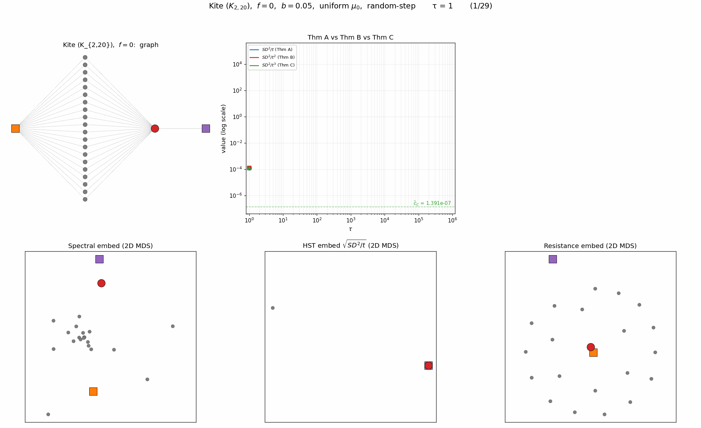

<!-- 소유권자: 소미 | 사용자: 소미 -->

목걸이모양 네트워크 실험을 하다가 오솔길 개념이 계속 머릿속에서 맴돌았음. 링과 별표가 단 하나의 엣지로 이어져 있는데, 그 좁은 길 하나로는 별표가 링 쪽으로 끌려들어오지 못하고 결국 외곽으로 떨어져나가 버리는 그 그림. 분명 길은 있는데, 마치 길이 없는 거나 마찬가지인 느낌. 한 명만 겨우 지나갈 수 있는 산속 오솔길 같음.

비슷한 게 전기회로에도 있음. 저항 하나를 사이에 두고 두 점을 연결하면 전류가 좁은 통로로 헐떡거리며 지나가야 함. 그런데 똑같은 저항을 여러 개 병렬로 묶어 두면 합성저항이 낮아지면서 같은 두 점 사이가 갑자기 길폭이 넓어진 고속도로처럼 변함. 직렬은 오솔길이고 병렬은 고속도로임. 

재미있는 건 이게 엣지 하나의 가중치를 키워서 흐름을 인위적으로 좋게 만드는 것과는 완전히 다른 얘기라는 점임. 엣지의 굵기가 아니라, 엣지의 수 자체가 흐름을 정하는 셈임.

이 직관을 그래프 위에서 보고 싶었음. 두 점 사이에 길이 단 하나만 있는 경우와 길이 여러 개 (= 병렬) 있는 경우를 한 그래프 안에 같이 넣어두면, 거리(distance) 라는 게 어떻게 판단되는지 비교해 볼 수 있을 것 같았음. 그래서 다음 같은 연(kite)모양의 그래프를 그려봤음.

이 그래프는 두 가지 시선으로 볼 수 있음.

첫 번째 시선: 최단거리 관점

- 질문: 빨강에서 주황, 회색, 보라 중 어디가 가장 가깝나?
- 답: 빨강-주황은 회색점 하나를 거쳐야 하니 두 발자국. 빨강-회색점들은 한 발자국. 빨강-보라도 한 발자국. 회색점들과 보라는 둘 다 빨강의 이웃이라 같은 위치. 깔끔함.
- 결론: 빨강에서 가장 먼 건 주황. 회색점들과 보라는 똑같이 가까움.

두 번째 시선: 스무차선 고속도로 관점. (교통편의성)

- 질문1: 빨강과 가까운 게 주황인지 보라인지 다시 생각해보는 데서 시작함. 빨강-주황 사이엔 길이 하나가 아니라 20개임. 회색점 어느 걸 거쳐도 두 발자국이면 도착함. 스무 차선 고속도로 같음. 반면 빨강-보라는 단 하나의 엣지뿐임. 빨강-주황이, 빨강-보라보다 거리는 더 멀지만 교통수단이 압도적으로 좋음. 그래서 빨강 ≈ 주황 으로 봐도 됨.
- 질문2: 이번엔 빨강과 가까운 게 회색인지 보라인지 생각해보자. 둘 다 빨강과 한 발자국이라 빨강과의 친밀함은 비슷한데, 빨강의 절친(= 스무 갈래 길로 빨강과 한 묶음이 된 그 주황) 과의 관계에서 갈림. 회색점은 빨강·주황 양쪽과 다 한 발자국이라 두루 친함. 보라는 빨강이랑은 친한데 주황이랑은 두 발자국이라 데면데면함. 친구의 친구를 안 챙기는 셈임. 빨강 입장에서도 내 친구 주황과도 친한 회색점이 더 가깝게 느껴지고, 내 친구 주황과는 안 친한 보라는 한 발 멀어 보임.
  - 사실 이건 거리의 가장 기본인 삼각부등식임:
    - 삼각부등식: $d(\text{빨}, X) \leq d(\text{빨}, \text{주}) + d(\text{주}, X)$
    - 빨 ≈ 주 라서 $d(\text{빨}, \text{주}) \approx 0$
    - 그러면 $d(\text{빨}, X) \approx d(\text{주}, X)$
    - $d(\text{주}, \text{회}) = 1$, $d(\text{주}, \text{보}) = 2$
    - 따라서 $d(\text{빨}, \text{회}) < d(\text{빨}, \text{보})$. 회색이 보라보다 빨강에 가까움.
    - 즉 빨강과 주황이 가까우면 어떤 점 $X$ 에 대해서 빨강에서 본 거리와 주황에서 본 거리는 크게 다를 수 없다는 직관.
- 결론: 그래서 두 번째 시선에서는 빨강에서 가장 가까운건 주황, 가장 먼것은 보라. 회색은 보라와 주황사이. 길의 수를 인정하느냐 마느냐가 모든 걸 뒤집음.

결과해석: 결과가 재미있음. 세 거리가 각자 다른 답을 냄.

- Spectral embedding 은 시선 1. 빨강과 가까운 점으로 보라를 골랐고, 빨강-주황 사이엔 회색점들이 흩어져 있음. 한 발자국이면 이웃, 두 발자국이면 멀다는 답임. 
- Resistance distance 는 시선 2 에 가까움. 빨강과 주황을 가깝게 묶었음. 스무 차선 고속도로 알아본 셈임. 다만 회색점은 사방에 퍼져 있는데, 이건 그냥 해석이 좀 이상한 거라고 보면 될 듯. 
- HST 는 시선 2 를 가장 또렷이 그려냄. 시간이 지날수록 빨강·주황이 한 점으로 모이고, 회색점들이 그 옆에 다닥다닥 붙고, 보라가 살짝 떨어진 자리에 놓임. 회색점 자리까지 맞추는 건 셋 중 HST 뿐임. 재미있음. 

