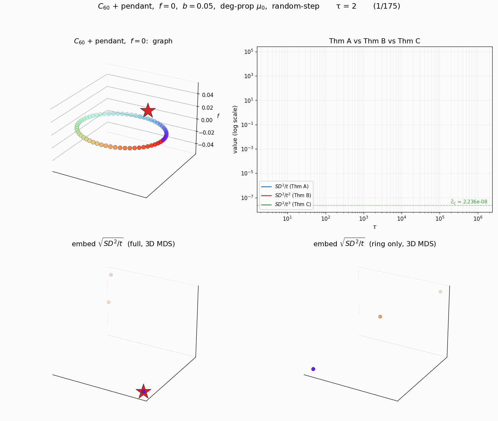

<!-- 소유권자: 소미 | 사용자: 소미 -->

## Discussion

바퀴랑 다르게 별표가 떨어져나감.

이번 실험 전에 (1)과 (2)의 생각이 동시에 들었음. (1) 바퀴는 스타가 중앙에 있어서 도망가지 않았는데, 이건 외부에 있는 느낌이라 떨어져 나가지 않을까? (2) 떨어져 나가더라도 그래도 파란색 점이랑 좀 가깝지 않을까? 그렇다면 원형 모양을 찌그러뜨리지 않을까?

결과를 돌려보니 링의 연결이 너무 강하게 느껴짐. 굳이 비유하면 링과 스타가 연결된 하나의 엣지는 너무 작은 오솔길 느낌임.

**향후 실험 1**: 스타와 링 중 하나만 연결하는 게 아니고 한 10~20% 쯤 연결해버리면 스타가 링을 당기지 않을까? 하는 생각이 듦. 언제부터 링의 구조를 붕괴시킬까?도 재미있는 포인트같음.

**향후 실험 2**: 지금은 스타-링이었는데, 링-링 이런 구조도 재미있을 것 같음 (두 개의 그룹이 분리되지 않을까? 하는 생각이 듭니다). 오솔길 개념 재미있음 (길이 있지만 없는 느낌).
