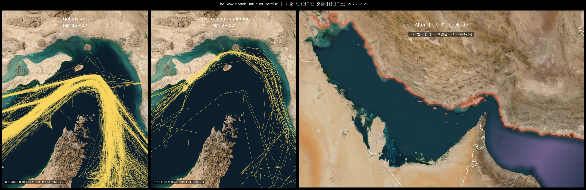
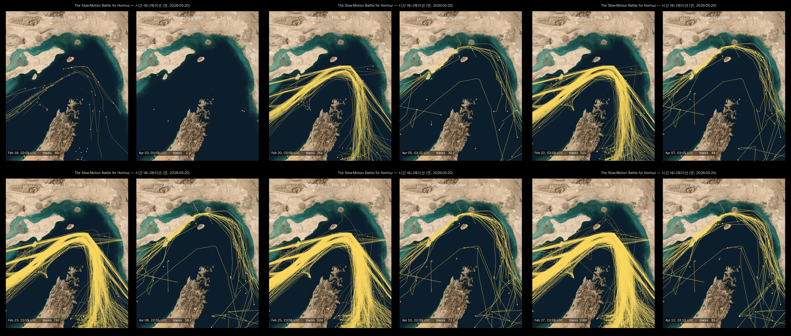
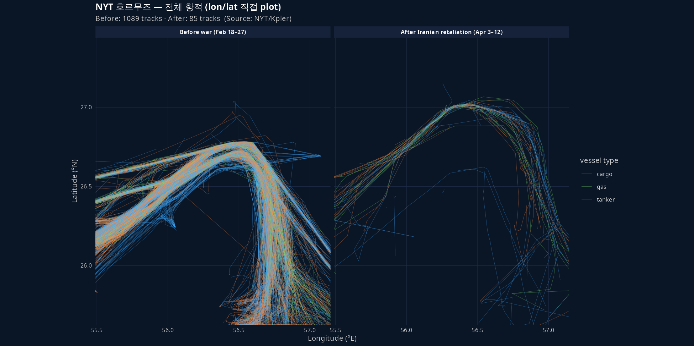

## 0. 한 줄 요약

NYT 2026-04-16 기사 *"How the Iran War, Then the U.S. Blockade, Has Changed the Strait of Hormuz"* 의 hero 3-panel 항적 figure 를, **NYT 가 실제로 쓴 raw 좌표 데이터** 로부터 Python 으로 직접 다시 그려본 기록.

## 1. 발단 — 좋은해협연구소의 첫 작업

좋은해협연구소는 본 논문이 없는 신생 프로젝트. 첫 자료가 NYT 의 위 기사 한 장이었다. "도서관 가서 기사를 꼼꼼히 읽어봐"가 첫 지시였고, 거기서 자연스럽게 **figure 재현** 이 첫 작업으로 정해졌다.

연구 노선 분기:

- **A** — 공개·무료 데이터만으로 (Kpler 라이선스 X)
- **B** — NYT 측 데이터가 article HTML/JS 어딘가에 임베드되어 있는지 까보기

두 노선을 같이 갔는데, 결과적으로 **B에서 잭팟이 터졌다**.

## 2. 데이터 발굴 — chunk JS 까기

기사 HTML 안에는 raw 데이터가 없었다. 단 figure 들은 NYT 의 그래픽 CDN (`static01.nytimes.com/newsgraphics/RuEuIw0xIss9kg/...`) 에 SvelteKit 빌드로 호스팅되어 있었다. 그 빌드의 chunk JS 파일 16개를 모두 `curl` 로 받아 정규식으로 좌표 패턴을 grep:

```bash
grep -ohE '\b2[5-7]\.[0-9]{4,}\b|\b5[5-8]\.[0-9]{4,}\b' chunks/*.js
```

`BuJavWVE.js` (212KB) 안에서 호르무즈 위경도 범위의 숫자들이 다량 발견되었고, 동시에 `fetch(i + "index.json")` 호출도 잡혔다. 변수 `i` 를 trace 한 결과 NYT 의 unrelated locator-map 서비스 URL 이었다 (오답).

진짜 답은 `_assets` 경로의 동일 chunk 안에서 발견됐다:

```text
_assets.mFrTYJL3K3oVVd4qilR13gN3N0OZPatBL5au9cDHCdc/hormuz-tracks-before.json
_assets.mFrTYJL3K3oVVd4qilR13gN3N0OZPatBL5au9cDHCdc/hormuz-tracks-after.json
_assets.mFrTYJL3K3oVVd4qilR13gN3N0OZPatBL5au9cDHCdc/hormuz-map-static.json
```

각 파일 내용:

| 파일 | 크기 | 트랙 수 | 기간 |
|---|---|---|---|
| `hormuz-tracks-before.json` | 543KB | **1089 trajectories** (cargo 486, tanker 483, gas 120) | Feb 18 – 27 |
| `hormuz-tracks-after.json` | 27KB | **85 trajectories** (cargo 31, tanker 33, gas 21) | Apr 3 – 12 |
| `hormuz-map-static.json` | 58KB | borders·labels·gateLine·landMask | 정적 |

기사가 narrative 로 강조한 "1일 130척 → 한 줌으로 폭락" 이 데이터 측에서 1089 → 85 로 비춰진다.

::: {.callout-tip collapse="true" title="보충: chunk JS 까는 노하우"}
- NYT graphics 빌드는 모두 `static01.nytimes.com/newsgraphics/<8자hash>/_app...../immutable/chunks/*.js` 양식
- `node` JS stub 들은 보통 200B 안팎 (그냥 import 만 함). 데이터는 큰 chunk 안에 있다.
- 정규식 grep 으로 위경도 패턴 (예: `\b56\.\d{4,}\b`) 의 count 가 100+ 이면 그 chunk 에 좌표 임베드 강력 의심.
- `fetch("....json")` 가 chunk 안에 있으면 그 URL 을 그대로 따라가면 됨. 우리 경우엔 fetch 함수 인자가 변수라 unrelated 였지만, `_assets` 경로를 동일 chunk 안에서 직접 발견하는 행운.
:::

## 3. 좌표 시스템 해독

JSON 의 `tracks[i].pts[j]` 가 `[x, y, t]` 인데 x/y 가 raw lat/lon 이 아니고 정규화되어 있었다.

```text
sample pts: [-0.1255, 1.1949, 259355]
            [ 0.5035, 0.4730, 863542]
x range: [-0.30, 1.30]
y range: [ 0.27, 1.27]
```

`hormuz-map-static.json` 의 label 위치 (`{"name":"IRAN","x":0.15,"y":0.1462}` 등) 와 bbox `aspect=1.2244` 를 단서로 다음 변환을 유추:

::: {.callout-important collapse="true" title="해석: 왜 aspect = 1.224 인가"}
호르무즈 영역에서 위도 1도와 경도 1도의 실제 길이는 다르다 ($\cos(\text{lat})$ 보정).

$$
\text{aspect} \;=\; \frac{\text{lat range}}{\text{lon range} \cdot \cos(\text{lat center})}
\;=\; \frac{1.8118}{1.6541 \cdot 0.8949} \;=\; 1.224
$$

NYT 의 캔버스는 가로 1 단위에 세로 1.224 단위가 배정되어 있어 픽셀이 실제 거리에 비례한다 (equirectangular at center).
:::

따라서 정규화 좌표 → 픽셀 변환은:

$$
x_{\text{px}} = x_{\text{norm}} \cdot W,\qquad
y_{\text{px}} = \frac{y_{\text{norm}}}{\text{aspect}} \cdot H
$$

여기서 origin 은 top-left, y 는 아래로 증가한다.

### 3.2 데이터 로딩 + 좌표 변환 (Python · R)

::: {.panel-tabset}

#### Python

```python
import json
import numpy as np

data = json.load(open("data/NYT_hormuz/hormuz-tracks-before.json"))
bbox, asp = data["bbox"], data["aspect"]

def to_lonlat(xy):
    x, y = xy[..., 0], xy[..., 1]
    lon = bbox["minLon"] + x * (bbox["maxLon"] - bbox["minLon"])
    lat = bbox["maxLat"] - (y / asp) * (bbox["maxLat"] - bbox["minLat"])
    return np.stack([lon, lat], axis=-1)

def to_px(xy, W, H):
    x, y = xy[..., 0], xy[..., 1]
    return np.stack([x * W, y / asp * H], axis=-1)
```

#### R

```r
library(jsonlite); library(data.table)
d <- fromJSON("data/NYT_hormuz/hormuz-tracks-before.json", simplifyVector = FALSE)
bbox <- lapply(d$bbox, as.numeric); asp <- as.numeric(d$aspect)

# 1 track → data.table with lon/lat
track_to_dt <- function(tr) {
  pts <- do.call(rbind, lapply(tr$pts, function(p) as.numeric(unlist(p))))
  data.table(
    x = pts[, 1], y = pts[, 2], t_sec = pts[, 3],
    lon = bbox$minLon + pts[, 1] * (bbox$maxLon - bbox$minLon),
    lat = bbox$maxLat - pts[, 2] / asp * (bbox$maxLat - bbox$minLat)
  )
}
```

:::

## 4. 정적 3-panel 재현

`hormuz-sat.jpg` (NYT 의 위성 basemap 그대로) + 위 좌표 변환 + `matplotlib.collections.LineCollection` 으로 1089개·85개 polyline 을 반투명 gold (`#fad860`) 으로 그렸다. Panel 3 (After US blockade) 는 별도 항적 JSON 이 없어 NYT 의 `blockade-Artboard_1.jpg` 를 그대로 박았다 (전 페르시아만 + 이란 빨간 outline + Gulf of Oman 보라 봉쇄존).

{fig-align="center"}

### 4.1 핵심 코드 (matplotlib)

```python
from matplotlib.collections import LineCollection
from matplotlib import font_manager as fm
from PIL import Image
import matplotlib.pyplot as plt, numpy as np, json

# 한글 폰트
fm.fontManager.addfont("/usr/share/fonts/truetype/unfonts-core/UnDotum.ttf")
plt.rc("font", family="UnDotum")

sat = np.array(Image.open("hormuz-sat.jpg"))
H, W = sat.shape[:2]

def render(ax, data, *, lw, alpha, color="#fad860"):
    ax.imshow(sat)
    asp = data["aspect"]
    segs = []
    for tr in data["tracks"]:
        a = np.asarray(tr["pts"])
        if len(a) >= 2:
            segs.append(np.stack([a[:, 0] * W, a[:, 1] / asp * H], axis=1))
    ax.add_collection(LineCollection(
        segs, colors=color, linewidths=lw, alpha=alpha,
        capstyle="round", joinstyle="round"))
    ax.set_xlim(0, W); ax.set_ylim(H, 0); ax.axis("off")

before = json.load(open("hormuz-tracks-before.json"))
after  = json.load(open("hormuz-tracks-after.json"))

fig, (ax1, ax2) = plt.subplots(1, 2, figsize=(12, 7), facecolor="black")
render(ax1, before, lw=0.65, alpha=0.50)   # Feb 18–27 (1089 tracks)
render(ax2, after,  lw=0.75, alpha=0.65)   # Apr 3–12 (85 tracks)
```

::: {.callout-note collapse="true" title="증명-스타일: matplotlib 으로 NYT 룩 만들기"}
**1단계** — basemap: `imshow` 로 hormuz-sat 출력. axis off, xlim/ylim 으로 픽셀 범위 고정.

**2단계** — 트랙: 각 트랙의 pts → 픽셀 좌표 변환 → `LineCollection(segs, colors="#fad860", linewidths=0.65, alpha=0.50, capstyle="round")`. After 패널은 트랙이 적으니 `linewidths=0.75, alpha=0.65` 로 약간 부각.

**3단계** — endpoint dots: 각 트랙의 마지막 점을 `scatter` 로 작은 점.

**4단계** — 한글 폰트: `font_manager.fontManager.addfont(UnDotum.ttf)` + `rc("font", family="UnDotum")`.

**5단계** — gridspec `width_ratios=[w1, w1, w3]` 로 portrait 2개 + landscape 1개의 height 를 맞춤.
:::

## 5. 시간 누적 애니메이션

`pts[i][2]` 가 시간 offset 이라 (단위 주의 — §5.2 참고) frame 마다 `t_now` 이하 점들만 polyline 으로 그리면 항적이 시간 따라 자라난다.

::: {.callout-important collapse="true" title="해석: 무엇이 보이는가"}
- **Before war** (Feb 18 – 27): 10일 동안 1089개의 항적이 차곡차곡 쌓이며, **오만 쪽 깊은 표준 항로** 의 노란 다발이 진해진다.
- **After Iranian retaliation** (Apr 3 – 12): 같은 10일 동안 85개. 항적이 듬성듬성, 그나마 다수가 **이란 쪽 얕은 물** 을 통과 (기사 본문의 narrative).
:::

{fig-align="center"}

{fig-align="center"}

### 5.1 핵심 루프 (matplotlib FuncAnimation)

```python
from matplotlib.animation import FuncAnimation, PillowWriter

# 사전 계산: 각 트랙의 (픽셀 좌표, t_sec)
def precompute(data):
    asp = data["aspect"]
    out = []
    for tr in data["tracks"]:
        a = np.asarray(tr["pts"], dtype=float)
        if len(a) < 2: continue
        px = np.stack([a[:, 0] * W, a[:, 1] / asp * H], axis=1)
        out.append((px, a[:, 2]))   # t_sec (★ ms 아님)
    return out, (data["tMax"] - data["tMin"]) / 1000.0   # seconds

tracks, dur_sec = precompute(before)
lc = LineCollection([], colors="#fad860", linewidths=0.7, alpha=0.55)
ax.add_collection(lc)

def update(i):
    t_now = (i + 1) / N_FRAMES * dur_sec
    segs = []
    for px, t in tracks:
        m = t <= t_now
        if m.sum() >= 2: segs.append(px[m])
    lc.set_segments(segs)
    return (lc,)

ani = FuncAnimation(fig, update, frames=N_FRAMES, interval=120)
ani.save("hero_anim.gif", writer=PillowWriter(fps=8), dpi=110)
```

### 5.2 시간 단위 bug 사례

::: {.callout-tip collapse="true" title="보충: pts[i][2] 단위 — ms 가 아니라 초"}
처음에 `tMax - tMin` (밀리초 단위 timestamp 차이) 으로 비교했더니, frame 0 부터 거의 모든 트랙이 떴다. 디버깅 결과:

- `tMax - tMin = 863,977,000` (ms, ≈ 10일 ✓)
- `max(pts[i][2]) ≈ 863,977`

즉 **`pts[i][2]` 는 ms 가 아니라 초**. NYT JSON 의 미묘한 단위 trap. duration 도 초로 통일해서 비교하니 정상 누적.

```python
# 잘못
dur_ms = data["tMax"] - data["tMin"]
mask = t <= frac * dur_ms

# 맞음
dur_sec = (data["tMax"] - data["tMin"]) / 1000.0
mask = t <= frac * dur_sec
```
:::

## 6. R 로도 보기 — 모든 항적을 lon/lat 평면에 직접 plot

basemap 없이 좌표만 보는 sanity check. `coord_fixed` 의 `ratio = 1 / cos(latCenter)` 로 호르무즈 위도에서의 실제 종횡비를 보존.

{fig-align="center"}

```r
library(jsonlite); library(ggplot2); library(data.table)

# §3.2 의 track_to_dt 를 이용해 전 트랙을 하나의 long table 로
load_period <- function(file, period) {
  d <- fromJSON(file, simplifyVector = FALSE)
  bbox <- lapply(d$bbox, as.numeric); asp <- as.numeric(d$aspect)
  pieces <- lapply(seq_along(d$tracks), function(k) {
    tr <- d$tracks[[k]]
    if (length(tr$pts) < 2) return(NULL)
    pts <- do.call(rbind, lapply(tr$pts, function(p) as.numeric(unlist(p))))
    data.table(
      period = period, track_id = k, group = as.character(tr$g),
      lon = bbox$minLon + pts[, 1] * (bbox$maxLon - bbox$minLon),
      lat = bbox$maxLat - pts[, 2] / asp * (bbox$maxLat - bbox$minLat)
    )
  })
  rbindlist(pieces)
}

dt <- rbind(
  load_period("hormuz-tracks-before.json", "Before war (Feb 18–27)"),
  load_period("hormuz-tracks-after.json",  "After Iranian retaliation (Apr 3–12)")
)

ggplot(dt, aes(lon, lat, group = interaction(period, track_id), color = group)) +
  geom_path(linewidth = 0.18, alpha = 0.45) +
  facet_wrap(~ period) +
  coord_fixed(ratio = 1 / cos(mean(range(dt$lat)) * pi / 180)) +
  scale_color_manual(values = c(cargo = "#3aa9ff", tanker = "#ff8c42", gas = "#7be36a"))
```

기사 narrative 인 "전쟁 전에는 오만 쪽 깊은 항로 다발, 보복기에는 트랙 듬성듬성 + 이란 쪽 치우침" 이 lon/lat 평면에서 그대로 드러난다.

## 7. 한계 + 다음 단계

"재현" 이라 부르긴 했지만 layer 별로 정직하게 나누면:

| Layer | 출처 | 누가 만들었나 |
|---|---|---|
| basemap (위성) | NYT `hormuz-sat.jpg` | NYT 그대로 |
| 항적 좌표 (1089 + 85) | NYT `*-tracks-*.json` | NYT (Kpler 원천) |
| 항적 렌더링 (스타일·색·alpha·시간 애니) | 본 작업 Python 스크립트 | **본인** |
| Panel 3 봉쇄 figure | NYT `blockade-Artboard_1.jpg` | NYT 그대로 |
| 3-panel 합성·폰트·라벨 | matplotlib | **본인** |

100% 맨바닥 재현이 되려면:

- basemap → Sentinel-2 cloud-free composite 으로 본인이 합성 (Copernicus, 무료, 가입 필요)
- 항적 → 공개 AIS 로 본인이 수집 (호르무즈 2026-02~04 의 무료 AIS history 는 사실상 없음 — Spire 학술 라이선스 등 필요)
- Panel 3 봉쇄 → 동일 데이터 기반으로 직접 렌더

이 세 가지가 본 프로젝트의 다음 갈래 후보. 일단 본 1차 작업은 여기서 끝.

## 8. 개인 메모 (cross-validation 후보)

같은 사건에 대한 다른 매체 figure 비교는 의미가 있을 듯:

- **Reuters Graphics** (`reutersgraphics/` GitHub) — 종종 D3 코드·데이터 공개
- **AP Data / FT Visual Journalism** — 가끔 공개
- 모두 Kpler·Spire 같은 동일 AIS 벤더에서 받았을 가능성. 그래도 **시각화 design choice 의 차이** 비교가 cross-validation 의 진짜 가치.

본 프로젝트 scope 안에서 우선순위는 낮고, 대표 confirm 후 진행 예정.
