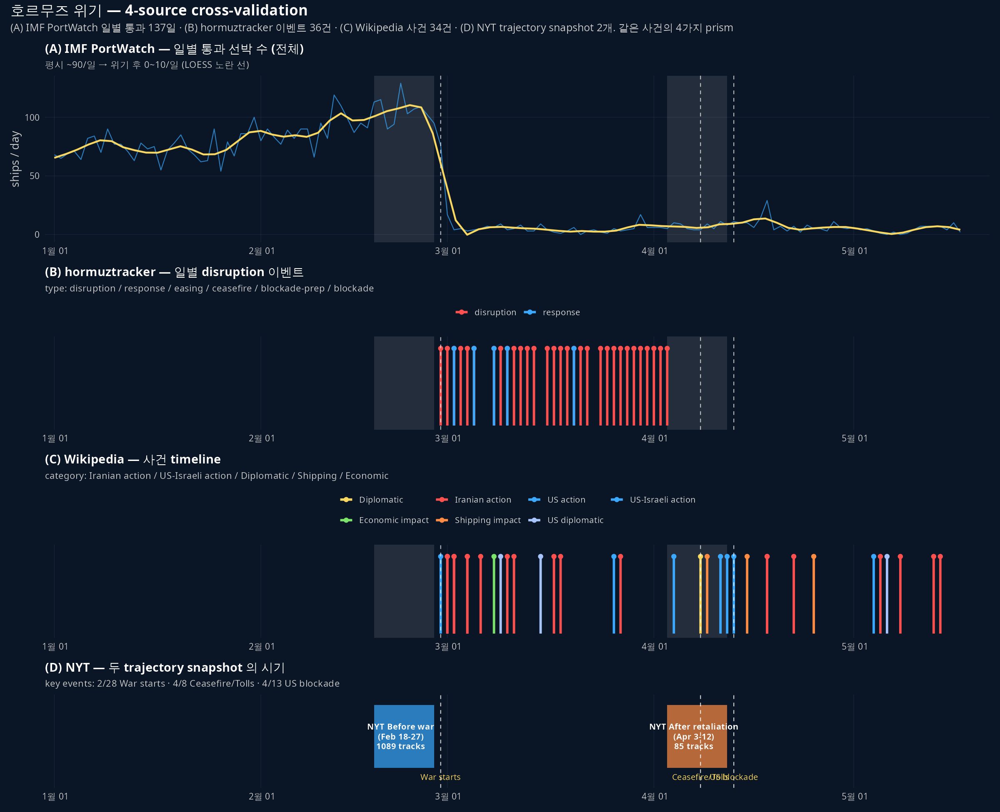

NYT 항적 데이터로 시작한 호르무즈 위기 분석에 6개 source 를 더했다. 같은 사건을 7개 prism 으로 본 후, 정량 일관성·시간 cover·design choice 를 비교.

## source 한눈에

| # | source | 형식 | 시기 cover | 라이선스 |
|---|---|---|---|---|
| 1 | **NYT (Holder 외 2026-04-16)** | per-vessel trajectory (1089+85) | Feb 18-27 + Apr 3-12 | NYT 저작권 |
| 2 | **IMF PortWatch** | 일별 chokepoint count by vessel type | 2019-01-01 ~ 2026-05-17 | public/CC |
| 3 | **Wikipedia 2026 Hormuz crisis** | 사건 timeline | Feb 28 ~ May 14 | CC BY-SA 4.0 |
| 4 | **hormuztracker.com** | 일별 disruption 이벤트·carrier·보험 | Feb 28 ~ Apr 14 | CC BY 4.0 |
| 5 | **Kpler (I'Anson 2026-04-07)** | oil supply·price·시나리오 | 6주차 분석 | Kpler 저작권 |
| 6 | **EIA Today in Energy** | pre-crisis baseline | 2024 + 2025 H1 | Public Domain |
| 7 | **IEA Oil Market Report Apr 2026** | global oil market 분석 | March-April | IEA free |

## 정량 일관성

핵심 metric 의 source 별 추정치. 일관되게 같은 그림을 그리는지 본다.

### 호르무즈 통행 (pre-crisis 평시)

| source | 값 | 단위 | 시기 |
|---|---|---|---|
| EIA | 20 | mb/d | 2024 평균 |
| IEA | >20 | mb/d | 2026-02 |
| IMF PortWatch | ~90 | ships/day (n_total) | 2019-2024 평균 |
| NYT (간접) | 130 | ships/day (기사 본문) | pre-war |

→ EIA·IEA 의 mb/d 와 IMF·NYT 의 ships/day 가 일치 (다른 단위). 평균 ship 당 ~150-220 kb/d cargo 추정.

### 위기 후 통행 (early April 2026)

| source | 값 | 단위 |
|---|---|---|
| IEA | 3.8 | mb/d |
| IMF PortWatch | ~10 | ships/day (4월 평균) |
| NYT trajectory | 85 트랙 (10일) ≈ 8.5/day | ships/day |
| CNN 본문 (Apr 29) | 191 vessels in April | ~6.4/day |

→ 네 source 다 일치 — 평시의 약 1/12 수준으로 폭락. 4월 4월 평균 ~7-10 ships/day.

### 국가별 생산 감소 (Kpler vs IEA)

| 국가 | Kpler (2026-04-07) | IEA (2026-03 vs Feb) |
|---|---|---|
| 사우디 | -2.5 | -2.85 |
| 이라크 | -3.3 | -2.59 |
| UAE | -2.0 | -1.02 |
| 쿠웨이트 | -1.6 | -1.39 |
| **합계** | **-9.4** | **-7.85** (OPEC-9 -9.4) |

→ 정량 차이는 있지만 같은 ranking (사우디·이라크 가장 큼). Kpler 는 "shut-in capacity", IEA 는 "actual production"으로 metric 정의 다름.

## 종합 figure

{fig-align="center"}

위 4-source 외에 EIA·IEA·Kpler 는 daily-level 시계열이 아닌 보고서·논평이라 별도 panel 화 X.

## 시기 cover 비교

```
        Feb 18      Feb 28          Apr 3-12    Apr 14       May 17
NYT       [-----before war-----]      [-after-]
IMF                                                                |  (2019부터 매일, 2026-05-17 까지)
HT                  [-----------------------]   (Feb 28-Apr 14)
WP                  [-------------------------------------]   (Feb 28-May 14)
Kpler                              [Apr 7 snapshot]
EIA                                                          [continuous baseline]
IEA                              [Mar-Apr report]
```

- NYT 는 **pre-war ↔ post-retaliation** 의 단 두 snapshot — 가장 spatial 풍부, 시간 cover 약함
- IMF 가 **가장 긴 cover** + 일별 count — temporal 풍부, spatial 없음
- Wikipedia 가 **5월 중순까지** cover — 다른 source 보다 후행 사건 (Operation Project Freedom 등) cover
- Kpler 는 한 snapshot 분석 하지만 numbers 가장 풍부

## design choice 차이

같은 데이터원 (Kpler·MarineTraffic·Vortexa·AIS) 에서 출발해도 보여주는 게 다름.

| source | 강조하는 차원 | 시각화 양식 |
|---|---|---|
| NYT | 공간 — 항로 시프트 (오만 측 → 이란 측) | 위성 + trajectory 다발 |
| IMF | 시계열 — 7년 baseline + 위기 폭락 | 시계열 + facet by vessel type |
| Wikipedia | narrative — 격침·외교·봉쇄 | dated bullet list |
| hormuztracker | dashboard — carrier·보험·daily metric | dashboard cards + timeline |
| Kpler | market — oil flow·가격·시나리오 | report prose + tables |
| EIA | baseline — 평시 구조 (capacity·share·routes) | factsheet |
| IEA | 글로벌 supply/demand 균형 | monthly report |

→ NYT 의 figure 가 강렬하지만 oil flow 의 양적 의미는 IEA 가 가장 명확 (3.8 vs 20 mb/d).

## 새로 알게 된 것

1. **NYT figure 의 1.5 M bbl/d 정량화** — "Iran allowed its own cargo to pass" 의 narrative 가 Kpler 의 **1.5 M bbl/d Iranian crude transiting** 으로 구체화
2. **봉쇄 후 4 월 통행이 평시의 ~8%** — IEA 3.8 / 20 mb/d, IMF ~6/일 / ~90/일 — 두 source 모두 같은 비율
3. **alternative route 우회 + 글로벌 supply 손실** — Saudi East-West + Fujairah + ITP 합계 max 7.2 mb/d (IEA April), pre-war 4 mb/d 에서 80% 증가. 그래도 글로벌 supply 12.8 mb/d 손실 메꿀 수는 없음
4. **NYT 데이터 윈도우 (4/12) 직후 핵심 사건**: 4/13 봉쇄 발효 / 4/18 이란 strait 재개 / 4/22 그리스 선박 나포 — Wikipedia 만 cover. NYT 가 한 달 늦었으면 더 풍부했을 것

## 한계 + caveat

- **single ground truth 부재** — AIS 자체가 dark shipping·spoofing 으로 한계 (NYT 본문 직접 명시). 모든 source 가 같은 AIS 데이터에 의존하므로 "독립" 이 아님
- **표본 비대칭** — NYT before 1089 vs after 85, source 별 cover 시기·해상도 다름
- **상용 데이터 (Kpler·Vortexa) 접근 못 함** — 본 cross-validation 은 공개·부분 추출 데이터로만
- **번역·LLM 추출 오류 가능** — Wikipedia·Kpler 본문 추출은 WebFetch LLM 거침. 학술 인용 시 원문 직접 검증 필수

## 산출물

- 종합 출처 카탈로그: `data/SOURCES.md` (§2.1 ~ §2.8 + §3-7)
- 데이터: `data/{NYT_hormuz, imf_portwatch, hormuztracker, wikipedia_crisis, kpler, eia, iea}/`
- 스크립트: `260521_연_cross_validation_종합_R.R`, `260521_연_호르무즈IMFPortWatch_R.R` 등
- figure: 4-source panel + 3-chokepoint 비교 + 항구 top 10 + IMF 장기

본 cross-validation 으로 호르무즈 위기의 정량 baseline 이 확보됨. 다음은 본 데이터 위에서 가설 노트 v0.1 작성.
