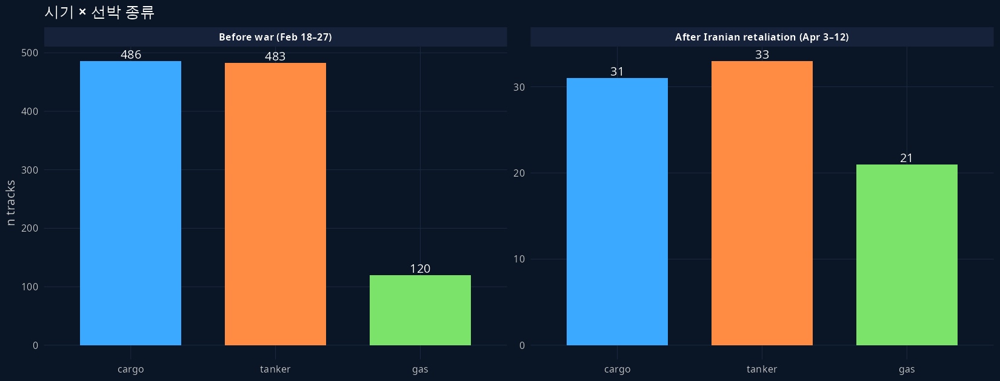
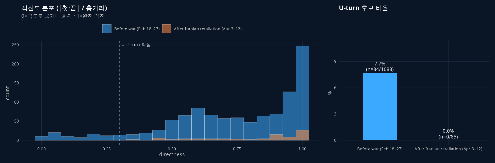
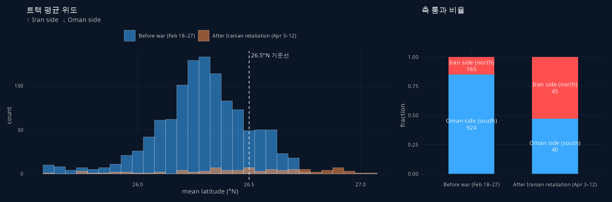
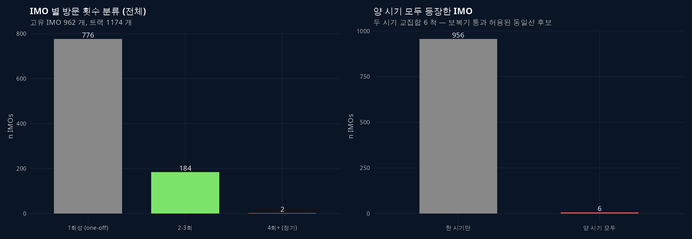
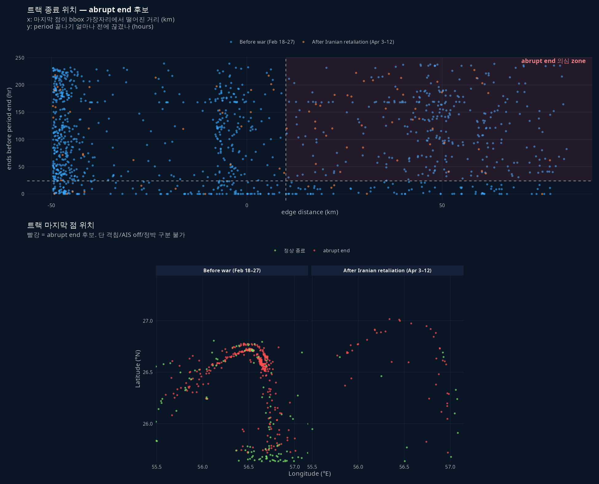
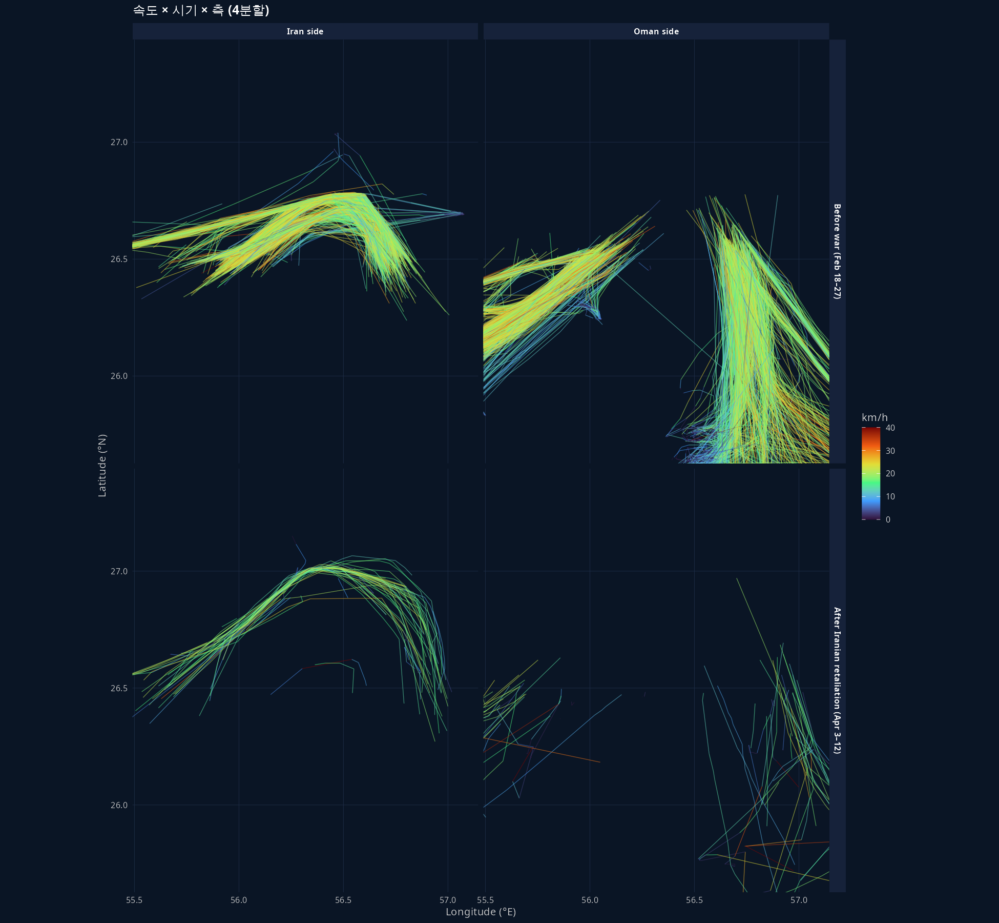

## 0. 한 줄 요약

NYT 호르무즈 데이터셋 (1174 트랙) 을 **6개 차원으로 grouping** 해서 EDA. 시기·선박 종류·U-turn·이란 vs 오만 측 통과·재방문 IMO·트랙 abrupt end. NYT 본문 narrative 가 데이터 측에서 어떻게 정량화되는지 확인.

> **선행 글**: [연구 ▷ 호르무즈 ▷ NYT 항적 figure 재현](260520_8f95a4.html) — 데이터 출처·구조·좌표 시스템.

## 1. 데이터 개관

| 항목 | Before war (Feb 18–27) | After Iranian retaliation (Apr 3–12) |
|---|---|---|
| 트랙 수 | 1089 | 85 |
| 점 수 | 21,100 | 1,004 |
| 기간 | 10일 | 9.92일 |
| 고유 IMO | 962 (양 시기 통합) | (6 척이 양 시기 모두 등장) |

{fig-align="center"}

## 2. 카테고리 정의

| # | 카테고리 | 계산법 |
|---|---|---|
| ① | 시기 | 어느 JSON 파일 |
| ① | 선박 종류 | `tracks.g` ∈ {cargo, tanker, gas} |
| ② | U-turn 유무 | `directness = (시작·끝 직선거리) / (총 이동거리)` < 0.3 면 U-turn 후보 |
| ③ | 이란 측 / 오만 측 | 트랙 평균 위도 > 26.5°N → Iran side |
| ④ | 재방문 빈도 | 동일 IMO 의 트랙 개수 (1회성 / 2-3회 / 4회+), + 두 시기 모두 등장 여부 |
| ⑤ | abrupt end | 마지막 점이 bbox 가장자리에서 >10km, 그리고 period 끝나기 24h+ 전에 끊김 |

::: {.callout-important collapse="true" title="해석: abrupt end ≠ 격침"}
트랙이 strait 한복판에서 끝났다고 격침이라 단정 X. 가능 원인:

1. **격침** (실제 침몰)
2. **AIS off** (dark shipping — 제재 회피)
3. **AIS 변조** (NYT 본문도 *"vessels can hide or falsify"* 명시)
4. **정박 / 대기** (해상에서 입항 허가 기다림)
5. **Kpler 데이터 cutoff** (벤더 측 추적 종료)

→ 본 EDA 에서는 **"의심 신호"** 로만 다룸. 진짜 격침 확인은 외부 source (Lloyd's casualty list, news cross-reference) 필요.
:::

## 3. ② U-turn — directness 분포

{fig-align="center"}

- **Before war**: 7.7% (84/1088) — 일부 화물 환적·왕복 운항 등 정상 회귀 패턴
- **After Iranian retaliation**: **0%** (0/85)

::: {.callout-tip collapse="true" title="보충: NYT 본문의 Rich Starry U-turn 이 왜 0% 인가"}
NYT 본문이 강조한 Rich Starry (중국 탱커) 의 U-턴 사건은 **2026-04-14 미 봉쇄 발효 직후** 발생. 본 데이터는 4월 12일까지라 그 사건은 윈도우 밖. 데이터가 봉쇄 후를 cover 했다면 U-turn 비율이 분명 올라갔을 것.
:::

## 4. ③ 이란 측 / 오만 측 통과

{fig-align="center"}

| 시기 | Oman side (≤26.5°N) | Iran side (>26.5°N) | Iran 비율 |
|---|---|---|---|
| Before war | **924** (85%) | 165 | 15% |
| After Iranian retaliation | 40 (47%) | **45** | **53%** |

::: {.callout-note collapse="true" title="증명-스타일: NYT narrative 의 직접 정량화"}
NYT 본문 발췌:

> "But two weeks into the war, ships suddenly began avoiding the official lanes, instead **traversing shallower waters near Iran**, possibly for a fee."

데이터:

- Before: 85% 가 Oman side (표준 심해 항로)
- After: **53% 가 Iran side** (보복기에 다수가 이란 쪽으로 이동)

다수–소수가 뒤집힘 — narrative 가 데이터 측에서 결정적으로 검증됨.
:::

## 5. ④ 재방문 IMO

{fig-align="center"}

- 고유 IMO **962 척** — 1174 트랙 중 80.5% 가 1회성
- 4회+ 정기 운항선 **2 척** 만
- **양 시기 모두 등장한 IMO 6 척** — "이란이 보복기에 통과 허용한 동일선" 후보

::: {.callout-tip collapse="true" title="보충: 6척이라는 숫자의 함의"}
NYT 본문: *"Iran allowed ships carrying its own cargo to pass through the strait, even as it attacked commercial vessels."*

양 시기 모두 등장한 6 척은 **(a) 이란 연계 선박** 이거나 **(b) 우연히 같은 항로를 두 번 운항한 일반선**. 후속 분석으로 이들의 IMO 를 외부 DB (equasis.org, OFAC SDN list) 와 매칭하면 어느 쪽인지 가려낼 수 있음.

`results/numeric/260521_연_NYT호르무즈EDA_R.R/track_features.csv` 에서 `imo_in_both==TRUE` 필터로 6 척 IMO·name 추출 가능.
:::

## 6. ⑤ 트랙 abrupt end — 의심 사건 후보

{fig-align="center"}

- **Before war**: 319 / 1089 = **29.3%**
- **After Iranian retaliation**: 43 / 85 = **50.6%** ← 2배 가까이

::: {.callout-important collapse="true" title="해석: After 의 abrupt end 가 2배"}
보복기엔 절반 가까운 트랙이 strait 한복판에서 끊김. §2 의 5가지 원인 중 어느 것이 우세한지는 데이터만으로 가릴 수 없지만, 정황상:

- **AIS off (dark shipping)**: 이란이 묵인하는 통과 또는 제재 회피 운항 — 가능성 높음
- **정박/대기**: 봉쇄 이전이라 대기 자체는 동기가 약함
- **격침**: 기사 본문은 "공격" 만 언급하고 격침 사례를 특정하지 않음 — 가능성 낮음
- **Kpler cutoff**: 가능하지만 두 시기에 동일하게 적용되어야 — 비대칭이라 후순위

가장 흥미로운 가설: **보복기 통과 선박이 AIS 를 끄고 들어와서 끝까지 추적 안 됨**. 후속 분석으로 abrupt end 후보의 마지막 위치·선종·시각 패턴 보면 됨.

`results/numeric/260521_연_NYT호르무즈EDA_R.R/abrupt_end_candidates.csv` 에 362 트랙의 IMO·종료위치·종료시각 저장.
:::

## 7. ⑥ (보너스) 속도 × 시기 × 측 (4분할)

{fig-align="center"}

종합 시각화 — 4 분할로 보면:

- **Before × Oman**: 다발 진하고 노란/연두 (정상 cruise). NYT 본문의 표준 항로.
- **Before × Iran**: 소수 — 평소엔 거의 안 다니는 쪽.
- **After × Oman**: 듬성듬성 + 빨강 다수 = 천천히 / 멈춤.
- **After × Iran**: 보복기의 노란 항적 — 이란 쪽 얕은 물로 새로 생긴 항로.

## 8. 다음 단계 후보

- **abrupt end 후보 362 트랙의 외부 lookup** — equasis.org / OFAC SDN list 와 IMO 매칭 → "AIS off vs 정상" 가려내기
- **시기 봉쇄 후 데이터 확보** — Apr 14 이후 트랙으로 Rich Starry U-turn 사건 직접 검증 (현재는 NYT 측이 별도 figure 로만 다룸, raw JSON 미공개)
- **AIS sampling 간격 분석** — abrupt end 와 별개로, 정상 트랙도 sampling 패턴 anomaly 가 있는지 (예: 갑자기 1시간+ 간격이 뜨면 dark 의심)
- **방향 분류** — 페르시아만 → 외양 vs 외양 → 페르시아만. 첫·끝 점의 bbox 변 (북/남/동/서) 으로 분류

산출물:

- 코드: `260521_연_NYT호르무즈EDA_R.R`
- 데이터: `results/numeric/260521_연_NYT호르무즈EDA_R.R/track_features.csv` (1174 행, 트랙 단위 feature 13개), `seg_clean.csv`, `imo_summary.csv`, `abrupt_end_candidates.csv`
