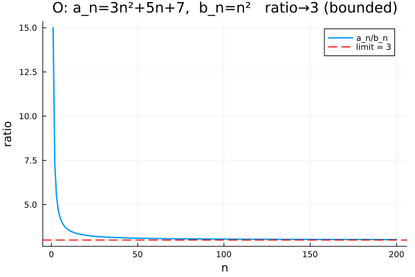
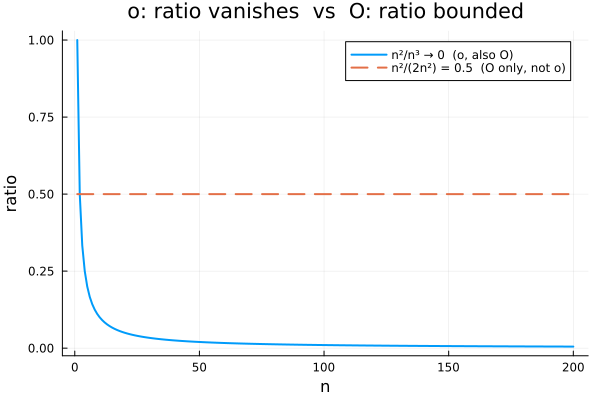
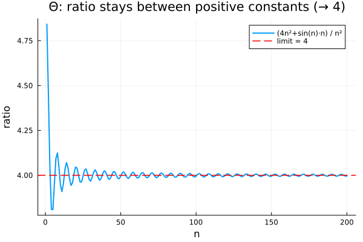
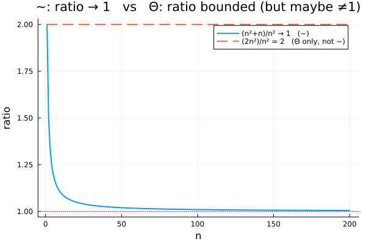
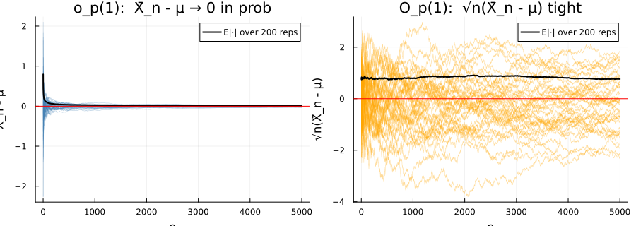

<!-- 소유권자: 리이 | 사용자: 리이 -->

```{=html}
<style>
.math.display { text-align: left; }
mjx-container[display="true"] { text-align: left !important; margin-left: 0 !important; }
.katex-display { text-align: left !important; }
.katex-display > .katex { text-align: left !important; }
</style>
```

대표 강의글 [`250818_공부_Big-O,Little-o,Theta,Tilde,Big-Op,little-op`](250818_42c0fc.html) 의 정의·표 정본을 코딩 예제로 보충하는 노트. 줄리아 시뮬은 회사 루트의 `260522_리이_BigO_litleo_줄리아예제.jl` 에서 한 번 돌리고 결과를 여기에 옮겼다. 핵심은 두 sequence $a_n, b_n$ 의 ratio $a_n / b_n$ 이 (i) 유계인가 — $O$, (ii) 0 으로 가는가 — $o$, (iii) 양쪽 상수 사이에 갇히는가 — $\Theta$, (iv) 1 로 가는가 — $\sim$ — 어느 양상인지 그림으로 직접 본다는 것. 공통 헤더부터.

```julia
using Plots, Statistics, Distributions, Random, Printf
Random.seed!(20260522)
n = 1:200      # 결정론 예제의 sequence index
```

`-` **예제 1 — Big-$O$ (upper bound).** $a_n = 3n^2 + 5n + 7$, $b_n = n^2$. ratio $a_n / b_n = 3 + 5/n + 7/n^2 \to 3$. 상한이 유계로 정해지면 $a_n = O(b_n)$. 첫 몇 값을 끊어 보자.

```julia
a1 = @. 3 * n^2 + 5 * n + 7
b1 = @. n^2
a1[1:5]              # [15, 29, 49, 75, 107]
```

```julia
b1[1:5]              # [1, 4, 9, 16, 25]
```

```julia
ratio1 = a1 ./ b1
(ratio1[1], ratio1[end])    # (15.0, 3.0252)
```

ratio 가 첫 $n=1$ 에서 15 였다가 $n=200$ 에서 3.03 으로 빠르게 안정화. 항상 어떤 상수 ($C = 15$ 정도) 로 유계 → $a_n = O(b_n)$ 성립.

{fig-alt="ratio of a_n=3n^2+5n+7 over n^2 converges to 3"}

`-` **예제 2 — little-$o$ (vanishing ratio).** $a_n = n^2$, $b_n = n^3$. ratio $a_n / b_n = 1/n \to 0$. 분모가 분자보다 *진짜로 빨리* 자란다 → $a_n = o(b_n)$. 대조로 ratio 가 0 으로 안 가는 (= $O$ 는 맞지만 $o$ 는 아닌) sequence 도 같이 본다.

```julia
a2 = @. n^2;  b2 = @. n^3
ratio2 = a2 ./ b2
(ratio2[1], ratio2[end])    # (1.0, 0.005)
```

```julia
# 대조: ratio 가 0 으로 안 감 — bounded constant 0.5
a2b = @. n^2;  b2b = @. 2 * n^2
ratio2b = a2b ./ b2b
ratio2b[1]                  # 0.5  for all n
```

진한 파란 곡선이 $1/n \to 0$ (little-$o$), 점선이 $0.5$ 상수 (Big-$O$ but **not** little-$o$). 둘 다 "유계" 라는 점에서는 $O$ 의 조건은 충족. 차이는 *0 으로 가는가* — 그게 little-$o$ 의 핵심.

{fig-alt="ratio n^2/n^3 vanishing vs ratio n^2/(2n^2) bounded constant"}

`-` **예제 3 — $\Theta$ (양쪽 bound).** $a_n = 4n^2 + \sin(n) \cdot n$, $b_n = n^2$. ratio = $4 + \sin(n)/n$ → 4. 단 $\sin$ 진동 때문에 path 위에서 살짝 흔들린다. 핵심은 ratio 가 *양쪽 양의 상수* 사이에 갇힌다는 사실.

```julia
a3 = @. 4 * n^2 + sin(n) * n
b3 = @. n^2
ratio3 = a3 ./ b3
(minimum(ratio3), maximum(ratio3))    # (3.8082, 4.8415)
```

ratio 가 모든 $n$ 에서 $[3.8, 4.9]$ 사이에 갇힌다. 즉 어떤 상수 $c, C > 0$ 에 대해 $c \cdot b_n \leq a_n \leq C \cdot b_n$ 모두 성립 → $a_n = \Theta(b_n)$. (수렴값 4 도 있어 $a_n \sim 4 b_n$ 도 성립하지만, 그건 다음 항.)

{fig-alt="ratio oscillates around 4 between positive constants"}

`-` **예제 4 — $\sim$ (asymptotic equality, ratio $\to 1$).** $a_n = n^2 + n$, $b_n = n^2$. ratio = $1 + 1/n \to 1$. 가장 강한 진술 — *위·아래로 단순히 같은 차수* 가 아니라 *1 이라는 그 상수까지 정확*. 대조로 ratio 가 1 이 아닌 다른 상수로 가는 경우도 (= $\Theta$ 는 맞지만 $\sim$ 은 아닌).

```julia
a4 = @. n^2 + n;  b4 = @. n^2
ratio4 = a4 ./ b4
(ratio4[1], ratio4[end])    # (2.0, 1.005)
```

```julia
# 대조: ratio = 2 (≠ 1) — Θ 맞지만 ∼ 는 아님
a4b = @. 2 * n^2
ratio4b = a4b ./ b4
ratio4b[1]                  # 2.0  for all n
```

진한 파란 곡선이 1 로 수렴 ($\sim$), 점선이 2 상수 ($\Theta$ 만 — $\sim$ 아님). 이 글의 출발이었던 fair walk 의 제곱 $E[X_n^2] = n$ 도 정확히 이 양식: $E[X_n^2] \sim n$ (또는 $= n$) 이라는 게 가장 정확하고, $\Theta(n)$ 도 맞고, $O(n)$ 도 맞고, $o(n)$ 만 틀린다.

{fig-alt="ratio converges to 1 (tilde) vs ratio stays at 2 (Theta only)"}

`-` **예제 5 — $O_p$ vs $o_p$ (probabilistic versions).** $X_1, X_2, \dots \overset{\text{iid}}{\sim} N(\mu, \sigma^2)$, $\mu = 2$, $\sigma = 1$. 표본평균 $\bar X_n$. 두 가지 진술:

  - $\bar X_n - \mu = o_p(1)$: WLLN. $\bar X_n - \mu \xrightarrow{p} 0$.
  - $\sqrt n\, (\bar X_n - \mu) = O_p(1)$: CLT. $\sqrt n (\bar X_n - \mu) \xrightarrow{d} N(0, \sigma^2)$ — 분포가 좁아지지도 발산하지도 않는 *tight*.

```julia
μ, σ = 2.0, 1.0
n_max, NREP = 5000, 200
Xbar_dev  = zeros(NREP, n_max)        # X̄_n - μ
sqrtn_dev = zeros(NREP, n_max)        # √n · (X̄_n - μ)
for rep in 1:NREP
    X = rand(Normal(μ, σ), n_max)
    cs = cumsum(X)
    for j in 1:n_max
        m = cs[j] / j
        Xbar_dev[rep, j]  = m - μ
        sqrtn_dev[rep, j] = sqrt(j) * (m - μ)
    end
end
size(Xbar_dev)               # (200, 5000)
```

```julia
# o_p(1): |X̄ - μ| 의 평균이 n 커지면서 0 으로
( mean(abs.(Xbar_dev[:, 10])), mean(abs.(Xbar_dev[:, end])) )
# → (0.2564, 0.010796)   → 0 으로 줄어듦 → o_p(1)
```

```julia
# O_p(1): √n · |X̄ - μ| 의 평균이 n 무관 거의 일정
( mean(abs.(sqrtn_dev[:, 10])), mean(abs.(sqrtn_dev[:, end])) )
# → (0.8107, 0.7634)   → σ·√(2/π) ≈ 0.7979 근처 안정 → O_p(1)
```

왼쪽 panel 의 path 들이 0 으로 수렴 ($o_p(1)$), 오른쪽 panel 은 폭은 줄어들지 않고 일정한 진동 ($O_p(1)$). probabilistic 오더는 deterministic 오더와 *수렴 양식* (a.s. / in prob / in dist) 의 차이를 빼면 같은 게임. CLT 가 $O_p(1)$ tightness 의 표준 source 이고, WLLN 이 $o_p(1)$ vanishing 의 표준 source.

{fig-alt="o_p(1): Xbar - mu vanishes;  O_p(1): sqrt(n)(Xbar-mu) tight"}

다섯 예제를 한 표로 묶으면 대표 글의 T/F 표가 시뮬로 검증된다. ratio 가 어떻게 자라거나 줄어드는가만 보면 어느 오더에 해당하는지 즉각 판정된다 — $\sim$ ⊊ $\Theta$ ⊊ $O$ 의 포함 관계, $o$ 는 $\Theta$ 와 disjoint ($\Theta$ 는 ratio 의 lower bound 가 양이라야 하는데 $o$ 는 ratio 가 0 으로 가야 함). probabilistic 버전 $O_p$, $o_p$ 도 ratio 의 *분포* 가 tight 인지 *0 으로 수렴* 하는지의 차이로 같은 구도가 유지된다.

전체 줄리아 코드와 figure 는 회사 루트 `260522_리이_BigO_litleo_줄리아예제.jl` + `results/figures/260522_리이_BigO_litleo_줄리아예제.jl/`. seed `20260522`, 결정론 예제는 $n=1..200$, probabilistic 예제는 $n_{\max}=5000$, 200 reps.
