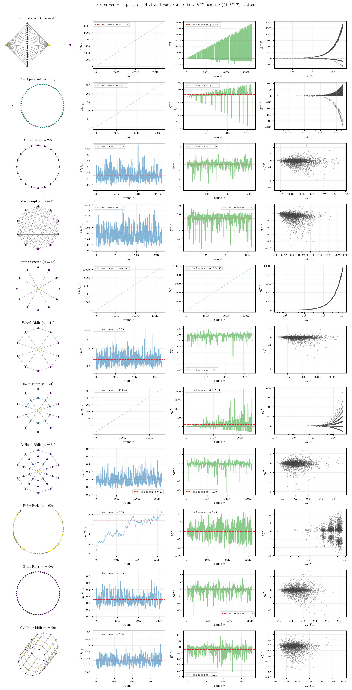
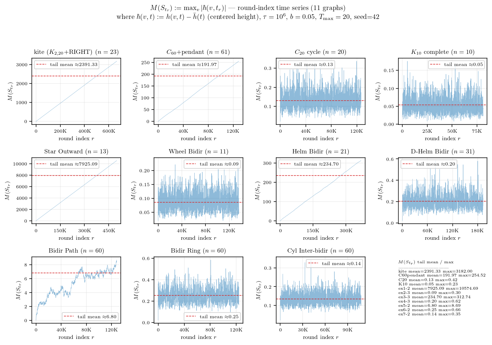
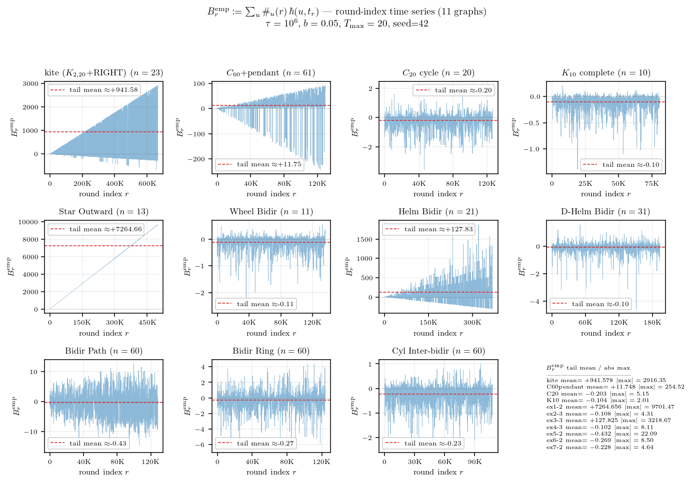
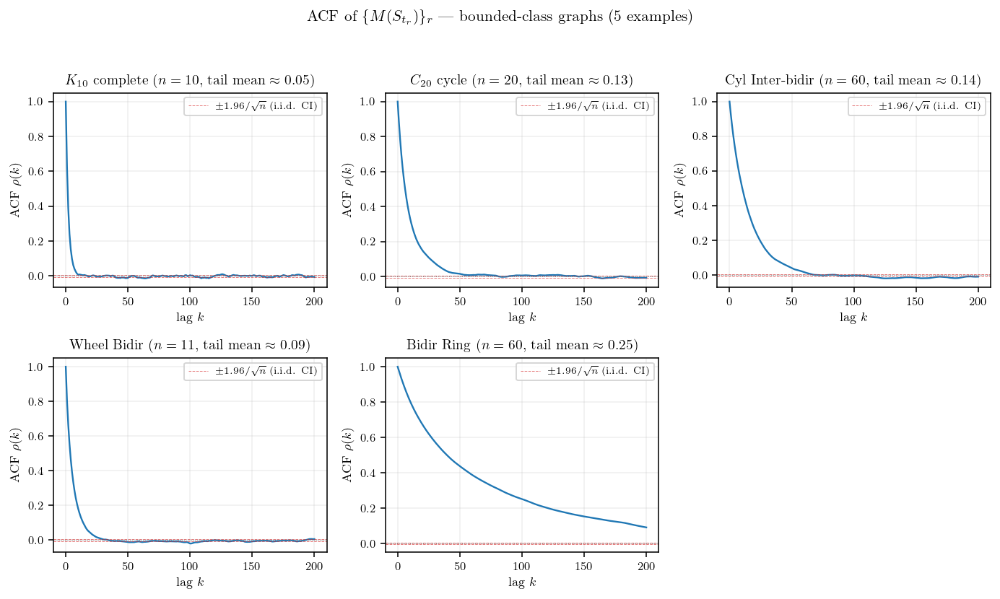
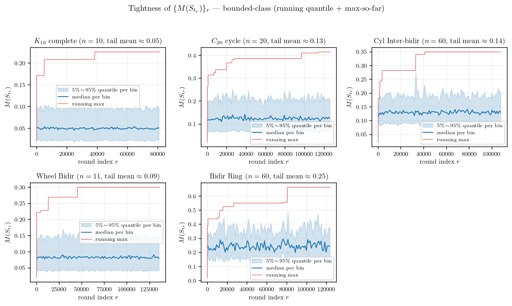
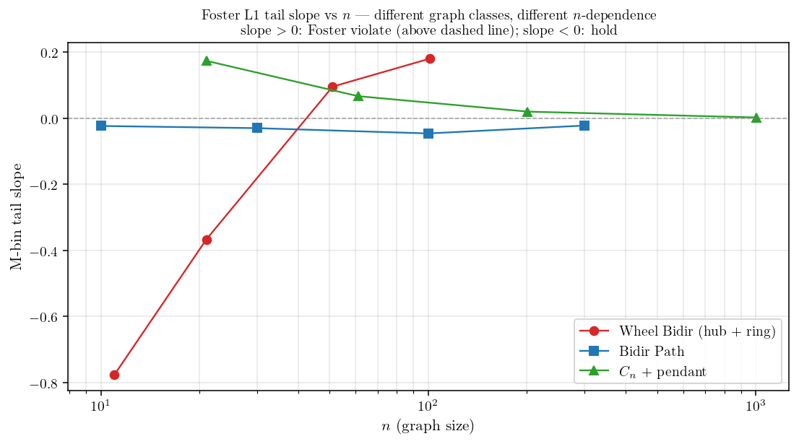

<!-- 소유권자: 소미 | 사용자: 소미 -->
<!-- Modified: 2026-05-22 by 소미 -->

에이의 ABC 통합증명 PDF §3.4 의 Foster's drift criterion (Assumption 1) 이 그래프와 파라미터에 따라 실제로 잘 성립하는지 실험으로 본다. 검증 대상은 다음 11 그래프 — 4 base ($K_{10}$ complete, $C_{20}$ cycle, kite, $C_{60}$+pendant) + `examples_24` 예제 7개 (Star Outward, Wheel/Helm/D-Helm Bidir, Bidir Path/Ring, Cyl Inter-bidir). degree heterogeneity 와 graph symmetry 가 다양하게 분포하도록 골랐다. 각 그래프마다 full HST 시뮬 (정본 algorithm: downstream-filter, model B: round 별 $b' \sim {\rm Unif}(0,b)$ 1회 draw) 을 $T_{\rm VAL}=10^6$ step, $T_{\max}=20$ (maxflow), $b=0.05$, seed=42 로 1회 돌려 round 별 $(M_r, B^{\rm emp}_r)$ sample 을 수집.

11 그래프 각각의 (그래프 layout / $M(S_{t_r})$ 시계열 / $B^{\rm emp}_r$ 시계열 / $(M_r, B^{\rm emp}_r)$ 산점도) 4-view. 그룹 패턴이 한눈에 갈린다 — graph 가 fully symmetric 이면 $M, B$ 모두 0 부근 bounded + 산점도 작은 cloud, graph 가 비대칭이면 $M, B$ 모두 round 따라 거의 선형으로 발산 + 산점도가 우상향 cloud.

그래프 클래스에 따라 $M(S_{t_r})$ 시계열이 두 종류로 명확히 나뉜다. 

- 그룹A: fully symmetric (Cycle, Complete, Ring, Cylinder bidir, D-Helm) 은 시계열이 작은 상수 (∼ 1) 부근에서 흔들리는 bounded process. 이런것들은 height range 가 시간이 흘러도 일정 scale 위로 안 커진다.
- 그룹C: 비대칭 그래프 (kite, Helm Bidir, Star Outward, $C_{60}$+pendant, Bidir Path) 는 시계열이 round 가 진행할수록 거의 선형으로 발산. 이런것들은 height range 가 무한히 커진다.

같은 round 별로 paired 양 $B^{\rm emp}_r := \sum_u \#_u(r)\, \hbar(u, t_r)$ 의 시계열을 같이 보면, $M$ 시계열과 정확히 같은 정성 분류가 나온다.

그룹 A 6 그래프 ($K_{10}, C_{20}$, Cyl Inter-bidir, Wheel Bidir, Bidir Ring, D-Helm Bidir) 모두 $B^{\rm emp}$ tail mean 이 0 부근 음수 ($-0.10 \sim -0.27$) — round 가 진행될수록 $B$ 가 음수로 깔린다. 이는 Foster's drift criterion 의 "복원력" 의 약한 (평균 sense) 증거. 그룹 C 5 그래프 중 강 violate (Star Outward $+7265$, kite $+942$, Helm Bidir $+128$, $C_{60}$+pendant $+11.7$) 는 큰 양수로 발산. Bidir Path 는 예외 — $M$ 자체는 작은 발산 (tail $\approx 6.8$) 인데 $B^{\rm emp}$ tail mean $-0.43$ 으로 음수 (large-$M$ 영역의 slope 도 strict hold, 아래 참조). $B$ 시계열의 부호 패턴 자체가 Foster L1 의 graph-별 정성 판정.

---

수열 $\{M(S_{t_r})\}_r$ 자체의 성질이 궁금하다. 독립인가, correlated 인가, mixing 인가, 확률적 유계 ($O_p(1)$) 인가? 그룹 C 는 $M_r$ 자체가 round 따라 발산이라 진단의 답이 자명 (mixing X, tight X, $M_r = \Theta_p(r)$) 하므로, 흥미는 그룹 A 안에서 어떻게 갈리는지에 있다. 그룹 A 6 그래프 ($K_{10}$, $C_{20}$, Cyl Inter-bidir, Wheel Bidir, Bidir Ring, D-Helm Bidir) 에 진단을 적용한다.

sample autocorrelation $\rho(k) := \mathrm{Corr}(M_r, M_{r+k})$ — i.i.d. 이면 lag 1 부터 $\pm 1.96/\sqrt{n}$ 신뢰구간 안. 그룹 A 6 그래프 모두 lag-1 ACF $\rho(1) \in [0.63, 0.98]$ — 강 양상관, 명백히 독립이 아니다. mixing 속도는 그래프마다 차이가 크다. $K_{10}$, $C_{20}$, Cyl Inter-bidir, Wheel Bidir 는 lag 100 부근에서 $\rho \approx 0$ 으로 수렴 — 짧은 lag 안에 mixing (정본 algorithm 에서 modelB raw 의 mixing speed 가 빠름). Bidir Ring 과 D-Helm Bidir 는 lag 100 에서도 각각 $\rho \approx 0.25$, $\rho \approx 0.30$ 로 long-range correlated.

각 그래프의 round 구간 100 bin 으로 나눠 bin 별 5/50/95 quantile band + running max. 그룹 A 6 그래프 모두 quantile band 가 후미에서 일정 range 안에서 흔들리고, running max 도 작은 절대값 안에서 잡혀 있다. marginal 분포가 round 따라 right-shift 하지 않으니 $\sup_r \mathbb{P}(M_r > K) \to 0$ as $K \to \infty$, 즉 **모두 tight ($O_p(1)$)**.

그룹 C 는 시계열 figure 가 그대로 답 — mixing X, not tight, $M_r = \Theta_p(r)$. 그룹 A 6 그래프의 measurement 와 통합 답:

| 질문 | $K_{10}$ | $C_{20}$ | Cyl IB | Wheel | Bidir Ring | D-Helm | 비고 |
|---|---|---|---|---|---|---|---|
| 독립 / correlated (lag-1 ACF) | $0.63$ | $0.89$ | $0.93$ | $0.80$ | $0.98$ | $0.98$ | 독립 ✗, 모두 correlated ($\ge 0.63$) |
| mixing (lag-100 ACF) | $0.00$ | $0.01$ | $0.00$ | $-0.02$ | $0.25$ | $0.30$ | 4 그래프 mix 빠름, Ring/D-Helm long-range |
| $M$ tail mean | $0.05$ | $0.13$ | $0.14$ | $0.09$ | $0.25$ | $0.20$ | 모두 $< 1$ |
| $O_p(1)$ / tight? | yes | yes | yes | yes | yes | yes | ✓ (모두 tight) |

Foster's drift criterion (Assumption 1) 은 어떤 graph-level constant $\varepsilon_B > 0$, $C_B \ge 0$ 가 존재해서 모든 round 에서

$$B(S_{t_r}) \;\le\; -\varepsilon_B\, M(S_{t_r}) + C_B$$

가 성립하길 요구하는데, 여기서 $B(S_{t_r}) = \sum_u \pi(u, S_{t_r}) \hbar(u, t_r)$ 는 round 시작 시점의 weighted height deposit (Lemma 3 정의), $\pi(u, S) = \mathbb{E}[\#_u | S_{t_r}]$ 는 round 길이 동안 노드 $u$ 의 visit count 의 조건부 기댓값이다. 이 가정의 핵심 함의는 결국 height range $M(t)$ 가 시간 흐름에서 bounded 라는 것이다 — $\varepsilon_B > 0$ 가 작동하면 큰 $M$ 에서 음의 drift 가 작용해 $M$ 이 다시 작아져 stationary 분포 위에 머문다 (positive Harris recurrence). 가정이 깨지면 $M$ 이 발산. 직관적으로 **복원력은 large-$M$ 영역에서만 작동한다** — 작은 $M$ 영역에선 $C_B$ term 가 noise 를 흡수해 $B$ 가 양수도 음수도 OK, balanced 만 만족하는 그래프와 Foster 가 발효되는 그래프가 사실상 구분 안 된다. 두 condition 의 차이는 $-\varepsilon_B M$ term 가 dominant 해지는 large-$M$ tail 의 slope 부호 하나로 갈린다.

그러니 $M$ 시계열의 long-run behavior 가 가정의 진짜 의미를 직접 보여준다 — 위 시계열 figure 가 그 자체로 Assumption 1 의 graph-별 검증이다.

가정의 정량 검증은 $\mathbb{E}[B \mid M]$ 의 large-$M$ 부호. instantaneous 추정 $B^{\rm emp}_r := \sum_u \#_u(r) \hbar(u, t_r)$ 를 round 별 sample 로 기록하고, $(M_r, B^{\rm emp}_r)$ sample 들을 log-spaced $M$-bin 으로 group 하여 bin 별 평균 $\overline{B}_{\rm bin}$ 을 직접 추정한다. 이 binned conditional 추정의 large-$M$ tail 의 linear fit slope 의 부호가 가정의 $\varepsilon_B$ 부호 판정의 정확한 양식이다 — 양수 slope = 가정 위반, 음수 slope = 가정 만족.

11 그래프 각 panel 의 $(M_r, B^{\rm emp}_r)$ scatter (회색) + ($M$-bin center, $\overline{B}_{\rm bin}$) marker (파랑) + 후미 절반 bin 의 linear fit (빨강 dashed) + jackknife (bin-level LOO) 로 추정한 slope 의 $\pm 1.96\,\text{SE}$ band. CI 가 0 의 한쪽에 strictly 머무는지가 판정 기준:

| 그래프 | tail slope $\pm$ 1.96 SE | 95% CI | Foster L1 |
|---|---|---|---|
| $C_{20}$ cycle | $-1.070 \pm 0.572$ | $[-1.64,\,-0.50]$ | $\checkmark$ **hold** |
| Wheel Bidir | $-0.776 \pm 0.506$ | $[-1.28,\,-0.27]$ | $\checkmark$ **hold** |
| Bidir Ring | $-0.662 \pm 0.581$ | $[-1.24,\,-0.08]$ | $\checkmark$ **hold** |
| Bidir Path | $-0.030 \pm 0.004$ | $[-0.034,\,-0.026]$ | $\checkmark$ **hold** |
| $K_{10}$ complete | $-0.186 \pm 0.476$ | $[-0.66,\,+0.29]$ | ? border (CI $\ni 0$) |
| D-Helm Bidir | $-0.013 \pm 0.076$ | $[-0.09,\,+0.06]$ | ? border (CI $\ni 0$) |
| Cyl Inter-bidir | $+0.352 \pm 1.030$ | $[-0.68,\,+1.38]$ | ? border (CI $\ni 0$) |
| $C_{60}$+pendant | $+0.066 \pm 0.004$ | $[+0.06,\,+0.07]$ | $\times$ violate |
| kite | $+0.426 \pm 0.004$ | $[+0.42,\,+0.43]$ | $\times$ violate |
| Helm Bidir | $+0.580 \pm 0.004$ | $[+0.58,\,+0.58]$ | $\times$ violate |
| Star Outward | $+1.005 \pm 0.001$ | $[+1.00,\,+1.01]$ | $\times$ violate |

jackknife CI 를 같이 보면 판정 reliability 가 명확해진다. **strict hold 4 그래프** ($C_{20}$, Wheel Bidir, Bidir Ring, Bidir Path) — CI 가 strictly negative. **strict violate 4 그래프** (kite, Helm Bidir, Star Outward, $C_{60}$+pendant) — CI 가 strictly positive. **border 3 그래프** ($K_{10}$, D-Helm Bidir, Cyl Inter-bidir) — CI 가 0 을 포함. 흥미로운 case 는 Bidir Path — $M$ tail mean $\approx 6.8$ (그룹 C 측 발산 신호) 인데 large-$M$ slope 는 strict negative (CI $[-0.034, -0.026]$). $M$ 자체는 약 발산하지만 $-\varepsilon_B M + C_B$ 의 음의 drift 가 large-$M$ 에서 작동.

위 11 그래프 결과는 본문 시뮬의 graph instance 별 finite-$n$ 측정. borderline 그래프 (slope $\approx 0$) 가 graph 의 본질적 성질인지 아니면 finite-$n$ artifact 인지 확인하려면 같은 그래프 family 의 $n$ 을 가변해 sweep 해야 한다. 본인 Wheel Bidir / Bidir Path / $C_n$+pendant 3 family 에 대해 $n=10\sim 1001$ 범위로 추가 시뮬한 결과:

세 family 의 $n$-의존성이 정반대다.

- **Wheel Bidir** ($n=11 \to 21 \to 51 \to 101$): tail slope $-0.78 \to -0.37 \to +0.10 \to +0.18$. **$n=21 \to 51$ 사이 transition** — small-$n$ 에서는 hold, $n \ge 51$ 에서 violate. hub deg $= n-1 \to \infty$ 와 ring node deg $= 3$ 고정의 비대칭이 graph 크기 따라 violate 측으로 발현.
- **Bidir Path** ($n=10 \to 30 \to 100 \to 300$): slope $-0.023 \to -0.030 \to -0.046 \to -0.022$. **모든 $n$ 에서 strict hold** — $M$ 자체는 약 발산이지만 large-$M$ slope 가 일관되게 음수.
- **$C_n$+pendant** ($n=21 \to 61 \to 201 \to 1001$): slope $+0.17 \to +0.067 \to +0.020 \to +0.0023$. $n$ 클수록 violate 약화 — pendant 비중 $= 1/n \to 0$ 라 큰 ring 의 perturbation 이 사라지며 ring 자체의 균등성에 수렴.

본문 11 그래프 중 Wheel Bidir 는 small-$n$ ($n\le 21$) 에서 strict hold 이고 large-$n$ ($n\ge 51$) 에서 violate 로 transition — graph instance 한 점만 측정하면 잘못된 분류 가능. $C_n$+pendant 는 large-$n$ 에서 hold 로 수렴, Bidir Path 는 모든 $n$ 에서 strict hold. **그래프 클래스의 Foster L1 hold/violate 판정은 asymptotic 거동 ($n \to \infty$) 으로 확인해야 robust 하다.**

결론적으로 Assumption 1 은 ABC 의 핵심 hypothesis 로서 graph geometry 에 따라 strictly 만족·strictly 위반·border 의 세 영역으로 갈린다. 본 11 그래프 검증에서 jackknife CI 기준 **strict hold 4 그래프** ($C_{20}$, Wheel Bidir, Bidir Ring, Bidir Path), **strict violate 4 그래프** (kite, Star Outward, Helm Bidir, $C_{60}$+pendant), **border 3 그래프** ($K_{10}$, D-Helm Bidir, Cyl Inter-bidir) 로 갈린다. 평균 sense ($B^{\rm emp}$ tail mean 음수) 의 weak Foster 는 그룹 A 6 그래프 모두 만족하지만, strict large-$M$ slope 검증은 더 엄격. Theorem A (balanced) 의 적용 범위는 large-$n$ Cycle 류, large-$n$ pendant-perturbed ring, fully symmetric Wheel small-$n$, Path 등으로 확장되지만, 비대칭이 graph 크기에 따라 발산하는 그래프 (Star Outward, Helm, kite, Wheel large-$n$) 에서는 Foster-Lyapunov 가 직접 적용되지 않는다. Brémaud Lem 8.2.3 (essential edge) + Thm 8.3.8 (Rayleigh) 의 graph geometry 도구로 위반 mechanism (small-conductance bottleneck) 의 정확한 식별, 그리고 border 3 그래프의 본질 판정 (finite-$\tau$ artifact vs 본질적 borderline) 이 후속 과제.

## 어펜딕스. 표기 정리 (에이 `abc공유용_v2.tex` §1.1, §3.3, §3.4)

| 양 | 정의 |
|---|---|
| $\hbar(u, t_r)$ | centered height $= h(u, t_r) - \bar h(t_r)$ |
| $\Phi(t_r)$ | Lyapunov fn $= \sum_u \hbar(u, t_r)^2$ (height variance) |
| $M(S_{t_r})$ | $:= \max_v \lvert \hbar(v, t_r) \rvert$ (centered height range; Fact 2 로 $\max h - \min h \in [M, 2M]$) |
| $\#_u$ | round 동안 $u$ visit count |
| $\pi(u, S) := \mathbb{E}[\#_u \mid S_{t_r}]$ | round 동안 $u$ expected visits (state-dependent) |
| $B(S) := \sum_u \pi(u, S) \, \hbar(u, t_r)$ | expected weighted height deposit — visit-weighted centered height |
| $\varepsilon_B, C_B$ | graph-level Foster drift constants ($\varepsilon_B > 0$, $C_B \ge 0$) |
| $C_{M\text{-free}} := (T_{\max} + 1) b^2 [T_{\max}/2 + (n-1)/(3n)]$ | universal remainder bound ($n$, $b$, $T_{\max}$ 만 의존) |

##### 시뮬 코드와 figure 생성 코드는 본인 책상에 보관: `260524_소미_foster_verify_modelB.py` (정본 algorithm + model B), `260524_소미_foster_M_series.py` ($M$ 시계열), `260524_소미_foster_B_series.py` ($B^{\rm emp}$ 시계열), `260524_소미_foster_M_diag.py` (ACF + tightness), `260524_소미_foster_M_bin_with_scatter.py` ($M$-bin conditional + scatter + jackknife CI), `260524_소미_wheel_n_sweep.py` + `260524_소미_borderline_n_sweep.py` ($n$-sweep), `260524_소미_foster_combined_view.py` (4-view), `260523_소미_foster_intuition.py` (Foster 부등식 직관, sim 무관). raw 캐시: `results/numeric/260524_소미_foster_verify_modelB.py/*_foster_verify_modelB.npz`.
