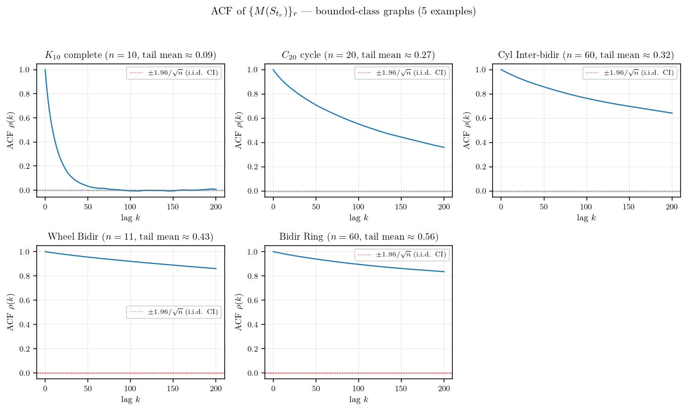
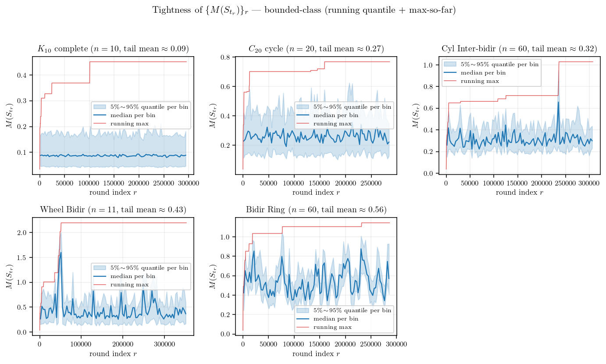
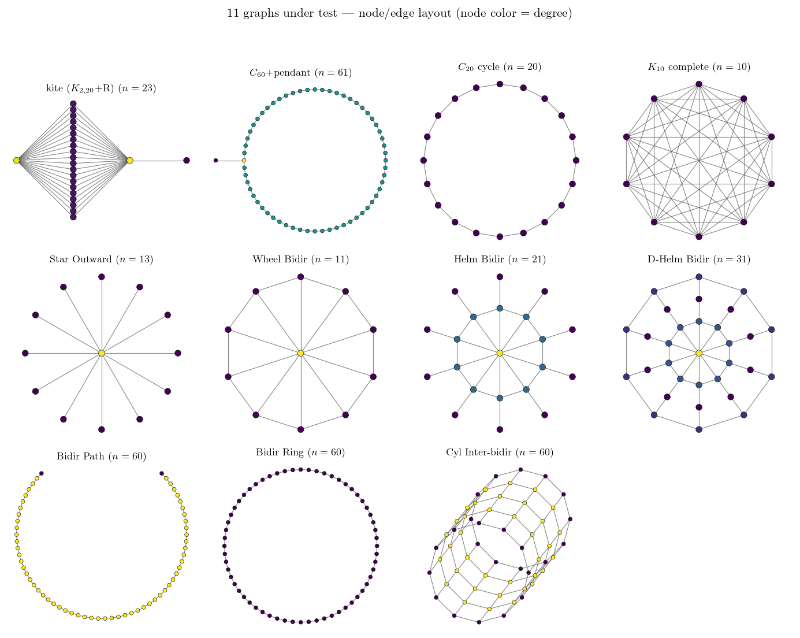

<!-- 소유권자: 소미 | 사용자: 소미 -->
<!-- Modified: 2026-05-22 by 소미 -->

에이의 ABC 통합증명 PDF §3.4 의 Foster's drift criterion (Assumption 1) 이 그래프와 파라미터에 따라 실제로 잘 성립하는지 실험으로 본다. 본 글은 (B) 실험 결과 공유용으로 판정하고 §2.6/§2.7 적용 면제로 진행한다.

그래프 클래스에 따라 $M(S_{t_r})$ 시계열이 두 종류로 명확히 나뉜다. fully symmetric (Cycle, Complete, Ring, Cylinder bidir) 은 시계열이 작은 상수 (∼ 1) 부근에서 흔들리는 bounded process — height range 가 시간이 흘러도 일정 scale 위로 안 커진다. 반대로 비대칭 그래프 (kite, Helm Bidir, Star Outward, $C_{60}$+pendant 등) 는 시계열이 round 가 진행할수록 거의 선형으로 발산 — height range 가 무한히 커진다.

수열 $\{M(S_{t_r})\}_r$ 자체의 성질이 궁금하다. 독립인가, correlated 인가, mixing 인가, 확률적 유계 ($O_p(1)$) 인가, tight 인가? 발산 class 는 $M_r$ 자체가 round 따라 발산이라 진단의 답이 자명 (mixing X, tight X, $M_r = \Theta_p(r)$) — 흥미는 bounded class 안에서 어떻게 갈리는지에 있다. bounded 5 그래프 ($K_{10}$, $C_{20}$, Cyl Inter-bidir, Wheel Bidir, Bidir Ring) 에 두 진단을 적용한다.

sample autocorrelation $\rho(k) := \mathrm{Corr}(M_r, M_{r+k})$ — i.i.d. 이면 lag 1 부터 $\pm 1.96/\sqrt{n}$ 신뢰구간 안. bounded class 5 그래프 모두 lag-1 ACF $\rho(1) \in [0.92, 0.999]$ — 강 양상관, 명백히 독립이 아니다. mixing 속도는 그래프마다 차이가 크다. $K_{10}$ 은 lag 100 부근에서 $\rho \approx 0$ 으로 수렴 — 짧은 lag 안에 mixing. $C_{20}$ 은 lag 100 에서도 $\rho \approx 0.55$, Cyl Inter-bidir 는 $\rho \approx 0.76$, Wheel Bidir·Bidir Ring 은 $\rho \approx 0.9$ 로 mixing 이 매우 느리다 — 같은 bounded class 안에서도 mixing speed 는 $K_{10}$ 만 빠르고 나머지는 long-range correlated.

각 그래프의 round 구간 100 bin 으로 나눠 bin 별 5/50/95 quantile band + running max. bounded class 5 그래프 모두 quantile band 가 후미에서 일정 range 안에서 흔들리고, running max 도 작은 절대값 (≤ 2.2) 안에서 잡혀 있다. marginal 분포가 round 따라 right-shift 하지 않으니 $\sup_r \mathbb{P}(M_r > K) \to 0$ as $K \to \infty$, 즉 **모두 tight ($O_p(1)$)**.

| 그래프 | lag-1 ACF | lag-100 ACF | $M$ tail mean | tight? |
|---|---|---|---|---|
| $K_{10}$ | $0.92$ | $-0.01$ | $0.09$ | yes |
| $C_{20}$ | $0.99$ | $0.55$ | $0.27$ | yes |
| Cyl Inter-bidir | $0.997$ | $0.76$ | $0.32$ | yes |
| Wheel Bidir | $0.999$ | $0.92$ | $0.43$ | yes |
| Bidir Ring | $0.999$ | $0.89$ | $0.56$ | yes |

질문에 답을 정리하면: bounded class 안에서 $\{M_r\}$ 은 **모두 강하게 correlated** (lag-1 ACF $\ge 0.92$, 독립 아님), mixing 속도는 그래프별 차이가 크지만 ($K_{10}$ 빠르게 mixing, 나머지 long-range correlated) 결국 모두 stationary 분포 위 — **tight, $O_p(1)$**. 발산 class 는 본 진단 적용 대상 밖이고 시계열 figure 가 그대로 답이다.

Foster's drift criterion (Assumption 1) 은 어떤 graph-level constant $\varepsilon_B > 0$, $C_B \ge 0$ 가 존재해서 모든 round 에서

$$B(S_{t_r}) \;\le\; -\varepsilon_B\, M(S_{t_r}) + C_B$$

가 성립하길 요구하는데, 여기서 $B(S_{t_r}) = \sum_u \pi(u, S_{t_r}) \hbar(u, t_r)$ 는 round 시작 시점의 weighted height deposit (Lemma 3 정의), $\pi(u, S) = \mathbb{E}[\#_u | S_{t_r}]$ 는 round 길이 동안 노드 $u$ 의 visit count 의 조건부 기댓값이다. 이 가정의 핵심 함의는 결국 height range $M(t)$ 가 시간 흐름에서 bounded 라는 것이다 — $\varepsilon_B > 0$ 가 작동하면 큰 $M$ 에서 음의 drift 가 작용해 $M$ 이 다시 작아져 stationary 분포 위에 머문다 (positive Harris recurrence). 가정이 깨지면 $M$ 이 발산. 그러니 $M$ 시계열의 long-run behavior 가 가정의 진짜 의미를 직접 보여준다 — 위 figure 가 그 자체로 Assumption 1 의 graph-별 검증이다.

추가로 가정의 정량 형태도 raw scatter 로 확인할 수 있다. 각 round 의 $(M_r, B^{\rm emp}_r)$ 한 sample 을 모아 $B^{\rm emp}_r = \sum_u \#_u(r) \hbar(u, t_r)$ — Lemma 2 의 좌변 양식 — 으로 $B(S)$ 의 instantaneous 추정으로 사용. 다수 round 의 sample 평균이 $B(S)$ 의 추정. 이 scatter 에 OLS $B = -\varepsilon_B M + C_B$ 회귀를 fit 한 결과:

| 그래프 | OLS $\varepsilon_B$ | 판정 |
|---|---|---|
| $C_{20}$ cycle | $+0.151$ | ✓ |
| $K_{10}$ complete | $+0.318$ | ✓ |
| Bidir Ring | $+0.040$ | ✓ |
| Cyl Inter-bidir | $+0.045$ | ✓ |
| Bidir Path | $+0.0005$ | ~ |
| Wheel Bidir | $-0.007$ | ~ |
| $C_{60}$+pendant | $-0.008$ | ~ |
| D-Helm Bidir | $-0.087$ | ✗ |
| kite | $-0.313$ | ✗ |
| Helm Bidir | $-0.758$ | ✗ |
| Star Outward | $-0.917$ | ✗ |

OLS $\varepsilon_B$ 부호 (만족 ✓ / borderline ~ / 위반 ✗) 와 $M$ tail mean 의 자릿수가 거의 monotone 대응한다 — $M$ 시계열 진단과 OLS 회귀가 같은 결론을 가리킨다.

OLS 단순 회귀에는 한 가지 한계가 있다. Helm Bidir 같은 그래프의 scatter 를 자세히 보면 점들이 cloud 가 아니라 여러 직선이 부채꼴로 펼쳐진 구조다 — round 안 walker 의 path 가 그래프 구조에 의해 finite 개의 type 으로 분류되고, 각 type 별로 visit count vector $(\#_u)_u$ 가 fixed pattern 이라 type 안에서는 $B^{\rm emp}_r$ 이 $M_r$ 에 거의 선형이기 때문. 단일 직선으로 강제한 OLS slope 는 type 별 평균 trend 의 weighted 평균에 가까운데, 가정의 본질 ($M$ 의 boundedness) 은 위쪽 figure 가 더 직접적으로 보여준다.

결론적으로 Assumption 1 은 ABC 의 핵심 hypothesis 임에도 모든 그래프에서 자동 성립하는 보편 명제가 아니다. Theorem A (balanced) 의 적용 범위는 사실상 fully symmetric 또는 거의 대칭인 그래프 클래스로 제한될 가능성이 있고, 비대칭 그래프 (Star Outward, Helm 류, kite) 에서는 Foster-Lyapunov 가 직접 적용되지 않을 수 있다.

## 어펜딕스. 표기 정리 (에이 `abc공유용_v2.tex` §1.1, §3.3, §3.4)

| 양 | 정의 |
|---|---|
| $\hbar(u, t_r)$ | centered height $= h(u, t_r) - \bar h(t_r)$ |
| $\Phi(t_r)$ | Lyapunov fn $= \sum_u \hbar(u, t_r)^2$ (height variance) |
| $M(S_{t_r})$ | $:= \max_v \lvert \hbar(v, t_r) \rvert$ (centered height range; Fact 2 로 $\max h - \min h \in [M, 2M]$) |
| $\#_u$ | round 동안 $u$ visit count |
| $\pi(u, S) := \mathbb{E}[\#_u \mid S_{t_r}]$ | round 동안 $u$ expected visits (state-dependent) |
| $B(S) := \sum_u \pi(u, S) \, \hbar(u, t_r)$ | expected weighted height deposit — visit-weighted centered height |
| $\varepsilon_B, C_B$ | graph-level Foster drift constants ($\varepsilon_B > 0$, $C_B \ge 0$) |
| $C_{M\text{-free}} := (T_{\max} + 1) b^2 [T_{\max}/2 + (n-1)/(3n)]$ | universal remainder bound ($n$, $b$, $T_{\max}$ 만 의존) |

시뮬 코드와 figure 생성 코드는 본문에 포함하지 않았고 ((B) 양식, §2.6 면제), 본인 책상에 보관: `260522_소미_foster_verify.py` (s181 sequential 약 60초), `260522_소미_foster_figs.py` (B-M scatter), `260522_소미_foster_M_series.py` ($M$ 시계열), `260522_소미_foster_M_diag.py` (ACF + tightness). raw 캐시: `results/numeric/260522_소미_foster_verify.py/Guebins-Mac-mini.local_foster_verify.npz`.
