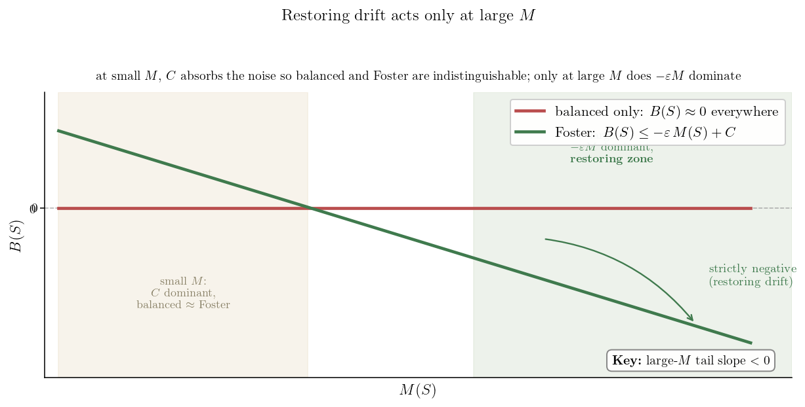
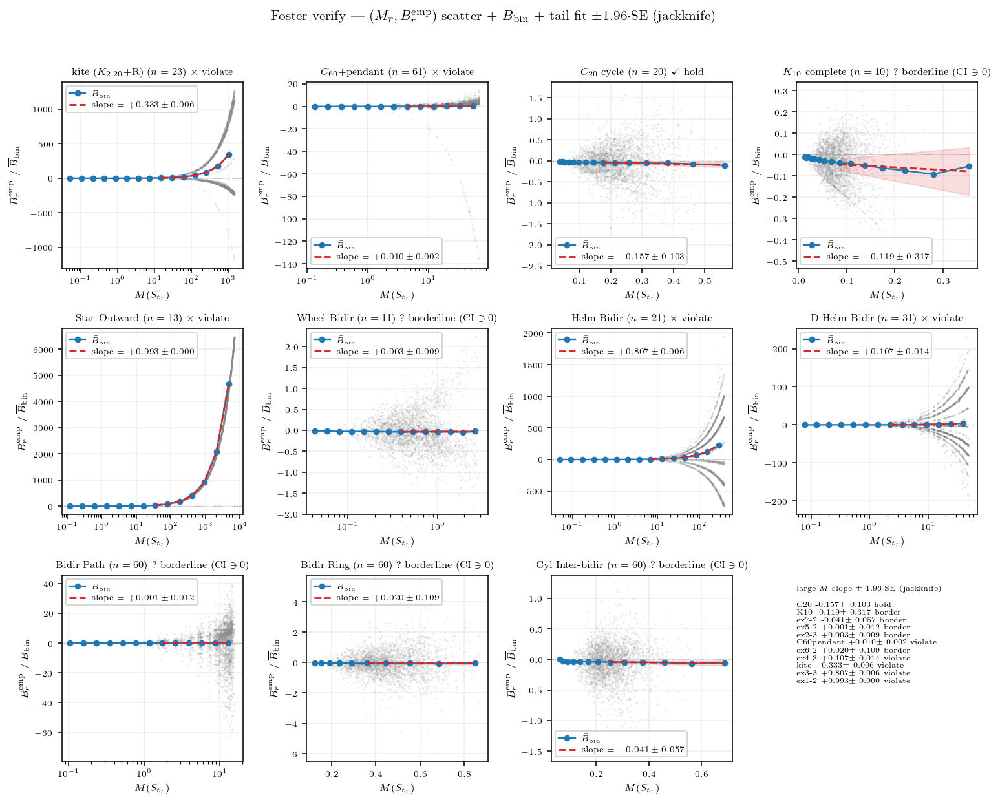
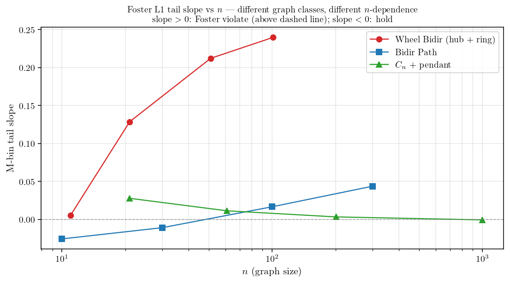

<!-- 소유권자: 소미 | 사용자: 소미 -->
<!-- Modified: 2026-05-22 by 소미 -->

에이의 ABC 통합증명 PDF §3.4 의 Foster's drift criterion (Assumption 1) 이 그래프와 파라미터에 따라 실제로 잘 성립하는지 실험으로 본다. 검증 대상은 다음 11 그래프 — 4 base ($K_{10}$ complete, $C_{20}$ cycle, kite, $C_{60}$+pendant) + `examples_24` 예제 7개 (Star Outward, Wheel/Helm/D-Helm Bidir, Bidir Path/Ring, Cyl Inter-bidir). degree heterogeneity 와 graph symmetry 가 다양하게 분포하도록 골랐다.

그래프 클래스에 따라 $M(S_{t_r})$ 시계열이 두 종류로 명확히 나뉜다. 

- 그룹A: fully symmetric (Cycle, Complete, Ring, Cylinder bidir) 은 시계열이 작은 상수 (∼ 1) 부근에서 흔들리는 bounded process. 이런것들은 height range 가 시간이 흘러도 일정 scale 위로 안 커진다.
- 그룹C: 비대칭 그래프 (kite, Helm Bidir, Star Outward, $C_{60}$+pendant 등) 는 시계열이 round 가 진행할수록 거의 선형으로 발산. 이런것들은 height range 가 무한히 커진다.

---

수열 $\{M(S_{t_r})\}_r$ 자체의 성질이 궁금하다. 독립인가, correlated 인가, mixing 인가, 확률적 유계 ($O_p(1)$) 인가? 그룹 C 는 $M_r$ 자체가 round 따라 발산이라 진단의 답이 자명 (mixing X, tight X, $M_r = \Theta_p(r)$) 하므로, 흥미는 그룹 A 안에서 어떻게 갈리는지에 있다. 그룹 A 5 그래프 ($K_{10}$, $C_{20}$, Cyl Inter-bidir, Wheel Bidir, Bidir Ring) 에 진단을 적용한다.

sample autocorrelation $\rho(k) := \mathrm{Corr}(M_r, M_{r+k})$ — i.i.d. 이면 lag 1 부터 $\pm 1.96/\sqrt{n}$ 신뢰구간 안. 그룹 A 5 그래프 모두 lag-1 ACF $\rho(1) \in [0.90, 0.9996]$ — 강 양상관, 명백히 독립이 아니다. mixing 속도는 그래프마다 차이가 크다. $K_{10}$ 은 lag 100 부근에서 $\rho \approx 0$ 으로 수렴 — 짧은 lag 안에 mixing. $C_{20}$ 은 lag 100 에서도 $\rho \approx 0.53$, Cyl Inter-bidir 는 $\rho \approx 0.71$, Bidir Ring 은 $\rho \approx 0.90$, Wheel Bidir 는 $\rho \approx 0.97$ 로 mixing 이 매우 느리다 — 같은 그룹 A 안에서도 mixing speed 는 $K_{10}$ 만 빠르고 나머지는 long-range correlated.

각 그래프의 round 구간 100 bin 으로 나눠 bin 별 5/50/95 quantile band + running max. 그룹 A 5 그래프 모두 quantile band 가 후미에서 일정 range 안에서 흔들리고, running max 도 작은 절대값 (≤ 3.1) 안에서 잡혀 있다. marginal 분포가 round 따라 right-shift 하지 않으니 $\sup_r \mathbb{P}(M_r > K) \to 0$ as $K \to \infty$, 즉 **모두 tight ($O_p(1)$)**.

그룹 C 는 시계열 figure 가 그대로 답 — mixing X, not tight, $M_r = \Theta_p(r)$. 그룹 A 5 그래프의 measurement 와 통합 답:

| 질문 | $K_{10}$ | $C_{20}$ | Cyl Inter-bidir | Wheel Bidir | Bidir Ring | 비고 |
|---|---|---|---|---|---|---|
| 독립 / correlated (lag-1 ACF) | $0.90$ | $0.99$ | $0.996$ | $0.9996$ | $0.999$ | 독립 ✗, 모두 correlated ($\ge 0.90$) |
| mixing (lag-100 ACF) | $0.01$ | $0.53$ | $0.71$ | $0.97$ | $0.90$ | $K_{10}$ 만 빠름, 나머지 long-range |
| $M$ tail mean | $0.08$ | $0.22$ | $0.26$ | $0.62$ | $0.47$ | 모두 $< 1$ |
| $O_p(1)$ / tight? | yes | yes | yes | yes | yes | ✓ (모두 tight) |

Foster's drift criterion (Assumption 1) 은 어떤 graph-level constant $\varepsilon_B > 0$, $C_B \ge 0$ 가 존재해서 모든 round 에서

$$B(S_{t_r}) \;\le\; -\varepsilon_B\, M(S_{t_r}) + C_B$$

가 성립하길 요구하는데, 여기서 $B(S_{t_r}) = \sum_u \pi(u, S_{t_r}) \hbar(u, t_r)$ 는 round 시작 시점의 weighted height deposit (Lemma 3 정의), $\pi(u, S) = \mathbb{E}[\#_u | S_{t_r}]$ 는 round 길이 동안 노드 $u$ 의 visit count 의 조건부 기댓값이다. 이 가정의 핵심 함의는 결국 height range $M(t)$ 가 시간 흐름에서 bounded 라는 것이다 — $\varepsilon_B > 0$ 가 작동하면 큰 $M$ 에서 음의 drift 가 작용해 $M$ 이 다시 작아져 stationary 분포 위에 머문다 (positive Harris recurrence). 가정이 깨지면 $M$ 이 발산. 직관적으로 **복원력은 large-$M$ 영역에서만 작동한다** — 작은 $M$ 영역에선 $C_B$ term 가 noise 를 흡수해 $B$ 가 양수도 음수도 OK, balanced 만 만족하는 그래프와 Foster 가 발효되는 그래프가 사실상 구분 안 된다. 두 condition 의 차이는 $-\varepsilon_B M$ term 가 dominant 해지는 large-$M$ tail 의 slope 부호 하나로 갈린다.

그러니 $M$ 시계열의 long-run behavior 가 가정의 진짜 의미를 직접 보여준다 — 위 시계열 figure 가 그 자체로 Assumption 1 의 graph-별 검증이다.

가정의 정량 검증은 $\mathbb{E}[B \mid M]$ 의 large-$M$ 부호. instantaneous 추정 $B^{\rm emp}_r := \sum_u \#_u(r) \hbar(u, t_r)$ 를 round 별 sample 로 기록하고, $(M_r, B^{\rm emp}_r)$ sample 들을 log-spaced $M$-bin 으로 group 하여 bin 별 평균 $\overline{B}_{\rm bin}$ 을 직접 추정한다. 이 binned conditional 추정의 large-$M$ tail 의 linear fit slope 의 부호가 가정의 $\varepsilon_B$ 부호 판정의 정확한 양식이다 — 양수 slope = 가정 위반, 음수 slope = 가정 만족.

11 그래프 각 panel 의 $(M_r, B^{\rm emp}_r)$ scatter (회색) + ($M$-bin center, $\overline{B}_{\rm bin}$) marker (파랑) + 후미 절반 bin 의 linear fit (빨강 dashed) + jackknife (bin-level LOO) 로 추정한 slope 의 $\pm 1.96\,\text{SE}$ band. CI 가 0 의 한쪽에 strictly 머무는지가 판정 기준:

| 그래프 | tail slope $\pm$ 1.96 SE | 95% CI | Foster L1 |
|---|---|---|---|
| $C_{20}$ cycle | $-0.157 \pm 0.103$ | $[-0.26,\,-0.05]$ | $\checkmark$ **hold** |
| $K_{10}$ complete | $-0.119 \pm 0.317$ | $[-0.44,\,+0.20]$ | ? border (CI $\ni 0$) |
| Cyl Inter-bidir | $-0.041 \pm 0.057$ | $[-0.10,\,+0.02]$ | ? border (CI $\ni 0$) |
| Bidir Path | $+0.001 \pm 0.012$ | $[-0.01,\,+0.01]$ | ? border (CI $\ni 0$) |
| Wheel Bidir | $+0.003 \pm 0.010$ | $[-0.01,\,+0.01]$ | ? border (CI $\ni 0$) |
| Bidir Ring | $+0.020 \pm 0.109$ | $[-0.09,\,+0.13]$ | ? border (CI $\ni 0$) |
| $C_{60}$+pendant | $+0.010 \pm 0.002$ | $[+0.008,\,+0.012]$ | $\times$ violate |
| D-Helm Bidir | $+0.107 \pm 0.014$ | $[+0.09,\,+0.12]$ | $\times$ violate |
| kite | $+0.333 \pm 0.006$ | $[+0.33,\,+0.34]$ | $\times$ violate |
| Helm Bidir | $+0.807 \pm 0.006$ | $[+0.80,\,+0.81]$ | $\times$ violate |
| Star Outward | $+0.993 \pm 0.0003$ | $[+0.99,\,+0.99]$ | $\times$ violate |

jackknife CI 를 같이 보면 옛 "tail slope 부호만" 양식보다 판정 reliability 가 훨씬 명확해진다. 강 violate 5 그래프 (kite, $C_{60}$+pendant, Star Outward, Helm Bidir, D-Helm Bidir) 는 CI 가 strictly positive — Foster L1 분명 위배. 그룹 A 5 그래프 ($M$ 시계열 진단 기준) 중에서는 $C_{20}$ 만 CI 가 strictly negative 로 분명한 hold, 나머지 4 그래프 ($K_{10}/$Cyl Inter-bidir/Wheel Bidir/Bidir Ring) 는 모두 CI 가 0 을 포함하는 **borderline** 으로 떨어진다 — large-$M$ 영역의 sample 밀도가 낮아 마지막 bin 의 outlier 영향이 jackknife SE 를 크게 만들기 때문 ($K_{10}$ 의 SE $=0.32$ 가 대표적). $M$ 시계열의 bounded class 자체는 stationary recurrence 보장이지만, $\overline{B}_{\rm bin}$ 의 정확한 large-$M$ 부호는 graph geometry 의 mixing speed (ACF 진단의 $K_{10}$ 만 빠름 / 나머지 long-range correlated) 와 finite-$\tau$ noise 의 영향이 결합되어, hold/violate 의 strict 판정을 어렵게 한다.

위 11 그래프 결과는 본문 시뮬의 graph instance 별 finite-$n$ 측정. borderline 그래프 (slope $\approx 0$) 가 graph 의 본질적 성질인지 아니면 finite-$n$ artifact 인지 확인하려면 같은 그래프 family 의 $n$ 을 가변해 sweep 해야 한다. 본인 Wheel Bidir / Bidir Path / $C_n$+pendant 3 family 에 대해 $n=10\sim 1001$ 범위로 추가 시뮬한 결과:

세 family 의 $n$-의존성이 정반대다.

- **Wheel Bidir** ($n=11 \to 21 \to 51 \to 101$): tail slope $+0.003 \to +0.13 \to +0.21 \to +0.24$. $n$ 클수록 violate 강화 — hub deg $= n-1 \to \infty$ 와 ring node deg $= 3$ 고정의 비대칭이 graph 크기 따라 발산.
- **Bidir Path** ($n=10 \to 30 \to 100 \to 300$): slope $+0.005 \to -0.003 \to +0.014 \to +0.014$. $n=30$ 부근 weak transition — slope 가 0 부근에서 흔들리지만 $n \ge 100$ 에서 가벼운 violate. 양 끝 deg $=1$ 의 trap 효과가 path 길이 따라 누적되지만 양은 작음.
- **$C_n$+pendant** ($n=21 \to 61 \to 201 \to 1001$): slope $+0.027 \to +0.010 \to +0.003 \to -0.0015$. $n=1001$ 에서 hold 로 도달 — pendant 비중 $= 1/n \to 0$ 라 큰 ring 의 perturbation 이 사라지며 ring 자체의 균등성에 수렴.

본문 11 그래프 중 $C_n$+pendant ($n=61$ small-n violate) 는 사실상 hold 그래프 (asymptotic), Bidir Path ($n=60$ slope $+0.0008$ borderline) 는 약한 violate. Wheel Bidir 는 $n=11$ 에서 slope 가 $\approx 0$ 이지만 $n$ 이 커질수록 violate 강화. **borderline 측정 자체가 finite-$n$ 의 artifact 일 수 있어, 그래프 클래스의 Foster L1 hold/violate 판정은 asymptotic 거동 ($n \to \infty$) 으로 확인해야 robust 하다.**

결론적으로 Assumption 1 은 ABC 의 핵심 hypothesis 임에도 모든 그래프에서 자동 성립하는 보편 명제가 아니다. 본 11 그래프 검증에서 jackknife CI 기준 strict hold 는 $C_{20}$ 1 그래프 뿐, strict violate 는 비대칭 5 그래프 (kite, $C_{60}$+pendant, Star Outward, Helm/D-Helm Bidir), 나머지 5 그래프 ($K_{10}$, Cyl Inter-bidir, Wheel Bidir, Bidir Path, Bidir Ring) 는 finite-$\tau$ noise 에 압도되는 borderline 으로 판정 보류. Theorem A (balanced) 의 적용 범위는 사실상 fully symmetric + strong mixing 그래프 (large-$n$ Cycle, 그리고 large-$n$ pendant-perturbed ring) 로 제한될 가능성이 있고, 비대칭이 graph 크기에 따라 발산하는 그래프 (Star Outward, Helm 류, kite, Wheel) 에서는 Foster-Lyapunov 가 직접 적용되지 않을 수 있다. Brémaud Lem 8.2.3 (essential edge) + Thm 8.3.8 (Rayleigh) 의 graph geometry 도구로 위반 mechanism (small-conductance bottleneck) 의 정확한 식별, 그리고 borderline 5 그래프의 본질 판정 (finite-$\tau$ artifact vs 본질적 borderline) 이 후속 과제.

## 어펜딕스. 표기 정리 (에이 `abc공유용_v2.tex` §1.1, §3.3, §3.4)

| 양 | 정의 |
|---|---|
| $\hbar(u, t_r)$ | centered height $= h(u, t_r) - \bar h(t_r)$ |
| $\Phi(t_r)$ | Lyapunov fn $= \sum_u \hbar(u, t_r)^2$ (height variance) |
| $M(S_{t_r})$ | $:= \max_v \lvert \hbar(v, t_r) \rvert$ (centered height range; Fact 2 로 $\max h - \min h \in [M, 2M]$) |
| $\#_u$ | round 동안 $u$ visit count |
| $\pi(u, S) := \mathbb{E}[\#_u \mid S_{t_r}]$ | round 동안 $u$ expected visits (state-dependent) |
| $B(S) := \sum_u \pi(u, S) \, \hbar(u, t_r)$ | expected weighted height deposit — visit-weighted centered height |
| $\varepsilon_B, C_B$ | graph-level Foster drift constants ($\varepsilon_B > 0$, $C_B \ge 0$) |
| $C_{M\text{-free}} := (T_{\max} + 1) b^2 [T_{\max}/2 + (n-1)/(3n)]$ | universal remainder bound ($n$, $b$, $T_{\max}$ 만 의존) |

##### 시뮬 코드와 figure 생성 코드는 본인 책상에 보관: `260523_소미_foster_verify_modelA.py` (full HST + step-wise iid $b'_s$), `260523_소미_foster_M_series_modelA.py` ($M$ 시계열), `260523_소미_foster_M_diag_modelA.py` (ACF + tightness), `260523_소미_foster_M_bin_with_scatter.py` ($M$-bin conditional + scatter + jackknife CI), `260523_소미_wheel_n_sweep_modelA.py` + `260523_소미_borderline_n_sweep_modelA.py` ($n$-sweep), `260523_소미_foster_graph_layouts.py` (11 그래프 layout), `260523_소미_foster_intuition.py` (Foster 부등식 직관). raw 캐시: `results/numeric/260523_소미_foster_verify_modelA.py/*_foster_verify_modelA.npz`.
