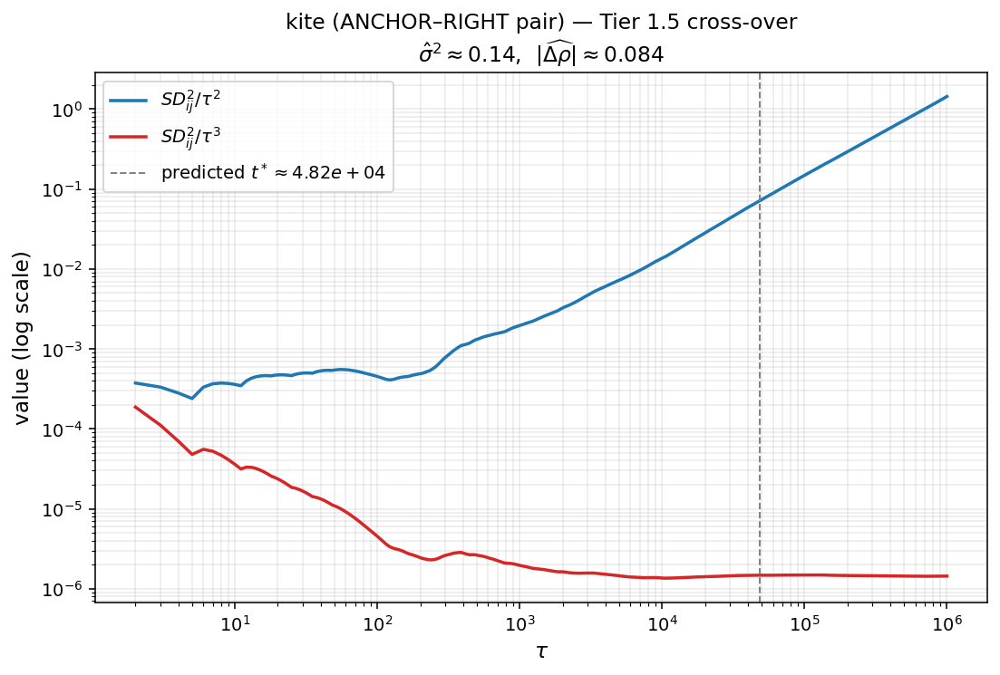
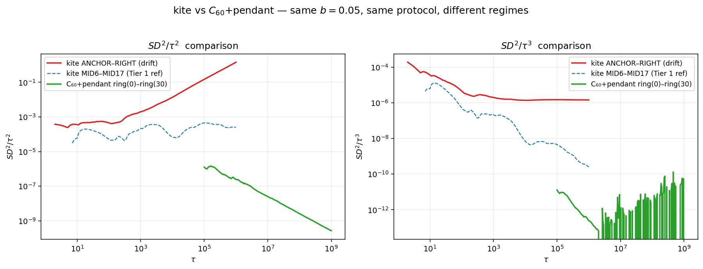

<!-- 소유권자: 소미 | 사용자: 소미 -->

Snow Distance $SD^2_{ij}(t) = \sum_{s=0}^t (h(v_i,s)-h(v_j,s))^2$ 의 후미 스케일링은 두 노드의 장기 적립률 $\rho_i, \rho_j$ 에 따라 셋 중 하나로 갈린다. $\rho_i = \rho_j = 1/n$ 이면 $SD^2/t \to c$, 같지만 글로벌 불균형이면 $SD^2/t^2 \to \sigma^2/2$, 다르면 $SD^2/t^3 \to \bar b^2(\rho_i-\rho_j)^2/3$ 이다. 본 글은 한 그래프 안에서 같은 $b$, 같은 시뮬 양식으로 두 regime 사이 **cross-over** 가 어디서 일어나는지를 직접 본다. [`연모양 kite 실험`](./260520_febfc8.html) 과 [`C₆₀+pendant 실험`](./260520_70924e.html) 두 데이터를 그대로 가져와 비교한다.

## §1. cross-over 식 풀이

높이 차이를 drift 와 fluctuation 으로 나눠 본다. 양 노드의 적립률 차이가 $\Delta\rho := \rho_i - \rho_j$ 이고 평균 적립량이 $\bar b = b/2$ 이면, 적당한 시점 $s$ 에서

$$
h(v_i, s) - h(v_j, s) \;\approx\; \bar b\,\Delta\rho \cdot s \;+\; \xi_{ij}(s).
$$

첫 항은 결정적(deterministic) drift 이고 $s$ 에 선형이다. 둘째 항은 walker 의 occupation fluctuation 으로 평균 0 이고 분산이 $\sigma_{ij}^2 \cdot s$ 의 CLT scaling 을 따른다.

제곱해서 세 항으로 쪼개면

$$
(h_i(s) - h_j(s))^2 \;=\; \underbrace{\bar b^2 \Delta\rho^2\, s^2}_{\text{drift squared,}\ \sim s^2} \;+\; \underbrace{2 \bar b\,\Delta\rho\, s\, \xi_{ij}(s)}_{\text{cross term,}\ \sim s^{3/2}} \;+\; \underbrace{\xi_{ij}(s)^2}_{\text{fluctuation squared,}\ \sim s\ \text{in expectation}}.
$$

이 식을 $s=0$ 부터 $t$ 까지 더하면 (cross term 은 평균 0 이라 leading order 에서 사라진다)

$$
SD^2_{ij}(t) \;\approx\; \bar b^2 \Delta\rho^2 \cdot \sum_{s=0}^t s^2 \;+\; \sigma_{ij}^2 \cdot \sum_{s=0}^t s.
$$

표준 합 공식 $\sum s^2 \approx t^3/3$, $\sum s \approx t^2/2$ 를 넣으면

$$
SD^2_{ij}(t) \;\approx\; \frac{\bar b^2 \Delta\rho^2}{3}\, t^3 \;+\; \frac{\sigma_{ij}^2}{2}\, t^2.
$$

이제 두 항이 같아지는 시점을 보자. $\frac{\bar b^2 \Delta\rho^2}{3} t^3 = \frac{\sigma_{ij}^2}{2} t^2$ 를 $t$ 에 대해 풀면

$$
t^* \;=\; \frac{3\,\sigma_{ij}^2}{2\,\bar b^2\,\Delta\rho^2}.
$$

이 $t^*$ 가 cross-over scale 이다.

`-` $t \ll t^*$ 영역: $t^2$ 항이 dominant 하므로 $SD^2/t^2 \to \sigma_{ij}^2/2$ — **Tier 1 effective**, slope 2 의 plateau.

`-` $t \gg t^*$ 영역: $t^3$ 항이 dominant 하므로 $SD^2/t^3 \to \bar b^2 \Delta\rho^2/3$ — **Tier 0 asymptotic**, slope 3 의 plateau.

`-` $\Delta\rho$ 가 작을수록 $t^*$ 가 커진다. 즉 약한 drift 일수록 cross-over 가 늦게 일어난다.

핵심은 한 곡선 안에서 두 plateau 가 모두 보일 수 있다는 점이다. $SD^2/t^2$ 곡선은 $\tau < t^*$ 에서 plateau, $\tau > t^*$ 에서 $1/\tau$ 로 감소한다. 같은 곡선의 $SD^2/t^3$ 표현은 $\tau < t^*$ 에서 $1/\tau$ 로 감소, $\tau > t^*$ 에서 plateau 다. 두 곡선을 한 panel 에 겹쳐 그리면 plateau 의 자리가 정확히 cross-over 시점에서 바뀐다.

## §2. kite — 작은 drift 의 cross-over

[`연모양 kite 실험`](./260520_febfc8.html) 의 데이터를 그대로 본다. 그래프는 $K_{2,20} + \text{RIGHT}$, 즉 LEFT (degree 20) 와 ANCHOR (degree 21) 사이 20개의 병렬 internal node, 그리고 ANCHOR 에서 RIGHT (degree 1) 로 직접 가는 한 edge. 양방향이고 $b=0.05$, $T_{\max}=20$, $\tau = 10^6$.

block 메커니즘 있는 Full HST 라 이론적으로는 충분히 큰 $\tau$ 에서 $\rho_i = 1/n$ 균등이 보장된다. 그런데 RIGHT 는 degree 1 의 pendant 이고 그래프가 작아서 ($n=23$), $\tau = 10^6$ 까지 시뮬해도 $\rho_\text{RIGHT}(t)$ 가 균등에 완전히 도달하지 못한다. ANCHOR–RIGHT pair 의 후미 데이터에서

`-` $SD^2/t^3$ 의 후미 plateau ≈ $1.5\times 10^{-6}$

가 측정되고, 이 값에서 $\bar b^2 \Delta\rho^2/3 \approx 1.5\times 10^{-6}$ 를 거꾸로 풀면

$$
|\Delta\rho| \;\approx\; \sqrt{\frac{3 \times 1.5\times 10^{-6}}{(0.025)^2}} \;\approx\; 0.084.
$$

즉 ANCHOR 와 RIGHT 의 장기 적립률 차이가 약 8% 정도 남아 있다. 이론 균등 $1/23 \approx 0.043$ 의 두 배 정도라 결코 무시할 수 없는 transient 다.

다른 쪽으로 σ² 를 추정한다. MID-MID pair (degree 2 끼리, 대칭) 들은 $\Delta\rho = 0$ 이므로 순수 Tier 1 effective. 이 pair 들의 후미 $SD^2/t^2$ 의 typical 값에서

$$
\sigma^2 \;\approx\; \frac{2 \cdot (SD^2/t^2)_\text{tail}}{\bar b^2} \;\approx\; 0.14.
$$

이 두 값을 §1 의 식에 넣으면

$$
t^* \;\approx\; \frac{3 \times 0.14}{2 \times (0.025)^2 \times (0.084)^2} \;\approx\; 4.8 \times 10^4.
$$

그러니 $\tau$ 가 $5 \times 10^4$ 근처에서 두 plateau 가 자리를 바꿔야 한다. 시뮬 범위 $\tau \in [1, 10^6]$ 안에 잘 들어온다.

파란 곡선 $SD^2/\tau^2$ 는 작은 $\tau$ 에서 자라다가 $\tau \approx 10^4$ 근처에서 peak (이 값이 곧 $\sigma^2/2 \cdot \bar b^2$ scale) 에 도달한 후, 그 다음부터는 천천히 $1/\tau$ 로 감소한다. 빨간 곡선 $SD^2/\tau^3$ 은 반대로 작은 $\tau$ 에서는 $1/\tau$ 로 감소하다가, $\tau \approx 5 \times 10^4$ 부근부터 plateau (이 값이 곧 $\bar b^2 \Delta\rho^2/3$) 로 진입한다. 회색 점선이 예측 $t^*$ 이고, 실제 두 곡선의 자리 바꿈이 이 부근에서 정확히 일어난다.

## §3. C₆₀+pendant — block 잘 작동, cross-over 안 보임

같은 양식의 다른 그래프를 본다. [`C₆₀+pendant 실험`](./260520_70924e.html) 의 그래프는 60-cycle ring 에 한 노드 (index 15) 에 한 개의 pendant 가 직접 매달린 형태. $n=61$, $b=0.05$, $\tau = 2 \times 10^9$ (kite 보다 3 자릿수 더 큼).

ring 의 두 노드 사이 (예: ring(0)–ring(30)) 페어를 보면

`-` $SD^2/\tau$ 는 후미에서 일정한 상수로 수렴한다. 즉 slope 1, $SD^2 \sim t^1$, **Tier 2 (Thm A balanced)**.

`-` $SD^2/\tau^2$ 와 $SD^2/\tau^3$ 은 둘 다 후미에서 감소한다 (각각 $1/\tau$, $1/\tau^2$ 의 속도). 즉 후미 plateau 가 존재하지 않는다.

block 메커니즘이 충분한 시간 동안 작용해서 모든 노드의 $\rho_i$ 가 $1/61$ 로 균등에 도달했고, drift 항이 완전히 사라진 것이다. cross-over scale $t^*$ 는 $\Delta\rho \to 0$ 의 극한이라 발산하고, 시뮬 범위 안에 cross-over 가 들어오지 않는다.

세 곡선을 한 panel 에 비교한다. 빨간 곡선 (kite ANCHOR–RIGHT) 은 §2 에서 본 cross-over 의 두 plateau 가 명확히 보인다. 파란 점선 (kite MID6–MID17) 은 후미에서 $SD^2/\tau^2$ 가 plateau, $SD^2/\tau^3$ 가 감소 — 순수 Tier 1 effective ($\Delta\rho = 0$, σ² 만 존재). 초록 곡선 (C₆₀+pendant ring(0)–ring(30)) 은 둘 다 후미에서 감소 — 두 항 모두 leading 아니고 $t^1$ 항이 dominant 인 Tier 2.

## §4. 같은 양식, 다른 regime — 왜?

두 그래프의 차이를 정리한다.

`-` **그래프 크기**: kite $n=23$, C₆₀+pendant $n=61$. $\rho_i = 1/n$ 의 균등 도달은 큰 $n$ 일수록 느리지만, 동시에 $|\Delta\rho|$ 의 균등 편차도 작아진다.

`-` **시뮬 길이**: kite $\tau = 10^6$, C₆₀+pendant $\tau = 2 \times 10^9$. 큰 $\tau$ 일수록 $\rho_i(t) \to 1/n$ 균등에 가까워진다.

`-` **pendant 위치**: kite 의 RIGHT 는 degree 1, ANCHOR 와 직접 연결. C₆₀+pendant 의 pendant 도 degree 1 인데, 큰 ring 의 한 노드와만 연결. ring 자체가 대칭 (cycle) 이라 ring 노드들끼리는 자동으로 균등.

핵심은 finite $\tau$ 에서 $\rho_i(t)$ 가 1/n 으로 가는 transient 다. kite 의 ANCHOR–RIGHT pair 처럼 그래프 양 끝 (큰 hub vs 작은 pendant) 의 차이가 클수록, 그리고 그래프가 작을수록 transient 가 visible scale 에 남아 있다. 그러면 §1 의 분해 안 drift 항 $\bar b^2 \Delta\rho^2 t^3 / 3$ 이 실재하고, 충분히 큰 $t$ 에서는 fluctuation 항을 압도한다.

반대로 C₆₀+pendant 는 그래프도 크고 ($n=61$), 시뮬도 충분히 길어 ($\tau = 2 \times 10^9$) transient 가 모두 씻겨나갔다. 모든 pair 가 Tier 2 (Thm A) 에 도달했고 cross-over 가 발생할 자리가 사라졌다.

## 정리

`-` Snow Distance 의 후미 스케일링 세 regime 사이의 cross-over scale 은 $t^* = 3\sigma^2/(2 \bar b^2 \Delta\rho^2)$ 다.

`-` kite 의 ANCHOR–RIGHT pair 에서 $|\Delta\rho| \approx 0.084$, $\sigma^2 \approx 0.14$ 라 $t^* \approx 4.8\times 10^4$ 가 예측되고, 시뮬 데이터의 두 곡선이 이 시점에서 자리를 바꾸는 것이 관측된다.

`-` C₆₀+pendant 는 더 큰 그래프 + 더 긴 시뮬 덕분에 모든 pair 가 Tier 2 (balanced) 에 도달했고 cross-over 가 발생하지 않는다.

`-` 즉 같은 $b$, 같은 시뮬 양식이라도 그래프 크기와 시뮬 길이의 조합에 따라 어떤 regime 이 보이는지가 결정된다. kite 같은 작은 그래프 + 적당한 $\tau$ 가 cross-over 를 직접 보고 측정하기에 좋은 setup 이다.
