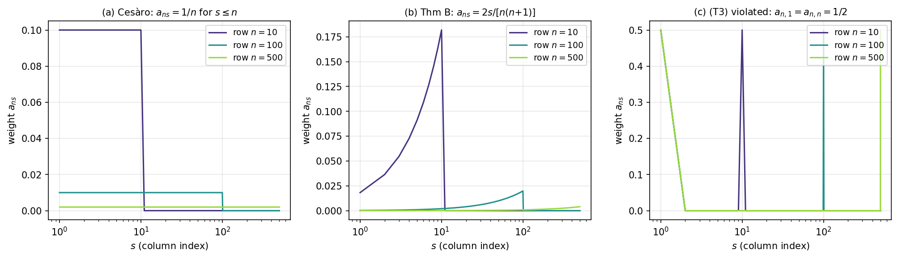
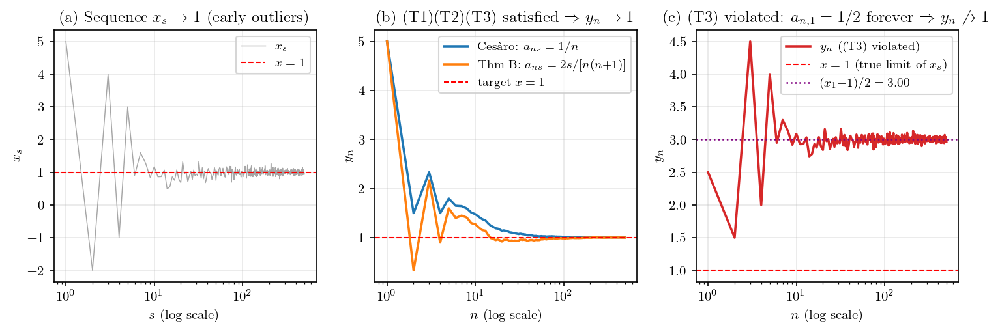

ABC증명 블로그 Theorem~B 풀이에서 한 번 등장했던 외부 보조정리이다. 본 글에서는 그 정리가 **왜 그렇게 성립하는지** 만 직관 위주로 풀어쓴다.

**Toeplitz Lemma (Knopp 1928, §43).** 실수 배열 $\{a_{ns}\}_{n, s \geq 1} \subset \mathbb{R}$ 이 다음 세 조건을 만족한다 하자.

> **(T1)** 어떤 상수 $c < \infty$ 가 존재해 $\sum_{s=1}^{\infty} |a_{ns}| \leq c$ 가 모든 $n \geq 1$ 에서 성립한다.
>
> **(T2)** $\sum_{s=1}^{\infty} a_{ns} \to 1$ as $n \to \infty$.
>
> **(T3)** 각 고정된 $s \geq 1$ 에 대해 $a_{ns} \to 0$ as $n \to \infty$.

그러면 임의의 수렴 수열 $x_s \to x \in \mathbb{R}$ 에 대해
$$
y_n \;:=\; \sum_{s=1}^{\infty} a_{ns}\, x_s \;\xrightarrow{n \to \infty}\; x.
$$

요약하면 **"수렴 수열의 가중평균은 그 극한으로 수렴"** — 단, 가중치 배열이 (T1)(T2)(T3) 을 만족하면.

가장 자명한 인스턴스는 산술평균 (Cesàro) 이다. 가중치를 $a_{ns} = \tfrac{1}{n}\,\mathbf{1}\{s \leq n\}$ 으로 잡으면 $y_n = (x_1 + \cdots + x_n)/n$ 이 정확히 그냥 산술평균이 된다. 작은 $N = 5$ 로 직접 행렬을 만들고 세 점검값을 출력해 보자.

```python
import numpy as np
np.set_printoptions(precision=3, suppress=True, linewidth=80)

def w_cesaro(n, N):
    w = np.zeros(N); w[:n] = 1.0 / n
    return w

N = 5
A = np.array([w_cesaro(n, N) for n in range(1, N + 1)])
print("a_{ns} 행렬:")
print(A)
print(f"  Σ|a_ns| (T1 check)  : {np.abs(A).sum(axis=1)}")
print(f"  Σa_ns   (T2 check)  : {A.sum(axis=1)}")
print(f"  col s=1 (T3 check)  : {A[:, 0]}")
```

```
a_{ns} 행렬:
[[1.    0.    0.    0.    0.   ]
 [0.5   0.5   0.    0.    0.   ]
 [0.333 0.333 0.333 0.    0.   ]
 [0.25  0.25  0.25  0.25  0.   ]
 [0.2   0.2   0.2   0.2   0.2  ]]
  Σ|a_ns| (T1 check)  : [1. 1. 1. 1. 1.]
  Σa_ns   (T2 check)  : [1. 1. 1. 1. 1.]
  col s=1 (T3 check)  : [1.    0.5   0.333 0.25  0.2  ]
```

세 점검값을 모두 통과한다. **(T1)** 행 합 절댓값이 모두 1 로 bound 되어 있고 ($c = 1$), **(T2)** 행 합이 모두 1 로 고정이라 $n \to \infty$ 에서도 1 ($\to 1$), **(T3)** column $s = 1$ 이 $1, \tfrac{1}{2}, \tfrac{1}{3}, \tfrac{1}{4}, \tfrac{1}{5}$ 로 단조 감소해 결국 $1/n \to 0$. 따라서 Toeplitz Lemma 결론에 의해 $x_s \to x$ 면 $y_n \to x$ — 누구나 직관적으로 동의하는 "산술평균도 극한으로 수렴" 명제다. Toeplitz Lemma 는 이 자명한 사실을 "가중치 모양만 (T1)(T2)(T3) 만족하면 다 OK" 로 일반화한 것이다.

한 가지 예제만으로는 부족하니 실수 배열 $a_{ns}$ 의 다양한 사례를 한꺼번에 정의하고 (T1)(T2)(T3) 만족·위반 여부를 ✓/✗ 자동 판정해 보자. 만족 후보 세 개 (C1~C3) 와 일부러 깨뜨린 위반 후보 세 개 (D1~D3) 를 함께 본다.

$$
\begin{aligned}
\text{C1 Cesàro}     &:\quad a_{ns} = \tfrac{1}{n}\,\mathbf{1}\{s \leq n\}, \\
\text{C2 Thm B}      &:\quad a_{ns} = \tfrac{2s}{n(n+1)}\,\mathbf{1}\{s \leq n\}, \\
\text{C3 Identity}   &:\quad a_{ns} = \mathbf{1}\{s = n\}, \\
\text{D1 (T1) viol.} &:\quad a_{ns} = \mathbf{1}\{s \leq n\}, \\
\text{D2 (T2) viol.} &:\quad a_{ns} = \tfrac{1}{2n}\,\mathbf{1}\{s \leq n\}, \\
\text{D3 (T3) viol.} &:\quad a_{ns} = \tfrac{1}{2}\bigl(\mathbf{1}\{s=1\} + \mathbf{1}\{s=n\}\bigr).
\end{aligned}
$$

각 case 마다 큰 $N = 1000$ 에서 행 $n = N$ 의 점검 세 값 — $\sum_s |a_{ns}|$ (T1), $\sum_s a_{ns}$ (T2), $a_{n,1}$ (T3) — 을 계산해 자동으로 ✓/✗ 마크를 붙인다. Julia 로 짜면 다음과 같다.

```julia
using Printf

w_cesaro(n, N)    = (w = zeros(N); w[1:n] .= 1.0/n; w)
w_thm_b(n, N)     = (w = zeros(N); w[1:n] .= 2.0 .* (1:n) ./ (n*(n+1)); w)
w_identity(n, N)  = (w = zeros(N); w[n] = 1.0; w)
w_t1_viol(n, N)   = (w = zeros(N); w[1:n] .= 1.0; w)
w_t2_viol(n, N)   = (w = zeros(N); w[1:n] .= 1.0/(2n); w)
w_t3_viol(n, N)   = (w = zeros(N); w[1] = 0.5; w[n] = 0.5; w)

cases = [
    ("C1 Cesàro",     w_cesaro,   "(1/n)·1{s≤n}"),
    ("C2 Thm B",      w_thm_b,    "2s/[n(n+1)]·1{s≤n}"),
    ("C3 Identity",   w_identity, "1{s=n}"),
    ("D1 (T1) viol.", w_t1_viol,  "1{s≤n}"),
    ("D2 (T2) viol.", w_t2_viol,  "1/(2n)·1{s≤n}"),
    ("D3 (T3) viol.", w_t3_viol,  "1/2·(1{s=1}+1{s=n})"),
]

N = 1000
@printf("%-15s | %-22s | %9s  (T1) | %9s  (T2) | %10s  (T3)\n",
        "case", "a_ns", "Σ|a_ns|", "Σa_ns", "a_{n,1}")
println("-"^95)
for (name, fn, expr) in cases
    w  = fn(N, N)
    a  = sum(abs, w)
    s  = sum(w)
    c1 = w[1]
    t1 = a  < 100         ? "✓" : "✗"
    t2 = abs(s - 1) < 0.01 ? "✓" : "✗"
    t3 = abs(c1)    < 0.01 ? "✓" : "✗"
    @printf("%-15s | %-22s | %9.3f  %s   | %9.3f  %s   | %10.3e  %s\n",
            name, expr, a, t1, s, t2, c1, t3)
end
```

출력:

```
case            | a_ns                   |   Σ|a_ns|  (T1) |     Σa_ns  (T2) |    a_{n,1}  (T3)
-----------------------------------------------------------------------------------------------
C1 Cesàro       | (1/n)·1{s≤n}           |     1.000  ✓   |     1.000  ✓   |  1.000e-03  ✓
C2 Thm B        | 2s/[n(n+1)]·1{s≤n}     |     1.000  ✓   |     1.000  ✓   |  1.998e-06  ✓
C3 Identity     | 1{s=n}                 |     1.000  ✓   |     1.000  ✓   |  0.000e+00  ✓
D1 (T1) viol.   | 1{s≤n}                 |  1000.000  ✗   |  1000.000  ✗   |  1.000e+00  ✗
D2 (T2) viol.   | 1/(2n)·1{s≤n}          |     0.500  ✓   |     0.500  ✗   |  5.000e-04  ✓
D3 (T3) viol.   | 1/2·(1{s=1}+1{s=n})    |     1.000  ✓   |     1.000  ✓   |  5.000e-01  ✗
```

C1~C3 (Cesàro, Thm B, Identity) 는 세 조건을 모두 통과한다 — Toeplitz 결론에 의해 $y_n \to x$. D1 ((T1) 위반) 은 가중치 합이 $n = 1000$ 에서 그대로 $1000$ 으로 발산하여 bound 가 없고, 가중평균이 단순 합이 되어 발산한다. D2 ((T2) 위반) 는 (T1)(T3) 은 만족하지만 합이 0.5 로 고정이라 $y_n \to x/2$ 로 배수 변질된다. D3 ((T3) 위반) 은 합과 bound 는 OK 지만 column $s = 1$ 의 값이 영원히 $0.5$ 로 사라지지 않아 옛 항 $x_1$ 이 평균에 끝까지 살아남아 $y_n \to (x_1 + x)/2$ 로 잘못된 극한에 멈춘다.

한 줄로 직관을 잡으면 **가중평균은 무게가 실린 데로 따라간다.** (T3) 에 의해 무게가 점점 "이미 $x$ 에 가까워진 항들" 쪽으로만 실리니까 평균도 $x$ 로 간다. 세 조건은 각각 그 직관이 깨질 수 있는 시나리오를 막는 안전장치다. (T1) 은 가중치 절댓값 합이 어떤 상수 $c$ 안에 묶이게 해서 "$x$ 근처로 가도 가중치 합이 발산하면 곱해진 평균도 발산" 하는 일을 막는다. (T2) 는 가중치 총합이 1 로 수렴하게 해서 평균이 평균답게 작동하도록 한다 (없으면 $cx$ 같은 배수로 수렴할 수 있다). (T3) 은 어떤 고정된 위치 $s$ 의 가중치도 결국 0 으로 사라지게 해서 "초반에 $x$ 와 동떨어진 $x_1, x_2, \ldots$ 가 끝까지 무게 유지하며 평균을 그쪽으로 끌고 가는" 일을 막는다.

이 직관을 시험 성적 비유로 풀어보자. 학생 한 명의 시험 성적을 가중평균으로 평가한다고 하자. $x_s$ 가 $s$번째 시험 점수, $a_{ns}$ 가 학기 $n$ 시점에 $s$번째 시험에 부여되는 가중치, $y_n$ 이 학기 $n$ 시점의 평가 점수다. 학기말 실력이 $x$ 점으로 수렴 — 초반 시험은 들쭉날쭉했고 후반 시험은 다 $x$ 근처라고 하자. (T3) "옛날 시험 가중치는 학기 진행될수록 0 으로" 는 초반의 들쭉날쭉했던 점수가 학기말 평가에 거의 안 반영되게 한다. (T2) "가중치 총합은 1" 은 평균이 평균답게 작동하도록 보장한다 (1.5배·0.7배 평균으로 변질되지 않는다). (T1) "시험 가중치 절댓값 합이 상수 안에 묶임" 은 특정 시험 또는 그 묶음이 비정상적으로 부풀려지지 않게 한다. 결과적으로 학기말 평가는 후반 시험들 (이미 $x$ 근처) 의 가중평균이라 $x$ 로 수렴한다.

가장 익숙한 특수 케이스는 산술평균 (Cesàro) 이다. 가중치를 단순히
$$
a_{ns} \;=\; \begin{cases} 1/n, & s \leq n, \\ 0, & s > n, \end{cases}
$$
로 잡으면 $y_n = (x_1 + \cdots + x_n)/n$, 즉 그냥 산술평균이다. 세 조건은 모두 통과한다.
$$
\begin{aligned}
\text{(T1)} &\quad \sum_{s=1}^\infty |a_{ns}| = \sum_{s=1}^n \tfrac{1}{n} = 1 \leq 1
   && (\because c = 1) \\
\text{(T2)} &\quad \sum_{s=1}^\infty a_{ns} = 1 \to 1
   && (\because \text{고정 1}) \\
\text{(T3)} &\quad a_{ns} = \tfrac{1}{n} \to 0 \quad \text{각 고정 } s
   && (\because n \to \infty)
\end{aligned}
$$
그러므로 "$x_s \to x$ 이면 산술평균도 $x$" — 누구나 직관적으로 동의하는 명제다 (앞쪽 몇 개 이상한 값들은 $n$ 으로 나누면서 희석된다). Toeplitz Lemma 는 이 직관을 "가중치 모양만 (T1)(T2)(T3) 만족하면 다 OK" 로 일반화한 것이다.

세 조건 각각이 어떻게 작동하는지 더 명확히 하려면, 각 조건이 위반될 때 어떤 가중치 행렬이 만들어지고 어떤 점검 값이 깨지는지 작은 $N=5$ 로 비교해 보는 것이 좋다. Cesàro 와 세 위반 케이스를 한꺼번에 정의하고, 매 행에 대한 점검 세 값 — $\sum_s |a_{ns}|$ (T1), $\sum_s a_{ns}$ (T2), column $s=1$ 의 값 (T3) — 을 같이 print 한다.

$$
\begin{aligned}
a_{ns}^{\text{Cesàro}} &= \tfrac{1}{n}\,\mathbf{1}\{s \leq n\},
   & a_{ns}^{\text{(T1) viol.}} &= \mathbf{1}\{s \leq n\}, \\
a_{ns}^{\text{(T2) viol.}} &= \tfrac{1}{2n}\,\mathbf{1}\{s \leq n\},
   & a_{ns}^{\text{(T3) viol.}} &= \tfrac{1}{2}\bigl(\mathbf{1}\{s=1\} + \mathbf{1}\{s=n\}\bigr).
\end{aligned}
$$

```python
import numpy as np
np.set_printoptions(precision=3, suppress=True, linewidth=80)

def w_cesaro(n, N):        # 모두 만족
    w = np.zeros(N); w[:n] = 1.0 / n
    return w

def w_t1_violation(n, N):  # Σ|a_ns| = n  → 발산
    w = np.zeros(N); w[:n] = 1.0
    return w

def w_t2_violation(n, N):  # Σa_ns = 1/2  → 1 아님
    w = np.zeros(N); w[:n] = 1.0 / (2 * n)
    return w

def w_t3_violation(n, N):  # col s=1 가중치 영원히 1/2
    w = np.zeros(N); w[0] = 0.5; w[n - 1] = 0.5
    return w

N = 5
cases = [("Cesàro (모두 만족)",                      w_cesaro),
         ("(T1) 위반: a_ns = 1 for s≤n",             w_t1_violation),
         ("(T2) 위반: a_ns = 1/(2n) for s≤n",        w_t2_violation),
         ("(T3) 위반: a_{n,1} = a_{n,n} = 1/2",      w_t3_violation)]

for name, fn in cases:
    A = np.array([fn(n, N) for n in range(1, N + 1)])
    print(f"=== {name} ===")
    print(A)
    print(f"  row 합 Σ|a_ns|  (T1) : {np.abs(A).sum(axis=1)}")
    print(f"  row 합 Σa_ns    (T2) : {A.sum(axis=1)}")
    print(f"  col s=1         (T3) : {A[:, 0]}")
    print()
```

출력:

```
=== Cesàro (모두 만족) ===
[[1.    0.    0.    0.    0.   ]
 [0.5   0.5   0.    0.    0.   ]
 [0.333 0.333 0.333 0.    0.   ]
 [0.25  0.25  0.25  0.25  0.   ]
 [0.2   0.2   0.2   0.2   0.2  ]]
  row 합 Σ|a_ns|  (T1) : [1. 1. 1. 1. 1.]
  row 합 Σa_ns    (T2) : [1. 1. 1. 1. 1.]
  col s=1         (T3) : [1.    0.5   0.333 0.25  0.2  ]

=== (T1) 위반: a_ns = 1 for s≤n ===
[[1. 0. 0. 0. 0.]
 [1. 1. 0. 0. 0.]
 [1. 1. 1. 0. 0.]
 [1. 1. 1. 1. 0.]
 [1. 1. 1. 1. 1.]]
  row 합 Σ|a_ns|  (T1) : [1. 2. 3. 4. 5.]
  row 합 Σa_ns    (T2) : [1. 2. 3. 4. 5.]
  col s=1         (T3) : [1. 1. 1. 1. 1.]

=== (T2) 위반: a_ns = 1/(2n) for s≤n ===
[[0.5   0.    0.    0.    0.   ]
 [0.25  0.25  0.    0.    0.   ]
 [0.167 0.167 0.167 0.    0.   ]
 [0.125 0.125 0.125 0.125 0.   ]
 [0.1   0.1   0.1   0.1   0.1  ]]
  row 합 Σ|a_ns|  (T1) : [0.5 0.5 0.5 0.5 0.5]
  row 합 Σa_ns    (T2) : [0.5 0.5 0.5 0.5 0.5]
  col s=1         (T3) : [0.5   0.25  0.167 0.125 0.1  ]

=== (T3) 위반: a_{n,1} = a_{n,n} = 1/2 ===
[[0.5 0.  0.  0.  0. ]
 [0.5 0.5 0.  0.  0. ]
 [0.5 0.  0.5 0.  0. ]
 [0.5 0.  0.  0.5 0. ]
 [0.5 0.  0.  0.  0.5]]
  row 합 Σ|a_ns|  (T1) : [0.5 1.  1.  1.  1. ]
  row 합 Σa_ns    (T2) : [0.5 1.  1.  1.  1. ]
  col s=1         (T3) : [0.5 0.5 0.5 0.5 0.5]
```

세 위반 케이스 각각의 직관은 다음과 같다. **(T1) 위반** — 가중치를 $a_{ns} = \mathbf{1}\{s \leq n\}$ 으로 놓으면 행 합이 $1, 2, 3, 4, 5, \ldots$ 로 $n$ 에 비례해 발산한다. (T1) 의 "상수 $c$ 안에 묶임" 이 깨져, 가중평균은 평균이 아니라 단순 합 $y_n = \sum_{s=1}^n x_s$ 가 되어 $x_s \to x \neq 0$ 라면 발산한다 (덤으로 이 경우 (T2) 도 동시 위반이지만 (T1) 의 한계가 가장 먼저 보인다). **(T2) 위반** — 가중치를 $a_{ns} = \frac{1}{2n}\mathbf{1}\{s \leq n\}$ 로 놓으면 (T1) 은 0.5 로 bounded 라 만족, (T3) 도 column 1 이 $0.5, 0.25, 0.167, \ldots \to 0$ 으로 만족, 하지만 행 합이 $0.5, 0.5, \ldots$ 로 1 이 아닌 0.5 로 수렴한다. 결과적으로 가중평균이 $y_n \to x/2$, 진짜 평균이 아닌 배수로 수렴한다. **(T3) 위반** — 행 합과 절댓값 합은 (작은 $n$ 한두 줄 제외) 모두 1 로 (T1)(T2) 둘 다 만족하지만, column $s=1$ 의 값이 영원히 $1/2$ 로 사라지지 않는다. 옛 항 $x_1$ 이 모든 시점에서 절반의 무게로 살아남아 $y_n \to (x_1 + x)/2$ 로 수렴한다 ($x_1 \neq x$ 면 잘못된 극한). 세 점검값을 같은 코드에서 한꺼번에 읽으면 어느 조건이 어디서 깨지는지 한 눈에 보인다.

증명도 직관 그대로 따라간다. 임의의 $\epsilon > 0$ 을 고정하자. $x_s \to x$ 이니 어떤 $S$ 가 존재해 $s \geq S$ 면 $|x_s - x| < \epsilon$ 이다. $y_n - x$ 를 다음과 같이 분해한다.
$$
\begin{aligned}
y_n - x
&= \sum_{s=1}^\infty a_{ns} x_s - x
   && (\because y_n \text{ 정의}) \\
&= \sum_{s=1}^\infty a_{ns}(x_s - x) + \Bigl(\sum_{s=1}^\infty a_{ns} - 1\Bigr) x
   && (\because x \sum_s a_{ns} \text{ 더하고 빼기}) \\
&= \underbrace{\sum_{s < S} a_{ns}(x_s - x)}_{=:\,T_1}
 + \underbrace{\sum_{s \geq S} a_{ns}(x_s - x)}_{=:\,T_2}
 + \underbrace{\Bigl(\sum_s a_{ns} - 1\Bigr) x}_{=:\,T_3}
\end{aligned}
$$
세 항을 각각 bound 한다.
$$
\begin{aligned}
|T_1|
&\leq \sum_{s < S} |a_{ns}| \cdot \max_{s < S} |x_s - x|
   && (\because \text{삼각부등식}) \\
\Rightarrow\ |T_1|
&\xrightarrow{n \to \infty} 0
   && (\because \text{(T3)},\ S \text{ 유한}) \\[2pt]
|T_2|
&\leq \epsilon \cdot \sum_{s \geq S} |a_{ns}|
   && (\because |x_s - x| < \epsilon \text{ for } s \geq S) \\
&\leq \epsilon \cdot c
   && (\because \text{(T1)}) \\[2pt]
|T_3|
&= \Bigl|\sum_s a_{ns} - 1\Bigr| \cdot |x|
   && (\because x \text{ 분리}) \\
\Rightarrow\ |T_3|
&\xrightarrow{n \to \infty} 0
   && (\because \text{(T2)})
\end{aligned}
$$
합치면 $\limsup_{n \to \infty} |y_n - x| \leq 0 + \epsilon\,c + 0 = \epsilon\,c$. $\epsilon > 0$ 임의이므로 $y_n \to x$. $\square$

증명에서 각 조건의 역할이 깔끔히 분리된다. (T3) 은 $T_1$ 처리 — 앞쪽 항의 무게가 사라진다. (T1) 은 $T_2$ 처리 — 뒤쪽 항이 $\epsilon$-가까워도 무한 합 가중치로 곱해지면 발산할 수 있는데 (T1) 이 그것을 막는다. (T2) 는 $T_3$ 처리 — 총합이 1 로 가야 진짜 평균이 된다.

이 직관을 시뮬레이션으로 직접 확인해 보자. 본격적으로 가기 전에 두 인덱스 $n$ 과 $s$ 의 역할을 한 번 분리해두는 게 좋다. **$n$ 은 가중평균을 매기는 외부 시점** (시험 비유의 "학기 번호") 이고, **$s$ 는 수열 자체의 항 인덱스** ("시험 번호") 다. 가중치 $a_{ns}$ 는 두 인덱스를 가진 행렬로, 매 $n$ 마다 한 행 $\{a_{ns}\}_{s \geq 1}$ 이 결정되고 그 행으로 $x_s$ 를 가중평균한 것이 $y_n$ 이다. 조건 (T3) "각 고정 $s$ 에서 $a_{ns} \to 0$" 은 행렬을 위에서 아래로 ($n$ 증가 방향) 내려갈 때 각 column 의 무게가 점점 사라진다는 뜻이다.

차이를 작은 $N = 8$ 행렬을 직접 print 해 보면 한 눈에 확인할 수 있다. 자명한 산술평균 Cesàro 와 일부러 (T3) 을 깨뜨린 반례를 비교한다.

$$
a_{ns}^{\text{Cesàro}} \;=\; \tfrac{1}{n}\,\mathbf{1}\{s \leq n\}, \qquad
a_{ns}^{\text{(T3) violated}} \;=\; \tfrac{1}{2}\bigl(\mathbf{1}\{s=1\} + \mathbf{1}\{s=n\}\bigr).
$$

```python
import numpy as np
np.set_printoptions(precision=3, suppress=True, linewidth=80)

def w_cesaro(n, N):
    w = np.zeros(N); w[:n] = 1.0 / n
    return w

def w_t3_violation(n, N):
    w = np.zeros(N); w[0] = 0.5; w[n - 1] = 0.5
    return w

N = 8
A_cesaro = np.array([w_cesaro(n, N)       for n in range(1, N + 1)])
A_t3     = np.array([w_t3_violation(n, N) for n in range(1, N + 1)])
```

`A_cesaro` ((T3) 만족) 의 출력:

```
[[1.    0.    0.    0.    0.    0.    0.    0.   ]
 [0.5   0.5   0.    0.    0.    0.    0.    0.   ]
 [0.333 0.333 0.333 0.    0.    0.    0.    0.   ]
 [0.25  0.25  0.25  0.25  0.    0.    0.    0.   ]
 [0.2   0.2   0.2   0.2   0.2   0.    0.    0.   ]
 [0.167 0.167 0.167 0.167 0.167 0.167 0.    0.   ]
 [0.143 0.143 0.143 0.143 0.143 0.143 0.143 0.   ]
 [0.125 0.125 0.125 0.125 0.125 0.125 0.125 0.125]]
```

`A_t3` ((T3) 위반) 의 출력:

```
[[0.5 0.  0.  0.  0.  0.  0.  0. ]
 [0.5 0.5 0.  0.  0.  0.  0.  0. ]
 [0.5 0.  0.5 0.  0.  0.  0.  0. ]
 [0.5 0.  0.  0.5 0.  0.  0.  0. ]
 [0.5 0.  0.  0.  0.5 0.  0.  0. ]
 [0.5 0.  0.  0.  0.  0.5 0.  0. ]
 [0.5 0.  0.  0.  0.  0.  0.5 0. ]
 [0.5 0.  0.  0.  0.  0.  0.  0.5]]
```

column $s = 1$ 만 따라가 보면 (T3) 의 차이가 가장 분명히 드러난다. Cesàro 에서는 column 1 이 $1, \tfrac{1}{2}, \tfrac{1}{3}, \ldots, \tfrac{1}{8} \to 0$ 으로 사라지지만 ((T3) 만족), (T3) 위반에서는 $\tfrac{1}{2}, \tfrac{1}{2}, \tfrac{1}{2}, \ldots$ 영원히 $\tfrac{1}{2}$ 다 — 옛 항 $x_1$ 이 모든 학기 평가에서 절반의 무게로 끝까지 살아남는다는 정확한 그림이다.

큰 그림으로 확장해 행 $n = 10, 100, 500$ 에서 세 가중치 (Cesàro, ABC Theorem~B, (T3) 위반) 의 모양을 가로축 $s$ 에 대해 plot 하면 다음과 같다.



Cesàro 는 $s \leq n$ 에서 균일하게 $1/n$ (직사각형) 이고, Thm B 는 $s$ 에 선형 비례해 후반 $s$ 에 더 큰 무게가 실린 삼각형이다. $n$ 이 커질수록 두 경우 모두 fixed $s$ 의 가중치는 $1/n \to 0$ 또는 $2s/[n(n+1)] \to 0$ 으로 사라지며 — 즉 (T3) 만족 — 무게 자체는 점점 큰 $s$ 쪽으로 옮겨간다 (가로축 log scale 이라 무게가 오른쪽으로 평행이동하는 모양으로 보임). 반면 (c) (T3) 위반 케이스는 $s = 1$ 의 가중치가 영원히 $1/2$ 다 — 옛 항 $x_1$ 이 모든 학기 평가에 절반의 무게로 끝까지 살아남는다는 뜻.

이제 가중평균 $y_n$ 을 시간 진행 ($n = 1, \ldots, 500$) 에 따라 계산하자. 수열은 $x_s = 1 + \mathcal{N}(0, 1)/\sqrt{s}$ 에 초반 5개를 outlier $(5, -2, 4, -1, 3)$ 으로 바꿔둔 것 ($x_s \to 1$, 단 초반은 들쭉날쭉). 핵심 코드는 다음과 같다.

```python
import numpy as np

np.random.seed(42)
N = 500
xs = 1.0 + np.random.normal(0, 1.0, N) / np.sqrt(np.arange(1, N + 1))
xs[:5] = np.array([5.0, -2.0, 4.0, -1.0, 3.0])   # 초반 outlier

# 자명한 산술평균 (Cesàro): a_{ns} = 1/n for s ≤ n
def w_cesaro(n, N):
    w = np.zeros(N); w[:n] = 1.0 / n
    return w

# ABC Theorem B 의 Toeplitz 가중치: a_{ns} = 2s/[n(n+1)] for s ≤ n
def w_thm_b(n, N):
    w = np.zeros(N); ss = np.arange(1, n + 1)
    w[:n] = 2.0 * ss / (n * (n + 1))
    return w

# (T3) 위반 반례: a_{n,1} = 1/2 forever + a_{n,n} = 1/2
def w_t3_violation(n, N):
    w = np.zeros(N); w[0] = 0.5; w[n - 1] = 0.5
    return w

# 가중평균 y_n = Σ_s a_{ns} x_s
def toeplitz_avg(xs, weight_fn):
    N = len(xs)
    return np.array([np.sum(weight_fn(n, N) * xs) for n in range(1, N + 1)])

y_cesaro = toeplitz_avg(xs, w_cesaro)
y_thmb   = toeplitz_avg(xs, w_thm_b)
y_t3     = toeplitz_avg(xs, w_t3_violation)
```

결과는 다음과 같다.



패널 (a) 는 수열 $x_s$ 자체로 초반 outlier 가 박힌 뒤 점점 $1$ 로 안정화된다. 패널 (b) 는 (T1)(T2)(T3) 을 모두 만족하는 두 가중치 — Cesàro 와 ABC Theorem~B — 의 가중평균인데, 둘 다 $y_n \to 1$ 로 가지만 Theorem~B 가중치 ($a_{ns}$ 가 $s$ 에 비례하여 후반 항에 더 큰 무게) 가 Cesàro 보다 훨씬 빠르게 수렴한다 ($n = 500$ 에서 $y_{\text{Cesàro}} = 1.0052$, $y_{\text{Thm B}} = 1.0011$). 무게를 "이미 $x$ 에 가까운" 후반 항에 더 실으면 평균이 더 빨리 그쪽을 따라간다는 직관과 일치한다. 패널 (c) 는 (T3) 을 위반한 반례로, $s = 1$ 가중치가 절대 사라지지 않으니 $y_n$ 은 $1$ 이 아니라 $(x_1 + 1)/2 = (5 + 1)/2 = 3$ 으로 수렴한다 (시뮬 $n = 500$ 에서 $y_n \approx 2.97$). 초반의 outlier $x_1 = 5$ 가 끝까지 무게를 유지하며 평균을 그쪽으로 끌고 가는 정확한 그림이다.

마무리하면, **가중평균은 무게가 실린 데로 따라가고, 무게가 점점 $x$ 근처로만 실리니까 평균도 $x$.** 세 조건이 그 직관이 깨질 수 있는 세 시나리오 — (T1) 발산, (T2) 배수 변질, (T3) 옛 항 잔류 — 를 각각 막는 안전장치다. Cesàro 산술평균이 가장 익숙한 특수 케이스이며, Toeplitz Lemma 는 그 직관을 가중치 모양 일반으로 확장한다. ABC증명 Theorem~B 의 $SD^2_{ij}(t)/t^2$ 수렴 증명에서는 가중치 $\alpha_{ts} = 2s/[t(t+1)]$ 를 잡아 위 세 조건 검증 후 Toeplitz Lemma 한 번 적용하면 끝나는 짧은 증명이 된다.
