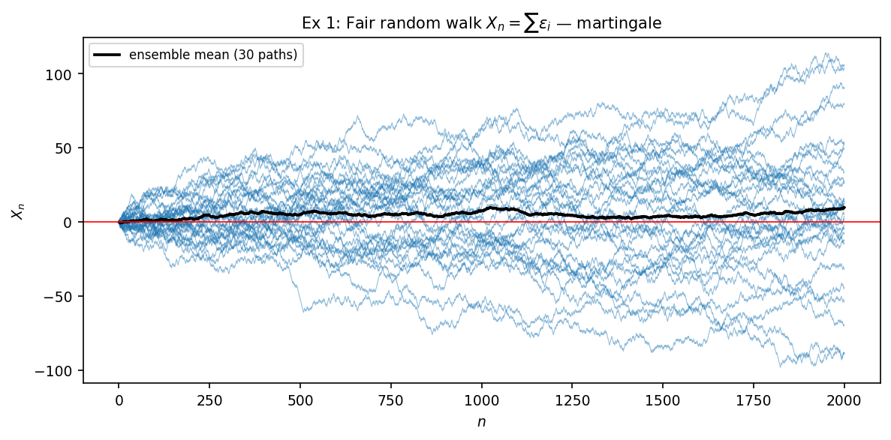
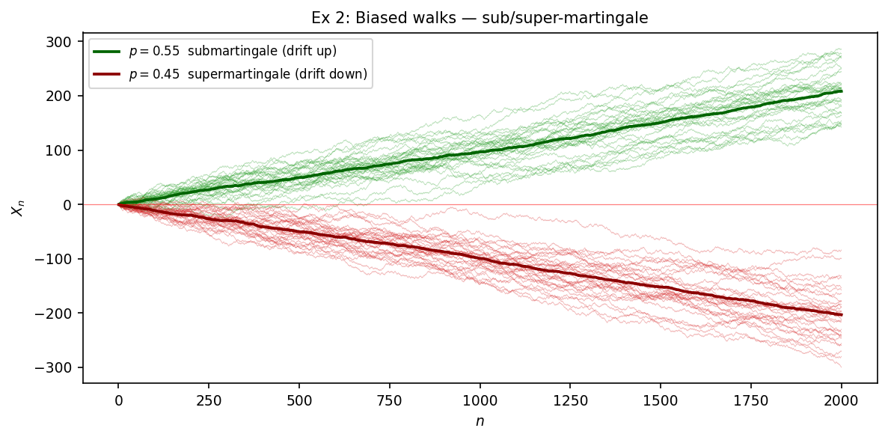
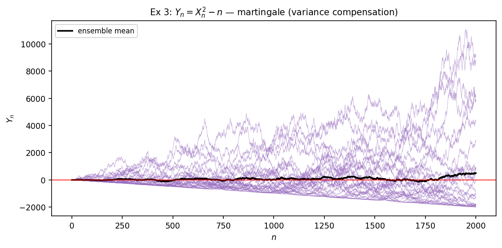
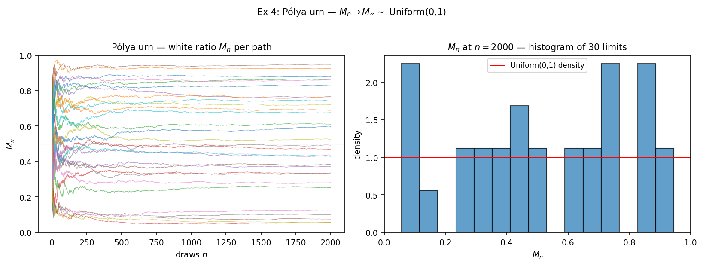
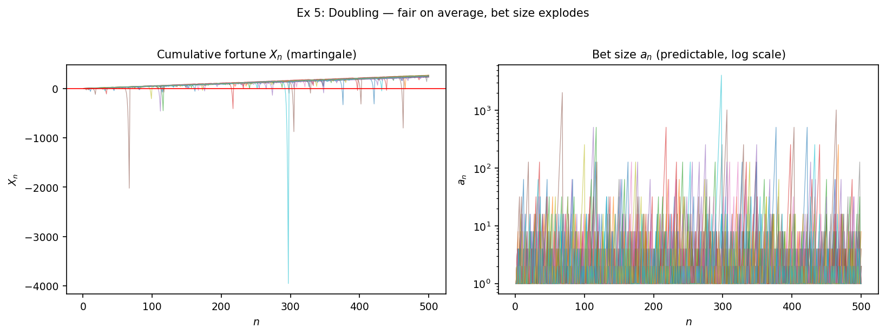
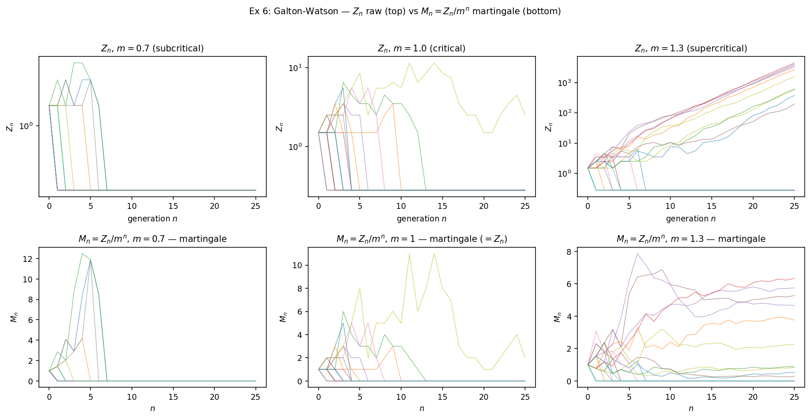

<!-- 소유권자: 리이 | 사용자: 리이 -->

```{=html}
<style>
.math.display { text-align: left; }
mjx-container[display="true"] { text-align: left !important; margin-left: 0 !important; }
.katex-display { text-align: left !important; }
.katex-display > .katex { text-align: left !important; }
</style>
```

마팅게일은 *"평균적으로 공정한 게임"* 의 수학적 추상이다. 정확하게는 — 적분가능한 process $\{X_n\}_{n \geq 0}$ 이 filtration $\{\mathcal F_n\}$ 에 적응되어 있고 ($X_n \in \mathcal F_n$, $E|X_n| < \infty$) 각 step 의 조건부 평균이 현재 값과 같을 때, 즉 $E[X_{n+1} \mid \mathcal F_n] = X_n$, 를 만족할 때 $\{X_n\}$ 을 $\mathcal F_n$-마팅게일이라 부른다. 부등호 $\geq$ 면 submartingale, $\leq$ 면 supermartingale. 정의를 처음 보면 추상적인데, 시뮬로 한두 path 만 그려보면 어떤 process 가 마팅게일인지가 즉각 와닿는다. 본 글은 6개 예제로 그 직관을 짚는다. 모든 시뮬은 같은 헤더로 시작한다.

```python
import numpy as np
import matplotlib.pyplot as plt
rng = np.random.default_rng(20260522)
NPATH = 30; T = 2000
t = np.arange(1, T + 1)
```

`-` **예제 1 — fair random walk.** $\epsilon_i \in \{-1, +1\}$ 각 prob $1/2$, $X_n = \sum \epsilon_i$. natural filtration $\mathcal F_n = \sigma(\epsilon_1, \dots, \epsilon_n)$ 에서 $E[X_{n+1} \mid \mathcal F_n] = X_n + E[\epsilon_{n+1}] = X_n + 0 = X_n$ 이므로 마팅게일.

```python
eps1 = rng.choice([-1.0, 1.0], size=(NPATH, T))    # ε_i ∈ {±1}, i.i.d. fair
X1 = np.cumsum(eps1, axis=1)                        # X_n = Σ ε_i

fig, ax = plt.subplots(figsize=(8, 4))
for k in range(NPATH):
    ax.plot(t, X1[k], lw=0.5, alpha=0.5, color="C0")
ax.plot(t, X1.mean(axis=0), lw=1.8, color="k", label="ensemble mean (30 paths)")
ax.axhline(0, color="r", lw=0.8); ax.legend()
```

{fig-alt="fair random walk 30 paths"}

30 path 의 평균 (굵은 검정선) 이 시간이 흘러도 0 근처에 머무는 게 마팅게일의 본질이다. 개별 path 는 자유롭게 진동하지만 ensemble 평균은 stationary — 이게 *"공정"* 의 정량적 의미.

`-` **예제 2 — 편향된 walk.** $\epsilon_i = +1$ (확률 $p$) / $-1$ (확률 $1-p$). $E[\epsilon] = 2p - 1$. $p = 0.55 \Rightarrow E[\epsilon] = +0.10 \Rightarrow E[X_{n+1} \mid \mathcal F_n] > X_n$ — submartingale. $p = 0.45 \Rightarrow$ supermartingale.

```python
def biased(p): return np.where(rng.random(size=(NPATH, T)) < p, 1.0, -1.0)
X2_sub = np.cumsum(biased(0.55), axis=1)            # submartingale
X2_sup = np.cumsum(biased(0.45), axis=1)            # supermartingale

fig, ax = plt.subplots(figsize=(8, 4))
ax.plot(t, X2_sub.mean(0), lw=1.8, color="darkgreen", label="p=0.55 submart. (drift up)")
ax.plot(t, X2_sup.mean(0), lw=1.8, color="darkred",   label="p=0.45 supermart. (drift down)")
# (individual paths 도 light 색으로 같이 그림)
```

{fig-alt="biased walks sub/super-martingale"}

두 ensemble 평균이 ±0.10 의 기울기로 갈라진다. 마팅게일은 sub 와 super 사이의 균형점 — drift 가 정확히 0 인 한 줄. 두고두고 쓰이는 사실.

`-` **예제 3 — variance compensation.** Fair walk 의 제곱 $X_n^2$ 은 평균 $n$ 으로 자라서 마팅게일이 아니다. 그런데 $n$ 만큼 빼주면 $Y_n := X_n^2 - n$ 이 마팅게일.

$$
E[X_{n+1}^2 \mid \mathcal F_n]
= X_n^2 + 2 X_n E[\epsilon_{n+1}] + E[\epsilon_{n+1}^2]
= X_n^2 + 0 + 1
\;\Rightarrow\; E[Y_{n+1} \mid \mathcal F_n] = X_n^2 + 1 - (n+1) = Y_n.
$$

```python
Y3 = X1 ** 2 - t[None, :]                           # X1 그대로 재사용

fig, ax = plt.subplots(figsize=(8, 4))
for k in range(NPATH):
    ax.plot(t, Y3[k], lw=0.5, alpha=0.5, color="C4")
ax.plot(t, Y3.mean(0), lw=1.8, color="k"); ax.axhline(0, color="r")
```

{fig-alt="Y_n = X_n^2 - n martingale"}

평균이 0 근처에 머문다. 이 trick 의 일반화가 *Doob-Meyer 분해* (submartingale = martingale + predictable increasing). HST 분석에도 자주 쓰인다.

`-` **예제 4 — Pólya urn.** 항아리에 흰 1개, 검 1개로 시작. 매 step 무작위 추첨, 그 색 +1. 흰 비율 $M_n := W_n/(W_n + B_n)$ 이 $[0,1]$ 위 마팅게일. 한 줄 검증:

$$E[M_{n+1} \mid \mathcal F_n] = M_n \cdot \tfrac{W_n + 1}{N_n + 1} + (1-M_n) \cdot \tfrac{W_n}{N_n + 1} = \tfrac{M_n N_n + M_n}{N_n + 1} = M_n.$$

```python
def polya_path(T):
    W, B = 1, 1; Ms = np.empty(T)
    for n in range(T):
        if rng.random() < W / (W + B): W += 1
        else: B += 1
        Ms[n] = W / (W + B)
    return Ms

M4 = np.array([polya_path(T) for _ in range(NPATH)])

# left: path,  right: M_n[-1] 의 histogram (각 path 의 limit)
```

{fig-alt="Polya urn ratio paths + uniform limit histogram"}

마팅게일이고 $[0,1]$ 위 uniformly bounded — Doob 의 마팅게일 수렴 정리로 $M_n \to M_\infty$ a.s. 가 어떤 random 극한으로 수렴. 흥미로운 점은 $M_\infty$ 가 결정론적 상수가 아니라 Uniform(0,1) 분포의 random variable 이라는 사실. 시뮬 오른쪽 histogram 이 그걸 보여준다. *"마팅게일이 수렴한다고 그 극한이 결정론적이라는 뜻은 아니다"* — 마팅게일 수렴은 ensemble 평균이 stationary 라는 것뿐, 개별 path 의 운명은 path-dependent.

`-` **예제 5 — Doubling strategy.** $\epsilon_i = \pm 1$ fair, 베팅 $a_n$ 은 직전 결과만 봄 (predictable). 잃으면 베팅 2배, 이기면 1로 reset. 누적 손익 $X_n := \sum a_i \epsilon_i$. predictable 베팅의 곱은 마팅게일을 *transform* 으로 보존하므로 (Durrett Thm 4.2.8), $X_n$ 자체가 마팅게일.

```python
def doubling_path(T):
    cur_bet = 1.0; X = 0.0
    Xs = np.empty(T); bets = np.empty(T)
    for i in range(T):
        eps = 1.0 if rng.random() < 0.5 else -1.0
        X += cur_bet * eps
        Xs[i], bets[i] = X, cur_bet
        cur_bet = 1.0 if eps > 0 else min(cur_bet * 2.0, 2**20)
    return Xs, bets

# 20 paths × T=500
```

{fig-alt="Doubling: cumulative fortune martingale + bet size explosion"}

왼쪽 path 들이 0 근처에서 진동 — *평균은 공정*. 하지만 베팅 자체는 log scale 로 그려야 보일 정도로 폭발한다. 이게 마틴게일 도박법의 본질 — 평균적으로 공정하지만 한 path 의 베팅 분산이 무한. 실제 도박장에서 무너지는 이유는 유한한 자본 때문이지 마팅게일 성질 때문이 아니다.

`-` **예제 6 — Galton-Watson branching.** 한 generation 의 인구 $Z_n$ 이 다음 세대에서 $Z_{n+1} = \sum_{i=1}^{Z_n} \xi_i$, $\xi_i \overset{\text{iid}}{\sim} \text{Poisson}(m)$. $m$ 이 평균 자손 수. $Z_n$ 자체는 마팅게일이 아니지만 ($m \neq 1$ 이면 평균이 $m^n$ 으로 자람), 정규화 $M_n := Z_n / m^n$ 이 마팅게일.

$$E[Z_{n+1} \mid \mathcal F_n] = m \cdot Z_n \;\Rightarrow\; E[M_{n+1} \mid \mathcal F_n] = \tfrac{E[Z_{n+1} \mid \mathcal F_n]}{m^{n+1}} = \tfrac{Z_n}{m^n} = M_n.$$

```python
def gw_path(m, n_steps, max_pop=10**6):
    Zs = [1]
    for _ in range(n_steps):
        z = Zs[-1]
        if z == 0: Zs.append(0)
        else: Zs.append(min(rng.poisson(m, size=z).sum(), max_pop))
    return np.array(Zs)

T_gw = 25; n_paths_gw = 20
Z_super = np.array([gw_path(1.3, T_gw) for _ in range(n_paths_gw)])
Z_crit  = np.array([gw_path(1.0, T_gw) for _ in range(n_paths_gw)])
Z_sub   = np.array([gw_path(0.7, T_gw) for _ in range(n_paths_gw)])
t_gw = np.arange(T_gw + 1)
M6_super = Z_super / (1.3 ** t_gw[None, :])
M6_crit  = Z_crit  / (1.0 ** t_gw[None, :])
M6_sub   = Z_sub   / (0.7 ** t_gw[None, :])
```

{fig-alt="Galton-Watson Z_n raw vs M_n martingale in three regimes"}

위 행은 raw $Z_n$ 의 폭발/멸종 거동, 아래 행은 정규화 $M_n$ 의 마팅게일 거동. Subcritical ($m = 0.7$) 에서는 인구가 빠르게 멸종 ($Z_n = 0$), $1/m^n$ 가 폭발해서 $M_n$ 거동이 path 별로 갈림. Critical ($m = 1$) 에서는 $M_n = Z_n$ 자체 — 확률 1로 멸종하지만 그 과정이 매우 느려서 평균이 1을 유지 (마팅게일 보존). Supercritical ($m = 1.3$) 에서는 폭발 ($M_n$ 이 finite random limit) 또는 멸종 ($M_n \to 0$). 양쪽 결과의 확률이 *멸종 확률* 이라는 그 자체로 유명한 양 — 마팅게일 평균 1 = 멸종확률·0 + 생존path 의 평균 limit, 으로 식이 닫힌다.

여섯 예제를 한 줄로 묶으면 — 마팅게일은 결정론적 stationary 가 아니라 ensemble-평균 stationary. 개별 path 는 자유롭게 진동하거나 폭발하거나 random limit 을 가질 수 있지만, 매 step 의 조건부 평균 변동이 정확히 0 이라는 그 한 조건이 모든 path 를 한 쇠줄로 묶고 있다. 이게 마팅게일이 도박, 인구 동력학, 강화학습, 금융, HST 의 height 잔차 등 어디서나 자연스럽게 튀어나오는 이유다. *"평균이 변하지 않는다"* 라는 가장 약한 통제만으로도 정리의 칼날이 살아남는다.

마팅게일이 *살아남으면* 어떤 일이 일어나는가 — SLLN, CLT, optional stopping, concentration — 은 다른 글의 주제 ([`260522_f2fd96.html`](260522_f2fd96.html) Durrett 4.5.3 + HST Theorem C Step 1 적용 글).

전체 시뮬 코드와 raw 데이터는 회사 루트의 `260522_리이_마팅게일이무엇인지시뮬.py` 와 `results/numeric/260522_리이_마팅게일이무엇인지시뮬.py/raw.npz`. random seed 모두 `20260522`, NPATH=30 (Ex 5·6 은 20), T=2000 (Ex 5 는 500, Ex 6 은 25 generation).
