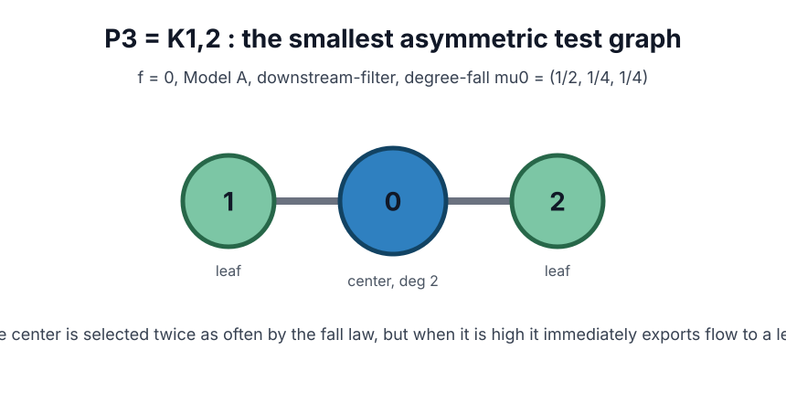
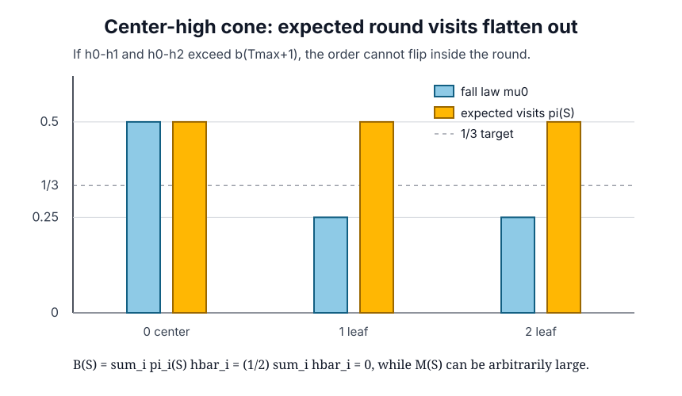
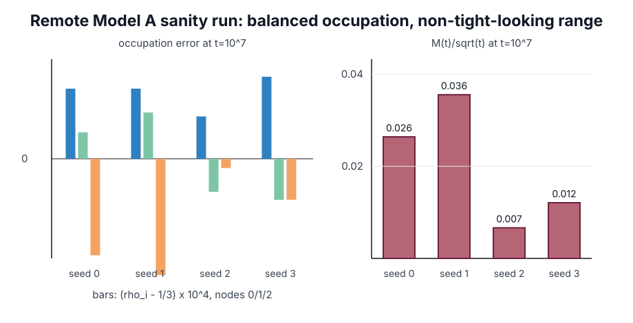
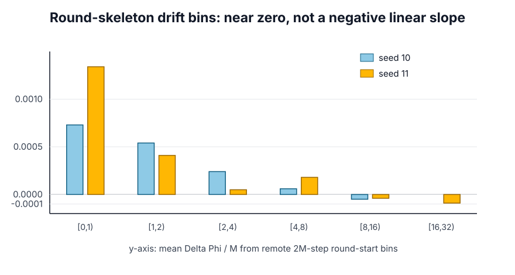

<!-- 소유권자: 미소 | 사용자: 미소 -->
<!-- Created: 2026-05-24 by 미소 -->

이번 노트는 balanced regime 과 Foster assumption 의 차이를 `P3 = K_{1,2}` 에서 다시 정리한 것이다. 앞선 접근에서 잘못 잡았던 지점은 두 가지였다. 첫째, 방문분포가 균등하지 않은 그래프를 들고 오면 balanced 반례가 아니라 balanced 실패 예시가 된다. 둘째, 임의로 만든 한 round 상태만 보고 끝내면 `f=0` 에서 실제로 그 상태가 장기 동역학 안에서 의미 있게 나타나는지 설명하지 못한다.

그래서 이번에는 목표를 이렇게 고정한다.

1. 시작은 반드시 $f \equiv 0$.
2. Model A, 즉 매 step 마다 $b'_s \sim \operatorname{Unif}(0,b)$ 를 새로 뽑는다.
3. 알고리즘은 최신 정본인 downstream-filter 이다.
4. 봐야 할 것은 $\rho=(1/3,1/3,1/3)$ 에 가까운 balanced occupation 과, 동시에

$$
B(S_R) \leq -\varepsilon_B M(S_R)+C_B
\qquad(\varepsilon_B>0)
$$

형태의 Foster drift 가 실제로 보장되는지다.

## 정확히 잡히는 local obstruction

먼저 pointwise Foster 조건이 왜 P3에서 위험한지 정확히 보자. 노드는 중심 $0$ 과 leaf $1,2$ 로 두고, fall law 는 degree-proportional 로 둔다.

$$
\mu_0 = (1/2,1/4,1/4).
$$

중심이 leaf 둘보다 충분히 높다고 하자.

$$
h_0-h_1>b(T_{\max}+1),
\qquad
h_0-h_2>b(T_{\max}+1).
$$

이 gap 조건이 있으면 한 round 안에서 높이 순서가 뒤집히지 않는다. downstream-filter 는 다음처럼 작동한다.

- center 에서 시작하면, 낮은 leaf 둘 중 하나로 한 번 flow 한 뒤 block 된다.
- leaf 에서 시작하면, neighbor 인 center 가 더 높으므로 바로 block 된다.

따라서 round 안 expected visit count 는 fall law 와 달라진다.

계산하면

$$
\pi(S)
=
\left({1\over 2},{1\over 2},{1\over 2}\right).
$$

그래서 centered height 를 $\bar h_i=h_i-\frac13\sum_j h_j$ 라고 쓰면,

$$
\begin{aligned}
B(S)
&= \sum_i \pi_i(S)\bar h_i \\
&= {1\over2}\sum_i \bar h_i \\
&= 0.
\end{aligned}
$$

반면 $M(S)=\max_i|\bar h_i|$ 는 이 cone 안에서 얼마든지 크게 만들 수 있다. 예를 들어

$$
\bar h = (R,-R/2,-R/2)
$$

라고 두면 $M(S)=R$ 이지만 $B(S)=0$ 이다. 그러므로 Foster 조건을 모든 큰 상태 $S$ 에 대해 pointwise 로 요구한다면, P3의 center-high cone 은 이미

$$
0 \leq -\varepsilon_B R + C_B
$$

를 arbitrarily large $R$ 에서 강제하므로 불가능하다.

여기까지는 정확계산이다. 다만 이 문장만으로 "`f=0` 동역학의 최종 반례"라고 박으면 안 된다. 대표님 지적대로 Theorem A 쪽에서 중요한 것은 한 round 장난감이 아니라, 실제 `f=0` process 가 장기적으로 어떤 occupation 과 height range 를 만드는가다.

## f=0에서 본 balanced 쪽

`f=0`, Model A, downstream-filter, $T_{\max}=20$, $b=0.05$ 로 원격 sanity run 을 돌렸다. 여기서 fall law 자체는 $(1/2,1/4,1/4)$ 로 균등하지 않지만, flow 가 center 쪽 눈을 leaf 로 밀어내기 때문에 장기 occupation 은 균등 쪽으로 붙는다.

$t=10^7$ 에서 seed 0--3의 occupation 은 다음 수준이다.

| seed | $\rho_0$ | $\rho_1$ | $\rho_2$ | $M(t)$ |
|---:|---:|---:|---:|---:|
| 0 | 0.33351 | 0.33340 | 0.33309 | 83.511 |
| 1 | 0.33351 | 0.33345 | 0.33304 | 112.412 |
| 2 | 0.33344 | 0.33325 | 0.33331 | 21.013 |
| 3 | 0.33354 | 0.33323 | 0.33323 | 38.224 |

이 결과는 "star 나 $C_{60}$+pendant 를 balanced 반례라고 부르는" 식의 문제와 다르다. 그쪽은 애초에 장기 방문률이 노드별로 달라지는 방향이라 balanced 조건 자체가 깨진다. P3는 작은 그래프인데도 occupation 은 균등으로 붙고, 동시에 center-high cone 에서는 Foster 의 음의 linear term 이 사라지는 구조가 보인다.

## Foster drift 쪽은 어떻게 보이나

Foster 조건의 핵심은 큰 $M$ 영역에서 drift proxy 가 음의 linear slope 를 가져야 한다는 점이다.

$$
B(S)
\lesssim
-\varepsilon_B M(S)
\quad\text{for large }M(S).
$$

원격 round-skeleton binning 에서도 큰 $M$ bin 의 평균 drift 는 강한 음의 slope 로 보이지 않았다. 아래 그림은 2M-step run 두 개(seed 10, 11)에서 round 시작점의 $M$ bin 별 평균 $\Delta\Phi/M$ 을 그린 것이다.

큰 bin 에서 값은 0 근방에 붙어 있고, 적어도 이 scale 에서는 $-\varepsilon M$ 꼴의 복원 slope 가 관측되지 않는다.

| seed | $M$ bin | mean $M$ | mean $\Delta\Phi/M$ |
|---:|---:|---:|---:|
| 10 | $[4,8)$ | 6.073 | $+0.00006$ |
| 10 | $[8,16)$ | 10.381 | $-0.00005$ |
| 11 | $[4,8)$ | 6.565 | $+0.00018$ |
| 11 | $[8,16)$ | 10.957 | $-0.00004$ |
| 11 | $[16,32)$ | 17.182 | $-0.00009$ |

이것은 완전한 증명이 아니라 drift profile 의 방향 확인이다. 하지만 방향은 분명하다. balanced occupation 은 보이는데, 큰 imbalance 를 선형으로 끌어내리는 Foster 복원력은 보이지 않는다.

## 현재 결론

P3에서 정확히 말할 수 있는 것은 다음이다.

첫째, pointwise Foster inequality 를 모든 큰 상태에 대해 요구하면 P3의 center-high cone 이 깨뜨린다. 그 cone 에서는 $\pi(S)=(1/2,1/2,1/2)$ 이고 $B(S)=0$ 이며, $M(S)$ 만 arbitrarily large 로 보낼 수 있다.

둘째, `f=0` Model A 원격 sanity run 에서는 occupation 이 $\rho=(1/3,1/3,1/3)$ 로 붙는다. 즉 이 예시는 star 류처럼 balanced 자체가 실패해서 탈락하는 케이스가 아니다.

셋째, 아직 남은 증명 과제는 `f=0` chain 이 이 local obstruction 을 장기적으로 얼마나 자주, 얼마나 크게 방문하는지 formalize 하는 것이다. 이를 보이면 "balanced 이지만 Foster assumption 은 필요하다"는 반례로 닫힌다. 반대로 누군가 P3에서 pathwise/tight bound 를 증명한다면, 이 후보는 final counterexample 이 아니라 pointwise Foster 조건의 과강함을 보여 주는 예시로 내려간다.

따라서 현재 가장 정직한 상태는 이렇다.

> P3는 balanced occupation 과 Foster drift 를 분리하는 가장 작은 후보이며, pointwise Foster 조건은 정확계산으로 이미 center-high cone 에서 막힌다. `f=0` 기준 최종 반례로 쓰려면, 장기 chain 이 그 obstruction 을 실제로 unbounded scale 에서 밟는다는 마지막 확률론 조각을 더 증명해야 한다.

이제 다음 작업은 반례를 더 키우는 것이 아니라, P3에서 $Y_t=h_0(t)-\frac12(h_1(t)+h_2(t))$ 같은 1차 projection 을 잡아 center-high cone 의 exit/return 구조를 martingale 또는 renewal argument 로 닫는 것이다. 여기까지 닫히면 Assumption 제거 불가 쪽이 훨씬 깨끗해진다.
