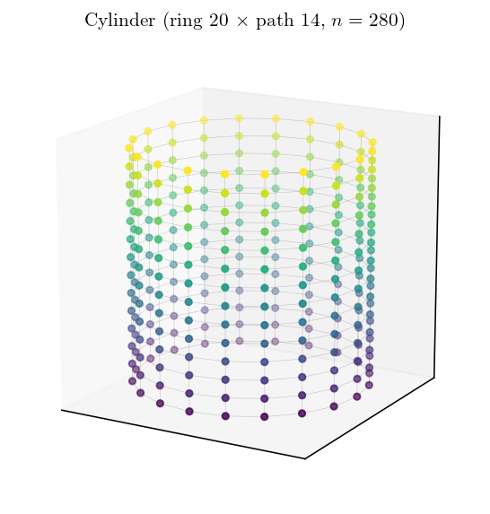
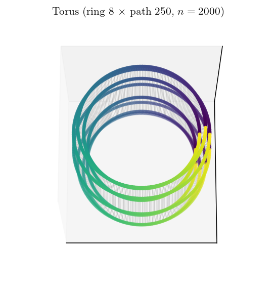
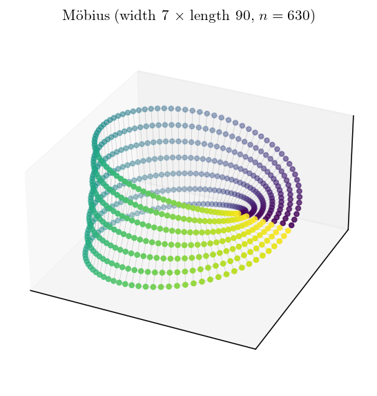

<!-- 소유권자: 소미 | 사용자: 소미 -->

`examples_24`의 Cyl Inter-bidir는 둘레(ring) cycle을 축(path) 방향으로 여러 층 쌓고, 이웃한 층의 같은 위치 노드를 양방향으로 이은 grid다. 이 grid를 **어느 방향으로 닫느냐**에 따라 전혀 다른 위상이 나온다. 원기둥, 도넛, 뫼비우스 띠 세 가지를 같은 둘레×축 grid에서 만들어 본다.

축 양끝을 잇지 않으면 그대로 **원기둥(cylinder)**이다. 양 끝의 ring이 열린 경계가 되어 그 노드들은 degree 3, 안쪽 층은 degree 4가 된다. 경계가 두 개인 구조다.

축의 양끝을 cycle로 이어 닫으면 **도넛(torus)**이 된다. 둘레를 좁게(노드 8개), 축을 길게(250층) 잡으면 가는 튜브가 큰 고리를 도는 형태다. 둘레도 축도 모두 cycle이라 **모든 노드가 degree 4로 균일**하고, 열린 경계가 하나도 없다. 어느 노드에서 봐도 국소 구조가 똑같은 vertex-transitive 그래프다.

축 양끝을 잇되 이을 때 **폭 방향 인덱스를 한 번 뒤집으면(half-twist)** 뫼비우스 띠가 된다. 폭 방향은 cycle이 아니라 선분이라 양 가장자리가 경계인데, half-twist 때문에 한 바퀴 돌면 위 가장자리가 아래 가장자리로 이어진다. 그래서 **경계가 둘이 아니라 하나**로 합쳐지고, 안과 밖의 구분이 없는 non-orientable 면이 된다. 아래 그림에서 색(축 진행)이 한 바퀴 돌며 띠가 비틀려 이어지는 것을 볼 수 있다.

세 구조는 같은 둘레×축 grid를 어떻게 닫느냐만 다른데 경계의 개수가 2 / 0 / 1로 갈린다.

| 구조 | 축 양끝 처리 | 경계(boundary) | orientable | degree |
|---|---|---|---|---|
| Cylinder | 열림 (path) | 2 (양끝 ring) | ✓ | 끝 3 / 안 4 |
| Torus | 닫음 (cycle) | 0 | ✓ | 4 균일 |
| Möbius | 닫되 폭 뒤집기 | 1 | ✗ | 가장자리 3 / 안 4 |

HST 관점에서 흥미로운 점은, 경계의 유무가 노드별 장기 점유율 $\rho_i$의 균등성에 직접 영향을 준다는 것이다. 경계가 없는 torus는 모든 노드가 대칭이라 $\rho_i$가 완전히 균등해질 것으로 기대되고(Theorem A balanced 영역), 경계를 가진 cylinder와 뫼비우스는 경계 근처 노드의 점유율이 안쪽과 달라져 비대칭이 생긴다. 같은 grid에서 닫는 방식만 바꿔 Foster's drift criterion의 성립 여부가 어떻게 갈리는지는 다음 시뮬에서 다룬다.

세 구조의 그래프 생성·시각화 코드는 책상에 보관: `260524_소미_위상변형_fig.py` (cylinder/torus/Möbius 정의 + 3D 좌표), `260524_소미_cylinder_torus.py`, `260524_소미_mobius.py`.
