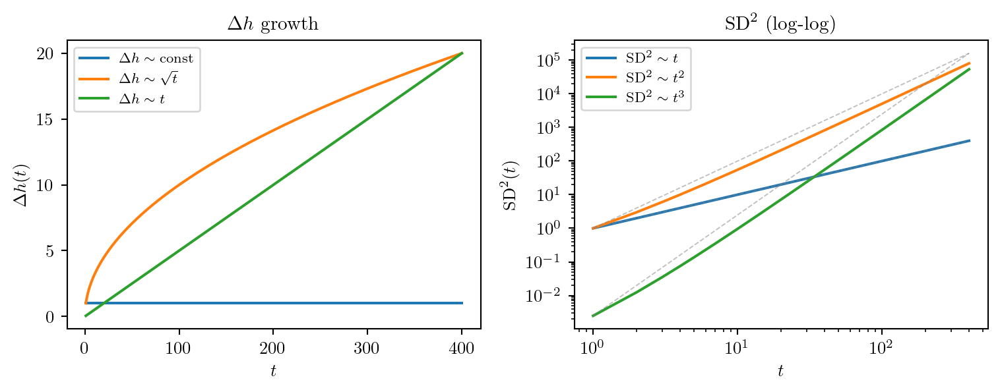

```{=html}
<style>
.math.display { text-align: left; }
mjx-container[display="true"] { text-align: left !important; margin-left: 0 !important; }
.katex-display { text-align: left !important; }
.katex-display > .katex { text-align: left !important; }
</style>
```


> *(스튜디오. 화이트보드에 수식 하나 — $\mathrm{SD}^2(t) \sim t^k$. H 가 분필을 들며 시작한다.)*

**H.** 오늘은 HST 에서 왜 $t$, $t^2$, $t^3$ 이라는 세 숫자가 나타나는지를 얘기해볼게요. 정답부터 말하면, 이건 전부 "높이차 $\Delta h(t)$ 가 얼마나 빠르게 자라느냐" 의 문제예요.

**G.** SD² 가 뭔지부터 짚어줄 수 있어요?

**H.** 두 노드 $i$, $j$ 사이의 Snow Distance 제곱은, 시각 $t$ 까지 매 순간의 높이차를 제곱해서 더한 것이에요.

$$\mathrm{SD}^2(t) \;=\; \sum_{t'=0}^{t} \bigl(\Delta h(t')\bigr)^2, \qquad \Delta h(t') = h(i, t') - h(j, t').$$

**G.** 적분 아니고 시그마군요.

**H.** 맞아요. HST는 이산 시간이니까요. 시각 0부터 $t$ 까지 높이차의 제곱을 하나씩 쌓는 거예요.

---

## 에피소드 1: 세 경우

**H.** 이제 $\Delta h(t')$ 가 어떻게 자라냐에 따라 합산 결과가 어떻게 달라지는지 봐요. 경우 세 가지.

첫 번째. **높이차가 상수**라면 — $\Delta h(t') \approx c$.

$$\mathrm{SD}^2(t) \;=\; \sum_{t'=0}^{t} c^2 \;=\; c^2 (t+1) \;\sim\; t.$$

매 step에 $c^2$ 씩 쌓이니까 그냥 $t$ 에 비례해요.

**G.** $\mathrm{SD}^2 / t \to c^2$ 로 수렴하는 거네요.

**H.** 맞아요. 이게 Thm A. 이제 두 번째. **높이차가 $\sqrt{t'}$ 처럼 자란다면** — $\Delta h(t') \sim \sqrt{t'}$.

$$\mathrm{SD}^2(t) \;\sim\; \sum_{t'=1}^{t} t' \;=\; \frac{t(t+1)}{2} \;\sim\; t^2.$$

$(\sqrt{t'})^2 = t'$ 이니까, 1부터 $t$ 까지 더하면 $t^2/2$.

**G.** 그럼 세 번째는?

**H.** **높이차가 $t'$ 자체처럼 자란다면** — $\Delta h(t') \sim t'$.

$$\mathrm{SD}^2(t) \;\sim\; \sum_{t'=1}^{t} (t')^2 \;=\; \frac{t(t+1)(2t+1)}{6} \;\sim\; t^3.$$

$(t')^2$ 의 합이 $t^3/3$. 이게 Thm C.

**G.** 깔끔하네요. 표로 보면?

**H.**

| $\Delta h(t')$ 성장 | $(\Delta h)^2$ | $\sum_{t'=1}^{t}$ | $\mathrm{SD}^2$ |
|---|---|---|---|
| 상수 $c$ | $c^2$ | $c^2 t$ | $\sim t$ |
| $\sqrt{t'}$ | $t'$ | $t^2/2$ | $\sim t^2$ |
| $t'$ | $(t')^2$ | $t^3/3$ | $\sim t^3$ |

세 exponent 는 "$\Delta h$ 의 성장 차수를 제곱해서 더했을 때" 자연스럽게 나오는 거예요.

```{python}

T = 400
tp = np.arange(1, T + 1)

dh_A = np.ones(T)
dh_B = np.sqrt(tp)
dh_C = 0.05 * tp

SD2_A = np.cumsum(dh_A**2)
SD2_B = np.cumsum(dh_B**2)
SD2_C = np.cumsum(dh_C**2)

fig, axes = plt.subplots(1, 2, figsize=(8, 3.2))

# 왼쪽: Delta h
ax = axes[0]
ax.plot(tp, dh_A, label=r"$\Delta h \sim \mathrm{const}$", lw=1.5)
ax.plot(tp, dh_B, label=r"$\Delta h \sim \sqrt{t}$",        lw=1.5)
ax.plot(tp, dh_C, label=r"$\Delta h \sim t$",               lw=1.5)
ax.set_xlabel(r"$t$"); ax.set_ylabel(r"$\Delta h(t)$")
ax.set_title(r"$\Delta h$ growth")
ax.legend(fontsize=8)

# 오른쪽: SD² (log-log)
ax = axes[1]
ax.loglog(tp, SD2_A, label=r"$\mathrm{SD}^2 \sim t$",   lw=1.5)
ax.loglog(tp, SD2_B, label=r"$\mathrm{SD}^2 \sim t^2$", lw=1.5)
ax.loglog(tp, SD2_C, label=r"$\mathrm{SD}^2 \sim t^3$", lw=1.5)
# 기울기 참조선
ax.loglog(tp, tp * SD2_A[0],           "--", color="gray", lw=0.7, alpha=0.5)
ax.loglog(tp, tp**2 * SD2_B[0]/1,      "--", color="gray", lw=0.7, alpha=0.5)
ax.loglog(tp, tp**3 * SD2_C[0]/1,      "--", color="gray", lw=0.7, alpha=0.5)
ax.set_xlabel(r"$t$"); ax.set_ylabel(r"$\mathrm{SD}^2(t)$")
ax.set_title(r"$\mathrm{SD}^2$ (log-log)")
ax.legend(fontsize=8)

fig.tight_layout()
import os
os.makedirs("results/figures/260528_도비_HST_SD스케일링직관.qmd", exist_ok=True)
fig.savefig("results/figures/260528_도비_HST_SD스케일링직관.qmd/sd2_scaling.png",
            dpi=150, bbox_inches="tight")
plt.show()
```

{#fig-sd2}

---

## 에피소드 2: 왜 Thm B 에서 높이차가 $\sqrt{t}$ 인가

**G.** 상수랑 $t$ 는 이해됐어요. 그런데 $\sqrt{t}$ 는 어디서 나오는 건지 모르겠어요.

**H.** 이게 핵심이에요. Walker 가 매 step $t'$ 에 눈을 한 번 쌓잖아요. 높이차의 **증분** $\xi_{t'}$ 을 보면:

$$\xi_{t'} \;:=\; \Delta h(t') - \Delta h(t'-1) \;=\; \begin{cases} +b & \text{walker 가 노드 } i \text{ 에 있을 때} \\ -b & \text{walker 가 노드 } j \text{ 에 있을 때} \\ 0 & \text{그 외} \end{cases}$$

**G.** 매 step 마다 $\pm b$ 아니면 0 이군요.

**H.** 그리고 $\Delta h(t') = \sum_{s=1}^{t'} \xi_s$ 예요 — 증분들의 누적합. 이제 Thm B 조건에서 $i$와 $j$ 를 방문할 확률이 비슷하면, 엄밀히 i.i.d.는 아니지만 ($\xi_s$ 에는 height·route·round 구조에서 오는 의존성이 남아요) **평균 0에 가까운 동전 던지기처럼** 행동해요.

**G.** 동전을 $t'$ 번 던지면 앞-뒤 차이가 $\sqrt{t'}$ 만큼 퍼지는 그거요?

**H.** 직관적으로는 그거예요. 엄밀한 CLT로 바로 증명되는 건 아니고 — leading drift 가 상쇄되고 남은 fluctuation 이 diffusive scale 로 누적된다고 보면 돼요. 동전을 $t'$ 번 던졌을 때 앞면 횟수 - 뒷면 횟수 의 표준편차가 $\sqrt{t'}$ 인 것처럼, 높이차 $\Delta h(t')$ 도 $\sqrt{t'}$ 만큼 방랑해요. 중심이 없는 랜덤워크. 1차원 취객이 $t'$ 걸음 걸은 뒤 출발점으로부터 $\sqrt{t'}$ 거리에 있는 것과 같아요.

**G.** 그러면 Thm A 는요? 상수라고 했는데.

**H.** Thm A 는 그래프가 더 "균형잡혀" 있어서, 높이차가 한 값으로 수렴한다기보다 **상수 규모 $O(1)$ 에 머무는** 경우예요 — 흔들림마저 억눌려서 더는 퍼지지 않는 상황. Thm B 는 평균으로 돌아오지 않고 계속 방랑하는 경우고요.

**G.** Thm C 는?

**H.** Thm C 는 동전이 **찌그러진** 경우예요 — $i$ 를 방문할 확률이 $j$ 보다 체계적으로 높아서 $\xi_s$ 의 평균이 0 이 아니에요. 그러면 $\Delta h(t') \approx \mu \cdot t'$ 로 선형 drift. $\sqrt{t'}$ 이 아니라 $t'$.

**G.** 정리하면 — 동전의 치우침이 없으면 $\sqrt{t}$, 치우침이 있으면 $t$, 그리고 자꾸 제자리로 돌아오면 상수.

**H.** 딱 맞아요. 세 theorem 은 사실 "높이차 랜덤워크의 drift 크기" 세 경우예요.
