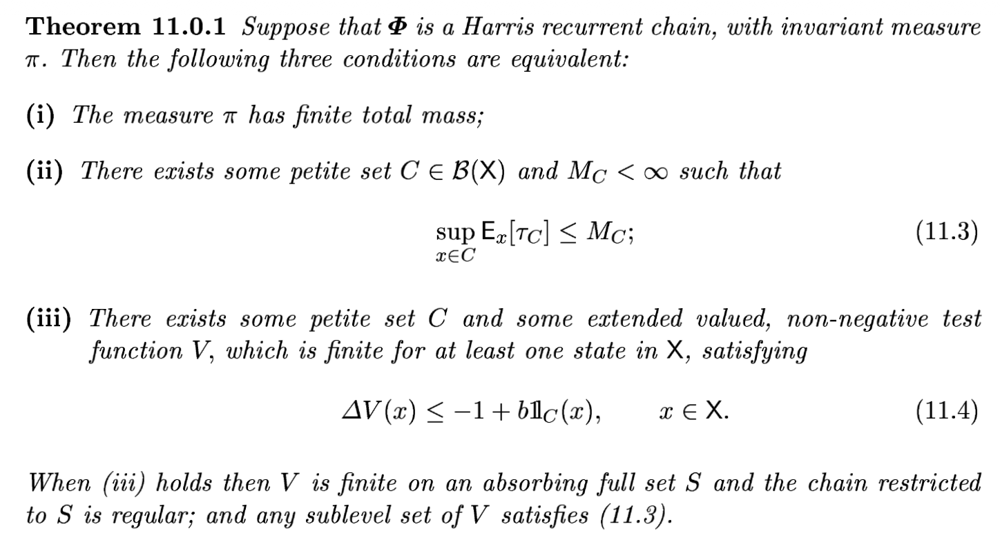
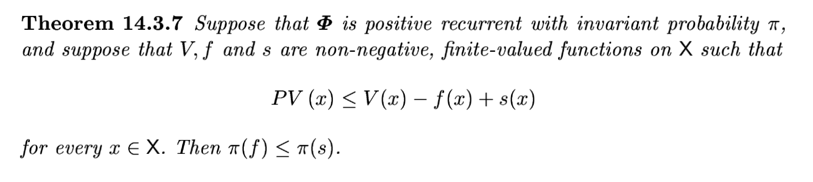
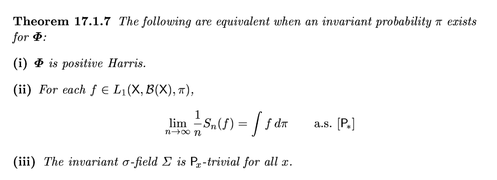
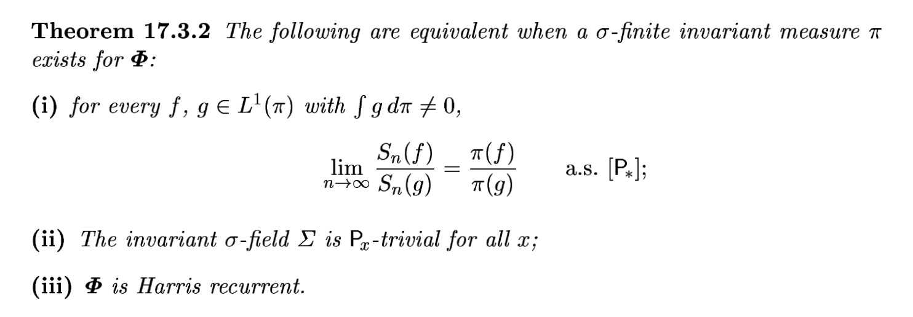

부품정리

 

Thm3에서 우리가 보이고 싶은것은

 $$\frac{SD_{ij}^2(t)}{t} \to c_{ij}\quad a.s.$$이다. 이를 위해서 우리는 Foster Thm을 사용한다. Foster의 Thm은 어떠한 마코프체인 $\{MC_t\}$가 적당한 조건을 만족할경우 

 $$\frac{1}{t}\sum_{k}^{t} g(S_k) \to \mathbb{E}[g(S_k)]\quad {a.s.}$$

임을 보여준다. 여기에서 $g$는 어떠한 함수이다. 우리는 $g:  {\cal X}^\star \to \mathbb{R}$ 를 아래와 같이 설정한다. 

$$g(S_r^\star)= \Delta h_{ij}(t_r)^2$$

# 가정들

## 가정2 (5.2절)

결국에 Thm3에서 요구하는건 $C_0$가 $(P^\star)^\ell$에 대해서 small set이라는 것임. 이건 일단 추후에 따지고 Lemma에서 보이고싶은건 $C_0$가 $(P^\star)^{m}$에 대하여 small set이라는 점임. 이것은 100개든 1000개든, 무수히 많은 HST의 프로세스가 서로 다른 임의의 시작 $s^\star \in C_0$ 를 고르더라도 정확하게 $m$-step 뒤에는 어떠한 상태들의 집합 ??에서 모이는 밀도하한이 있다는 의미이다. 이때 상태들의 집합 ??는 높이차집합과 노드집합의 곱으로 이루어진다. 편의상 노드집합은 $v_n$으로 고정하면 높이차집합만 고려하면 된다. 따라서 

"~----"

가 성립하도록 $\bar{U} \times \{v_n\}, m, \eta$를 직접 construct하면 증명이 끝난다. 이 조건은 결국 $m$ 라운드 이후에 시작점은 반드시 노드 $\{v_n\}$에 있을것과 $m$라운드 이후이 높이차집합은 $U$에 있을것을 요구한다. 원래 small의 정의에는 $U$는 상태공간 ${\cal X}^\star$의 부분집합이기만 하면 되는것이지 그 외적인 부분에 대한 특별한 제약은 없다. 그러나 우리는 편의상 아래를 $U$로 셋팅한다. 

1. $U \approx 0$ 
2. 즉 $U$ 내에서는 노드간의 높이 odering이 동일함. (tie를 피함)

1은 정말 아무이유없음. $U$가 다른점근처라도 상관없음. 단지 우리는 타겟을 잡기 편하게 하려고 그럼. (원점은 기억하기 쉬우니까) 

2는 왜 동일해야할까?? 나중에 설명하겠다. 

증명을 위해서는 아래와 같은 (살짝은 비 현실적인) 시나리오를 가정한다. 

1. 모든 fall event는 $v_1, v_2, v_3, \dots, v_n$ 의 노드에 순서대로 떨어진다. 즉 $X_{t_1} =v_1,X_{t_2}=v_2,\dots,$ 이다. 
2. 모든 fall event에서의 적립양만으로 $m$라운드 이후의 높이차를 $\bar{U}$를 구성한다. 
3. 모든 non-fall event의 적립양은 동일양으로 가정한다. (그래서 round가 끝나면 fall-node의 $\dot{h}$ 만 바뀌어있고 나머지는 그대로이다.) 

만약에 $m$을 $n$의 배수로한다면 $\bar{U} \times \{v_n\}$ 중에서 $\{v_n\}$에 대한 이벤트는 확실히 일어나게 할 수 있다. 이제 $U$를 맞추는 것만 남았다. $U$를 맞추는 사건을 구성하는 것은 매우 쉬운데, non-fall event에서 모두 0이 적립되고 나머지 fall에서는 원하는 숫자로 정립하면된다. (예를들어 계속 $b$씩 만들다가, 마지막에 목표근처에서 $b-??$의 값으로 조정하면된다) 뭐가 되었든 이렇게 구성해도 확률이 0은 아니므로 이런식으로 하면된다. 그런데 이렇게 안하는 이유가 뭘까?

$C_0$의 $s^\star$ 에 대한 공통의 bound를 만들기 위함 아닐까? 

그렇다면 $C_0$에서 최악의 start를 선택하고 ($C_0$의 경계면 중 하나가 최악의 시작점) 거기에서 $U$를 원점근처로 적당하게 잡으면 된다. 고정된 $U$에 대해서 챔버의 중심을 목표로 맞추게 된다면 약간 오차가 생기면서 $s^\star$에서 출발한 애가 $U$에 도착할텐데 어디에서 출발하든 그 오차의 range가 동일하고. $U$에 도착할 하한값이 존재한다. 

