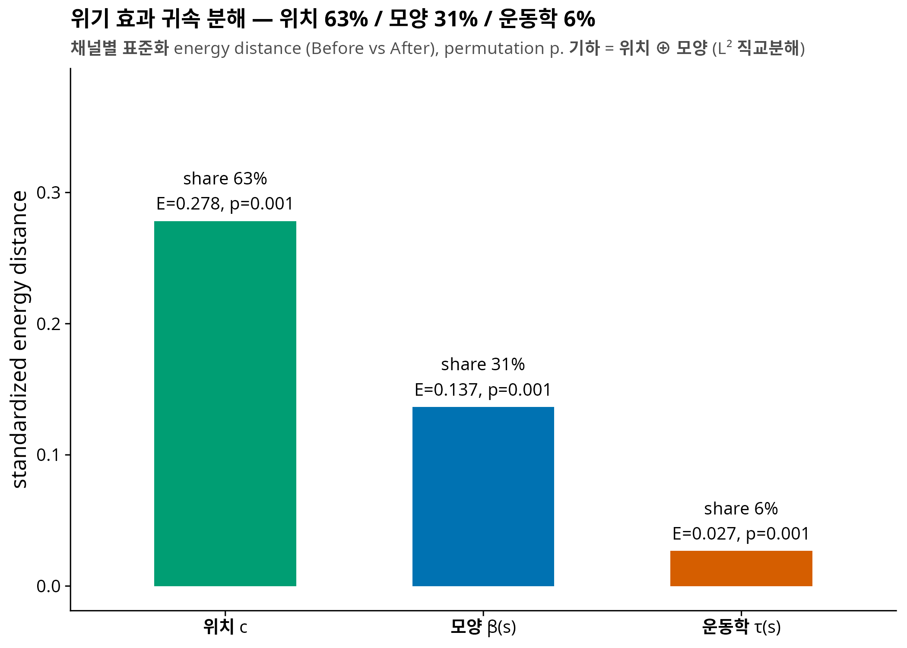
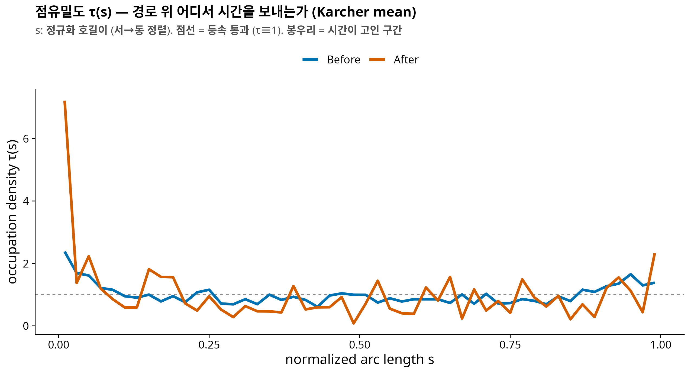
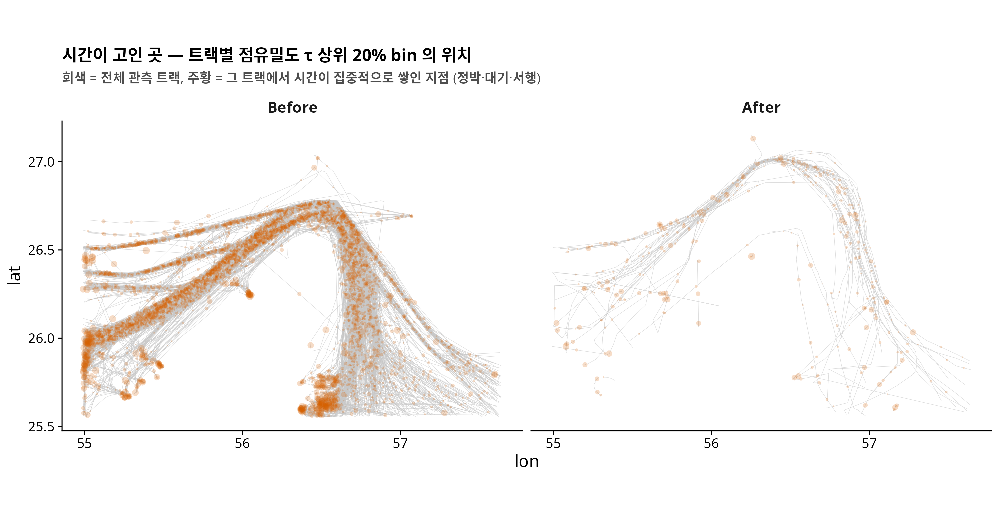
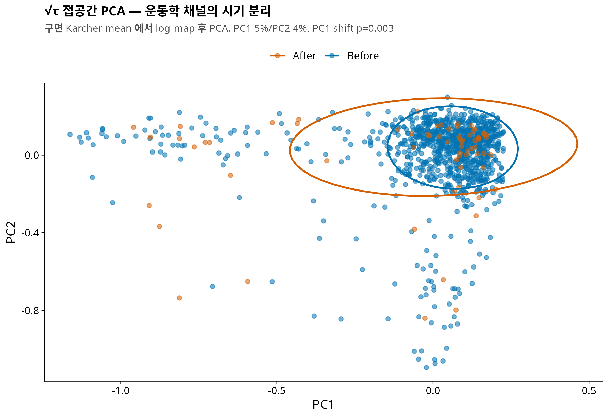

## 0. 한 줄 요약

궤적 하나를 **위치 c ⊕ 모양 β̃(s) ⊕ 운동학 τ(s)** 세 채널로 수학적으로 정확히 분해하고, 호르무즈 위기 효과가 각 채널에 얼마나 실렸는지 측정했다. 결과: **위치 63% / 모양 31% / 운동학 6%** — 세 채널 모두 유의 (permutation p ≤ 0.003). 위기는 무엇보다 "**어느 lane 으로 가는가**" 를 바꿨고, "어떻게 지나가는가" (시간이 경로 끝에 고이는 대기 패턴) 도 분명히, 그러나 상대적으로 작게 바꿨다.

> **선행 글**: [NYT 항적 figure 재현](260520_c900be.html) · [EDA (그룹 분류 6종)](260521_aee977.html)
> **선행 페이퍼**: 호르무즈 PathFDA v0.4 (영문 19쪽, `COMPANY/인연-호르무즈PathFDA-★★★.pdf`)

## 1. 왜 이 분해가 필요했나 — 단순 FDA 의 애매함

v0.1 부터 v0.4 까지의 p-value 를 한 줄로 정렬하면 이상한 그림이 보인다.

| 분석 | 대상 | perm p | 판정 |
|---|---|---|---|
| MFPCA (v0.1) | (x(t), y(t)) 그대로 | 0.129 | 애매 |
| SRVF elastic shape (v0.4 §3.7) | 모양 (위치·회전·스케일 제거) | 0.083 | 경계선 |
| 곡률 TAC (v0.4 §3.8) | 모양의 국소 거칠기 | 0.349 | null |
| track 속도·정박 (v0.4 §3.8) | 운동학 scalar | <0.0001 | 강함 |

곡률은 완전 null 인데 속도는 초강력, 그런데 정작 원좌표 MFPCA 는 애매하다? 원인은 표현 (representation) 에 있다. **(x(t), y(t)) 라는 좌표는 "어디로" 와 "어떻게" 를 한 그릇에 섞는다.** 강한 신호와 약한 신호가 섞이면 검정력이 희석되고, scalar 요약 (평균속도) 은 반대로 정보를 버린다. 신호가 어느 층에 사는지 물으려면 궤적을 **겹치지도 새지도 않게** 쪼개는 좌표계가 먼저 필요하다.

## 2. 3-수준 분해의 정의

관측 궤적 γ(t) 를 호길이 재매개화한 경로를 β(s), s ∈ [0,1] 라 하자. 분해는:

$$\underbrace{\beta(s)}_{\text{기하}} = \underbrace{c}_{\text{위치}} + \underbrace{\tilde\beta(s)}_{\text{모양}}, \qquad c = \int_0^1 \beta(s)\,ds$$

$$\underbrace{\tau(s)}_{\text{운동학}} = \frac{1/v(s)}{\int_0^1 1/v}, \qquad \int_0^1 \tau(s)\,ds = 1$$

| 채널 | 물음 | 수학적 집 |
|---|---|---|
| **위치 c** | 해협의 어느 lane 으로 갔나 | ℝ² (경로 중심) |
| **모양 β̃(s)** | 어떤 형태의 경로였나 | 중심화 곡선 공간, L² |
| **운동학 τ(s)** | 경로 위 어디서 시간을 보냈나 | [0,1] 위 확률밀도 → √τ 는 **Hilbert 구면** (Fisher–Rao) |

세 가지 성질이 이 분해를 지탱한다.

1. **직교성** — L² 에서 기하 채널은 정확히 피타고라스로 쪼개진다: $d^2_{\text{geo}} = \|c_1-c_2\|^2 + d^2_{\text{shape}}$. 겹침 없음.
2. **완전성** — (c, β̃, τ) 를 알면 궤적을 (시간 원점·전체 스케일 빼고) 복원할 수 있다. 누락 없음.
3. **τ 의 기하** — τ 는 확률밀도이므로 √τ 가 단위구면 위에 살고, Karcher mean·측지거리·접공간 PCA 가 전부 닫힌 형태로 나온다. **정박·대기는 τ 의 spike** 로, 등속 통과는 τ ≡ 1 로 나타난다.

::: {.callout-tip collapse="true" title="τ(s) 는 elastic FDA 의 'nuisance 의 반란' 이다"}
Srivastava–Klassen 계열 elastic shape analysis 는 시간 재매개화 (phase) 를 **제거할 노이즈**로 취급하고 모양만 남긴다 (v0.4 §3.7 이 그랬다). 그런데 호르무즈 데이터에서는 위기가 모양보다 **phase 를** 바꿨다 — 배들이 같은 길을 멈춰가며 지나갔다. τ(s) 는 그 버려지던 phase 정보를 확률밀도라는 잘 정돈된 대상으로 승격시킨 것이다. 돌쇠의 "The Strait as a Queue" 아이디어도 이 안에 공짜로 들어온다: **대기열 = 해협 진입부에 쌓이는 τ 의 질량.**
:::

## 3. 데이터와 방법

- NYT/Kpler 트랙 (before 1089 / after 85), 필터 n_pts ≥ 4 & L ≥ 1 km → **N = 1073 (Before 1006 / After 67)**
- 각 트랙: M = 50 호길이 bin. 기하 = β(s) 선형보간 (km 좌표, 서→동 정렬). 운동학 = segment 시간을 s-bin 에 배분한 τ
- 채널별 거리: 위치 = 유클리드, 모양 = 중심화 L², 운동학 = Fisher–Rao 측지거리 arccos⟨√τ₁, √τ₂⟩
- **효과 크기**: 채널별 [energy distance](https://en.wikipedia.org/wiki/Energy_distance) (Before vs After), 각 채널을 평균 pairwise 거리로 표준화해 단위 무관화. 귀속 share = E_ch / ΣE_ch
- 추론: permutation (B=999) + 트랙 bootstrap CI (B=500)

## 4. 결과 ① — 귀속 분해: 위치 63 / 모양 31 / 운동학 6

{fig-align="center"}

| 채널 | E (표준화) | perm p | share | 95% CI |
|---|---|---|---|---|
| 위치 c | 0.278 | 0.001 | **63%** | [50, 72]% |
| 모양 β̃(s) | 0.137 | 0.001 | **31%** | [19, 41]% |
| 운동학 τ(s) | 0.027 | 0.001 | **6%** | [6, 13]% |

NYT 기사의 headline ("항로가 이란 측 shallow lane 으로 북상") 이 위치 채널 63% 로 정량화된다. 눈여겨볼 것은 **모양 31%** — 위치를 빼고도 경로의 형태 (만곡의 방향, 관측 구간의 연장 포함) 가 분명히 달라졌다. v0.4 의 SRVF 가 p=0.083 애매였던 것과 상충하는 듯 보이지만, SRVF 는 회전·스케일까지 제거한 훨씬 좁은 "모양" 이고 여기의 β̃ 는 지리적 방향·연장을 보존한다 — 위기의 모양 효과는 **국소 거칠기 (곡률, null)** 가 아니라 **대역적 형태** 에 실려 있다는 뜻이다.

## 5. 결과 ② — 시간은 경로의 끝에 고였다

{fig-align="center"}

운동학 채널의 내용을 열어보면: Before 의 τ 는 거의 평평 (등속 통과, 점선 τ≡1 근처) 인 반면, **After 는 관측 경로의 서쪽 끝 (s≈0) 에 거대한 봉우리** 가 있다. τ 의 엔트로피도 유의하게 감소했다 (obs = −0.34, p=0.001) — 시간이 경로 전체에 고르게 퍼지지 않고 **한 곳에 고이기 시작했다**는 뜻이다.

{fig-align="center"}

::: {.callout-important collapse="true" title="해석 주의: s≈0 봉우리 ≠ 곧바로 '진입 대기열'"}
s 는 **관측된** 트랙의 정규화 호길이다. NYT 트랙은 viewport/벤더 커버리지 안의 fragment 이므로, s=0 은 "그 배의 관측이 시작된 곳" 이지 "항해의 시작" 이 아니다. 서쪽 끝 봉우리는 (1) 페르시아만 측 진입 전 대기, (2) 관측 시작 직후의 정박, (3) 첫 관측 gap 이 섞여 있을 수 있다. 공간 지도 (위 figure) 가 이 봉우리들이 실제로 어디에 있는지 보완하지만, "대기열" 로 단정하려면 zone 정의 + PortWatch 대조가 필요하다 (다음 스텝).
:::

{fig-align="center"}

## 6. 결과 ③ — 선종별: gas 선박의 운동학 share 는 20%

| 선종 | 위치 | 모양 | 운동학 |
|---|---|---|---|
| cargo | 55% (p=0.001) | 38% (p=0.001) | 7% (p=0.040) |
| tanker | 71% (p=0.001) | 21% (p=0.017) | 9% (p=0.130) |
| gas | 53% (p=0.002) | 27% (p=0.016) | **20% (p=0.001)** |

- **tanker**: 위치 효과가 가장 순수 (71%). 운동학은 비유의 — v0.4 의 "tanker 는 stop_drift shift 없음 (p=0.95)" 과 정합.
- **gas**: 운동학 share 가 셋 중 압도적 (20%, p=0.001). LNG 선은 경로도 옮겼지만 **다른 선종보다 훨씬 뚜렷하게 '기다리는 항해'** 로 바뀌었다. v0.4 의 gas stop_drift p=0.0015 와 정합.
- cargo–tanker 비대칭 (v0.1 MFPCA 와 v0.4 stop_drift 양쪽에서 보존되던 구조 신호) 이 3-수준 분해에서도 재현된다.

## 7. 교훈 — "가장 확실한" 신호와 "가장 큰" 신호는 다르다

v0.4 는 "곡률 null + 속도 strong = geometry vs kinematics" 라 요약했다. 이번 분해는 그 그림을 정제한다:

- 속도·정박의 p<0.0001 은 **가장 확실한** (검정력 대비) 신호였지만,
- 효과 **크기** 로 재면 위기의 몸통은 위치 (63%), 그 다음 모양 (31%) 이고 운동학은 6% 다.
- p-value 서열과 effect size 서열은 다른 얘기다. 채널별 표준화 energy distance 라는 공통 자로 재고 나서야 "얼마나" 를 말할 수 있게 됐다.

## 8. Caveats

1. **computed ground-speed proxy** — τ 는 좌표·시간차 기반이지 AIS 원 SOG 가 아니다 (t_sec 검증은 2026-05-24 완료).
2. **L < 1 km 트랙 제외** — 사실상 제자리 (순수 대기) 트랙은 s-매개화가 정의되지 않아 빠졌다. 이들은 전부 "대기" 이므로 **운동학 6% 는 하한**이다.
3. **fragment 문제** — s 는 관측 구간 기준. §5 callout 참조.
4. **표본 비대칭** (1006 vs 67) — permutation 으로 방어하지만 After 쪽 추정 분산이 크다 (CI 폭 참조).
5. **NYT 표본선택** — 관측된 트랙에 대한 추론이다. 안 보이는 배 (dark shipping) 는 별도 층위 (missingness) 의 문제.

## 9. 다음 스텝

1. **zone 정의 + PortWatch 대조** — s≈0 봉우리가 정말 "진입 대기열" 인지 (Reservoir–Gate–Exit 프레임)
2. **모양 채널 정밀화** — β̃ 를 SRVF elastic 거리로 교체, 회전·연장 효과 분리 → 모양 31% 의 성분 규명
3. **회전율 채널 ω = κ·v** — 기하×운동학 상호작용의 물리적 결합고리
4. **페이퍼 v0.5** — 본 분해를 Methods 로 승격, "When the Strait Goes Dark" (돌쇠 가설노트) 의 observed-track 파트로 합류 가능

---

**코드**: `260703_인연_NYT호르무즈Kinemetric프로토_R.R` · **수치**: `results/numeric/260703_인연_NYT호르무즈Kinemetric프로토_R.R/` (decomposition.csv, stratified.csv, track_channels.csv)
