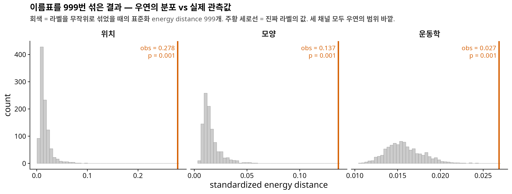
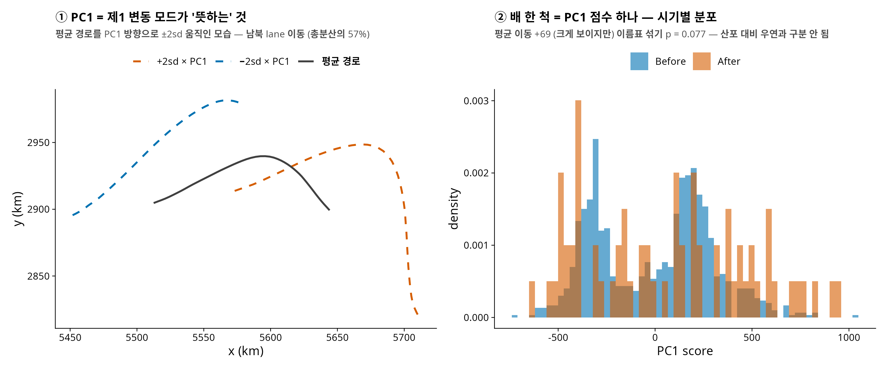
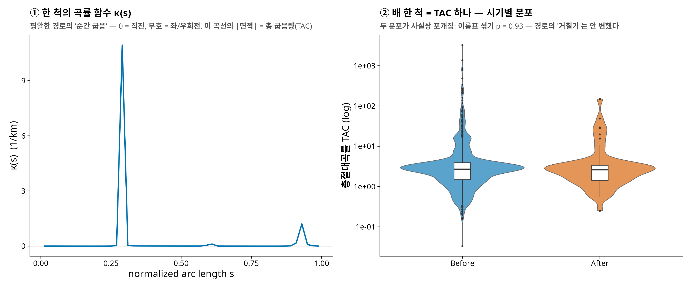
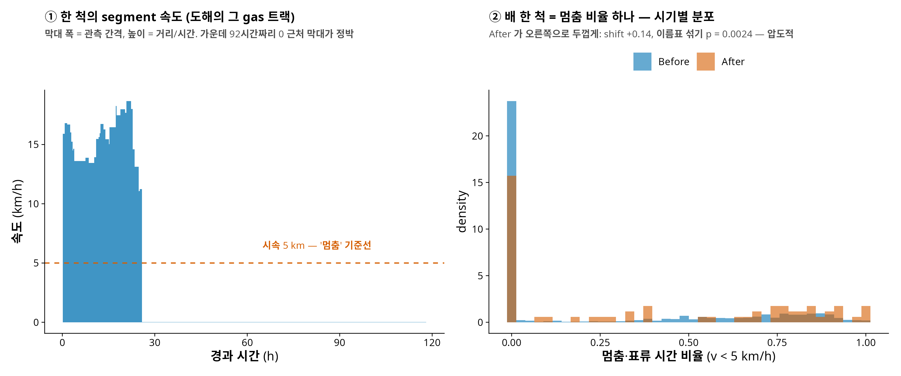
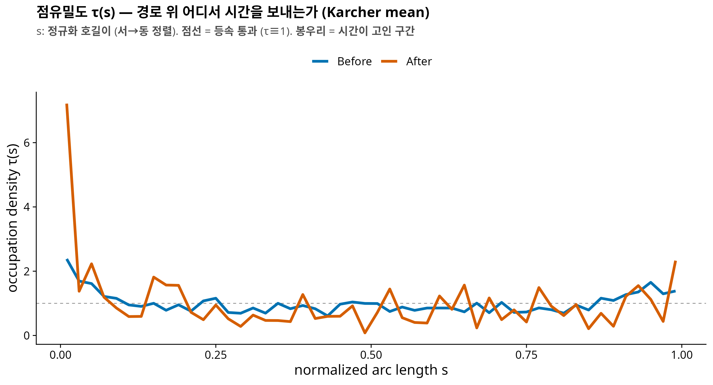

<!-- 소유권자: 인연 | 사용자: 인연 -->
<!-- 판정: (B) 대중 해설용 — Kinemetric 3-수준 분해 논문 v0.3 을 팟캐스트 대화로 풀어씀 -->

> *(스튜디오. 화면에 위성 지도 하나 — 호르무즈 해협 위로 파랗고 주황한 실타래 수천 가닥. H 가 마이크를 당긴다.)*

**H.** 오늘 이야기는 배 1,174척의 이동 경로에서 시작해요. 2026년 봄, 호르무즈 해협. 전쟁이 나고, 봉쇄가 있었고, 뉴욕타임스가 그 전후의 선박 항적 데이터를 기사에 실었죠. 전쟁 전 열흘 동안 1,089척, 이란 보복 이후 열흘 동안 85척.

**G.** 1,089에서 85로요? 12분의 1이 됐네요.

**H.** 네, 그게 첫 번째 충격이고요. 오늘의 진짜 질문은 그 다음이에요 — **살아남은 그 85척의 항해는, 전쟁 전과 무엇이 달라졌는가?** 그리고 그 "달라짐"을 어떻게 하나의 숫자로 말할 것인가.

**G.** 경로가 바뀌었다, 속도가 느려졌다, 이런 식으로 말하면 되는 거 아닌가요?

**H.** 바로 그 지점에서 퍼즐이 터집니다.

---

## 에피소드 1: 세 개의 검정이 따로 노는 미스터리

**H.** 같은 데이터에 표준적인 분석 세 가지를 돌렸어요. 결과가 이래요.

| 물었던 질문 | 통계 검정의 대답 (p-value) |
|---|---|
| 궤적 전체가 달라졌나? (좌표 함수 그대로) | $p = 0.129$ — 글쎄요? |
| 경로가 더 구불구불해졌나? (곡률) | $p = 0.349$ — 전혀 아님 |
| 속도·정박이 달라졌나? (평균속도, 멈춤 비율) | $p < 10^{-4}$ — 압도적으로 그렇다 |

**G.** 잠깐만요, 그 p-value 라는 건 대체 어떻게 뽑은 거예요? 세 검정이 다른 방법인가요?

**H.** 재료는 셋이 다 다른데, **엔진은 하나**예요 — permutation(치환) 검정. 원리가 아주 물리적이에요. 우리 데이터의 각 배에는 "전쟁 전" 또는 "위기 후"라는 이름표가 붙어 있잖아요. 만약 위기가 아무 효과도 없었다면, 이 이름표는 **아무 의미 없는 스티커**여야 해요. 그렇죠?

**G.** 스티커를 떼서 아무 배에나 다시 붙여도 똑같아야 한다…

**H.** 바로 그거예요. 그래서 실제로 그렇게 합니다. 이름표를 컴퓨터로 무작위로 섞어 붙이고 — 1,073장의 스티커를 섞되 "전쟁 전 1,006장, 위기 후 67장"이라는 장수는 유지하고 — 두 집단의 차이를 다시 계산해요. 이걸 수천 번 반복하면 **"우연만으로 생길 수 있는 차이"의 분포**가 만들어져요. 그 다음 진짜 이름표로 잰 차이를 그 분포 위에 올려놓고 물어요: 우연이 이만큼 큰 차이를 만들 확률이 얼마냐? 그게 p-value 예요.

**G.** $p < 10^{-4}$ 라는 건 만 번 섞어도 실제만 한 차이가 안 나왔다는 거고, $p = 0.129$ 는…

**H.** 섞은 것 중 열에 하나 꼴로 실제보다 큰 차이가 그냥 나왔다는 뜻이에요. "우연과 구분이 안 된다"는 거죠. 이 방식의 장점은 정직함이에요 — 데이터가 정규분포라든가 하는 가정을 전혀 안 빌려요. 특히 우리처럼 1,006 대 67로 심하게 기운 표본에서는, 분포 가정에 기대는 공식보다 이름표를 실제로 섞어보는 쪽이 훨씬 안전해요.

**G.** 좋아요, 원리는 알겠어요. 그런데 저라면 그 그림을 어떻게 그리죠? 처음부터 끝까지요.

**H.** 칠판에 적어볼게요. 정확히 여섯 단계고, 이대로 하면 누구든 같은 그림이 나옵니다. (아래는 나중에 나올 3-수준 분해의 세 채널 기준이지만, 어떤 검정 통계량이든 뼈대는 동일해요.)

**Step 0 — 입력.** 항적 $N = 1073$ 개 (전쟁 전 $n_B = 1006$, 위기 후 $n_A = 67$). 각 항적 $i$ 의 시기 이름표를 $z_i \in \{0, 1\}$ 로 적어요 ($1$ = 위기 후). 관측된 이름표 벡터가 $z^{\mathrm{obs}}$.

**Step 1 — 각 항적을 세 좌표로.** 여기가 제일 손이 많이 가는 단계니까 원자료부터 풀어서 적을게요. 항적 $i$ 의 원자료는 GPS 점열이에요:

$$\text{항적 } i \;=\; \bigl\{ (x_j, y_j, t_j) \bigr\}_{j = 1, \dots, n_i} \qquad (x, y \text{ 는 km 좌표, } t \text{ 는 초}).$$

**(1a) 시간을 버리고 "길 위의 눈금"을 만든다.** 이웃한 두 점 사이의 거리와 시간을 재요:

$$\Delta s_j = \sqrt{(x_{j+1} - x_j)^2 + (y_{j+1} - y_j)^2}, \qquad \Delta t_j = t_{j+1} - t_j, \qquad L = \textstyle\sum_j \Delta s_j .$$

거리를 앞에서부터 누적해 전체 길이로 나누면, 각 점이 "경로의 몇 % 지점"인지가 나옵니다:

$$s_1 = 0, \qquad s_{j+1} = s_j + \Delta s_j / L \;\in\; [0, 1].$$

이 $s$ 가 새 눈금이에요 — 시계가 아니라 **줄자**. (동→서로 간 배는 $s \mapsto 1 - s$ 로 뒤집어 전부 서→동으로 통일.)

**G.** 잠깐, 아래 도해의 (1a)를 보면 점 간격이 고르지 않잖아요. 그건 관측이 불규칙해서예요, 배 속도가 달라서예요?

**H.** **둘 다**예요 — 점 사이 거리는 $\Delta s = v \times \Delta t$, 두 인자가 다 흔들리거든요. 도해의 그 배로 실측해 보면: 관측 간격 $\Delta t$ 자체가 10분에서 92시간까지 제각각이에요. AIS 는 정해진 주기로 찍히는 게 아니라 수신 상황과 벤더 처리에 따라 듬성듬성 남거든요. 동시에 속도도 시속 0.02 km 에서 19 km 까지 변해요 — 서쪽 끝에 점이 뭉친 건 주로 이쪽, 배가 느려지고 멈추면서 같은 자리 근처에 점이 쌓인 거죠. 그리고 이 두 겹의 불규칙성이 바로 (1a)의 존재 이유예요: 시계 기준으로는 배끼리 비교가 안 되니 줄자로 갈아타는 것. 대신 시간 정보를 버리진 않아요 — (1c)의 $\tau$ 가 "시간이 어디에 몰렸나"를 고스란히 보관합니다.

**(1b) 위치와 모양.** 줄자 눈금 위에 등간격 격자 $s_k = (k - \tfrac12)/M$, $k = 1, \dots, M{=}50$ 을 놓고, 관측점들을 선형보간해서 격자 위 경로를 얻어요:

$$\beta_i(s_k) = \bigl( x_i(s_k), \, y_i(s_k) \bigr) \quad (\text{보간}), \qquad c_i = \tfrac{1}{M} \textstyle\sum_{k} \beta_i(s_k), \qquad \tilde\beta_i(s_k) = \beta_i(s_k) - c_i .$$

여기서 "보간"은 이렇게 합니다. 배가 격자 눈금 $s_k$ 에서 정확히 관측된 적은 없어요 — 관측점들의 눈금 $s_j$ 는 비균등하니까. 그래서 원하는 눈금 $g$ 가 이웃한 두 관측점 사이($s_j \le g \le s_{j+1}$)에 떨어지면, 두 점을 잇는 직선 위의 비례 지점을 취합니다:

$$w = \frac{g - s_j}{s_{j+1} - s_j}, \qquad \bigl( x(g), \, y(g) \bigr) = (1 - w)\,(x_j, y_j) + w\,(x_{j+1}, y_{j+1}).$$

"두 관측점 사이 60\% 지점의 눈금이면, 지도에서도 그 두 점을 잇는 선분의 60\% 지점에 찍는다" — 그게 전부예요. 아래 그림의 주황 줄자 눈금 11개도, $M = 50$ 격자 경로도 전부 이 한 줄(코드로는 `approx(s, x, xout = g)`)로 만든 겁니다.

**G.** 그러니까 $\beta$ 는… 어디서 "추정"되어 나오는 게 아니라?

**H.** 아니에요, 그게 핵심이에요. $\beta$ 는 **추정이 아니라 결정**입니다 — 모형 적합도, 스무딩도, 무작위성도 없어요. 절차를 한 번에 다시 적으면:

1. 관측점들을 시간 순서대로 **직선으로 잇는다.** 이 꺾은선이 우리가 아는 이 배의 경로 전부예요.
2. 꺾은선의 총 길이 $L$ 을 재고, 시작점에서 길이를 따라 $g \cdot L$ 만큼 **걸어간 지점**의 좌표가 $\beta_i(g)$. 걷다가 관측점 $j$ 와 $j{+}1$ 사이에서 멈추면 그 선분 위의 비례 지점 — 방금의 보간 공식이 정확히 그 좌표를 줍니다.
3. $g = \tfrac{1}{100}, \tfrac{3}{100}, \dots, \tfrac{99}{100}$ ($M = 50$ 개)에서 읽으면 끝. $\beta_i$ 는 $(x, y)$ 쌍 50개, 즉 **숫자 100개짜리 벡터**예요.

같은 입력이면 언제나 같은 출력이고, 자유롭게 고른 것은 $M$ 하나뿐입니다(그 선택이 결과를 안 흔든다는 건 본 논문의 민감도 분석에서 확인). 미니예제로 검산: 아래의 장난감 트랙 $x = (0, 3, 7, 10)$, $y = 0$ 은 $x = 10 s$ 인 직선이라, $M = 5$ 격자 $g = (0.1, 0.3, 0.5, 0.7, 0.9)$ 에서 $\beta$ 의 $x$ 좌표는 정확히 $(1, 3, 5, 7, 9)$ 가 나와야 하고 — 실제로 나옵니다.

$c_i$ 는 경로의 무게중심(위치), $\tilde\beta_i$ 는 무게중심을 원점으로 옮겨 놓은 경로(모양)입니다.

**(1c) 운동학 — 시간을 줄자 위에 쏟아붓는다.** 각 segment $j$ 는 "**어디서**(호길이 중점 $m_j = \tfrac{s_j + s_{j+1}}{2}$) **얼마나**($\Delta t_j$ 초)"의 기록이에요. 그 시간을 중점이 속한 칸에 넣습니다:

$$\mathrm{bin}(j) = \lceil m_j \cdot M \rceil, \qquad \mathrm{mass}_k = \sum_{j :\, \mathrm{bin}(j) = k} \Delta t_j, \qquad \tau_i(s_k) = \frac{\mathrm{mass}_k}{\sum_{k'} \mathrm{mass}_{k'}} .$$

말로 하면: **시간의 히스토그램을 시간축이 아니라 경로축 위에 그리는 것.** 정박한 배는 $\Delta s \approx 0$ 인데 $\Delta t$ 가 크죠 — 그 큰 시간이 통째로 한 칸에 떨어져서 봉우리가 됩니다.

지금까지의 (1a)→(1b)→(1c)를, 그리고 **왜 그렇게 하는지**를 실제 데이터의 배 두 척으로 보면 이렇습니다. 위기 이후의 gas 트랙 한 척과, 그 배와 모양이 가장 비슷한 전쟁 전 트랙 한 척을 짝지었어요:

![Step 1 해부 — 두 척으로 보는 "무엇을, 왜". (1a) 시계로 찍힌 점열(간격 불균등)을 줄자 눈금으로 바꾼다. (1b) 왜 c 를 빼는가: 원좌표의 두 배는 39 km 떨어져 있지만(왼쪽), 각자의 중심을 빼고 겹치면 거의 포개진다(오른쪽) — 원좌표 거리에 섞여 있던 "이사"와 "모양"이 분리된다. (1c) 왜 τ 인가: 길이도 관측 시간도 다른 두 배가 같은 [0,1] 자 위에 올라온다 — 위기 후 배는 첫 칸에 시간의 79%(닷새 중 나흘 정박), 전쟁 전 배는 경로 전체에 고르게. 이 비교를 1,073척으로 확장한 것이 본편의 분석이다.](attachments/260707_902d65_05.png){fig-align="center"}

**G.** 가운데 줄이 눈에 들어와요. 원좌표에선 서로 딴 동네에 있던 두 배가, 중심을 빼니까 거의 같은 모양이네요?

**H.** 그게 "빼는 이유"의 전부예요. 빼기 전의 두 경로 사이 거리에는 이사(39 km)와 모양 차이가 **섞여** 있고, 뺀 후의 거리는 순수하게 모양이에요. 이걸 분리 안 하면 "위기의 몇 %가 이사고 몇 %가 변형인가"라는 질문 자체를 던질 수 없죠.

**G.** 그리고 맨 아래 — 한 척만 보면 그냥 그 배 항해일지 요약인데, 두 척을 같은 자 위에 올리니까 비교가 되는군요.

**H.** 바로 그거예요. $\tau$ 그림 한 장의 가치는 79\% 막대 자체가 아니라, **길이 300 km 짜리 배와 250 km 짜리 배, 닷새 관측과 이틀 관측을 같은 [0,1] 축 위에 포갤 수 있게 됐다**는 데 있어요. 포갤 수 있으면 평균 낼 수 있고, 평균 낼 수 있으면 검정할 수 있죠. 이 두 척을 1,073척으로 늘린 게 에피소드 5의 τ profile 이에요. 이제 이걸 장난감 숫자로 손계산해 볼게요.

**미니 예제 (손계산용, $M = 5$).** 점 4개짜리 장난감 항적 — 중간 지점에서 10시간 정박한 배:

| $j$ | $(x_j, y_j)$ km | $t_j$ | $\Delta s_j$ | $\Delta t_j$ | 중점 $m_j$ | bin $= \lceil m_j \cdot 5 \rceil$ |
|---|---|---|---|---|---|---|
| 1 | $(0, 0)$ | 0h | 3 | 1h | $0.15$ | 1 |
| 2 | $(3, 0)$ | 1h | 4 | 10h | $0.50$ | 3 |
| 3 | $(7, 0)$ | 11h | 3 | 1h | $0.85$ | 5 |
| 4 | $(10, 0)$ | 12h | — | — | — | — |

$L = 10$ km, $s = (0, 0.3, 0.7, 1)$. 시간 질량은 칸 $(1, 3, 5)$ 에 $(1, 10, 1)$ 시간 →

$$\tau = \bigl( \tfrac{1}{12}, \; 0, \; \tfrac{10}{12}, \; 0, \; \tfrac{1}{12} \bigr) = (0.083, \; 0, \; 0.833, \; 0, \; 0.083).$$

"경로 가운데 칸에서 전체 시간의 83\%" — 정박이 봉우리가 되는 걸 손으로 확인했어요. 위치는 $c = (5, 0)$, 딱 경로 한가운데고요.

이 전부를 실행되는 R 함수 하나로 적으면:

```r
track_to_channels <- function(x, y, t, M = 50) {
  ds <- sqrt(diff(x)^2 + diff(y)^2)        # (1a) segment 길이 (km)
  dt <- diff(t)                            #      segment 시간 (초)
  s  <- c(0, cumsum(ds)) / sum(ds)         #      정규화 호길이 [0,1]
  if (tail(x, 1) < x[1]) s <- 1 - s        #      서→동 방향 통일
  g  <- (1:M - 0.5) / M                    # (1b) M점 격자
  o  <- order(s)
  beta  <- cbind(approx(s[o], x[o], xout = g)$y,
                 approx(s[o], y[o], xout = g)$y)
  c_i   <- colMeans(beta)                  #      ① 위치
  shape <- sweep(beta, 2, c_i)             #      ② 모양
  mid  <- (s[-length(s)] + s[-1]) / 2      # (1c) segment 중점
  bin  <- pmin(M, pmax(1, ceiling(mid * M)))
  mass <- tapply(dt, factor(bin, levels = 1:M), sum)
  mass[is.na(mass)] <- 0
  tau  <- as.numeric(mass / sum(mass))     #      ③ 운동학
  list(position = c_i, shape = shape, tau = tau)
}

# 미니 예제 검증 — 위 표와 동일 (실행 확인됨)
track_to_channels(x = c(0, 3, 7, 10), y = c(0, 0, 0, 0),
                  t = c(0, 1, 11, 12) * 3600, M = 5)$tau
#> [1] 0.0833  0.0000  0.8333  0.0000  0.0833   (= 1/12, 0, 10/12, 0, 1/12)
```

**Step 2 — 쌍별 거리 행렬.** 채널마다 $N \times N$ 거리 행렬을 만들어요.

$$D^{\mathrm{pos}}_{ij} = \lVert c_i - c_j \rVert, \qquad D^{\mathrm{shp}}_{ij} = \tfrac{1}{\sqrt{M}} \lVert \tilde\beta_i - \tilde\beta_j \rVert, \qquad D^{\mathrm{kin}}_{ij} = \arccos\!\textstyle\sum_k \sqrt{\tau_i(s_k)\,\tau_j(s_k)}.$$

채널마다 단위(km, km, 라디안)가 다르니 각 행렬을 자기 평균으로 나눠 무차원화합니다: $D \leftarrow D / \overline{D}$. **여기까지가 비싼 계산이고, 딱 한 번만 합니다** — 거리는 이름표와 무관하니까요.

**Step 3 — 검정 통계량.** 이름표 벡터 $z$ 가 주어지면, "두 집단이 얼마나 다른 곳에 사나"를 energy distance 로 잽니다:

$$T(z) \;=\; \underbrace{\frac{2}{n_A n_B} \sum_{z_i = 1} \sum_{z_j = 0} D_{ij}}_{\text{집단 사이 평균거리} \times 2} \;-\; \underbrace{\frac{1}{n_A^2} \sum_{z_i = z_j = 1} D_{ij}}_{\text{위기 후 집단 안}} \;-\; \underbrace{\frac{1}{n_B^2} \sum_{z_i = z_j = 0} D_{ij}}_{\text{전쟁 전 집단 안}}.$$

직관: 두 집단이 같은 분포에서 나왔다면 "사이 거리"와 "안 거리"가 비슷해서 $T \approx 0$. 다른 곳에 살수록 $T$ 가 커져요.

**Step 4 — 이름표 999번 섞기.** $b = 1, \dots, 999$ 에 대해: $z^{\mathrm{obs}}$ 를 무작위로 재배열한 $z^{(b)}$ 를 뽑고 (1의 개수 67은 유지!) $T(z^{(b)})$ 를 계산해요. $D$ 는 이미 있으니 재배정 하나당 행렬-벡터 곱 한 번이면 끝나요. 이 999개가 그림의 **회색 히스토그램** — "위기가 무효라는 세계에서 나올 수 있는 $T$ 값들"이에요.

**Step 5 — 관측값과 p-value.** 진짜 이름표의 $T(z^{\mathrm{obs}})$ 가 **주황 세로선**. p-value 는 등수 세기예요:

$$\hat{p} \;=\; \frac{1 + \#\{\, b : T(z^{(b)}) \ge T(z^{\mathrm{obs}}) \,\}}{999 + 1}.$$

우리 데이터에선 999개 전부가 관측값보다 작았으니 $\hat p = \tfrac{1 + 0}{1000} = 0.001$.

**G.** 분모가 999가 아니라 $999+1$ 이고 분자에도 $1$ 이 붙네요?

**H.** 관측 이름표 **자신도 후보 중 하나로 세는** 거예요. 이렇게 하면 귀무가설 아래에서 $T(z^{\mathrm{obs}})$ 는 999개의 $T(z^{(b)})$ 와 완전히 같은 자격의 값이라 — 이름표가 무의미하면 1000개 중 등수가 균등 — $\Pr(\hat p \le \alpha) \le \alpha$ 가 **유한한 반복 횟수에서도 정확히** 보장돼요. B 를 늘리면 p 가 더 세밀해질 뿐, 정직함은 처음부터 보장이죠.

전체를 의사코드로 적으면 이게 다예요:

```text
입력: 거리행렬 D (N×N, 채널별), 이름표 z_obs (1이 n_A개), B = 999
D ← D / mean(D)                          # 채널 표준화
T_obs ← T(z_obs)                          # Step 3 의 공식
for b in 1..B:
    z_b ← z_obs 의 무작위 재배열          # 1의 개수 유지
    T_b ← T(z_b)
p̂ ← (1 + #{b : T_b ≥ T_obs}) / (B + 1)
그림 ← T_1..T_B 히스토그램(회색) + T_obs 세로선(주황)
```

세 채널은 **같은 재배열 $z^{(b)}$ 들을 공유**해요 — 그래서 세 패널의 회색 산들이 "같은 우연"을 서로 다른 채널에서 본 것이 되고, 패널끼리 직접 비교할 수 있어요. 그 결과가 이 그림입니다.

{fig-align="center"}

**G.** 셋 다 우연 바깥이라 "확실함"은 같은데, 벗어난 거리가 다르네요. 위치는 저 멀리 있고 운동학은 턱걸이고.

**H.** 그 관찰을 기억해 두세요 — 에피소드 4의 복선이에요. "얼마나 확실한가"와 "얼마나 큰가"가 벌써 갈라지기 시작했죠.

**G.** 그럼 세 줄의 "재료"는 각각 뭐였어요? 하나씩 뜯어봐 주세요.

**H.** 좋아요, 한 줄씩 — 각각 스텝 → 그림 → 코드 → 결과 순서로요. 미리 하나만: 아래 코드는 특수 패키지 없이 그대로 돌아가는 **단순화 재현판**이에요. 원논문 스펙(B-spline 기저, GCV 평활 등)의 p 는 $0.129 / 0.349 / {<}10^{-4}$ 이고, 이 단순화판을 실제로 돌리면 $0.077 / 0.93 / 0.0002$ — 숫자는 조금 다르지만 세 결론(**애매 / 전혀 아님 / 압도적**)은 정확히 같습니다.

#### 첫째 줄 — "궤적 전체가 달라졌나?" (함수형 PCA)

1. 모든 배를 Step 1b 의 $\beta$ 로 바꾼다 → 배 한 척 = 숫자 100개 ($x$ 50 + $y$ 50). 1,073척이면 $1073 \times 100$ 행렬.
2. 이 행렬에 PCA — 1,073개의 점이 100차원 공간에 떠 있고, **가장 크게 흩어진 방향**이 PC1(제1 변동 모드). 그 방향이 무엇을 뜻하는지는 평균 경로를 그 방향으로 밀어보면 안다 (아래 그림 ①: 남북 lane 이동, 총분산의 57%).
3. 배 한 척의 **PC1 점수** = 그 배가 그 방향으로 얼마나 가 있는가, 숫자 하나.
4. 시기별 PC1 점수 평균의 차이를 통계량으로, 이름표 섞기에 올린다.

{fig-align="center"}

```r
pc  <- prcomp(Bgeo)                     # Bgeo: 1073 x 100, β 를 쌓은 행렬
sc1 <- pc$x[, 1]                        # 배별 PC1 점수
obs  <- mean(sc1[after]) - mean(sc1[!after])
null <- replicate(4999, { z <- sample(after); mean(sc1[z]) - mean(sc1[!z]) })
(1 + sum(abs(null) >= abs(obs))) / 5000   #> 0.077 — 애매
```

**G.** 잠깐만요. PCA 를 두 시기 **합쳐서 한 번** 걸었네요? 두 시기 각각에 FPCA 를 걸어야 하는 거 아니에요?

**H.** 좋은 의심인데, 비교가 목적이면 **합쳐서 한 번이 맞아요.** 이유가 세 겹이에요.

첫째, **비교에는 공통 자(尺)가 필요해요.** 시기별로 각각 걸면 Before 의 PC1 과 After 의 PC1 은 서로 다른 방향 — 100개 숫자의 서로 다른 선형결합 — 이에요. 그러면 "Before 점수 평균 vs After 점수 평균"은 서로 다른 질문에 대한 답 두 개를 빼는 셈이라 의미가 없어요. 키는 cm 자로 재고 몸무게는 kg 저울로 잰 다음 둘을 빼는 격이죠.

둘째, **이름표 섞기와의 정합.** 합친 PCA 는 이름표를 전혀 안 보고(비지도) 축을 만들어요. 그래서 이름표를 999번 섞는 동안 축은 그대로고, 검정의 정직함(에피소드 1의 randomization 보장)이 유지돼요. 시기별 축을 쓰면 검정 통계량 자체가 이름표의 함수가 되어서, 섞을 때마다 PCA 두 번을 다시 걸지 않는 한 검정이 망가집니다.

셋째, **"각각 걸기"가 맞는 질문은 따로 있어요.** "두 시기의 **변동 구조 자체**(모드의 방향, 분산의 스펙트럼)가 달라졌나?"를 묻는다면 시기별 FPCA 를 걸어 공분산을 비교하는 게 맞아요 — 그건 "분포가 이동했나"(우리 질문)와는 다른 질문이에요.

**G.** 그래도 합친 축은 1,006척인 Before 가 지배할 텐데, 그게 결과를 왜곡하진 않아요?

**H.** 그것도 실제로 확인해 봤어요. 세 가지 방식으로 축을 만들어 비교하면:

| 축을 만든 방법 | 평균 이동 | p | 합친 축과의 방향 일치 $\lvert\cos\rvert$ |
|---|---|---|---|
| 두 시기 합침 (본문) | $+69.4$ | $0.077$ | — |
| Before 만으로 축 → 전체 사영 | $+67.4$ | $0.079$ | $0.999$ |
| After 67척만으로 축 | — | — | $0.978$ |

세 축이 사실상 같은 방향($\lvert\cos\rvert \ge 0.97$)이고, Before-축으로 갈아타도 결과는 그대로예요. 게다가 After 쪽만으로 축을 만들면 67척으로 100차원 방향을 추정하는 셈이라 오히려 불안정하고요. 원칙(공통 자 + 이름표 불변)과 실증(어느 축이든 동일)이 같은 답을 줍니다.

#### 둘째 줄 — "경로가 더 구불구불해졌나?" (곡률)

1. $\beta$ 를 그대로 두 번 미분하면 관측 잡음이 폭발해요 (미분은 잡음 증폭기). 그래서 먼저 **평활**: 격자 경로에 부드러운 스플라인을 통과시킨다.
2. 평활 곡선의 1·2차 도함수로 **곡률** $\kappa(s) = \dfrac{x'y'' - y'x''}{(x'^2 + y'^2)^{3/2}}$ — 지점별 "순간 굽음"(0 = 직진, 부호 = 좌/우회전).
3. 배 한 척당 $|\kappa(s)|$ 를 경로 전체로 합쳐 **총 굽음량(TAC)** 하나로.
4. TAC(로그)의 시기 평균 차 → 이름표 섞기.

{fig-align="center"}

```r
sx <- smooth.spline(g, bx, df = 8); sy <- smooth.spline(g, by, df = 8)
d1x <- predict(sx, g, deriv=1)$y; d2x <- predict(sx, g, deriv=2)$y
d1y <- predict(sy, g, deriv=1)$y; d2y <- predict(sy, g, deriv=2)$y
kap <- (d1x*d2y - d1y*d2x) / (d1x^2 + d1y^2)^1.5
TAC <- mean(abs(kap)) * L               # 한 척의 총 굽음량
# → TAC 를 전 척에 계산, log(TAC) 평균차를 이름표 섞기:  p = 0.93 — 전혀 아님
```

#### 셋째 줄 — "속도·정박이 달라졌나?" (운동학 scalar)

1. 연속된 두 관측점에서 **segment 속도** $v_j = \Delta s_j / \Delta t_j$.
2. 시속 60 km 초과 segment 는 위치 잡음으로 버린다.
3. 배 한 척당 두 숫자: **시간가중 평균속도** $\bar v = \sum v_j \Delta t_j / \sum \Delta t_j$ 와 **멈춤 비율** = ($v < 5$ km/h 인 시간)/(전체 시간).
4. 각각 시기 평균 차 → 이름표 섞기.

{fig-align="center"}

```r
v    <- ds / (dt/3600); keep <- v < 60          # segment 속도, 잡음 컷
vbar <- sum(v[keep]*dt[keep]) / sum(dt[keep])   # 시간가중 평균속도
stpf <- sum(dt[v < 5]) / sum(dt)                # 멈춤·표류 시간 비율
# → 두 지표의 시기 평균차를 이름표 섞기:  p = 0.0002 / 0.0024 — 압도적
```

**H.** 정리하면 — 세 검정 모두 재료를 "배 한 척 = 숫자 하나"로 줄인 뒤 같은 이름표 섞기에 올린 거예요. 그런데 첫째 줄은 100개 숫자를 PC1 하나로 줄이며 위치·모양·운동학이 뒤섞였고, 둘째 줄은 모양의 아주 좁은 단면(거칠기)만 봤고, 셋째 줄은 운동학만 정확히 겨눴죠. 이 비대칭이 다음 퍼즐로 이어집니다.

::: {.callout-note collapse="true" title="상세 스펙 (재현용) — 세 검정의 정확한 설정"}
공통: 시기 라벨 permutation, 양측, "전쟁 전/위기 후" 표본 크기 고정 재배정. 좌표는 경도·위도 → 중심위도 보정 equirectangular 로 km 변환.

1. **원좌표 MFPCA** — 궤적별 호길이(arc-length) 재매개화 → 공통 격자 보간 → B-spline 기저 전개 → 다변량 FPCA (Ramsay–Silverman; Happ–Greven). 상위 2개 성분이 총분산 72.6% (상위 3개 81.1%). 통계량 = 제1주성분 점수의 시기 간 평균 차 ($\Delta\xi_1 = -87.85$). Permutation $B = 5000$ → $p = 0.129$.
2. **곡률 (TAC)** — order-6 B-spline 평활 (기저 20개, 4계 도함수 벌점, GCV 로 $\lambda$ 선택), 점 6개 이상·경로 1 km 이상 트랙만. 곡률 $\kappa(s) = (x'y'' - y'x'')/(x'^2+y'^2)^{3/2}$ → 트랙별 총절대곡률(TAC)·최댓값·95백분위. 통계량 = TAC 시기 평균 차. Permutation → $p = 0.349$ (선종별 층화도 전부 null).
3. **속도·정박 scalar** — segment 속도 = 거리/시간 (암시 속도 60 km/h 초과 segment 는 위치 잡음으로 폐기). 트랙별 시간가중 평균속도 (위기 후 $-5.32$ km/h) 와 멈춤·표류 시간비율 (속도 $<5$ km/h 기준, $+0.155$). 각각 permutation → 둘 다 $p < 10^{-4}$. 층화: cargo $p<10^{-4}$, gas $p=0.0015$, tanker $p=0.95$.

전체 명세는 본 논문 부록 A 참조.
:::

**G.** 알겠어요. 그런데 그러니까 더 이상한데요. 속도가 그렇게 확실하게 바뀌었으면, 궤적 전체를 보는 첫 번째 검정도 잡아냈어야 하는 거 아니에요?

**H.** 그렇죠! 그게 이 논문의 출발점이에요. 문제는 통계가 아니라 **표현**에 있었어요. 궤적을 $(x(t), y(t))$ — "시각 $t$ 에 어디 있었다" — 로 적으면, 서로 다른 세 가지 정보가 한 그릇에 섞여요. **어디로** 갔는지, **어떤 모양의 길**이었는지, 그 길을 **어떻게** 지나갔는지.

**G.** 섞이면 왜 문제죠?

**H.** 강한 신호가 조용한 신호에 희석돼요. 라디오 세 채널을 한 스피커로 동시에 틀면, 제일 큰 방송도 웅웅거리는 소음이 되잖아요. $p = 0.129$ 라는 애매한 숫자가 바로 그 웅웅거림이에요.

---

## 에피소드 2: 출근길의 세 가지 변화

**H.** 그래서 궤적을 딱 세 조각으로, 겹치지도 빠지지도 않게 분해합니다. 출근길로 비유해 볼게요. 어느 날 당신의 출근이 평소와 달라졌다면, 논리적으로 세 가지 경우예요.

**G.** 음… 첫째, 아예 **다른 동네 길**로 갔다.

**H.** 그게 **위치(position)** — 수학적으로는 경로의 중심점 $c$. 둘째?

**G.** 같은 동네인데 **길의 생김새**가 달랐다. 직진하던 걸 빙 둘러 갔다든가.

**H.** **모양(shape)** — 중심을 빼고 남은 경로의 형태 $\tilde\beta(s)$. 셋째가 제일 재밌어요.

**G.** 완전히 같은 길인데… **막혀서 서 있었다**?

**H.** 정확해요. **운동학(kinematics)** — 같은 길 위에서 시간을 어떻게 썼는가. 이 세 번째를 재는 도구가 이 논문의 심장인데, 이름이 **점유밀도** $\tau(s)$ 예요. 길을 100 구간으로 나누고, 각 구간에서 보낸 시간의 비율을 재는 거죠. 막힘 없이 일정한 속도로 지나가면 $\tau$ 는 어디서나 1로 평평해요. 어딘가에서 멈춰 서 있으면? 그 지점에 뾰족한 봉우리가 솟아요.

**G.** 택배 트럭 GPS 로 "어디서 오래 서 있었나" 지도 그리는 느낌이네요.

**H.** 딱 그거예요. 그리고 수학적으로 예쁜 게 두 가지 있어요. 하나 — 위치와 모양은 **피타고라스 정리처럼 정확히 직교**해요. 겹침이 0이라는 걸 증명할 수 있어요. 둘 — $\tau$ 는 확률밀도라서 $\sqrt{\tau}$ 를 취하면 **구면 위의 점**이 되고, 구면 기하학의 도구(평균, 거리, PCA)가 전부 공짜로 따라와요.

**G.** "증명할 수 있다"고 하셨는데 — 진짜 증명이 논문에 있어요? 어렵나요?

**H.** 본 논문의 **명제 1**이고, 증명이 세 줄이에요. 그대로 옮겨볼게요.

> **명제 (직교 분할).** 두 배의 격자 경로를 $\beta_1 = c_1 + \tilde\beta_1$, $\beta_2 = c_2 + \tilde\beta_2$ 로 분해하면, 경로 간 거리의 제곱은 정확히 두 조각의 합이다:
> $$\underbrace{\tfrac{1}{M}\textstyle\sum_k \lVert \beta_1(s_k) - \beta_2(s_k) \rVert^2}_{\text{경로 간 거리}^2} \;=\; \underbrace{\lVert c_1 - c_2 \rVert^2}_{\text{위치 차}^2} \;+\; \underbrace{\tfrac{1}{M}\textstyle\sum_k \lVert \tilde\beta_1(s_k) - \tilde\beta_2(s_k) \rVert^2}_{\text{모양 차}^2}.$$
>
> **증명.** 좌변에 $\beta_1 - \beta_2 = (c_1 - c_2) + (\tilde\beta_1 - \tilde\beta_2)$ 를 넣고 제곱을 전개하면
> $$\lVert c_1 - c_2 \rVert^2 \;+\; 2\,\Bigl\langle c_1 - c_2, \; \tfrac{1}{M}\textstyle\sum_k \bigl( \tilde\beta_1(s_k) - \tilde\beta_2(s_k) \bigr) \Bigr\rangle \;+\; \tfrac{1}{M}\textstyle\sum_k \lVert \tilde\beta_1(s_k) - \tilde\beta_2(s_k) \rVert^2 .$$
> 가운데 교차항의 $\sum_k \tilde\beta_i(s_k)$ 는 **정의상 0** 이다 — $\tilde\beta$ 는 평균(무게중심)을 빼서 만든 것이므로 평균이 0. 상수 벡터와 평균 0 벡터의 내적이 사라지니 교차항이 통째로 죽고, 남는 것이 우변. $\blacksquare$

**G.** 아, $(a+b)^2 = a^2 + b^2$ 이 되려면 $2ab$ 가 죽어야 하는데, 중심을 뺐다는 사실 자체가 $2ab$ 를 죽이는군요.

**H.** 그게 전부예요. 그래서 "겹침이 0"이라는 말이 은유가 아니라 등식이에요 — 위치로 잰 차이와 모양으로 잰 차이는 서로의 몫을 침범할 수 없어요. 아까 두 척 도해에서 39 km(위치)와 "포개진 뒤의 잔차"(모양)가 정확히 이 두 항입니다.

**G.** 잠깐, 배가 완전히 멈추면요? 속도가 0이면 "시간 나누기 거리" 같은 계산이 터질 텐데.

**H.** 좋은 지적이고, 실제로 초기 버전의 이론이 거기서 구멍이 났었어요. 그래서 밀도가 아니라 **측도**로 정의를 올렸어요 — 멈춤은 수학적으로 한 점에 질량이 뭉친 "atom"이 되고, 이론이 자연스럽게 품어요. 정박이 이 연구의 주인공인데, 주인공이 서는 자리에서 무대가 무너지면 안 되잖아요.

---

## 에피소드 3: 저울을 믿을 수 있나 — 거짓말 탐지기 테스트

**G.** 세 조각으로 나눴다 치고, 이제 "위기 효과의 몇 %가 어느 조각인가"를 재는 거죠? 그 저울은 믿을 만해요?

**H.** 그걸 확인하려고 **답을 미리 아는 가짜 데이터**를 만들었어요. 컴퓨터로 합성 항적을 수백 번 생성하는데, 어떤 실험에서는 위치만 옮기고, 어떤 실험에서는 모양만 바꾸고, 어떤 실험에서는 진입로에서 기다리게만 해요. 그리고 저울이 뭐라고 하는지 봐요.

| 진실 (내가 만든 조작) | 저울의 판정 |
|---|---|
| 위치만 옮김 | 위치 **99%**, 나머지 "변화 없음" |
| 모양만 바꿈 | 모양 **98%**, 나머지 "변화 없음" |
| 기다리게만 함 | 운동학이 100번 중 100번 검출 |
| **아무것도 안 바꿈** | 셋 다 "변화 없음" (오탐율 4~5%, 정확히 설계값) |

**G.** 아무것도 안 바꿨을 때 오탐율이 5%라는 건…

**H.** "유의수준 5%" 검정이 정말 5%로 작동한다는 뜻이에요. 광고와 실제가 일치하는 저울. 그리고 하나 더 — 실제 데이터는 1,006척 대 67척으로 심하게 기울어져 있잖아요? 그 **15:1 불균형을 그대로 재현한 실험**에서도 검출력 100%였어요. 이제 진짜 데이터에 올려놔도 됩니다.

---

## 에피소드 4: 판결 — 63 / 31 / 6

{fig-align="center"}

**H.** 호르무즈 실데이터의 판결입니다. 위기가 관측된 항적에 남긴 변화 중 —

- **위치 63%** — 배들이 다른 lane 으로 갔다. 물리량으로는 경로 중심이 평균 **북쪽으로 18.6 km, 동쪽으로 12.7 km** 이동. 오만 쪽 깊은 물길에서 이란 쪽 얕은 물길로 옮겨간 거예요. NYT 기사의 헤드라인이 숫자 하나로 정량화된 셈이죠.
- **모양 31%** — 위치를 빼고도 경로의 형태 자체가 달라졌다.
- **운동학 6%** — 그리고 시간을 쓰는 방식이 달라졌다. 작지만, 셋 중 어느 것도 우연이 아니에요(전부 $p \le 0.003$).

**G.** 어라, 그런데 에피소드 1에서는 속도 쪽 검정이 제일 확실했잖아요($p < 10^{-4}$). 막상 크기를 재보니 6%로 제일 작다고요?

**H.** 그게 오늘의 펀치라인이에요. **"가장 확실한 신호"와 "가장 큰 신호"는 다른 말입니다.** p-value 는 "이게 우연일 리 없다"는 확신의 정도지, 효과의 크기가 아니에요. 아주 또렷하게 들리는 소리가 꼭 제일 큰 소리는 아닌 거죠. 세 채널을 같은 잣대(각자의 평소 변동 대비)로 재고 나서야 "얼마나"를 말할 수 있게 된 겁니다.

---

## 에피소드 5: 시간이 고인 곳

{fig-align="center"}

**H.** 6%짜리 운동학 채널을 열어보면 이야기가 선명해요. 전쟁 전(파랑)의 $\tau$ 는 거의 평평 — 배들이 막힘 없이 흘렀다는 뜻. 위기 이후(주황)는 경로의 서쪽 끝, 그러니까 **페르시아만 쪽 입구에 등속 대비 7배의 시간**이 고여 있어요.

**G.** 반론 하나요. 이 데이터는 관측된 구간만 있는 거잖아요. "경로의 시작점에 시간이 몰렸다"는 게 그냥 데이터가 거기서부터 기록되기 시작해서 생긴 착시일 수도 있지 않나요?

**H.** 저자가 자기 결과에 던져야 할 바로 그 질문이고, 지리로 답할 수 있어요. 위기 이후 항적들의 서쪽 끝점이 데이터 커버리지 경계에서 **중앙값 16.4 km 안쪽**에 있어요. 전쟁 전엔 3.6 km — 즉 예전엔 경계에서 관측이 시작됐는데, 위기 후엔 **내부의 정박지에서** 시작돼요. 기록이 끊긴 자리가 아니라 배가 실제로 떠 있던 자리라는 거죠. "만 안에 900척이 발이 묶였다"던 당시 보도와도 맞아떨어지고요.

{fig-align="center"}

**H.** 선종별로 갈라 보면 또 재밌어요. 유조선(tanker)은 거의 순수하게 "다른 길"만 택했어요 — 위치 71%, 기다림 신호는 없음. 그런데 **LNG 운반선(gas)은 운동학이 20%** — 다른 배들의 세 배예요. LNG 는 단순히 이사한 게 아니라, **기다리는 항해**가 된 겁니다.

**G.** 카타르 LNG… 안 갈 수는 없고, 그렇다고 예전처럼 갈 수도 없고.

**H.** 데이터가 그 딜레마를 그대로 보여주는 거죠.

---

## 에피소드 6: 이 저울이 말하지 않는 것

**G.** 마지막으로, 이 분석이 말할 수 **없는** 건 뭐예요?

**H.** 세 가지만 짚을게요. 첫째, 여기 나온 속도는 AIS 장비가 보고한 속도가 아니라 좌표와 시각으로 **계산한 근사치**예요. 둘째, 67척은 작은 표본이라 숫자들엔 신뢰구간이 붙어요 — 63%는 [50, 72] 사이 어딘가. 셋째, 제일 중요한 것 — 이 모든 건 **보이는 배들** 이야기예요. AIS 를 끄고 어둠 속으로 들어간 배, 신호를 속인 배는 표본 밖이고, 그들이 무작위로 빠졌을 리 없죠. "보이는 것의 분해"가 끝났으니, 다음 논문의 질문은 "안 보이는 것"입니다.

**G.** 오늘 한 줄 요약하면요?

**H.** 궤적은 세 가지 질문 — 어디로, 어떤 모양으로, 어떻게 — 에 동시에 답하는 물체고, 그걸 한 덩어리로 재면 아무 질문에도 제대로 답 못 해요. 쪼개서 재면: 호르무즈 위기는 **63% 이사였고, 31% 변형이었고, 6% 기다림이었다.** 그리고 그 6%가 제일 또렷한 목소리로 말하고 있었죠.

> *(화면의 실타래 지도가 천천히 어두워진다. 주황 점들만 남는다.)*

---

**본 논문**: 『Where Does the Signal Live? — A Three-Level Decomposition of Vessel Trajectory Ensembles in the Strait of Hormuz』 v0.3 (영문/한국어판, `COMPANY/` 등록) · **선행 글**: [위기 효과 3-수준 분해 (기술편)](260703_d61fb6.html) · **코드**: `260703_인연_NYT호르무즈Kinemetric프로토_R.R`, `260704`·`260707` 검증 스크립트
