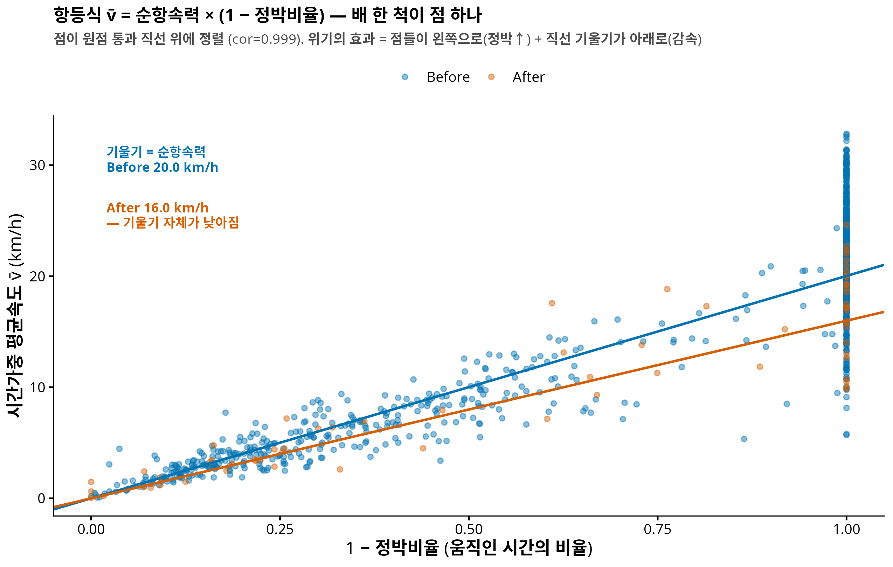
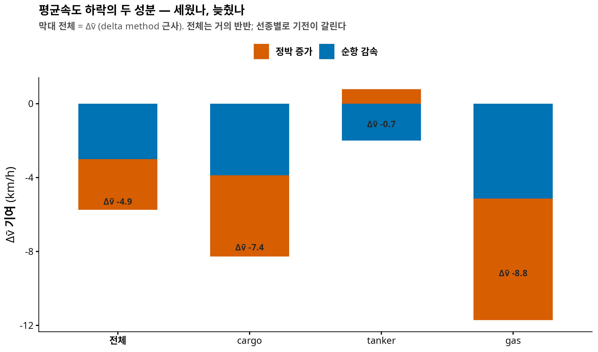

<!-- 소유권자: 인연 | 사용자: 인연 -->
<!-- 판정: (A) 연구 노트 — 속도·정박 이론 (2-상태 재생 모형) P3 항등식과 Δv̄ 분해 -->

## 0. 한 줄 요약

위기 이후 평균속도가 5 km/h 떨어졌다는 사실은 알고 있었다. 이번에 밝힌 것은 그 하락의 **성분**이다. 항등식 $\bar v = \mu_c (1 - S)$ — 평균속도 = 순항속력 × 움직인 시간 비율 — 로 분해하면, 하락의 **48%는 정박 증가, 52%는 순항 중 감속**. 위기는 배를 세워놓기만 한 게 아니라 **움직일 때도 20% 느리게** 만들었다. 그리고 선종별로 기전이 완전히 갈린다 — tanker 는 총량으로는 아무 변화가 없어 보였지만(Δv̄ = −0.7, 비유의), 분해하니 **정박 감소와 순항 감속이 상쇄되어 숨어 있던** 것이었다.

> **선행**: [3-수준 분해 팟캐스트](260707_902d65.html) — 운동학 채널의 τ 가 이 글의 무대다.

## 1. 질문 — "−5 km/h"는 무엇이었나

이전 분석은 두 숫자를 따로 보고했다: 평균속도 −5 km/h ($p<10^{-4}$), 정박 시간비율 +0.14 ($p=0.003$). 그런데 이 둘은 논리적으로 얽혀 있다 — 배가 서 있으면 평균속도는 당연히 떨어진다. 그래서 진짜 질문은:

> 평균속도 하락은 **전부 정박 탓**인가, 아니면 배가 **움직일 때도** 느려졌는가?

## 2. 항등식 — 유도는 세 줄

시간가중 평균속도의 정의에서 시작한다. 항해 시간을 정박($v < 5$ km/h)과 순항으로 나누면:

$$\bar v \;=\; \frac{\int v\, dt}{T} \;=\; \frac{\int_{\text{순항}} v\, dt}{T} \;=\; \underbrace{\frac{\int_{\text{순항}} v\, dt}{T_{\text{순항}}}}_{\mu_c \;(\text{순항속력})} \times \underbrace{\frac{T_{\text{순항}}}{T}}_{1 - S}$$

(첫 등호에서 정박 구간의 $v \approx 0$ 기여를 무시 — 정확히는 임계 이하 잔여항.) 즉 **평균속도 = 순항속력 × 움직인 시간 비율**. 배 한 척마다 $(\bar v_i, S_i, \mu_{c,i})$ 를 계산해 검증하면:

{fig-align="center"}

상관 0.999 — 항등식이 데이터에서 그대로 성립한다. 그러면 시기 간 변화도 정확히 두 성분으로 갈라진다 (delta method):

$$\Delta \bar v \;\approx\; \underbrace{-\,\mu_c \cdot \Delta S}_{\text{정박 증가 기여}} \;+\; \underbrace{(1 - \bar S) \cdot \Delta \mu_c}_{\text{순항 감속 기여}}$$

## 3. 결과 — 반반, 그리고 예측의 반증

솔직한 기록: 분석 전 예측은 "위기는 배를 세워놓았을 뿐, 움직이는 배는 평소 속력일 것($\Delta\mu_c \approx 0$)"이었다. **반증됐다.**

| 양 | Before | After | Δ | perm p |
|---|---|---|---|---|
| 평균속도 $\bar v$ | 15.6 | 10.6 | −4.95 | 0.0002 |
| 정박비율 $S$ | 0.26 | 0.40 | +0.137 | 0.0026 |
| **순항속력 $\mu_c$** | **20.0** | **16.0** | **−4.03** | **0.0002** |

$$\Delta\bar v = -4.95 \;=\; \underbrace{-2.75\ (48\%)}_{\text{정박}} + \underbrace{-2.99\ (52\%)}_{\text{감속}}$$

순항 감속이 관측창 혼합의 아티팩트일 가능성(긴 관측 간격이 정박과 순항을 평균내 버리는 문제)은 통제로 배제했다: 정박 임계 3/5/8 km/h, 관측창 ≤2h/≤1h 제한 — 전 설정에서 $\Delta\mu_c = -3.5 \sim -4.5$, 전부 $p=0.0002$. **움직이는 배가 실제로 20% 느려졌다.** 기전은 아직 추측 단계다(전투해역 경계 항행, 이란 측 얕은 수로의 속도 제약, war-risk 보험 조건 등) — 데이터가 말해준 것은 "느려졌다"까지다.

## 4. 선종별 — 분해가 숨은 효과를 드러내다

{fig-align="center"}

| 선종 | Δv̄ | 정박 기여 | 감속 기여 | 읽기 |
|---|---|---|---|---|
| cargo | −7.4 | −4.4 | −3.9 (p=0.0002) | 둘 다, 정박 우세 |
| **tanker** | **−0.7 (비유의)** | **+0.8** (ΔS<0, 비유의) | **−2.0 (p=0.003)** | **상쇄 — 총량에 숨음** |
| gas | −8.8 | −6.6 | −5.1 (p=0.0002) | 최대 타격 |

tanker 가 이 글의 백미다. 이전 분석에서 tanker 는 "아무것도 안 변한 배"였다 — 평균속도도 정박도 비유의. 그런데 분해하니: tanker 는 **정박을 오히려 줄이면서**(멈추지 않고 통과) **순항 속력은 유의하게 낮췄다**(−2.8 km/h, p=0.003). 두 효과가 반대 방향이라 총량 $\bar v$ 에서 상쇄돼 보이지 않았던 것. **합계가 0이라고 아무 일도 없었던 게 아니다** — 항등식 분해가 이걸 드러낸다.

gas 는 여기서도 최대 타격(−8.8 km/h)이고 정박 우세 — [3-수준 분해](260707_902d65.html)에서 gas 만 운동학 비중 20%였던 것과 교차 정합한다.

## 5. 이론 배경 — 이 통계량들의 분포

::: {.callout-note collapse="true" title="2-상태 재생 모형 — stop_frac 과 v̄ 의 분포 이론 (요약)"}
항해를 {순항, 정박} 의 교대 재생 과정으로 두면 (순항 지속 $C \sim F_c$ 평균 $m_c$, 정박 지속 $\Sigma \sim F_s$ 평균 $m_s$):

- **P1 (하향편향)**: 관측 segment 속도 = 변위/시간 ≤ 창 내 평균 속력 (직선 항해 시 등호).
- **P2 (LLN·CLT)**: 정박 점유율 $S_T \to \pi_s = \frac{m_s}{m_c + m_s}$, $\sqrt{T}(S_T - \pi_s) \Rightarrow N(0, \sigma^2)$, $\sigma^2 = \frac{m_s^2 \mathrm{Var}(C) + m_c^2 \mathrm{Var}(\Sigma)}{(m_c + m_s)^3}$ (renewal–reward). $\bar v_T \to (1-\pi_s)\mu_c$ 도 동일.
- **P3**: 본문의 항등식 — 모형에서는 정확히, 데이터에서는 cor 0.999 로.
- **P4 (혼합 분포)**: 관측창 미세 극한에서 segment 속도 $v \sim (1-\pi_s) G + \pi_s \delta_0$ — zero-inflated 이봉. 유한 창에서는 $v_j = (1-f_j)\mu_c$ ($f_j$=창 내 정박비율)라서 임계 $c$ 분류는 "$f_j > 1 - c/\mu_c$ 인 창"을 세는 것 — $c=5$, $\mu_c \approx 20$ 이면 창의 75% 이상이 정박이어야 잡힘 → **stop_frac 은 보수적(하향) 추정**.

주의 하나: track 평균 정박비율(0.26/0.40)과 시간가중 pooled 정박질량(0.62/0.65)은 다르다 — 오래 관측된 배가 후자를 지배한다. 가중 기준 명시는 의무.
:::

## 6. 한계와 다음

(1) 분해는 delta method 1차 근사 — 상호작용항 무시 (합이 Δv̄ 와 약간 어긋나는 이유). (2) $\mu_c$ 는 임계 기반 조건부 평균 — 2-상태 모형의 정식 적합(지속시간 분포까지)이 다음 단계. (3) 감속의 기전 규명: 공간 층화(어느 구간에서 느려졌나 — $v(s)$ profile)와 선박 크기·기국 메타 결합. (4) 여전히 관측된 배들의 이야기.

---

**코드**: `260708_인연_속도정박분해_R.R` · **이론 노트**: `COMPANY/인연-속도정박이론가설노트-★★★.md` · **수치**: `results/numeric/…/decomp_by_group.csv`
