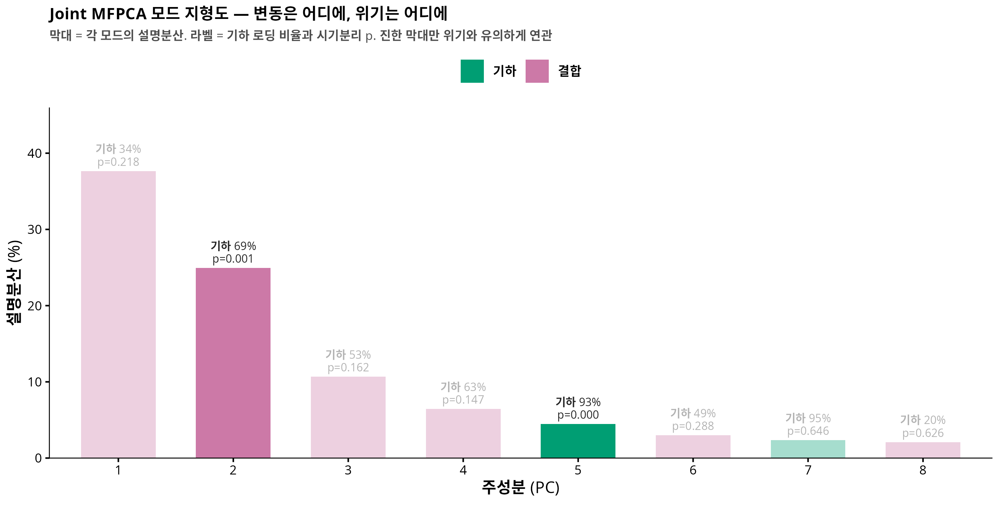
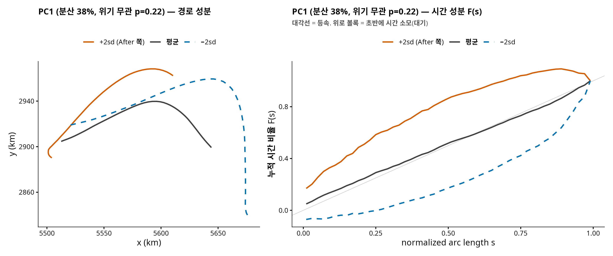
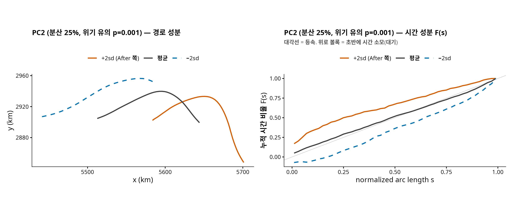
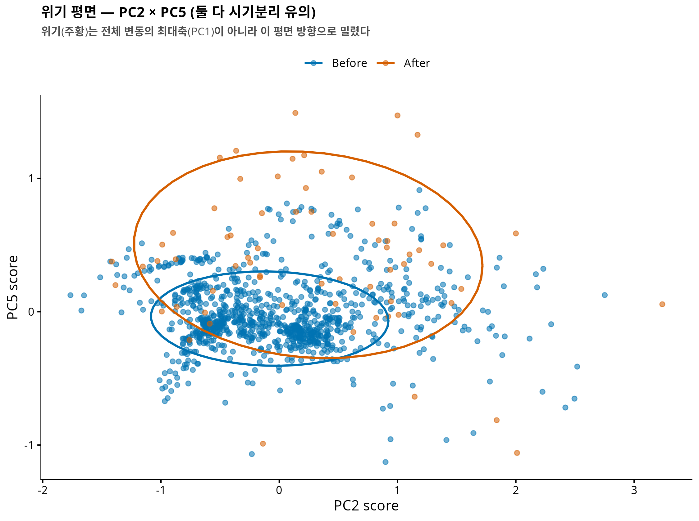

<!-- 소유권자: 인연 | 사용자: 인연 -->
<!-- 판정: (A) 연구 노트 — 표현 R6 (joint kinemetric MFPCA) 정식 분석 -->

## 0. 한 줄 요약

궤적의 기하(어디로)와 시간(어떻게)을 **한 객체로 묶어** PCA 를 걸면, 두 채널을 따로 보던 [3-수준 분해](260707_902d65.html)가 원리상 못 보는 것 — **채널 간 결합(coupling) 모드** — 이 보인다. 결과: 평시 변동의 대부분은 기하·시간이 얽힌 결합 모드이며, 그런데 **위기는 그 얽힘의 최대축(PC1, 분산 38%)이 아니라 특정 방향(PC2, p=0.001)만 밀었다.** PC2 의 정체는 "동쪽으로 치우친 경로 + 여정 초반에 시간을 쓰는" 결합 — 3-수준 분해의 두 결론(경로 이동, 진입부 대기)이 **같은 배들에서 함께 일어난다**는 상관 정보가 추가된다.

> **선행**: [3-수준 분해 팟캐스트](260707_902d65.html) · [기술편](260703_d61fb6.html) · 본 논문 v0.3 (`COMPANY/` 등록)

## 1. 질문 — "몫"은 알았다, "얽힘"은?

3-수준 분해는 위기 효과를 위치 63 / 모양 31 / 운동학 6% 로 **채널별로 따로** 귀속시켰다. 이는 의도된 설계다 — 채널이 직교하니 겹침 없이 몫을 나눌 수 있다. 그러나 marginal 분석이 대답할 수 없는 질문이 하나 남는다:

> 채널들은 **함께** 움직이는가? 예컨대 북쪽 lane 으로 옮긴 배가 **동시에** 더 기다리는가, 아니면 옮긴 배 따로 기다린 배 따로인가?

이건 "영상 자료" 의 질문이다 — 배 한 척의 완전한 기록은 위치의 나열이 아니라 $(x(t), y(t))$ 라는 **움직이는 점의 동영상**이니까.

## 2. 표현 — 시간을 좌표로 뒤집기

동영상을 그대로 $(x(t), y(t))$ 로 PCA 하면 시간워핑(phase)과 기하(amplitude)가 뒤섞인다 — [팟캐스트 에피소드 1](260707_902d65.html)에서 진단한 표현 문제 그대로다. 해법은 매개변수를 뒤집는 것:

$$\text{배 } i = \bigl( x_i(s), \; y_i(s), \; F_i(s) \bigr), \qquad F_i(s) = \text{“경로의 } s \text{ 지점까지 쓴 시간의 비율”}$$

$F$ 는 점유밀도 $\tau$ 의 누적(CDF)이라 운동학 채널과 같은 정보인데, 이제 **셋 다 같은 도메인 $[0,1]$ 위의 함수**다. $F$ 읽는 법: 대각선이면 등속, 대각선 위로 볼록하면 여정 초반에 시간을 쓴 배(진입부 대기), 아래로 볼록하면 후반에 쓴 배.

여기에 3변량 joint MFPCA — 기하와 시간의 총분산을 1:1 로 맞춘 뒤 한 번의 PCA:

```r
F  <- t(apply(Tau, 1, cumsum))                 # τ 의 누적 = 시간 좌표
w_geo <- 1/sqrt(sum(apply(cbind(Bx,By),2,var)))  # 채널 분산 1:1 표준화
w_F   <- 1/sqrt(sum(apply(F,2,var)))
Z  <- cbind(cbind(Bx,By)*w_geo, F*w_F)          # 1073 x 150
pc <- prcomp(Z)                                  # joint MFPCA
# 각 PC 의 "정체": 기하 로딩 비율 = sum(rotation[1:100,j]^2)
```

각 PC 의 로딩이 기하 좌표(100개)와 시간 좌표(50개)에 어떻게 배분되는지로 모드를 분류한다: 기하 모드(기하 >80%), 시간 모드(>80%), 나머지는 **결합 모드**.

## 3. 모드 지형도 — 변동은 어디에, 위기는 어디에

{fig-align="center"}

두 가지가 보인다.

1. **평시의 배들은 기하와 시간이 얽힌 채로 다양하다.** 상위 8개 중 6개가 결합 모드 — "어디로 가는 배인가"와 "어디서 시간을 쓰는 배인가"는 독립이 아니라 상관 구조를 이룬다.
2. **위기와 유의하게 연관된 모드는 둘뿐**: PC2 (분산 25%, $p = 0.001$) 와 PC5 (분산 4.5%, $p = 0.0002$).

## 4. 반전 — 최대 변동은 위기와 무관하다

{fig-align="center"}

가장 큰 변동 축 PC1 (시간 66%의 결합 모드)은 "여정 초반에 시간을 쓰는 배 vs 후반에 쓰는 배"라는 축인데 — **위기와 무관하다** ($p = 0.22$). 이건 평시 해협 교통의 자연스러운 다양성이다: 어떤 배는 걸프 안쪽에서 뜸을 들이고, 어떤 배는 나가서 기다린다. 위기 이야기를 하려면 이 거대한 배경 변동과 위기 신호를 구분해야 하고, joint MFPCA 는 그 구분을 모드 단위로 해 준다.

## 5. 위기의 방향 — PC2 의 정체

{fig-align="center"}

위기가 민 방향 PC2 는 기하 69% + 시간 31% 의 **진짜 결합 모드**다. +2sd (위기 쪽) 로 가면:

- **경로 성분**: 동쪽으로 치우치고, 동쪽 끝이 남쪽으로 크게 꺾인다
- **시간 성분**: $F$ 가 대각선 위로 볼록 — **여정 초반(서쪽/걸프 측)에 시간을 몰아 쓴다**

즉 3-수준 분해가 따로따로 보고했던 두 사실 — "경로가 옮겨갔다"(위치 63%)와 "진입부에 시간이 고였다"(운동학의 끝점 질량) — 이 **하나의 상관 방향**이었다는 것. 위기 이후의 배들은 경로를 바꾼 배 따로, 기다린 배 따로가 아니라, **바뀐 경로로 다니면서 초반에 기다리는 항해**를 했다.

PC5 (기하 93%, $p = 0.0002$) 는 남북 lane 이동에 가까운 순수 기하 모드로, 3-수준 분해의 위치 채널과 대응한다.

{fig-align="center"}

## 6. 3-수준 분해와의 관계 — 몫과 얽힘

두 분석은 경쟁이 아니라 상보다 (사내 문서 『궤적 표현 사전』의 R3 와 R6):

| | 3-수준 분해 (R3) | joint MFPCA (R6) |
|---|---|---|
| 설계 | 채널을 직교로 **분리** | 채널을 한 객체로 **결합** |
| 주는 것 | 효과의 몫 (63/31/6) | 채널 간 상관, 결합 모드 |
| 못 주는 것 | 채널이 함께 움직이는지 | 겹침 없는 귀속 (모드가 섞임) |
| 위기 서사 | "무엇이 얼마나 변했나" | "그 변화들이 **한 방향으로 묶여** 일어났나" |

한 줄로: **R3 가 회계를, R6 가 스토리를 준다.** "위기는 배들이 원래 다양하게 다니던 방식의 최대축이 아니라, 동쪽-치우침과 초반-대기가 묶인 특정 결합 방향으로 선단을 밀었다."

## 7. 한계

(1) 표본 불균형(1006 vs 67)과 PC 추정 불안정 — 유의성은 permutation 으로 방어했으나 모드 방향 자체의 신뢰구간은 미평가. (2) 채널 가중 1:1 은 하나의 선택 — 가중 민감도 미확인. (3) PC2 의 "동쪽 치우침" 해석은 모드 시각화 기반 — 개별 배 수준의 회귀적 확인(예: 위치 이동량과 초반 대기량의 트랙별 상관)은 다음 단계. (4) 여전히 관측된 배들의 이야기다 (dark vessels 별도).

---

**코드**: `260708_인연_NYT호르무즈JointMFPCA_R.R` · **수치**: `results/numeric/…/joint_pcs.csv` · **표현 사전**: `COMPANY/인연-궤적표현사전-★★★★.md` (R6 항목)
