```{=html}
<style>
.math.display { text-align: left; }
mjx-container[display="true"] { text-align: left !important; margin-left: 0 !important; }
.katex-display { text-align: left !important; }
.katex-display > .katex { text-align: left !important; }
</style>
```

<!-- 소유권자: 소미 | 사용자: 소미 -->

그래프 위에 정의된 데이터 $(\,y,\ \mathcal{G}\,)$ — 각 노드에 값이 하나씩 달려 있고, 노드들이 간선으로 이어진 자료 — 를 다룰 때 가장 먼저 필요한 것은 "두 노드가 얼마나 다른가"를 재는 **거리**다. 고전적으로는 두 갈래가 있었다. 노드의 **값**만 보는 유클리드 거리, 그리고 노드가 어떻게 **연결**되어 있는지(구조)만 보는 그래프 거리들 — 최단거리, 저항거리, diffusion 거리, commute 거리. 전자는 그래프를 버리고 후자는 값을 버린다.

무거운 눈 변환(Heavy-Snow Transform, 이하 HST)은 이 둘을 한 손에 쥔다. 그래프를 지형 삼아 눈을 뿌리고 흘려 쌓으면, 각 노드에는 눈 높이의 시간 궤적이 남는다. 두 노드의 궤적이 얼마나 벌어지는가 — 이것이 **snow distance** 다. 이 글은 (B) 실험 결과 공유 성격의 글로, HST가 왜 매력적인 거리인지를 세 가지 얼굴로 나누어 보인다. 각 얼굴마다 **작은 실험 그래프를 하나 그려 놓고**, 그 위에서 여러 거리가 서로 다른 답을 내는 모습을 직접 비교한다. 아래 코드는 모두 외부 패키지 없이 그대로 복사해 실행할 수 있고, 그림은 그 코드로 미리 만들어 실었다.

세 매력은 이렇다.

1. **줄다리기** — 값과 구조 사이를 하나의 손잡이 $t$로 오간다.
2. **수렴의 깔끔함** — 오래 돌렸을 때의 거동이 정수 하나로 완전히 분류된다.
3. **도장깨기** — 어떤 고전 그래프 거리도 놓치는 구조를 읽는다.

# 눈이 쌓이는 과정부터

먼저 눈 변환 자체를 눈으로 본다. 매 스텝, 다음 셋 중 하나가 일어난다.

- **낙하(fall).** 새 눈덩이가 한 노드에 떨어진다. 어느 노드에 떨어질지는 노드의 (가중)차수에 비례하는 분포에서 뽑는다. 낙하가 일어나면 그 라운드는 새로 시작한다.
- **흐름(flow).** 걷는 이(walker)가 지금 있는 노드에서 **더 낮거나 같은 높이의 이웃**으로 이동하며 그 자리에 눈을 더한다. 이동 확률은 간선 가중치에 비례한다.
- **막힘(block).** 이웃이 모두 지금보다 높으면 흐르지 못하고 제자리에 눈을 더한 뒤, 다음 스텝에 낙하로 넘어간다.

각 노드 $v$의 시각 $t$에서의 눈 높이를 $h(v,t)$라 하면, 이 과정이 만드는 것은 노드마다 하나씩의 높이 궤적 $\big(h(v,0), h(v,1), \dots, h(v,t)\big)$이다. 아래 애니메이션은 경로 그래프 $P_7$ 위에서 눈이 쌓이는 모습이다. 빨간 삼각형이 걷는 이의 위치이고, 막대가 각 노드의 눈 높이다.

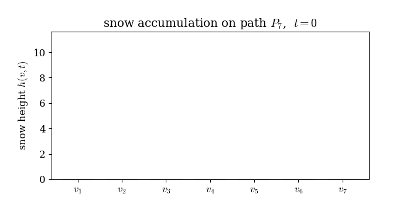{fig-align="center" width="88%"}

두 노드 $v_i,v_j$의 **snow distance** 는 두 높이 궤적 사이의 유클리드 거리다.

$$
\mathrm{SD}_{ij}(t) \;=\; \sqrt{\ \sum_{s=0}^{t} \big(h(v_i,s) - h(v_j,s)\big)^2\ }.
$$

즉 매 시각의 높이 차를 제곱해 시간에 대해 쌓은 것이다. 이 한 줄이 이 글 전체의 주인공이다. 아래는 이 과정을 그대로 옮긴 self-contained 시뮬레이터다. 이후 모든 예제가 이 함수들만 쓴다.

```python
import numpy as np
from numpy.linalg import pinv, matrix_power

def hst_run(W, f, b=0.5, T=20000, seed=0, mu0=None):
    """무거운 눈 변환(AAA 모델)을 T스텝 돌려 높이궤적 H (n×T+1)와 walker 경로를 반환.
    W: 간선 가중치(대칭/비대칭 모두 허용). f: 초기 높이(신호).
    낙하 노드는 기본적으로 '가중차수 비례' 분포에서 뽑는다."""
    rng = np.random.default_rng(seed); n = len(W); W = np.asarray(W, float)
    adj = [np.where(W[i] > 0)[0] for i in range(n)]      # 각 노드의 (밖으로의) 이웃
    if mu0 is None:                                       # 낙하 분포 = 가중차수 비례
        deg = W.sum(0); mu0 = deg / deg.sum()
    h = np.array(f, float).copy()
    H = np.zeros((n, T + 1)); H[:, 0] = h                 # 높이 궤적
    traj = np.full(T + 1, -1, int)
    x = rng.choice(n, p=mu0)                              # 첫 낙하 위치
    zmax = rng.integers(n, 2 * n + 1); z = zmax           # 라운드 길이 임계값 ~ Unif{n,..,2n}
    for t in range(1, T + 1):
        if z >= zmax:                                     # (1) 낙하: 새 눈덩이가 떨어진다
            x = rng.choice(n, p=mu0); h[x] += rng.uniform(0, b)
            z = 0; zmax = rng.integers(n, 2 * n + 1)
        else:
            nb = adj[x]; down = nb[h[nb] <= h[x]]         # 더 낮거나 같은 이웃 = 흐를 수 있는 곳
            if len(down):                                 # (2) 흐름: 가중치에 비례해 한 이웃으로
                w = W[x, down]; x = rng.choice(down, p=w / w.sum())
                h[x] += rng.uniform(0, b); z += 1
            else:                                         # (3) 막힘: 제자리에 쌓고 다음 스텝 낙하
                h[x] += rng.uniform(0, b); z = zmax
        traj[t] = x; H[:, t] = h
    return H, traj

def snow_distance(W, f, b=0.5, T=20000, seed=0):
    """snow distance 행렬 SD_ij(T)."""
    H, _ = hst_run(W, f, b, T, seed)
    return np.sqrt(((H[:, None, :] - H[None, :, :]) ** 2).sum(-1))
```

비교 상대가 될 고전 거리들도 같은 방식으로 준비한다. 유클리드 거리(값), diffusion 거리(구조), 저항거리(구조), 최단거리(구조)다.

```python
def euclid_distance(f):                                   # 값만: |f_i - f_j|
    f = np.asarray(f, float).reshape(-1, 1)
    return np.sqrt(((f[:, None] - f[None, :]) ** 2).sum(-1)).squeeze()

def diffusion_distance(W, t=6):                           # 구조: P^t 행들의 π-가중 거리
    W = np.asarray(W, float); rs = W.sum(1); P = W / rs[:, None]
    Pt = matrix_power(P, t); pi = rs / rs.sum()
    d2 = ((Pt[:, None, :] - Pt[None, :, :]) ** 2 / pi[None, None, :]).sum(-1)
    return np.sqrt(np.maximum(d2, 0))

def resistance_distance(W):                               # 구조: 그래프 라플라시안의 유사역행렬
    W = np.asarray(W, float); L = np.diag(W.sum(1)) - W
    Lp = pinv(L); d = np.diag(Lp)
    return d[:, None] + d[None, :] - 2 * Lp

def shortest_hops(W):                                     # 구조: 홉 수
    from scipy.sparse.csgraph import shortest_path
    return shortest_path((np.asarray(W) > 0).astype(float), unweighted=True)

def upper_corr(A, B):                                     # 두 거리행렬의 상삼각 상관
    iu = np.triu_indices(len(A), 1)
    return np.corrcoef(A[iu], B[iu])[0, 1]
```

이제 세 매력을 차례로 본다. 각 절은 작은 실험 그래프 하나로 시작한다.

# 매력 1 — 값과 구조 사이의 줄다리기

유클리드 거리는 값만, 그래프 거리는 구조만 본다. HST는 손잡이 $t$ 하나로 이 둘 사이를 **연속적으로 오간다**. 짧게 돌리면 초기 높이(값)의 흔적이 지배하고, 길게 돌리면 흐름이 그래프 구조를 새겨 넣는다. 값과 구조가 정면으로 충돌하는 무대를 하나 만들어 그 이동을 지켜보고, 이어서 두 도메인이 각자 놓치는 국소 이상치를 HST가 잡아내는 장면을 본다.

## 실험 그래프: 값과 구조가 싸우는 링

가장 극적인 신호는 간선마다 부호가 뒤집히는 **Nyquist 신호**다. 링 그래프 $C_{60}$ 위에 $f(v_i) = (-1)^i$을 얹는다.

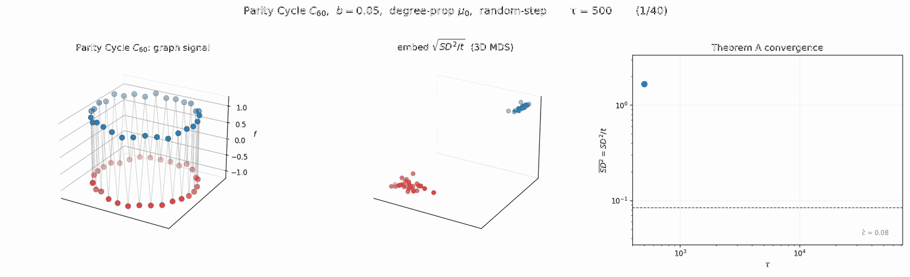{fig-align="center" width="96%"}

이 그래프를 두 시선으로 보자.

- **값의 시선(유클리드).** 이웃한 두 노드는 값이 $+1$과 $-1$로 정반대다. 그러니 값만 보면 **이웃끼리가 오히려 가장 멀다.** 한 칸 건너뛴 노드끼리(둘 다 $+1$)가 값으로는 가깝다.
- **구조의 시선(그래프).** 이웃한 두 노드는 간선으로 직접 이어져 있으니 **가장 가깝다.** 한 칸 건너뛴 노드는 두 발자국 떨어져 있어 조금 멀다.

두 시선이 정확히 반대로 순위를 매긴다. 값은 "이웃이 멀다", 구조는 "이웃이 가깝다". snow distance는 시간 $t$가 커지면서 이 두 시선 사이를 이동한다. 실제로 $t$를 키우며 snow distance가 값 거리·구조 거리와 각각 얼마나 닮는지 상관계수로 재 보자.

```python
n = 60
W_ring = np.zeros((n, n))
for i in range(n):
    W_ring[i, (i + 1) % n] = W_ring[(i + 1) % n, i] = 1.0
f_nyq = np.array([(-1) ** i for i in range(n)], float)   # Nyquist 신호

ED = euclid_distance(f_nyq)          # 값 거리
DD = diffusion_distance(W_ring, 6)   # 구조 거리
for t in [200, 1000, 5000, 20000]:
    SD = snow_distance(W_ring, f_nyq, b=0.5, T=t, seed=3)
    print(t, round(upper_corr(SD, ED), 2), round(upper_corr(SD, DD), 2))
# 200    0.81  0.24     ← 값에 붙어 있고 구조와는 거의 무관
# 20000 -0.02  0.48     ← 값의 흔적은 사라지고 구조만 남음
```

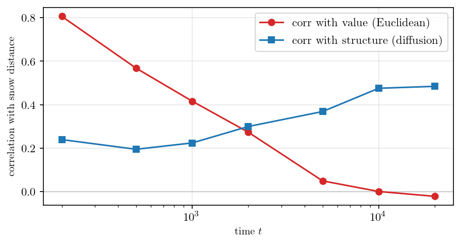{fig-align="center" width="70%"}

작은 $t$에서 snow distance는 값 거리와 강하게 붙어 있고($0.81$) 구조와는 거의 무관하다($0.24$). 이것은 초기 높이가 곧 신호라, 눈이 아직 얼마 안 쌓였을 땐 궤적이 신호를 그대로 기억하기 때문이다. $t$가 커지면 값과의 상관이 무너지고($-0.02$) 구조와의 상관이 올라간다($0.48$). 흐름이 그래프를 따라 눈을 실어 나르며 값의 기억을 지우고 연결 구조를 새기기 때문이다. 어느 지점에서 두 곡선이 교차하는데, 그 지점이 값과 구조가 반반씩 섞인 균형점이다. 중요한 건 이것이 두 도메인을 **고정 비율로 섞는** 게 아니라 $t$를 손잡이 삼아 한쪽에서 다른 쪽으로 **연속적으로 쓸어 넘기는** 것이라는 점이다. 아래 애니메이션이 그 줄다리기를 그대로 보여 준다 — 보라색 공이 VALUE에서 STRUCTURE로 미끄러진다.

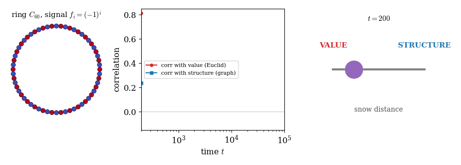{fig-align="center" width="98%"}

어떤 고전 거리도 이런 손잡이를 주지 않는다. 유클리드는 언제나 값, 그래프 거리는 언제나 구조에 고정돼 있다. HST만이 둘 사이의 어느 지점이든 골라 앉을 수 있다.

## 실험 그래프: 두 도메인이 각자 놓치는 국소 이상치

값과 구조를 맞세우기 때문에, HST는 **자기 이웃과 값이 어긋나는 노드** — 어느 한 도메인만으로는 보이지 않는 국소 이상치 — 를 잡아낸다. 두 개의 링을 위아래로 붙인 원기둥을 만들고, 위 링에는 값 $-3$, 아래 링에는 값 $+3$을 주되, **아래 링의 한 노드만 $-3$으로 뒤집는다.**

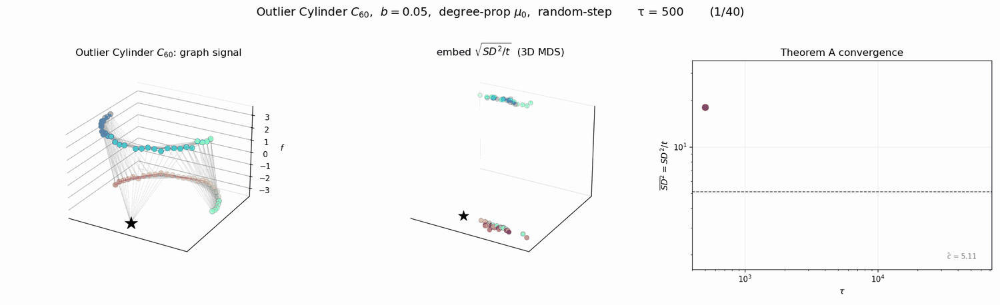{fig-align="center" width="96%"}

이 뒤집힌 노드를 세 거리는 어떻게 볼까.

- **유클리드(값).** 값이 $-3$이라 위 링 전체와 똑같다. 그러니 위 링에 딱 붙여 버린다. "얘는 위 링 식구야."
- **diffusion(구조).** 위치는 평범한 아래 링 노드다. 그러니 아래 링에 붙인다. "얘는 아래 링 식구야."
- **어느 쪽도 "값과 구조가 어긋난다"는 사실 자체는 보지 못한다.** 각자 자기 도메인 안에서만 판단하기 때문이다.

```python
C = 30; N = 2 * C
pos = np.zeros((N, 3))
for k in range(C):
    a = 2 * np.pi * k / C
    pos[k]     = [np.cos(a), np.sin(a), 1.0]   # 위 링
    pos[C + k] = [np.cos(a), np.sin(a), 0.0]   # 아래 링
Dm = np.sqrt(((pos[:, None] - pos[None, :]) ** 2).sum(-1))
Wc = np.exp(-Dm ** 2 / (2 * 0.5 ** 2)); Wc[Dm > 1.2] = 0; np.fill_diagonal(Wc, 0)
y = np.zeros(N); y[:C] = -3; y[C:] = +3
out = C + C // 2; y[out] = -3                   # 아래 링 한 노드를 −3으로 flip

SDo = snow_distance(Wc, y, b=0.05, T=20000, seed=4)
EDo = euclid_distance(y); DDo = diffusion_distance(Wc, 6)
# 뒤집힌 노드가 위/아래 링 중 어디에 붙는지 (각 거리의 전형적 위–아래 간격으로 정규화)
```

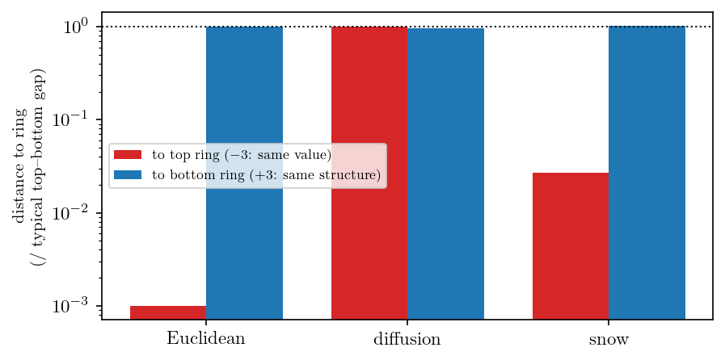{fig-align="center" width="66%"}

snow는 둘 다 읽는다. 값으로는 위 링에 가깝다고 하면서도, 정작 제가 **구조적으로 앉아 있는 아래 링에서는 이웃 대비 약 49배 튀는 이상치**로 표시한다. 즉 "얘는 값으로는 위 링 무리인데 왜 아래 링 한복판에 앉아 있지?"라는 어긋남 자체를 거리로 드러낸다. HST가 그래프 위 국소 평균변화 탐지기로도 쓰일 수 있다는 뜻이다. 값만 보는 거리도, 구조만 보는 거리도 이 어긋남을 볼 수 없다 — 어긋남은 두 도메인의 **관계**에 있지 어느 한쪽에 있지 않기 때문이다.

# 매력 2 — 수렴이 깔끔하다

좋은 거리는 오래 돌렸을 때의 거동이 예측 가능해야 한다. HST의 $\mathrm{SD}^2_{ij}(t)$는 $t\to\infty$에서 **정수 하나**로 완전히 분류된다.

## 실험 그래프: 균형의 링과 드리프트의 별

시각 $s$에서의 높이 차 $\big(h(v_i,s)-h(v_j,s)\big)^2$가 최악의 경우 얼마나 자라는지 생각해 보자. 높이 차는 눈이 쌓인 총량 규모이므로 최악의 경우 $s$에 비례하고, 그 제곱은 $s^2$까지 자란다. 그런데 실제로는 두 노드의 눈이 서로 상쇄되며 이 성장이 억눌린다. 억눌리는 정도를 정수 $k$로 세자 — 이를 쌍 $(i,j)$의 **상쇄 티어(cancellation tier)** 라 부른다. 지배항이 $s^{2-k}$이면, 시간에 대해 한 번 더 누적하는 정의

$$
\mathrm{SD}^2_{ij}(t) \;=\; \sum_{s=0}^{t}\big(h(v_i,s)-h(v_j,s)\big)^2
$$

가 지수를 하나 올려서, 결국

$$
\mathrm{SD}^2_{ij}(t) \;\asymp\; t^{\,3-k}, \qquad k \in \{0,1,2\}
$$

가 된다. 세 값이 세 개의 고전적 거동이다: $k=0$이면 $t^3$(**드리프트**), $k=1$이면 $t^2$(**중간**), $k=2$이면 $t^1$(**균형**). 이 분류가 어림짐작이 아님을 두 개의 작은 그래프로 확인한다.

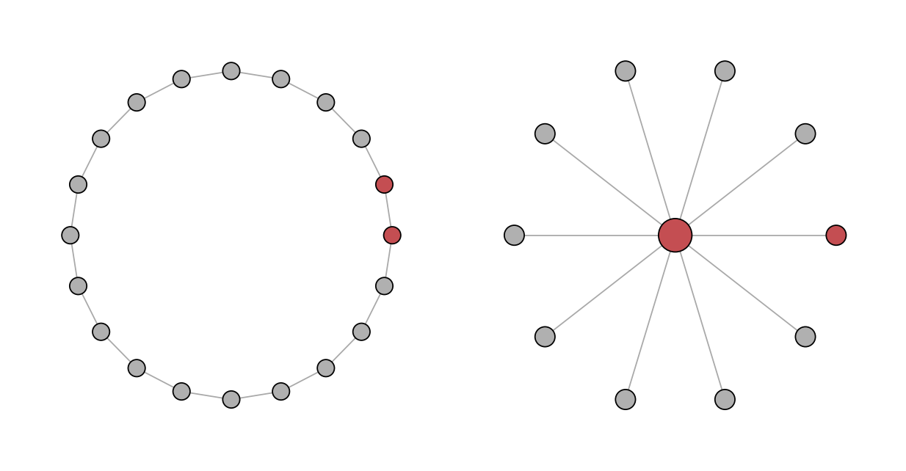{fig-align="center" width="96%"}

왜 이렇게 갈리는지가 이 그래프의 핵심이다. **링에서는** 이웃한 두 노드가 서로 거울상이라 눈을 받는 빈도가 같다. 한쪽이 잠깐 높아지면 흐름이 그쪽에서 반대쪽으로 눈을 실어 나르며 곧 균형을 되찾는다. 그래서 높이 차가 0 주변을 진동하고, 그 제곱을 쌓아도 $t^1$로만 자란다. **별에서는** 사정이 다르다. 낙하가 가중차수에 비례하니 차수 10인 허브가 차수 1인 잎보다 열 배 자주 새 눈을 받는다. 게다가 허브에 올라온 걷는 이는 낮은 잎들로 쉽게 흘러 나가지만, 잎에 있는 걷는 이는 유일한 이웃인 높은 허브로 못 올라가 자주 막힌다. 두 효과가 겹쳐 허브가 잎보다 꾸준히 빨리 쌓이고, 높이 차가 시간에 **선형으로 벌어진다**(드리프트). 그 제곱은 $t^2$, 시간 누적은 $t^3$이다.

```python
def sd2_traj(W, i, j, T=60000, b=0.5, seed=1):        # 시간에 대한 SD^2_ij 누적 궤적
    H, _ = hst_run(W, np.zeros(len(W)), b, T, seed)
    return np.cumsum((H[i] - H[j]) ** 2)

def fit_slope(sd2, T):                                # 로그–로그 기울기 = 지수
    tt = np.arange(1, len(sd2)); s = sd2[1:]
    m = (tt >= T // 10) & (s > 0)
    return np.polyfit(np.log(tt[m]), np.log(s[m]), 1)[0]

ring20 = np.zeros((20, 20))
for i in range(20): ring20[i, (i + 1) % 20] = ring20[(i + 1) % 20, i] = 1
star = np.zeros((11, 11))
for k in range(1, 11): star[0, k] = star[k, 0] = 1

print(round(fit_slope(sd2_traj(ring20, 0, 1), 60000), 2))   # 1.12  ≈ t^1  (균형)
print(round(fit_slope(sd2_traj(star,   0, 1), 60000), 2))   # 3.04  ≈ t^3  (드리프트)
```

측정된 두 기울기가 $t^1$과 $t^3$을 정확히 집어낸다(위 그림 오른쪽). 중간 티어 $t^2$는 일반적으로 나타나는 지수가 아니라 두 거동을 가르는 **칼날 같은 경계**로, 드리프트 쌍이 점유 격차를 0으로 좁히며 균형으로 이완하는 딱 그 순간에만 걸린다. 드리프트의 원인인 "허브가 선형으로 벌어진다"는 것도 직접 확인할 수 있다.

```python
H, _ = hst_run(star, np.zeros(11), b=0.5, T=60000, seed=1)
gap = H[0] - H[1]                       # 허브 − 잎 높이 차
print(gap[10000], gap[30000], gap[60000])   # 303, 919, 1852  ← 시간에 비례 = 드리프트
```

높이 차가 $303 \to 919 \to 1852$로 시간에 비례해 벌어진다.

드리프트가 별의 **모양** 때문이지 허브의 큰 차수 때문만은 아니라는 것도 확인해 두면 좋다. 별의 잎들을 바깥 링으로 이어 붙이면 바퀴 $W_{11}$이 된다. 허브 차수는 여전히 10이고 낙하도 여전히 차수에 비례하지만, 잎에 올라온 걷는 이가 이제 옆 잎으로 빠져나갈 길이 생긴다. 막힘이 사라지니 점유율이 고르게 퍼지고, 허브–잎 높이 차는 더 이상 벌어지지 않는다. 티어가 드리프트 $t^3$에서 균형 $t^1$로 내려앉는다.

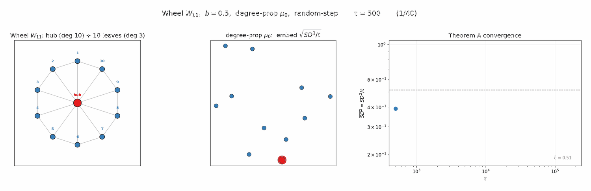{fig-align="center" width="96%"}

별에서 링 하나를 더한 것뿐인데 지수가 $3$에서 $1$로 내려간다. 티어를 결정하는 것은 차수의 크기가 아니라 **걷는 이가 갇히는가**이고, HST는 그 차이를 지수 자리에서 읽어 낸다.

여기서 중요한 매력은, 티어가 쌍 $(i,j)$만의 성질이라는 점이다. 같은 변환 하나가 어떤 쌍은 $t^1$로, 어떤 쌍은 $t^3$로 재어, 그래프를 세 스케일에서 **동시에** 읽는다. 지수 하나에 묶인 고정 스케일 그래프 거리들이 흉내 낼 수 없는 완전성이다.

## HST₀ — 스펙트럴 필터 가족의 한 식구

이론이 얼마나 깔끔한지는 자연스러운 대리물에서 **닫힌 꼴**이 나온다는 데서도 드러난다. 블록·흐름 동역학을 평범한 랜덤워크로 바꾼 변형 $\mathrm{HST}_0$을 생각하자. 이 대리물의 상수는 바탕 워크 $p^\infty$의 고유쌍 $(\lambda_k, v_k)$으로 닫힌 스펙트럴 합이 된다.

$$
\sigma^2_{ij} \;=\; \sum_{k \ge 2} \frac{1 + \lambda_k}{1 - \lambda_k}\,\big(v_k(i) - v_k(j)\big)^2 .
$$

이 형태 $\sum_k f(\lambda_k)\,|v_k(i)-v_k(j)|^2$는 고전적인 스펙트럴 필터 거리 가족 그 자체다 — diffusion은 $f(\lambda)=(1-\lambda)^{2t}$, heat은 $e^{-t\lambda}$, 저항은 $1/\lambda$. $\mathrm{HST}_0$은 필터 $(1+\lambda)/(1-\lambda)$를 쓰는 **어엿한 스펙트럴 거리**다(시뮬레이션으로 평균비 $1.010$까지 확인된 추측식). 반면 시간에 따라 지형이 바뀌는 완전한 HST는 어떤 고정 필터로도 표현되지 않아 이 가족 **바깥**에 있다. $\mathrm{HST}_0$은 그 정확히 풀리는 스펙트럴 그림자인 셈이다. 요컨대 HST는 고전 스펙트럴 이론에 닿아 있으면서 그것을 넘어선다.

# 매력 3 — 어떤 그래프 거리도 못 읽는 구조를 읽는다

신호가 평평해도($y = \mathbf{0}$) 고전 그래프 거리는 $\mathcal{G}$를 하나의 단면으로 눌러 버려 오판할 수 있다. snow는 여러 단면을 한꺼번에 읽는다. 세 가족을 차례로, 각자의 실험 그래프로 깬다.

## 오솔길과 고속도로 — 최단거리·diffusion이 못 재는 병목 (kite)

산속 오솔길을 떠올려 보자. 분명 길은 있는데, 한 명씩 겨우 지나가는 좁은 길이라 사실상 없는 거나 마찬가지다. 전기회로에도 같은 게 있다. 저항 하나만 사이에 두면 전류가 좁은 통로로 헐떡이며 지나가지만, 똑같은 저항을 여러 개 **병렬**로 묶으면 합성저항이 낮아지며 두 점 사이가 넓은 고속도로처럼 변한다. 직렬은 오솔길, 병렬은 고속도로다. 간선 하나를 굵게 만드는 게 아니라 간선의 **수** 자체가 흐름을 정한다는 점이 재미있다.

이 직관을 담은 것이 **연(kite) 그래프** $K_{2,20}+R$이다. 앵커(빨간 별)가 왼쪽 허브(주황 사각형)와는 **20개의 중간 노드(회색)를 거치는 20갈래 병렬 경로**(고속도로)로, 오른쪽 매달린 노드(보라 사각형)와는 **단 하나의 외길**(오솔길)로 이어진다.

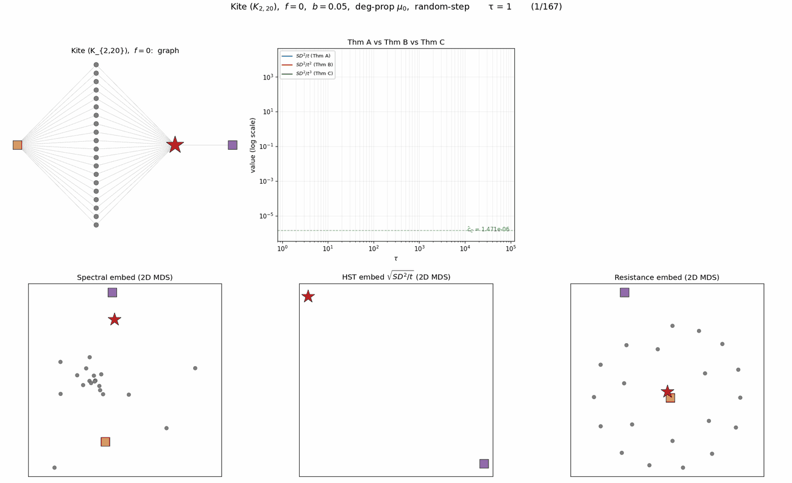{fig-align="center" width="96%"}

앵커에서 볼 때 20갈래로 이어진 허브와 외길로 매달린 노드 중 누가 가까운가? 아래 세 임베딩이 이 그래프의 핵심이다.

- **최단거리(Spectral).** 20개 중간 노드를 사방에 흩뜨리고, 20갈래로 이어진 허브를 "두 발자국"이라며 외길 끝 매달린 노드(한 발자국)보다 오히려 멀게 놓는다. 길의 수를 못 세니 고속도로를 오솔길만도 못하게 본다.
- **저항거리.** 병목은 알아채 매달린 노드를 바깥에 떼어 놓는다(흐름 시선에 가깝다). 다만 20개 중간 노드를 여전히 넓게 퍼뜨린다.
- **HST.** 20개 중간 노드를 앵커·허브 옆에 **다닥다닥 붙여** "20갈래 고속도로는 사실상 한 자리"임을 그려내고, 외길 끝 매달린 노드만 멀찍이 떼어 놓는다. 걷는 이가 실제로 그 위를 걸으며 20갈래 길을 한 묶음으로 재기 때문이다.

병목이 있다는 것뿐 아니라 그 **내부까지 제대로 배치**하는 건 셋 중 HST뿐이다. 그래프는 self-contained 코드로도 곧장 세울 수 있다.

```python
import networkx as nx
GK = nx.Graph()
ANCHOR, HUB = 0, 1
mids = list(range(2, 22))                          # 20개 중간 노드
for m in mids:
    GK.add_edge(ANCHOR, m); GK.add_edge(HUB, m)    # 20갈래 병렬 경로 (고속도로)
GK.add_edge(ANCHOR, 22)                            # 단일 외길 (오솔길)
W = nx.to_numpy_array(GK, nodelist=range(23))
SD = snow_distance(W, np.zeros(23), b=0.05, T=20000, seed=1)
# 앵커에서: 고속도로 끝 허브는 가깝고, 외길 끝 매달린 노드는 멀리 떨어진다
```

## 방향 — 가역 거리가 지워야만 하는 화살표 (directed)

랜덤워크·저항 거리는 **가역** 워크에서만 정의된다. 방향 그래프에서는 먼저 간선을 대칭화해 화살표를 지워야 한다. 그런데 지우고 나면 안 보이는 구조가 있다. $a \to \{b,c\} \to d$에 여분의 호 $b \to c$를 더한 그래프를 보자.

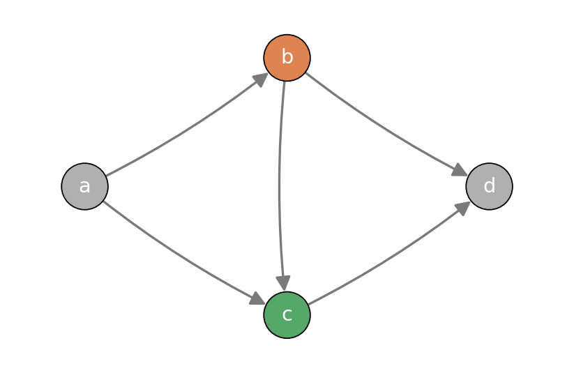{fig-align="center" width="96%"}

간선을 무향으로 만드는 순간 $b$와 $c$는 완전히 대칭이 된다(둘 다 $a,d$와 이어지고 서로 이어진다). 그래서 모든 가역 거리가 $d(d,b) = d(d,c)$로, 둘을 **정확히 같게** 본다. 화살표를 지웠으니 당연하다. 하지만 흐름에서는 $b$가 $c$의 상류다 — 눈은 $b$에서 $c$로 흐르지 그 반대로는 안 흐른다. snow는 이 방향을 그대로 읽는다.

```python
Wd = np.zeros((4, 4))
Wd[0, 1] = Wd[0, 2] = 1            # a→b, a→c
Wd[1, 3] = Wd[2, 3] = 1            # b→d, c→d
Wd[1, 2] = 1                       # b→c (상류/하류 방향)

SDd = snow_distance(Wd, np.zeros(4), b=0.5, T=20000, seed=1)
Wsym = np.maximum(Wd, Wd.T)        # 가역 거리는 대칭화부터
rd_s = resistance_distance(Wsym)
print(round(SDd[3, 1] / SDd[3, 2], 1))          # snow:      28.5  (b,c를 크게 가름)
print(rd_s[3, 1] == rd_s[3, 2])                 # resistance: True (구별 못함)
```

최단·저항·diffusion 모두 $d(d,b)$와 $d(d,c)$를 정확히 같게 주는 반면, snow는 둘을 수십 배로 가른다. 가역 거리가 정의상 버릴 수밖에 없는 방향 정보를, 무거운 눈 과정은 흐름의 자연스러운 부산물로 직접 읽는다.

## 스케일 — 스펙트럴 거리가 사라져 버리는 지점 (collapse)

스펙트럴 거리들은 스케일 $t_{\mathrm{diff}}$를 하나 지니는데, 그 스케일을 키워 워크가 충분히 섞이면 모든 정보를 잃는다. 다리 하나로 이어진 두 6-클리크를 보자.

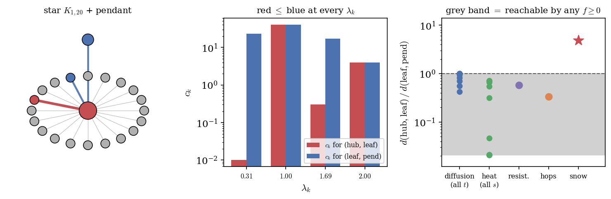{fig-align="center" width="96%"}

이 그래프에는 뚜렷한 두 군집과 그 사이의 병목(다리)이 있다. 좋은 거리라면 이 경계를 언제 재도 유지해야 한다. 그런데 diffusion 거리는 스케일 $t_{\mathrm{diff}}$가 커지면 가장 큰 거리마저 0으로 무너져, 모든 노드가 서로 등거리가 된다 — 과잉혼합이다.

```python
nb = 12
Wb = np.zeros((nb, nb))
for a, b0 in [(0, 6), (6, 12)]:
    for i in range(a, b0):
        for j in range(i + 1, b0):
            Wb[i, j] = Wb[j, i] = 1
Wb[5, 6] = Wb[6, 5] = 1               # 다리 하나

for td in [2, 32, 512]:               # diffusion: 스케일을 키우면 최대거리가 붕괴
    print(td, round(diffusion_distance(Wb, td).max(), 4))   # 1.895, 0.396, 0.0000
SDb = snow_distance(Wb, np.zeros(nb), b=0.5, T=30000, seed=5)   # snow: ~4배로 유지
```

diffusion 거리는 $t_{\mathrm{diff}}=2$에서 약 $1.9$였다가 $t_{\mathrm{diff}}=512$에서는 수치적으로 0까지 무너진다. snow는 그런 붕괴를 겪지 않고 두 군집을 언제나 군집 내부의 약 4배 거리로 벌려 둔다. 눈은 시간에 걸쳐 쌓이지 특정 스케일에서 평형에 도달해 정보를 잃지 않기 때문이다. 아래 애니메이션이 그 대비다 — 왼쪽 diffusion 임베딩은 한 점으로 뭉개지고, 오른쪽 snow 임베딩은 두 군집을 계속 떨어뜨려 둔다.

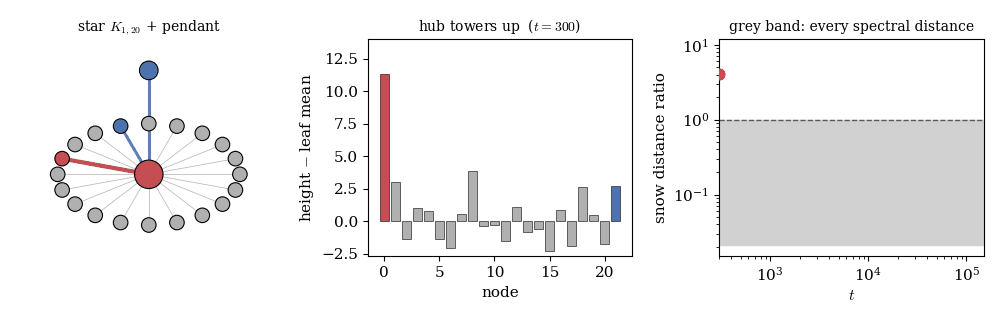{fig-align="center" width="88%"}

# 세 얼굴을 모으면

여섯 개의 작은 실험 그래프가 한 결론을 가리킨다. 무거운 눈 변환은 **값과 구조 사이를 손잡이 하나로 오가고**($t$의 줄다리기), **오래 돌렸을 때의 거동이 정수 하나로 완전히 분류되며**(세 티어), **고전 그래프 거리들이 — 하나씩, 그리고 여기서는 전부 — 놓치는 병목·방향·군집 구조를 읽는다**(도장깨기). 값만 보는 거리도, 구조만 보는 거리도, 스케일에 갇힌 거리도, 화살표를 지워야 하는 거리도 아니다. 그래프 위 데이터를 지형 삼아 눈을 쌓아 보는 것 — 그 단순한 발상이 셋을 한꺼번에 준다.

::: {.callout-note collapse="true"}
## 재현 정보

위 모든 그림은 이 글의 `hst_run` / `snow_distance`와 고전 거리 함수만으로 계산됐다(외부 패키지 없이 복사·실행 가능). 낙하 분포는 가중차수 비례, 흐름은 간선 가중치 비례 downstream 이동, 막힘은 제자리 누적 후 낙하로 정의된다(AAA 모델). 시드는 각 코드에 표기.
:::
