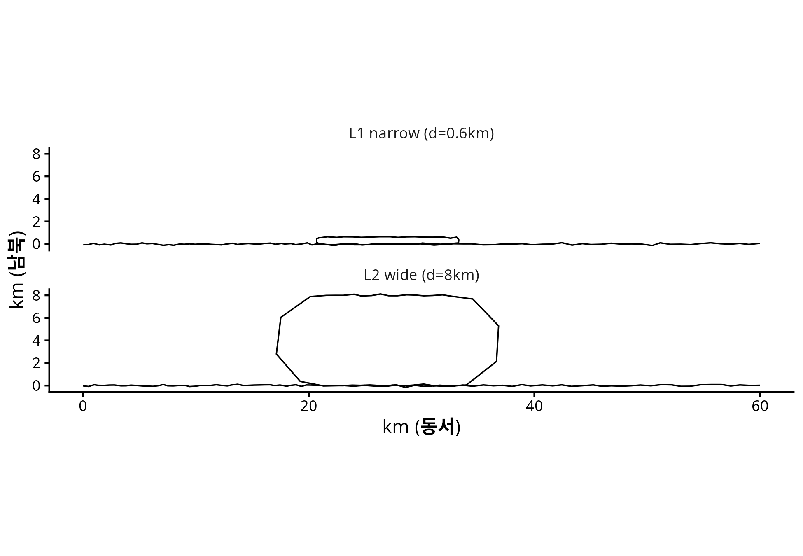
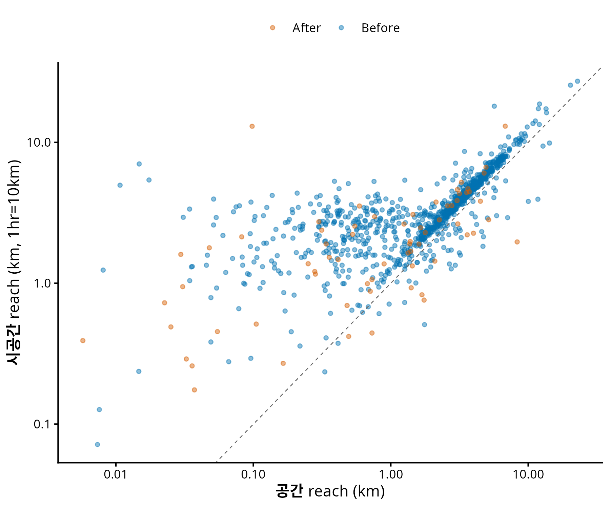
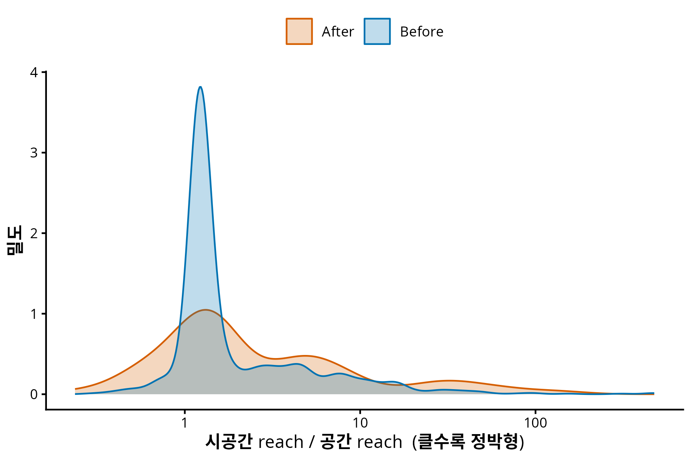
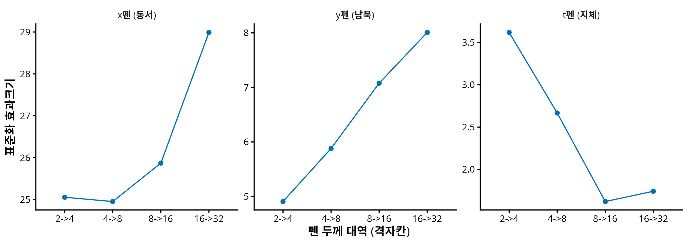
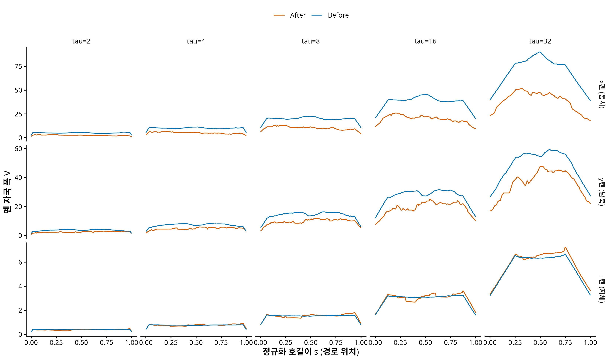

## 0. 한 줄 요약

시계열을 **두께 τ 의 펜**으로 그려 다중스케일로 읽는 Thick Pen Transform (Fryzlewicz & Oh, 2011, JRSS-B) 을 평면·시공간 궤적으로 확장했다. 펜촉의 모양이 곧 질문이다: **x펜·y펜**은 동서/남북 변동의 (스케일 × 경로위치) 지도를, **t펜**은 지체(dwell)의 지도를 준다. 반증 시뮬 2건을 통과했고 — 곡률이 원리적으로 못 보는 것을 펜은 보고, 세 펜이 위치·모양·시간 채널을 누출 없이 가른다 — 실데이터 1,073척에서 위기 후 "정박형" 이동을 속도 문턱 없이 순수 기하로 재확인했다. 도중에 시뮬 2건이 먼저 **실패**했는데, 그 실패를 고치는 과정에서 예상 밖의 결과가 나왔다: **펜의 V·M 분해가 기존 3-채널 분해 (위치·모양·운동학) 와 정확히 대응한다.**

> **선행 글**: [위기 효과 3-수준 분해](260703_d61fb6.html) · [신호는 어디에 사는가](260707_902d65.html)
> **출발 문헌**: Fryzlewicz, P. & Oh, H.-S. (2011). *Thick pen transformation for time series.* JRSS-B **73**(4). (`COMPANY/-도서관/논문/PAPER_Thick-pen.pdf`)

## 1. 왜 새 툴이 필요했나 — 네 개의 벽

이 프로젝트의 기존 분석 (3-채널 분해, 스케일 스펙트럼, joint MFPCA) 은 이미 강한 결과를 냈지만, 네 지점에서 벽에 부딪혀 있었다.

| # | 벽 | 증거 |
|---|---|---|
| H1 | **전역 기저는 "어느 위치"를 못 준다** | 코사인 전개로 red spectrum 은 얻었으나 "고주파 변화가 해협 병목부에서만 일어났는가"는 원리적으로 답 불가 |
| H2 | **scalar 요약이 검정력을 죽인다** | 같은 자료, 같은 현상: TAC scalar 검정 p=0.349 (null) vs 고주파 대역 함수 검정 p=0.002 (유의) |
| H3 | **등방 스케일 축 하나로는 채널이 안 갈린다** | 소멸스케일 실험 — 위치·시간 신호는 어떤 스무딩 σ 에서도 안 지워짐 (1D 사다리 반증) |
| H4 | **직교 분해와 결합 탐지가 양립 못 한다** | 3-채널(R3)은 몫을 주지만 상관을 못 보고, joint MFPCA(R6)는 결합을 보지만 스케일 주소가 없다 |

H1 은 우리만의 문제가 아니다. Fourier 기저는 전역 지지를 가지므로 국소 신호가 전 주파수에 에너지를 흩뿌린다 — 이건 조화해석의 고전적 한계고, 웨이블릿이 만들어진 이유다. 그런데 우리 데이터에는 웨이블릿보다 더 근본적인 문제가 하나 더 있다:

::: {.callout-important title="정박은 매끄러운 함수의 잔무늬가 아니라 질량 덩어리다"}
B-spline + roughness penalty 기반 FDA 는 **매끄러움을 가정**한다. 그런데 이 데이터의 핵심 현상인 정박(anchoring)은 점유측도의 **atom** 이다 — 매끄럽게 근사하는 순간 뭉개진다. 미분 기반 곡률은 noise amplification 까지 겹친다. 매끄러움을 가정하지 않는 도구가 필요하다.
:::

## 2. Thick Pen Transform — 3분 요약

원 논문의 아이디어는 어이없을 만큼 단순하다. 시계열 $X_t$ 를 **두께 τ 의 펜으로 그린다**. 펜이 지나간 자국의 상단과 하단이

$$U_t^\tau = \max_{s \in [t-\tau,\ t+\tau]} X_s + \frac{\tau}{2}, \qquad L_t^\tau = \min_{s \in [t-\tau,\ t+\tau]} X_s - \frac{\tau}{2}$$

이고, 두께를 τ₁부터 τ₂까지 바꿔가며 그린 자국의 족(family)이 변환 전체다. "시계열을 여러 거리에서 바라보기(viewing the time series from a range of distances)". 요약통계는 두 개다:

$$V_t^\tau = U_t^\tau - L_t^\tau \quad (\text{부피}), \qquad M_t^\tau = \tfrac{1}{2}(U_t^\tau + L_t^\tau) \quad (\text{평균})$$

핵심 성질 세 개:

1. **첨자가 (t, τ) 둘이다** — 시간(위치) × 스케일 이중 국소화가 정의에 내장. H1 의 직접 해결.
2. **max−min 은 비선형 필터다** — 커널 스무딩과 달리 극값을 뭉개지 않는다. 정박 spike 가 살아남는다.
3. **이론이 따라온다** — Prop 1 (변동감소), Thm 1 (Gaussian 판별성), Thm 2 (FCLT → Brownian bridge 극한). 저자들이 tube formula 를 "시계열은 비매끄러워 못 쓴다"고 명시적으로 열어둔 문도 있다 (§4 에서 우리가 통과한다).

이 논문은 도서관에 들어와 있었지만 사내 어느 산출물에도 인용된 적이 없었다. 미개봉 자산이었다.

## 3. 확장 — 펜촉의 사전

궤적을 정규화 호길이 $s \in [0,1]$ 로 재매개화한 공간곡선 $\gamma(s) = (x(s), y(s), t(s)) \in \mathbb{R}^3$ 로 본다. $t(s)$ 는 호길이 $s$ 에 도달한 시각 — 단조증가 함수다. 펜촉을 볼록집합 $P$ 로 두면 자국은 민코프스키 합

$$T(\gamma; \tau P) = \gamma \oplus \tau P = \{\, \gamma(s) + \tau p : s \in [0,1],\ p \in P \,\}$$

이고, **원 논문의 1D 변환은 P = 세로 구간인 특수경우**다. 펜촉 선택이 이 정의의 유일한 자유도이며, 펜촉이 존중하는 불변군이 곧 표현의 정체성이다:

| 펜 | 펜촉 | 불변군 | 읽는 것 |
|---|---|---|---|
| **x펜** | x축 구간 | x평행이동 | 동서 변동의 (스케일×위치) |
| **y펜** | y축 구간 | y평행이동 | **남북 변동** = 이란/오만 쪽 |
| **t펜** | t축 구간 | 시간원점 | 지체·정박의 (스케일×위치) |
| **정사각펜** = x펜 ⊗ y펜 | 정사각형 | 평행이동 | 좌표계 기준 평면 기하 |
| **원반펜** | 원반 | 강체운동 (회전 포함) | 순수 모양 (좌표 무관) |
| **원기둥펜** | 원반 × 시간구간, 두께 **(τ_s, τ_t)** | 공간회전 + 시간원점 | 시공간 비등방 |
| ~~공펜~~ | 3D 공 | (x,y,t) 등방 | **배제** — km 과 시간은 같은 단위가 아니다 |

세 가지 논점이 이 표를 지탱한다.

**첫째, x펜·y펜이 이론이 먼저 서는 쪽이다.** 원 논문은 square pen 과 round pen 을 정의하고 정리는 square pen 에 대해서만 증명한다 ("the least challenging to analyse theoretically"). 평면으로 올리면 이 대응이 그대로 유지된다 — 정사각펜(x⊗y)은 좌표별로 분해되므로 1D 정리가 좌표마다 승격되고, 원반펜은 분해가 안 되므로 새 증명이 필요하다.

**둘째, 회전 불변성 상실은 이 도메인에서 자산이다.** shape analysis 의 본능은 회전을 nuisance 로 제거하는 것이다. 그런데 호르무즈에서 남북은 이란 vs 오만이다. 좌표축이 정치적 의미를 갖는 도메인에서 회전 불변성은 지켜야 할 성질이 아니라 버려야 할 정보 손실이다. y펜의 (스케일×위치) 지도는 NYT 기사가 보도한 3/8 항로 시프트 (표준 항로 → 이란 쪽 얕은 물) 의 직접 측정량이 된다. 회전 불변이 필요한 질문("모양 그 자체")은 원반펜이 따로 담당한다 — 두 펜은 경쟁이 아니라 서로 다른 질문이다.

**셋째, 공펜의 배제가 원기둥펜을 정당화한다.** km 과 시간은 단위가 달라 (x,y,t) 등방 스케일은 애초에 정의 불가능하다. 따라서 시공간 펜의 두께는 **(τ_s, τ_t) 두 개일 수밖에 없다** — 비등방이 선택이 아니라 필연이다. 이게 왜 중요한지는 §7 에서.

## 4. 이론 — 곡률이 면적에 나타나지 않는다

원반펜 자국의 면적에 대해 다음이 성립한다 (Weyl 1939 tube formula + Federer reach):

::: {.callout-note title="정리 후보 A (자국 면적)"}
길이 $L$ 의 단순 평면곡선 $\gamma$ 에 대해, $\tau < \mathrm{reach}(\gamma)$ 인 모든 τ 에서

$$A(\tau) = |T(\gamma;\tau D)| = 2L\tau + \pi\tau^2 \qquad \text{(정확히)}$$

여기서 $\mathrm{reach}(\gamma) = \min\big( 1/\max_s |\kappa(s)|,\ \tfrac{1}{2}\cdot\text{최소 자기접근거리} \big)$.
:::

$2L\tau$ 는 곡선을 곧게 편 띠, $\pi\tau^2$ 은 양 끝의 두 반원이다. 이 식의 반직관적 핵심: **곡률 κ 가 우변에 없다.** 곡선이 굽으면 안쪽에서 잃는 면적과 바깥쪽에서 얻는 면적이 정확히 상쇄된다. 검산 — 반지름 1 의 반원 ($L = \pi$): 자국 = 반고리 + 양끝 반원 = $\frac{\pi}{2}[(1+\tau)^2 - (1-\tau)^2] + \pi\tau^2 = 2\pi\tau + \pi\tau^2$. ✓

수치로도 확인했다. 래스터로 자국 면적을 직접 재면:

| 곡선 | 곡률 | τ=0.5 에서 상대오차 |
|---|---|---|
| 직선 | 0 | −0.82% |
| 반원 | 1 (일정) | **−0.07%** |
| 사인 활 | 가변 | **−0.05%** |

곡률 1 인 반원과 곡률 0 인 직선이 **같은 공식**에 맞는다. 잔차는 격자 이산화 오차다 — h 를 절반으로 줄일 때마다 오차도 절반 (O(h) 수렴), Richardson 외삽하면 이론값과 0.006% 일치.

그래서 무엇이 좋은가? 곡률·자기접근 정보는 면적에 연속적으로 새어나오는 게 아니라, τ 가 reach 를 넘는 **임계 순간에 갑자기** 결손

$$D(\tau) := 2L\tau + \pi\tau^2 - A(\tau)$$

으로 켜진다. D 가 켜지는 이유는 정확히 두 가지뿐이다: (i) τ 가 국소 곡률반경을 넘음 (급회전), (ii) 곡선이 자기 자신에게 거리 2τ 이내로 되돌아옴 (U턴·미앤더·정박 선회). 그리고 (ii)는 기존 곡률로는 **원리적으로 볼 수 없다** — 곡률은 국소량이라 "배가 자기 궤적으로 되돌아왔다"를 감지하지 못한다.

::: {.callout-important title="미분 없는 곡률"}
$D(\tau)$ 는 2차 미분 (곡률의 정의) 없이 거리와 면적만으로 급회전과 회귀를 하나의 다중스케일 곡선에 담는다. 곡률 분석이 겪던 noise amplification·smoothing 민감성이 원천적으로 없다. TAC 처럼 한 숫자로 적분해버리는 대신 τ 축 위에 펼치므로, H2 (scalar 요약의 검정력 손실) 도 피한다.
:::

정직한 한계: τ ≥ reach 에서 D ≥ 0 이 자동 보장되지는 않는다 (법선 사상의 야코비안 $|1 - u\kappa|$ 부호 문제). 정리로 쓸 때는 τ < reach 구간에 한정하고, 그 밖에서 D 는 "통계량"으로만 쓴다.

## 5. 반증 시뮬 — 두 번 실패했고, 실패가 더 가치 있었다

이론 작업 전에 값싼 반증 시험을 먼저 걸었다. 툴이 여기서 죽으면 프로그램 전체를 중단하는 설계다. **그리고 첫 시도에서 둘 다 죽었다.**

### 5.1 S3: 곡률이 원리적으로 못 보는 것을 펜은 보는가

U턴 자체는 곡률도 잡는다 (총회전이 π 늘어남). 곡률이 못 보는 것은 **자기접근**이다. 그래서 회전각 총합은 동일하고 **왕복 간격 d 만** 0.6km vs 8km 로 다른 두 군을 만들었다 — 배가 좁게 왕복하며 대기하는 패턴 vs 넓게 도는 패턴. 회전각이 같으므로 TAC 는 원리적으로 구분 불가여야 하고, 자기접근 기반 통계량은 구분해야 한다.

{fig-align="center"}

**v1 — 실패.** reach 를 통계량으로 썼는데, 두 군의 reach 가 똑같이 0.03 이 나왔다 (기대값 0.3 vs 4.0). 원인: reach 는 inf 형 통계량이라 **최악의 한 점에 지배**된다. 점당 0.05km 의 노이즈가 접선을 흔들면 d 정보가 완전히 사라진다.

**교훈과 수정.** 적분형으로 바꿔야 한다 — 원 논문의 V 가 부피(적분량)이지 극값이 아닌 것과 같은 설계철학이다. 자기접근 프로파일

$$\Phi(\tau) = \frac{1}{n} \#\big\{\, i : \exists j,\ |i-j| > \text{gap},\ \|P_i - P_j\| \le 2\tau \,\big\}$$

로 교체했다 (두 자국이 겹치는 조건이 정확히 거리 2τ — D(τ) 의 계산 가능한 대리량). count 형이라 노이즈에 강건하다.

**v2 — 통과** (군당 n=120, B=999):

| 통계량 | stat | p | 해석 |
|---|---|---|---|
| TAC (곡률 요약) | 3.06 | **0.140** | 무반응 — 설계대로 원리적 구분 불가 |
| Φ(τ=0.5) | **16.61** | **0.001** | 강한 분리 |
| Φ(τ=2) | 10.14 | 0.001 | |
| Φ(τ=6) | 0.00 | 1.000 | 양군 포화 (Φ=1) — 신호 소멸 |

신호가 τ ≈ 0.5–2 에서 최대이고 τ=6 에서 사라진다 — **스케일 축 위에 주소가 찍힌다.** H1 의 실증이다.

### 5.2 S5′: 세 펜이 세 채널을 가르는가

선행 소멸스케일 실험에서 등방 스무딩은 위치(P) 주입과 시간(K) 주입을 어떤 σ 에서도 구분하지 못했다. 같은 시나리오를 펜에 다시 걸었다: 기준 궤적 대비 위치만(P)/모양만(S)/시간만·중앙대기(K)/시간만·진입부대기(K′) 를 주입.

**v1 — 실패.** y펜이 순수 평행이동 P 에 무반응 (p=0.751). 원인은 부끄러울 만큼 단순했다: $V = U - L$ 은 국소 max−min 이므로 **평행이동 불변**이다. 위치를 잡으라고 만든 검정에 평행이동 불변량을 넣은 것이다. 변환의 절반만 쓴 탓 — 원 논문 remark (a) 가 V 와 M 이 상보적이며 $U = M + V/2$, $L = M - V/2$ 로 변환 전체를 복원한다고 정확히 경고하고 있었다.

**v2 — M 을 넣자 통과** (Bonferroni α_B=0.0025):

| 주입 | M_y (위치펜) | V_y (모양펜) | V_t (시간펜) |
|---|---|---|---|
| P (위치만) | **●** | ○ | ○ (p=1.000) |
| S (모양만) | ● | **●** | ○ (p=1.000) |
| K (시간만·중앙) | ○ | ○ | **●** |
| K′ (시간만·진입부) | ○ | ○ | **●** |

대각선 3/3 점등, **시간펜 누출 정확히 0**. 그리고 K vs K′ — 지체가 *어디서* 일어났는지 — 가 위치 축에서 p=0.001 로 갈린다. 등방 스무딩이 원리적으로 못 하던 바로 그것이다.

### 5.3 실패의 수확 — V·M 분해는 3-채널 분해의 펜 버전이다

v1 의 실패를 고치자 의도하지 않은 대응이 나타났다:

| 3-채널 분해 (선행 글) | 펜 시스템 | 이유 |
|---|---|---|
| 위치 $c = \int \beta$ | **M 의 s-평균** | M 은 평행이동에 반응 |
| 모양 $\tilde\beta$ | **V** | V 는 평행이동 **불변** → 자동 중심화 |
| 운동학 τ | **t펜의 V** | 단조 t(s) 의 국소폭 = 지체 |

::: {.callout-tip title="같은 분해, 두 개의 길"}
선행 글의 명제 1 (위치⊥모양) 은 L² 직교로 증명됐다. 펜 시스템에서는 같은 분해가 **max−min 필터의 평행이동 불변성**에서 나온다. V 의 불변성이 명제 1 의 펜 버전인 셈이다. 서로 독립인 두 프레임워크가 같은 채널 구조에 도달했다는 것은 이 분해가 표현의 인공물이 아니라 데이터의 구조라는 증거다.
:::

## 6. 실데이터 — N=1,073 (Before 1,006 / After 67)

M=128 호길이 격자, τ ∈ {2,4,8,16,32} 격자칸, B=999.

### 6.1 reach 판별 평면 — 위기는 배들을 "정박형"으로 밀었다

시공간 곡선 $(x, y, c\cdot t)$ (환산 c = 10 km/hr) 의 reach 와 평면 reach 를 짝지으면 세 현상이 갈린다: 정박한 배는 평면에서 작은 뭉치 (공간 reach 작음) 지만 시공간에서는 t축 방향의 곧은 선분 (시공간 reach 큼) 이다. 급회전은 둘 다 작다.

{fig-align="center"}

| 기간 | 공간 reach (중앙값) | 시공간 reach | 비 (시공간/공간) |
|---|---|---|---|
| Before | 2.36 km | 3.21 | 1.270 |
| After | **1.25 km** | 1.90 | **1.505** |

비 증가 p=0.002. **After 가 더 정박형이다.** 이것은 선행 분석의 "평균속도 감소 = 정박 증가 48% + 순항 감속 52%" 와 같은 방향인데, 도달 경로가 완전히 다르다 — 속도 문턱 (STOP_KMH=5 같은 자의적 상수) 도, 미분도, 시간 창도 없이 **순수 기하**에서 나왔다. 독립 확증이다.

{fig-align="center"}

### 6.2 대역 증분 — 결론 하나를 스스로 뒤집다

여기서 방법론적 함정을 하나 밟을 뻔했다. $V^\tau$ 는 창 반폭 τ 안의 max−min 이므로 **τ 에 대해 단조증가하는 누적량**이다. "τ 가 커질수록 stat 이 크다"를 스케일 국소화로 읽으면 안 된다. 진짜 대역은 원 논문의 미분 요약통계 $\Delta V^\tau / \Delta\tau$ 다.

재계산 결과 (표준화 효과크기, Bonferroni 12검정):

{fig-align="center"}

| 대역 | x펜 | y펜 | t펜 |
|---|---|---|---|
| 2→4 | 25.1 ● | 4.9 | 3.6 |
| 4→8 | 25.0 ● | 5.9 | 2.7 |
| 8→16 | 25.9 ● | 7.1 ● | 1.6 |
| 16→32 | 29.0 ● | 8.0 ● | 1.7 |

**정정: t펜의 대역 신호는 없다.** 누적 V_t 는 p=0.004 로 유의했지만 대역 증분은 Bonferroni 후 전부 비유의다. 앞선 "지체 신호가 fine 스케일에 산다"는 읽기는 누적량의 아티팩트였고, 폐기한다. 그런데 이 정정 자체가 해석 가능한 결과다: **운동학의 위기 효과는 스케일 구조가 아니라 총량 (수준 효과) 에 있다.** 지체가 특정 스케일에 몰린 게 아니라 전반적으로 늘었다 — "정박 증가 48%" 가 수준 효과라는 선행 결과와 정합한다.

반면 y펜은 거친 대역만 유의하고 τ 와 함께 단조증가한다. **남북 변동의 위기 효과는 큰 스케일 현상** — 선행 글의 red spectrum (저주파 지배) 과 같은 방향이다. 전역 코사인 기저와 국소 max−min 필터라는 전혀 다른 두 변환이 같은 스케일 결론에 도달했다.

{fig-align="center"}

## 7. 원기둥펜 — "킵"된 과제가 되살아난다

선행 스케일 스펙트럼 노트는 시공간 비등방 사다리 (스냅숏 → 장노출 → 동영상) 를 이렇게 보류했다: *"공간 해상도 먼저, 시간 해상도 나중 — 그 '순서'가 외생적 선택이 됨. 향후과제로 킵."*

이 반론은 **스케일이 1차원 축이라는 전제** 위에 서 있다. 축이 하나면 무엇을 먼저 지울지 골라야 한다. 원기둥펜은 두께가 (τ_s, τ_t) 두 개다 — 순서를 고를 필요가 없다. **2차원 스케일 평면 전체를 읽으면 된다.** 대각선을 따라가면 "동시에", 축을 따라가면 "공간만/시간만"이고, 그 사이의 모든 경로가 다 보인다. 외생적 선택이 사라진다.

그리고 §3 의 공펜 배제 논증이 이것을 정당화한다: 등방 스케일이 정의 불가능하므로 2축 스케일 평면은 편의가 아니라 필연이다. S5′ 의 K vs K′ 분리 (p=0.001) 가 이 방향의 첫 실증이다.

## 8. 오늘 결론을 믿기 전에 — caveat 4건

1. **채널 귀속 미완.** energy distance 의 stat 크기는 단위 의존이라 채널 간 비교 불가 (M_y 의 886 과 V_t 의 4.6 은 190배 차이가 아니다). 선행 글의 63/31/6 같은 귀속은 표준화 설계 후에만 가능 — 미착수.
2. **실데이터 reach 는 잠정값.** 시뮬에서 노이즈에 붕괴한 전력이 있는 통계량이다. 실데이터에서 살아남은 것은 강건해서가 아니라 희소 관측을 선형보간한 조각선형 곡선에 점별 jitter 가 없기 때문이다. §6.1 의 방향은 Φ 로 지지되지만, 확정은 로버스트화 후.
3. **극한이론 미착수.** 원 논문 Thm 2 는 단일 정상시계열의 α-mixing 가정 위에 있다. 우리는 n 개 궤적의 iid 표본이므로 경험과정 이론 (functional delta-method) 으로 갈아끼워야 한다. 실패하면 permutation 으로 후퇴 (실용상 무손실, 이론적 완성도는 미달).
4. **S5′ 잔여 누출 1건.** 모양 주입이 위치 추정량의 분산을 키운다 (편향은 없음 — 중앙값 −0.02). 로버스트 중심으로 해결 예정.

## 9. 다음 단계

| # | 후보 | 비용 | 산출 |
|---|---|---|---|
| A | 정사각펜 판별성 정리 — 원 논문 Thm 1 의 좌표별 승격 | 낮음 | 첫 이론 확보 |
| B | 채널 귀속 표준화 — 펜 버전 63/31/6 | 중간 | 선행 결과와 직접 비교 |
| C | 원기둥펜 (τ_s, τ_t) 2D 스케일 평면 실계산 | 중간 | §7 의 실증 |
| D | 원반펜 D(τ) 래스터 (부분표본) | 높음 | 정리 A 의 실데이터 그림 |

---

**코드**: `260722_끈_NYT호르무즈펜시스템_R.R` (본분석) · `260722_끈_펜시스템반증시뮬_R.R` (S3·S5′) · `260722_끈_펜대역증분검정_R.R` (대역) — numeric·figure 는 `results/*/260722_끈_*/`

*작성: 끈 (연구팀), 2026-07-22*
