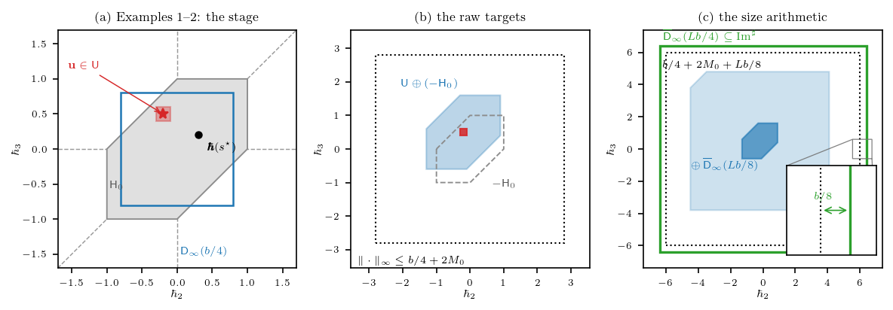

기준본은 감(감사팀) 글다듬기 반영본 `hst_AAA_52재구성.tex` 이고, 보조정리 번호는 그 빌드 PDF 의 실측이다: `lem:reach` = 보조정리 5, `dfn:chamber` = 정의 3, `dfn:reach` = 정의 8. 감의 의존도 다이어그램 `dep_lemma10` 의 번호와도 일치한다.

**보일 것.**

$$
\mathsf{U}\oplus(-\mathsf{H}_0)\;\subseteq\;\operatorname{Im}^{\sharp}\ominus\overline{\mathsf{D}}_\infty(\tfrac{Lb}{8}),
\qquad L:=\lceil 16M_0/b+3\rceil .
$$

그러기 위해 adjunction 으로 목표를 침식 없는 꼴로 바꾸고, 그 다음 (G1) reach 가 반지름 $Lb/4$ 의 disk 를 통째로 담는다, (G2) 자란 target 이 그 disk 를 벗어나지 않는다, 이 둘만 보이면 된다.

## 기호

- $b$: 한 스텝이 떨어뜨리는 적재량의 상한. $n$: 노드의 수. $L$: cycle 의 수. $m=nL$: window 안 낙하의 수.
- $\mathsf{D}_\infty(R) := \{\mathbf{d}\in\mathbb{R}^{n-1} : \|\mathbf{d}\|_\infty < R\}$, $\overline{\mathsf{D}}_\infty(R)$ 는 그 폐포. 좌표는 상대높이 $\hbar_2,\ldots,\hbar_n$ 이고 $\hbar_1:=0$ 이다.
- $\mathsf{U}$: chamber (정의 3). 양의 르베그 측도를 갖는 컴팩트 집합이며 $\mathsf{U}\subset\mathsf{D}_\infty(\tfrac{b}{4})$, 그 위에서 노드 높이의 순서가 하나로 고정된다.
- $\mathsf{C}_0 := \{s^{\star} : M(s^{\star})\leq M_0\}$: 높이 범위 $M$ 의 sublevel set. $\mathsf{H}_0 := \{\boldsymbol{\hbar}(s^{\star}) : s^{\star}\in\mathsf{C}_0\}$: 그 상대높이들.
- $\bar{\boldsymbol{b}}^{\sharp}_{\ell} := (b^{\sharp}_{2,\ell}-b^{\sharp}_{1,\ell},\ldots,b^{\sharp}_{n,\ell}-b^{\sharp}_{1,\ell})\in\mathbb{R}^{n-1}$: cycle $\ell$ 이 만드는 상대증분.
- $\operatorname{Im}^{\sharp} := \bigl\{\sum_{\ell=1}^{L}\bar{\boldsymbol{b}}^{\sharp}_{\ell} \;:\; \mathbf{b}^{\sharp}\in[0,b]^{m}\bigr\}$: reach (정의 8). 적재량 큐브가 만들어내는 낙하 이동의 전체.
- $\oplus$, $\ominus$: 민코프스키 합과 침식 (정의 8). $-\mathsf{A} := \{-\mathbf{a} : \mathbf{a}\in\mathsf{A}\}$.
- $\mathsf{U}\oplus(-\mathsf{H}_0)$: raw target 들. 착지점에서 출발점을 뺀 $\mathbf{u}-\boldsymbol{\hbar}(s^{\star})$ 가 훑는 집합이다.

## Step 0 — adjunction 으로 목표 바꾸기

침식은 민코프스키 합의 adjoint 이다 (정의 8):

$$
\mathsf{A}\oplus\mathsf{D}\subseteq\mathsf{C} \;\Longleftrightarrow\; \mathsf{A}\subseteq\mathsf{C}\ominus\mathsf{D} .
$$

$\mathsf{A}=\mathsf{U}\oplus(-\mathsf{H}_0)$, $\mathsf{D}=\overline{\mathsf{D}}_\infty(\tfrac{Lb}{8})$, $\mathsf{C}=\operatorname{Im}^{\sharp}$ 로 읽으면

$$
\bigl(\mathsf{U}\oplus(-\mathsf{H}_0)\bigr)\oplus\overline{\mathsf{D}}_\infty(\tfrac{Lb}{8})\;\subseteq\;\operatorname{Im}^{\sharp}
\;\Longleftrightarrow\;
\mathsf{U}\oplus(-\mathsf{H}_0)\;\subseteq\;\operatorname{Im}^{\sharp}\ominus\overline{\mathsf{D}}_\infty(\tfrac{Lb}{8}) .
$$

즉 여유 $Lb/8$ 을 reach 에서 깎아내는 대신 target 에 얹어도 같은 조건이다. 왼쪽을 보이면 된다. 그것을 다시 disk 하나를 사이에 끼워 둘로 나눈다:

- (G1) $\overline{\mathsf{D}}_\infty(\tfrac{Lb}{4})\subseteq\operatorname{Im}^{\sharp}$
- (G2) $\bigl(\mathsf{U}\oplus(-\mathsf{H}_0)\bigr)\oplus\overline{\mathsf{D}}_\infty(\tfrac{Lb}{8})\subseteq\overline{\mathsf{D}}_\infty(\tfrac{Lb}{4})$

$$
(\text{G1}) \wedge (\text{G2}) \;\Longrightarrow\; \bigl(\mathsf{U}\oplus(-\mathsf{H}_0)\bigr)\oplus\overline{\mathsf{D}}_\infty(\tfrac{Lb}{8})\subseteq\operatorname{Im}^{\sharp} .
$$

## Step 1 — (G1) 한 cycle 이 disk 를 덮고, $L$ 개가 쌓인다

임의의 $\mathbf{c}\in\overline{\mathsf{D}}_\infty(\tfrac{b}{4})$ 를 고정하고, cycle $\ell$ 의 $n$ 개 적재량을 다음으로 지정한다:

$$
b^{\sharp}_{1,\ell} := \tfrac{b}{4},
\qquad
b^{\sharp}_{k+1,\ell} := c_k+\tfrac{b}{4} \quad (1\leq k\leq n-1) .
$$

이 지정이 적법한지, 그리고 원하는 증분을 만드는지를 차례로 본다.

- 적법성: $\|\mathbf{c}\|_\infty \leq \tfrac{b}{4} \Longrightarrow -\tfrac{b}{4}\leq c_k\leq\tfrac{b}{4} \Longrightarrow 0\leq c_k+\tfrac{b}{4}\leq\tfrac{b}{2} \Longrightarrow$ 모든 좌표가 $[0,\tfrac{b}{2}]\subseteq[0,b]$ 안에 있다.
- 증분: $b^{\sharp}_{k+1,\ell}-b^{\sharp}_{1,\ell} = (c_k+\tfrac{b}{4})-\tfrac{b}{4} = c_k \Longrightarrow \bar{\boldsymbol{b}}^{\sharp}_{\ell}=\mathbf{c}$.

$$
\mathbf{c} \text{ 임의}
\;\Longrightarrow\;
\overline{\mathsf{D}}_\infty(\tfrac{b}{4}) \;\subseteq\; \bigl\{\bar{\boldsymbol{b}}^{\sharp}_{\ell} \;:\; \text{cycle } \ell \text{ 의 적재량} \in[0,b]^{n}\bigr\} .
\tag{G1-a}
$$

cycle 마다 읽는 적재량 좌표가 서로 겹치지 않으므로, 각 cycle 은 다른 cycle 이 무엇을 하든 독립적으로 위 disk 전체를 훑는다. 낙하 이동은 그 증분들의 합이다:

$$
\text{(G1-a)} \wedge \Bigl(\textstyle\sum_{\ell=1}^{L}\bar{\boldsymbol{b}}^{\sharp}_{\ell} \text{ 가 } L \text{ 개 증분의 합}\Bigr)
\;\Longrightarrow\;
\operatorname{Im}^{\sharp} \;\supseteq\; \underbrace{\overline{\mathsf{D}}_\infty(\tfrac{b}{4})\oplus\cdots\oplus\overline{\mathsf{D}}_\infty(\tfrac{b}{4})}_{L} .
$$

$\ell^\infty$-disk 끼리의 민코프스키 합은 반지름이 더해진다:

- $\subseteq$: $\|\mathbf{d}_1+\mathbf{d}_2\|_\infty\leq\|\mathbf{d}_1\|_\infty+\|\mathbf{d}_2\|_\infty\leq R_1+R_2$ (삼각부등식).
- $\supseteq$: $\|\mathbf{d}\|_\infty\leq R_1+R_2$ 인 $\mathbf{d}$ 를 $\mathbf{d}=\tfrac{R_1}{R_1+R_2}\mathbf{d}+\tfrac{R_2}{R_1+R_2}\mathbf{d}$ 로 쪼개면 각 조각이 제 disk 에 들어간다.

$$
\overline{\mathsf{D}}_\infty(R_1)\oplus\overline{\mathsf{D}}_\infty(R_2)=\overline{\mathsf{D}}_\infty(R_1+R_2)
\;\Longrightarrow\;
\operatorname{Im}^{\sharp} \;\supseteq\; \overline{\mathsf{D}}_\infty(\tfrac{Lb}{4}) .
\tag{G1}
$$

## Step 2 — (G2) 크기 산술

$\bigl(\mathsf{U}\oplus(-\mathsf{H}_0)\bigr)\oplus\overline{\mathsf{D}}_\infty(\tfrac{Lb}{8})$ 의 임의의 점은 정의상

$$
\mathbf{x} \;=\; \mathbf{u}-\boldsymbol{\hbar}(s^{\star})+\mathbf{d},
\qquad \mathbf{u}\in\mathsf{U},\quad s^{\star}\in\mathsf{C}_0,\quad \mathbf{d}\in\overline{\mathsf{D}}_\infty(\tfrac{Lb}{8})
$$

의 꼴이다. 세 조각의 크기는 각각 다른 곳에서 온다:

- $\|\mathbf{u}\|_\infty<\tfrac{b}{4}$ $(\because\ \mathsf{U}\subset\mathsf{D}_\infty(\tfrac{b}{4})$, 정의 3$)$
- $\|\boldsymbol{\hbar}(s^{\star})\|_\infty\leq 2M_0$ $(\because\ s^{\star}\in\mathsf{C}_0$ 의 상대차의 modulus 가 $2M(s^{\star})\leq 2M_0$ 이하$)$
- $\|\mathbf{d}\|_\infty\leq\tfrac{Lb}{8}$ $(\because\ \mathbf{d}$ 를 뽑은 disk 의 반지름$)$

$$
\Longrightarrow\quad
\|\mathbf{x}\|_\infty \;<\; \tfrac{b}{4}+2M_0+\tfrac{Lb}{8}
\quad (\because\ \text{삼각부등식}) .
\tag{G2-a}
$$

$L$ 의 선택이 이 값을 $\tfrac{Lb}{4}$ 밑으로 눌러 준다:

$$
\begin{aligned}
L:=\lceil 16M_0/b+3\rceil
&\;\Longrightarrow\; L\geq 16M_0/b+3
   \quad (\because\ \lceil\cdot\rceil\geq\cdot) \\
&\;\Longrightarrow\; \tfrac{Lb}{8}\geq 2M_0+\tfrac{3b}{8}
   \quad (\because\ \text{양변에 } \tfrac{b}{8} \text{ 를 곱함}) \\
&\;\Longrightarrow\; 2M_0\leq\tfrac{Lb}{8}-\tfrac{3b}{8} .
\end{aligned}
$$

$$
\begin{aligned}
\tfrac{b}{4}+2M_0+\tfrac{Lb}{8}
&\leq \tfrac{b}{4}+\Bigl(\tfrac{Lb}{8}-\tfrac{3b}{8}\Bigr)+\tfrac{Lb}{8}
   \quad (\because\ \text{바로 위 부등식}) \\
&= \tfrac{Lb}{4}-\tfrac{b}{8} .
\end{aligned}
$$

$$
\text{(G2-a)} \;\Longrightarrow\; \|\mathbf{x}\|_\infty<\tfrac{Lb}{4}-\tfrac{b}{8}
\;\Longrightarrow\; \mathbf{x}\in\overline{\mathsf{D}}_\infty(\tfrac{Lb}{4}-\tfrac{b}{8})\subseteq\overline{\mathsf{D}}_\infty(\tfrac{Lb}{4}) .
\tag{G2}
$$

남은 $\tfrac{b}{8}$ 이 statement 가 말하는 여유분이다.

## Step 3 — 조립

$$
\begin{aligned}
\bigl(\mathsf{U}\oplus(-\mathsf{H}_0)\bigr)\oplus\overline{\mathsf{D}}_\infty(\tfrac{Lb}{8})
&\subseteq \overline{\mathsf{D}}_\infty(\tfrac{Lb}{4})
   \quad (\because\ (\text{G2})) \\
&\subseteq \operatorname{Im}^{\sharp}
   \quad (\because\ (\text{G1})) .
\end{aligned}
$$

$$
\Longrightarrow\quad
\mathsf{U}\oplus(-\mathsf{H}_0)\;\subseteq\;\operatorname{Im}^{\sharp}\ominus\overline{\mathsf{D}}_\infty(\tfrac{Lb}{8})
\quad (\because\ \text{Step 0 의 adjunction}) . \qquad \blacksquare
$$

## Example 1·2 의 수치로 보기

같은 문서의 Example 1 (three nodes 의 chamber) 과 Example 2 (landing a target) 가 이미 구체적인 수를 잡아 두었으므로, 그것을 그대로 넣으면 위 골격이 평면 위의 그림 하나가 된다. 두 예제의 설정은 $n=3$, $b=3.2$, $M_0=1$ 이고, Example 2 는 시작 상대높이 $\boldsymbol{\hbar}(s^{\star})=(0.3,\,0.2)$ 와 chamber $\mathsf{U}=[-0.3,-0.1]\times[0.4,0.6]$, target $\mathbf{u}=(-0.2,\,0.5)$ 를 쓴다. 상대높이가 2차원이므로 등장하는 집합이 전부 평면 도형이다.

$L$ 은 두 예제가 정해 준 수에서 바로 나온다:

$$
L=\lceil 16M_0/b+3\rceil=\lceil 16/3.2+3\rceil=\lceil 8\rceil=8,
\qquad m=nL=24 .
$$

$\mathsf{H}_0$ 는 높이 범위가 $M_0$ 이하인 상대높이들이므로 Example 1 이 그린 육각형이고, 원점대칭이라 $-\mathsf{H}_0=\mathsf{H}_0$ 이다. 따라서 반사는 이 예제에서 아무 일도 하지 않는다. $\mathsf{U}$ 와 $\mathsf{H}_0$ 가 모두 볼록다각형이므로 민코프스키 합은 꼭짓점 쌍의 합을 convex hull 로 감싸 얻는다.

```python
n, b, M0 = 3, 3.2, 1.0
L = int(np.ceil(16 * M0 / b + 3))            # 8
H0 = np.array([[1,0],[1,1],[0,1],[-1,0],[-1,-1],[0,-1]], float) * M0
U = rect([-0.3, 0.4], [-0.1, 0.6])
raw = minkowski(U, -H0)                       # U (+) (-H_0)
grown = minkowski(raw, square(L * b / 8))     # raw (+) 여유 disk
```

```text
L=8, m=24, 여유 disk 반지름 Lb/8=3.2
raw 실제 최대 ell^inf = 1.60
grown 실제 최대 ell^inf = 4.80
문서 상한 b/4+2M_0+Lb/8 = 6.0, reach 하한 Lb/4 = 6.4, 여유 b/8 = 0.4
```



(a) 는 두 예제의 무대이다. 회색 육각형이 $\mathsf{H}_0$, 파란 정사각형이 $\mathsf{D}_\infty(b/4)=\mathsf{D}_\infty(0.8)$, 그 안의 작은 빨간 사각형이 chamber $\mathsf{U}$ 이며, 점선 세 개가 tie 집합이다. $\mathsf{U}$ 가 세 점선 어디에도 닿지 않고 파란 정사각형 안에 들어가 있는 것이 정의 3 이 요구한 전부다. 검은 점이 출발점, 별표가 target 이고 Example 2 는 아홉 스텝으로 앞의 것을 뒤의 것으로 옮긴다.

(b) 는 raw target 집합 $\mathsf{U}\oplus(-\mathsf{H}_0)$ 이다. 작은 사각형에 육각형을 붙여 문지른 모양이 되고, 점선 정사각형이 Step 2 가 잡은 상한 $b/4+2M_0=2.8$ 이다. 실제 도형은 $1.6$ 까지밖에 안 가므로 상한이 꽤 헐겁게 잡혀 있다.

(c) 가 Step 2 그 자체다. 진한 파랑이 raw target, 옅은 파랑이 거기에 여유 disk $\overline{\mathsf{D}}_\infty(Lb/8)=\overline{\mathsf{D}}_\infty(3.2)$ 를 더해 자란 것, 점선이 상한 $6.0$, 굵은 초록이 reach 가 담고 있는 $\overline{\mathsf{D}}_\infty(Lb/4)=\overline{\mathsf{D}}_\infty(6.4)$ 이다. 자란 도형이 초록 정사각형 안에 들어가는 것이 보이면 (G2) 가 눈으로 확인된 것이다.

여기서 한 가지가 눈에 띈다. $16M_0/b=5$ 가 정수라 천장함수가 아무것도 올리지 않고, 그래서 Step 2 의 부등식이 **등호로 닿는다**:

$$
\tfrac{Lb}{8}=3.2,
\qquad
2M_0+\tfrac{3b}{8}=2+1.2=3.2 .
$$

즉 이 예제는 $L$ 을 하나라도 줄이면 곧장 깨지는 tight case 이고, 상한 $6.0$ 과 reach $6.4$ 의 차이가 정확히 여유 $b/8=0.4$ 다. 그림 (c) 의 확대 상자가 그 $0.4$ 이다. 반면 실제 도형은 $4.8$ 까지밖에 자라지 않으므로, 부등식이 tight 한 것은 어디까지나 **상한끼리의 산술**이고 실제 집합에는 $1.6$ 만큼의 여백이 더 남아 있다. 이 격차의 대부분은 시작 상대높이를 $2M_0$ 로 잡은 데서 온다 — 상대높이는 $|\hbar_i|\leq M(s^{\star})\leq M_0$ 이므로 실제로는 $M_0=1$ 이면 충분한데 $2M_0=2$ 로 세었고, 그 차이가 (b) 의 점선과 파란 도형 사이 간격으로 그대로 보인다.

## 이 보조정리가 앉는 자리

여기까지는 순수한 기하이다. tie 를 도려내는 일도, 밀도도 등장하지 않는다.

$$
\text{보조정리 5} \;\Longrightarrow\; \text{각 raw target 이 reach 안에 여유 } \tfrac{Lb}{8} \text{ 를 두고 들어간다}
\;\Longrightarrow\; \text{낙하 적재량만으로 target 에 닿을 수 있다} .
$$

여유 $Lb/8$ 이 왜 하필 그 크기인지는 비-낙하 적재량이 정한다. 비-낙하 이동은 $\|\mathbf{A}^{\flat}_{\gamma}\mathbf{b}^{\flat}\|_\infty\leq nLT_{\max}\varepsilon$ 이고, $\varepsilon\leq b/(8nT_{\max})$ 를 고르면 $nLT_{\max}\varepsilon\leq Lb/8$ 이 된다. 즉 여유는 비-낙하 이동이 target 을 아무리 밀어도 여전히 reach 안에 머물도록 미리 떼어 둔 몫이고, 그 몫을 실제로 소비하는 것은 transport 단계이다.

$$
\text{reach 안에 들어감(보조정리 5)} \;\not\Longrightarrow\; \text{양의 밀도로 들어감} .
$$

작은 집합 부등식이 요구하는 것은 도달 가능성이 아니라 밀도의 하한이므로, 보조정리 5 는 그 자체로 목적지가 아니라 정량화의 출발점이다. 도달 가능성을 밀도로 바꾸는 것이 fiber 의 부피를 재는 보조정리 10 (convolution floor) 이고, 보조정리 5 는 그 증명 안에서 $\|\mathbf{k}/L\|_\infty\leq\tfrac{b}{4}-\tfrac{b}{8L}$ 이라는 크기 산술로 다시 쓰인다. 감의 의존도 다이어그램이 보조정리 5 를 "기하 — target 가두기" 트랙에 놓고 보조정리 10 으로 직접 화살표를 그은 것이 이 자리이다.
